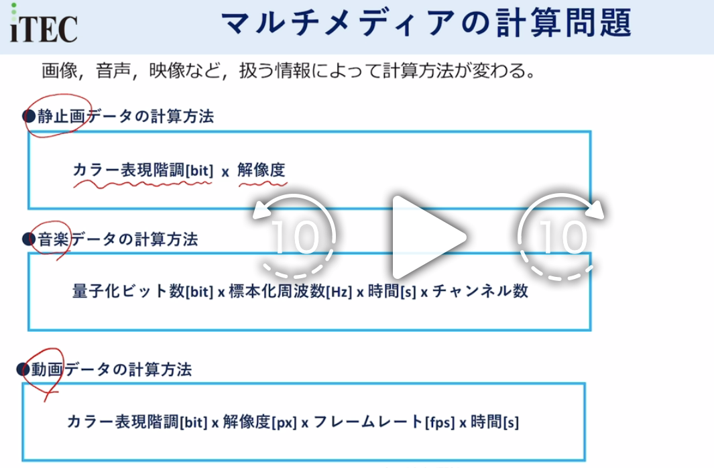

# 多媒体的计算公式

## 一、静止画データ（画像）の計算
### 公式
\[
\boxed{データ量[bit] = カラー表現階調[bit] \times 解像度}
\]

### 用語と読み方
- 静止画（せいしが / seishiga）：静止图像
- カラー表現階調（カラーひょうげんかいちょう / karā hyōgen kaichō）：色彩深度/色阶（单位bit）
- 解像度（かいぞうど / kaizōdo）：分辨率（宽×高的像素总数）

---

## 二、音楽データ（音声）の計算
### 公式
\[
\boxed{データ量[bit] = 量子化ビット数[bit] \times 標本化周波数[Hz] \times 時間[s] \times チャンネル数}
\]

### 用語と読み方
- 音楽（おんがく / ongaku）：音乐/音频
- 量子化ビット数（りょうしかビットすう / ryōshika bitto sū）：量化位数（位深，单位bit）
- 標本化周波数（ひょうほんかしゅうはすう / hyōhonka shūhasū）：采样率（单位Hz）
- 時間（じかん / jikan）：时长（单位秒s）
- チャンネル数（チャンネルすう / channeru sū）：声道数（如单声道1、立体声2）

---

## 三、動画データの計算
### 公式
\[
\boxed{データ量[bit] = カラー表現階調[bit] \times 解像度[px] \times フレームレート[fps] \times 時間[s]}
\]

### 用語と読み方
- 動画（どうが / dōga）：视频/动画
- カラー表現階調（同上）：色彩深度（bit）
- 解像度（同上）：分辨率（像素px）
- フレームレート（ふれーむれーと / furēmu rēto）：帧率（fps，每秒帧数）
- 時間（同上）：时长（秒s）

---

💡 小技巧
这三个公式可以用一句话串联记忆：
- 静止画：**色阶 × 像素总数**
- 音频：**位深 × 采样率 × 时间 × 声道**
- 视频：**静止画公式 × 帧率 × 时间**

# 「チェックディジット（校验位）」

### 一、标题与核心定义
**チェックディジット**
→ **校验位（Check Digit）**

> チェックディジットとは、入力した数値に誤りがないか、データの正しさを確認するための付加データのことです。
→ **校验位，是为了检查输入的数值是否有误、确认数据正确性而附加的一位数据。**

### 二、示例说明
> 例：与えられた数の総和の1の位をチェックディジットとする場合
→ **例：将给定数字的总和的个位数作为校验位时**

图中的例子：
- 原始数据：`5213 1212 321`
- 计算：`5+2+1+3 + 1+2+1+2 + 3+2+1 = 23`
- 校验位取总和的个位数：`3`
- 最终数据：`5213 1212 3213`（末尾的`3`就是校验位）

### 三、补充说明
> ※チェックディジットのロジックは、問題や開発方針によって異なる
→ **注：校验位的计算逻辑，会根据题目或开发规范而有所不同。**

💡 一句话理解：
校验位就是在一串数字后面，通过固定算法算出的一个“验证码”，用来快速判断整串数字有没有输错。

# 音频相关的计算例题

## 1. 题目翻译与条件整理
**日文原文**：
音声のサンプリングを1秒間に11,000回行い、サンプリングした値をそれぞれ8ビットのデータとして記録する。このとき、$512 \times 10^6$ バイトの容量をもつフラッシュメモリに記録できる音声の長さは、最大何分か。

**中文翻译**：
对音频进行采样，每秒采样11,000次，每个采样值用8bit的数据记录。此时，容量为 $512 \times 10^6$ 字节的闪存，最多能记录多长时间的音频？（单位：分钟）

---

## 2. 音频数据量公式（回顾）
音频数据量的核心公式是：
\[
\text{データ量(bit)} = \text{量子化ビット数(bit)} \times \text{標本化周波数(Hz)} \times \text{時間(s)} \times \text{チャンネル数}
\]

本题中：
- 量子化ビット数：8 bit
- 標本化周波数：11,000 Hz（每秒采样11,000次）
- チャンネル数：题目没提，默认单声道（=1）
- 时间 $t$：我们要求的变量（单位：秒）
- 总容量：$512 \times 10^6$ 字节，注意要转成 bit 计算

---

## 3. 计算步骤
### 步骤1：计算1秒音频的数据量（bit）
\[
\text{1秒データ量} = 8\ \text{bit} \times 11,000\ \text{Hz} \times 1 = 88,000\ \text{bit/s}
\]
换算成字节（1字节=8bit）：
\[
88,000\ \text{bit/s} \div 8 = 11,000\ \text{Byte/s}
\]

### 步骤2：用总容量除以每秒数据量，求总时长（秒）
总容量是 $512 \times 10^6$ 字节，所以：
\[
\text{総時間(秒)} = \frac{512 \times 10^6\ \text{Byte}}{11,000\ \text{Byte/s}}
\]
\[
= \frac{512,000,000}{11,000} = \frac{512,000}{11} \approx 46545.45\ \text{秒}
\]

### 步骤3：秒换算成分钟
\[
\text{分} = \frac{46545.45}{60} \approx 775.76\ \text{分}
\]

这个结果和选项中的 **ウ 775** 最接近。

---

## 4. 关键考点
1.  **单位转换**：总容量是字节，采样数据量计算时要统一单位（要么都用bit，要么都用字节）。
2.  **单声道/立体声**：题目没提多声道，默认是单声道（通道数=1）。
3.  **公式变形**：本题是已知总容量，反推时间，公式变形为：
    \[
    t = \frac{\text{総容量}}{\text{1秒あたりのデータ量}}
    \]

✅ 正解：**ウ 775**

# 做题笔记

# コンピュータグラフィックス 计算机图形学

## 知识点1： テクスチャマッピング（Texture Mapping / 纹理映射）
### 核心定义
- **日文原文**：物体の表面に、別に定義された画像（テクスチャ）を張り付け、表面の模様や質感を表現する技術。
- **中文解释**：将二维的纹理图像贴到三维模型表面，模拟木纹、皮肤、布料等材质细节，在不增加模型面数的前提下提升真实感。
- **关键流程**：UV映射 → 纹理采样 → 贴到模型表面。

## 知识点2： メタボール（Metaball / 元球）
### 核心定义
- **日文原文**：複数の球体が融合して、柔らかく滑らかな有機的な形状を生成するモデリング技術。
- **中文解释**：通过多个球体的“引力场”互相融合，生成类似液体、肌肉、云朵的柔软有机形状，常用于角色建模、流体模拟。
- **特点**：形状由球体的位置和半径决定，表面会自动平滑过渡，没有尖锐棱角。

## 知识点3：ウ ラジオシティ法（Radiosity / 辐射度算法）
### 核心定义
- **日文原文**：拡散反射面間の相互反射による光の影響を考慮し、面の輝度を計算する大域照明アルゴリズム。
- **中文解释**：一种全局光照算法，专门模拟**漫反射物体之间的多次反射**（比如红墙被白墙照到后，墙面也会泛出淡红色），让光照效果更真实柔和。
- **核心逻辑**：把场景分成多个小面，计算每个面之间的光能量传递，最终确定每个面的亮度。

### 题目描述的正确性
题目里说「ラジオシティ法は、拡散反射面間の相互反射による効果を考慮して拡散反射面の輝度を決める」，完全符合其定义。
- 它的核心就是计算物体间的间接漫反射光，所以是**正确选项**。

## 知识点4：エ レイトレーシング（Ray Tracing / 光线追踪）
### 核心定义
- **日文原文**：視点から発射した光線の反射・屈折・透過の経路を追跡し、物体の輝度・影・反射などを高精度に計算するレンダリング技術。
- **中文解释**：通过模拟光线在场景中的传播路径，计算反射、折射、阴影、全局光照等效果，生成照片级真实感的图像。
- **特点**：效果真实，但计算量大，常用于电影渲染、高端游戏。

### 题目描述的错误点
题目里说「レイトレーシングは…物体の表面に、別に定義された模様を張り付けて画像を作成する」。
- 这描述的是**テクスチャマッピング（纹理映射）**的定义，和光线追踪无关。
- 光线追踪只管“算光线路径”，不管“贴图案”。

---

## 关键对比表（帮你彻底分清）
| 技术 | 核心用途 | 题目描述的错误对应 |
| :--- | :--- | :--- |
| テクスチャマッピング | 给模型贴图案，表现材质细节 | 被错误描述成「做隐面消去」（实际是光线追踪的工作） |
| メタボール | 生成柔软有机形状的建模技术 | 被错误描述成「算光照亮度」（实际是辐射度算法的工作） |
| ラジオシティ法 | 计算物体间漫反射光的全局光照 | 题目描述和定义完全一致 |
| レイトレーシング | 追踪光线路径，计算反射/折射/阴影 | 被错误描述成「贴图案」（实际是纹理映射的工作） |

💡 一句话口诀帮你记忆：
- 纹理映射：贴图案，不做消隐。
- 元球：造软形，不算光照。
- 辐射度：算漫反射，定亮度。
- 光线追踪：追光线，算反射折射。

# プルダウンメニュー  下拉菜单 Pull-down menu
---

### 题目原文
ある商店では、約200品目の商品を取り扱っている。商品データの新規登録画面の入力項目のうち、入力方式として**プルダウンメニュー**を用いるのが適しているものはどれか。

### 翻译
某商店经营约200种商品。在商品数据的新注册界面的输入项目中，**最适合使用下拉菜单（プルダウンメニュー）作为输入方式的是哪一项？**

---

### 选项翻译与分析
|  | 项目 | 样式与规则 | 是否适合下拉菜单 |
|---|---|---|---|
| ア | 商品番号 | 5位的英文数字项目，每个商品都有独立编号 | ❌ 每个商品编号唯一，下拉菜单无法覆盖200个选项，且输入效率低，不适合 |
| イ | 商品名 | 40字以内的日语项目，每个商品独立命名 | ❌ 商品名各不相同，无法用固定选项的下拉菜单输入 |
| ウ | 商品区分 | 10字以内的日语项目，共**5个分类** | ✅ 只有5个固定选项，非常适合用下拉菜单选择，能防止输入错误、提高效率 |
| エ | 価格 | 6位数字项目，范围为10,000～100,000日元 | ❌ 价格范围宽、数值多，不适合用下拉菜单，一般用数字输入框 |

---

### 考点总结
这道题的核心是：**下拉菜单适合「选项数量有限、固定不变」的输入项**，比如分类、状态、地区等。
- 选项数量少（通常≤10个）
- 选项固定，不会频繁新增/修改
- 能避免用户输入错误

✅ 正解：**ウ（商品区分）**

「区分」这个词，我们分开讲读音和用法👇
1. 读音
音读：くぶん（kubun）
例：商品区分（しょうひんくぶん /shōhin kubun）
训读：わ・ける（wakeru，动词形式「分ける」），名词形式「分け（わけ /wake）」

帯域幅（たいいきはば）知识点讲解
1. 读音 & 英文
日文：帯域幅
读音：たいいきはば（taiiki haba）
英文：Bandwidth
中文：带宽 / 频带宽度

# SVG

## 题目翻译
W3Cで仕様が定義され、矩(く)形や円、直線、文字列などの図形オブジェクトをXML形式で記述し、Webページでの図形描画にも使うことができる画像フォーマットはどれか。
→ 由W3C定义规范，能用XML形式描述矩形、圆形、直线、文字等图形对象，也可用于网页图形绘制的图像格式是哪一个？

## 选项逐一解析
### ア OpenGL
- 全称：Open Graphics Library
- 性质：**图形编程API**，不是图像文件格式
- 作用：用于2D/3D图形渲染的开发接口，比如游戏、CAD软件会用到
- ❌ 不符合题目里“XML形式描述、图像格式”的条件

### イ PNG
- 全称：Portable Network Graphics
- 性质：**位图图像格式**
- 特点：无损压缩、支持透明背景，是网页常用的图片格式
- 但它是像素点阵格式，**不能用XML描述图形对象**，放大后会模糊
- ❌ 不符合题目里“XML形式描述”的核心条件

### ウ SVG ✅（正确答案）
- 全称：Scalable Vector Graphics（可缩放矢量图形）
- 性质：**基于XML的矢量图像格式**，由W3C制定标准
- 核心特点：
  1.  用XML标签描述图形（比如`<rect>`矩形、`<circle>`圆形、`<line>`直线、`<text>`文字）
  2.  矢量图形，放大缩小都不会模糊
  3.  可以直接嵌入网页，支持交互和动画
- ✅ 完全符合题目里“W3C定义、XML形式描述图形对象、网页绘图”的所有条件

### エ TIFF
- 全称：Tagged Image File Format
- 性质：**位图图像格式**
- 特点：无损压缩、支持多图层，常用于印刷、专业摄影领域
- ❌ 它也是像素格式，和XML、矢量图形无关

---

## 核心知识点总结
| 选项 | 类型 | 关键特征 |
| :--- | :--- | :--- |
| OpenGL | 图形API | 用于3D渲染开发，非图像格式 |
| PNG | 位图格式 | 网页常用，像素点阵，不支持XML描述 |
| SVG | 矢量图像格式 | W3C标准，XML描述图形，可缩放、网页可用 |
| TIFF | 位图格式 | 印刷/专业领域用，和XML无关 |

💡 一句话区分：
只有 **SVG** 是「XML写的矢量图形格式」，其他要么是API，要么是像素图。

我帮你把这段Web可访问性（アクセシビリティ）的解析，整理成结构化的核心要点👇

---

## 一、アクセシビリティ（可访问性）的定义
- 核心概念：包括老年人、残障人士在内的**所有人**，都能无阻碍地使用各种产品/服务的程度。
- 网页场景中，专门称为 **Webアクセシビリティ（Web可访问性）**。
- 相关标准：JIS X 8341-3，以及W3C制定的WCAG（Web内容无障碍指南）。

---

## 二、题目中各选项的可访问性分析
### ✅ ウ（正确做法）
**「必填项目，除了用颜色强调，还要在项目名旁明确标注“(必須)”」**
- 合理性：仅靠颜色标记，色弱/色盲用户可能无法识别；加上文字标注，能确保所有用户都明确理解。
- 核心原则：**避免单一感官依赖**，用“颜色+文字”的双重方式传递信息。

---

### ❌ ア（错误做法）
**「网页加载时自动播放声音」**
- 问题：在嘈杂/听不清声音的环境下无法使用，还会干扰使用屏幕阅读器的视障用户。
- WCAG推荐做法：自动播放的声音必须在3秒内停止，或仅在用户主动请求时播放。

---

### ❌ イ（不推荐做法）
**「用表格进行网页布局」**
- 问题：会导致屏幕阅读器读取内容时顺序混乱，影响视障用户的使用体验。

---

### ❌ エ（错误做法）
**「将链接图片的alt属性设为链接URL」**
- 正确做法：alt属性应描述图片/链接的**用途或内容**（如“查看详情”），而非直接写URL，否则屏幕阅读器用户无法理解链接目的。

---

## 三、可访问性设计的核心原则
1.  **信息传递多方式**：不依赖单一感官（如仅靠颜色、仅靠声音），提供文字/颜色/标签等多种形式。
2.  **避免干扰性自动行为**：自动播放声音、自动跳转等会影响辅助技术用户的使用。
3.  **合理使用网页标签**：避免滥用表格、用alt属性正确描述图片内容，确保屏幕阅读器能正确解析。

---

💡 一句话总结：Web可访问性的核心，是**让所有用户（包括使用辅助技术的用户）都能平等获取信息**，不能只考虑普通用户的体验。

#  H.264/MPEG-4 AVC 

## 知识点：H.264/MPEG-4 AVC
- **全称**：H.264 / MPEG-4 Advanced Video Coding
- **本质**：一种**视频数据的压缩编码方式（圧縮符号化方式）**
- **用途**：广泛用于网络视频、蓝光光盘、电视广播、视频通话等场景，特点是压缩效率高，能在低带宽下传输高质量视频。

## 选项解析
| 选项 | 日文原文 | 解析 |
| :--- | :--- | :--- |
| ア | インターネットで動画や音声データのストリーミング配信を制御するための通信方式 | ❌ 这是RTSP/RTMP等**流媒体控制协议**的作用，不是H.264 |
| イ | テレビ会議やテレビ電話で双方向のビデオ配信を制御するための通信方式 | ❌ 这是视频会议相关的**通信协议**（如SIP），不是视频编码方式 |
| ウ | テレビの電子番組案内で使用される番組内容のメタデータを記述する方式 | ❌ 这是EPG（电子节目指南）元数据的描述方式，和H.264无关 |
| エ | ワンセグやインターネットで用いられる動画データの圧縮符号化方式 | ✅ 正确。H.264正是用于地面数字电视（ワンセグ）、网络视频的视频压缩编码方式 |

## 一句话总结
H.264/MPEG-4 AVC 是**视频压缩编码标准**，不是通信协议、也不是流媒体控制方式。

# 知识点整理：常见代码编码方式
核心考点：**哪种编码方式能通过代码值直接联想到数据对象？**

## 1. ニモニックコード（Mnemonic Code / 助记码）✅ 正确答案
- **核心定义**：
  利用与数据对象相关的缩写/符号组成的代码，目的是帮助人类记忆，看到代码就能直接联想到对象。
- **英文词源**：`mnemonic` 意为“帮助记忆的”。
- **典型例子**：
  - 汇编语言的指令符号：加法指令用 `ADD`，减法指令用 `SUB`
  - 商品代码：「りんご（苹果）」用 `RIN`，「ばなな（香蕉）」用 `BAN`
- **特点**：代码本身带有含义，无需额外规则解析，直接可联想对象。

## 2.  シーケンスコード（Sequence Code / 顺序码）
- **核心定义**：按固定顺序（如自然数、字母顺序）分配的流水号代码。
- **例子**：员工号 `1001`、`1002`，按顺序编号。
- **特点**：代码本身无任何含义，仅用于区分对象，无法联想到对象内容。

## 3.  デシマルコード（Decimal Code / 数字码/十进制码）
- **核心定义**：用十进制数字的每一位分别赋予含义，也叫“位别代码”。
- **典型例子**：图书馆的图书分类号，每一位数字代表不同的分类层级。
- **特点**：需要按位解析才能理解含义，无法直接从单个数字联想到对象。

## 4.  ブロックコード（Block Code / 块码/区分码）
- **核心定义**：将代码划分为多个“块（区间）”，每个块代表不同的分类含义，块内再按顺序分配编号。
- **特点**：代码的结构有分类含义，但需要先了解块的划分规则，才能解析对象信息，无法直接联想。

---

### 对比总结表
| 编码方式 | 能否直接联想到对象 | 核心特点 |
| :--- | :--- | :--- |
| ニモニックコード | ✅ 可以 | 代码是对象的缩写/助记符号，一看就懂 |
| シーケンスコード | ❌ 不能 | 纯流水号，无额外含义 |
| デシマルコード | ❌ 不能 | 十进制每一位有含义，需按位解析 |
| ブロックコード | ❌ 不能 | 分块赋予分类含义，需先了解块规则 |

💡 一句话速记：
只有**ニモニックコード（助记码）**是为了“让人一看就懂、帮助记忆”而设计的，其他编码方式都需要额外规则才能理解含义。

# ビットマップフォント 位图字体   アウトラインフォント 轮廓字体
「相比于位图字体（ビットマップフォント），更适合使用轮廓字体（アウトラインフォント）的场景是哪一个？」

## 核心概念科普
### 1. ビットマップフォント（Bitmap Font / 位图字体）
- **原理**：每个字符都是一张固定分辨率的像素点阵图片。
- **特点**：
  - 显示速度快，不需要额外计算。
  - 放大/缩小会出现锯齿、模糊，变形严重。
  - 适合固定分辨率、固定大小的场景（如早期游戏、系统界面）。

### 2. アウトラインフォント（Outline Font / 轮廓字体，也叫矢量字体）
- **原理**：用数学曲线描述字符的轮廓（比如TrueType、OpenType），渲染时再按指定大小绘制。
- **特点**：
  - 可以任意放大缩小，边缘依然平滑清晰。
  - 渲染需要计算，显示速度比位图字体慢。
  - 适合需要缩放、多分辨率的场景（如文档、网页、现代系统）。

---

## 选项解析
| 选项 | 日文原文 | 解析 |
| :--- | :--- | :--- |
| ア | 英数字だけでなく、漢字も表示する。 | ❌ 两种字体都能表示汉字/英数字，不是轮廓字体独有的优势。 |
| イ | 各文字の幅を一定にして表示する。 | ❌ 等宽字体（如Courier）两种格式都支持，不是轮廓字体的特点。 |
| ウ | 画面上にできるだけ高速に表示する。 | ❌ 位图字体显示更快，轮廓字体需要渲染计算，速度不占优势。 |
| エ | 任意の倍率で文字を拡大して表示する。 | ✅ 轮廓字体的核心优势：可以无损缩放，任意倍率放大都清晰；位图字体放大后会出现锯齿、模糊。 |

---

✅ **正确答案：エ（D选项）**

💡 一句话记忆：
- **位图字体**：快，但放大糊。
- **轮廓字体**：慢，但缩放清晰。
题目问“轮廓字体更适合的场景”，自然就是**需要放大/缩放文字的场景**。

# 题目翻译
以下哪一项是输入画面设计的恰当方针？

---

### 选项解析
#### ア（A）✅ 正确
> 画面の操作性を向上させるために、関連する入力項目は隣接するように配置する。
> 为了提升画面的操作性，将相关的输入项目相邻配置。

- 这是界面设计的基本原则之一（分组/就近原则）。把相关的输入项放在一起，用户操作时视线和鼠标移动路径更短，操作更顺畅。

#### イ（B）❌ 错误
> 初心者でも操作が容易になるように、コマンド入力方式を採用する。
> 为了让初学者也容易操作，采用命令输入方式。

- 命令输入（如`/add 100`）对初学者并不友好，需要记忆指令，一般不推荐作为面向普通用户的界面设计。

#### ウ（C）❌ 错误
> 入力の誤りに対するエラーメッセージは、“入力が誤っています”に統一する。
> 输入错误时的错误信息，统一为“输入有误”。

- 模糊的错误信息无法帮助用户定位问题（比如是格式错了？还是范围错了？），好的设计应该给出具体提示，比如“请输入10-100之间的数字”。

#### エ（D）❌ 错误
> 利用者の操作が容易になるように、入力画面には詳細な使用方法を表示する。
> 为了方便用户操作，在输入画面上显示详细的使用方法。

- 输入画面如果堆满了冗长的说明文字，反而会造成信息过载，影响用户的操作体验。详细说明应该放在帮助文档或工具提示里，而不是直接堆在界面上。

---

✅ **正确答案：A（ア）**

滑らか（なめらか） 
表面光滑、平滑
动作 / 变化流畅、顺滑、不卡顿

日文术语	英文	中文翻译	核心含义
ア アンチエイリアシング	Anti-aliasing	抗锯齿	消除图像边缘的锯齿感，让线条和轮廓看起来更平滑（也就是你之前问的「滑らか」效果）。
イ シェーディング	Shading	着色 / 明暗处理	根据光照计算物体表面的明暗、阴影和颜色变化，让 3D 模型看起来更立体、有真实感。
ウ テクスチャマッピング	Texture Mapping	纹理映射 / 贴图	把二维的纹理图片 “贴” 到三维模型表面，模拟木纹、皮肤、布料等材质细节。
エ バンプマッピング	Bump Mapping	凹凸映射	通过纹理模拟物体表面的凹凸感（比如砖墙、木纹的粗糙感），但不改变模型本身的几何形状。

