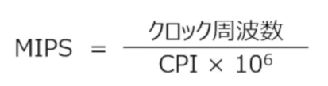

# アナログデータとデジタルデータ

アナログデータ（Analog Data） 模拟数据 ：用连续变化的物理量来表示的信息

デジタルデータ（Digital Data）数字数据

アナログデータ（Analog Data）：指连续变化的数据，比如温度、声音、电压信号等，数值在某个区间内可以取任意值。 
デジタルデータ（Digital Data）：指离散的、以数值形式表示的数据，用二进制等数字形式存储和处理，只能取有限个明确的值。

日文原文	读音（罗马音）	中文翻译
ドットの数	dotto no kazu	像素点的数量（dot = 像素点）
区切られた 1 つ 1 つがドット	kugirareta hitotsu hitotsu ga dotto	被划分开的每一个格子，就是一个像素点
解像度が高い	kaizōdo ga takai	分辨率高
解像度が低い	kaizōdo ga hikui	分辨率低

解像度 分辨率

# PCM变换
PCM 的全称是 Pulse Code Modulation，中文标准译名为 脉冲编码调制。
就是把这个连续的波形，转换成计算机能识别的离散数字信号，而这个转换的核心就是PCM 变换

日文术语	中文翻译	英文对应	作用说明
標本化	采样 / 抽样	Sampling	按固定时间间隔，对连续的声波信号 “拍快照”，把时间上连续的信号变成离散的采样点。比如常见的 44.1kHz 采样率，就是每秒采集 44100 次。

量子化	量化	Quantization	把每个采样点的信号幅度，近似成一个固定的数字等级。比如 16 位量化，就是把信号分成 65536 个等级，把连续的幅度值变成离散的数字。

符号化	编码	Encoding	把量化后的数字值，转换成二进制的 0 和 1 序列，最终变成计算机可以存储、传输的数字音频数据。

標本化 ひょうほんか
量子化 りょうしか
符号化 ふごうか

## 標本化
一定時間単位でデータを区切り標本を抽出（按固定时间单位分割数据，抽取样本）

抽出 　ちゅうしゅつ

采样周期：两次采样之间的时间间隔，公式是：
采样周期 = 1 ÷ 采样频率
采样频率（サンプリング周波数）：
1 秒内进行采样的次数，单位是 Hz（赫兹）

我们平时说的 44.1kHz、48kHz 音频，指的就是采样频率，44.1kHz 就是每秒对声音信号采样 44100 次。　

アクチュエータ（actuator，执行器 / 促动器）
中文标准译法：执行器 / 促动器，也常被称为 “驱动器

简单说，它就是一个 **“电信号→机械动作” 的转换器 **：
给它一个电信号（比如电压、电流）
它就能输出对应的物理动作（比如转动、推拉、开关）

## 機器の制御方式

機器　きき　　设备的控制方式

① シーケンス制御   顺序控制 / 时序控制
予め定められた順序や条件に従って機器を制御
按照预先设定好的顺序和条件来控制设备

举例说明（洗衣机的例子）
原文：
水が出る ⇒ 一定の水位で水が止まる ⇒ 回転スタート ⇒ 排水…
翻译：
进水 ⇒ 达到设定水位后停止进水 ⇒ 开始旋转洗涤 ⇒ 排水…

② フィードバック制御 Feedback Control
反馈控制
外乱の影響をセンサで検知してコンピューターが修正
用传感器检测外界干扰带来的影响 / 偏差，再由控制器（计算机）进行修正调整。

空调例子：
扉が開けると冷気が入る（外乱の影響） → 门打开，热空气进入房间（这就是外界干扰的影响）
冷気を検知して風量を上げる → 传感器检测到温度变化后，空调提高风量制冷，把温度拉回设定值

③ フィードフォワード制御（前馈控制） Feedforward Control
核心说明：外乱の影響を予測して予め修正
→ 预测外界干扰的影响，提前进行修正调整

# 硬件 ハードウェア

## 5大装置
制御装置（せいぎょそうち /seigyo sōchi）
命令を解釈してコンピューターの動作を制御 解释指令，并控制计算机的整体运作
它就是我们常说的 Control Unit (CU)，是 CPU 的核心组成部分之一。它的作用是从内存中读取指令、解码指令，然后协调计算机的各个部件按指令的要求完成操作。

解釈 かいしゃく

演算装置（えんざんそうち /enzan sōchi）
运算单元（算术逻辑单元）：执行数据的计算与运算处理
它就是我们常说的 Arithmetic Logic Unit (ALU)，也是 CPU 的核心组成部分。它专门负责执行所有的算术运算（加减乘除）和逻辑运算（与、或、非、比较）。

记忆装置 分为两类
主記憶装置（しゅきおくそうち / 主存储器）
補助記憶装置（ほじょきおくそうち / 辅助存储器）

项目	主記憶装置（主存 / 内存）	補助記憶装置（辅存 / 外存）
用途	临时存储 CPU 正在处理的数据	长期保存数据和文件
速度	读写速度快	读写速度慢
容量	容量较小（常见 8GB/16GB/32GB）	容量大（常见 512GB/1TB/2TB）
数据保存	断电数据消失	断电数据不丢失
代表设备	RAM（内存条）	HDD 机械硬盘、SSD 固态硬盘、U 盘

入力装置

出力装置 

## ノイマン型コンピューター
冯・诺依曼型计算机

2. 核心定义
它是现代计算机最主流的体系结构，由数学家冯・诺依曼提出，核心特点是：
程序与数据存储在同一存储器中：指令和数据都以二进制形式存放在同一个内存里，CPU 可以按地址读取指令和数据；
以运算器（ALU）为中心：早期的设计中，运算器是核心，控制器协调输入输出和存储设备；
采用 “存储程序” 的工作方式：把要执行的程序先存入内存，再由 CPU 按顺序读取并执行指令。

3. 关键特点与组成
冯・诺依曼型计算机的五大基本部件：
运算装置（ALU）：负责数据的算术和逻辑运算
制御装置（CU）：解释指令、控制各部件协同工作
主記憶装置（内存）：存储程序和数据
入力装置：输入数据和指令（如键盘、鼠标）
出力装置：输出处理结果（如显示器、打印机）

## 两大特点

### プログラム内蔵方式 （ないぞうほうしき）
程序内置方式 / 存储程序方式

把程序（指令序列）和数据都以二进制的形式，预先存入同一个主存储器中。CPU 在运行时，会按地址依次从内存中读取指令、解码、执行，实现自动连续运算

### 逐次制御方式 ちくじ せいぎょ ほうしき

顺序控制方式 / 串行控制方式

计算机的指令按存储顺序一条接一条地执行，前一条指令执行完成后，才会开始下一条指令的取指、解码和执行，整个过程是串行、顺序的。

レジスタ（Register，寄存器）
寄存器：临时保存指令和数据的 CPU 内部存储装置

プログラムカウンタ（プログラムレジスタ）
程序计数器（程序寄存器，PC）：记忆下一条要执行的指令的地址

命令レジスタ  指令寄存器（IR） 临时记忆正在执行的指令

汎用レジスタ 通用寄存器  不限制用途、可用于各种主要目的的通用寄存器

### 1. 命令部（めいれいぶ / Meireibu）
- 原文：`命令部：命令を格納`
- 翻译：**指令部分：存放指令（操作码）**
- 说明：
  指令的「命令部」也叫**操作码（Opcode）**，它记录了CPU要执行的具体操作（比如加法、减法、跳转、存储等）。控制单元（CU）就是靠解析这部分内容，来决定让运算器执行什么指令。

### 2. オペランド部（Operando-bu）
- 原文：`オペランド部：対象データがどこにあるか格納`
- 翻译：**操作数部分：存放对象数据所在的位置（地址/值）**
- 说明：
  指令的「オペランド部」就是**操作数（Operand）**，它告诉CPU去哪里找要处理的数据。
  比如：
  - 直接给出数据（立即数）；
  - 给出寄存器编号（从寄存器里取数）；
  - 给出内存地址（从内存里取数）。

オペランド（operand） 是计算机科学中的基础术语，中文标准译名为 操作数。
在计算机指令和运算中，它指的是被操作、被运算的数据或数据的位置，是指令执行时的 “对象”。

# 命令の構成とアドレス指定方式

指令的构成与寻址方式
指令的构成：
指机器指令的基本组成，就是我们之前说的「命令部（操作码 / Opcode）」+「オペランド部（操作数 / Operand）」。

寻址方式：

它也叫地址模式 / 寻址模式，是 CPU 找到操作数的规则和方法。比如：
直接寻址：直接给出数据所在的内存地址
寄存器寻址：直接给出存放数据的寄存器编号
立即数寻址：直接给出数据本身
不同的寻址方式，决定了 CPU 如何获取要操作的数据。

## 即値アドレス指定方式
そくち
立即寻址方式 / 立即数寻址
这是一种最简单的寻址方式，特点是：指令的操作数部分，直接给出数据本身，而不是数据的地址或寄存器编号。CPU 不需要额外去内存或寄存器里取数，直接拿指令里的数来执行操作，速度非常快。
举个例子：汇编指令 MOV AX, 5 里的 5，就是用立即寻址方式给出的立即数。
操作码 MOV：告诉 CPU “把数据移动到 AX 寄存器”
操作数 5：直接给出要移动的数据本身，就是立即寻址

## 直接アドレス指定方式
读音：ちょくせつアドレスして
直接给出数据所在的内存地址，CPU 会直接根据这个地址去内存中读取数据。
汇编指令 MOV AX, [1000H] 里的 [1000H] 就是直接寻址方式：
操作码 MOV：告诉 CPU “把数据移动到 AX 寄存器”
操作数 [1000H]：直接给出数据所在的内存地址（1000H），CPU 会去内存的 1000H 地址里取数。

## 間接アドレス指定方式 かんせつアドレスしていほうしき
间接寻址方式

间接寻址是一种 “二次取址” 的寻址方式，特点是：指令的操作数部分，给出的不是数据本身，也不是数据的直接地址，而是 **“地址的地址”**。
CPU 需要先根据指令给出的地址，去内存中读取真正的数据地址，再根据这个地址去取数据。
举个例子：指令中给出的地址是 2000H，内存 2000H 单元里存的是 3000H，而 3000H 才是数据的真正地址：
第一步：CPU 根据指令的 2000H，去内存读取 3000H（真正的地址）
第二步：CPU 再根据 3000H，去内存读取最终数据

## インデックスアドレス指定方式

变址寻址方式 / 索引寻址方式
这是一种带偏移的寻址方式，特点是：指令给出一个基地址，再加上一个变址寄存器（Index Register）里的偏移值，两者相加才是数据的真正地址。
公式：有效地址 = 基地址 + 变址寄存器的值
举个例子：指令给出基地址 1000H，变址寄存器里的值是 05H，那么真正的数据地址就是 1000H + 05H = 1005H。
补充特点：
优点：非常适合处理数组、循环等批量数据，只要修改变址寄存器的值，就能访问连续的数据，灵活性极高
缺点：需要额外的加法运算，执行速度比直接寻址稍慢

## ベースアドレス指定方式

基址寻址方式 / 基址变址寻址方式

基址寻址：基地址存放在基址寄存器（Base Register）中，偏移量由指令直接给出
公式：有效地址 = 基址寄存器的值 + 指令中的偏移量
基址寄存器里存的基地址是 1000H，指令给出的偏移量是 05H，那么最终地址就是 1000H + 05H = 1005H。

补充特点：
优点：地址可动态调整，适合程序重定位（比如程序加载到不同内存位置时，只需修改基址寄存器的值即可正常运行）
缺点：同样需要一次加法运算，执行速度比直接寻址稍慢

方式	基地址来源	偏移量来源	典型用途
基址寻址	基址寄存器	指令直接给出	程序重定位、段式管理
变址寻址	指令直接给出	变址寄存器	数组遍历、循环批量数据处理

読み込むメモリの場所が異なっていても 相対的な位置関係を保つことで同じデータを取得可能
即使加载到内存的位置不同，只要保持（程序与数据间的）相对位置关系不变，就能正确获取到相同的数据。

## 相対アドレス指定方式
そうたい

相对寻址方式
核心解读
相对寻址是一种以程序计数器（PC，Program Counter）的值为基准的寻址方式，主要用于跳转指令。
公式：有效地址 = 当前指令地址（PC值） + 指令中的偏移量
举个例子：当前指令地址是 1000H，指令给出的偏移量是 +05H，那么跳转的目标地址就是 1000H + 05H = 1005H。
💡 补充特点：
优点：地址是相对的，程序加载到内存的任何位置都能正常跳转，天生支持程序重定位，是实现可重入代码、位置无关代码的基础
缺点：偏移量受指令长度限制，跳转范围有限

# 做题笔记

ノンプリエンプティブなスケジューリング
Non-preemptive
Preemptive：源自 preempt，意为 “抢占、剥夺”
整体含义：不可抢占的、非剥夺的
スケジューリング (Scheduling)
源自英文 scheduling，意为调度（任务 / 进程调度）

非抢占式调度是一种任务调度策略，特点是：一旦某个任务开始执行，就会一直运行到它主动放弃 CPU（比如进入等待状态、任务结束）为止，中途不会被其他任务强行打断。

## MapReduce

我帮你把这道题和相关的知识点，用最直白的方式总结一下，你一看就懂：

---

## 一、题目在问什么？
题目要求找一个同时满足两个条件的开源软件（OSS）：
1.  能提供**由大量服务器组成的大规模分布式文件系统**
2.  能实现**基于MapReduce的大规模数据分布式处理**

---

## 二、正确答案：Apache Hadoop（ア）
它的核心组成，正好对应题目里的两个条件：
- **HDFS（Hadoop Distributed File System）**：分布式文件系统，把文件分散存到很多台服务器上，解决海量数据的存储问题。
- **MapReduce**：分布式处理框架，把一个大任务拆分成很多小任务，交给多台服务器并行处理，解决海量数据的计算问题。

所以，Hadoop是唯一同时满足题目两个条件的选项。

---

## 三、其他选项是什么？（帮你区分一下）
| 选项 | 名称 | 核心定位 | 一句话理解 |
| :--- | :--- | :--- | :--- |
| イ | Apache Kafka | 分布式消息队列 | 专门用来收集、传输、分发实时数据流（比如网站点击日志），不做文件存储和MapReduce计算 |
| ウ | Apache Spark | 高速分布式处理框架 | 也是做大数据计算，但比Hadoop快很多，数据直接存在内存里，它不是文件系统 |
| エ | Apache Storm | 实时流处理框架 | 专门处理源源不断的实时数据（比如物联网传感器数据），不做文件存储 |

---

## 四、知识点一句话总结
- **Hadoop = HDFS（分布式存储） + MapReduce（分布式计算）**，是大数据处理的基础平台。
- Spark、Storm、Kafka都是大数据生态里的工具，但它们各司其职，没有同时包含“文件系统+MapReduce”这两个核心功能。

---
💡 小补充：
- 题目里的OSS = Open Source Software，就是开源软件的意思。
- MapReduce是一种“分而治之”的计算思想，先把大任务拆分（Map），再汇总结果（Reduce）。

### 日文原文
多数のサーバで構成された大規模な分散ファイルシステム機能を提供し、MapReduceによる大規模データの分散処理を実現するOSSはどれか。
（H30春-FE 問20）

ア Apache Hadoop
イ Apache Kafka
ウ Apache Spark
エ Apache Storm

1つ選択してください:

### 中文翻译
下列哪一个开源软件（OSS），能够提供由多台服务器构成的大规模分布式文件系统功能，并实现基于MapReduce的大规模数据分布式处理？
（H30春-FE 问题20）

A Apache Hadoop
B Apache Kafka
C Apache Spark
D Apache Storm

请选择一个：

---

## 第二张图片（解析文本1）
### 日文原文
OSS（Open Source Software）とは、ソースコードが公開されているソフトウェアであり、利用者がライセンスで定められた一定の条件に従って、自由にソースコードを利用，改変，再配布することができる。

Apacheは、Webクライアントからのリクエストに応えてHTMLファイルや画像を送信するOSSのWebサーバソフトウェアであり、様々なOSやプラットホームに対して提供されている。

MapReduceは大規模データを処理するための分散処理フレームワークである。処理基盤では、複数のサーバを一元管理することで並列処理を可能にし、一部に故障が発生した場合にも、他の部分に振り替えて処理を続けることが可能である。アプリケーションはMap・シャッフル・Reduceの三つのフェーズで構成されMapでは入力データに対するフィルタリングなどの処理を行い、シャッフルは内部で自動的に行われ、Reduceではデータをまとめて結果を得る処理を行う。Map，Reduce処理は独立して行うことができるため、数多くのサーバで並列処理が可能となる。

MapReduceを利用するOSSは、Apache Hadoopである。Hadoopは大規模データの蓄積や分析を分散処理で行うJavaで実装されたソフトウェアであり、分散ファイルシステムであるHDFS（Hadoop Distributed File System）と，分散処理フレームワークであるMapReduceで構成されている。データの消失やサーバの故障に対しては可用性が高く，ユーザは分散処理を意識する必要がない。一方，分散処理のためのオーバーヘッドが大きいため，一括で多量のデータ処理を行うバッチ処理用に設計されており，リアルタイム処理には不向きである。したがって，正解は（ア）のApache Hadoopである。なお，Apache Hadoopと名称に“Apache”が付くのは，Apacheソフトウェア財団が開発するApacheライセンスで提供されるOSSであることを意味する。Hadoopは，もともとGoogleのMapReduceとGFS（Google File System）を基に開発された。

### 中文翻译
OSS（Open Source Software，开源软件）指的是源代码公开的软件，使用者可以按照许可证规定的一定条件，自由地使用、修改、再发布源代码。

Apache（这里指Apache HTTP Server）是一款开源Web服务器软件，用于响应来自Web客户端的请求，发送HTML文件和图片，支持多种操作系统和平台。

MapReduce是用于处理大规模数据的分布式处理框架。其处理平台通过集中管理多台服务器实现并行处理，即使部分服务器发生故障，也能切换到其他服务器继续处理。应用程序分为Map、Shuffle、Reduce三个阶段：Map阶段对输入数据进行过滤等处理，Shuffle阶段由系统自动执行，Reduce阶段汇总数据得到结果。由于Map和Reduce处理可以独立执行，因此可以在大量服务器上并行处理。

使用MapReduce的开源软件是Apache Hadoop。Hadoop是用Java实现的软件，用于通过分布式处理进行大规模数据的存储和分析，由分布式文件系统HDFS（Hadoop Distributed File System）和分布式处理框架MapReduce组成。它对数据丢失和服务器故障具有高可用性，用户无需关注分布式处理细节。另一方面，由于分布式处理的开销较大，它是为批量处理大量数据而设计的，不适合实时处理。因此，正确答案是选项A的Apache Hadoop。此外，Apache Hadoop名称中带有“Apache”，表示它是由Apache软件基金会开发、以Apache许可证提供的开源软件。Hadoop最初是基于Google的MapReduce和GFS（Google File System）开发的。

---

## 第三张图片（解析文本2）
### 日文原文
イ：Apache Kafkaは大容量のデータを高スループット，低レイテンシで収集，配信するOSSの分散メッセージングシステムである。スループットとは単位時間当たりの処理を表し，レイテンシ（注）は遅延を表す。絶えず発生し続けるストリームデータを扱う処理を行うアプリケーションを作成できる。例えば，Webサイトのクリックによるページ遷移を示すクリックストリーミングや，金融取引などのデータを，Kafkaを用いて収集・配信し（ウ）のApache Sparkや（エ）のApache Stormなどのフレームワークに構築されたシステムに渡す処理を行うことができる。
（注）レイテンシ（latency）はデータ転送などの遅延時間であり，応答時間（レスポンスタイム）と同じ。

ウ：Apache Sparkは，Hadoopと同じくOSSの分散処理フレームワークであるが，より高速化した仕組みである。HadoopがHDFSというファイルシステムを用いて，処理の都度ファイルへアクセスを行っていたのに対し，データをメモリに保存し処理を行うため，より高速な分散処理を行うことが可能である。データを繰り返し処理する機械学習や応答の速さを求められる対話型処理に適している。

エ：Apache Stormは，データが無制限に発生し続けて絶えず流れ込むストリームデータをリアルタイムで扱い高速処理を行うことのできるOSSの分散処理フレームワークである。IoT（Internet of Things）のセンサ類，アプリケーションやWebからのリアルタイムデータを収集し，イベントを抽出し処理することができる。例えば，Twitter（ツイート）の処理に使用されている。

正答：ア

### 中文翻译
选项B：Apache Kafka是一款开源分布式消息系统，用于以高吞吐量、低延迟收集和分发大容量数据。吞吐量指单位时间的处理量，延迟（注）指延迟时间。它可以构建处理持续产生的流数据的应用程序，例如，可以使用Kafka收集和分发网站点击产生的页面跳转数据（点击流数据）、金融交易数据，并传递给基于选项C的Apache Spark或选项D的Apache Storm等框架构建的系统进行处理。
（注）延迟（latency）是数据传输等的延迟时间，与响应时间（response time）同义。

选项C：Apache Spark和Hadoop一样，是开源分布式处理框架，但采用了更高速的机制。Hadoop使用名为HDFS的文件系统，每次处理都需要访问文件，而Spark将数据保存在内存中进行处理，因此可以实现更高速的分布式处理。它适合需要重复处理数据的机器学习，以及对响应速度有要求的交互式处理。

选项D：Apache Storm是一款开源分布式处理框架，能够实时处理源源不断产生的流数据并进行高速处理。它可以收集来自物联网（IoT）传感器、应用程序和Web的实时数据，提取事件并进行处理，例如用于Twitter推文的处理。

正确答案：A

# クロック周波数 くろっくしゅうはすう

### 1. 文字翻译与拆解
- **クロック周波数（くろっくしゅうはすう / kurokku shūhasū）**
  中文：**时钟频率（时钟频率/主频）**
  英文：Clock Frequency / Clock Rate

- **CPUなどはオーケストラのように足並みを揃えて動く**
  中文：**CPU等设备就像管弦乐队一样，步调一致地工作**
  （「足並みを揃えて」是日语惯用表达，直译是“对齐脚步”，引申为“步调一致、协同配合”）

---

### 2. 概念通俗解释
#### 时钟频率到底是什么？
CPU（以及其他数字电路）内部的所有操作，都由一个统一的**时钟信号**来“指挥节奏”。
- 时钟信号就像管弦乐队的指挥棒，每一次“滴答”（时钟周期），CPU才能完成一小步操作（比如一次加法、一次数据读取）。
- **时钟频率**就是这根指挥棒每分钟/每秒挥舞的次数，单位是 **Hz（赫兹）**，我们常说的3.0GHz，就是每秒30亿次“滴答”。

#### 为什么说像管弦乐队？
- 乐队里，指挥一下拍子，所有乐手才同时演奏对应的音符，不能有人快有人慢，否则就乱套了。
- CPU也是一样：所有核心、寄存器、运算单元，都必须跟着时钟信号的节奏同步工作。
  比如一个指令需要3个时钟周期完成，就必须等3次“滴答”走完，才能把结果传下去。
  这种同步机制，就是“足並みを揃えて動く”的本质。

【クロック数が 100 の場合】中文：【当时钟频率为 100（Hz）时】
1 秒間に 100 回クロックが繰り返される中文：1 秒内时钟信号重复 100 次
クロック 1 回当たりの時間は 1/100 秒中文：每 1 次时钟周期的时间为 1/100 秒
(1 ÷ クロック周波数)中文：（计算公式：1 ÷ 时钟频率）

# CPI 每条指令所需时钟周期数

我来帮你把 **CPI（Clock cycles Per Instruction）** 这个概念彻底讲明白~

---

### 1. 文字翻译与拆解
- **CPI（Clock cycles Per Instruction）**
  全称英文：**Clock cycles Per Instruction**
  中文：**每条指令所需时钟周期数**（也译作“指令平均时钟周期数”）
  这是衡量CPU执行效率的核心指标之一。

- **1命令当たり何クロック必要か**
  中文：**执行1条指令需要多少个时钟周期**

- **1つの命令を処理するためにどれだけ動くか（何クロック必要か）がCPI**
  中文：**为了处理1条指令，CPU需要“运转”多少次（需要多少个时钟周期），就是CPI**

---

### 2. 通俗解释（结合之前的时钟频率概念）
我们可以用一个流水线工人的例子来理解：
- **时钟频率**：相当于工人“每分钟能挥多少次扳手”（节拍）
- **CPI**：相当于“拧好1个螺丝，需要挥多少次扳手”

举个例子：
- 假设CPU主频是 3GHz（每秒30亿个时钟周期）
- 某条指令的CPI是 3 → 意思是：执行这条指令，需要3个时钟周期
- 那这条指令的执行时间 = 3 × (1/3,000,000,000) 秒 = 1纳秒

**CPI越低，说明CPU执行指令的效率越高**：
- 同样的主频下，CPI=1的CPU，比CPI=3的CPU，执行同一条指令快3倍。
- 现代CPU通过流水线、乱序执行、超标量等技术，来降低平均CPI，提升实际性能。

---

### 3. 补充知识点
- **CPI的平均值**：我们通常说的CPI，是**所有指令的平均CPI**。不同指令的CPI差异很大：
  - 简单的加法/减法指令：CPI可能只有1个周期
  - 复杂的乘法/除法指令：CPI可能需要几十上百个周期
  - 内存访问指令（比如从RAM读数据）：CPI会因为缓存未命中变得很高
- **CPI与IPC的关系**：IPC（Instructions Per Cycle，每周期指令数）是CPI的倒数，IPC = 1 / CPI。IPC越高，代表CPU每个时钟周期能完成的指令越多，效率越高。
- **性能公式（核心考点）**：
  CPU执行时间 = 指令数 × CPI × 时钟周期
  也可以写成：
  CPU执行时间 = 指令数 × CPI ÷ 时钟频率
  这就是为什么：主频高、CPI低、指令数少，都能让程序跑得更快。

---

### 4. 一句话总结
CPI 就是**CPU执行1条指令平均需要的时钟周期数**，它反映了CPU指令执行的效率，和时钟频率一起，共同决定了CPU的实际性能。

# MIPS

### 公式翻译与说明
这个公式是 **MIPS（每秒百万条指令数）** 的核心计算公式：

\[
\text{MIPS} = \frac{\text{クロック周波数}}{\text{CPI} \times 10^6}
\]

### 1. 文字翻译
- **MIPS（Million Instructions Per Second）**
  英文全称：**Million Instructions Per Second**
  中文：**每秒百万条指令数**，简称 **MIPS**，是衡量CPU指令执行速度的经典指标。

- **1秒間で実行できる命令の数（百万単位）**
  中文：**1秒钟内能够执行的指令数量（以百万为单位）**

---

### 2. 通俗解释 & 和CPI/时钟频率的关系
我们可以把这几个概念串起来：
- **时钟频率**：CPU每秒能发出多少次“节拍”
- **CPI**：执行1条指令需要多少个“节拍”
- **MIPS**：CPU每秒能执行多少条指令（单位：百万条）

它们的计算公式是：
\[
\text{MIPS} = \frac{\text{时钟频率（Hz）}}{\text{CPI} \times 10^6}
\]

举个例子：
- 一个CPU主频是 3GHz（3,000,000,000 Hz），平均CPI是 1.5
- 代入公式：
\[
\text{MIPS} = \frac{3,000,000,000}{1.5 \times 10^6} = 2000
\]
意思就是：这个CPU每秒能执行 **2000百万条指令**，也就是 **20亿条指令**。

---

### 3. 补充说明
- **MIPS的局限性**：它只能反映“指令执行的数量”，但不能反映“指令的复杂程度”。比如同样的MIPS，RISC架构的简单指令和CISC架构的复杂指令，实际性能可能差很多，所以现在很少用它来衡量现代CPU性能了。
- **它的本质**：是把「时钟频率」和「CPI」结合起来，直观地告诉我们CPU每秒的指令处理能力。

## 对应理解的例题

我来帮你把这个MIPS计算的例子，从头到尾拆解得明明白白~

---

## 题目前提
**CPI=5，时钟频率=1GHz，求MIPS值**
这是一个把「时钟频率、CPI、MIPS」串起来的完整计算示例，我们一步步来看。

---

### 第一步：拆解已知条件（第一张图）
1.  **条件①：CPI=5**
    意思是：**执行1条指令，需要5个时钟周期**。
    图里画的5个黄色脉冲，就是1条指令要用到的5个时钟节拍。

2.  **条件②：时钟频率=1GHz**
    1GHz = \(1 \times 10^9\) Hz，也就是**每秒有10亿个时钟周期**。
    那单个时钟周期的时间就是：
    \[
    \frac{1}{1 \times 10^9} = 10^{-9} \text{ 秒} \quad (\text{也就是1纳秒})
    \]

---

### 第二步：计算单条指令的执行时间（第一张→第二张图）
既然1条指令要5个时钟周期，每个周期是1纳秒，那：
\[
\text{1条指令的执行时间} = 5 \times 10^{-9} \text{ 秒}
\]
这就是第二张图里，每个指令框下面标的 `5 × 10⁻⁹ 秒`。

---

### 第三步：计算每秒能执行多少条指令（第二张图）
知道了1条指令要多久，反过来就能算1秒能执行多少条指令：
\[
\text{每秒指令数} = \frac{1\ \text{秒}}{\text{单条指令时间}} = \frac{1}{5 \times 10^{-9}} = 0.2 \times 10^9 = 2 \times 10^8\ \text{条}
\]

---

### 第四步：换算成MIPS（百万条/秒）
MIPS的定义是「每秒百万条指令」，所以要除以 \(10^6\)：
\[
\text{MIPS} = \frac{0.2 \times 10^9}{10^6} = 200
\]

---

### 公式总结（通用算法）
这个例子其实就是在推导通用公式：
\[
\text{MIPS} = \frac{\text{时钟频率（Hz）}}{\text{CPI} \times 10^6}
\]
代入题目数据验证：
\[
\text{MIPS} = \frac{1 \times 10^9}{5 \times 10^6} = 200
\]

---

### 通俗理解
你可以把它想象成「流水线工厂」：
- 时钟频率：工厂每秒能生产多少个零件（节拍）
- CPI：组装1个产品需要多少个零件
- MIPS：工厂每秒能组装多少个产品（按百万为单位）

在这个例子里：
- 工厂每秒能出10亿个零件（1GHz）
- 每个产品要5个零件（CPI=5）
- 所以每秒能做2亿个产品，也就是200百万个 → **200 MIPS**

#### 逐部分翻译
| 日文/符号 | 中文翻译 | 说明 |
| :--- | :--- | :--- |
| **MIPS** | 每秒百万条指令数 | Million Instructions Per Second，衡量CPU指令执行速度的指标 |
| **クロック周波数** | 时钟频率（主频） | CPU每秒的时钟周期数，单位是 Hz（赫兹） |
| **CPI** | 每条指令时钟周期数 | Clock cycles Per Instruction，执行1条指令平均需要的时钟周期数 |
| **\(10^6\)** | 一百万 | 把“条/秒”换算成“百万条/秒”的系数 |

# 命令ミックス

**命令混合（指令集混合）**

### 逐句翻译
1.  **命令ミックス**
    中文：**指令混合（指令集混合/指令组合）**
    英文：Instruction Mix
    这是计算机性能分析里的术语，指程序中不同类型指令的占比组合。

2.  **命令の種類によって必要なクロック数（CPI）が異なる**
    中文：**不同类型的指令，所需的时钟周期数（CPI）各不相同**
    （比如加法指令CPI=1，除法指令CPI=10，内存访问指令CPI更高）

3.  **出現頻度で重み付けしたクロック数を用いてMIPSを算出**
    中文：**需要使用「按出现频率加权后的时钟周期数」来计算MIPS**
    （这里的“时钟周期数”就是**平均CPI**，是根据各类指令的占比加权计算出来的）

### 通俗解释
这段内容讲的是：
程序里不是只有一种指令，而是由很多种不同的指令组成的（比如加减乘除、读写内存、跳转等），每种指令的CPI都不一样。
所以我们不能直接用单一指令的CPI来算整个程序的MIPS，而是要根据**每种指令在程序里出现的频率（占比）**，算出一个**加权平均CPI**，再代入公式计算MIPS。

### 举个简单例子
假设一个程序里：オーバヘッド
- 加法指令（CPI=1）占60%
- 乘法指令（CPI=4）占20%
- 内存指令（CPI=10）占20%

加权平均CPI的计算方式：
\[
\text{平均CPI} = 1×0.6 + 4×0.2 + 10×0.2 = 0.6 + 0.8 + 2 = 3.4
\]
再用这个3.4去算MIPS，才是这个程序在CPU上的真实性能。

「重み付け」（おもみづけ /omomidzuke），中文通常译作加权
「重み」= 重量、重要程度
「付け」= 赋予、加上
给不同的项目，根据它们的重要性 / 出现频率，赋予不同的 “影响力”，再做平均或汇总

「オーバーヘッド」（overhead）

“额外的负担 / 附加成本 / 额外开销”

常见几种意思：

IT / 计算机里（很常见）
指“额外消耗的资源”，比如时间、内存、CPU。
例：
この処理はオーバーヘッドが大きい。
→ 这个处理的额外开销很大。
通信オーバーヘッド
→ 通信开销（比如传输时额外耗费的时间）

「CPUの遊休時間（ゆうきゅうじかん）」意思是：

CPU 的空闲时间 / CPU 闲置时间

拆开看：

CPU：中央处理器
遊休（ゆうきゅう）：闲置、没有被利用
（「遊」= 空着，「休」= 停着）
時間（じかん）：时间

所以合起来就是：
👉 CPU 没有在处理任务、处于等待状态的时间。

「競合」读作：きょうごう（kyougou）
意思根据场景不同，常见有两个：
1. 竞争、对手（一般日语）
表示“互相竞争”。
競合会社（きょうごうがいしゃ）
→ 竞争公司 / 竞品公司

2. 冲突（IT里很常见）
表示多个东西“抢同一个资源”，发生冲突。
比如：
資源の競合（しげんのきょうごう）
→ 资源竞争（多个程序抢 CPU / 内存）
データ競合（data race）
→ 数据竞争（多线程里常见）

例：
「複数のプロセスが同じファイルにアクセスすると競合が起こる」
→ 多个进程同时访问同一个文件时，会发生冲突。

