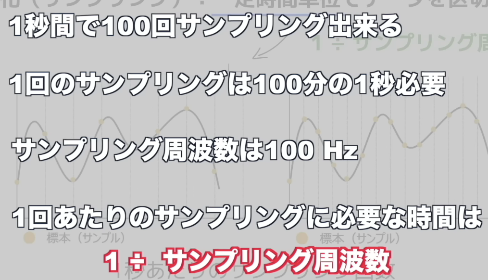

# アナログデータとデジタルデータ

アナログデータ（Analog Data） 模拟数据 ：用连续变化的物理量来表示的信息

デジタルデータ（Digital Data）数字数据

アナログデータ（Analog Data）：指连续变化的数据，比如温度、声音、电压信号等，数值在某个区间内可以取任意值。 
デジタルデータ（Digital Data）：指离散的、以数值形式表示的数据，用二进制等数字形式存储和处理，只能取有限个明确的值。

日文原文	读音（罗马音）	中文翻译
ドットの数	dotto no kazu	像素点的数量（dot = 像素点）
区切られた 1 つ 1 つがドット	kugirareta hitotsu hitotsu ga dotto	被划分开的每一个格子，就是一个像素点
解像度が高い	kaizōdo ga takai	分辨率高
解像度が低い	kaizōdo ga hikui	分辨率低

# PCM变换
PCM 的全称是 Pulse Code Modulation，中文标准译名为 脉冲编码调制。
就是把这个连续的波形，转换成计算机能识别的离散数字信号，而这个转换的核心就是PCM 变换

日文术语	中文翻译	英文对应	作用说明
標本化	采样 / 抽样	Sampling	按固定时间间隔，对连续的声波信号 “拍快照”，把时间上连续的信号变成离散的采样点。比如常见的 44.1kHz 采样率，就是每秒采集 44100 次。

量子化	量化	Quantization	把每个采样点的信号幅度，近似成一个固定的数字等级。比如 16 位量化，就是把信号分成 65536 个等级，把连续的幅度值变成离散的数字。

符号化	编码	Encoding	把量化后的数字值，转换成二进制的 0 和 1 序列，最终变成计算机可以存储、传输的数字音频数据。

標本化 ひょうほんか
量子化 りょうしか
符号化 ふごうか

## 標本化
一定時間単位でデータを区切り標本を抽出（按固定时间单位分割数据，抽取样本）

抽出 　ちゅうしゅつ

采样周期：两次采样之间的时间间隔，公式是：
采样周期 = 1 ÷ 采样频率
采样频率（サンプリング周波数）：
1 秒内进行采样的次数，单位是 Hz（赫兹）

我们平时说的 44.1kHz、48kHz 音频，指的就是采样频率，44.1kHz 就是每秒对声音信号采样 44100 次。　

