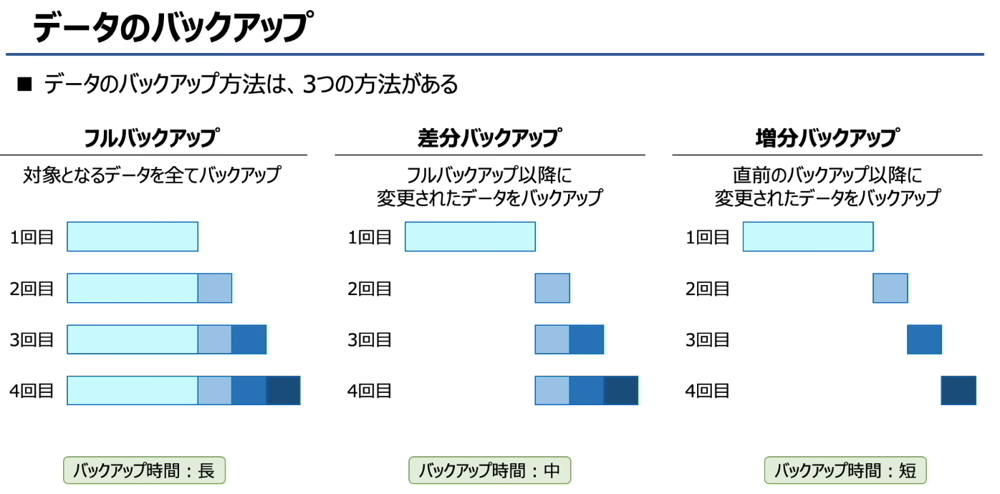
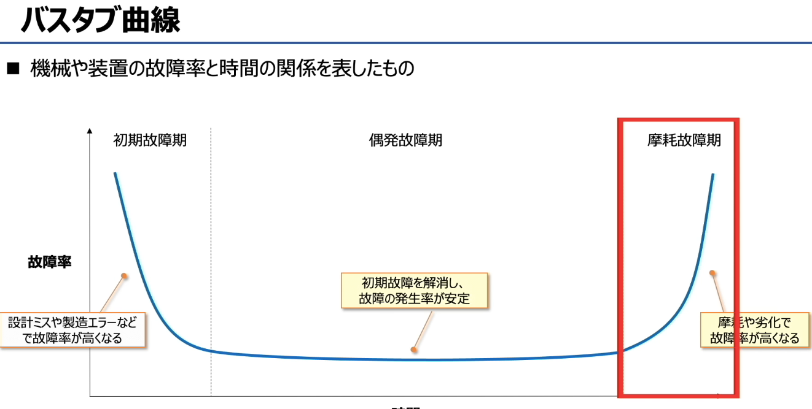
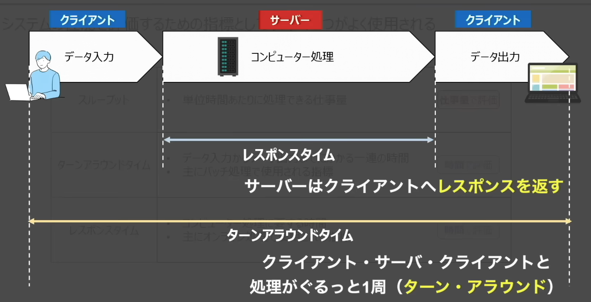
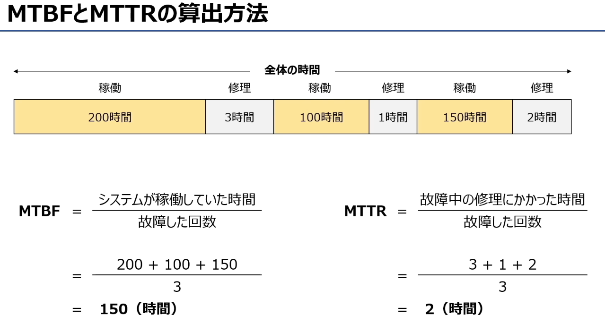
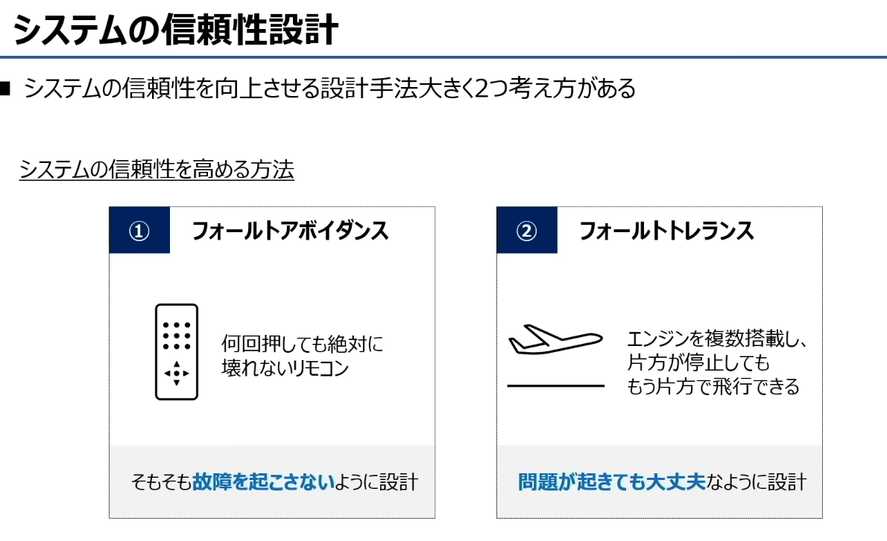
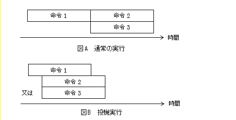

# システムの利用形態システムの利用形態
**系统按利用形态的两大分类：批处理（バッチ処理）与实时处理（リアルタイム処理）**

### 标题与核心说明
- 日文标题：**システムの利用形態**（系统的利用形态）
- 核心定义：按利用形态划分，系统可分为「バッチ処理（批处理）」和「リアルタイム処理（实时处理）」两大类。

### ① バッチ処理（Batch Processing / 批处理）
- **日文说明**：処理データを一定期間蓄積し、後のタイミングで一括処理を行う
- **中文翻译**：将处理数据在一定期间内积累，在之后的时间点一次性批量处理
- **特点**：
  - 不实时响应，数据先收集、攒够再统一处理
  - 适合非紧急、量大、可定时执行的任务
- **活用例（适用场景）**：売上管理（销售管理）、給与計算（薪资计算）等

### ② リアルタイム処理（Real-time Processing / 实时处理）
- **日文说明**：発生都度処理を実施する
- **中文翻译**：数据一发生就立刻执行处理
- **特点**：
  - 必须即时响应，用户输入/事件发生后马上给出结果
  - 对响应时间有严格要求
- **活用例（适用场景）**：SNS消息、銀行ATM（银行ATM）等

### 一句话总结
- **批处理**：数据攒一批再处理，比如月底算工资、夜里跑报表
- **实时处理**：来了就立刻处理，比如ATM取钱、SNS发消息，必须马上响应

# **客户端/服务器（クライアントサーバ）架构**

按功能分布分为「2层架构」和「3层架构」两种。

### 标题与核心说明
- 日文标题：**クライアントサーバシステム**（客户端/服务器系统）
- 核心定义：根据客户端和服务器分别承担的功能，分为「2层客户端服务器系统」和「3层客户端服务器系统」两类。

### ① 2層クライアントサーバシステム（两层C/S架构）
- **日文说明**：クライアントがアプリケーション層を保持
- **中文翻译**：客户端承担应用层（业务逻辑）功能
- 结构分工：
  - クライアント（客户端）：プレゼンテーション層（表示层/UI） + アプリケーション層（应用层/业务逻辑）
  - サーバ（服务器）：データ層（数据层/数据库）
- 特点：客户端需要安装专门的程序，既要处理界面，又要处理业务逻辑，负载较重。

### ② 3層クライアントサーバシステム（三层C/S架构）
- **日文说明**：サーバーがアプリケーション層を保持
- **中文翻译**：服务器承担应用层（业务逻辑）功能
- 结构分工：
  - クライアント（客户端）：プレゼンテーション層（表示层/UI）
  - アプリケーションサーバ（应用服务器）：アプリケーション層（应用层/业务逻辑）
  - データベースサーバ（数据库服务器）：データ層（数据层/数据库）
- 特点：客户端只负责界面显示，业务逻辑和数据处理都在服务器端，客户端轻量化，维护和扩展更方便，是更主流的架构。

### 一句话总结
- **两层架构**：客户端既要做界面，又要跑业务逻辑，服务器只存数据
- **三层架构**：客户端只做界面，业务逻辑和数据处理都交给服务器分层处理，更易维护和扩展

# **シンクライアントシステム（Thin-Client，瘦客户端系统）**

## 一、核心定义
**日文原文**：
クライアント端末の機能を必要最低限にとどめ、サーバー側でアプリの実行やデータの管理を行う
**中文翻译**：
将客户端终端的功能限制在必要的最低限度，应用程序的运行和数据管理都在服务器端进行。

简单说：**客户端只负责“输入+显示”，所有计算、存储、程序运行全交给服务器**。

## 二、工作原理
- **客户端（シンクライアント）**：只保留最低限度的功能，没有HDD/SSD硬盘，也不安装Excel等软件，只处理用户输入和画面显示。
- **服务器（サーバー）**：集中运行所有应用程序、存储所有数据，把处理后的画面发送给客户端显示。

## 三、关键特点
- **客户端轻量化**：终端配置要求低、成本低，几乎不需要本地维护
- **数据安全集中**：所有数据都在服务器端，不怕终端丢失、泄密
- **管理方便**：软件更新、补丁部署只需要在服务器上操作，不用挨个更新客户端

## 四、实现方式
图里提到了两种主流实现方式：
1.  **VDI（Virtual Desktop Infrastructure）**：虚拟桌面架构，用户远程连接服务器上的虚拟桌面
2.  **DaaS（Desktop as a Service）**：桌面即服务，云服务商提供的瘦客户端桌面服务

# **システムの二重化（系统冗余/双机系统）**
核心是通过多套系统提升业务可靠性，避免服务中断。

### システムの二重化（デュアルシステム/デュプレックスシステム）
**目的**：業務上必要不可欠なシステムを停止させないために、複数システムを用意して信頼性を高める
（为了不中断业务必需的系统，准备多套系统以提高可靠性）

#### 1. デュアルシステム（双工系统/同步双机） Dual System
- **日文说明**：同じ処理を2組のシステムで同時に行い、結果を照合しながら処理
- **特点**：两套系统同时执行完全相同的任务，并对结果进行比对校验，确保处理结果一致，防止故障或错误。

#### 2. デュプレックスシステム（备用系统/热备/冷备双机） Duplex System
- **日文说明**：同じ処理に対して2組のシステムを用意し、1つは障害が発生した時の予備用
- **特点**：一套系统正常处理，另一套作为故障时的备用系统。
  - 現用系が故障した場合は切替：主系统故障时自动切换到备用系统
  - ホットスタンバイ：起動状態で待機（热备：备用系统保持开机待命）
  - コールドスタンバイ：電源オフで待機（冷备：备用系统平时关机待命）

一句话核心区别：
- **デュアルシステム**：两套同时干活，互相校验
- **デュプレックスシステム**：一套干活，另一套待命，故障时切换

# データのバックアップ
**数据备份**

■ データのバックアップ方法は、3つの方法がある
■ 数据备份主要有以下3种方式：

| フルバックアップ | 差分バックアップ | 増分バックアップ |
| :--- | :--- | :--- |
| **全量备份** | **差异备份** | **增量备份** |
| 対象となるデータを全てバックアップ （对目标数据进行完整备份） | フルバックアップ以降に変更されたデータをバックアップ （备份自上次全量备份以来发生变更的数据） | 直前のバックアップ以降に変更されたデータをバックアップ （备份自上次备份（无论全量/增量）以来发生变更的数据） |
| バックアップ時間：長 备份耗时：长 | バックアップ時間：中 备份耗时：中等 | バックアップ時間：短 备份耗时：短 |

### 补充说明（帮你理解图示）
1.  **フルバックアップ（全量备份）**
    每次都备份全部数据，所以备份文件体积最大、耗时最长，但恢复时只需要最新的一份全量备份即可，速度最快。
2.  **差分（さぶん /sabun）バックアップ（差异备份）** 
    只备份**自上次全量备份以来**变化的数据，所以备份速度比全量快，但恢复时需要「上一次全量备份 + 最新的一次差异备份」才能完整恢复。
3.  **増分（ぞうぶん /zōbun）バックアップ（增量备份）**
    只备份**自上一次备份（无论全量/增量）以来**变化的数据，所以备份耗时最短、文件体积最小，但恢复时需要「上一次全量备份 + 所有后续的增量备份」才能完整恢复，步骤最繁琐。

「差分」的「差」= 上次全量备份和现在的差距
「増分」的「増」= 上次备份之后新增 / 变化的部分

# バスタブ曲線（ bathtub曲线 / 浴盆曲线 ）
**读音**：バスタブきょくせん（basutabu kyokusen）
**中文翻译**：浴盆曲线（设备故障率随时间变化的经典模型，因形状像浴盆得名）

■ 機械や装置の故障率と時間の関係を表したもの
**读音**：きかいやそうちのこしょうりつとじかんのかんけいをあらわしたもの（kikai ya souchi no koshouritsu to jikan no kankei o arawashita mono）
**中文翻译**：该图表示机械或设备的故障率与时间的关系

### 各阶段与注释翻译&读音

| 日文原文 | 读音（罗马音） | 中文翻译 |
| :--- | :--- | :--- |
| 初期故障期 | しょきこしょうき（shoki koshouki） | 早期故障期（初期故障期） |
| 偶発故障期 | ぐうはつこしょうき（guuhatsu koshouki） | 偶发故障期（稳定故障期） |
| 摩耗故障期 | まもうこしょうき（mamou koshouki） | 耗损故障期（磨损故障期） |
| 故障率 | こしょうりつ（koshouritsu） | 故障率 |
| 設計ミスや製造エラーなどで故障率が高くなる | せっけいミスやせいぞうエラーなどでこしょうりつがたかくなる（sekkei misu ya seizou eraa nado de koshouritsu ga takaku naru） | 因设计缺陷、制造误差等原因，故障率较高 |
| 初期故障を解消し、故障の発生率が安定 | しょきこしょうをかいしょうし、こしょうのはっせいりつがあんてい（shoki koshou o kaishou shi, koshou no hasseiritsu ga antei） | 初期故障消除后，故障发生率趋于稳定 |
| 摩耗や劣化で故障率が高くなる | まもうやれっかでこしょうりつがたかくなる（mamou ya rekka de koshouritsu ga takaku naru） | 因磨损、老化等原因，故障率再次升高 |

💡 补充说明
- 浴盆曲线的三个阶段对应了设备的全生命周期故障规律：
  1.  **初期故障期**：故障率高，随时间快速下降，主要是设计/制造缺陷导致。
  2.  **偶发故障期**：故障率低且稳定，是设备的“有效寿命期”，故障多由随机因素导致。
  3.  **摩耗故障期**：故障率随时间快速上升，主要由部件磨损、老化导致。

# 系统性能评价的三大核心指标

## 一、系统性能评价的三大核心指标
系统性能评价中，最常用的是以下三个指标：

### 1. スループット（Throughput / 吞吐量）
- **日文原文**：単位時間あたりに処理できる仕事量
- **中文翻译**：单位时间内能够处理的工作量
- **评价方式**：按「工作量」评价，比如每秒处理的请求数、每秒传输的数据量
- **适用场景**：衡量系统的整体处理能力，比如批量处理系统、服务器集群的处理效率

### 2. ターンアラウンドタイム（Turnaround Time / 周转时间）
- **日文原文**：データ入力からデータ出力までにかかる一連の時間。主にバッチ処理で使用される指標
- **中文翻译**：从数据输入到数据输出所花费的总时间，主要用于批量处理系统
- **评价方式**：按「时间」评价，是从用户提交任务到任务完成的全部耗时
- **适用场景**：批量处理（バッチ処理）场景，比如数据批处理作业

### 3. レスポンスタイム（Response Time / 响应时间）
- **日文原文**：コンピューター処理に要する時間。主にオンライン処理で使用される指標
- **中文翻译**：计算机处理请求所花费的时间，主要用于在线处理系统
- **评价方式**：按「时间」评价，特指服务器从接收请求到返回响应的处理耗时
- **适用场景**：在线处理（オンライン処理）场景，比如网页请求、API调用

---

## 二、ターンアラウンドタイム と レスポンスタイム 的区别
结合第一张图的流程（クライアント→サーバ→クライアント）：
- **レスポンスタイム**：是**服务器内部处理请求的耗时**，也就是「サーバーがクライアントへレスポンスを返すまでの時間」。
- **ターンアラウンドタイム**：是**用户视角的总耗时**，也就是从用户输入数据、服务器处理、到用户收到结果的「クライアント・サーバー・クライアントと処理がぐるっと1周」的全部时间。

简单说：
- 响应时间 = 服务器处理请求的时间
- 周转时间 = 响应时间 + 网络传输时间 + 用户输入/输出时间

---

💡 一句话记忆：
- スループット：单位时间干多少活（量）
- レスポンスタイム：服务器处理要多久（服务器视角）
- ターンアラウンドタイム：用户提交到收到结果要多久（用户视角）

#  一、ベンチマークテスト的定义与核心概念
1.  **日文原文定义**
    - テスト用に作成したプログラムをシステムに実行させ、その結果からシステムを評価するテスト
    - テスト用プログラムの結果を基準にして相対的に評価する（ベンチマーク＝基準、指標という意味）
    - コンピューターの性能を比較・評価するために行われるもの
    - 標準的なプログラムを使って同じ条件下でテストを行い、数値化して性能を測定する

2.  **中文核心解释**
    基准测试，是用**标准化的专用测试程序**，在相同条件下运行，通过量化结果来**对比、评估计算机系统性能**的方法。它的核心是「用统一的基准程序，得到可横向比较的性能指标」。

---

## 二、代表的なベンチマークテスト（典型基准测试）这部分看一看不用记

1.  **SPEC**
    - 用途：评价处理器性能的基准测试
    - 细分：
      - `SPECint`：测定整数运算性能（适合事务处理场景）
      - `SPECfp`：测定浮点运算性能（适合科学计算场景）

2.  **TPC**
    - 用途：评价事务处理性能的基准测试
    - 适用场景：数据库系统、在线交易处理（OLTP）系统的性能评估

3.  **3DMark**
    - 用途：评价3D图形性能的基准测试
    - 适用场景：显卡性能、游戏/图形工作站的性能评估

---

## 三、ベンチマークテスト的特点
- 它是**相对评价**：以测试程序的结果为基准，对不同系统的性能进行横向对比
- 它是**量化评价**：将性能转化为具体数值，方便直观比较
- 针对性强：不同的基准测试对应不同的场景（CPU、事务、3D图形），不能混用指标

---

💡 一句话记忆：
ベンチマークテスト = 用统一的「尺子」（标准程序），给不同系统量出可比较的「身高」（性能指标）。

# システムの評価特性（RASIS）
**系统评价特性（RASIS）**，是从5个维度评估系统可靠性与性能的经典框架，每个字母对应一个核心特性：

---

### 1. 信頼性（Reliability）
- **日文原文**：システムが安定して稼働し続けられること（MTBFで評価）
- **中文翻译**：系统能够持续稳定运行的能力（用MTBF评估）
- **补充说明**：核心是「不出故障」，用**平均无故障时间（MTBF：Mean Time Between Failures）**衡量，数值越高越可靠。

---

### 2. 可用性（Availability）
- **日文原文**：使いたい時にいつでも使えること（稼働率で評価）
- **中文翻译**：需要使用时随时可用的能力（用稼动率/可用率评估）
- **补充说明**：核心是「能用上」，计算公式：`可用性 = MTBF / (MTBF + MTTR)`，反映系统正常运行时间占比。

---

### 3. 保守性（Serviceability）
- **日文原文**：故障した時に早く復旧できること（MTTRで評価）
- **中文翻译**：发生故障时能够快速恢复的能力（用MTTR评估）
- **补充说明**：核心是「坏了快修」，用**平均修复时间（MTTR：Mean Time To Repair）**衡量，数值越低越好。

---

### 4. 保全性（Integrity）
- **日文原文**：データが欠損なく正しく保存されていること
- **中文翻译**：数据无缺失、无错误地被正确保存的能力
- **补充说明**：也叫「完整性」，确保数据在存储、传输过程中不被篡改、不丢失。

---

### 5. 安全性（Security）
- **日文原文**：高いセキュリティを維持できること
- **中文翻译**：能够维持高水平安全防护的能力
- **补充说明**：防范非法访问、数据泄露、恶意攻击，保障系统和数据安全。

---

💡 一句话记忆口诀：
- **R**eliability：不出故障（稳）
- **A**vailability：随时能用（用）
- **S**erviceability：坏了快修（修）
- **I**ntegrity：数据不丢（全）
- **S**ecurity：安全不被黑（安）

#  システムの評価指標（MTBF / MTTR）
这两个指标是衡量系统可靠性与可维护性的核心，常用来计算系统的可用性。

#### 1. MTBF（Mean Time Between Failures）
- **日文原文**：システムの故障と故障の間隔の平均時間（＝システムが正常に稼働している時間の平均）
- **中文翻译**：**平均故障间隔时间**，指系统两次故障之间的平均正常运行时间。
- **图示含义**：故障发生后，系统恢复正常，到下一次故障发生之间的「稼働中」时间的平均值。
- **特点**：値が大きいほど故障が起こりにくく、**信頼性（Reliability）が高い**。
- **用途**：直接衡量系统的可靠性，是计算可用性的关键参数之一。

#### 2. MTTR（Mean Time To Repair）
- **日文原文**：システムが故障した時に修理にかかる平均時間
- **中文翻译**：**平均修复时间**，指系统发生故障后，从停机到恢复正常运行所需的平均修复时间。
- **图示含义**：故障发生后，系统处于「修理中」状态的时间的平均值。
- **特点**：値が小さいほど修理が早く、**保守性（Serviceability）が高い**。
- **用途**：直接衡量系统的可维护性，也是计算可用性的关键参数之一。

### 补充：可用性（Availability）计算公式
这两个指标可以一起算出系统的可用性（稼働率）：
\[
\text{可用性} = \frac{\text{MTBF}}{\text{MTBF} + \text{MTTR}}
\]
- MTBF 越大、MTTR 越小，系统的可用性就越高。

---

💡 一句话记忆：
- **MTBF**：多久坏一次（越大越可靠）
- **MTTR**：坏了修多久（越小越易维护）

---

## 一、核心公式与概念
### 1. MTBF（平均故障间隔时间）
- **日文定义**：システムが稼働していた時間 ÷ 故障した回数
- **中文含义**：系统两次故障之间的平均正常运行时间，衡量**可靠性**
- **公式**：
  \[
  \text{MTBF} = \frac{\text{システムが正常に稼働した総時間}}{\text{故障回数}}
  \]

### 2. MTTR（平均修复时间）
- **日文定义**：故障中の修理にかかった時間 ÷ 故障した回数
- **中文含义**：系统故障后平均修复耗时，衡量**可维护性/保守性**
- **公式**：
  \[
  \text{MTTR} = \frac{\text{修理に要した総時間}}{\text{故障回数}}
  \]

---

## 二、图示示例计算过程
### 已知数据
- 稼働時間（正常运行时间）：200時間 + 100時間 + 150時間 = **450時間**
- 修理時間（修复耗时）：3時間 + 1時間 + 2時間 = **6時間**
- 故障回数：**3回**

### 1. MTBF 计算
\[
\text{MTBF} = \frac{200 + 100 + 150}{3} = \frac{450}{3} = 150\ (\text{時間})
\]
→ 表示系统平均每150小时发生一次故障。

### 2. MTTR 计算
\[
\text{MTTR} = \frac{3 + 1 + 2}{3} = \frac{6}{3} = 2\ (\text{時間})
\]
→ 表示系统故障后，平均需要2小时修复。

---

## 三、补充：可用性（稼働率）计算
有了MTBF和MTTR，还可以算出系统的**可用性（Availability）**：
\[
\text{可用性} = \frac{\text{MTBF}}{\text{MTBF} + \text{MTTR}} = \frac{150}{150 + 2} \approx 98.7\%
\]
可用性越高，说明系统越稳定、越容易维护。

---

💡 一句话记忆：
- MTBF：正常运行总时长 ÷ 故障次数（越大越可靠）
- MTTR：修复总时长 ÷ 故障次数（越小越好维护）

#  システムの評価指標（稼働率/可用率）

## 1. 定义（日文+中文）
- **日文原文**：
  稼働率：システムの全運転時間のうち、システムが正常に稼働している時間の割合
- **中文翻译**：
  可用率（稼働率），指系统在**总运行时间**内，处于**正常运行状态的时间占比**。

## 2. 核心公式
## 基础定义式
\[
\text{稼働率} = \frac{\text{システムが正常に稼働している時間}}{\text{システム全運転時間}} = \frac{\text{稼働中時間}}{\text{稼働中時間} + \text{修理中時間}}
\]

## 用 MTBF / MTTR 表示的公式（最常用）
结合图中说明：
- 稼働中時間の平均 = **MTBF（平均故障间隔时间）**
- 修理中時間の平均 = **MTTR（平均修复时间）**

因此可用率公式可以写成：
\[
\text{稼働率} = \frac{\text{MTBF}}{\text{MTBF} + \text{MTTR}}
\]

💡 补充要点
- 这个值越接近 1（或100%），说明系统越稳定、停机时间越少。
- 提高可用率的两个关键：**提高MTBF（减少故障）**、**降低MTTR（加快修复）**。

## 複数システムの稼働率
当系统由多个子系统构成时，整体的可用率（稼働率）会根据子系统是**直列（串联）**还是**並列（并联）**而不同。

## 1. 直列システム（串联系统）
- **日文原文**：
  システム全体が稼働するのは、システムAとシステムB両方が稼働している時
- **中文解释**：
  系统A和系统B必须**同时正常运行**，整个系统才能正常工作。
- **稼働率公式**：
  \[
  \text{全体の稼働率} = A \times B
  \]
  （A为系统A的可用率，B为系统B的可用率）
- **特点**：串联系统的整体可用率一定**低于**任何一个子系统的可用率，子系统越多，整体可用率越低。

---

## 2. 並列システム（并联系统）
- **日文原文**：
  システム全体が稼働するのは、システムAとシステムBの少なくとも一方が稼働している時
- **中文解释**：
  系统A和系统B中，**只要至少有一个正常运行**，整个系统就能正常工作。
- **稼働率公式**：
  \[
  \text{全体の稼働率} = 1 - (1 - A)(1 - B)
  \]
  （A为系统A的可用率，B为系统B的可用率）
- **特点**：并联系统的整体可用率一定**高于**任何一个子系统的可用率，是提升系统可靠性的常用方法。

---

💡 补充说明：
- 直列系统：“一环扣一环，一坏全坏”，用乘法计算整体可用率。
- 並列系统：“多套备份，坏一个也没事”，用`1 - 故障率乘积`计算整体可用率。

# システムの信頼性設計（系统可靠性设计）

## システムの信頼性設計（系统可靠性设计）
系统可靠性设计主要分为两大类：**フォールトアボイダンス（Fault Avoidance / 故障避免）**和**フォールトトレランス（Fault Tolerance / 故障容忍）**。

### 1. フォールトアボイダンス（Fault Avoidance） 故障避免
- **日文原文**：
  そもそも故障を起こさないように設計
  （例：何回押しても絶対に壊れないリモコン）
- **中文解释**：
  从设计阶段就通过严格的质量控制、冗余设计和测试，**从根源上减少故障发生的可能性**，目标是“不发生故障”。
- **核心逻辑**：
  通过提高单个部件的质量和耐用性，让系统本身就不容易出问题。比如遥控器用坚固材料

### 2. フォールトトレランス（Fault Tolerance） 故障容忍
- **日文原文**：
  問題が起きても大丈夫なように設計
  （例：エンジンを複数搭載し、片方が停止してももう片方で飛行できる）
- **中文解释**：
  即使系统中某个部件发生故障，整个系统也能通过冗余、备份等机制继续正常运行，目标是“故障发生也不影响整体功能”。
- **核心逻辑**：
  接受“故障可能发生”的现实，通过冗余设计（比如双引擎飞机、服务器集群）让系统具备故障恢复能力。比如飞机多引擎、服务器双电源、数据库主从备份。

💡 一句话区分：
- **フォールトアボイダンス**：不让故障发生（防患于未然）
- **フォールトトレランス**：故障发生也不怕（容错兜底）

# 系统可靠性设计
**应对故障和人为失误的三种核心策略**

## システムの信頼性設計（その他）
### 1. フェールセーフ（Fail-safe / 故障安全）
- **日文原文**：故障した時は安全を優先させる
- **中文解释**：当系统发生故障时，优先保障安全，自动切换到不会造成危险的状态。
- **图示例子**：交通信号灯故障时，所有灯自动变红，防止交通事故。
- **核心逻辑**：故障时“宁可停摆，也不出事”，安全第一。

### 2. フェールソフト（Fail-soft / 故障弱化）
- **日文原文**：故障した時でも機能を低下させ継続することを優先
- **中文解释**：系统发生故障时，不会完全停机，而是降级运行，保留最基础的核心功能。
- **图示例子**：空调故障时，即使制冷/制热功能失效，基础的开关控制仍能正常工作。
- **核心逻辑**：故障时“部分功能受限，但核心服务不中断”，可用性优先。

### 3. フールプルーフ（Fool-proof / 防呆设计）
- **日文原文**：人間が間違った操作をしても、誤作動を起こさないようにする
- **中文解释**：通过设计让“错误操作无法执行”，从根源上避免人为失误导致的故障。
- **图示例子**：微波炉门没关好就无法启动加热，防止误操作造成危险。
- **核心逻辑**：不给人犯错的机会，通过物理或逻辑限制避免误操作。

---

💡 一句话区分：
- **フェールセーフ**：故障了，为了安全直接“停摆保命”
- **フェールソフト**：故障了，降级运行“保留核心功能”
- **フールプルーフ**：从设计上“不让人有犯错的机会”

# 做题笔记

我先帮你完整翻译题目和选项，再分析一下这道题的考点：

---

# **外部割込みの原因となるものはどれか。**
（がいぶわりこみ の げんいん と なる もの は どれか）
中文：以下哪一项是**外部中断**的成因？

---

### 选项翻译 & 说明
| 日文原文 | 读音 | 中文翻译 | 中断类型 |
| :--- | :--- | :--- | :--- |
| ア ゼロによる除算命令の実行 | ゼロによるじょざんめいれいのじっこう | 执行除以零的指令 | 内部中断（异常） |
| イ 存在しない命令コードの実行 | そんざいしないめいれいコードのじっこう | 执行不存在的指令码（非法指令） | 内部中断（异常） |
| ウ タイマによる時間経過の通知 | タイマによるじかんけいかのつうち | 计时器发出的时间到通知 | 外部中断 |
| エ ページフォールトの発生 | ページフォールトのはっせい | 发生缺页中断（Page Fault） | 内部中断（异常） |

---

### 正确答案解析
这道题问的是**外部中断**的成因：
- ア、イ、エ 都是由**CPU执行指令时自身发生的异常/错误**触发的，属于**内部中断（异常）**。
- ウ 是由**CPU外部的设备（计时器硬件）**发出信号触发的，属于**外部中断**。

✅ 正确答案：**C（ウ）**
（你现在选的D（エ）是错误的，ページフォールト是内部中断）

---
💡 补充小知识：
外部中断是由CPU以外的设备（如键盘、鼠标、计时器、网卡）主动向CPU发出信号，请求处理的中断；而内部中断是CPU在执行指令过程中，因为指令错误、缺页、除零等自身问题触发的。

割込み（わりこみ /warikomi）
核心翻译：中断在计算机 / IT 领域，特指中断（Interrupt），是操作系统和硬件的核心概念。

我会保留日文原文，并附上精准的中文翻译，方便你对照学习：

---

### 第一段
**日文原文**：
割込みには、次のように、プログラムの命令を実行した結果として発生する内部割込みと、実行中のプログラムの命令とは関係なく発生する外部割込みがある。よって、外部割込みが発生するのは、(ウ)のタイマによる時間経過の通知である。

**中文翻译**：
中断分为两类：一类是执行程序指令的过程中产生的**内部中断**；另一类是与当前执行的程序指令无关、由外部事件触发的**外部中断**。因此，由计时器发出的时间到通知（选项ウ）属于外部中断。

---

### 外部割込み（外部中断）说明
**日文原文**：
・外部割込み……入出力割込み（入出力動作の完了や入出力装置の誤動作）、タイマ割込み（タイマの時間切れ）、マシンチェック割込み（ハードウェアの誤動作や電源異常など）

**中文翻译**：
・外部中断……I/O中断（I/O操作完成或I/O设备故障）、计时器中断（计时器计时结束）、机器检查中断（硬件故障、电源异常等）

---

### 内部割込み（内部中断）说明
**日文原文**：
・内部割込み……スーパバイザコール割込み（実行中のプログラムからSVC命令又はシステムコール命令によるOS機能の利用）、プログラム割込み（ゼロ除算、オーバフロー、不正命令実行、ページフォールトなど）

**中文翻译**：
・内部中断……管理程序调用中断（运行中的程序通过SVC指令或系统调用指令请求使用操作系统功能）、程序中断（除零错误、溢出、执行非法指令、缺页中断等）

---

### 选项ア说明
**日文原文**：
ア：ゼロによる除算は、プログラム中の計算で除数が0になってしまうときに起こる割込みで、内部割込みである。

**中文翻译**：
选项ア：除零错误，是程序计算中除数为0时触发的中断，属于内部中断。

### 选项イ说明
**日文原文**：
イ：プログラムが不正な命令（存在しない命令、形式が不正な命令）を実行したときに起こる割込みで、内部割込みである。

**中文翻译**：
选项イ：程序执行非法指令（不存在的指令、格式错误的指令）时触发的中断，属于内部中断。

### 选项エ说明
**日文原文**：
エ：仮想記憶管理のためのハードウェアの機能で、主記憶に存在しないページにアクセスするとページフォールトという内部割込みが発生する。

**中文翻译**：
选项エ：虚拟存储管理的硬件功能，当访问主存中不存在的页面时，会触发名为“缺页中断（Page Fault）”的内部中断。

💡 补充说明：
这段文字清晰区分了两类中断：
- **外部中断**：由CPU外部的硬件（如计时器、I/O设备）主动触发，和当前程序指令无关。
- **内部中断**：由CPU执行指令时的错误、异常或系统调用触发，和程序指令直接相关。

#  题目翻译
**主記憶のデータを図のように参照するアドレス指定方式はどれか。**
（しゅきおくのデータをずのようにさんしょうするアドレスしていほうしきはどれか）
中文：如图所示，访问主存数据时使用的是哪种寻址方式？

### 图示解析
1.  指令的「アドレス部（地址段）」写的是 `20`
2.  CPU 先去主存的地址 `20`，取出了里面存的内容 `25`
3.  再以 `25` 作为最终地址，去主存中读取真正的数据

这种「地址段的值不是最终地址，而是指向另一个存储单元，再从那个单元取出最终地址」的方式，就是**间接寻址**。

---

### 选项翻译与判断
- **ア 間接アドレス指定（かんせつアドレスしてい / 间接寻址方式）**
  这就是正确答案。和图示的“两次内存访问”逻辑完全对应。

- **イ 指標アドレス指定（しひょうアドレスしてい / 变址寻址方式）**
  这种方式需要用到基址/变址寄存器，将寄存器的值和地址段的值相加得到最终地址，图里没有体现这个过程。

- **ウ 相対アドレス指定（そうたいアドレスしてい / 相对寻址方式）**
  这种方式是以程序计数器（PC）的值为基准，加上地址段的偏移量得到最终地址，和图示逻辑不符。

- **エ 直接アドレス指定（ちょくせつアドレスしてい / 直接寻址方式）**
  这种方式下，地址段的值就是最终的内存地址，只需要访问一次内存，和图里的两次访问不符。

---

💡 补充小知识
- **直接寻址**：一步到位，地址段直接指向数据所在的内存地址。
- **间接寻址**：绕了个弯，地址段指向的不是数据，而是“数据地址”，需要读两次内存。

# benchmark 基准测试

### 题目原文&翻译
**ベンチマークテストの説明として、適切なものはどれか。**
（べんちまーくてすと の せつめい として、てきせつなもの は どれか）
中文：以下哪一项是对基准测试（Benchmark Test）的正确说明？

### 选项翻译与解析
- **ア**
  原文：監視・計測用のプログラムによってシステムの稼働状態や資源の状況を測定し、システム構成や応答性能のデータを得る。
  翻译：通过监控/测量用程序，测定系统的运行状态和资源使用情况，获取系统构成和响应性能的数据。
  解析：这描述的是**系统监控/性能测量**，不是基准测试本身。

- **イ**
  原文：使用目的に合わせて選定した標準的なプログラムを実行させ、その処理性能を測定する。
  翻译：运行根据使用目的选定的标准程序，测定其处理性能。
  解析：✅ 这正是**基准测试（Benchmark Test）**的核心定义——用标准化的测试程序来评估系统性能。

- **ウ**
  原文：将来の予測を含めて評価する場合などに、モデルを作成して模擬的に実験するプログラムでシステムの性能を評価する。
  翻译：在包含未来预测的评估场景中，通过创建模型、进行模拟实验的程序来评估系统性能。
  解析：这描述的是**模拟/仿真评估**，不是基准测试。

- **エ**
  原文：プログラムを実際には実行せずに、机上でシステムの処理を解析して、個々の命令の出現回数や実行回数の予測値から処理時間を推定し、性能を評価する。
  翻译：不实际运行程序，而是在纸面上分析系统的处理流程，根据各指令的出现次数和执行次数的预测值推算处理时间，评估性能。
  解析：这描述的是**静态性能分析/纸上评估**，不是基准测试。

✅ 正确答案：**B（イ）**

💡 补充说明：
基准测试（ベンチマークテスト）的核心特征，就是**运行标准化的测试程序**，用可量化的结果来对比不同系统的性能。

### ベンチマークテストの定義
ベンチマークテストとは、想定している使用目的に沿った性能測定プログラムを実行させてコンピュータや、コンピュータシステムの処理性能を測定することをいう。
また、その際に実行するプログラムをベンチマークプログラムと呼び、測定したい処理内容に合わせた専用のプログラムを使用する。
代表的なものとして、3次元グラフィクスの描画機能を測定するベンチマークプログラムや、CPUの演算速度、メモリのアクセス速度、ハードディスクのアクセス速度を計測するベンチマークプログラムがある。

基准测试（ベンチマークテスト）的定义
基准测试，是指运行与预期使用场景相匹配的性能测量程序，以此测定计算机或计算机系统处理性能的行为。在测试中运行的程序被称为基准程序（ベンチマークプログラム），需根据要测量的处理内容，使用专用的程序。典型的例子包括：用于测量 3D 图形绘制能力的基准程序，以及测量 CPU 运算速度、内存访问速度、硬盘访问速度的基准程序。

### 用途別のCPU性能重視点
一般的に金額計算などの事務処理には、CPUの演算能力の中でも、整数演算能力が重視され、科学的な計算では浮動小数点演算能力が重視される。
不同场景下的 CPU 性能侧重点
一般来说，金额计算等事务处理场景，更看重 CPU 的整数运算能力；而科学计算场景，则更看重浮点运算能力。

### 他の性能評価手法との違い
- 稼働状態や資源の状況（CPU使用率・メモリ使用量・ネットワーク利用率など）を測定することをモニタリングと呼ぶ。
  モニタリングは、テスト対象システムの状況を監視・計測するプログラムであり、負荷を掛けるプログラムではなく、実際に運用を想定しているプログラムである点で、ベンチマークテストとは異なる。
- モデルを作成して模擬的に実験するプログラムで評価する手法は、シミュレーションテストである。
- ベンチマークテストでは、プログラムを実際に実行して測定する。机上での計算から導き出す手法は、性能見積りや性能予測のことである。

与其他性能评估方法的区别
对系统运行状态和资源使用情况（如 CPU 使用率、内存使用量、网络利用率等）进行测量的行为，称为监控（モニタリング）。
监控是用来监视、测量目标系统状态的程序，它不是施加负载的程序，而是以实际运行为前提的程序，这一点与基准测试不同。
通过建立模型、运行模拟实验程序来评估性能的方法，属于模拟测试（シミュレーションテスト）。
基准测试需要实际运行程序来测量性能。而通过纸面计算推导得出性能的方法，属于性能估算 / 性能预测。

割り振る 分配 / 分派 / 安排（任务、资源、时间、号码等）

# パイプライン制御（流水线控制） 
パイプライン 对应的英文是 Pipeline
完整说法：Instruction Pipeline（指令流水线），在计算机架构中直接用 Pipeline 指代也完全通用

### 一、题目翻译与解析
**题目：パイプライン制御の特徴はどれか。**
中文：以下哪一项是流水线控制的特征？

选项翻译与判断：
- **ア**：为了同时执行多条指令，编译器在生成目标程序的阶段，就预先分配好每条指令使用哪个运算器。
  这是**VLIW（超长指令字）**的特征，不是流水线。
- **イ**：在指令执行阶段，动态决定使用哪个运算器，同时执行多条指令。
  这是**超标量/乱序执行**的特征，不是流水线。
- **ウ**：将指令的处理过程在处理器内细分为多个阶段，让多条指令并行执行。
  ✅ 这正是**流水线控制（パイプライン制御）**的核心定义，是正确答案。
- **エ**：将指令拆解为更细的微指令组合来执行。
  这是**微程序控制（マイクロプログラム制御）**的特征，不是流水线。

✅ 正确答案：**C（ウ）**

---

### 二、パイプライン制御（流水线控制）科普
#### 1. 核心原理
把一条指令的执行过程（比如「取指→译码→执行→访存→写回」）拆成多个独立的阶段，让不同指令的不同阶段可以**重叠并行执行**。
举个例子，就像工厂的流水线：
- 第1条指令在「执行」阶段时，第2条指令可以在「译码」阶段，第3条指令可以在「取指」阶段。
- 这样每个时钟周期都能完成一条指令的处理，大幅提升CPU的吞吐率。

#### 2. 关键特点
- **阶段细分**：指令处理被拆成多个固定阶段（通常是5段或更多）。
- **并行执行**：多条指令在不同阶段同时推进，就像水管里的水流一样连续不断。
- **依赖风险**：如果后面的指令需要前面指令的结果，会出现「数据冒险」，导致流水线停顿（气泡）。

---

### 三、帮你区分几个易混技术
| 日文术语 | 中文名称 | 核心区别 |
| :--- | :--- | :--- |
| パイプライン制御 | 流水线控制 | 把**单条指令拆成多阶段**，多指令在不同阶段并行 |
| スーパースカラ | 超标量 | 用**多套执行单元**，同一阶段同时执行多条指令 |
| VLIW | 超长指令字 | 编译器预先打包多条指令，硬件按顺序并行执行 |
| マイクロプログラム制御 | 微程序控制 | 把复杂指令拆成微指令序列，用微指令实现控制 |

---

💡 一句话记忆：
流水线是「指令接力跑」，超标量是「多条指令并排跑」，VLIW是「编译器安排好的多人接力」，微程序控制是「把大任务拆成小步骤做」。

# CPU时钟（クロック）基础定义
**日文原文**：
CPUを構成する装置の一つであるクロックは、コンピュータ内の各装置の動作のタイミングをとるための信号（クロック信号）を発生させる回路である。クロック周波数は、1秒間に現れるクロック信号の周期の回数で、Hzで表される。接続されるバスのクロック周波数は、CPUのクロック周波数より遅くてもよい。

**中文翻译**：
时钟（クロック）是构成CPU的装置之一，它是为了统一计算机内各装置的动作时序，而产生时钟信号的电路。时钟频率（クロック周波数）指1秒内出现的时钟信号周期数，单位为Hz。与CPU相连的总线时钟频率，可以低于CPU的时钟频率。

---

### 时钟周期与指令执行的关系
**日文原文**：
クロック周波数の逆数は、1クロックのパルス間隔時間である。一方、CPUで処理される命令は、1クロックで終わるとは限らない。1秒間に実行できる命令数（百万単位）は、MIPSで表される。

**中文翻译**：
时钟频率的倒数，是1个时钟的脉冲间隔时间（即时钟周期）。但CPU处理的指令，并不一定都能在1个时钟周期内完成。CPU每秒可执行的指令数（以百万条为单位），用MIPS（每秒百万指令数）表示。

---

### 时钟频率与系统性能的关系
**日文原文**：
クロック周波数を高くするほど、一般にCPUの性能は上がるが、これにも論理回路の誤動作などの限界がある。一方、システム全体の性能はCPUだけで決まるものではなく、記憶装置、入出力装置、その他周辺の機能が全体として影響する。CPU以外に性能のネックとなる問題があれば、CPU性能がいくらよくなっても、システム全体の性能はそれほど上がらない。

**中文翻译**：
一般来说，时钟频率越高，CPU性能越强，但受限于逻辑电路误动作等因素，时钟频率存在物理上限。另一方面，系统整体性能并非仅由CPU决定，存储设备、输入输出设备及其他周边功能都会产生影响。如果CPU之外存在性能瓶颈，那么无论CPU性能多强，系统整体性能也无法显著提升。

---

### CPU型号/频率与程序性能的关系
**日文原文**：
CPUの種類が同じことから命令セットなどのアーキテクチャも等しいと考えられるが、プログラムの実行においては、他の装置の構成やアプリケーションの環境などの差異が影響するので、2台のパソコンのプログラム実行性能は同等とはいえない。

**中文翻译**：
即使两台PC使用的CPU型号相同，指令集等架构也一致，但程序执行性能仍会受其他设备配置、应用环境差异的影响，因此不能认为二者的程序执行性能完全相同。

# スケールイン（Scale-In / 横向收缩）

### 一、スケールイン（Scale-In / 横向收缩）
**日文原文**：
システムが使用する物理サーバの処理能力を、負荷状況に応じて調整する方法の一つとして、システムを構成する物理サーバの台数を減らすことによって、システムのリソースを最適化し、無駄なコストを削減する方法があり、スケールインと呼ばれる。

**中文翻译**：
作为根据负载情况调整系统物理服务器处理能力的方法之一，通过减少构成系统的物理服务器数量，优化系统资源、削减不必要成本的方法，称为**横向收缩（Scale-In）**。

### 二、4种扩展/收缩方式的对比（核心知识点）
#### 1. 横向扩展/收缩（关注「服务器台数」）
- **スケールアウト（Scale-Out / 横向扩展）**
  日文：物理サーバの台数を増やして処理能力を向上させる方法
  中文：通过**增加物理服务器数量**，提升系统整体处理能力
- **スケールイン（Scale-In / 横向收缩）**
  日文：物理サーバの台数を減らしてコストを削減する方法
  中文：通过**减少物理服务器数量**，优化资源、削减成本
  两者是反义词，都以「服务器台数」为调整对象。

#### 2. 纵向扩展/收缩（关注「单台配置」）
- **スケールアップ（Scale-Up / 纵向扩展）**
  日文：CPUやメモリのスペックを上げて処理能力を向上させる方法
  中文：通过升级单台服务器的配置（更换更高性能CPU、增加内存等），提升处理能力
- **スケールダウン（Scale-Down / 纵向收缩）**
  日文：CPUやメモリのスペックを下げてコストを削減する方法
  中文：通过降低单台服务器的配置（更换低性能CPU、减少内存等），优化资源、削减成本
  两者是反义词，都以「单台服务器的硬件规格」为调整对象。

### 三、一句话快速区分
- **アウト/イン**：看「台数」，Out加机器、In减机器
- **アップ/ダウン**：看「配置」，Up升配置、Down降配置

### 题目翻译
**システムが使用する物理サーバの処理能力を、負荷状況に応じて調整する方法としてのスケールインの説明はどれか。**
中文：以下哪一项是对**横向扩展（スケールイン / Scale-In）**的正确说明？
- 关键词：**スケールイン（Scale-In）**：减少服务器数量，收缩规模
- 相反概念：**スケールアウト（Scale-Out）**：增加服务器数量，横向扩展
- 还有一对：**スケールアップ（Scale-Up）**：升级服务器配置（CPU/内存），纵向扩展
- 以及：**スケールダウン（Scale-Down）**：降低服务器配置，收缩纵向能力

---

### 选项解析
1.  **ア**：システムを構成する物理サーバの台数を増やすことによって、システムとしての処理能力を向上する。
    （通过增加物理服务器数量，提升系统整体处理能力）
    → 这是**スケールアウト（Scale-Out，横向扩展）**，不是Scale-In。

2.  **イ**：システムを構成する物理サーバの台数を減らすことによって、システムとしてのリソースを最適化し、無駄なコストを削減する。
    （通过减少物理服务器数量，优化系统资源、削减不必要的成本）
    → ✅ 这正是**スケールイン（Scale-In，横向收缩）**的定义。

3.  **ウ**：高い処理能力のCPUへの交換やメモリの追加などによって、システムとしての処理能力を向上する。
    （通过更换更高性能的CPU、增加内存等方式，提升系统处理能力）
    → 这是**スケールアップ（Scale-Up，纵向扩展/升级）**，不是Scale-In。

4.  **エ**：低い処理能力のCPUへの交換やメモリの削減などによって、システムとしてのリソースを最適化し、無駄なコストを削減する。
    （通过更换低性能CPU、减少内存等方式，优化资源、削减成本）
    → 这是**スケールダウン（Scale-Down，纵向收缩/降级）**，不是Scale-In。

---

✅ **正确答案是B（イ）**，你现在选的C（ウ）是错误的，它对应的是纵向扩展（Scale-Up）。

---

💡 快速区分口诀
- **Out/In**：看「服务器台数」
  - Out（ア）= 加机器
  - In（イ）= 减机器
- **Up/Down**：看「单台配置」
  - Up（ウ）= 升配置
  - Down（エ）= 降配置

### 1. 投機実行（Speculative Execution / 推测执行）

**日文原文**：
CPUにおいて分岐命令の分岐先が決まる前に、あらかじめ予測した分岐先の命令の実行を開始する方式は、投機実行と呼ばれる。投機実行は、パイプライン化されたCPU処理の高速化のための実行方式である。
例えば、命令1の実行結果によって命令2あるいは命令3に分岐する処理の場合、図Aに示す通常の実行においては、命令1が終了してから命令2あるいは命令3が実行される。
一方、図Bに示す投機実行においては命令1の終了を待たずに、予測に基づき命令2又は命令3の実行を開始し、予測が合っていれば次の命令が先取りされて実行されており高速化される。
予測は過去の分岐命令の実行履歴に基づいて行われる。このように予測が合っていれば実効性能は上がるが、予測が外れると命令2又は命令3の処理が無駄になることから、「投機」と呼ばれる。

**中文翻译**：
在CPU中，**分支指令的分支目标确定前，就提前执行预测分支目标指令的方式，称为推测执行**。推测执行是流水线CPU为提升处理速度而采用的执行方式。
例如，根据指令1的执行结果，程序会分支到指令2或指令3：
- 在图A的**普通执行**中，必须等指令1执行完毕后，才能执行指令2或指令3。
- 在图B的**推测执行**中，无需等待指令1结束，就基于预测提前执行指令2或指令3；若预测正确，指令会被提前执行，从而实现加速。
预测基于过去分支指令的执行历史。这种方式下，预测正确就能提升性能；若预测错误，提前执行的指令2或指令3就会变成无效操作，因此被称为“推测（投機）”。

### 2. 積極実行（Eager Execution / 积极执行）
**日文原文**：
更に計算資源に余裕があるときは、図Bの命令2と命令3を両方とも先に実行してしまう方式もあり、積極実行と呼ぶ。

**中文翻译**：
当计算资源有富余时，还存在一种方式：将图B中的指令2和指令3**同时提前执行**，这种方式称为**积极执行**。

---

### 3. 補足：通常の実行との対比
- **通常の実行（顺次执行）**：必须等前一条指令执行完毕，才能执行后续指令，存在分支等待延迟。
- **投機実行（推测执行）**：提前预测分支并执行对应指令，预测正确则提升速度，错误则丢弃无效结果。
- **積極実行（积极执行）**：同时执行所有可能的分支指令，后续再根据实际结果选择有效结果，进一步提升并行度。

---

### 4. 関連用語
- **インオーダ実行（In-order Execution / 顺序执行）**：按程序中指令出现的顺序依次执行。
- **アウトオブオーダ実行（Out-of-order Execution / 乱序执行）**：不按程序顺序，按数据依赖关系调度执行指令的方式。

# キャッシュの書込み方式（缓存写入方式）

## 一、核心知识点：キャッシュの書込み方式（缓存写入方式）
缓存写回方式（ライトバック方式 / Write-back）和直写方式（ライトスルー方式 / Write-through），是两种主流的缓存写入策略，核心区别在于**主存更新时机**。

## 1. ライトスルー方式（Write-through / 直写）
- **日文原文**：
  キャッシュの内容が更新されたときに、そのまま主記憶にも書き込む方式で、キャッシュと対応する主記憶の値が常に一致している。
- **中文翻译**：
  当缓存中的数据被更新时，**同时立即写入主存**的方式，因此缓存和对应的主存数据始终保持一致。
- **特点**：
  - 优点：无需额外维护「脏数据」标记，缓存一致性简单。
  - 缺点：每次写操作都要访问主存，**主存写入频率高**，性能开销大。

#### 2. ライトバック方式（Write-back / 写回）
- **日文原文**：
  キャッシュだけを更新しておき、該当ブロックがキャッシュから削除されるときに、その値を対応する主記憶ブロックに書き戻す方式であり、キャッシュが更新されてから主記憶に書き戻すまでの間、キャッシュと主記憶との値の不一致が生じる。
  ライトバック方式では、あるブロックがキャッシュに読み込まれてから削除されるまでに、複数回の更新がされた場合でも、削除時点に、一度だけ主記憶へ書き戻せばよいので、主記憶への書込み頻度を減らすことができる。
- **中文翻译**：
  先只更新缓存中的数据，直到该缓存块被从缓存中淘汰时，才将更新后的值写回对应的主存块。因此，从缓存更新到写回主存前，缓存和主存的数据会暂时不一致。
  这种方式下，即使一个缓存块被多次更新，也只需要在淘汰时一次性写回主存，因此可以**大幅减少主存的写入频率**。
- **特点**：
  - 优点：减少主存访问次数，提升写入性能，这也是它的核心目的。
  - 缺点：需要维护「脏数据标记」，实现更复杂；缓存和主存数据存在短暂不一致。

### 二、题目解析
#### 题目原文
キャッシュの書込み方式には、ライトスルー方式とライトバック方式がある。ライトバック方式を使用する目的として、適切なものはどれか。
**中文翻译**：缓存写入方式包括直写方式和写回方式。以下哪一项是使用写回方式的目的？

---

#### 选项逐一分析
- **ア**：キャッシュと主記憶の一貫性（コヒーレンシ）を保ちながら、書込みを行う。
  （边写边保持缓存与主存的一致性）
  → 这是**直写方式**的特点，写回方式会存在数据不一致，因此错误。

- **イ**：キャッシュミスが発生したときに、キャッシュの内容の主記憶への書き戻しを不要にする。
  （缓存缺失时，无需将缓存内容写回主存）
  → 写回方式在缓存块被淘汰（缓存缺失、需要加载新数据）时，**必须将脏数据写回主存**，因此错误。

- **ウ**：個々のプロセッサがそれぞれのキャッシュをもつマルチプロセッサシステムにおいて、キャッシュ管理をライトスルー方式よりも簡単な回路構成で実現する。
  （在多处理器系统中，用比直写更简单的电路实现缓存管理）
  → 写回方式需要维护脏数据标记，多处理器下还需额外的一致性协议，实现比直写方式更复杂，因此错误。

- **エ**：プロセッサから主記憶への書込み頻度を減らす。
  （减少处理器向主存的写入频率）
  → 写回方式的核心目的，就是将多次缓存更新合并为一次主存写回，从而减少主存写入次数，因此**正确**。

✅ **正解：エ（D）**，你当前选的C（ウ）是错误的。

💡 一句话记忆：
- ライトスルー：写缓存的同时写主存，数据永远一致，但写主存次数多。
- ライトバック：先写缓存，淘汰时再写主存，减少写主存次数，但数据会暂时不一致。

# ライブマイグレーション Live Migration / 在线迁移

先给你介绍**ライブマイグレーション（Live Migration / 在线迁移）**的核心概念，再帮你解这道题👇

---

## 一、ライブマイグレーション 是什么？
### 日文原文概念
**ライブマイグレーション**とは、仮想サーバ（仮想マシン/VM）上で動作しているOSやアプリケーションを**停止・再起動させることなく、稼働中のまま他の物理サーバへ移し替える技術**です。
移行中もサービスは継続され、ユーザーからはほとんどダウンタイムが発生しない点が特徴です。

### 中文翻译
**在线迁移（Live Migration）**，是一种在**不停止、不重启**虚拟机上运行的操作系统和应用的前提下，将正在运行的虚拟机，从一台物理服务器迁移到另一台物理服务器的技术。
迁移过程中服务会持续运行，用户几乎感知不到停机时间。

### 核心用途
- 物理服务器维护时，无需停机即可将VM迁移走
- 动态调整负载，把VM从高负载服务器移到低负载服务器
- 实现高可用性，避免单点故障导致服务中断

---

## 二、题目解析
### 题目原文
仮想サーバの運用サービスで使用するライブマイグレーションの概念を説明したものはどれか。
**中文翻译**：以下哪一项正确说明了虚拟服务器运维服务中使用的「在线迁移」概念？

---

### 选项逐一分析
1.  **ア（A）**
    仮想サーバで稼働しているOSやソフトウェアを停止することなく、他の物理サーバに移し替える技術である。
    （无需停止虚拟服务器上运行的OS和软件，就能迁移到其他物理服务器的技术）
    → ✅ 完全符合「ライブマイグレーション」的定义，是正确答案。

2.  **イ（B）**
    データの利用目的や頻度などに応じて、データを格納するのに適したストレージへ自動的に配置することによって、情報活用とストレージ活用を高める技術である。
    （根据数据用途、访问频率，自动将数据分配到合适的存储介质，提升数据和存储利用率的技术）
    → 这是**階層ストレージ（分层存储/自动分层）**的概念，和在线迁移无关。

3.  **ウ（C）**
    複数の利用者でサーバやデータベースを共有しながら、利用者ごとにデータベースの内容を明確に分離する技術である。
    （多个用户共享服务器和数据库，同时为每个用户明确分离数据库内容的技术）
    → 这是**マルチテナント（多租户）**的概念，和在线迁移无关。

4.  **エ（D）**
    利用者の要求に応じてリソースを動的に割り当てたり、不要になったリソースを回収して別の利用者のために移し替えたりする技術である。
    （根据用户需求动态分配资源，或回收闲置资源再分配给其他用户的技术）
    → 这是**リソースプーリング/動的リソース管理（资源池/动态资源管理）**的概念，和在线迁移无关。

---

✅ **正解：A（ア）**

---

💡 一句话区分：
- **ライブマイグレーション**：VM不停机，搬家到别的物理服务器
- 分层存储：数据按热度，自动搬家到不同存储介质
- 多租户：多个用户共享系统，数据互相隔离
- 动态资源管理：按需分配/回收资源

# 存储设备的访问速度层级

## 一、核心知识点：存储设备的访问速度层级
计算机的存储设备，按**访问时间（アクセス時間）从短到长**，有一个明确的层级关系：

| 设备（日文） | 中文 | 访问速度特点 |
| :--- | :--- | :--- |
| CPUのレジスタ | CPU寄存器 | 最快，和CPU同频，访问时间最短 |
| CPUの1次/2次キャッシュ | CPU一/二级缓存 | 次快，CPU内部高速缓存 |
| 主記憶（メインメモリ） | 主存（内存） | 中等，CPU外部，需总线访问 |
| 磁気ディスク（HDD） | 机械硬盘 | 最慢，机械部件操作，延迟高 |

**规律：越靠近CPU的存储，访问速度越快、时间越短；容量通常也越小。**

## 二、题目解析
### 题目原文
アクセス時間の最も短い記憶装置はどれか。
**中文翻译**：以下哪种存储设备的访问时间最短？

### 选项逐一分析
- **ア（A）CPUの2次キャッシュメモリ**：二级缓存。速度比主存快，但比寄存器慢。
- **イ（B）CPUのレジスタ**：CPU寄存器。它是CPU内部的存储单元，访问速度和CPU时钟同步，**访问时间是所有存储设备中最短的**。
- **ウ（C）磁気ディスク**：机械硬盘。机械部件读写，访问时间最长。
- **エ（D）主記憶**：主存（内存）。访问速度比缓存和寄存器慢得多。

✅ **正确答案是 B（イ）**，你选的是对的。

💡 一句话记忆：
寄存器 > 缓存 > 主存 > 硬盘，访问时间越来越长，容量越来越大。

我帮你把这段解析里的核心知识点，用结构化的方式总结出来👇

---

## 一、記憶階層（存储层次）的核心规律
**日文原文**：
記憶階層ではCPUに近い記憶装置ほど、一般にアクセス時間が短く、一度にアクセスする量も少ないといえる。CPU内部では命令実行に伴い常に使用するレジスタが最もアクセス時間が短い。

**中文翻译**：
在存储层次结构中，**越靠近CPU的存储设备，访问时间越短，单次访问的数据量也越小**。其中，CPU内部用于指令执行的**寄存器（レジスタ）**访问时间是最短的。

---

## 二、アクセス時間（访问时间）从短到长的排序
根据解析内容，存储设备按访问时间由短到长排列为：
\[
\boxed{\text{CPUのレジスタ} < \text{CPUの1次/2次キャッシュ} < \text{主記憶} < \text{磁気ディスク} < \text{光ディスク} < \text{磁気テープ}}
\]

---

## 三、核心特点（成对理解，方便记忆）
| 存储层级 | 位置 | 访问时间 | 容量 |
|---|---|---|---|
| レジスタ（寄存器） | CPU内部 | 最短 | 最小 |
| キャッシュ（缓存） | CPU内部/紧邻 | 很短 | 很小 |
| 主記憶（内存） | 主板上 | 中等 | 中等 |
| 磁気ディスク（硬盘） | 外部存储 | 较长 | 较大 |
| 光ディスク/磁気テープ（光盘/磁带） | 外部存储 | 最长 | 最大 |

💡 一句话口诀：
**越靠近CPU，速度越快、容量越小；越远离CPU，速度越慢、容量越大。**

#  **プログラムカウンタ（PC，程序计数器/Program Counter）** 

## 一、核心知识点：プログラムカウンタ（PC）
- **日文定义**：プログラムレジスタ（プログラムカウンタ）
- **中文翻译**：程序计数器（PC）
- **作用**：CPUが次に実行する命令のアドレスを保持するレジスタ。CPUはこのアドレスに従ってメモリから命令を読み出し、実行する。
  → 翻译：保存**下一条要执行的指令的内存地址**的寄存器。CPU会根据这个地址，从内存中取出并执行指令。

## 二、选项解析
题目问：「CPUのプログラムレジスタ（プログラムカウンタ）の役割はどれか」

- **ア**：演算を行うために、メモリから読み出したデータを保持する。
  → 这是**汎用レジスタ**的作用，不是PC的功能。❌
- **イ**：条件付き分岐命令を実行するために、演算結果の状態を保持する。
  → 这是**フラグレジスタ（PSW）**的作用，用来保存条件判断的状态。❌
- **ウ**：命令のデコードを行うために、メモリから読み出した命令を保持する。
  → 这是**命令レジスタ（IR）**的作用，保存正在执行的指令本身。❌
- **エ**：命令を読み出すために、次の命令が格納されたアドレスを保持する。
  → 这正是**プログラムカウンタ（PC）**的定义：保存下一条指令的地址。✅

✅ **正确答案：D（エ）**，你选的是对的。

💡 一句话记忆：
- PC（プログラムカウンタ）：保存「下一条指令的地址」，指引CPU去哪里取指令。
- IR（命令レジスタ）：保存「正在执行的指令」，供CPU解码执行。
- 汎用レジスタ：保存「数据」，用于运算。
- フラグレジスタ：保存「运算结果的状态」，用于分支判断。

# グリッドコンピューティング（Grid Computing / 网格计算）

##  一、知识点：グリッドコンピューティング（Grid Computing / 网格计算）
##  日文原文定义
グリッドコンピューティングとは、ネットワークを介して複数のコンピュータを結ぶことで**仮想的に高性能コンピュータを作り**、利用者はそこから必要なだけ、処理能力や記憶容量を取り出して使うシステムのことである。
この仮想的なコンピュータを構成するプロセッサは、PCから大型コンピュータまで種類は様々なものでよく、それぞれのプロセッサに処理を分散して、大規模な一つの処理を行うことができる。

##  中文翻译
网格计算，是一种通过网络连接多台计算机，**虚拟构建一台高性能计算机**的系统。用户可以按需取用这台“虚拟超级计算机”的处理能力和存储容量。
构成这个虚拟系统的处理器可以是从个人电脑到大型机的各种设备，它们协同工作，将任务分散处理，共同完成大规模计算任务（如科学计算、密码破解等）。

##  二、题目解析
##  题目原文
グリッドコンピューティングの説明はどれか。
（以下哪一项正确说明了网格计算？）

## 选项逐一分析
1.  **ア**：OSを実行するプロセッサ、アプリケーションソフトウェアを実行するプロセッサというように、それぞれの役割が決定されている複数のプロセッサによって処理を分散する方式である。
    （处理器按角色分工，比如专门运行OS的处理器、专门运行应用的处理器，由多处理器分工处理）
    → 这是**非对称多处理器（Asymmetric Multiprocessor）**的概念，和网格计算无关。❌

2.  **イ**：PCから大型コンピュータまで、ネットワーク上にある複数のプロセッサに処理を分散して、大規模な一つの処理を行う方式である。
    （将任务分散给网络上的多台设备（从PC到大型机），共同完成一个大规模任务的方式）
    → 完全符合网格计算的定义。✅

3.  **ウ**：カーネルプロセスとユーザプロセスを区別せずに、同等な複数のプロセッサに処理を分散する方式である。
    （不区分内核进程和用户进程，由多台同等地位的处理器分担处理的方式）
    → 这是**对称多处理器（Symmetric Multiprocessor）**的概念，和网格计算无关。❌

4.  **エ**：プロセッサ上でスレッド（プログラムの実行単位）レベルの並列化を実現し、プロセッサの利用効率を高める方式である。
    （在处理器上实现线程级并行，提升处理器利用率的方式）
    → 这是**多线程（マルチスレッド）**的概念，和网格计算无关。❌

✅ **正解：B（イ）**，你之前选的C（ウ）是对称多处理器的概念，不符合题意。

---

💡 一句话记忆：
- **グリッドコンピューティング**：把网络上不同的电脑拼成一台“虚拟超级计算机”，一起算大任务。
- 对称/非对称多处理器：同一台电脑里的多个CPU怎么分工。
- 多线程：同一个CPU里的多个执行流怎么并行。

