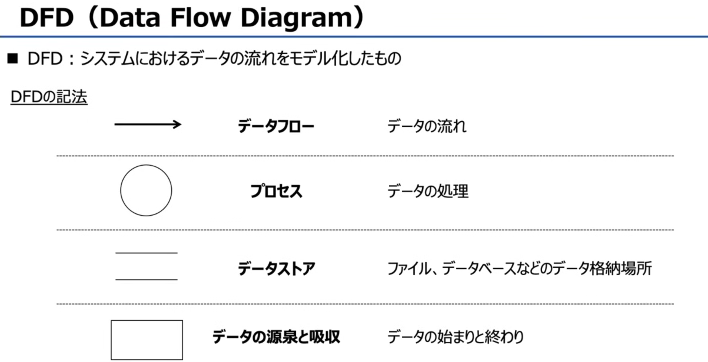
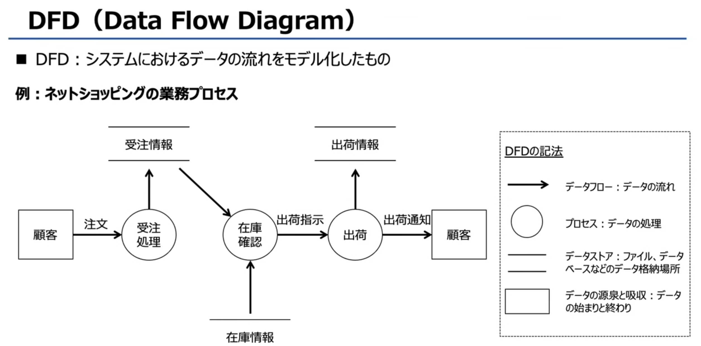
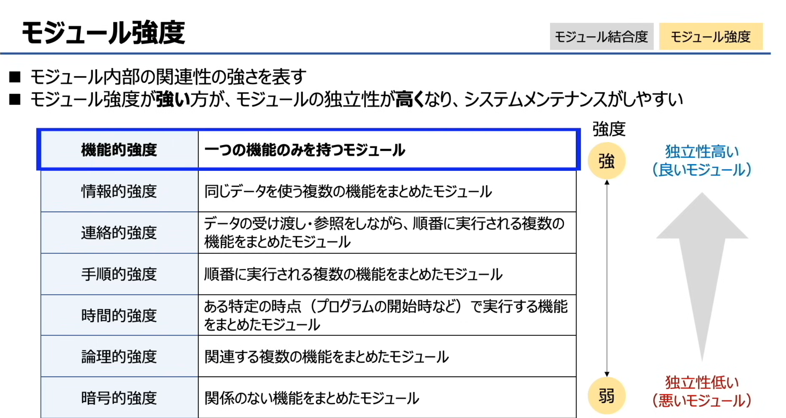
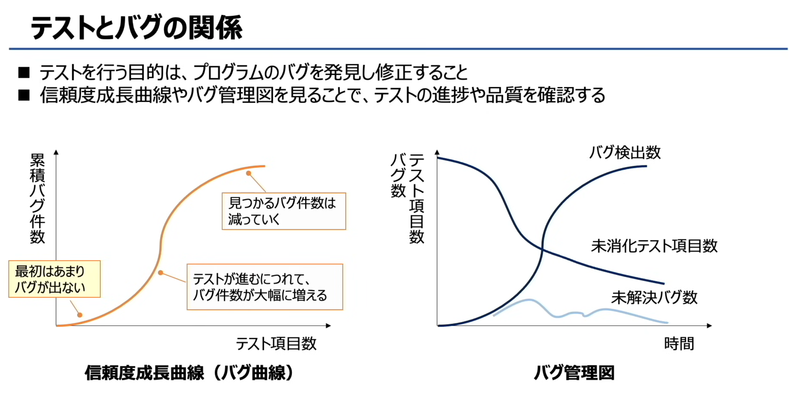
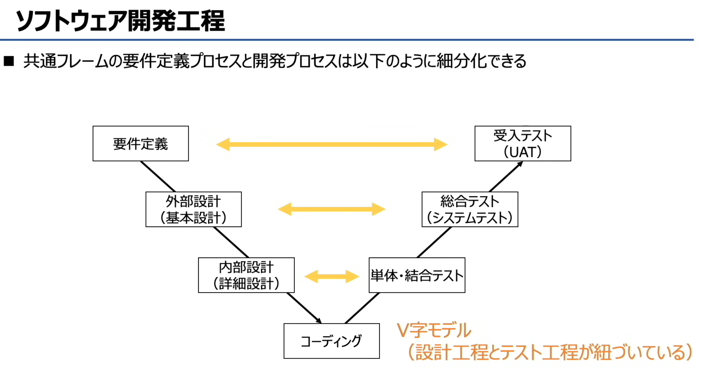
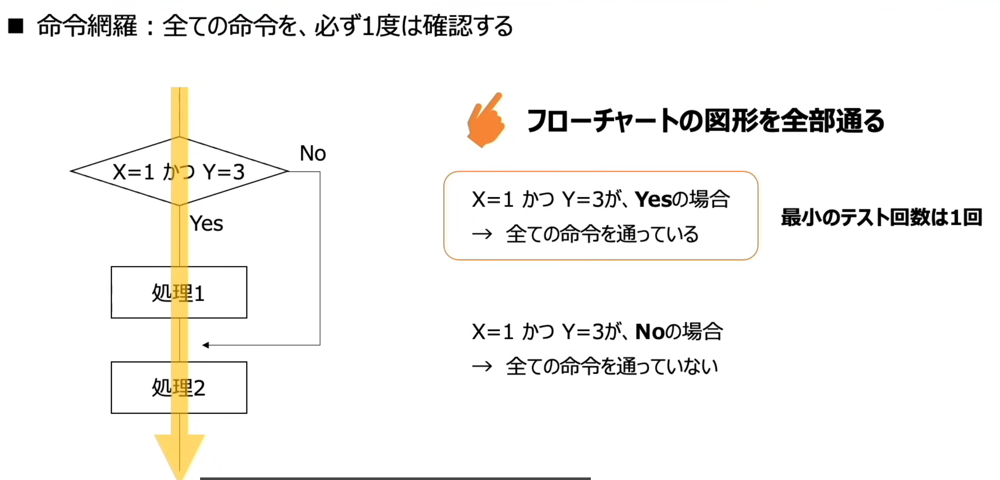
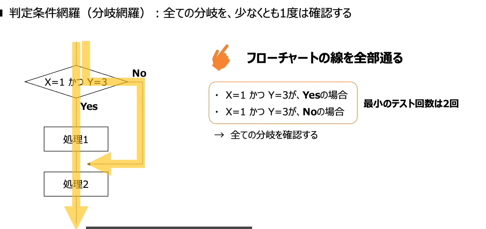
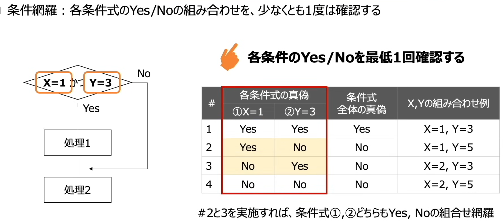
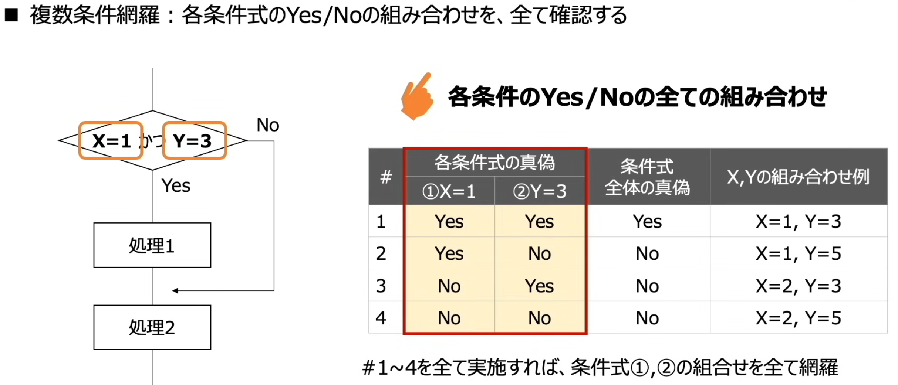

# システム開発


ユーザー企業（用户企业）：有系统开发需求的一方，也就是提出业务需求、使用最终系统的企业。
ベンダ企業（厂商企业）：承接开发任务的一方，比如 Sier 这类系统开发公司，负责从设计、开发到交付的全流程工作。

「ベンダ」对应的英文是 vendor。
在 IT 行业的语境里，它通常指供应商、厂商，比如提供系统、软件或服务的企业。


# システム開発の流れ（系统开发流程）总结

## 核心概念
- **共通フレーム（通用框架）**：定义了软件开发的**工程、作业内容和作业范围**的指导方针，也就是系统开发的标准流程规范。

## 系统开发的5个核心流程
1.  **企画プロセス（企划阶段）**
    - 确认业务需求和课题，构思系统方案，制定具体的开发计划。
    - 关键词：ニーズ・課題確認 → システム化構想 → システム化計画

2.  **要件定義プロセス（需求定义阶段）**
    - 明确系统的详细功能、规格和非功能需求，把用户的需求转化为可执行的开发要求。
    - 关键词：詳細機能・仕様の明確化

3.  **開発プロセス（开发阶段）**
    - 基于需求定义，进行系统的设计、编码和测试，完成系统的构建。
    - 关键词：要件をもとに設計・開発

4.  **運用プロセス（运用/上线阶段）**
    - 系统正式上线投入使用，进行日常的运行和监控。
    - 关键词：システムの本番運用

5.  **保守プロセス（维护阶段）**
    - 对运行中的系统进行问题修正、功能优化和故障处理，保证系统稳定运行。
    - 关键词：問題点修正・メンテナンス

💡 一句话理解：系统开发就是从「企划需求」→「明确规格」→「设计开发」→「上线使用」→「维护优化」的完整生命周期流程。

# RFI RFP

企业在选择系统开发厂商时，两个关键的采购流程：**RFI** 和 **RFP**。

- **RFI（Request For Information，情報提供依頼書 / 信息提供请求书）**
  这是流程的第一步，用户企业向多家厂商发出请求，目的是收集厂商的一般性信息，比如他们提供的服务、产品能力和行业经验。这一步就像一次“海选”，用来初步筛选出符合基本条件的厂商，也被称为“一次审查”。

- **RFP（Request For Proposal，提案依頼書 / 提案请求书）**
  这是流程的第二步，用户企业会向通过RFI筛选的厂商，发出更具体的提案请求。它要求厂商针对用户的特定需求，提交一份详细的解决方案，包括技术方案、实施计划、报价等。这一步是为了进行深度评估，选出最合适的合作方，也被称为“二次审查”。

# 软件开发工程（ソフトウェア開発工程）流程模型 
  
也就是我们常说的「V模型」

### 核心概念
日本的「共通フレーム」中，会把系统开发里的「要件定義プロセス」和「開発プロセス」进一步细化，形成了这套一一对应的流程。

---

### 开发流程（左侧：从需求到编码）
1.  **要件定義**：明确系统的业务需求、功能和非功能要求，确定“系统要做什么”。
2.  **外部設計（基本設計）**：设计系统的整体架构、模块划分和外部接口，确定“系统的整体结构是什么样”。
3.  **内部設計（詳細設計）**：细化到每个模块的内部逻辑、数据结构和处理流程，确定“每个模块具体怎么实现”。
4.  **コーディング（编码）**：根据详细设计，编写具体的程序代码。

### 测试流程（右侧：从单元到验收）
1.  **単体・結合テスト（单元/集成测试）**：对应内部设计，测试单个模块的功能，再测试模块之间的协同工作是否正常。
2.  **総合テスト（システムテスト/系统测试）**：对应外部设计，把整个系统当成一个整体，验证系统功能、性能是否符合设计要求。
3.  **受入テスト（UAT/用户验收测试）**：对应要件定义，由用户直接参与，验证系统是否满足最初的业务需求，确认可以正式上线。

### 关键逻辑
- 每一个开发阶段，都对应一个后续的测试阶段，形成了「V」字形的对应关系。
- 这种模型的好处是，在开发的早期就能明确后续测试的依据，确保最终交付的系统和最初的需求保持一致。

💡 一句话理解：这是一套「设计和测试一一对应」的开发流程，你定了什么样的需求和设计，就会有对应的测试来验证它，保证系统不跑偏。


# レビュー（Review/评审）

核心是在每个开发阶段对成果物进行验证，提前发现问题。

### 核心定义
**レビュー（评审）**：在系统开发的每个工程阶段，对产出的成果物（比如设计文档、代码）进行检查、验证的过程，目的是提前发现缺陷、降低后期修改成本。

---

### 三种代表性评审手法
1.  **ウォークスルー（Walkthrough / 走查）**
    由成果物的**担当者**，向相关人员说明成果物的内容，大家一起边听边检查。形式上以“说明+讨论”为主，氛围相对轻松，重点是让团队成员理解成果物并发现问题。

2.  **インスペクション（Inspection / 审查）**
    有明确的**モデレーター（主持人）**，会明确划分每个参与者的角色（比如记录员、检查者），按固定流程推进。这是一种结构化、正式的评审方式，有明确的规则和步骤，检查更严谨。

モデレーター 对应的英文是 moderator。
在软件开发评审（インスペクション）这类场景里，它就是指负责会议主持、流程推进的「主持人 / 协调人」角色。

3.  **ラウンドロビン（Round-robin / 轮询评审）**
    所有参与者按主题轮流担任**责任者**，对成果物进行检查。大家轮流主导评审，每个人都要对内容提出意见，确保成果物从多个角度被充分验证。

💡 一句话区分：
- 走查：作者讲，大家听着检查。
- 审查：主持人带队，按流程分工检查。
- 轮询：大家轮流当负责人，多角度检查。

# EA（エンタープライズアーキテクチャ / Enterprise Architecture，企业架构

## 核心概念
EA的目标不是优化单个系统，而是从**企业整体视角**出发，实现业务与IT的全局最优化，避免各部门系统各自为政、重复建设。

为了实现这个目标，EA将企业架构拆解为4个层级的体系，从顶层战略到底层技术逐层落地：

1.  **ビジネスアーキテクチャ（业务架构）**
    企業の戦略実現に必要な業務内容、業務プロセス等を定義する層。
    企业战略落地所需的业务内容、业务流程、组织架构等，定义“企业要做什么业务”。

2.  **データアーキテクチャ（数据架构）**
    業務を行う上で必要なデータ、データの関連性を定義する層。
    支撑业务运转所需的数据、数据间的关联与流动规则，定义“业务需要什么数据”。

3.  **アプリケーションアーキテクチャ（应用架构）**
    データを処理する情報システムの機能を定義する層。
    处理这些数据的信息系统功能、模块划分与交互关系，定义“用什么系统处理数据”。

4.  **テクノロジーアーキテクチャ（技术架构）**
    システムの構築に必要な技術的構成要素を定義する層。
    支撑系统构建的技术要素，比如服务器、网络、中间件、开发语言等，定义“用什么技术搭建系统”。

一句话理解：EA就是把企业从“业务战略”到“底层技术”的所有环节，梳理成一套统一、协调的整体蓝图，确保所有系统都服务于企业的整体目标。


# システム開発手法


# システム開発手法（系统开发方法）总结

### ① ウォーターフォール（Waterfall / 瀑布模型）
- **特点**：工程按「上流→下流」的顺序线性推进，每个阶段完成后再进入下一阶段，不回头。
- **流程**：企画 → 要件定義 → 設計 → 開発 → テスト → 運用保守
- **适用场景**：需求明确、变更少的项目。

### ② アジャイル（Agile / 敏捷开发）
- **特点**：通过短周期（スプリント/迭代）循环开发，快速交付可用功能，持续根据反馈调整。
- **流程**：短い開発サイクルを回す（反复迭代、快速反馈）
- **适用场景**：需求不明确、需要快速响应变化的项目。

### ③ プロトタイピングモデル（Prototyping Model / 原型模型）
- **特点**：先制作系统原型（試作品），让用户确认、反馈后再正式开发。
- **流程**：試作品を作成し、利用者がチェックを行いながら進める
- **适用场景**：用户需求模糊、需要通过原型确认功能的项目。

### ④ リバースエンジニアリング（Reverse Engineering / 逆向工程）
- **特点**：从已有的系统或成品出发，逆向推导出设计文档、代码逻辑或架构。
- **流程**：開発工程を遡り、設計書を取り出す
- **适用场景**：维护无文档的旧系统、分析已有软件或做系统重构时。

💡 一句话区分：
- 瀑布模型：按部就班，一步到底
- 敏捷开发：小步快跑，快速迭代
- 原型模型：先做样品，用户确认
- 逆向工程：从成品倒推，还原设计

# ウォーターフォール（瀑布模型）总结

这张图详细介绍了系统开发中最经典的**瀑布模型（Waterfall Model）**。

---

## 核心定义
ウォーターフォール是一种线性开发手法，将开发流程分为「要件定義 → 設計 → 開発 → テスト → 完成」等阶段，从上流工程到下流工程按顺序推进，像瀑布一样“一泻而下”，不回头。

---

## メリット（优点）
- 全体スケジュールが立てやすく、計画通りに開発を進めやすい。
  （项目整体进度容易规划，便于按计划推进开发）
- 每个阶段的目标和交付物明确，管理简单。

---

## デメリット（缺点）
- 途中の仕様変更を取り入れにくい。
  （中途很难应对需求变更）
- 不具合が発生すると、後戻りが難しい。
  （如果后期发现问题，修改成本高，回溯困难）

---

一句话总结：瀑布模型适合**需求稳定、变更少**的项目，优点是计划清晰、管理简单；缺点是缺乏灵活性，难以应对后期的需求变化和问题。


# アジャイル（敏捷开发）总结

这张图介绍了**アジャイル（Agile/敏捷开发）**这种主流开发手法。

---

## 核心定义
アジャイル（意为“机敏、迅速”）是一种迭代式开发方法，它以**小的功能模块为单位**，循环推进开发周期，每个周期完成后就发布可用功能，分阶段逐步完成整个系统。

## 核心流程
- 每个迭代周期内：**開発 → リリース（发布）**
- 多轮迭代：リリース1 → リリース2 → …… 逐步交付完整系统

---

## メリット（优点）
- **開発期間が短い**：早期就能交付可用功能，缩短整体项目周期。
- **仕様変更に柔軟に対応できる**：需求变更可以在后续迭代中快速调整，适应性强。

---

## デメリット（缺点）
- **全体スケジュールが立てにくく、進捗が把握しづらい**：整体计划难制定，进度管理相对困难。
- **開発の方向性がずれやすい**：如果缺乏明确的目标管理，容易偏离用户的真实需求。

---

一句话总结：敏捷开发适合**需求易变、需要快速交付**的项目，优点是灵活、响应快；缺点是整体规划和进度把控难度较大。


# XP（极限编程） Scrum（敏捷框架）

## 一、XP（エクストリームプログラミング / 极限编程）
XP是一种以**技术实践为核心**的敏捷开发方法，强调通过一系列严格的工程实践，快速、高质量地交付软件，同时灵活响应用户需求。

1.  **核心流程**
    反复执行「設計 → 開発 → テスト → 改善」的循环（イテレーション），通过短周期迭代持续优化系统。

2.  **三大核心实践**
    - **ペアプログラミング（结对编程）**：两人一组，一人写代码、一人同步检查，边写边审，减少缺陷。
    - **リファクタリング（重构）**：不改变程序外部行为，只优化内部代码结构，让代码更清晰易维护。
        Refactoring

    - **テスト駆動開発（TDD，测试驱动开发）**：先写测试代码，再编写能通过测试的功能代码，从源头保证代码质量。

## 二、スクラム（Scrum）
Scrum是一种以**团队协作和流程管理**为核心的敏捷框架，强调团队作为一个整体，在短周期内高效交付可用产品。

1.  **核心流程**
    - **プロダクト計画**：制定产品整体目标和需求列表。
    - **スプリント計画**：为1~4周的开发周期（スプリント）制定具体任务。
    - **スプリント実行**：在周期内开发，每日通过**デイリースクラム（站会）**同步进度、解决障碍。
    - **レビュー・振り返り**：周期结束后，评审交付成果并复盘改进流程。

### 两者的核心区别
- **XP** 更关注**“怎么写好代码”**，通过技术实践保证开发质量和响应速度。
- **Scrum** 更关注**“怎么管好团队和流程”**，通过迭代和协作机制实现高效交付。

两者都是敏捷开发的主流实现方式，很多团队会结合Scrum的流程框架和XP的技术实践，打造完整的敏捷开发体系。


我们先梳理Scrum团队的角色分工，再一步步拆解这道题。

---

## 一、核心知识点：Scrum团队的三大角色

Scrum团队由三个核心角色组成，各自职责明确：

1.  **プロダクトオーナー（Product Owner / 产品负责人）**
    - 职责：对产品的最终价值和方向负责，管理「プロダクトバックログ（Product Backlog，产品待办列表）」，决定功能的优先级，确保团队开发的功能能满足业务目标。
    - 核心任务：**决定做什么、先做什么**。

2.  **スクラムマスター（Scrum Master / Scrum主管）**
    - 职责：作为团队的“教练”和“服务型领导”，清除障碍、保护团队、确保Scrum流程顺畅执行。
    - 核心任务：**帮助团队高效运转**，不直接决定产品内容。

3.  **開発チーム（Development Team / 开发团队）**
    - 职责：由跨职能成员组成，负责具体实现产品功能，完成Sprint目标。
    - 核心任务：**决定怎么做，并交付可用的产品增量**。

---

## 二、题目解析

### 题目原文
> スクラムチームにおけるプロダクトオーナーの役割はどれか。
> （Scrum团队中，产品负责人的职责是哪一项？）

### 选项逐一分析

- **ア**：ゴールとミッションが達成できるように，プロダクトバックログのアイテムの優先順位を決定する。
  - 翻译：为了达成目标和使命，决定产品待办列表（Product Backlog）中条目的优先级。
  - 解析：这正是Product Owner的核心职责——通过管理Backlog优先级，确保团队始终开发最高价值的功能。✅ **正确**。

- **イ**：チームのコーチやファシリテータとして，スクラムが円滑に進むように支援する。
  - 翻译：作为团队的教练和引导者，支持Scrum流程顺畅进行。
  - 解析：这是Scrum Master的职责，不是Product Owner的。❌

- **ウ**：プロダクトを完成させるための具体的な作り方を決定する。
  - 翻译：决定完成产品的具体制作方法。
  - 解析：这是开发团队的职责，团队有权自主决定实现方式。❌

- **エ**：リリース判断可能な，プロダクトのインクリメントを完成する。
  - 翻译：完成可用于发布判断的产品增量。
  - 解析：交付可用的产品增量是开发团队的职责。❌

---

## 三、结论
这道题的正确答案是 **A（ア）**。

💡 一句话记忆：
- プロダクトオーナー = 管方向、定优先级
- スクラムマスター = 管流程、清障碍
- 開発チーム = 管实现、做增量


# プロトタイピングモデル（原型模型）

## 核心定义
プロトタイピングモデル，是在开发早期就制作出系统的**试作品（プロトタイプ/原型）**，在获取用户确认和反馈后，再推进后续开发流程的方法。

## 开发流程
1.  **要件定義**：先收集用户的初步需求。
2.  **プロトタイプ作成**：快速制作一个简易的原型，展示系统的界面和核心功能。
3.  **プロトタイプ確認**：让用户试用原型，确认是否符合预期，并收集反馈。
4.  **設計・開発・テスト・完成**：基于确认后的原型，进行正式的设计、开发、测试，直到系统完成。

## メリット（优点）
- 早期就能让用户参与确认，**利用者との認識のズレが発生する可能性が低く、手戻りになりにくい**。
  （降低了和用户之间理解偏差的风险，减少后期返工的概率）

## デメリット（缺点）
- **プロトタイプを作るのにコストがかかる**。
  （制作原型本身需要额外的时间和成本）

一句话总结：原型模型特别适合用户需求模糊、不确定的项目，通过早期制作原型来明确需求、减少返工，但需要付出制作原型的额外成本。


# リバースエンジニアリング（逆向工程）总结

## 核心定义
リバースエンジニアリング，是对**既存的制品或程序**进行解析，反向推导出其仕组み（机制）、仕様（规格）和設計（设计）的方法。它和常规开发流程是相反的：
- 常规流程：設計書 → プログラム → システム
- 逆向工程：システム → 解析 → 設計書（还原）

---

## メリット（优点）
- 開発にかかるコストと時間を削減できる。
  （通过解析现有系统，避免从零开始开发，能节省开发成本和时间，常用于无文档旧系统的维护）

## デメリット（缺点）
- 特許権や著作権の侵害に当たる可能性がある。
  （如果未经授权解析他人的软件，可能会侵犯对方的专利权或著作权，存在法律风险）

---

一句话总结：逆向工程就是“从成品倒推设计”，适合维护无文档的旧系统，但必须注意版权和法律问题。


# 業務モデリングとユーザーインターフェース


1.  **業務モデリング**
    - 英文：**Business Modeling**
    - 中文翻译：业务建模
    - 说明：指将企业的业务流程、规则和组织关系抽象成模型，用于分析和设计系统。

2.  **ユーザーインターフェース**
    - 英文：**User Interface (UI)**
    - 中文翻译：用户界面
    - 说明：指用户与系统交互的界面，比如网页、App 的画面、按钮布局等。


我先帮你把图片里的日文内容完整翻译，再给你一个清晰的总结：

---

### 一、标题与基础说明
**業務モデル（ぎょうむモデル / gyōmu moderu）**
→ 中文：**业务模型**

两条核心说明：
1.  要件定義を行う前にはユーザ業務のヒアリングを行う
    → 中文：在进行需求定义前，需要先对用户业务进行访谈调研。
2.  ヒアリングした業務プロセス等を業務モデルとして図式化する
    → 中文：将访谈得到的业务流程等信息，以业务模型的形式进行图形化表达。

---

### 二、代表性业务模型说明
| 模型 | 日文原文说明 | 中文翻译说明 |
| :--- | :--- | :--- |
| **E-R図**（Entity-Relationship Diagram） | データベース設計で使用され、実体（対象業務を構成するモノ）と実体の関連をモデル化したもの | 用于数据库设计，对**实体（构成目标业务的事物）**及其之间的关联进行建模的工具 |
| **DFD**（Data Flow Diagram） | システムにおけるデータの流れをモデル化したもの | 对系统中**数据的流动过程**进行建模的工具 |
| **UML**（Unified Modeling Language） | オブジェクト指向のシステム開発で使用され、分析から設計、実装まで一貫した表記方法でモデル化したもの | 用于面向对象的系统开发，是一套从分析、设计到实现都能通用的、统一的建模表示方法 |

---

### 三、核心总结
这张图讲的是系统开发中**业务模型**的基本概念与常见工具：
1.  **业务模型的作用**：是把用户的真实业务流程，通过图形化方式梳理、标准化，为后续的需求定义和系统设计打基础。
2.  **三个常用工具的分工**：
    - **E-R图**：聚焦业务里的“实体和关系”，主要服务于数据库设计。
    - **DFD**：聚焦业务里的“数据怎么流”，帮你理清系统的数据处理逻辑。
    - **UML**：面向对象开发的“通用建模语言”，覆盖从分析到实现的全流程。







# DFD Data Flow Diagram 数据流图

### 一、标题与核心定义
**DFD（Data Flow Diagram）**
中文全称：**数据流图**

- 日文原文：`DFD：システムにおけるデータの流れをモデル化したもの`
- 翻译：**DFD 是对系统中数据的流动过程进行建模的工具**。
简单说，它的核心作用就是：用图形化的方式，把“数据从哪来、经过什么处理、存到哪去、最终到哪去”整个流程讲清楚。

### 二、DFD的4种基础记法（符号说明）
这张表里列出了DFD最核心的4个符号，我帮你逐个翻译+解释：

| 符号 | 日文原文 | 中文翻译 | 通俗解释 |
| :--- | :--- | :--- | :--- |
| →（箭头） | データフロー（データの流れ） | 数据流（数据的流动） | 表示“数据的传递方向”，比如用户输入的订单数据，从用户流向系统处理模块 |
| ○（圆形） | プロセス（データの処理） | 过程/处理（数据的处理） | 表示“对数据的加工操作”，比如“计算订单金额”“验证用户登录信息”这类逻辑处理 |
| 双横线（矩形） | データストア（ファイル、データベースなどのデータ格納場所） | 数据存储（文件、数据库等数据存放位置） | 表示“数据的存放地”，比如订单数据库、用户信息文件、日志表 |
| □（矩形） | データの源泉と吸収（データの始まりと終わり） | 数据源与数据终点（数据的起点与终点） | 表示“系统之外的外部实体”，比如用户、外部支付系统、第三方物流接口，是数据的来源或最终去向 |

---

### 三、核心总结（帮你快速记住）
1.  **DFD的本质**：它是一张“数据旅行地图”，专门用来画清楚系统里数据的来龙去脉，不关心具体的技术实现，只关心数据的流动和处理逻辑。
2.  **4个符号的分工（一句话记）**：
    - 箭头=数据怎么走
    - 圆圈=数据怎么处理
    - 双横线=数据存在哪
    - 方框=数据从哪来/到哪去
3.  **它的用途**：在系统分析阶段，用来梳理业务逻辑、和业务方对齐数据流程，避免出现“数据从哪来、要去哪”的理解偏差。

---

💡 补充小知识点：
DFD 有个特点，它是“分层”的。比如顶层的DFD是整个系统的大流程，往下一层可以把“订单处理”这个大过程拆成更细的子流程，这样既能看到整体，也能看清细节。


# ユーザーインターフェース（UI，用户界面）
### 核心定义
**ユーザーインターフェース（UI）**：用户与计算机之间的接点，是用户和计算机之间传递信息的机器或输入装置。
简单说，就是用户和电脑“打交道”的所有渠道，分为硬件和软件两个层面。

### 按类型拆分的UI例子
1.  **画面表示装置（显示设备）**
    例子：手机、平板、电脑显示器
    软件层面的UI元素：网页的画面布局、设计、字体等

2.  **情報入力装置（信息输入设备）**
    例子：鼠标、键盘、触控笔、游戏手柄等

3.  **音声入出力装置（音频设备）**
    例子：麦克风（输入）、扬声器（输出）


# インターフェース設計（界面设计）
界面设计主要分为两大类：**画面设计**和**传票设计（表单/单据设计）**

### ① 画面設計（屏幕界面设计）
-   **定义**：设计画面的项目、布局，以及用户输入数据时的操作方式。
-   **关键要点**：
    -   操作按钮的形状、显示位置要保持统一，降低用户学习成本。
    -   输入项要按照“从左上到右下”的顺序排列，符合用户的阅读习惯。

### ② 帳票設計（单据/表单设计）
-   **定义**：设计账簿、票据的布局，以及打印输出的内容。
-   **关键要点**：
    -   相关的项目要放在一起，减少用户来回查找的成本。
    -   去除多余信息，只保留必要的最小限度内容，避免信息混乱。


## 整体核心总结
这两张图讲的是系统开发中「用户界面（UI）」的完整概念：
1.  **UI是什么**：它不只是屏幕上的按钮和布局，而是用户和系统交互的所有渠道，包括硬件（鼠标、显示器）和软件（网页、APP界面）两部分。
2.  **界面设计的两大方向**：
    -   **画面设计**：面向用户在屏幕上的直接操作，核心是「操作统一、流程顺畅」。
    -   **单据设计**：面向打印/导出的表单、票据，核心是「信息清晰、必要且精简」。
3.  **设计的底层逻辑**：所有设计的目标都是降低用户的使用成本，让交互更自然、高效。

---
💡 补充小知识点：
日语里的「帳票設計」，在中文里常被翻译成「报表设计」或「单据设计」，指的就是订单、发票、报表这类需要打印或导出的文档设计。


#  两种常见的UI类型
**ユーザーインターフェース（UI，用户界面）**：用户和计算机之间的交互接点，也就是双方传递信息的设备/装置。

---

### 两种常见的UI类型
1.  **GUI（Graphical User Interface，图形用户界面）**
    -   日文：グラフィカルユーザーインターフェイス
    -   定义：通过画面上的图标、按钮，用鼠标进行操作的**视觉化界面**。
    -   例子：Windows、macOS、手机APP界面。

2.  **CUI（Character User Interface，字符用户界面）**
    -   日文：キャラクターユーザーインターフェイス
    -   定义：用**键盘输入文字命令**来操作的界面。
    -   例子：命令提示符（CMD）、Linux终端、早期的DOS系统。

---

### 一句话总结
这张图讲了用户界面（UI）的基本概念，以及两种最常见的类型：
- **GUI**：靠鼠标点图标、按钮的图形化界面（直观好上手）
- **CUI**：靠键盘敲命令的纯文字界面（高效但需要学习成本）


# モジュール分割

#  モジュール  模块（Module）

## 一、核心定义（モジュール / 模块）
**日文原文**：
モジュール：システムや機器を構成する1つの機能や要素（=部品）

**中文翻译**：
模块（Module）：构成系统或设备的**单个功能或要素（=部件/组件）**

**通俗解释**：
模块就是把一个大系统拆分成的、可以独立完成特定功能的“零件”。比如人事系统里的「登录功能」「删除功能」，都是独立的模块。

---

## 二、图示逻辑拆解（人事系统的模块拆分）
这张图用「人事系统」举例，展示了模块的层级结构：
1.  **顶层：人事システム（人事系统）**
    整个大系统本身，由多个模块组合而成。
2.  **一级模块：登録機能（登录功能）、削除機能（删除功能）、更新機能（更新功能）…**
    这些是人事系统的核心业务模块，每个模块负责一个独立的业务动作。
3.  **二级模块：XX機能（子功能模块）**
    一级模块还可以继续拆分成更小的子模块。比如「削除機能」可以拆分成「用户验证」「权限检查」「数据删除」等子模块。

---

## 三、模块的核心特点
- **独立性**：每个模块都有明确的单一职责，修改其中一个模块，不会直接影响其他模块。
- **可组合性**：多个模块可以组合起来，构成完整的系统。
- **可复用性**：通用模块（比如登录验证）可以在多个系统中重复使用，减少重复开发。

---

## 四、补充记忆点（结合之前的考点）
模块拆分是**功能中心设计（プロセス中心）**的典型思路：
- 以「功能」为核心，把系统按业务流程拆分成多个模块。
- 模块的独立性越高，系统的可维护性、可扩展性就越强。

# 「モジュール分割（模块拆分）」

## 一、核心定义
**日文原文**：
モジュール単位で開発・テストを行っていく

**中文翻译**：
按「模块」为单位，进行开发和测试。

**通俗解释**：
把一个大系统拆分成多个独立的小模块，每个模块单独开发、单独测试，而不是一次性开发整个系统。

---

## 二、模块拆分的优点（メリット）

### ① 複数人で並行して作業を進めることができる
**翻译**：可以多人并行推进开发工作。
**解释**：不同的开发人员可以负责不同的模块，互不干扰，大幅提高开发效率。

### ② 共通する機能を他のところでも再利用できる
**翻译**：通用的功能可以在其他地方重复利用。
**解释**：比如「用户登录」模块，写好之后可以在多个系统中复用，不用每次都重新开发。

### ③ プログラムに問題が起こった場合、一部の修正でよい
**翻译**：程序出现问题时，只需要修改对应的部分即可。
**解释**：因为模块之间是独立的，某个模块出bug，只需要修改这个模块本身，不会影响其他模块的功能，维护成本更低。

---

## 三、图示逻辑补充
图中的「人事システム」例子，就是典型的模块拆分思路：
- 顶层是「人事系统」整体
- 拆分为「登录功能、删除功能、更新功能」等一级模块
- 再进一步拆分为更小的「XX功能」子模块
- 开发和测试都以这些拆分后的模块为单位进行

---

💡 一句话总结：模块拆分就是把大系统拆成小零件，让开发、协作、复用、维护都变得更高效。


## 一、核心概念：モジュールの独立性（模块独立性）
**日文原文**：
独立性とは他モジュールとの関係度合のことであり、独立性が高いとシステムメンテナンスが行いやすい

**中文翻译**：
独立性指的是「该模块与其他模块的关联程度」；独立性越高，系统维护越容易。

**通俗解释**：
一个模块越“不依赖其他模块”，修改它时越不容易影响其他部分，维护起来就越轻松。

模块独立性由两个核心指标决定：
1.  **モジュール結合度（模块耦合度）**：模块之间的关联强弱
2.  **モジュール強度（模块内聚度）**：模块内部功能的关联强弱

---

## 二、モジュール結合度（模块耦合度）
### 基础定义
- **日文原文**：モジュール同士の関連性の強さを表す。モジュール結合度が弱い方が、モジュールの独立性が高くなり、システムメンテナンスがしやすい。
- **中文翻译**：表示模块之间关联的强弱。耦合度越弱，模块独立性越高，系统越容易维护。
- **通俗理解**：耦合度=模块之间的“绑定程度”，绑定越松（弱耦合）越好。

### 耦合度从弱到强（独立性从高到低）
| 耦合度名称 | 日文原文 | 中文翻译 | 说明 |
| :--- | :--- | :--- | :--- |
| データ結合 | 処理に必要なデータだけを引数として渡す | 数据耦合 | 只传递处理必需的数据参数，耦合度最弱，是最好的情况 |
| スタンプ結合 | データ構造（データのまとまり）を引数として渡す | 印记耦合 | 传递整个数据结构（比如结构体），即使只用到其中一部分 |
| 制御結合 | モジュールの実行順序を制御するデータ（制御パラメータ）を引数として渡す | 控制耦合 | 传递控制执行流程的参数（比如标志位），会影响对方模块的逻辑 |
| 外部結合 | 外部宣言されたデータを参照する | 外部耦合 | 模块间共享外部定义的全局数据 |
| 共通結合 | 外部宣言されたデータ構造（データのまとまり）を参照する | 公共耦合 | 多个模块共享同一个全局数据结构 |
| 内容結合 | 他のモジュール内のデータを参照する | 内容耦合 | 直接访问、修改其他模块的内部数据，耦合度最强，是最差的情况 |

---

## 三、モジュール強度（模块内聚度）
### 基础定义
- **日文原文**：モジュール内部の関連性の強さを表す。モジュール強度が強い方が、モジュールの独立性が高くなり、システムメンテナンスがしやすい。
- **中文翻译**：表示模块内部功能关联的强弱。内聚度越强，模块独立性越高，系统越容易维护。
- **通俗理解**：内聚度=模块内部的“凝聚力”，功能越单一、越聚焦（强内聚）越好。

### 图示逻辑
- 强内聚：模块内只有一个核心功能，比如「機能1」，模块职责单一。
- 弱内聚：模块内包含多个关联松散的功能（機能1/2/3），职责不明确，维护时容易互相影响。

---

## 四、核心结论（考点关键）
✅ **好的模块设计**：
- 低結合度（弱耦合）+ 高強度（强内聚）
- 模块之间关联松散，模块内部功能聚焦，独立性高，维护成本低。

❌ **坏的模块设计**：
- 高結合度（强耦合）+ 低強度（弱内聚）
- 模块之间绑定过深，模块内部职责混乱，修改一处容易引发连锁bug。

---

💡 记忆小技巧：
- 耦合度：模块间的“关系”，越弱越好（数据耦合>内容耦合）
- 内聚度：模块内的“团结度”，越强越好（单一功能>混乱功能）




# 「モジュール強度（模块内聚度）」

### 一、核心定义
- **日文原文**：
  モジュール内部の関連性の強さを表す。
  モジュール強度が強い方が、モジュールの独立性が高くなり、システムメンテナンスがしやすい。
- **中文翻译**：
  表示模块内部功能关联的强弱程度。
  内聚度越强，模块的独立性越高，系统维护越容易。

### 二、内聚度从强到弱的7个等级（独立性从高到低）

1.  **機能的強度（功能内聚）**
    - 原文：一つの機能のみを持つモジュール
    - 翻译：只包含单一功能的模块
    - 说明：内聚度最强，是最理想的模块设计。模块只做一件事，职责清晰，维护和复用都非常方便。

2.  **情報的強度（信息内聚）**
    - 原文：同じデータを使う複数の機能をまとめたモジュール
    - 翻译：将使用同一数据的多个功能整合在一起的模块
    - 说明：模块内的多个功能共享同一数据（比如对同一个数据对象的增删改查），关联性很强。

3.  **連絡的強度（通信内聚）**
    - 原文：データの受け渡し・参照をしながら、順番に実行される複数の機能をまとめたモジュール
    - 翻译：将在执行过程中传递、引用数据，按顺序执行的多个功能整合在一起的模块
    - 说明：模块内的功能会按顺序处理同一个数据，比如「读取数据→计算→输出结果」，关联性中等。

4.  **手順的強度（过程内聚）**
    - 原文：順番に実行される複数の機能をまとめた能をまとめたモジュール
    - 翻译：将按固定顺序执行的多个功能整合在一起的模块
    - 说明：模块内的功能有执行顺序，但它们之间没有数据传递，关联性较弱。

5.  **時間的強度（时间内聚）**
    - 原文：ある特定の時点（プログラムの開始時など）で実行する機能をまとめたモジュール
    - 翻译：将在特定时间点（如程序启动时）执行的多个功能整合在一起的模块
    - 说明：模块内的功能仅因为“同一时间执行”被放在一起，功能本身没有直接关联，内聚度较低。

6.  **論理的強度（逻辑内聚）**
    - 原文：関連する複数の機能をまとめたモジュール
    - 翻译：将逻辑上相关的多个功能整合在一起的模块
    - 说明：模块内的功能只是逻辑上类似（比如不同类型的报表打印），但各自的处理逻辑完全独立，关联性很弱。

7.  **暗号的強度（偶然内聚）**
    - 原文：関係のない機能をまとめたモジュール
    - 翻译：将毫无关联的多个功能整合在一起的模块
    - 说明：内聚度最弱，是最差的模块设计。模块内的功能没有任何逻辑或业务关联，维护时牵一发而动全身。

### 三、核心结论
✅ 模块设计的目标，是追求**高内聚**，也就是让模块内的功能关联尽可能紧密，最好是单一功能的「機能的強度」。
❌ 要避免低内聚，尤其是「暗号的強度」这种功能毫无关联的模块，会严重降低系统的可维护性。

💡 记忆小技巧：
从「機能的強度」到「暗号的強度」，内聚度越来越弱，模块内部的“团结度”越来越差，独立性也随之降低。

# テスト手法



# 「テストとバグの関係（测试与Bug的关系）」

## 一、基础定义（テストの目的）
- **日文原文**：
  テストを行う目的は、プログラムのバグを発見し修正すること。
  信頼度成長曲線やバグ管理図を見ることで、テストの進捗や品質を確認する。
- **中文翻译**：
  测试的目的是发现并修正程序中的Bug。通过「可靠性成长曲线（Bug曲线）」和「Bug管理图」，可以确认测试的进度和系统质量。

---

## 二、信頼度成長曲線（可靠性成长曲线 / Bug曲线）
- **坐标轴**：横轴=テスト項目数（测试用例数），纵軸=累積バグ件数（累计发现的Bug数量）
- **曲线趋势解读**：
  1.  **初期段階**：テスト開始直後は、あまりバグが出ない（刚启动测试时，发现的Bug很少）。
  2.  **中期段階**：テストが進むにつれて、バグ件数が大幅に増える（随着测试深入，大量Bug被集中发现）。
  3.  **後期段階**：テストが進むと、見つかるバグ件数は減っていく（测试后期，新发现的Bug越来越少，曲线趋于平缓）。
- **含义**：曲线从陡峭变平缓，说明系统的可靠性在提升，剩余Bug越来越少。

---

## 三、バグ管理図（Bug管理图）
- **坐标轴**：横轴=時間（时间），纵軸=テスト項目数・バグ数（测试用例数/Bug数）
- **三条曲线的含义**：
  1.  **バグ検出数（已发现Bug数）**：随时间推移，发现的Bug总数持续上升，后期增速放缓。
  2.  **未消化テスト項目数（未执行的测试用例数）**：随时间推移，未执行的测试用例数持续下降，直到趋近于0。
  3.  **未解決バグ数（未解决Bug数）**：随时间推移，先上升（发现Bug）、再下降（修复Bug），最终趋近于0。曲线的波动反映了Bug的修复节奏。
- **含义**：通过这三条曲线，可以直观判断测试进度是否正常、Bug修复是否及时，确认系统是否可以进入收尾阶段。

## 四、核心结论
- 测试的本质是「发现Bug→修复Bug→提升系统可靠性」的过程。
- 两张图分别从**累计Bug趋势**和**测试进度/Bug修复状态**两个维度，帮助团队把控测试质量，判断系统是否达到发布标准。

💡 补充考点记忆：
- 信頼度成長曲線：核心是「累计Bug数」随测试推进的变化，曲线趋平=系统趋于稳定。
- バグ管理図：核心是三条曲线的对比，关键看「未解决Bug数」是否下降、「未执行测试用例数」是否清零。




## 一、先搞懂：単体テスト（单元测试）是什么？
**日文原文**：
機能要件を満たしているか、モジュール単位にテストを行う
**中文翻译**：
以「模块（モジュール）」为单位，测试它是否满足功能需求。

简单说，单元测试就是**把系统拆成一个个小零件（模块），单独测试每个零件能不能正常工作**。比如你做了一个“加法计算器”模块，单元测试就是专门测这个加法功能算得对不对，不用管其他模块。

## 二、单元测试的两种核心方法：ブラックボックス vs ホワイトボックス

### 1. ブラックボックステスト（黑盒测试）
- **日文原文**：プログラムの中身を見ない（＝入力と出力に着目）
- **中文翻译**：不看程序内部逻辑，只关注「输入」和「输出」
- **通俗解释**：
  把模块当成一个“黑盒子”，你不知道里面是什么，只关心：给它一个输入，它能不能吐出正确的结果。
  比如你给加法模块输入`2`和`3`，它输出`5`，就说明这个功能没问题，至于它内部是怎么算的，你完全不用管。
- **核心思路**：验证「功能是否符合需求」，不关心实现细节。

---

### 2. ホワイトボックステスト（白盒测试）
- **日文原文**：プログラムの中身に着目
- **中文翻译**：关注程序的内部逻辑和代码结构
- **通俗解释**：
  把模块当成一个“透明盒子”，你能看到里面的代码、分支、循环，测试时要确保每一条逻辑路径都被覆盖到。
  比如加法模块里有个判断：“如果输入是负数，就返回错误”，白盒测试就要专门测“输入负数”这个分支，确保代码的每个角落都被走到了。
- **核心思路**：验证「代码逻辑是否正确」，关注实现细节和覆盖率。

---

## 三、一张对比表帮你分清两者的区别
| 维度 | ブラックボックステスト（黑盒） | ホワイトボックステスト（白盒） |
| :--- | :--- | :--- |
| 关注点 | 输入 → 输出的结果是否正确 | 内部代码、逻辑路径是否正确 |
| 看不看代码 | 不看（像个黑盒子） | 看（像个透明盒子） |
| 测试目标 | 功能是否满足需求 | 代码逻辑是否覆盖、无漏洞 |
| 典型场景 | 测试功能需求、用户场景 | 单元测试、代码覆盖率测试 |

---

## 四、补充小知识
- 单元测试里，这两种方法通常会结合使用：先用黑盒测功能对不对，再用白盒把代码里的分支、循环都测一遍，确保万无一失。
- 黑盒测试也叫「機能テスト（功能测试）」，白盒测试也叫「構造テスト（结构测试）」，本质是从“功能”和“结构”两个角度验证模块的正确性。

---

💡 举个生活化的例子帮你理解：
你买了一个智能电饭煲，单元测试就是测“煮饭”这个模块：
- **黑盒测试**：你按说明书的步骤，放米放水、按煮饭键，看它能不能煮出一锅正常的饭。你完全不用知道它里面的电路是怎么工作的。
- **白盒测试**：工程师拆开电饭煲，检查里面的温控器、加热盘、传感器，看每个电路和程序分支是不是都正常工作，确保不会因为某个零件坏了导致饭煮糊。


# 单元测试中的 黑盒测试

## 二、限界値分析（边界值分析）
### 日文原文
入力条件の「境界値」に着目してテストする手法。プログラムのバグは境界部分で発生しやすいため、境界値とその前後の値を重点的にテストする。

### 通俗解释
程序最容易出错的地方，往往是条件的“边界”（比如刚好等于、刚好大于/小于），所以要专门测这些边界点和它们的前后值。

### 举个例子
还是刚才的「18~60岁为合法年龄」的模块：
- **边界点**：18岁、60岁
- **边界点前后**：17岁、19岁、59岁、61岁
- 所以重点要测这几个值：`17`、`18`、`19`、`59`、`60`、`61`

为什么要这么做？
很多bug都是“差1个数字”导致的，比如把条件写成了`age > 18`而不是`age >= 18`，只测中间值发现不了问题，但测`18`这个边界点，bug就会立刻暴露出来。

---

## 三、两者的关系（考点关键）
- **同値分析**：解决“测哪些组”的问题，减少用例数量。
- **限界値分析**：解决“测哪些点”的问题，专门抓边界的bug。
- 实际测试中，两者会结合使用：先用等价类划分出有效/无效组，再在每个组的边界点上设计用例，效率和覆盖率都能兼顾。

---

💡 记忆小技巧：
- 同値分析：“按组划分，一组一个”，减少用例。
- 限界値分析：“抓边界、抓前后”，找最容易出错的地方。


# 「ホワイトボックステスト（白盒测试）」

## 一、核心定义
**日文原文**：
単体テスト（ホワイトボックステスト）
モジュールの内部構造に着目

**中文翻译**：
单元测试中的白盒测试，关注模块的内部代码结构、逻辑流程，而不只是输入输出结果。

**通俗理解**：
就像把模块当成透明的盒子，能看到里面的每一行代码、每个分支和循环，测试时要确保这些路径都被“走到”，没有漏掉的死角。

---

## 二、白盒测试的4种覆盖方式（条件を網羅するためのパターン）
这四种覆盖，核心是「覆盖代码逻辑的程度」，从浅到深依次是：

1.  **命令網羅（语句覆盖）**
    让程序里的**每一行代码（语句）**都至少执行一次。
    是最基础的覆盖，只保证代码“跑起来了”，不判断分支是否正确。

2.  **判定条件網羅（分岐網羅 / 分支覆盖）**
    让每个判断语句（if/else等）的**“真”和“假”两个分支**都至少执行一次。
    比如一个`if (x > 0)`的判断，要分别测`x>0`和`x≤0`两种情况。

3.  **条件網羅（条件覆盖）**
    让判断语句里的**每个条件的所有可能结果**都至少出现一次。
    比如`if (a > 0 && b < 10)`，要分别让`a>0`、`a≤0`、`b<10`、`b≥10`都出现一次。

4.  **複数条件網羅（多条件覆盖）**
    让判断语句里的**所有条件的组合**都至少出现一次，覆盖所有可能的逻辑组合。
    比如`if (a > 0 && b < 10)`，要覆盖`(a>0,b<10)`、`(a>0,b≥10)`、`(a≤0,b<10)`、`(a≤0,b≥10)`这4种组合，是最严格的覆盖。

---

## 三、举个例子，一次看懂四种覆盖
我们用一段简单的代码来举例：
```python
def check_age(age, is_member):
    if age >= 18 and is_member:
        return "会员成人"
    else:
        return "非会员或未成年"
```

### 1. 命令網羅（语句覆盖）
只需要1组数据，就能让所有代码都跑一遍：
- `age=20, is_member=True` → 执行`if`分支和`return "会员成人"`
所有语句都执行了，满足语句覆盖，但没测到`else`分支。

### 2. 判定条件網羅（分支覆盖）
需要2组数据，让`if`的真假分支都走一遍：
- `age=20, is_member=True` → `if`为真，走`if`分支
- `age=16, is_member=True` → `if`为假，走`else`分支
两个分支都覆盖了，但没单独测`is_member=False`的情况。

### 3. 条件網羅（条件覆盖）
需要让每个条件的两种结果都出现：
- `age >= 18` → 真（如`age=20`）、假（如`age=16`）
- `is_member` → 真（`True`）、假（`False`）
所以需要2组数据：
- `age=20, is_member=False` → `age≥18`真，`is_member`假
- `age=16, is_member=True` → `age≥18`假，`is_member`真
每个条件的两种结果都覆盖了，但没覆盖所有组合。

### 4. 複数条件網羅（多条件覆盖）
需要覆盖所有条件组合，共4种：
1.  `age≥18`真，`is_member`真 → `age=20, is_member=True`
2.  `age≥18`真，`is_member`假 → `age=20, is_member=False`
3.  `age≥18`假，`is_member`真 → `age=16, is_member=True`
4.  `age≥18`假，`is_member`假 → `age=16, is_member=False`
所有可能的组合都覆盖了，是最严格的白盒测试。

---

## 四、核心结论
- 白盒测试的四种覆盖，是「覆盖代码逻辑的程度」从低到高的过程。
- 实际开发中，会根据项目需求选择合适的覆盖标准，一般会做到「判定条件網羅」或「条件網羅」，重要的模块会做到「複数条件網羅」。

---

💡 一句话帮你记顺序：
**语句覆盖（最浅）→ 分支覆盖 → 条件覆盖 → 多条件覆盖（最深）**，覆盖越全，测试越严格，但用例数量也越多。






应该是 只要23 或者 只要14 这样



我来帮你专门讲清楚**界限值分析（边界值分析）**和**同值分析（等价类划分）**，这两个都是黑盒测试里最核心的用例设计方法~

---

## 一、同値分析（等价类划分）
### 日文原文
入力データを「同じように処理されるグループ（同値クラス）」に分け、各グループから代表的な値を1つ選んでテストする手法。

### 通俗解释
把输入数据按「处理逻辑相同」分成不同的“等价组”，每个组只挑1个数据来测试。
因为同一个组里的数据，程序处理逻辑是一样的，测1个就代表了整个组，能大幅减少测试用例数量。

### 举个例子
比如一个输入年龄的模块，规则是「18~60岁为合法年龄」：
- **有効同値クラス（有效等价类）**：18~60之间的所有整数（比如20、30、50），程序处理逻辑都是“合法”。
  → 只需要选一个，比如`30`来测试就够了。
- **無効同値クラス（无效等价类）**：
  - 小于18的数（如10、17），处理逻辑都是“非法”。
  - 大于60的数（如61、70），处理逻辑都是“非法”。
  → 每个组各选一个，比如`10`和`61`来测试。

这样本来要测所有数字，现在只需要3个用例，就能覆盖所有情况。


## 一、核心定义：結合テスト（集成测试）
- **日文原文**：結合テスト
- **英文**：Integration Test
- **中文翻译**：集成测试
- **补充原文**：単体テストが完了したモジュール同士を結合して行うテスト
- **补充翻译**：对完成单元测试的模块进行组合后的测试
- **通俗理解**：把单元测试通过的模块拼起来，测试它们之间的接口、调用逻辑和数据传递是否正常。

---

## 二、トップダウンテスト（自上而下测试）
- **日文原文**：トップダウンテスト
- **英文**：Top-down Test
- **中文翻译**：自上而下测试
- **补充原文**：上→下に順番に結合
- **补充翻译**：从上到下依次集成
- **核心辅助模块：スタブ**
  - **日文原文**：スタブ
  - **英文**：Stub
  - **中文翻译**：桩模块
  - **补充原文**：仮の下位モジュール、対象モジュールから呼び出される
  - **补充翻译**：临时的下位模块，被目标模块调用
- **通俗理解**：从系统最上层模块开始往下集成。如果下层模块还没开发完成，就用「スタブ（桩）」模拟下层模块的返回结果，让上层模块可以正常运行和测试。

---

## 三、ボトムアップテスト（自下而上测试）
- **日文原文**：ボトムアップテスト
- **英文**：Bottom-up Test
- **中文翻译**：自下而上测试
- **补充原文**：下→上に順番に結合
- **补充翻译**：从下到上依次集成
- **核心辅助模块：ドライバ**
  - **日文原文**：ドライバ
  - **英文**：Driver
  - **中文翻译**：驱动模块
  - **补充原文**：仮の上位モジュール、対象モジュールを呼び出す
  - **补充翻译**：临时的上位模块，调用目标模块
- **通俗理解**：从系统最底层模块开始往上集成。如果上层模块还没开发完成，就用「ドライバ（驱动）」模拟上层模块的调用逻辑，让下层模块可以被触发和测试。

ドライバは，下位モジュールから順に結合するボトムアップテストにおいて，上位モジュールの代わりにテスト対象モジュールを呼び出して，引数を渡し，戻り値を受け取るモジュールである。

---

## 四、关键考点总结
| 方式 | 集成顺序 | 辅助模块 | 辅助模块作用 |
| :--- | :--- | :--- | :--- |
| トップダウン | 上→下 | スタブ（Stub） | 模拟未完成的**下位模块** |
| ボトムアップ | 下→上 | ドライバ（Driver） | 模拟未完成的**上位模块** |

---

💡 一句话记忆：
- トップダウン（从上到下）：需要**スタブ（Stub）**当“替身”，扮演被调用的下层模块。
- ボトムアップ（从下到上）：需要**ドライバ（Driver）**当“触发器”，扮演调用下层模块的上层模块。

我帮你把「総合テスト（综合测试/系统测试）」的知识点，按「核心定义 + 各类测试说明」的方式总结清楚，保留日文、附上翻译和通俗解释：


## 一、核心定义：総合テスト（系统测试）
- **日文原文**：
  総合テスト：本番とほぼ同じ環境で、開発者がシステム全体の動作検証を行う（システム全体をセキュリティや周辺環境まで含め機能観点でチェックする）
- **中文翻译**：
  综合测试（系统测试）：在与实际生产几乎相同的环境中，由开发者对**整个系统的运行情况**进行验证（从功能角度，对包含安全性、周边环境在内的整个系统进行检查）。
- **通俗理解**：
  这是开发阶段最后一轮“全身体检”。单元、集成测试都通过后，把系统放到和真实使用几乎一样的环境里，完整跑一遍所有功能、性能、安全等方面，确认整体是否符合要求。

---

## 二、代表的なテストの種類（常见测试类型）

1.  **機能テスト（功能测试）**
    - 日文原文：必要な機能が全て含まれており、要件通りに動作するか確認する
    - 中文翻译：确认系统包含所有必要功能，且能按需求规格正常运行
    - 通俗解释：测“该有的功能有没有、能不能用”，比如登录、查询、提交这些业务功能是否都正常。

2.  **性能テスト（性能测试）**
    - 日文原文：システムの処理速度などパフォーマンスを確認する
    - 中文翻译：确认系统的处理速度等性能指标
    - 通俗解释：测“系统快不快”，比如页面响应时间、接口处理速度、数据库查询效率等。

3.  **負荷テスト（负载测试）**
    - 日文原文：システムに大きな負荷をかけ、負荷がかかった状態でも正常に動作するか確認する
    - 中文翻译：给系统施加较大负载，确认系统在高负载状态下也能正常运行
    - 通俗解释：测“系统扛不扛造”，比如模拟大量用户同时访问、高并发请求，看系统会不会卡顿、崩溃。

4.  **セキュリティテスト（安全测试）**
    - 日文原文：システムが攻撃されても、要件通りセキュリティを保持できるかを確認する
    - 中文翻译：确认系统即使受到攻击，也能按需求保持安全性
    - 通俗解释：测“系统安不安全”，比如检查密码泄露、SQL注入、权限漏洞等安全问题。

5.  **ユーザビリティテスト（可用性/易用性测试）**
    - 日文原文：操作がしやすいか、画面が見やすいかなどユーザーにとって使いやすいかどうかを確認する
    - 中文翻译：确认系统对用户来说是否易用，比如操作是否简便、界面是否清晰易读
    - 通俗解释：测“用户用着舒不舒服”，比如按钮好不好找、流程顺不顺手、提示清不清晰。

---

## 三、核心结论
综合测试的本质，是**从“单个模块”到“整体系统”的最终验证**。它在真实环境下，从功能、性能、安全、易用性等多个维度，全面确认系统是否满足上线要求。

---

💡 补充小知识：
综合测试之后，一般会进入**受け入れテスト（验收测试）**，由用户或客户来最终确认系统是否符合他们的使用需求，是系统正式上线前的最后一关。


---

### 受入テスト（验收测试）
- **日文原文**：受入テスト
- **英文**：Acceptance Test
- **中文翻译**：验收测试
- **核心定义原文**：
  本番とほぼ同じ環境で、ユーザーの要求どおりに完成しているかユーザーがテストを行う（システム全体を業務運用観点でチェックして納品できるか判断）
- **翻译**：在与实际运行几乎相同的环境中，由用户测试系统是否按需求完成；从业务实际使用的角度检查整个系统，判断是否可以正式交付。
- **通俗解释**：
  这是开发流程里的最后一步测试，相当于“用户的最终验收”。用户在和真实环境一样的条件下，按照自己的业务场景来使用系统，确认系统是否满足自己的需求、能不能正式上线使用。

---

### 关键特点
1.  **主体是用户**：不是开发方测试，而是由用户（或用户代表）来执行。
2.  **环境贴近真实**：使用和正式上线几乎一样的环境，避免测试环境和实际环境不一致导致的问题。
3.  **目的是确认交付**：核心目标是判断系统是否满足业务需求，是否可以正式交付、投入使用。

---

💡 补充考点：
验收测试和之前的「総合テスト（系统测试）」很容易混淆，区别在于：
- **総合テスト**：由开发方执行，从功能、性能、安全等技术角度验证系统整体是否正常。
- **受入テスト**：由用户执行，从业务实际使用的角度，确认系统是否符合自己的需求、可以交付。

# 大总结 

---

## 1. 単体テスト（单元测试）
- **日文原文**：単体テスト
- **中文翻译**：单元测试
- 包含两种测试方式：
  1.  **ブラックボックステスト（黑盒测试）**
     - 原文：内部構造は気にせず、入出力の結果のみを確認する。テストケースは「限界値分析・同値分析」の考え方で作成する。
     - 翻译：不关注内部结构，只确认输入和输出的结果。测试用例基于「边界值分析、等价类划分」的思路来设计。
  2.  **ホワイトボックステスト（白盒测试）**
     - 原文：プログラムの内部構造に着目してテストを行う。命令網羅・判定条件網羅・条件網羅・複数条件網羅でパターンを確認する。
     - 翻译：关注程序的内部结构进行测试。通过语句覆盖、判定条件覆盖、条件覆盖、多条件覆盖来验证代码逻辑的所有路径。

---

## 2. 結合テスト（集成测试）
- **日文原文**：結合テスト
- **中文翻译**：集成测试
- 核心说明：単体テストが完了したモジュール同士を結合してテストを行う（将完成单元测试的模块组合起来进行测试）
- 包含两种集成方式：
  1.  **トップダウンテスト（自上而下测试）**
     - 原文：下位モジュールの開発が間に合わない場合はスタブを使用する。
     - 翻译：如果下层模块还未开发完成，使用「スタブ（桩模块）」来模拟。
  2.  **ボトムアップテスト（自下而上测试）**
     - 原文：上位モジュールの開発が間に合わない場合はドライバを使用する。
     - 翻译：如果上层模块还未开发完成，使用「ドライバ（驱动模块）」来模拟。

---

## 3. 総合テスト（系统测试）
- **日文原文**：総合テスト
- **中文翻译**：系统测试
- 原文：開発者がシステム全体を機能観点でチェックする。
- 翻译：由开发者从功能、性能、安全等角度，对整个系统进行全面检查。
- 补充：表格中提到「暗記不要」，这类测试的细分类型（機能テスト、性能テスト、負荷テスト等）了解即可，无需死记硬背。

---

## 4. 受入テスト（验收测试）
- **日文原文**：受入テスト
- **中文翻译**：验收测试
- 原文：利用者がシステム全体を業務運用観点でチェックして納品可否を判断する。
- 翻译：由用户从业务实际使用的角度，检查整个系统，判断是否可以正式交付。

---

### 一句话帮你串起整个流程
1.  **単体テスト**：测单个模块的功能和代码逻辑（黑盒+白盒）
2.  **結合テスト**：把模块拼起来，测它们之间的接口（自上而下/自下而上）
3.  **総合テスト**：开发者整体验证系统的功能、性能、安全
4.  **受入テスト**：用户最终验收，确认系统满足业务需求、可以上线


#  リグレッションテスト（regression test）


## 1. 基础信息
- **日文原文**：リグレッションテスト
- **英文**：Regression Test
- **中文翻译**：回归测试

---

## 2. 核心定义
在软件修改（比如修复Bug、新增功能、优化代码）之后，**重新运行之前已经通过的测试用例**，确认修改没有破坏系统原本正常的功能，没有引入新的问题。

简单说：“改了代码之后，把原来的测试再跑一遍，防止改一处崩一片。”

---

## 3. 什么时候需要做回归测试？
常见场景：
- 修复了一个Bug
- 新增了一个功能模块
- 对现有代码进行重构、性能优化
- 升级了依赖库、运行环境

这些修改都可能影响其他模块，所以需要回归测试来“兜底”。

---

## 4. 举个通俗的例子
你开发了一个计算器，加法功能是正常的。后来你修复了乘法的Bug，这时候就要重新跑一遍加法、减法、除法的测试，确认它们没有因为这次修改而失效。这就是回归测试。

---

## 5. 关键考点（日本IT考试常考）
- 回归测试的目的：**防止修改引入新的缺陷**，保证原有功能不受影响。
- 它不是测试流程中的独立阶段（比如单元/集成/系统测试），而是一种**测试方法**，可以在任何阶段执行。
- 通常会和自动化测试结合，把旧的测试用例做成自动化脚本，每次修改后自动运行回归测试，效率很高。

---

💡 一句话记忆：
**リグレッションテスト = 修改后再跑一遍旧测试，防止“改坏了”。**


# 做题笔记

# 题目


## 一、核心知识点总结（データ中心分析・設計技法）

### 日文原文
データ中心分析・設計技法は、機能に比べてデータ構造の方が安定性が高い（業務が大きく変わらない限り、データ構造は変化しない）ことに着目し、まず、業務で利用するデータ（情報資源）を分析してデータベース設計を行い、次にそのデータ構造（データベース）を基にプロセス設計を行う手法である。

### 中文翻译
**数据中心分析/设计技法**，是着眼于「相比业务功能，数据结构的稳定性更高（只要业务不发生大幅变更，数据结构就不会轻易变化）」这一特点，**先分析业务中使用的数据（信息资源）并进行数据库设计，再以该数据结构（数据库）为基础，进行业务流程（处理）设计**的开发方法。

---

## 二、题目逐句解析（原文+翻译+正误说明）

### 问题文
**原文**：ソフトウェアの分析・設計技法の特徴のうち、データ中心分析・設計技法の特徴として、最も適切なものはどれか。
**翻译**：在软件分析/设计技法的特征中，作为「数据中心分析/设计技法」的特征，最恰当的是哪一项？

---

### 各选项解析

#### ア（选项A）
**原文**：機能の詳細化の過程で、モジュールの独立性が高くなるようにプログラムを分割していく。
**翻译**：在功能细化的过程中，为提高模块独立性而分割程序。
**解析**：这是**功能中心（プロセス中心）分析/设计技法**的特征，不是数据中心技法的特征，因此错误。

#### イ（选项B）
**原文**：システムの開発後の仕様変更は、データ構造や手続を局所的に変更したり追加したりすることによって、比較的容易に実現できる。
**翻译**：系统开发后的规格变更，可通过局部修改/追加数据结构或过程来实现，相对容易。
**解析**：数据中心技法中，如果数据结构发生变更，会影响到关联的文件、数据库定义、程序等多处，无法轻易实现变更。因此该描述错误。

#### ウ（选项C）
**原文**：対象業務領域のモデル化に当たって、情報資源のデータ構造に着目する。
**翻译**：在对目标业务领域建模时，着眼于信息资源的数据结构。
**解析**：数据中心技法的核心，就是**先分析业务中的数据结构（信息资源）并进行建模**，再基于数据结构设计处理流程，因此该描述正确。

#### エ（选项D）
**原文**：プログラムが最も効率よくアクセスできるようにデータ構造を設計する。
**翻译**：为让程序最高效地访问数据而设计数据结构。
**解析**：数据中心技法中，数据结构是根据数据本身应有的形态设计的，更重视数据的一致性、完整性，而非程序的访问效率。因此该描述错误。

---

## 三、答案与结论
- **正确选项**：**ウ（C）**
- **核心结论**：数据中心分析/设计技法的本质，是**以数据结构为核心驱动开发流程**，先定义数据模型，再围绕数据设计业务处理。

---

💡 补充记忆技巧：
- データ中心（数据中心）：先数据、后流程，以「数据结构」为核心。
- 機能中心（功能中心）：先流程、后数据，以「功能/模块分割」为核心。


我们先把题目和选项都翻译、解析一遍，再确认答案。

---

## 题目原文 & 翻译
**原文**：ソフトウェアの開発におけるDevOpsに関する記述として、最も適切なものはどれか。
**翻译**：关于软件开发中的DevOps，描述最恰当的是哪一项？

---

## 选项逐一解析（原文+翻译+正误判断）

### ア（选项A）
**原文**：開発側が重要な機能のプロトタイプを作成し、顧客とともにその性能を実測して妥当性を評価する。
**翻译**：开发方制作重要功能的原型，与客户一起实测其性能并评估妥当性。
**解析**：这是**原型开发（プロトタイピング）** 的特征，不是DevOps的核心定义。❌

### イ（选项B）
**原文**：開発側では、開発の各工程でその工程の完了を判断した上で次工程に進み、総合テストで利用者が参加して操作性の確認を実施した後に運用側に引き渡す。
**翻译**：开发方在各工程判断完成后才进入下一阶段，在综合测试中让用户参与确认操作性，之后交付给运维方。
**解析**：这是**瀑布模型（ウォーターフォール）** 的流程特征，阶段分明、一次性交付，和DevOps的持续协作理念不符。❌

### ウ（选项C）
**原文**：開発側と運用側が密接に連携し、自動化ツールなどを活用して機能の導入や更新などを迅速に進める。
**翻译**：开发方与运维方紧密协作，活用自动化工具等，快速推进功能的上线和更新。
**解析**：这正是DevOps的核心特征：**开发（Dev）和运维（Ops）打破壁垒、紧密协作，通过自动化实现持续集成/持续交付（CI/CD），快速稳定地交付功能**。✅

### エ（选项D）
**原文**：システム開発において、機能の拡張を図るために、固定された短期間のサイクルを繰り返しながらプログラムを順次追加する。
**翻译**：在系统开发中，为扩展功能，以固定的短周期反复迭代，逐步追加程序。
**解析**：这是**敏捷开发（アジャイル）** 的特征（短周期迭代），但没有体现DevOps中“开发与运维协作”的核心要点。❌

---

## 结论
这道题的正确答案是 **C（ウ）**，和你圈出来的选项一致。

💡 补充知识点：
- **DevOps**：核心是「Dev（开发）」和「Ops（运维）」的融合协作，通过自动化、CI/CD实现快速、稳定的持续交付。
- 选项D的敏捷开发，侧重的是开发流程的迭代；而DevOps是开发+运维全流程的协作文化与实践。


我帮你按「知识点介绍 → 题目解析」的顺序，把这道题讲清楚，关键术语会标注英文。

---

## 一、核心知识点：サブルーチンへの引数の渡し方（向子程序传递参数的方式）


サブルーチン（subroutine）
1. 基础信息
日文原文：サブルーチン
英文：Subroutine
中文翻译：子程序 / 子例程
2. 通俗定义
它是程序中一段可被重复调用的、独立的功能代码块，专门用来完成一个特定的任务。
你可以把它理解成程序里的「零件」：
主程序（メインルーチン）里，需要用到某个功能时，就调用这个 “零件”；
调用完成后，再回到主程序继续执行。

### 1. 値呼出し（Call by Value / 值传递）
- **日文原文**：引数を意味する変数がもつ値のみを渡す方式。変数への参照先（主記憶の番地）は渡さない。
- **英文**：Call by Value
- **中文解释**：只把变量的「值」传递给子程序，不传递变量的内存地址。
- **特点**：子程序收到的是值的副本，修改副本不会影响原变量，**子程序执行后原变量的值不会被改变**。

### 2. 参照呼出し（Call by Reference / 引用传递）
- **日文原文**：引数を意味する変数への参照先（主記憶の番地）を渡す方式。
- **英文**：Call by Reference
- **中文解释**：把变量的「内存地址」传递给子程序。
- **特点**：子程序可以直接操作原变量所在的内存地址，修改会直接反映到原变量上，**子程序执行后原变量的值可能被改变**。

### 3. その他の方式（补充考点）
- **結果呼出し（Call by Result / 结果传递）**：子程序执行结束后，将计算结果写回原变量。题目中只是说“不存在这种叫法”，实际是一种早期语言的参数传递方式。
- **名前呼出し（Call by Name / 按名传递）**：每次使用参数时，都会重新计算原变量的值，和值传递/引用传递的逻辑不同。

---

## 二、题目解析

### 题目原文
> サブルーチンへの引数の渡し方のうち、変数を引数として渡しても、サブルーチンの実行後に変数の値が変更されないことが保証されているものはどれか。
> （H24春-FE 問49）

### 题目翻译
> 在向子程序传递参数的方式中，即使将变量作为参数传递，也能保证子程序执行后**变量的值不会被改变**的是哪一项？

---

### 选项逐一分析

#### ア：値呼出し（Call by Value）
- 对应解析原文：
  > 値呼出しは、プログラムの中からサブルーチンへ引数を渡すときに、引数を意味する変数がもつ値のみを渡す方式である。変数への参照先（主記憶の番地）は渡さないため、サブルーチンを実行しても変数の値が変更されないことが保証されている。
- 翻译：值传递只传递变量的值副本，不传递内存地址，因此子程序执行后原变量的值不会被改变。
- ✅ **正确**：完全符合题目“变量值不会被改变”的要求。

#### イ：結果呼出し（Call by Result）
- 对应解析原文：
  > 結果呼出しと呼ばれる方式はない。
- 翻译：不存在“结果传递”这种说法（或该方式不保证变量值不变）。
- ❌ **错误**：即使存在这种方式，它的特点是执行后将结果写回原变量，会改变变量的值，不符合题意。

#### ウ：参照呼出し（Call by Reference）
- 对应解析原文：
  > 参照呼出しは、引数を意味する変数への参照先を渡す方式である。サブルーチンにより、変数が格納されている参照先である主記憶の番地を直接操作されるため、値は書き変わる。
- 翻译：引用传递传递的是变量的内存地址，子程序可以直接修改原变量的值。
- ❌ **错误**：会改变变量的值，不符合题意。

#### エ：名前呼出し（Call by Name）
- 对应解析原文：
  > 名前呼出しは、引数が渡されるたびにサブルーチンを実行する方式である。変数の値が変更されない保証はない。
- 翻译：按名传递每次使用参数时都会重新计算原变量的值，不保证变量值不变。
- ❌ **错误**：不符合题意。

---

### 结论
正确答案是 **ア（値呼出し / Call by Value）**。

---

💡 一句话考点记忆：
- **値呼出し（Call by Value）**：传值副本，原变量不变 ✅
- **参照呼出し（Call by Reference）**：传内存地址，原变量会变 ❌


我帮你把这两句话拆成「原文 + 逐词解析 + 完整翻译 + 通俗解释」，把考点讲透：

---

### ① 原文：
**有効同値クラスの1クラスにつき，一つの値をテストデータとする。ただし，テストする値は境界値でないものとする。**

#### 逐词解析
- `有効同値クラス`：有效等价类（处理逻辑相同的合法输入组）
- `1クラスにつき`：每1个类 / 每个类
- `一つの値をテストデータとする`：取1个值作为测试数据
- `ただし`：但是（表示附加条件）
- `テストする値は境界値でないものとする`：测试用的值不能是边界值

#### 完整翻译
> 对于每个**有效等价类**，各取1个值作为测试数据。但注意，选取的值**不能是边界值**。

#### 通俗解释
就是说，你要给每个“合法输入组”（比如1~100、101~1000），选一个**中间值**来测试，不能选组的边缘数字（比如1、100、101、1000）。

---

### ② 原文：
**有効同値クラス，無効同値クラスの全ての境界値をテストデータとする。**

#### 逐词解析
- `有効同値クラス`：有效等价类
- `無効同値クラス`：无效等价类（比如小于1、大于1000的输入）
- `全ての境界値`：所有的边界值
- `テストデータとする`：作为测试数据

#### 完整翻译
> 把**所有有效等价类、无效等价类的边界值**，全部作为测试数据。

#### 通俗解释
不管是合法输入还是非法输入，只要是“组与组之间的边界数字”，都要拿来测一遍。比如这道题里的0、1、100、101、1000、1001，这些都属于边界值，必须全部覆盖。

---

### 两句话合起来的考点逻辑
- ① 是「等价类划分」的要求：给每个合法输入组，选1个非边界值（中间值）。
- ② 是「边界值分析」的要求：把所有边界值（包括有效、无效类的边界）都测一遍。
- 两者没有重叠，所以最终测试用例数是「①的用例数 + ②的用例数」。


### 一、题目原文&翻译
**原文**：
ソフトウェアのテストツールの説明のうち，**静的テスト**を支援する**静的解析ツール**のものはどれか。
（H31春-FE 問48）

**翻译**：
在软件测试工具的说明中，**属于支持静态测试的静态分析工具**的是哪一项？

---

### 二、先搞懂核心概念：静的テスト vs 動的テスト
- **静的テスト（静态测试 / Static Testing）**：
  不需要运行程序，直接分析源代码、文档等“静态”的内容，检查语法错误、逻辑问题、代码规范等。
  代表工具：静的解析ツール（静态分析工具）。

- **動的テスト（动态测试 / Dynamic Testing）**：
  需要运行程序，通过执行测试用例，观察程序的运行结果、性能、覆盖率等。
  代表工具：测试用例生成工具、覆盖率分析工具、性能分析工具等。

---

### 三、选项翻译&解析
#### ア
原文：指定された条件のテストデータや，プログラムの入力ファイルを自動的に生成する。
翻译：根据指定的条件，自动生成测试数据或程序的输入文件。
解析：这是**测试数据生成工具**，属于动态测试工具（需要运行程序来使用生成的数据）。❌

#### イ
原文：テストの実行結果を基に，命令の網羅率や分岐の網羅率を自動的に計測し，分析する。
翻译：根据测试的执行结果，自动测量并分析语句覆盖率、分支覆盖率。
解析：这是**覆盖率分析工具**，属于动态测试工具（必须运行程序才能统计覆盖率）。❌

#### ウ
原文：プログラム中に文法上の誤りや論理的な誤りなどがあるかどうかを，ソースコードを分析して調べる。
翻译：通过分析源代码，检查程序中是否存在语法错误、逻辑错误等问题。
解析：这是**静态分析工具**，完全不需要运行程序，直接分析代码文本，属于静态测试工具。✅

#### エ
原文：モジュールの呼び出し回数や実行時間，実行文の実行回数などの，プログラム実行時の動作特性に関するデータを計測する。
翻译：测量模块调用次数、执行时间、语句执行次数等程序运行时的行为特性数据。
解析：这是**性能/执行分析工具（Profiler）**，属于动态测试工具（必须运行程序才能获取数据）。❌

---

### 四、结论
这道题的正确答案是 **C（ウ）**。

---

💡 一句话记忆：
- 静的解析ツール = 不运行程序，只看源代码找问题。
- 其他需要「実行する（运行）」「実行結果（执行结果）」的工具，都属于动态测试工具。


---

## 一、核心知识点：UML相关术语

### 1. ユースケース図（用例图）
这是UML中用来描述「用户/外部系统和系统之间交互」的图。
- システム（系统）：方框里的部分，代表我们要开发的系统（比如题目里的「洗濯機」）。
- ユースケース（用例）：椭圆里的部分，代表系统提供的功能（比如「洗濯をする」）。
- **アクタ（Actor / 参与者）**：和系统交互的外部实体（人、外部系统），用小人图标表示（比如「人」）。

---

### 2. 其他选项的术语含义
- **イ：インスタンス（Instance / 实例）**：基于「クラス（Class / 类）」创建的具体对象，属于クラス図（类图）的概念，和用例图无关。
- **ウ：トリガ（Trigger / 触发器）**：引发状态转移的事件，属于ステートチャート図（状态图）的概念，和用例图无关。
- **エ：リンク（Link / 链接）**：对象之间的关联关系，属于オブジェクト図（对象图）的概念，和用例图无关。

---

## 二、题目解析

### 题目原文
> UMLのユースケース図で、システムと相互作用する外部システムはどれか。
> （在UML用例图中，与系统相互作用的外部实体是什么？）

### 选项逐一分析
- **ア：アクタ（Actor）**
  用例图中，和系统交互的外部实体（人、外部系统），正是「アクタ」。✅ **正确**。
- **イ：インスタンス**：类图中的概念，不是用例图的外部实体。❌
- **ウ：トリガ**：状态图中的概念，和用例图无关。❌
- **エ：リンク**：对象图中的概念，和用例图无关。❌

---

## 三、结论
这道题的正确答案是 **A（ア）**。

---

💡 一句话记忆：
用例图里，和系统交互的外部实体 = **アクタ（Actor）**。

# 题目

我们先把这道题的知识点讲清楚，再直接给出答案。

---

## 一、核心知识点：UML各类图的用途

这道题问的是：**UMLのダイアグラムのうち、インスタンス間の関係を表現するものはどれか。**
翻译：「在UML的图中，用来表示**实例（インスタンス）之间关系**的是哪一种？」

下面把四个选项对应的图和用途分别讲清楚：

### 1. ア：アクティビティ図（Activity Diagram）
- 中文：活动图
- 用途：描述**业务流程或算法的执行步骤**，比如订单处理流程、程序的分支/循环逻辑。
- 关键词：流程、步骤、控制流，**不关注实例之间的关系**。

### 2. イ：オブジェクト図（Object Diagram）
- 中文：对象图
- 用途：用来描述**某一时刻系统中对象（インスタンス）的状态和它们之间的关系**。它是类图的一个快照，专门画实例之间的关联。
- 关键词：实例、对象、某一时刻的状态。
- ✅ 这正是题目问的“インスタンス間の関係”。

### 3. ウ：コンポーネント図（Component Diagram）
- 中文：组件图
- 用途：描述系统中**软件组件（コンポーネント）之间的依赖关系**，比如库、模块、接口的依赖。
- 关键词：组件、模块、依赖关系，和实例无关。

### 4. エ：ユースケース図（Use Case Diagram）
- 中文：用例图
- 用途：描述**用户（アクタ）和系统功能（ユースケース）之间的交互关系**，比如用户登录、下单。
- 关键词：用户、功能、交互，不涉及程序内部的实例。

---

## 二、题目解答

题目问的是「表示实例之间关系的图」，根据上面的知识点：

- ア 活动图：表示流程
- イ 对象图：表示实例/对象之间的关系 ✅
- ウ 组件图：表示组件依赖
- エ 用例图：表示用户与功能交互

所以正确答案是 **B（イ）**。

---

💡 一句话速记：
- 类图（クラス図）：画“模板”，描述类之间的关系。
- 对象图（オブジェクト図）：画“实例”，描述对象之间的关系。


# 题目

我们先梳理Scrum团队的角色分工，再一步步拆解这道题。

---

## 一、核心知识点：Scrum团队的三大角色

Scrum团队由三个核心角色组成，各自职责明确：

1.  **プロダクトオーナー（Product Owner / 产品负责人）**
    - 职责：对产品的最终价值和方向负责，管理「プロダクトバックログ（Product Backlog，产品待办列表）」，决定功能的优先级，确保团队开发的功能能满足业务目标。
    - 核心任务：**决定做什么、先做什么**。

2.  **スクラムマスター（Scrum Master / Scrum主管）**
    - 职责：作为团队的“教练”和“服务型领导”，清除障碍、保护团队、确保Scrum流程顺畅执行。
    - 核心任务：**帮助团队高效运转**，不直接决定产品内容。

3.  **開発チーム（Development Team / 开发团队）**
    - 职责：由跨职能成员组成，负责具体实现产品功能，完成Sprint目标。
    - 核心任务：**决定怎么做，并交付可用的产品增量**。

---

## 二、题目解析

### 题目原文
> スクラムチームにおけるプロダクトオーナーの役割はどれか。
> （Scrum团队中，产品负责人的职责是哪一项？）

### 选项逐一分析

- **ア**：ゴールとミッションが達成できるように，プロダクトバックログのアイテムの優先順位を決定する。
  - 翻译：为了达成目标和使命，决定产品待办列表（Product Backlog）中条目的优先级。
  - 解析：这正是Product Owner的核心职责——通过管理Backlog优先级，确保团队始终开发最高价值的功能。✅ **正确**。

- **イ**：チームのコーチやファシリテータとして，スクラムが円滑に進むように支援する。
  - 翻译：作为团队的教练和引导者，支持Scrum流程顺畅进行。
  - 解析：这是Scrum Master的职责，不是Product Owner的。❌

- **ウ**：プロダクトを完成させるための具体的な作り方を決定する。
  - 翻译：决定完成产品的具体制作方法。
  - 解析：这是开发团队的职责，团队有权自主决定实现方式。❌

- **エ**：リリース判断可能な，プロダクトのインクリメントを完成する。
  - 翻译：完成可用于发布判断的产品增量。
  - 解析：交付可用的产品增量是开发团队的职责。❌

---

## 三、结论
这道题的正确答案是 **A（ア）**。

💡 一句话记忆：
- プロダクトオーナー = 管方向、定优先级
- スクラムマスター = 管流程、清障碍
- 開発チーム = 管实现、做增量


