#  ストラテジ分野

「ストラテジ分野」对应的英文是 **Strategy Domain**，也常直接写作 **Strategy Field**。

---
### 补充说明
1.  **语源拆解**
    「ストラテジ」是日语片假名，源自英文 **Strategy**（战略）。
    「分野」在考试语境中译为 **Domain / Field**（领域）。

2.  **FE/AP 考试中的含义**
    在日本信息处理技术员考试（FE/AP）中，「ストラテジ分野」是一个固定的科目分类，指**战略相关领域**，包含以下核心模块：
    - 企业战略与经营管理
    - IT战略与系统规划
    - 服务管理（ITSM）、项目管理
    - 业务连续性计划（BCP）、风险管理

你之前复习的SLA、BCP、外包管理等知识点，都属于这个「ストラテジ分野」的范畴。

# ソリューションビジネス（解决方案业务）总结
---
## 一、基本定义（原文+翻译）
### 日文原文
- 顧客が抱える問題や課題を解決することを目的として、製品やサービスを提供するビジネス
- どこまでサービス事業者提供のITソリューションを利用するかによって、形態が異なる

### 中文翻译
- 以解决客户面临的问题与课题为目的，提供产品或服务的业务模式。
- 根据企业对服务商提供的IT解决方案的使用程度不同，业务形态会有所差异（典型分为「オンプレミス」和「クラウド」两类）。

---
## 二、两种核心形态对比（原文+翻译）
### 1. オンプレミス（On-premises / 本地部署）
#### 日文原文
サーバーなどのITリソースを自社内やデータセンターでユーザー企業自身が管理・運用

#### 中文翻译
服务器等IT资源，由用户企业自身在公司内部或数据中心进行管理、运维。

#### 特点
- 企业拥有完整的硬件与系统控制权
- 初期成本高，运维责任全部由企业承担
- 数据存储在企业自有环境中，安全性/合规性可控性强

---
### 2. クラウド（Cloud / 云服务）
#### 日文原文
クラウド事業者が用意したITリソースをネットワーク経由で利用

#### 中文翻译
通过网络，使用云服务商提供的IT资源。

#### 特点
- 无需自行采购、管理硬件，按需付费使用资源
- 运维责任主要由云服务商承担，企业聚焦业务本身
- 可快速扩展资源，降低初期投入与运维成本

---
## 补充说明
这张图是IT服务管理（ストラテジ分野）中，「ソリューションビジネス」的基础分类，核心是对比企业IT系统的两种部署模式：
- オンプレミス：传统的“自建自管”模式
- クラウド：依托第三方服务商的“租用共享资源”模式

两者的差异，本质上是**IT资源的所有权、管理权、成本结构**的区别。

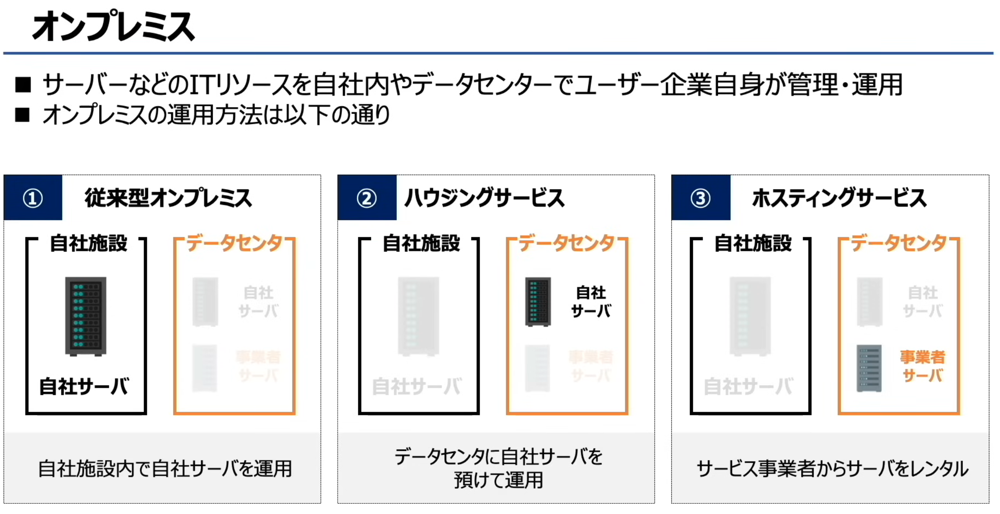

# オンプレミス（本地部署）三种形态总结
---
## 一、核心定义（原文+翻译）
### 日文原文
- サーバーなどのITリソースを自社内やデータセンターでユーザー企業自身が管理・運用
- オンプレミスの運用方法は以下の通り

### 中文翻译
- 服务器等IT资源，由用户企业自身在公司内部或数据中心进行管理、运维。
- 本地部署的运营方式分为以下三种：

---
## 二、三种形态对比（原文+翻译+特点）
### ① 従来型オンプレミス（传统型本地部署）
#### 日文原文
自社施設内で自社サーバーを運用

#### 中文翻译
在自有设施内运营自有服务器。

#### 特点
- 服务器硬件、系统、运维全部由企业自己负责
- 数据完全存储在企业自有环境，控制权、安全性最高
- 初期成本高，需要自建机房、配备运维团队

---
### ② ハウジングサービス（托管服务 / 主机托管）
#### 日文原文
データセンターに自社サーバーを預けて運用

#### 中文翻译
将自有服务器寄放在数据中心运营。

#### 特点
- 服务器硬件归企业所有，但放在服务商的数据中心机房
- 企业负责服务器的系统、应用管理，服务商提供机房、电力、网络、安保等基础设施
- 既保留了硬件控制权，又降低了自建机房的成本与运维压力

---
### ③ ホスティングサービス（主机服务 / 租用服务器）
#### 日文原文
サービス事業者からサーバーをレンタル

#### 中文翻译
从服务商处租用服务器运营。

#### 特点
- 服务器硬件由服务商提供，企业租用使用权
- 企业负责服务器上的系统、应用管理，服务商负责硬件与机房运维
- 无需采购硬件，降低初期投入，同时比纯云服务更灵活可控

---
## 三、关键区别
| 形态 | 硬件所有权 | 服务器位置 | 企业负责内容 | 服务商负责内容 |
| :--- | :--- | :--- | :--- | :--- |
| 従来型オンプレミス | 企业自有 | 企业自有设施 | 硬件、系统、机房、运维 | 无 |
| ハウジングサービス | 企业自有 | 服务商数据中心 | 服务器系统、应用管理 | 机房、电力、网络、安保 |
| ホスティングサービス | 服务商所有 | 服务商数据中心 | 服务器系统、应用管理 | 硬件、机房、电力、网络、安保 |

---
💡 补充记忆技巧：
- ハウジング（housing）= 房子，核心是“把自己的服务器，放到别人的房子里”
- ホスティング（hosting）= 主机，核心是“租别人的主机，在别人的房子里用”

# クラウドサービス（云服务）知识点总结
---
## 一、核心定义（原文+翻译）
### 日文原文
クラウドサービスとはクラウドを経由して提供されるサービスのこと

### 中文翻译
云服务，是指通过网络（云端）提供的服务。

---
## 二、图中对比说明（以游戏为例）
### 1. 従来（传统模式）
#### 日文原文
所有するゲーム機でプレイする

#### 中文翻译
使用自己拥有的游戏机来玩游戏。

#### 特点
- 游戏的硬件（游戏机）、软件（游戏本体）都由用户自己购买、持有
- 游戏数据、运行环境都在用户本地设备上，设备和游戏绑定
- 更换设备、多人共享都很不方便

---
### 2. クラウドサービス（云服务模式）
#### 日文原文
クラウドからゲームをプレイ出来る

#### 中文翻译
可以通过云端来玩游戏。

#### 特点
- 游戏的运行环境、数据都在云端服务器上，用户的设备只是用来接收画面和输入操作
- 不需要购买昂贵的游戏机，只要有网络和终端（手机、电脑、普通平板）就能玩
- 多人可以同时使用云端服务，设备更换、跨平台使用都很灵活

---
## 三、核心差异与本质
| 维度 | 従来（传统模式） | クラウドサービス（云服务模式） |
| :--- | :--- | :--- |
| 资源位置 | 本地设备（自有硬件/软件） | 云端服务器（服务商提供） |
| 所有权 | 用户持有全部资源 | 用户只拥有使用权，资源由服务商管理 |
| 使用门槛 | 高，需要购买专用设备/软件 | 低，只要有网络和基础终端即可 |
| 灵活性 | 低，设备和服务绑定 | 高，可跨设备、多用户共享 |

---
💡 补充说明：
这张图用「云游戏」的例子，直观展示了云服务的核心特征：**资源集中在云端，用户通过网络按需使用，无需本地持有和管理**。
和之前学的オンプレミス（本地部署）相比，云服务把IT资源的所有权、运维责任都转移给了服务商，用户只需要关注自己的业务/使用需求即可。

### 一、核心概念：クラウドサービス（云服务）
- 定义：利用**网络**，使用云服务商提供的IT资源的服务。
- 核心分类：IaaS、PaaS、SaaS，三者是「层层向上封装」的关系，封装程度越高，用户需要管理的底层内容越少。

---

### 二、三层云服务详解（附类比）
| 层级 | 原文 | 中文翻译 | 管理范围 | 右侧类比（租房场景） |
| :--- | :--- | :--- | :--- | :--- |
| **IaaS** | インフラ（ハードウェア/仮想サーバ） | 基础设施即服务（硬件/虚拟服务器） | 服务器、存储、网络等硬件资源 | 「租土地」：只提供最底层的基础硬件资源，上层系统、应用都需要自己搭建 |
| **PaaS** | プラットフォーム（OS/ミドルウェア） | 平台即服务（操作系统/中间件） | 操作系统、中间件、开发平台 | 「租房子」：在硬件之上，提供了完整的平台环境，用户只需关注开发和部署 |
| **SaaS** | ソフトウェア（アプリケーション） | 软件即服务（应用程序） | 直接可用的软件/应用 | 「租家具/家电齐全的房子」：直接使用成品软件，完全无需管理底层和平台 |

---

### 三、一句话总结
这张图用「租房」的类比，清晰解释了云服务的三大类型：
- **IaaS** 是租「土地」（底层硬件），
- **PaaS** 是租「带房子的平台」（含OS和中间件），
- **SaaS** 是租「拎包入住的成品房」（直接用软件）。

三者的区别在于：用户需要自行管理的内容，从IaaS到SaaS是**逐渐减少**的，而服务的封装程度、开箱即用的便利性则是**逐渐升高**的。

### クラウドサービス（云服务）的核心概念
クラウドサービス（云服务），指的是用户通过网络，使用クラウド事業者（云服务商）提供的IT资源的服务。它主要分为三种类型，区别在于「服务商负责什么」和「用户需要自己做什么」。

---

### 一、IaaS（Infrastructure as a Service，基础设施即服务）
日文原文核心信息：
- 提供范围：**ハードウェア（仮想サーバ）**（硬件/虚拟服务器），也就是「システム構築に必要な基盤のみ提供」（仅提供构建系统所需的基础平台）
- 对应类比：**土地を借りる**（租土地）
- 特点：
  1.  服务商只负责最底层的硬件资源，从OS（操作系统）、ミドルウェア（中间件）到アプリケーション（应用程序），全部需要用户自己搭建和管理。
  2.  開発難易度（开发难度）最高，開発自由度（开发自由度）也最高，用户可以完全自定义自己的系统环境。

### 二、PaaS（Platform as a Service，平台即服务）
日文原文核心信息：
- 提供范围：**OS、ミドルウェア**（操作系统、中间件），也就是「アプリケーション稼働に必要な環境を提供」（提供应用程序运行所需的环境）
- 对应类比：**家を借りる**（租房子）
- 特点：
  1.  服务商负责了硬件、OS和中间件，用户只需要专注于开发和部署アプリケーション（应用程序）即可。
  2.  开发难度和自由度都处于中间水平，既不用操心底层环境，也有足够的空间开发自己的应用。

### 三、SaaS（Software as a Service，软件即服务）
日文原文核心信息：
- 提供范围：**アプリケーション、ミドルウェア、OS、ハードウェア**（应用程序、中间件、操作系统、硬件），也就是「アプリケーションまでの全サービスを提供」（提供包含应用程序在内的全部服务）
- 对应类比：**家具/家電まで借りる**（连家具家电一起租，拎包入住）
- 特点：
  1.  服务商负责了从底层硬件到上层应用的所有部分，用户直接使用成品软件即可，完全不用管运维和底层管理。
  2.  開発難易度（开发难度）最低，開発自由度（开发自由度）也最低，用户只能使用软件提供的现成功能，无法自定义底层环境。

### 核心趋势总结
从IaaS到PaaS再到SaaS：
- 服务商负责的范围越来越大，用户需要自己管理的部分越来越少。
- 开发难度从「難」（难）向「容」（容易）递减。
- 开发自由度从「高」向「低」递减。

#  SOA 核心概念
**SOA（Service Oriented Architecture，サービス指向アーキテクチャ / 面向服务架构）**
它的核心定义是：**システムをサービス（ソフトウェアの機能）の組み合わせで構築する**，也就是「将系统通过服务（软件的功能）的组合来构建」的架构思想。

### 两种开发思路对比
1.  **通常の考え方（传统思路）**
    做法是「**システムに必要な機能をシステム内に作る**」——在一个系统（比如Aシステム）内部，把所有需要的功能（機能①、機能②、機能③）都自己开发、集成进去。
    这种方式下，功能和系统是紧耦合的，复用性差，修改或扩展都很麻烦。

2.  **SOAの考え方（SOA思路）**
    做法是「**必要な機能を提供するサービスを利用する**」——不自己开发所有功能，而是让系统（Aシステム）调用外部独立的服务（サービス①、サービス②、サービス③）来获取需要的功能（機能①、機能②、機能③）。
    这种方式下，每个功能都是独立的服务，可以被多个系统重复调用，修改、扩展都更灵活。

### 一句话总结
SOA的核心，就是把「系统内部的功能」拆分成「可独立调用的外部服务」，让系统通过组合这些服务来构建，以此提升功能的复用性和系统的灵活性。

### 一、核心主题：システムの活用（系统的活用）
两张图围绕「情報リテラシー（信息素养）」和「デジタルデバイド（信息差/数字鸿沟）」展开，讲了数字化社会中信息能力的重要性与带来的问题。

### 二、关键概念1：情報リテラシー（信息素养）
英文：Information Literacy
中文：信息素养 / 信息读写能力
补充：指高效获取、评估、利用和创造信息的综合能力。

日文原文定义：**世の中にあるさまざまな情報を適切に読み取り、活用する能力**
也就是「从社会中各类信息里，正确读取、并有效运用的能力」。

拥有这种能力的人，通常具备三个条件：
- スマートフォンやパソコンを持っている（拥有智能手机或电脑）
- スマートフォンやパソコンを有効に使える（能有效使用这些设备）
- デジタルな情報にアクセスできる（能够访问数字信息）

---

### 三、关键概念2：デジタルデバイド（信息差/数字鸿沟） 

ディジタルディバイド

デジタルデバイド
英文：Digital Divide
中文：数字鸿沟 / 信息鸿沟
补充：指不同群体在获取、使用数字技术（设备、网络、技能）上存在的差距。

日文原文定义：**社会のデジタル化が進むにつれて生まれる情報格差**
也就是「随着社会数字化发展，产生的信息差距」。

无法有效参与数字社会的人，会面临三个困境：
- スマートフォンやパソコンを持っていない（没有智能手机或电脑）
- スマートフォンやパソコンを有効に使えない（无法有效使用这些设备）
- デジタルな情報にアクセスできない（无法访问数字信息）

---

### 一句话总结
数字化社会里，**情報リテラシー（信息素养）** 是生存必备能力，但不是所有人都能平等地获取设备、掌握技能、访问信息，由此产生了**デジタルデバイド（数字鸿沟/信息差）**，进一步拉大了人们在信息获取和利用上的差距。

### システムの活用（系统的活用）
这张图介绍了企业有效活用大量数据和系统的三个典型事例：

1.  **BYOD（Bring Your Own Device）**
    日文定义：個人で所有するPCやスマートフォンなどの情報機器を業務に利用すること
    翻译：将个人所有的电脑、智能手机等信息设备用于业务工作
    简单说：员工自带设备办公

2.  **RPA（Robotic Process Automation）**
    日文定义：人が実施している定型的な業務をソフトウェアロボットにより自動化・効率化すること
    翻译：用软件机器人，把人工执行的固定流程业务自动化、提升效率
    简单说：用机器人代替人做重复的固定工作

RPA（Robotic Process Automation）とは，主に事務作業従事者（ホワイトカラー）の定型作業の自動化を行うことや自動化を行うソフトウェアのことである。

3.  **BI（Business Intelligence）**
    日文定义：データベースに蓄積された情報を統計的・数学的な手法で分析（データマイニング）し、経営戦略の意思決定において有用な情報を取り出すこと
    翻译：用统计、数学方法对数据库里积累的信息进行分析（数据挖掘），提取对经营战略决策有用的信息
    简单说：用数据工具辅助企业做经营决策

---

一句话总结：
这张图介绍了三种企业系统活用方式：**BYOD（自带设备办公）**、**RPA（流程自动化）**、**BI（商业智能分析）**，分别对应了设备利用、业务自动化和数据决策三个方向。

# ビジネスインダストリ Business Industry
商业产业；商贸行业；商务产业

### 一、原文翻译
**标题：EC（Electric Commerce, eコマース）**
- 英文：Electric Commerce（标准英文是 **Electronic Commerce**，这里是简写）
- 日文片假名：**eコマース**（罗马音：e komāsu）
- 中文：电子商务

**正文翻译：**
> 电子商务是运用互联网技术开展的商务活动「电子商业（e-ビジネス / e-business）」的一种，指网络购物等电子交易活动。

### 二、核心总结
- **EC（电子商务）** 是「电子商业（e-business）」的一个分支。
- 它特指**基于互联网的电子交易活动**，最典型的形式就是网络购物。
- 它和更宽泛的“电子商业（e-business）”的区别是：EC 聚焦在「交易」环节，而 e-business 涵盖了企业所有利用互联网的经营活动（比如线上营销、客户服务、供应链管理等）。

### 补充小知识
- 标准英文里，电子商务的正确写法是 **Electronic Commerce**，而不是图里的 Electric Commerce（Electric 是“电力的”，这里是常见的简写/笔误）。
- 在日本，大家日常口语里直接说 **「eコマース」** 或 **「EC」**，就等同于中文的“电商”。

### 一、先把顶部说明翻译一下
- **原文**：誰と取引を行うかによって取引形態が異なり、売り手と買い手の頭文字を使って表現する
- **中文**：根据交易对象的不同，交易形态也不同，通常用卖方和买方的英文首字母来表示。
- **图例说明**：C:個人（消费者/个人）、B:企業（企业/商家）、E:社員（企业员工）、G:政府（政府机构）

---

### 二、ECの取引形態（电子商务交易形态）完整汇总
| 日文缩写 | 英文全称 | 日文说明 | 中文翻译 | 补充说明/例子 |
| :--- | :--- | :--- | :--- | :--- |
| **CtoC** | Consumer to Consumer | 個人間取引 | 个人对个人交易 | 例：网络拍卖（ネットオークション），比如闲鱼、二手交易平台 |
| **BtoC** | Business to Consumer | 企業対個人間取引 | 企业对个人交易 | 例：网购（ネットショッピングで物を買う），比如淘宝、京东 |
| **BtoB** | Business to Business | 企業間取引 | 企业对企业交易 | 企业之间的线上采购/批发，比如阿里巴巴1688 |
| **BtoE** | Business to Employee | 企業対従業員間取引 | 企业对员工交易 | 企业内部福利商城、员工线上采购平台 |
| **GtoC** | Government to Consumer | 政府対個人間取引 | 政府对个人交易 | 政府向个人提供线上服务/业务办理，比如线上政务平台 |
| **GtoB** | Government to Business | 政府対企業間取引 | 政府对企业交易 | 例：政府/地方自治体与企业间的物资采购、电子招投标 |
| **GtoG** | Government to Government | 政府間取引 | 政府对政府交易 | 不同政府部门/机构之间的线上业务往来 |

---

### 三、整体核心总结
1.  这些缩写（CtoC/BtoC等），都是用**交易双方的英文首字母**来命名的电子商务模式。
2.  它们的核心区别，就是「谁在和谁做交易」：个人、企业、员工、政府这四类主体，两两组合就形成了所有EC交易形态。
3.  其中最常见的是BtoC（我们日常网购）、CtoC（二手交易）和BtoB（企业间采购），BtoE、GtoC、GtoB、GtoG则是延伸到企业内部和政府场景的模式。

### EDI
**EDI（Electronic Data Interchange）**
- 英文全称：Electronic Data Interchange
- 日文：電子データ交換
- 中文：**电子数据交换**

### 二、原文翻译
1.  **定义说明**
    > 受発注、請求、支払など商取引に関する情報を、ネットワークを介して電子データとしてやり取りすること
    中文：将订单收发、请求、支付等与商业交易相关的信息，通过网络以电子数据的形式进行交换。

2.  **图示说明（従来の取引の場合）**
    - バイヤ：Buyer（买方/采购方）
    - サプライヤ：Supplier（供应商/供货方）
    - メールやFaxなどで書類をやり取り：通过邮件、传真等方式交换纸质文件
    - 郵送やFAX等のやり取りだと管理が煩雑でミスも多発：使用邮寄或传真等方式，管理流程繁琐，也容易发生错误。

---

### 三、核心总结
- **EDI（电子数据交换）** 是一种企业间的电子交易数据交换标准。
- 它的核心作用，是替代传统的「邮件/传真/纸质文件」方式，把订单、发票、付款通知等商业数据，直接以标准化的电子格式在企业系统间传输。
- 传统交易方式的痛点：人工处理流程繁琐、效率低、容易出错。
- EDI 的优势：自动化处理、减少人工干预、降低错误率、提升交易效率，是B2B电商中实现企业间高效协同的关键技术。

### 暗号資産（仮想通貨）
**暗号資産（仮想通貨）**
- 日文：暗号資産（あんごうしさん / angō shisan），也叫仮想通貨（かそうつうか / kasō tsūka）
- 英文：Crypto Assets / Virtual Currency
- 中文：**加密资产（虚拟货币/加密货币）**

### 二、原文翻译
1.  インターネット上でやり取りできる財産的価値（例：ビットコイン）
    中文：可以在互联网上进行交易的财产性价值（例：比特币）

2.  ブロックチェーンの技術により、改ざんなどの不正を防ぐ
    中文：通过区块链技术，防止篡改等不正当行为

### 三、核心总结
- **加密资产（虚拟货币）**，就是以区块链为底层技术、在互联网上流通交易的数字资产，最典型的例子就是比特币。
- 它的核心特点：
  1.  本身具备财产价值，可以作为交易媒介在网络上流转；
  2.  依靠区块链的分布式账本技术，实现防篡改、防伪造，保证交易记录的安全性。

💡 补充说明：
在日本，「暗号資産」是法律上的正式用语，而「仮想通貨」是更通俗的说法，二者都指我们常说的加密货币。

### 一、原文翻译
**日文原文：**
> 取引の確認や記録の計算作業に参加して、報酬として仮想通貨を得ることをマイニングという

**中文翻译：**
> 参与（虚拟货币）交易的确认和记录的计算工作，并以此获得虚拟货币作为报酬，这个过程就叫**挖矿（マイニング / Mining）**。

### 二、核心概念补充说明
结合上一张图的「暗号資産（仮想通貨）」，这里补充的是它的关键机制：**マイニング（挖矿）**

- **挖矿的本质**：是区块链网络中，节点（矿机）通过计算解决密码学难题，来验证交易、记录数据、维护账本安全的过程。
- **为什么会有报酬**：作为对这些节点付出算力、保障网络稳定运行的奖励，系统会发放虚拟货币（比如比特币），这就是“挖矿得币”的来源。
- **和上一张图的关联**：正是因为有了挖矿节点的参与，区块链才能实现防篡改、防伪造，保证交易记录的安全可靠。

### 三、两张图内容的完整汇总
1.  **暗号資産（仮想通貨）**
    - 定义：基于区块链技术、可在互联网上交易的数字财产，典型例子是比特币。
    - 核心特点：依靠区块链的分布式账本，实现交易记录防篡改、防伪造。
2.  **マイニング（挖矿）**
    - 定义：参与交易确认、数据记录的计算工作，以虚拟货币作为报酬的过程。
    - 作用：是区块链网络的维护机制，既保障了网络安全，也为虚拟货币提供了发行和流通的渠道。

### Webマーケティング手法

- **Webマーケティング手法**：网络营销方法
- **Webサイトを用いて自社商品の販売を促進することが重要になっている**：利用网站来推广自家商品的销售，已变得至关重要。
- **Webサイトを用いた販売促進例**：利用网站进行销售推广的例子

---

### 二、各营销手法详解（保留日文+英文+中文翻译+说明）

1.  **SEO**
    - 英文全称：Search Engine Optimization
    - 日文：検索エンジン最適化
    - 中文：搜索引擎优化
    - 说明：优化网站内容，让自家网页在搜索引擎（如谷歌、雅虎）的搜索结果中排名靠前，从而获得更多曝光和流量。

2.  **アフィリエイト**
    - 英文：Affiliate Marketing
    - 日文：成果報酬型広告
    - 中文：联盟营销 / 效果付费广告
    - 说明：企业在个人网站或博客上投放广告，当用户通过该广告链接购买商品、达成转化目标后，发布者就能获得报酬。

3.  **ソーシャルメディア（SNS）**
    - 英文全称：Social Networking Service
    - 中文：社交媒体/社交网络服务
    - 说明：通过促进用户之间的互动，让用户发布的信息（如评价、分享）在平台上快速传播，以此扩大品牌和商品的影响力。

4.  **CGM**
    - 英文全称：Consumer Generated Media
    - 日文：ユーザー生成コンテンツメディア
    - 中文：用户生成内容媒体
    - 说明：由用户参与创作内容的平台，比如论坛、口碑评价网站等，用户的评价和分享会影响其他消费者的购买决策。

---

### 三、整体核心总结
这张图介绍了4种主流的**网络营销方法**，它们的核心目的都是通过网站和线上渠道，促进商品销售：
- **SEO**：靠优化内容，在搜索引擎里“自然”获得更多曝光；
- **联盟营销**：靠个人博主/网站主推广，按实际效果付费；
- **SNS营销**：靠社交平台的用户互动和分享，实现口碑传播；
- **CGM营销**：靠用户自己生成的评价、内容，影响其他消费者的决策。

日文原文：
成果指評：Web サイトに訪れた人のうち実際に商品を購入した人の割合
中文翻译：
成果指标（转化率）：访问网站的用户中，实际购买商品的用户所占的比例。

这句话定义的是电商 / 网络营销里的关键指标 ——コンバージョン率（Conversion Rate，转化率）。
它的计算方式是：转化率 = 实际购买人数 ÷ 网站访问人数 × 100%。
这个指标直接反映了网站的销售转化能力，是衡量营销效果、页面优化效果的核心数据之一。

### オムニチャネル（Omnichannel）
**オムニチャネル（Omnichannel）**
- 英文：Omnichannel
- 中文：**全渠道营销/全渠道零售**

**原文翻译：**
1.  店舗やネット通販、SNSなど、オンライン/オフライン問わず、あらゆる販売チャネルを持ち、どの手段でも不便なく購入できるようにする
    中文：同时拥有线下门店、线上电商、社交媒体等所有销售渠道，让顾客无论通过哪种方式，都能顺畅地完成购买。
2.  オンラインからオフラインに誘導するOtoO（Online to Offline）の考え方もある
    中文：也包含了从线上引导顾客到线下消费的 **O2O（Online to Offline）** 理念。

### 二、图示说明
图中展示了全渠道覆盖的典型场景：
- ネット通販：线上电商平台
- アプリ：品牌App
- SNS：社交媒体
- カタログ：商品目录
- 店舗：线下门店

这些渠道围绕用户互联互通，顾客可以在任意渠道无缝切换，比如「线上浏览、线下体验购买」「线下试穿、线上下单」，全程体验不中断。

### 三、核心总结
**全渠道（Omnichannel）** 是一种整合线上线下所有销售触点的零售模式：
1.  **核心目标**：消除渠道壁垒，为顾客提供「随时随地、任意方式都能顺畅购买」的无缝体验。
2.  **覆盖范围**：包含线下门店、线上电商、品牌App、社交媒体、商品目录等所有可能的消费场景。
3.  **关键延伸**：包含O2O模式（线上引流到线下），实现渠道间的互相引流与转化。

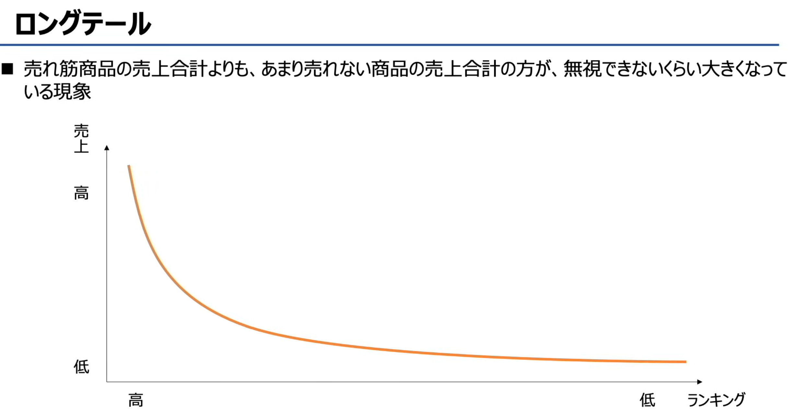

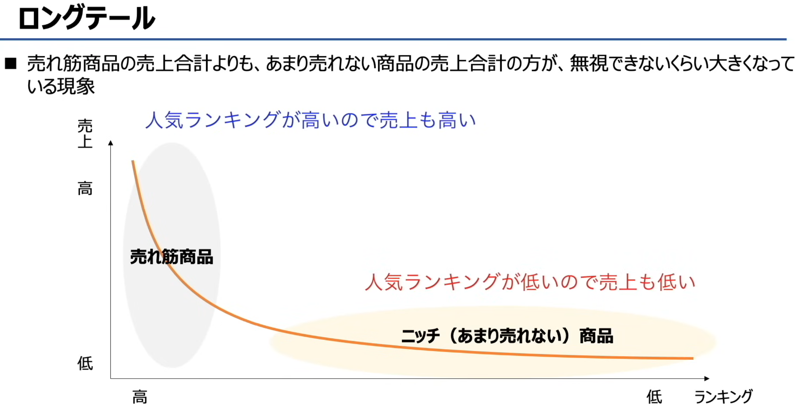

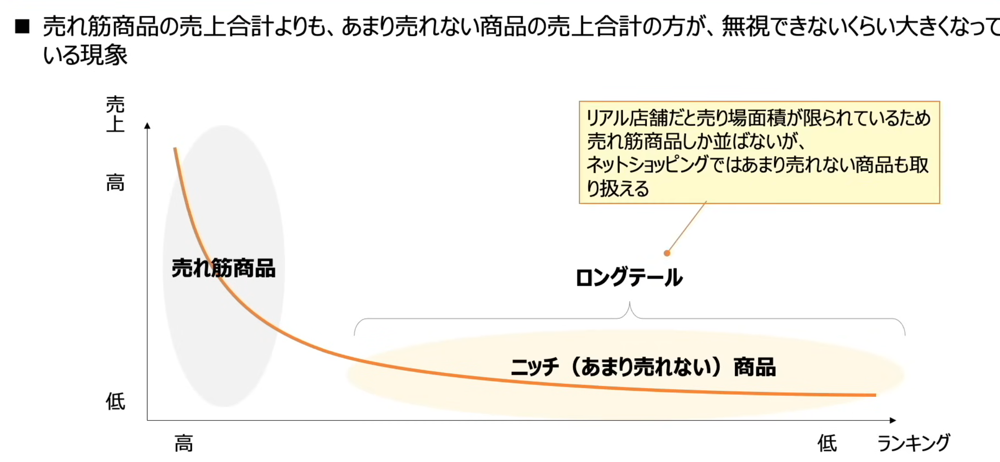

### ロングテール（Long Tail） 

**ロングテール（Long Tail）**
- 英文：Long Tail
- 中文：**长尾理论**

**原文翻译：**
> 売れ筋商品の売上合計よりも、あまり売れない商品の売上合計の方が、無視できないくらい大きくなっている現象
中文：**与热门畅销商品的总销售额相比，那些销量不高的小众商品，它们的销售额总和大到了不容忽视的现象。**

---

### 二、图示解读
这张图的坐标轴清晰展示了这个概念：
- 纵轴「売上」：商品的销售额，从下到上由低到高。
- 横轴「ランキング」：商品的销量排名，从左到右由高到低。
- 曲线：左侧陡峭下降的部分是少数**热门商品（头部）**，右侧平缓延伸的部分是大量**小众商品（长尾）**。
- 核心含义：长尾部分的曲线下面积（总销售额），并不比头部小，甚至可能超过头部。

---

### 三、核心总结
**长尾理论（Long Tail）** 是电商时代的经典商业概念：
1.  **核心观点**：在传统线下零售中，货架空间有限，企业只能聚焦少数热门商品；但在电商平台上，海量的小众商品（长尾）加起来，也能形成巨大的市场份额。
2.  **关键逻辑**：通过互联网的低成本存储和分发，企业可以服务于几乎所有细分需求，把无数个“小需求”聚合成一个不可忽视的大市场。
3.  **典型例子**：亚马逊、Netflix 等平台，它们的大量营收并非只来自爆款，而是来自无数冷门书籍、小众电影的持续销售。

### エンジニアリングシステム 

**エンジニアリングシステム（Engineering System）**
中文：**工程系统 / 生产工程系统**

**原文说明：**
> 設計や製造、生産管理、在庫管理など、生産工程において効率化・自動化を図る
中文：在设计、制造、生产管理、库存管理等生产流程中，用于实现**效率化与自动化**的系统/方法。

---

### 二、各代表系统详解（保留日文+英文+中文+说明）

1.  **JIT**
    - 英文全称：Just In Time
    - 日文别名：かんばん方式（看板方式）
    - 中文：准时制生产
    - 核心说明：在**必要的时间、生产必要数量的必要产品**，以此消除浪费、降低库存。
    中間在庫を極力減らすために、生産ラインにおいて、後工程の生産に必要な部品だけを前工程から調達する。
    为了尽可能减少中间库存，在生产线上，只从前工序采购后工序生产所需的零部件。

2.  **セル生産方式（Cell Production System）**
    - 中文：单元生产方式
    - 核心说明：由1人或少数人的团队，完成一件产品从开始到组装完成的全部工序。和流水线相比，更灵活、能快速切换生产。

3.  **MRP**
    - 英文全称：Material Requirements Planning
    - 日文：資材所要量計画
    - 中文：物料需求计划
    - 核心说明：以生产计划为基础，决定材料的订购量和订购时间，实现“必要的东西，在必要的时间，只订购/制造必要的量”。

4.  **CAD**
    - 英文全称：Computer Aided Design
    - 中文：计算机辅助设计
    - 核心说明：使用计算机辅助完成产品的设计工作，替代传统的手绘图纸，提升设计效率与精度。

---

### 三、整体核心总结
这张图介绍了4种主流的**生产工程系统/方法**，它们的共同目标是优化生产流程：
- **JIT**：从时间和数量上消除生产浪费，降低库存。
- **单元生产**：通过小团队/单人作业，提升生产灵活性和效率。
- **MRP**：通过物料需求计划，精准管理原材料的采购与供应。
- **CAD**：通过计算机技术，提升产品设计环节的效率与精度。

这些系统覆盖了从**设计、计划、生产到管理**的全流程，是制造业实现高效化、自动化的核心工具。

### 一、核心概念：IoT
**IoT（アイオーティー）**
- 英文全称：Internet of Things
- 中文：**物联网**
- 原文说明：「今までインターネットに繋がっていなかったものをつなぐこと」
  中文翻译：**将过去未连接互联网的物品，通过网络连接起来，实现数据交换与远程控制。**

---

### 二、IoT的应用事例详解

1.  **HEMS**
    - 英文全称：Home Energy Management System
    - 中文：**家庭能源管理系统**
    - 原文说明：「家庭での電力使用量を可視化して、エネルギー消費の最適化を図る」
    - 中文翻译：通过可视化家庭用电量，实现能源消耗的优化管理。
    - 通俗理解：就是家里的智能电表、空调、热水器等设备联网，帮你实时看用电情况、自动调节能耗，达到省电的目的。

2.  **デジタルサイネージ**
    - 英文：Digital Signage
    - 中文：**数字标牌/电子看板**
    - 原文说明：「ディスプレイに映像、文字などを表示する電子看板」
    - 中文翻译：在显示屏上播放视频、文字等内容的电子广告牌。
    - 通俗理解：就是商场、车站里的联网电子屏，可以远程更新广告和信息，属于IoT在商业场景的典型应用。

ディジタルサイネージ（digital signage）とは，大型のディスプレイやプロジェクタなどを利用して表示する広告媒体，いわゆる電子看板のことである。
広告以外でも商業施設内の行先案内や公共施設の予約状況の表示など，様々な用途で用いられる。

---

### 三、整体核心总结
这张图介绍了**物联网（IoT）**的基本概念和两个典型应用：
- **IoT的本质**：让“非智能物品”联网，实现数据采集、远程控制和智能管理。
- **HEMS**：面向家庭场景，优化能源使用，实现节能与智能管理。
- **数字标牌**：面向商业场景，实现信息的远程更新与精准投放。

# 経営事業戦略とマーケティング

### 一、经营战略的定义
经营战略，是企业为达成经营目的与经营目标，所制定的**基本方针与整体计划**的统称。

我帮你把每个手法对应的英文都补上，整理成清晰的分点形式：

---

### 一、经营战略的定义
经营战略（Management Strategy），是企业为达成经营目的与经营目标，所制定的基本方针与整体计划的统称。

### 二、主要经营战略手法
1.  **コアコンピタンス（Core Competence，核心竞争力）**
    指企业自身独有的、难以被其他公司模仿的核心优势。企业通过活用这种优势，在竞争环境中确立领先地位。
    例子：本田的发动机技术、索尼的小型化技术、夏普的液晶技术。

2.  **ベンチマーキング（Benchmarking，标杆管理）**
    分析其他企业的优秀产品或服务（最佳实践），将其作为标杆，与自身进行对比和检讨，以此推动企业的经营革新。

3.  **PPM（Product Portfolio Management，产品组合管理）**
    用「市场成长率」和「市场占有率」两个维度构建矩阵，对企业的业务或产品进行分类，以此判断经营资源的最优分配方案。

4.  **M&A（Mergers and Acquisitions，并购）**
    指企业通过合并（Mergers）或收购（Acquisitions）其他企业，来实现业务扩张、获取资源的经营手法。

5.  **アウトソーシング / BPO（Outsourcing / Business Process Outsourcing，业务外包 / 业务流程外包）**
    从外部调配业务所需的人员和专业知识；将企业内部的业务流程委托给外部机构处理，这种模式也被称为BPO（Business Process Outsourcing
BPO 核心定义

BPO（ビジネスプロセスアウトソーシング）とは、経営資源をコアビジネスに集中させるために、企業などがコアビジネス以外の業務の一部又は全部を、外部の専門業者に委託することである。自社の管理部門が行っている業務やコールセンターなど特定業務の業務プロセス全般を、業務の遂行に必要となる業務システムの運用などとともに外部の専門業者に委託することで、賃金コストや運用コスト、教育コストなどの削減を図る。

中文翻译
BPO（业务流程外包，Business Process Outsourcing），是企业为了将经营资源集中于核心业务，将核心业务以外的部分或全部业务流程，委托给外部专业服务商的做法。它不仅包括将企业管理部门、呼叫中心等特定业务的流程整体外包，还会连同业务执行所需的业务系统运营等相关工作一并委托，以此削减人工成本、运营成本、培训成本等。

# PPM 矩阵图里的四个分类

### 1. 花形（Star / 明星业务）
- **位置**：市场成長率高 + 市場占有率高
- **含义**：
  是企业的「明星业务」，处在快速增长的市场里，同时自己又占据主导地位。
- **特点**：
  虽然未来潜力巨大，但现在为了维持市场地位、扩大规模，往往需要投入大量资金。
- **典型策略**：
  重点投资、持续加码，巩固优势，把它培养成未来的“摇钱树”。

### 2. 金のなる木（Cash Cow / 现金牛业务）
- **位置**：市場成長率低 + 市場占有率高
- **含义**：
  企业的“摇钱树”，所在市场已经成熟、增长放缓，但它凭借高市占率，依然能稳定地产生大量现金流和利润。
- **特点**：
  不需要太多新的大额投资，却能源源不断为企业提供资金，用来支撑其他业务（比如“问题儿”和“花形”）的发展。
- **典型策略**：
  维持现状，以“收割利润”为主，用它的收益去养其他业务。

### 3. 問題児（Question Mark / 问题业务）
- **位置**：市場成長率高 + 市場占有率低
- **含义**：
  处在高增长市场，但企业自身的市占率还很低，未来发展方向不明确，像个“问题儿童”。
- **特点**：
  市场潜力很大，但目前还没建立优势，未来有两种可能：要么加大投资变成“花形”，要么投入打水漂变成“負け犬”。
- **典型策略**：
  要么果断投入资源、赌一把让它成长；要么及时止损、放弃这个业务，避免资源浪费。

### 4. 負け犬（Dog / 瘦狗业务）
- **位置**：市場成長率低 + 市場占有率低
- **含义**：
  所在市场已经没什么增长空间，企业自身的市占率也很低，是企业里的“拖油瓶”业务。
- **特点**：
  既没发展潜力，也赚不到什么钱，甚至可能还在消耗资源。
- **典型策略**：
  通常会选择「撤退、收缩、出售或关停」，把资源释放出来，投到更有价值的业务上。

---

💡 一句话总结PPM矩阵的逻辑：
它就是帮企业判断「钱该往哪投、该从哪赚、该从哪撤」的工具：
- 从「金のなる木」拿钱 → 投给「花形」和有潜力的「問題児」 → 放弃「負け犬」。

## 一、核心概念：事业战略与SWOT分析
1.  **事业战略**
    以企业整体的经营战略为基础，为每个业务单元（事业）明确目标与发展方向的规划。

2.  **SWOT分析的作用**
    通过分析企业的**内部环境**和**外部环境**，制定出能与竞争对手形成差异化的战略方案。

---

## 二、SWOT分析框架拆解
| 维度 | 定义 | 关键示例 |
| :--- | :--- | :--- |
| **S：Strength（优势）** 内部积极因素 | 企业自身的强项与有利条件 | 擅长的业务领域、商品开发能力、品牌影响力 |
| **W：Weakness（劣势）** 内部消极因素 | 企业自身的弱项与短板 | 不擅长的领域、相较于竞争对手的不足 |
| **O：Opportunity（机会）** 外部积极因素 | 外部环境中可利用的有利条件 | 政治/经济形势、市场趋势与风口 |
| **T：Threat（威胁）** 外部消极因素 | 外部环境中存在的潜在风险 | 竞争对手崛起、市场竞争加剧 |

---

## 三、一句话总结
这张图讲解了**事业战略**的定义，并通过**SWOT分析模型**，从「内部优势/劣势」和「外部机会/威胁」四个维度，系统梳理了企业如何制定差异化竞争战略的思路。

---
# 事業戦略（SWOT分析）
事业战略（SWOT分析）

- 事業戦略とは、経営戦略をベースにして事業ごとに目的や方向性を示したもの
  所谓事业战略，是以经营战略为基础，为各项业务明确目标与发展方向的规划。
- SWOT分析で内部環境・外部環境を分析することで、競合他社と差別化する戦略を立てる
  通过SWOT分析企业的内部环境与外部环境，制定出能与竞争对手形成差异化的战略。

---
## プラス要因（积极因素）
### 内部環境（内部环境）
**Strength（強み）**
- 得意分野：擅长的领域
- 商品開発力、ブランド力：产品开发能力、品牌力

### 外部環境（外部环境）
**Opportunity（機会）**
- 政治、経済状況：政治、经济形势
- 市場トレンド：市场趋势

---
## マイナス要因（消极因素）
### 内部環境（内部环境）
**Weakness（弱み）**
- 苦手分野：不擅长的领域
- 他社より劣っているところ：相较于其他公司的劣势

### 外部環境（外部环境）
**Threat（脅威）**
- 競合他社の台頭：竞争对手的崛起

# 事業戦略（バリューチェーン分析）

バリューチェーン 对应的英文是 Value Chain。
它是管理学中的经典术语，也就是我们常说的「价值链」，指企业从原材料采购到最终交付产品 / 服务的一系列创造价值的活动链条。

事业战略（价值链分析）

- 事業戦略とは、経営戦略をベースにして事業ごとに目的や方向性を示したもの
  所谓事业战略，是以经营战略为基础，为各项业务明确目标与发展方向的规划。

- バリューチェーン分析で企業の製品やサービスの利益がどの活動で生み出されているか分析することで、自社の強み・弱みを明確にする
  通过价值链分析，厘清企业产品与服务的利润是由哪些活动创造的，从而明确自身的优势与劣势。

## 主活動（主要活动）
直接参与产品/服务的生产与交付，直接创造价值的核心流程：
1.  **購買物流（調達物流）**：采购物流（ inbound logistics，原材料采购与仓储）
2.  **製造（生産）**：制造/生产（operations，加工、组装等生产环节）
3.  **出荷物流（販売物流）**：出货物流（outbound logistics，成品仓储、配送环节）
4.  **販売・マーケティング**：销售与市场营销（sales & marketing，推广、销售、渠道建设）
5.  **サービス**：服务（service，售后、客户支持、维护等）

## 支援活動（支持活动）
为主要活动提供支撑、间接创造价值的基础环节：
1.  **全般管理（インフラストラクチャー）**：整体管理（企业基础设施，如财务、法务、战略管理）
2.  **人事・労務管理**：人事与劳务管理（人力资源、招聘、培训、薪酬管理）
3.  **技術開発**：技术开发（研发、技术改进、工艺优化）
4.  **調達**：采购（procurement，设备、原材料、服务的采购管理）

## 核心逻辑总结
价值链分析的核心，就是把企业创造利润的全流程拆解为**主活動（直接创造价值）**和**支援活動（间接支撑价值创造）**，通过逐一分析每个环节的效率、成本与竞争力，找到企业真正的优势环节和薄弱环节，从而制定针对性的优化战略，最终实现「利益」最大化。

# マーケティング Marketing 市场营销

■ 顧客が求める製品やサービスを作り、適切なターゲットに価値を届ける一連の活動（商品が売れるための仕組みづくり）
日文原文：顧客が求める製品やサービスを作り、適切なターゲットに価値を届ける一連の活動（商品が売れるための仕組みづくり）
中文翻译：为顾客打造所需的产品与服务，并向合适的目标客群传递价值的一系列活动（即为商品打造 “畅销机制” 的工作）

# プロダクトライフサイクル（产品生命周期）
英文：Product Life Cycle，简称PLC

### 核心定义
这是一种**按产品的发展阶段分析适配战略的管理手法**，将产品的完整生命周期划分为4个阶段：「導入期」「成長期」「成熟期」「衰退期」，并根据每个阶段的市场特征，制定对应的经营策略。

### 图表解读
- 纵轴：**売上（销售额）**
- 横轴：**時間（时间）**
- 曲线走势：呈现「缓慢爬坡（导入期）→快速上升（成长期）→平稳达峰（成熟期）→持续下降（衰退期）」的完整过程。

---

### 四个阶段的核心特征与目标
1.  **導入期（导入期）**
    产品刚推向市场，知名度低、销量增长缓慢，研发与推广成本高，利润通常为负或极低。
    核心目标：验证市场需求、积累早期用户，为后续增长打基础。

2.  **成長期（成长期）**
    市场需求被快速激活，销量和利润进入高速增长阶段，竞争开始加剧。
    核心目标：快速扩大市场份额，建立品牌优势，抢占行业头部位置。

3.  **成熟期（成熟期）**
    市场需求趋于饱和，销量和利润达到峰值后趋于平稳，竞争白热化，价格战频发。
    核心目标：维持市场份额，通过优化成本、细分市场来延长产品的盈利周期。

4.  **衰退期（衰退期）**
    市场需求萎缩，销量和利润持续下滑，产品逐步被替代或淘汰。
    核心目标：评估产品价值，选择收缩、转型或退市，及时止损并释放资源。

---

一句话总结：
产品生命周期模型，就是帮企业判断产品“现在处于什么阶段、该用什么策略”的工具，避免用同一套方法应对所有阶段，从而实现资源的高效配置。

# コトラーの競争戦略（科特勒竞争战略）

这是**コトラーの競争戦略（科特勒竞争战略）**模型，我帮你完整拆解和总结一下👇

---

### 一、核心概念
- **原文**：マーケットシェアの大きさの観点から、競争地位に応じた企業の戦略をとる手法
- **翻译**：从市场份额的大小视角出发，根据企业自身的竞争地位，选择对应的经营战略的分析方法。

它把企业按「经营资源的量（多/少）」和「经营资源的质（高/低）」两个维度，分成了4种典型角色，并给出了对应的战略方向。

---

### 二、4种角色与对应战略
1.  **リーダー（市场领导者）**
    - 资源条件：经营资源「量多、质高」
    - 核心目标：维持市场第一的份额、扩大整体市场规模
    - 战略：**全方位战略**
    - 特点：行业龙头，资源、品牌、规模都占优，战略重点是巩固壁垒、防御竞争、持续扩大优势。

2.  **ニッチャー（利基市场者/ niche player）**
    - 资源条件：经营资源「量少、质高」
    - 核心目标：进入其他企业难以涉足的细分市场，深耕特定领域
    - 战略：**集中化战略**
    - 特点：不跟龙头正面竞争，而是聚焦一个小众、专业的细分市场，靠专业度和壁垒生存。

3.  **チャレンジャー（市场挑战者）**
    - 资源条件：经营资源「量多、质低」
    - 核心目标：扩大市场份额，挑战领导者的地位
    - 战略：**差别化战略**
    - 特点：有一定规模，但综合实力不如龙头，靠差异化的产品、价格或营销方式，抢夺领导者的用户和市场。

4.  **フォロワー（市场追随者）**
    - 资源条件：经营资源「量少、质低」
    - 核心目标：参考领导者的模式，跟随发展，避免正面竞争
    - 战略：**模倣戦略（模仿战略）**
    - 特点：资源有限，不主动挑战龙头，而是通过模仿成熟的产品和模式，低成本地获取市场份额，稳定生存。

### 三、一句话总结
科特勒竞争战略模型，就是帮企业认清自己在行业里的「角色定位」，再根据自身资源的多少与强弱，选择「当龙头、做挑战者、守细分市场，还是做跟随者」的适配策略，避免盲目竞争。

# マーケティングミックス（营销组合）4P与4C模型   Marketing Mix

这是**マーケティングミックス（营销组合）4P与4C模型**，我帮你完整拆解和总结一下👇

### 一、核心概念
- **原文**：マーケティングのフレームワークやツールを組み合わせて、自社の商品を効果的に販売する手法
- **翻译**：通过组合多种营销框架与工具，实现自家商品高效销售的策略方法。

製品戦略，価格戦略，チャネル戦略 （Channel Strategy），プロモーション戦略 （促销战略 Promotion Strategy）などを適切に組み合わせて，自社製品を効果的に販売していくこと

4P和4C是营销组合的两个经典视角：
- **4P**：站在**卖方（企业）**的视角制定策略
- **4C**：站在**买方（顾客）**的视角优化体验

### 二、4P（卖方视角）与4C（买方视角）的对应关系
1.  **Product（製品） ↔ Customer Value（顧客にとっての価値）**
    - 企业视角：打造有竞争力的产品功能、品质、设计
    - 顾客视角：产品能否为自己提供真正的价值、解决实际问题

2.  **Price（価格） ↔ Customer Cost（顧客負担の費用）**
    - 企业视角：制定合理的定价策略
    - 顾客视角：购买产品时，除了价格之外，还要付出的时间、精力、使用成本等总负担

3.  **Place（流通） ↔ Convenience（利便性）**
    - 企业视角：搭建销售渠道、铺设销售网络
    - 顾客视角：购买和获取产品的便捷程度，比如购买渠道是否好找、配送是否方便

4.  **Promotion（販売促進） ↔ Communication（対話）**
    - 企业视角：通过广告、促销等方式推广产品
    - 顾客视角：与企业的双向沟通，包括品牌互动、信息透明、售后交流等

### 三、一句话总结
4P是企业“怎么卖产品”的内部策略框架，而4C是把视角切换到顾客，思考“顾客为什么买、买得爽不爽”。两者结合使用，才能让营销从“企业自嗨”变成真正以用户为中心的有效策略。

# コストプラス価格決定法（成本加成定价法）
英文：Cost-plus pricing

---

### 一、核心定义
- **日文原文**：製品のコストに一定のマージンを加えて製品価格とする、コスト志向型の価格設定法
- **中文翻译**：以成本为导向的定价方法，在产品的成本基础上，加上固定的利润加成（margin），最终确定产品的销售价格。

---

### 二、结构拆解（图中逻辑）
- **原価（成本）**：包括原材料费、物流费、人工费、制造费等所有生产与交付环节的基础成本。
- **利益（利润）**：企业预先设定的固定利润加成（利润率/毛利）。
- **販売価格（销售价格）** = 原価 + 利益

---

### 三、一句话总结
成本加成定价法，就是**先算清成本，再加上想要的利润，最后定售价**的简单直接的定价方式，核心逻辑是“成本导向”，而非市场或顾客导向。

---

💡 补充小知识：这种方法的优点是计算简单、能保证利润；缺点是容易忽略市场竞争和顾客的价格接受度，可能导致定价过高卖不动，或过低错失利润。

# 経営管理システム

# 経営管理システム（经营管理系统）
---

## 一、経営管理システムとは（经营管理系统概述）
- **日文原文**：経営管理を効率的に行うための仕組み。会社内でバラバラだった情報を一元管理し、企業内・企業間で情報共有する。
- **中文翻译**：为高效开展经营管理而构建的机制。将企业内部分散的信息进行统一管理，实现企业内部及企业间的信息共享。

---

## 二、主な経営管理の仕組み（主要经营管理机制）

### 1. SCM
- **英文**：Supply Chain Management
- **日文原文**：調達から販売までの一連のプロセス（サプライチェーン）の情報を一元管理することで、コスト削減や納期短縮を目指す。
- **中文翻译**：供应链管理。通过统一管理从采购到销售的整个供应链流程信息，实现成本削减和交货期缩短。

---

### 2. CRM
- **英文**：Customer Relationship Management
- **日文原文**：顧客に関する情報や購入履歴、クレームなどを一元管理し、顧客に合った対応をすることで、顧客との良好な関係構築を目指す。
- **中文翻译**：客户关系管理。通过统一管理客户信息、购买历史、投诉等数据，为客户提供个性化服务，建立并维护良好的客户关系。

---

### 3. ERP
- **英文**：Enterprise Resource Planning
- **日文原文**：生産・流通・販売・会計などの基幹業務の情報を一元管理することで、効率的な経営の実現を目指す。
- **中文翻译**：企业资源计划。通过统一管理生产、流通、销售、财务等核心业务信息，实现高效经营。

---

### 4. ナレッジマネジメント
- **英文**：Knowledge Management
- **日文原文**：企業が保持している情報や、社員が持っているノウハウや経験を一元管理することで、企業全体の問題解決力を高める経営を目指す。
- **中文翻译**：知识管理。通过统一管理企业持有的信息、员工掌握的技术诀窍和经验，提升企业整体的问题解决能力。

# 業績評価（BSC：バランススコアカード / Balanced Scorecard，平衡计分卡）知识点总结

---

## 一、BSCの基本概念（平衡计分卡概述）
- **日文原文**：売上や利益などの財務観点だけで評価するのではなく、財務以外の観点からもバランス良く評価する。
- **中文翻译**：BSC 不是仅从销售额、利润等**财务视角**进行评价，而是结合财务以外的多个视角，对企业业绩进行全面、均衡的评估。
- **日文原文**：経営状況の変化に気付きやすくなり、目標達成のために強化すべきポイントを客観的に判断できる。
- **中文翻译**：通过多维度的评估，企业更容易察觉经营状况的变化，并能客观判断达成目标所需强化的关键环节。

---

## 二、BSCの4つの視点（平衡计分卡的四个视角）

### 1. 財務の視点（财务视角 / Financial Perspective）
- **日文原文**：売上や利益がどのくらい成長したか（売上高、キャッシュフローなど）
- **中文翻译**：评估企业在销售额、利润等方面的增长情况。
- **例**：売上高、キャッシュフロー（现金流）、利益率

---

### 2. 顧客の視点（客户视角 / Customer Perspective）
- **日文原文**：顧客がどれだけ満足しているか（市場占有率、顧客満足度など）
- **中文翻译**：评估客户对企业的满意度与忠诚度。
- **例**：市場占有率、顧客満足度、顧客定着率

---

### 3. 内部ビジネスプロセスの視点（内部业务流程视角 / Internal Business Process Perspective）
- **日文原文**：効率的な業務プロセスとなっているか（開発効率、オペレーション効率など）
- **中文翻译**：评估企业内部业务流程的效率与有效性。
- **例**：開発効率、オペレーション効率、品質管理

---

### 4. 学習と成長の視点（学习与成长视角 / Learning and Growth Perspective）
- **日文原文**：組織/個人で能力が向上したか（従業員満足度など）
- **中文翻译**：评估组织和个人的能力提升与发展情况。
- **例**：従業員満足度、研修受講率、技術革新

---

## 三、BSCの特徴（核心特点）
1.  **多角的な評価**：不局限于财务指标，兼顾非财务指标，实现短期与长期、结果与驱动因素的平衡。
2.  **戦略と連動**：四个视角相互关联，共同支撑企业战略目标的实现。
3.  **改善の指標**：通过客观数据，帮助企业识别短板，明确改进方向。

# 業績評価（KGI / CSF / KPI）知识点总结
---

## 一、基本概念
これらは企業目標達成のための「目標分解ツール」です。KGI・CSF・KPI を設定することで、最終目標から具体的な行動計画までを明確にできます。
中文：这些是企业目标达成的「目标拆解工具」。通过设定KGI、CSF、KPI，能从最终目标一直到具体行动计划都清晰化。

---

## 二、三者の定義と役割（金字塔从上到下）
### 1. KGI（Key Goal Indicator）
- **英文**：Key Goal Indicator
- **日文**：目指すべき最終的な目標
- **中文**：关键目标指标
- **役割**：企業が達成すべき**最終的な目標**で、経営レベルの指標。
- **例**：売上高XX%アップ、営業利益XX億円達成

---

### 2. CSF（Critical Success Factor）
- **英文**：Critical Success Factor
- **日文**：KGIを達成するのに必要な要素
- **中文**：关键成功要素
- **役割**：KGIを達成するために欠かせない「重要な条件・要因」。KGIとKPIの間の橋渡し役。
- **例**：来客数の増加、顧客満足度の向上、コスト削減

---

### 3. KPI（Key Performance Indicator）
- **英文**：Key Performance Indicator
- **日文**：CSFを達成するための数値目標
- **中文**：关键绩效指标
- **役割**：CSFを達成するための**具体的な数値目標**。現場レベルで管理・測定できる指標。
- **例**：新規顧客数XX人、既存顧客数XX人、Webサイト訪問数XX件

---

## 三、三者の関係（覚え方）
\[
\underbrace{\text{KGI（最終目標）}}_{\text{トップ}} \leftarrow \underbrace{\text{CSF（達成に必要な要素）}}_{\text{中間}} \leftarrow \underbrace{\text{KPI（現場で追う具体的な数値）}}_{\text{ボトム}}
\]
例：
- KGI：売上高20%アップ
- CSF：来客数を増やす
- KPI：月間新規顧客数100人、Webサイト訪問数1000件

---

## 四、覚えやすいコツ
- **KGI = ゴール（Goal）**：一番上の大きな目標
- **CSF = 条件（Condition）**：ゴールを達成するために必要な「条件」
- **KPI = 数値（Indicator）**：条件を達成するための「現場の数字」

# 技術開発戦略（技术开发战略）知识点总结

日文原文：企業を発展させていくため、今後開発を進めていくべき技術やその技術開発への投資など、市場のニーズや将来的な動向を踏まえて方向性を決定する。
中文翻译：为推动企业发展，基于市场需求与未来趋势，决定企业未来应重点开发的技术方向、研发投资策略等核心方针。

# イノベーション（Innovation，创新）知识点总结

## 一、基本概念
- **日文原文**：今までにない、新たな価値を生み出すこと
- **中文翻译**：创造出前所未有的、全新价值的活动。
（注：在经营管理语境下，创新不仅指技术突破，也包括产品、流程、商业模式等各方面的革新）

## 二、イノベーションの種類（创新的类型）

### 1. プロダクトイノベーション（Product Innovation，产品创新）
- **日文原文**：革新的な新商品を開発するなど、製品そのものの技術革新
- **中文翻译**：通过开发革命性新产品等方式，对产品本身进行的技术革新。
- 核心：**改变产品本身**，比如开发出功能、形态全新的产品。

### 2. プロセスイノベーション（Process Innovation，流程创新）
- **日文原文**：開発や製造、物流などのプロセスの技術革新
- **中文翻译**：对开发、制造、物流等业务流程进行的技术革新。
- 核心：**改变做事的方式**，比如引入自动化产线、优化物流路径来提升效率。

### 3. インクリメンタルイノベーション（Incremental Innovation，渐进式创新）
- **日文原文**：既存製品の部品改良など小さな改善をする技術革新
- **中文翻译**：通过改良现有产品的零部件等方式，进行小幅改善的技术革新。
- 核心：**小步迭代优化**，在现有基础上持续改进，风险低、见效稳。

### 4. ラディカルイノベーション（Radical Innovation，突破性创新）
- **日文原文**：経営構造など根本的な部分の改革を必要とする技術革新
- **中文翻译**：需要对经营结构等根本层面进行改革的技术革新。
- 核心：**颠覆式变革**，会彻底改变行业规则、企业模式，风险高但可能带来巨大收益。

## 三、快速记忆要点
- 按「对象」分：
  - プロダクト：产品本身
  - プロセス：做事流程
- 按「程度」分：
  - インクリメンタル：小改小补（渐进）
  - ラディカル：彻底颠覆（突破）

### 一、技術のSカーブ（技术S曲线）
#### 日文原文
技術開発における開発の成果と，その技術開発のために費やされた時間・コストには，次図のような関係があるとされ，その形状から“Sカーブ理論”や“技術（進歩）のSカーブ”などと呼ばれている。

新たな技術が開発されると，その技術を活用した新製品が発売されるなど，成果が緩やかに現れるようになる。そして，その後のある時期から，多くの製品に活用されるなどして，成果が急激に現れるようになり，最終的には技術として成熟することで，成果の停滞時期を迎え，次世代の技術に役割を委ねることになる。したがって，（イ）が正解である。

#### 中文翻译
在技术开发中，「开发成果」与「投入的时间/成本」之间存在如下图所示的关系，因其形状而被称为“S曲线理论”或“技术（进步）S曲线”。

当一项新技术被开发出来后，初期成果会缓慢显现（如推出应用该技术的新产品）；之后进入快速发展期，成果会急剧显现（如被大量产品采用）；最终技术走向成熟，成果进入停滞期，将发展的接力棒交给下一代技术。因此，（イ）是正确答案。

### 二、技術のハイプサイクル（技术炒作周期）
#### 日文原文
ア，ウ：技術のハイプサイクルの説明である。ハイプサイクル（hype cycle）とは，時間経過とともに新しい技術が認知され普及するまでにどのような変化を辿ったかいうことを表した図である。ハイプサイクルは，黎明期，流行期，反動期，回復期，安定期に分類される。

#### 中文翻译
ア、ウ选项：是对**技术炒作周期（Hype Cycle）**的说明。炒作周期是表示“新技术从被认知到普及的过程中，经历了怎样的变化”的图表，通常分为五个阶段：黎明期、流行期、反動期、回復期、安定期。

### 三、経験曲線（经验曲线）
#### 日文原文
エ：経験曲線（エクスペリエンスカーブ）の説明である。エクスペリエンスカーブとは，同一の製品を生産する経験の蓄積によって，生産にかかる単位当たりのコストが一定割合で低下していく現象を表した図である。

#### 中文翻译
エ选项：是对**经验曲线（Experience Curve）**的说明。经验曲线是表示“随着同一产品的生产经验不断积累，单位生产成本会以固定比例持续下降”这一现象的图表。

---

💡 补充一个核心区分点：
| 术语 | 核心描述 |
| :--- | :--- |
| 技術のSカーブ | 技术本身的进步过程（慢→快→停滞） |
| ハイプサイクル | 技术的社会认知与热度变化（炒作→冷却→稳定） |
| 経験曲線 | 生产经验与单位成本的关系（产量↑→成本↓） |

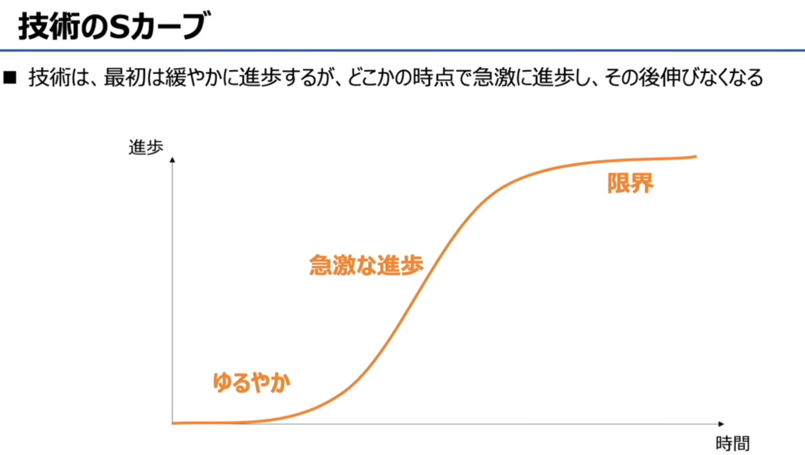

ロイヤリティ（Loyalty）
1. 日文原文：ロイヤリティ
英文：Loyalty
中文：忠诚度 / 顾客忠诚度
读音：roiyariti

# 経営組織と会計財務

# 経営組織（经营组织形态）知识点总结

## 一、核心概述
企业为高效运营，会根据业务需求选择不同的组织架构。基本情报考试中，主要考察以下4种典型形态：
- 職能別組織（機能別組織）
- 事業部別組織
- マトリックス組織
- プロジェクト組織

## 二、各组织形态详解

### 1. 職能別組織（機能別組織，职能型组织）
- **日文原文**：生産、販売、人事など仕事の機能別に部門を分ける組織形態。
- **中文翻译**：按生产、销售、人事等**业务职能**划分部门的组织形态。
- **结构特点**：自上而下按职能垂直划分，如生产部、营业部、开发部、人事部，统一向经营者汇报。
- **优点**：专业分工明确，效率高，便于职能管理。
- **缺点**：部门间协调困难，对跨职能项目的响应较慢。

### 2. 事業部別組織（事业部型组织）
- **日文原文**：製品や地域別に各事業部として独立させる組織形態。
- **中文翻译**：按产品、地域或业务线划分，成立独立事业部的组织形态。
- **结构特点**：每个事业部（如A事业部、B事业部）都拥有完整的职能部门（生产、营业、开发等），独立运营。
- **优点**：事业部权责清晰，能快速响应市场变化，培养综合管理人才。
- **缺点**：资源重复配置，各事业部间可能存在本位主义，整体协调成本高。

### 3. マトリックス組織（矩阵型组织）
- **日文原文**：職能×事業のマトリックスで構成される組織形態。
- **中文翻译**：由职能线和事业线交叉构成的矩阵式组织。
- **结构特点**：员工同时隶属于职能部门（如生产、营业）和项目/事业部（如A事业部、B事业部），接受双重领导。
- **优点**：兼顾专业职能与项目需求，资源共享灵活，适合复杂项目。
- **缺点**：双重领导易造成权责不清，管理复杂度高，可能引发员工困惑。

### 4. プロジェクト組織（项目型组织）
- **日文原文**：一時的に編成されるプロジェクト単位の組織形態。
- **中文翻译**：为特定项目临时组建的组织形态。
- **结构特点**：项目组（如プロジェクトA、プロジェクトB）独立运作，成员来自不同职能部门，项目结束后解散。
- **优点**：目标明确，响应速度快，团队凝聚力强。
- **缺点**：项目结束后人员安置困难，职能部门与项目组易产生资源竞争。

## 三、快速记忆要点
| 组织形态 | 核心划分依据 | 关键特征 |
| :--- | :--- | :--- |
| 職能別組織 | 按职能（生产/销售/人事） | 专业分工、垂直管理 |
| 事業部別組織 | 按产品/地域/业务线 | 独立事业部、权责清晰 |
| マトリックス組織 | 职能×事业交叉 | 双重领导、资源共享 |
| プロジェクト組織 | 按临时项目 | 目标导向、项目结束即解散 |

# CIO（Chief Information Officer）知识点总结

## 1. 基本定义
- **英文全称**：Chief Information Officer
- **日文名称**：最高情報責任者
- **中文翻译**：首席信息官

CIO 是企业中负责信息与信息技术（IT）相关工作的最高负责人。

---

## 2. 核心职责
- **日文原文**：経営戦略との整合性をとりながら、全社的な視点から情報戦略を立案する
- **中文翻译**：在与企业整体经营战略保持一致的前提下，从全公司的视角制定信息战略。

具体工作包括：
- 制定企业的中长期IT/信息战略，确保信息技术服务于业务目标
- 管理公司整体的信息系统、数据资产与IT资源
- 推动数字化转型、信息安全保障和业务流程优化

---

## 3. 角色定位
- 是连接「经营层战略」和「信息技术部门」的关键角色
- 既懂业务经营，又懂IT技术，负责将技术资源转化为企业竞争力

# OR と IE 知识点总结

## 1. OR（Operations Research / オペレーションズ・リサーチ）
- **英文全称**：Operations Research
- **中文**：运筹学
- **日文原文**：現状の問題に対して数学的に分析し最適な解決策を見つける手法
- **中文翻译**：对现状问题进行数学分析，寻找最优解决方案的方法。
- **核心**：用数学模型、统计方法，在资源有限的情况下，找到成本最低、效率最高的决策方案（如库存管理、配送路线优化等）。

---

## 2. IE（Industrial Engineering / インダストリアル・エンジニアリング）
- **英文全称**：Industrial Engineering
- **中文**：工业工程
- **日文原文**：生産現場における作業手順、工程等の問題を改善するための手法
- **中文翻译**：为改善生产现场的作业流程、工序等问题而使用的方法。
- **核心**：聚焦生产现场，通过优化作业流程、减少浪费、提升效率来改善现场（如动作分析、工序优化等）。

---

## 两者的区别（一句话记忆）
- **OR**：用数学模型找「最优决策」（偏整体规划、资源分配）
- **IE**：用现场分析找「作业改善」（偏生产现场、流程优化）

# 線形計画法（线性规划法）知识点总结与例题解答

---

## 一、核心概念（OR/線形計画法）
### 日文原文
OR・IE（線形計画法）：限られた材料、予算の中で、最大の利益や効果を得るためにはどうすればいいかを求める手法。

複数の一次不等式を満たす領域において、一次関数の値のMax/Minを求める場合に用いる手法。

### 中文翻译
线性规划法是运筹学（OR）中的一种方法，用于在有限的材料、预算等资源约束下，求解如何获得最大利润或最佳效果。当问题满足以下条件时使用：
1.  存在多个由一次不等式定义的约束条件（可行域）。
2.  目标是求一个一次函数（目标函数）的最大值或最小值。

---

## 二、例题解析
### 1. 问题设定
商品A和B，生产数量分别为 `x` 和 `y`（`x≥0, y≥0`）。
- **商品A**：每件消耗零件① `2` 个、零件② `2` 个，利润 `7` 万日元。
- **商品B**：每件消耗零件① `3` 个、零件② `1` 个，利润 `5` 万日元。
- **零件上限**：零件①共 `19` 个，零件②共 `13` 个。
- **目标**：最大化总利润 `7x + 5y`。

### 2. 建立数学模型
根据题意，列出约束条件和目标函数：
- **目标函数（最大化）**：
  `Maximize 7x + 5y`
- **约束条件**：
  1.  零件①限制：`2x + 3y ≤ 19`
  2.  零件②限制：`2x + y ≤ 13`
  3.  非负限制：`x ≥ 0, y ≥ 0`

### 3. 求解可行域的顶点
线性规划问题的最优解一定出现在可行域的顶点上。我们需要找到这些顶点并计算目标函数值。

- **顶点1：原点**
  `(0, 0)`，利润 `= 0`

- **顶点2：与y轴交点（零件①限制）**
  令 `x=0`，代入 `2x + 3y = 19`，得 `y=19/3`。但此点不满足 `2x + y ≤ 13`（`19/3 ≈ 6.33 > 13`，不成立）。因此，与y轴的交点由零件②限制决定：`(0, 13)`，但此点不满足零件①限制（`3*13=39 > 19`，不成立）。

- **顶点3：与x轴交点**
  令 `y=0`，代入 `2x + y = 13`，得 `x=6.5`。
  检查零件①限制：`2*(6.5) + 3*0 = 13 ≤ 19`，成立。
  顶点为 `(6.5, 0)`，利润 `= 7*6.5 + 5*0 = 45.5`。

- **顶点4：两条约束线的交点**
  联立方程：
  `2x + 3y = 19`
  `2x + y = 13`
  两式相减，得 `2y = 6`，解得 `y=3`。
  代入 `2x + 3 = 13`，解得 `x=5`。
  交点为 `(5, 3)`，利润 `= 7*5 + 5*3 = 35 + 15 = 50`。

### 4. 结论
对比各顶点的利润：
- `(0, 0)`：0
- `(6.5, 0)`：45.5
- `(5, 3)`：50

最大利润为 **50万日元**，对应的生产计划是：**商品A生产5个，商品B生产3个**。

---

## 三、关键记忆点
- **日文原文**：線形計画法は「制約条件下で一次関数の最大・最小を求める手法」。
- **中文翻译**：线性规划法就是“在约束条件下，求一次函数最大值或最小值的方法”。
- 核心步骤：**建立模型 → 找可行域顶点 → 计算目标函数值 → 取最大/最小值**。

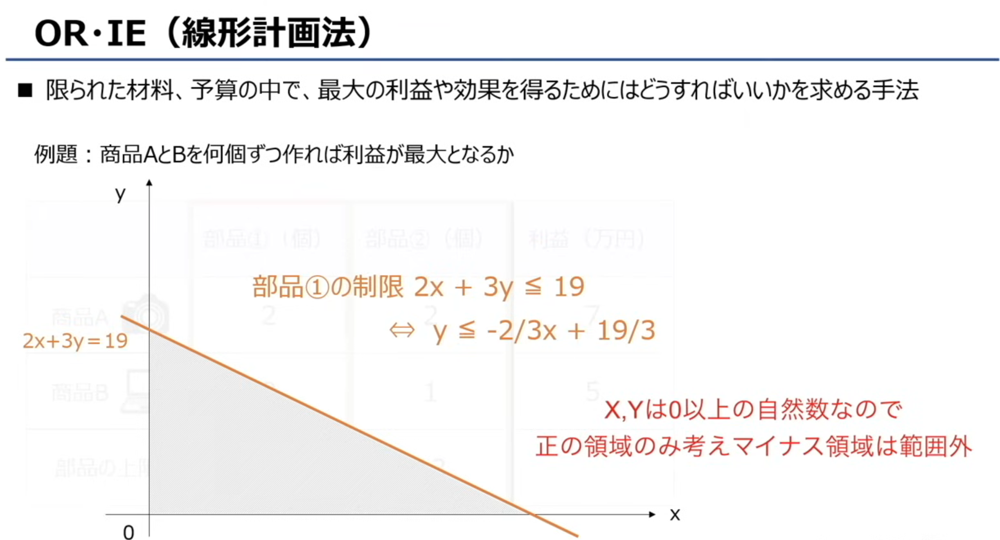

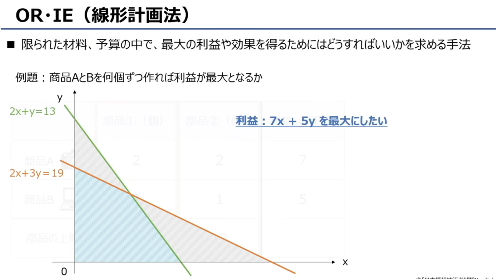

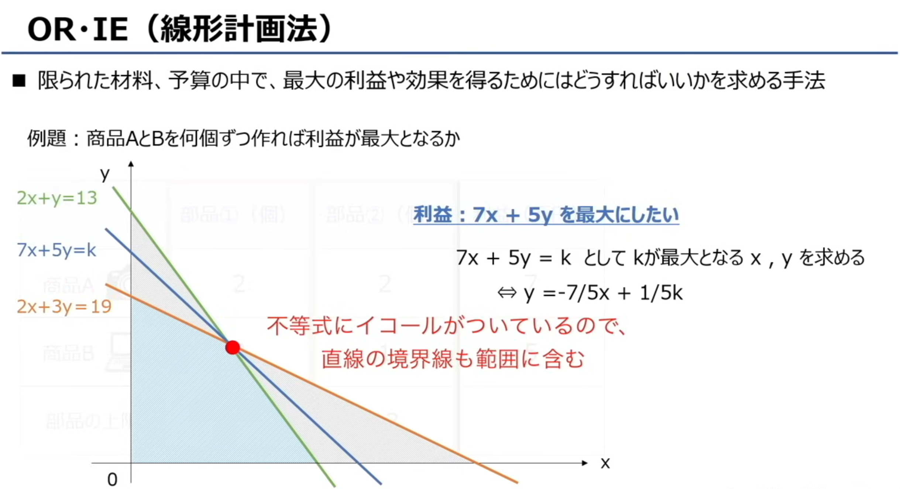

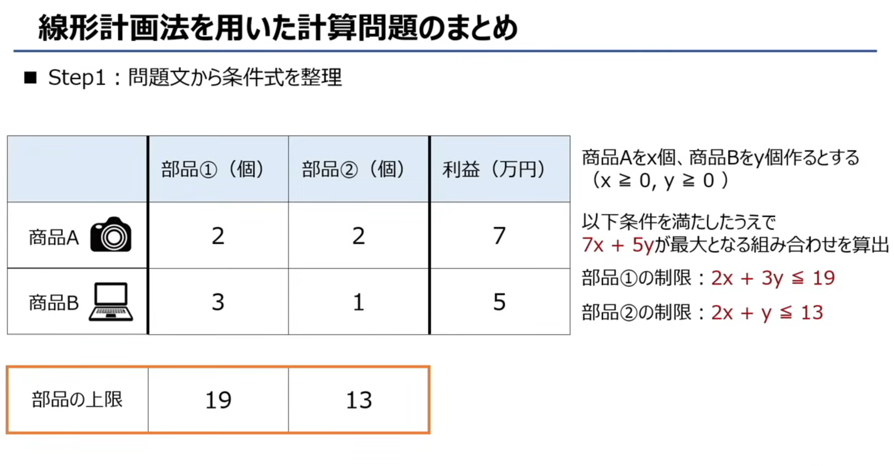

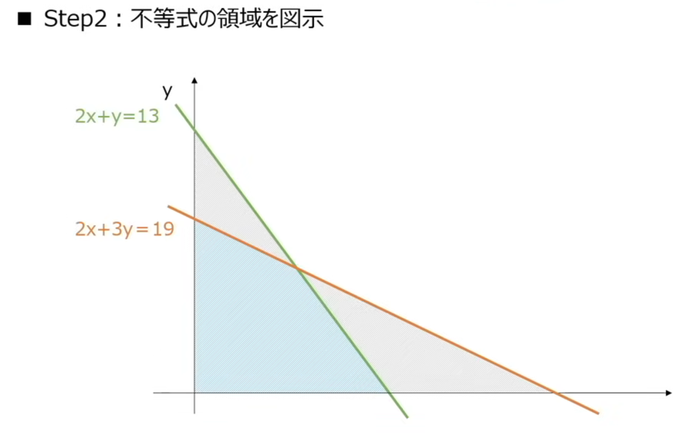

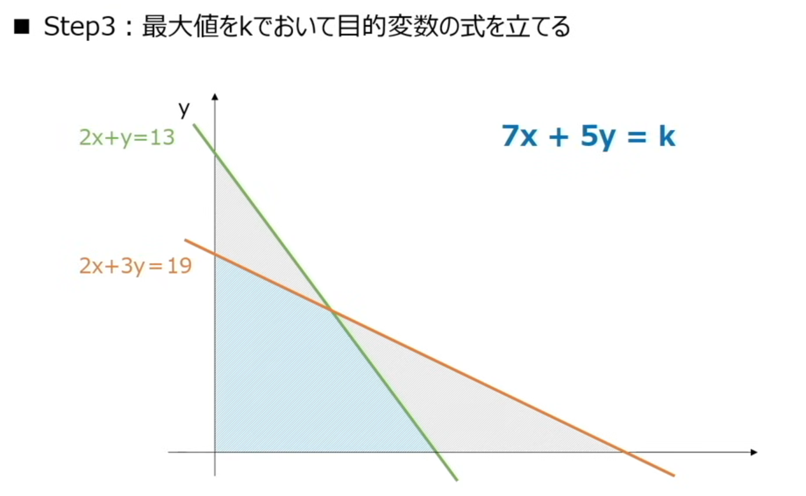

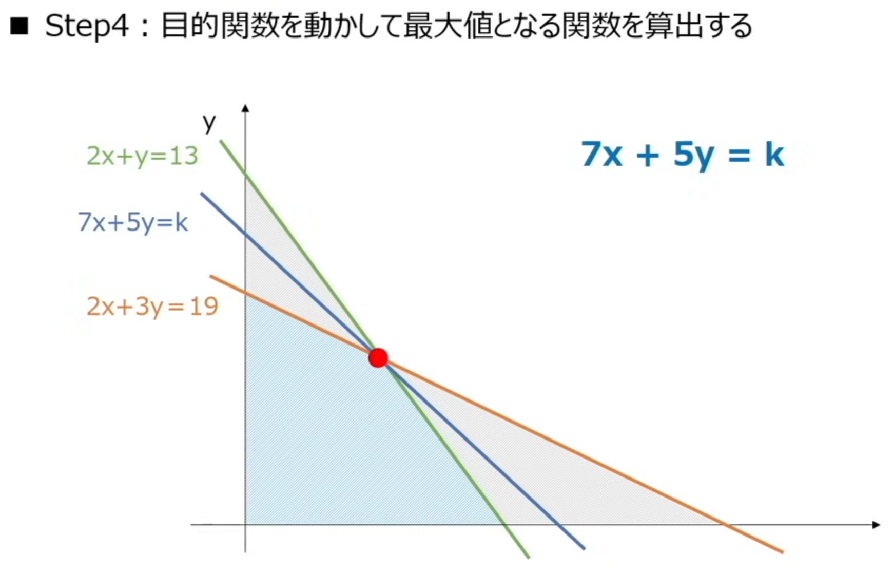

# OR・IE 常用分析图表总结
这张图介绍了 OR（运筹学）/IE（工业工程）领域，用来整理分析结果的三种常用图表。

---

## 1. 特性要因図（鱼骨图）
フィッシュボーンダイアグラム・魚の骨  鱼骨图 = 因果分析图，帮你把 “问题” 拆解成一层层的 “原因”，找到根因。
Fishbone Diagram
- **日文原文**：原因と結果の関連を体系的に表した図。結果に対して直接的または間接的な原因を分類でき、真の問題点を明確にする。
- **中文翻译**：是一种系统表示**原因与结果关系**的图表。可以对造成结果的直接/间接原因进行分类，帮助明确真正的问题点。
- **用途**：常用于质量问题分析，把问题（结果）拆解成人、机、料、法、环等类别，层层深入找根因。

「フィッシュボーンダイアグラム」对应的英文是 Fishbone Diagram。
在商务 / 质量管理领域，它也常被称为 Ishikawa Diagram（石川图，以发明者命名）或 Cause-and-Effect Diagram（因果图）。

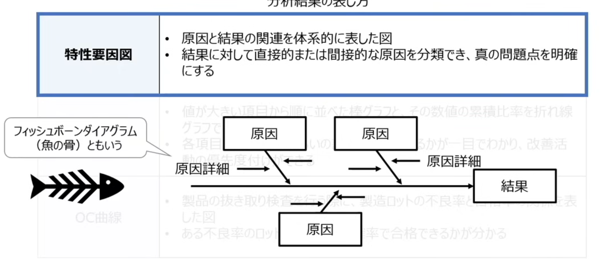
---

## 2. パレート図（帕累托图）
- **日文原文**：値が大きい項目から順に並べた棒グラフと、その数値の累積比率を折れ線グラフで表した図。各項目が全体でどれくらいの割合を占めているかが一目でわかり、改善活動の優先度付けができる。
- **中文翻译**：由**按数值从大到小排列的柱状图**和表示**累积比率的折线图**组合而成的图表。能一眼看出各项目在整体中的占比，用于确定改善活动的优先级。
- **用途**：基于“80/20法则”，优先解决占问题总数约80%的关键少数问题。

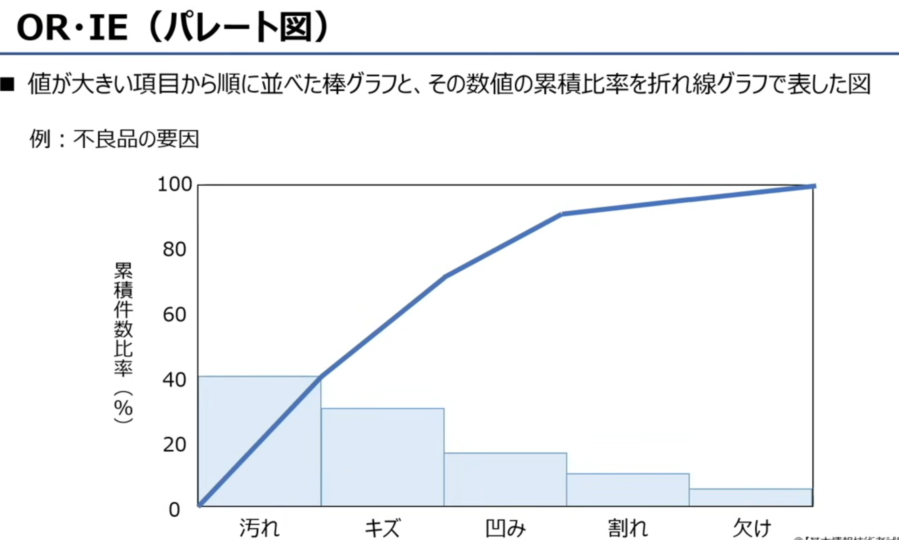

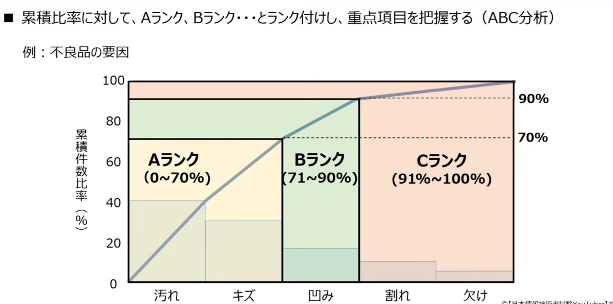

###  ABC分析（ABC分析）简单解释

## 一、核心定义
- **日文原文**：累積比率に対して、Aランク、Bランク…とランク付けし、重点項目を把握する手法
- **中文翻译**：是一种根据**累积占比**，将项目分为A、B、C三个等级，以此来确定重点管理对象的分析方法。

它的底层逻辑就是著名的**帕累托法则（80/20法则）**：少数关键项目往往贡献了大部分的问题/价值。

## 二、分级标准（图中示例）
根据累积占比，将项目分为三类：
- **Aランク（重点管理项目）**：累积比率 **0～70%** 的项目。通常只占项目总数的一小部分，却贡献了绝大多数问题（约70%），是改善的核心重点。
  *例：图中的「汚れ（脏污）」和「キズ（划痕）」是导致不良品的主要原因，属于A级，必须优先解决。*
- **Bランク（次要管理项目）**：累积比率 **71～90%** 的项目。贡献中等，需要常规关注。
  *例：图中的「凹み（凹陷）」。*
- **Cランク（一般管理项目）**：累积比率 **91～100%** 的项目。项目数量多，但单个影响很小，可简化管理AK或暂不处理。
  *例：图中的「割れ（开裂）」和「欠け（缺损）」。*

## 三、一句话总结
**ABC分析 = 帕累托图的分级应用**，帮你分清「问题的轻重缓急」，把有限的资源优先投入到A类关键项目上，实现效率最大化。

## 3. OC曲線（操作特性曲线）
- **日文原文**：製品の抜き取り検査を行う際に、製造ロットの不良率と合格率の関係を表した図。ある不良率のロットがどのくらいの確率で合格できるかが分かる。
- **中文翻译**：是产品抽样检查时，表示**生产批次的不良率与合格概率关系**的图表。通过它可以了解，一个不良率已知的批次，有多大的概率会被判定为合格。
- **用途**：用于设计和评估抽样检验方案，判断其对不同质量水平批次的鉴别能力。
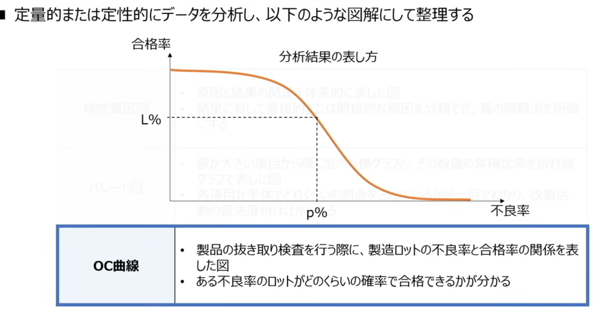

# OC曲線（Operating Characteristic Curve，操作特性曲线）知识点总结

## 一、基本定义
- **日文原文**：製品の抜き取り検査を行う際に、製造ロットの不良率と合格率の関係を表した図。
- **中文翻译**：在对产品进行抽样检验时，表示**生产批次的不良率与合格概率之间关系**的图表。

## 二、核心作用
- **日文原文**：ある不良率のロットがどのくらいの確率で合格できるかが分かる。
- **中文翻译**：通过OC曲线，我们可以清楚地知道，一个已知不良率的生产批次，在当前的抽样方案下，**有多大的概率会被判定为合格**。

## 三、图表解读
- **横轴（横軸）**：不良率（p%），表示生产批次中不良品所占的比例。
- **纵轴（縦軸）**：合格率，即该批次被判定为合格的概率。
- **曲线趋势**：曲线呈下降趋势，说明批次的不良率越高，其通过检验的概率就越低。
- **关键点**：图中的点（p%, L%）表示，当批次不良率为 `p%` 时，其合格概率为 `L%`。

## 四、一句话总结
OC曲线就是用来评估**抽样检验方案“好不好用”**的工具。它直观地展示了检验方案对不同质量水平批次的“鉴别能力”，帮助企业平衡风险和成本。

## 核心速记
- **特性要因図**：找问题的「根因」（鱼骨图）
- **パレート図**：排问题的「优先级」（帕累托图）
- **OC曲線**：评抽样的「合格概率」（OC曲线）

# 会計財務

# 做题笔记

## 一、题目翻译
**問72 電子自治体において、G to Bに該当するものはどれか。**
中文：问题72 在电子政务中，属于 **G to B** 的是哪一项？

### 选项翻译
- ア：自治体内で電子決裁や電子公文書管理を行う。
  → 在自治体内部进行电子审批和电子公文管理。（属于 **G to G** / 政府内部业务）
- イ：自治体の利用する物品や資材の電子調達、電子入札を行う。
  → 自治体进行办公用品、物资的电子采购、电子招投标。（政府面向企业）
- ウ：住民基本台帳ネットワークによって、自治体間で住民票データを送受信する。
  → 通过居民基本台账网络，在自治体之间传送居民票数据。（属于 **G to G** / 政府间业务）
- エ：住民票、戸籍謄本、婚姻届、パスポートなどを電子申請する。
  → 居民在线申请住民票、户籍誊本、婚姻登记、护照等。（属于 **G to C** / 政府面向个人）

---

## 二、关键概念：G to B
- **G** = Government（政府/自治体）
- **B** = Business（企业/民间企业）
- **G to B**：政府（自治体）和企业之间的电子化业务往来。
  典型场景：政府向企业采购物资、服务、工程；企业向政府投标、申请许可等。

---

## 三、选项分析
| 选项 | 类型 | 原因 |
| :--- | :--- | :--- |
| ア | G to G | 政府内部的审批和公文管理，不涉及外部企业或个人。 |
| **イ** | **G to B** | 政府向企业采购物资、进行电子招投标，是政府与企业之间的业务。 |
| ウ | G to G | 不同自治体之间的数据交换，属于政府内部协作。 |
| エ | G to C | 居民（个人）向政府申请服务，是政府与个人之间的业务。 |

## 四、结论
✅ 正确答案是 **イ**。

---

💡 补充记忆技巧：
- **G to G**：政府 ↔ 政府/内部
- **G to B**：政府 ↔ 企业（采购、招标）
- **G to C**：政府 ↔ 居民（个人申请、服务）
- **G to E**：政府 ↔ 公务员（内部员工）

我来帮你详细拆解「電子調達」和「電子入札」这两个词，包括读音、中文翻译和详细解释。

---

### 一、電子調達
1.  **日文原文**：電子調達（でんしちょうたつ / denshi chōtatsu）
2.  **英文对应**：Electronic Procurement (e-Procurement)
3.  **中文翻译**：电子采购
4.  **详细解释**：
    指政府或企业不通过传统纸质流程，而是利用网络和电子系统，向供应商采购物资、服务或工程的整个流程。
    它涵盖了从发布采购需求、供应商报价、订单管理到支付结算的全链条电子化操作，核心是让采购流程更透明、高效、低成本。

---

### 二、電子入札
1.  **日文原文**：電子入札（でんしにゅうさつ / denshi nyūsatsu）
2.  **英文对应**：Electronic Bidding / Electronic Tendering
3.  **中文翻译**：电子投标 / 电子招投标
4.  **详细解释**：
    是电子采购流程中的关键环节，指企业或供应商通过电子系统，在线提交投标文件和报价，参与政府或企业的招标项目。
    传统方式是邮寄或现场提交标书，而电子入札全程在线完成，可实现匿名报价、自动开标，大幅减少人为干预和腐败风险。

---

### 三、两者的关系
- **電子調達（电子采购）**：是一个**完整的流程概念**，从需求发布到最终支付的全链条电子化。
- **電子入札（电子投标）**：是电子采购流程中的**核心环节之一**，特指“投标/竞标”这一步。
- 可以说：电子采购包含了电子投标，电子投标是实现电子采购的关键手段之一。

---

💡 补充背景：
在日本，政府和大企业的公共项目大多采用电子采购+电子投标的方式，也就是题目里说的G to B业务，目的是为了提升效率、降低成本、保证采购的公平透明。

# 题目

没问题，我们不用表格，把知识点和解题方法拆成你一看就懂的步骤。

---

## 一、核心知识点总结（全文字版）

### 1. ア：情報セキュリティ方針（信息安全方针）
- 它是企业或组织制定的、关于信息安全工作的**纲领性文件和行动指南**。
- 简单说就是“公司规定”，比如“所有员工必须设置8位以上密码”。
- 它是**管理层面的规则**，不是在系统开发阶段嵌入的技术功能，所以和题干描述不符。

### 2. イ：セキュリティレベル（安全级别）
- 它指的是系统管理者设定的、允许用户进行的操作范围，或者系统本身的安全强度等级。
- 比如“管理员权限”“普通用户权限”，或者“128位加密强度”。
- 它是一个**衡量或控制的指标**，不是一种开发方法，因此不符合题意。

### 3. ウ：プライバシーバイデザイン（Privacy by Design / 隐私设计）
- 它的核心定义就是：**在系统开发的上游阶段（设计/规划阶段），就提前考虑并嵌入保护个人信息的功能**。
- 这和题干里“在开发上游阶段、探讨预防性功能、嵌入系统”的描述完全吻合，是正确答案。

### 4. エ：プライバシーマーク（Privacy Mark / 隐私认证标志）
- 它是日本的一种企业认证标志，证明企业的个人信息管理体系符合标准。
- 它是企业的一个“信用背书”，和系统开发阶段的设计工作没有直接关系，所以排除。

---

## 二、教你三步秒解这类题

以后遇到类似题目，按这三步走，就能快速锁定答案：

### 第一步：抓题干关键词，锁定核心需求
题干里有三个词是解题的关键：
- **「システム開発の上流工程」**：开发的上游阶段（设计/规划时）
- **「予防的な機能を検討し」**：探讨预防性的功能
- **「システムに組み込む」**：把功能嵌入到系统里

这三个词组合起来，问的就是：**“在系统设计之初，就把隐私保护的功能做进去”**。

### 第二步：用关键词反向排除错误选项
- 排除“管理规定”类：比如「情報セキュリティ方針」，它是公司的规则，不是开发阶段的设计。
- 排除“指标/权限”类：比如「セキュリティレベル」，它是权限或强度的衡量标准，不是开发方法。
- 排除“认证/标志”类：比如「プライバシーマーク」，它是企业的认证，和系统设计无关。

### 第三步：确认剩下的选项
排除后剩下的「プライバシーバイデザイン」，其定义正好匹配题干的所有关键词，所以它就是正确答案。

我们先把这道题的知识点讲透，再教你怎么一步步选出答案。

---

## 一、先翻译题干和核心考点
### 题干翻译
> 根据「共通フレーム（Common Framework，日本系统开发的通用标准框架）」，需求定义过程包含以下活动：识别干系人、**识别需求**、评估需求、达成需求共识等。
> 其中，**“识别需求（要件の識別）”阶段要做的工作**是哪一项？

### 考点核心
这道题考的是「要件定義プロセス（需求定义流程）」中，各个环节的分工：
1.  **利害関係者の識別**：识别项目相关的所有人（用户、开发、客户等）
2.  **要件の識別**：把干系人的需求完整地“挖出来”，明确所有约束条件和使用场景
3.  **要件の評価**：整理、确认需求，消除矛盾和模糊点
4.  **要件の合意**：解决问题点，让所有干系人达成一致

---

## 二、选项逐一拆解，帮你排除错误答案
### ア
「システムのライフサイクルの全期間を通して、どの工程でどの関係者が参画するのかを明確にする。」
→ 翻译：明确在系统的整个生命周期中，每个阶段由哪些干系人参与。
→ 这是**「利害関係者の識別」（识别干系人）**阶段的工作，和“识别需求”无关，排除。

### イ
「抽出された要件を確認して、矛盾点や曖昧な点をなくし、一貫性がある要件の集合として整理する。」
→ 翻译：确认已收集的需求，消除矛盾和模糊点，整理成一致的需求集合。
→ 这是**「要件の評価」（评估需求）**阶段的工作，是在“收集完需求之后”的整理环节，排除。

### ウ
「矛盾した要件、実現不可能な要件などの問題点に対する解決方法を利害関係者に説明し、合意を得る。」
→ 翻译：向干系人说明矛盾、无法实现的需求的解决方案，取得共识。
→ 这是**「要件の合意」（达成共识）**阶段的工作，是解决问题、让所有人同意的环节，排除。

### エ
「利害関係者から要件を漏れなく引き出し、制約条件や運用シナリオなどを明らかにする。」
→ 翻译：从干系人那里无遗漏地引出需求，明确约束条件和使用场景。
→ 这完全符合**「要件の識別」（识别需求）**的定义，就是“把需求挖出来、明确下来”的环节。✅

---

## 三、最终答案 & 解题小技巧
### 正确答案：**エ**

### 这类题的解题小技巧
以后遇到这种流程阶段的题目，记住每个环节的核心动作：
- **識別（识别）**：重点是「引き出す・明らかにする」（引出、明确），就是把东西找出来。
- **評価（评估）**：重点是「確認・整理・矛盾点をなくす」（确认、整理、消除矛盾），就是把东西理顺。
- **合意（共识）**：重点是「説明・解決・合意を得る」（说明、解决、取得共识），就是解决问题、让大家同意。

### 一、核心知识点（含日文+中文翻译）
这道题出自**共通フレーム（Common Framework，日本系统开发的通用标准框架）**，考点是「要件定義プロセス（需求定义流程）」的四大核心活动：

1.  **利害関係者の識別（识别干系人）**
    - 日文原文：システム開発に関わる全ての関係者（ユーザー、開発者、経営層など）を特定し、各工程での参画役割を明確にする活動。
    - 中文翻译：识别系统开发相关的所有干系人（用户、开发者、管理层等），明确他们在各阶段的参与角色。

2.  **要件の識別（识别/收集需求）**
    - 日文原文：利害関係者から必要な機能・性能・制約条件などの要求を漏れなく引き出し、明確にする活動。
    - 中文翻译：从干系人处无遗漏地收集必要的功能、性能、约束条件等需求，并明确下来。

3.  **要件の評価（评估/整理需求）**
    - 日文原文：抽出された要件の矛盾点・曖昧な点を解消し、一貫性のある要件集合として整理・検証する活動。
    - 中文翻译：消除已收集需求中的矛盾点、模糊点，整理并验证成逻辑一致的需求集合。

4.  **要件の合意（达成需求共识）**
    - 日文原文：問題のある要件（矛盾・実現不可能な要件）の解決策を説明し、全ての利害関係者の合意を得る活動。
    - 中文翻译：针对有问题的需求（矛盾、无法实现的需求）说明解决方案，获得所有干系人的共识。

---

### 二、题目翻译与解析
#### 1. 题干翻译
> 共通フレームによれば、要件定義プロセスの活動内容には、利害関係者の識別，要件の識別，要件の評価，要件の合意などがある。このうち，要件の識別において実施する作業はどれか。
> 
> 根据《共通框架》，需求定义流程的活动包括：识别干系人、**识别需求**、评估需求、达成需求共识等。其中，属于“识别需求”阶段的工作是哪一项？

#### 2. 选项逐一拆解
- **ア：システムのライフサイクルの全期間を通して，どの工程でどの関係者が参画するのかを明確にする。**
  翻译：明确系统整个生命周期中，每个阶段由哪些干系人参与。
  → 这是「利害関係者の識別（识别干系人）」的工作，和“识别需求”无关，排除。

- **イ：抽出された要件を確認して，矛盾点や曖昧な点をなくし，一貫性がある要件の集合として整理する。**
  翻译：确认已收集的需求，消除矛盾点和模糊点，整理成逻辑一致的需求集合。
  → 这是「要件の評価（评估需求）」的工作，是收集需求后的整理环节，排除。

- **ウ：矛盾した要件，実現不可能な要件などの問題点に対する解決方法を利害関係者に説明し，合意を得る。**
  翻译：向干系人说明矛盾、无法实现的需求的解决方案，取得共识。
  → 这是「要件の合意（达成共识）」的工作，是解决问题、让各方同意的环节，排除。

- **エ：利害関係者から要件を漏れなく引き出し，制約条件や運用シナリオなどを明らかにする。**
  翻译：从干系人处无遗漏地引出需求，明确约束条件和使用场景。
  → 完全匹配「要件の識別（识别需求）」的定义，就是“把需求完整收集、明确下来”的环节，是正确答案。

✅ 最终答案：**D. エ**

---

### 三、解题小技巧
以后遇到这类题，记住每个阶段的核心动作关键词：
- 識別（识别）：「引き出す・明らかにする」（引出、明确）—— 重点是“把东西找出来”
- 評価（评估）：「確認・整理・矛盾点をなくす」（确认、整理、消除矛盾）—— 重点是“把东西理顺”
- 合意（共识）：「説明・解決・合意を得る」（说明、解决、取得共识）—— 重点是“解决问题、让大家同意”

# 题目

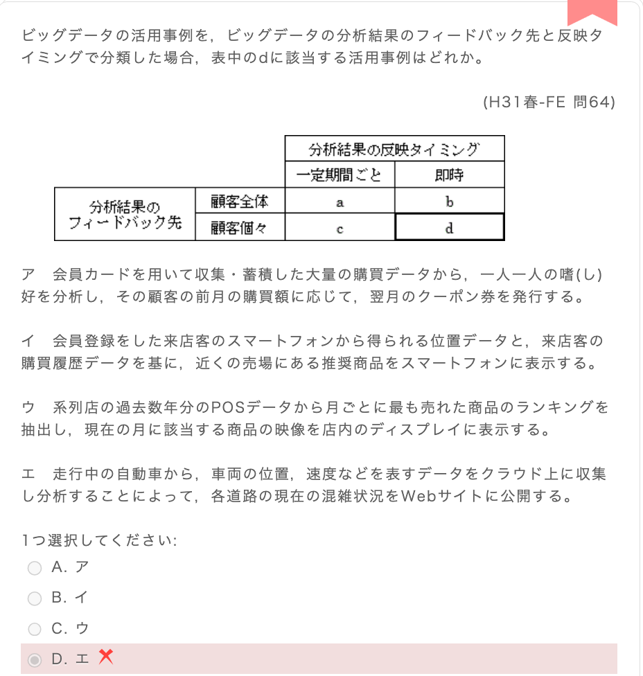

## 一、核心知识点：大数据活用的二维分类法
这道题的本质，是用两个维度给「大数据活用场景」做分类，你只要把这两个轴搞懂，这类题就不会再错了。

| 维度 | 轴的含义 | 两种情况 | 关键判断标准 |
| :--- | :--- | :--- | :--- |
| 纵轴 | 分析结果的反馈对象（フィードバック先） | 顧客全体（面向全体顾客） | 结果是给所有人看/用的，比如店内公告、公开的路况信息 |
| | | 顧客個々（面向单个顾客） | 结果是给特定的某个人/用户的，比如专属优惠券、个人推荐 |
| 横轴 | 分析结果的反馈时机（反映タイミング） | 一定期間ごと（按固定周期） | 不是实时的，是按月/按周/按固定周期处理后再用，比如“前月数据→翌月发券” |
| | | 即時（即时） | 数据一产生就立刻分析、立刻反馈，比如进店瞬间推送推荐、实时路况更新 |

表格里的四个格子，就是这两个维度的组合：
- a：顧客全体 × 一定期間ごと
- b：顧客全体 × 即時
- c：顧客個々 × 一定期間ごと
- d：顧客個々 × 即時 （题目要找的就是这个）

---

## 二、题目拆解与选项分析
我们用上面的两个维度，逐个分析选项：

### 题目要找的：d = 顧客個々 × 即時
- 必须同时满足两个条件：
  1. 结果只给**单个顾客**用（不是所有人）
  2. 数据处理和反馈是**即时**的（不是按周期）

---

### 选项逐个分析
1.  **ア（A选项）**
    「会員カードで収集した購買データから嗜好を分析し、前月の購買額に応じて翌月クーポンを発行する」
    - 反馈对象：顧客個々（给每个顾客发专属券）
    - 反馈时机：一定期間ごと（按“前月→翌月”的周期处理，不是即时）
    → 对应表格里的 **c**，不是d。

2.  **イ（B选项）**
    「来店客のスマホ位置データと購買履歴を基に、近くの売場の推奨商品をスマホに表示する」
    - 反馈对象：顧客個々（给当前进店的这位顾客推送专属推荐）
    - 反馈时机：即時（顾客一进店、定位到位置，就立刻推送推荐，没有延迟）
    → 同时满足两个条件，对应表格里的 **d**，是正确答案。

3.  **ウ（C选项）**
    「過去数年分のPOSデータから月ごとの人気ランキングを抽出し、店内ディスプレイに表示する」
    - 反馈对象：顧客全体（所有来店顾客都能看到的店内显示）
    - 反馈时机：一定期間ごと（按月统计过去数据，本月展示）
    → 对应表格里的 **a**，不是d。

4.  **エ（D选项）**
    「走行中の車両データを分析し、道路混雑状況をWebサイトに公開する」
    - 反馈对象：顧客全体（所有查看网站的用户都能看到路况）
    - 反馈时机：即時（实时路况更新）
    → 对应表格里的 **b**，不是d。

---

✅ 结论：只有イ（B选项）同时满足「顧客個々」和「即時」两个条件，所以正确答案是B。

---

💡 解题技巧：做这类题时，**先把两个维度的判断标准写下来，再给每个选项打勾/打叉，就能一眼看出哪个符合目标格子**。

# グリーン調達（Green Procurement，绿色采购）知识点总结与题目解析

## 一、核心知识点（グリーン調達とは）
### 日文原文
グリーン調達とは、国や地方公共団体、企業などが、製品やサービスの調達に際して、環境負荷の小さいもの又はその低減に努める事業者を優先して選ぶ取組みである。

### 中文翻译
绿色采购（Green Procurement），是指国家、地方公共团体、企业等主体在采购产品或服务时，优先选择环境负荷较小的商品，或是致力于降低环境负荷的供应商的举措。

### 核心要点
- 核心逻辑：**在满足品质、价格等基本条件的基础上，把「环境友好性」作为重要采购标准**
- 实施主体：政府、企业等采购方
- 核心目标：通过采购行为推动整个供应链降低环境影响，实现可持续发展

## 二、题目解析（H25春-FE 問66）
### 题目原文
グリーン調達の説明はどれか。
（以下哪一项是对绿色采购的正确说明？）

### 选项逐一分析（保留日文+翻译+判断）
#### ア（A选项）
- 日文原文：環境保全活動を実施している企業がその活動内容を広くアピールし、投資家から環境保全のための資金を募ることである。
- 中文翻译：开展环保活动的企业，向外界广泛宣传其活动内容，并从投资者处募集环保相关资金的行为。
- 判断：❌ 错误。这是**CSR（Corporate Social Responsibility，企业社会责任）**相关的说明，属于企业的环保宣传与融资行为，和「采购」无关。

#### イ（B选项）
- 日文原文：第三者が一定の基準に基づいて環境保全に資する製品を認定する、エコマークなどの環境表示に関する国際規格のことである。
- 中文翻译：第三方基于特定标准，认定有利于环保的产品，如生态标志（Eco Mark）等与环境标识相关的国际标准。
- 判断：❌ 错误。这是**ISO 14020/14024 环境标志相关国际标准**的说明，属于产品环保认证制度，而非采购行为本身。

#### ウ（C选项）
- 日文原文：太陽光、バイオマス、風力、地熱などの自然エネルギーによって発電されたグリーン電力を、市場で取引可能にする証書のことである。
- 中文翻译：将太阳能、生物质能、风能、地热能等自然能源生产的绿色电力，转化为可在市场交易的证书。
- 判断：❌ 错误。这是**グリーン電力証書（Green Power Certificate，绿色电力证书）**的说明，属于可再生能源交易工具，和采购定义无关。

#### エ（D选项，正确答案）
- 日文原文：品質や価格の要件を満たすだけでなく、環境負荷の小さい製品やサービスを、環境負荷の低減に努める事業者から優先して購入することである。
- 中文翻译：不仅满足品质和价格要求，还优先从致力于降低环境负荷的企业，采购环境负荷较小的产品或服务。
- 判断：✅ 正确。完全符合「绿色采购」的核心定义。

---

## 三、总结
- グリーン調達（Green Procurement）的核心是**「采购行为」+「优先选择环境友好的产品/供应商」**
- 区分易错点：
  - ア是CSR/企业环保宣传融资
  - イ是环境标志认证标准
  - ウ是绿色电力证书交易
  - 只有エ才是采购行为本身

# ITサービスアウトソーシング（IT服务外包）知识点总结与题目解析
---

## 一、核心知识点（ITサービスアウトソーシングにおける品質管理）
### 关键术语：SLA（Service Level Agreement，服务水平协议）
- **日文原文**：ITサービスアウトソーシングにおいて、サービス品質を示す指標とはSLAのことで、これを委託先と締結しておくことでサービス目標は明確になる。SLAを締結した以上、未達になった場合は補償を受けることによってリスク対応ができる。
- **中文翻译**：在IT服务外包中，用于表示服务品质的指标就是SLA（服务水平协议）。与外包商签订SLA，可以明确服务目标；若未达成约定目标，企业可通过获得补偿来应对品质风险。

### 核心要点
- 外包的核心风险之一：**システム保守品質・運用品質の低下（系统维护、运行品质下降）**
- 应对核心：通过**明确的服务品质指标（SLA）**，与外包商约定目标品质水平，并建立监控、改善与补偿机制，避免品质下滑。

---

## 二、题目解析（H29春-FE 問62）
### 题目原文
ITサービスをアウトソーシングする際の、システム保守品質・運用品質の低下リスクへの対応策はどれか。
→ 在IT服务外包时，针对「系统维护品质、运行品质下降风险」的应对措施，是以下哪一项？

---

### 选项逐一分析（保留日文+翻译+判断）
#### ア（A选项）
- 日文原文：アウトソーシング後の自社の人材強化計画の提案を、委託先の選定段階で求め、契約書などにも明文化しておく。
- 中文翻译：在选择外包商阶段，要求对方提供外包后的自社人才强化计划，并写入合同。
- 判断：❌ 错误。这是应对「自社人才流失/能力下降」的措施，和题目问的「系统维护、运行品质下降」无关。
- 补充解析：外包后的系统品质由外包商的体制直接决定，自社人才强化无法直接提升外包服务的品质。

#### イ（B选项）
- 日文原文：サービス費用の妥当性を検証できるように、サービス別の詳細な料金体系を契約書などで明文化しておく。
- 中文翻译：为了验证服务费用的合理性，在合同中明确按服务分类的详细收费体系。
- 判断：❌ 错误。这是应对「费用不透明/成本超支」的措施，和品质风险无关。

#### ウ（C选项，正确答案）
- 日文原文：サービス品質を示す指標を用い、目標とする品質のレベルを委託先と取り決めた上で、サービス品質の改善活動を進めていく。
- 中文翻译：使用服务质量指标（如SLA），和外包商约定目标品质水平，并推进服务品质改善活动。
- 判断：✅ 正确。这正是直接应对「系统维护、运行品质下降」的核心措施，与SLA的管理逻辑完全一致。

#### エ（D选项）
- 日文原文：システム保守・運用実務などのサービス費用について、査定能力をもつ人材を自社側に確保しておく。
- 中文翻译：自社确保拥有具备系统维护、运行费用评估能力的人才。
- 判断：❌ 错误。这是应对「费用核查」的措施，和品质风险无关。

---

## 三、总结
- IT外包中，**系统维护/运行品质下降**的核心应对方法，是通过**SLA明确品质指标、约定目标并持续监控改善**，而非人才强化、费用透明化或费用核查。
- 易错点区分：ア、イ、エ分别对应「人才流失」「费用超支」「费用核查」风险，只有エ直接针对品质下降问题。

类型	日文原文	英文	核心定义	举例
機能要件	機能要件	Functional Requirements	系统必须实现的 “功能本身”，回答 “系统要做什么”	数据增删改查、用户登录、报表生成、业务流程处理、系统间接口
非機能要件	非機能要件	Non-Functional Requirements	系统运行时的 “品质 / 约束条件”，回答 “系统要做得怎么样”	性能（响应速度）、可用性（ uptime）、安全性、可维护性、开发标准、技术规范

# 機能要件 vs 非機能要件（Functional vs Non-Functional Requirements）知识点与题目解析
---

## 一、核心知识点（共通フレーム2013 定义）
### 1. 機能要件（Functional Requirements）
- **日文定义**：明確にした業務要件を実現するために必要なシステムの機能
- **中文翻译**：为实现已明确的业务需求，系统必须具备的**功能本身**（回答「系统要做什么」）。
- 包含的工作内容：
  ① 業務を構成する機能間の情報（データ）の流れ → 明确业务功能间的数据流
  ② 対象となる人の作業及びシステム機能の実現範囲 → 定义用户操作与系统功能的实现范围
  ③ 利用者のニーズ及び要望を基に、情報管理の観点、管理の単位、形式などを理解・分析 → 基于用户需求，从信息管理角度分析管理方式
  ④ 他システムとの情報授受などのインタフェース → 明确与其他系统的信息交互接口

---

### 2. 非機能要件（Non-Functional Requirements）
- **日文定义**：機能要件以外の要件
- **中文翻译**：除功能需求外，系统运行、开发、维护等方面的**品质与约束条件**（回答「系统要做得怎么样/用什么标准做」）。
- 包含的工作内容：
  ① 品質要件（機能性、信頼性、使用性、効率性、保守性、移植性など）→ 性能、可靠性、易用性等品质指标
  ② 技術要件（システム構成、システム開発方式など）→ 系统架构、开发方式、技术标准等
  ③ 運用・操作要件（システム運用形態、システム運用スケジュールなど）→ 系统运行形态、运维计划等
  ④ 移行要件 → 系统迁移相关要求
  ⑤ 付帯作業（環境設定、エンドユーザ教育など）→ 环境配置、用户培训等配套工作

---

## 二、题目解析（H29春-FE 問65）
### 题目原文
非機能要件の定義で行う作業はどれか。
→ 以下哪一项，是定义**非功能需求**时需要进行的工作？

---

### 选项逐一分析（保留日文+翻译+判断）
#### ア（A选项）
- 日文原文：業務を構成する機能間の情報（データ）の流れを明確にする。
- 中文翻译：明确构成业务的各功能之间的信息（数据）流向。
- 判断：❌ 属于**機能要件の①**，是定义业务功能的数据流，和“非功能”无关。

#### イ（B选项，正确答案）
- 日文原文：システム開発で用いるプログラム言語に合わせた開発基準，標準の技術要件を作成する。
- 中文翻译：制定适配系统开发所用编程语言的开发标准、标准化技术要求。
- 判断：✅ 属于**非機能要件の②（技術要件）**，是系统开发方式、技术标准相关的约束，而非直接的业务功能。

#### ウ（C选项）
- 日文原文：システム機能として実現する範囲を定義する。
- 中文翻译：定义作为系统功能需要实现的范围。
- 判断：❌ 属于**機能要件の②**，是定义系统要实现的功能范围，属于“做什么”的范畴。

#### エ（D选项）
- 日文原文：他システムとの情報授受などのインタフェースを明確にする。
- 中文翻译：明确与其他系统进行信息交互的接口。
- 判断：❌ 属于**機能要件の④**，系统间接口是实现业务功能的一部分，属于“做什么”的范畴。

---

## 三、一句话总结
- **機能要件**：聚焦「业务功能本身」，定义系统要“做什么”（数据流、功能范围、接口等）。
- **非機能要件**：聚焦「品质与约束」，定义系统要“做得怎么样/用什么标准做”（性能、开发标准、运维方式等）。
- 这道题中，只有「イ」的开发标准/技术要件属于非功能需求，其余选项均为功能需求。

# ソフトウェア品質特性（Software Quality Characteristics）知识点科普与题目解析
---

## 一、核心知识点科普
### 1. 利害関係者要件（Stakeholder Requirements）
- **日文原文**：システム開発プロジェクトにおける利害関係者は、利用者、開発者、ベンダなどである。その利害関係者がプロジェクトに対して定義した要件を確認する作業が、利害関係者要件の確認である。
- **中文翻译**：系统开发项目中的利益相关者包括用户、开发者、供应商等。确认这些利益相关者为项目定义的需求的工作，就是「利益相关者需求确认」。

---

### 2. トレーサビリティ（Traceability，可追溯性）
- **日文原文**：トレーサビリティとは、追跡（トレース）できること（アビリティ）を表す用語である。利害関係者要件の確認において、定義された要件に対して、発生した変更要求の実装（プログラム作成など）までの経過を明らかにすることができる。
- **中文翻译**：可追溯性（Traceability），指“能够追踪（Trace）的能力（Ability）”。在利益相关者需求确认工作中，它可以清晰追踪「已定义的需求」从变更请求产生，到最终实现（如程序开发）的全过程。
- **核心作用**：确保需求、变更、设计、代码、测试用例之间的关联关系可被追踪，方便变更管理、问题排查和审计。

---

### 3. 其他选项相关术语解析
- **インターオペラビリティ（Interoperability，互操作性）**
  指多个不同系统组合使用时，整体能正确协同工作的能力。
- **セキュリティ（Security，安全性）**
  指保护数据等资产的安全性与机密性的能力。
- **ユーザビリティ（Usability，易用性）**
  指用户使用系统时的便捷性、满意度等特性。

---

## 二、题目解析（H22秋-FE 問65）
### 题目原文
利害関係者要件の確認において、定義された要件に対して、発生した変更要求の実装までの経過を明らかにできることを表すものはどれか。
→ 在利益相关者需求确认工作中，能够清晰追踪“已定义的需求”从变更请求产生到最终实现的全过程，这描述的是哪一项特性？

### 选项逐一分析（保留日文+翻译+判断）
#### ア（A选项）：インターオペラビリティ（Interoperability）
- 中文翻译：互操作性
- 判断：❌ 错误。指系统间协同工作的能力，与需求变更追踪无关。

#### イ（B选项）：セキュリティ（Security）
- 中文翻译：安全性
- 判断：❌ 错误。指保护数据与系统安全的能力，与题目无关。

#### ウ（C选项，正确答案）：トレーサビリティ（Traceability）
- 中文翻译：可追溯性
- 判断：✅ 正确。完全符合题目中“追踪需求变更从产生到实现全过程”的描述。

#### エ（D选项）：ユーザビリティ（Usability）
- 中文翻译：易用性
- 判断：❌ 错误。指用户使用系统的便捷性，与题目无关。

## 三、总结
这道题的核心是区分软件质量特性的不同维度：
- トレーサビリティ（Traceability）是项目管理与需求管理中的关键能力，核心是「追踪需求与变更的全流程」。
- 其他选项（互操作性、安全性、易用性）均属于系统运行或使用层面的质量特性，与题目描述的需求变更追踪场景无关。

# ITポートフォリオ（IT Portfolio，IT投资组合） 

## 一、核心知识点介绍
### 1. ITポートフォリオ（IT Portfolio）
- **日文原文**：ITポートフォリオとは、限られた予算の効果的な配分を決定するための手法である。運用する情報システムの費用対効果の検討に基づき、情報システム活用のための戦略や情報管理、処理方式やハードウェアなど、情報システムに関連するリスクや投資価値の類似性で分類されたカテゴリごとに最適な資源配分を決定する。その名称は金融投資におけるリスク分散の一般的な手法であるポートフォリオに由来する。
- **中文翻译**：IT投资组合，是一种为了决定有限预算的有效分配而使用的管理手法。它基于对所运营信息系统的成本效益分析，将与信息系统相关的项目，按「风险」和「投资价值」的相似性进行分类，并针对每个类别决定最优的资源分配方案。该名称源自金融投资中分散风险的经典方法——投资组合（Portfolio）。
- **核心作用**：平衡IT投资的风险与收益，将有限的预算和资源，投向战略价值高、风险可控的项目，实现企业整体IT投资效益最大化。

---

### 2. 其他相关术语解析
- **3C分析（3C Analysis）**
  - 日文原文：3C分析とは、自社の経営環境と、外部環境である市場状況との異なる視点から分析することによって経営戦略の立案に用いる技法である。3Cとは、顧客（customer）、競合相手（competitor）、自社（company）を指す。
  - 中文翻译：3C分析是从自身经营环境和外部市场状况等不同视角进行分析，用于制定经营战略的技法。3C分别指顾客（Customer）、竞争对手（Competitor）、自身（Company）。
- **エンタープライズアーキテクチャ（Enterprise Architecture，EA，企业架构）**
  - 日文原文：エンタープライズアーキテクチャとは、全社的な情報化計画に関する情報化の指針であり、経済産業省がまとめた業務とシステムの最適化計画である。
  - 中文翻译：企业架构是关于全公司信息化规划的指导方针，是由日本经济产业省提出的业务与系统优化规划框架。
- **ベンチマーキング（Benchmarking，标杆管理）**
  - 日文原文：企業経営で用いられるベンチマーキングとは、最強の競合相手又は先進企業と比較して、製品，サービス及びオペレーションなどを定性的・定量的に把握することである。
  - 中文翻译：企业经营中使用的标杆管理，是指与最强的竞争对手或先进企业进行比较，从定性和定量两方面把握自身产品、服务及运营水平的管理方法。

---

## 二、题目解析（H24春-FE 問61）
### 题目原文
リスクや投資価値の類似性で分けたカテゴリごとの情報化投資について、最適な資源配分を行う手法はどれか。
→ 以下哪一项，是按风险和投资价值的相似性对信息化投资进行分类，并进行最优资源分配的方法？

---

### 选项逐一分析（保留日文+翻译+判断）
#### ア（A选项）：3C分析
- 中文翻译：3C分析
- 判断：❌ 错误。这是用于制定经营战略的市场分析框架，和IT投资资源分配无关。

#### イ（B选项，正确答案）：ITポートフォリオ（IT Portfolio）
- 中文翻译：IT投资组合
- 判断：✅ 正确。完全符合题目中「按风险和投资价值分类信息化投资、优化资源分配」的描述。

#### ウ（C选项）：エンタープライズアーキテクチャ（Enterprise Architecture）
- 中文翻译：企业架构
- 判断：❌ 错误。这是企业整体业务与系统的规划框架，重点是架构优化，而非投资资源分配。

#### エ（D选项）：ベンチマーキング（Benchmarking）
- 中文翻译：标杆管理
- 判断：❌ 错误。这是与行业标杆对比、改进自身水平的管理方法，和题目无关。

---

## 三、总结
这道题的核心是区分不同的经营管理/IT管理手法：
- 只有**ITポートフォリオ**，是专门针对信息化投资的风险与价值，进行分类和资源优化分配的方法。
- 其他选项分别对应市场分析、企业架构规划、标杆对比等不同场景，与题目描述不符。

# CSR（企業の社会的責任 / Corporate Social Responsibility）知识点与题目解析
---

## 一、核心知识点介绍
### 1. CSR（企業の社会的責任 / Corporate Social Responsibility）
- **日文原文**：CSR（Corporate Social Responsibility；企業の社会的責任）とは，企業組織に対する社会的な信頼を高めるために，その企業活動において利益だけを追求するのではなく社会に与える影響までを十分に認識し，株主やそのほかの利害関係者であるステークホルダに対して，経営活動の内容，実績に関する説明責任などを負う企業姿勢を意味する。
- **中文翻译**：企业社会责任（CSR），是企业为提升社会信任度，在经营活动中不只是追求利润，同时充分认识自身对社会的影响，并向股东及其他利益相关者（Stakeholder）承担经营活动内容、实绩说明责任的企业态度。

---

### 2. CSR調達（CSR Procurement，CSR采购/可持续采购）
- **日文原文**：CSRの具体例として，原材料の使用量を減らすとともに，消費電力を少なくすることによって環境に配慮した製品を提供するという行動などが挙げられるが，CSR調達とは，企業活動において資材の調達などの部面において調達先の企業に対しても同様のCSRへの取組みを求めることを指す。
- **中文翻译**：CSR的具体例子包括减少原材料用量、降低耗电量，提供环保产品等；而CSR采购，是指企业在物资采购环节，也要求供应商企业采取同样的CSR举措。
- **核心要点**：采购时除成本、质量外，还将**自然环境、人权、劳动条件、社会伦理**等纳入采购标准，并要求供应商遵守。

---

## 二、题目解析（H26秋-FE 問67）
### 题目原文
CSR調達に該当するものはどれか。
→ 以下哪一项属于CSR采购？

---

### 选项逐一分析（保留日文+翻译+判断）
#### ア（A选项）
- 日文原文：コストを最小化するために，最も安価な製品を選ぶ。
- 中文翻译：为了最小化成本，选择最便宜的产品。
- 判断：❌ 错误。这是传统的成本优先采购，属于公開入札制度相关的行为，和CSR无关。

#### イ（B选项）
- 日文原文：災害時に調達が不可能となる事態を避けるために，調達先を複数化する。
- 中文翻译：为避免灾害导致采购中断，将供应商多元化。
- 判断：❌ 错误。这是**リスク分散調達（风险分散采购）**，属于供应链风险管理，和CSR无关。

#### ウ（C选项，正确答案）
- 日文原文：自然環境，人権などへの配慮を調達基準として示し，調達先に遵守を求める。
- 中文翻译：将对自然环境、人权等的考量作为采购标准，并要求供应商遵守。
- 判断：✅ 正确。完全符合CSR調達的定义，是企业在采购环节践行社会责任的典型方式。

#### エ（D选项）
- 日文原文：物品の購買に当たってEDIを利用し，迅速・正確な調達を行う。
- 中文翻译：采购物品时使用EDI（电子数据交换），实现快速、准确的采购。
- 判断：❌ 错误。这是**電子調達（电子采购）**，属于利用信息化工具优化采购流程，和CSR无关。

---

## 三、总结
这道题的核心是区分不同类型的采购行为：
- 只有**ウ**的选项，体现了CSR調達“将社会责任要求延伸至供应商”的核心特征。
- 其他选项分别对应成本优先采购、风险分散采购、电子采购，均与CSR无关。

# ROI（投資収益率 / Return On Investment）知识点与题目解析
---

## 一、核心知识点：ROI（投資収益率）
### 1. 日文定义
ROI（Return On Investment；投下資本利益率）とは、**投下資本に対する利益の比率**を表し、企業全体、個別投資プロジェクト、事業部などの投資効率を判断する指標として活用される。

### 2. 中文解释
ROI（投资回报率/投入资本收益率），是衡量「投入的资本」与「获得的收益」之间比率的指标，核心作用是判断企业、项目或业务的**投资效率**，数值越高代表每1元投入带来的收益越多，投资效率越高。

### 3. 计算公式（本题简化版）
题目中说明「内部収益率（IRR）は0とする」，因此直接用总收益除以总投资额即可：
\[
\text{ROI} = \frac{\text{5年間の総利益}}{\text{投資額}} \times 100
\]
*（注：标准ROI公式为：事業利益 ÷ 投下資本，本题简化为总收益/投资额，核心逻辑不变）*

---

## 二、题目解析（H24秋-FE 問64）
### 题目原文
IT投資案件において、5年間の投資効果をROI（Return On Investment）で評価した場合、四つの案件a～dのうち、最も効果が高いものはどれか。ここで、内部収益率（IRR）は0とする。
→ 在IT投资项目中，用ROI评价5年的投资效果，以下a~d四个项目中，投资效率最高的是哪一个？（注：内部收益率IRR视为0）

---

### 各项目ROI计算（保留日文原文+计算过程）
#### ア 案件a
- 利益：15 + 30 + 45 + 30 + 15 = 135
- 投資額：100
- ROI = \( \frac{135}{100} \times 100 = 135\% \)

#### イ 案件b
- 利益：105 + 75 + 45 + 15 + 0 = 240
- 投資額：200
- ROI = \( \frac{240}{200} \times 100 = 120\% \)

#### ウ 案件c
- 利益：60 + 75 + 90 + 75 + 60 = 360
- 投資額：300
- ROI = \( \frac{360}{300} \times 100 = 120\% \)

#### エ 案件d
- 利益：105 × 5 = 525
- 投資額：400
- ROI = \( \frac{525}{400} \times 100 = 131.25\% \)

---

### 结论
ROI从高到低排序：
案件a（135%） > 案件d（131.25%） > 案件b = 案件c（120%）
因此**最も効果が高いのは案件a（ア）**，选项A正确✅

---

## 三、关键理解要点
1.  ROI的核心是「**效率**」，而非「总收益」：
    案件d的总收益（525）远高于案件a（135），但因为投资额更高，效率反而更低。
2.  题目中「内部収益率（IRR）は0」的作用：
    表示不考虑资金的时间价值，直接用简单的算术平均计算ROI即可，无需折现。

# 真正的ROI公式

我们来把 **标准 ROI、IRR 以及「考虑资金时间价值」的投资评价方法** 一次性讲清楚，这样你以后遇到不同的题目就不会混淆了。

---

## 一、先明确：ROI 和 IRR 本来就是两个不同的东西
- **ROI（Return On Investment，投资回报率）**
  衡量的是「**收益/投入**」的比率，是一个**会计/财务比率指标**，不涉及“时间价值”的折现计算。
- **IRR（Internal Rate of Return，内部收益率）**
  衡量的是「**现金流的收益率**」，是一个**考虑资金时间价值的折现指标**。

所以：
- ROI 有自己的标准公式
- IRR 有自己的标准公式
- 题目里说「IRR は 0 とする」，意思是「不考虑资金时间价值，按简单算术方法算 ROI 即可」，并不是说 ROI 里要包含 IRR。

---

## 二、标准 ROI 公式（会计上的投入资本收益率）
ROI 最经典的标准定义，是 **投入资本收益率（Return on Invested Capital, ROIC）**，在日本教材里常写为「投下資本利益率」：

\[
\boxed{
\text{ROI} = \frac{\text{事業利益（税引後営業利益）}}{\text{投下資本}} \times 100\%
}
\]

- 分子：**事業利益**（税引後営業利益 = 経常利益 + 支払利息 - 法人税等），或更简单的「営業利益」
- 分母：**投下資本**（企业为了开展业务投入的全部资本）
  \[
  \text{投下資本} = \text{借入金} + \text{社債発行額} + \text{株主資本}
  \]

**本题为什么用了「総利益 ÷ 投資額」？**
- 因为题目是简化版，把项目的「总收益」当作分子，「一次性投入的投资额」当作分母，本质上还是「收益/投入」的比率，只是省略了复杂的会计科目。

---

## 三、IRR 的标准公式（资金时间价值版）
当你**真的要考虑资金时间价值**时，用的是 **IRR**，而不是 ROI。
它的定义是：使「未来现金流的现值总和 = 初始投资额」的那个折现率 \( r \)。

公式如下：
\[
\boxed{
\text{投資額} = \sum_{t=1}^{n} \frac{\text{第t年のキャッシュフロー}}{(1 + r)^t}
}
\]
这里的 \( r \) 就是 **IRR（内部收益率）**。

- 你需要解这个方程，求出 \( r \)，这个过程通常要用试算或财务计算器/Excel。
- 当题目说「IRR は 0 とする」，就是让你把 \( r=0 \) 代入，公式变成：
  \[
  \text{投資額} = \sum_{t=1}^{n} \text{第t年のキャッシュフロー}
  \]
  也就是「未来现金流直接加总」，不用折现，这就是题目里简化计算的由来。

---

## 四、什么时候用 ROI，什么时候用 IRR？
| 指标 | 核心逻辑 | 特点 | 适合场景 |
| :--- | :--- | :--- | :--- |
| **ROI** | 收益 ÷ 投入 | 不考虑时间价值，简单直观 | 快速评估投资效率、会计指标分析 |
| **IRR** | 求解折现率 \( r \) | 考虑资金时间价值，反映真实收益率 | 项目投资决策、长期现金流分析 |

---

## 五、举个例子，用你这道题的数据对比一下
以案件a为例：
- 投資額：100（第0年投入）
- 现金流：第1年15，第2年30，第3年45，第4年30，第5年15

### 1. 题目里的简化 ROI（IRR=0）
\[
\text{ROI} = \frac{15+30+45+30+15}{100} \times 100 = 135\%
\]

### 2. 标准 IRR 计算（真实情况）
解这个方程：
\[
100 = \frac{15}{(1+r)^1} + \frac{30}{(1+r)^2} + \frac{45}{(1+r)^3} + \frac{30}{(1+r)^4} + \frac{15}{(1+r)^5}
\]
解出来的 \( r \) 才是这个项目真实的内部收益率，和上面的 135% 不是一个东西。

---

## 总结一下
- **标准 ROI 公式**：是「事業利益 ÷ 投下資本」，衡量会计上的投资效率，和 IRR 无关。
- **IRR 是另一个独立的指标**，用在考虑资金时间价值的现金流分析里。
- 题目里「IRR は 0 とする」，只是让你**不用折现，直接用简单加总计算 ROI**，并不是说 ROI 公式里要包含 IRR。

# エンタープライズアーキテクチャ（EA：Enterprise Architecture，企业架构）知识点总结与题目解析
---

## 一、核心知识点：エンタープライズアーキテクチャ（EA）
### 日文定义
エンタープライズアーキテクチャ（EA；Enterprise Architecture）とは、大組織の業務と情報システムを階層別に整理して相互関係を明らかにし、現状（As-Is）とあるべき姿（To-Be）を可視化することで、組織全体の最適化を図っていく活動の方法論である。

### 中文翻译
企业架构（EA），是一种将大型组织的业务与信息系统按层级梳理、明确相互关系，通过可视化现状（As-Is）与理想状态（To-Be），实现组织整体优化的活动方法论。

---

## 二、EA的四层核心架构（4つのアーキテクチャ）
EA由四层架构构成，每层对应不同的定义内容：

### 1. ビジネスアーキテクチャ（BA：Business Architecture，业务架构）
- **日文**：政策・業務体系。業務内容、業務フローを定義
- **中文**：定义企业的业务内容、业务流程，明确支撑企业战略的业务体系。

### 2. データアーキテクチャ（DA：Data Architecture，数据架构）
- **日文**：データ体系。情報の内容、関連性を定義
- **中文**：定义业务所需数据的内容、数据间的关联与结构，构建企业级数据体系。

### 3. アプリケーションアーキテクチャ（AA：Application Architecture，应用架构）
- **日文**：適用処理体系。情報を処理するシステム形態、パッケージ等のアプリケーションを定義
- **中文**：定义支撑业务流程的信息系统形态、应用程序（包括软件包）的功能与构成，即业务流程对应的应用系统体系。

### 4. テクノロジーアーキテクチャ（TA：Technology Architecture，技术架构）
- **日文**：技術体系。各サービスを利用する技術を定義
- **中文**：定义支撑信息系统构建与运行的技术要素，如服务器、网络、中间件等底层技术体系。

---

## 三、题目解析（H31春-FE 問61）
### 题目原文
エンタープライズアーキテクチャを構成するアプリケーションアーキテクチャについて説明したものはどれか。
→ 以下哪一项，是对构成企业架构的「应用架构（AA）」的正确说明？

---

### 选项逐一分析（保留日文+翻译+判断）
#### ア（A选项）
- 日文原文：業務に必要なデータの内容、データ間の関連や構造などを体系的に示したもの
- 中文翻译：体系化展示业务所需数据的内容、数据间的关联与结构等。
- 判断：❌ 这是**データアーキテクチャ（DA：数据架构）**的定义，与应用架构无关。

#### イ（B选项，正确答案）
- 日文原文：業務プロセスを支援するシステムの機能や構成などを体系的に示したもの
- 中文翻译：体系化展示支撑业务流程的系统功能与构成等。
- 判断：✅ 这正是**アプリケーションアーキテクチャ（AA：应用架构）**的定义，即定义支撑业务的应用系统体系。

#### ウ（C选项）
- 日文原文：情報システムの構築・運用に必要な技術的構成要素を体系的に示したもの
- 中文翻译：体系化展示信息系统构建、运行所需的技术构成要素。
- 判断：❌ 这是**テクノロジーアーキテクチャ（TA：技术架构）**的定义，与应用架构无关。

#### エ（D选项）
- 日文原文：ビジネス戦略に必要な業務プロセスや情報の流れを体系的に示したもの
- 中文翻译：体系化展示企业战略所需的业务流程与信息流。
- 判断：❌ 这是**ビジネスアーキテクチャ（BA：业务架构）**的定义，与应用架构无关。

---

## 四、总结
- 企业架构（EA）的四层架构，从业务到技术层层支撑：业务架构定义业务目标→数据架构定义业务数据→应用架构定义支撑业务的系统→技术架构定义支撑系统的底层技术。
- 这道题的关键是区分四层架构的定义，其中「支撑业务流程的系统功能与构成」是应用架构（AA）的核心特征。

# BCP（事業継続計画 / Business Continuity Plan）知识点总结与题目解析
---

## 一、核心知识点：BCP（事業継続計画）
### 1. 日文定义
企業活動におけるBCP（Business Continuity Plan；事業継続計画）は、災害や事故などが発生した場合にも、可能な範囲で事業の継続ができるように、事前に策定された計画のことであり、事前に事業中断の原因とリスクを想定しておいて災害等の発生に際して速やかな回復を行う方法をあらかじめ規定しておくものである。

### 中文翻译
企业活动中的**BCP（Business Continuity Plan，业务持续计划/事业持续计划）**，是为了在发生灾害、事故等突发事件时，仍能在尽可能的范围内维持业务运营，而提前制定的计划。它会提前预设业务中断的原因与风险，并预先规定好灾害发生时如何快速恢复业务的方法。

---

### 2. 相关概念区分
#### コンティンジェンシープラン（Contingency Plan，应急计划）
- 日文说明：情報システムでは、BCPと似たコンティンジェンシープラン（緊急事態計画）が以前から知られているが、コンティンジェンシープランの方は、緊急事態が発生した後の行動計画であり、BCPは普段からの対策を含めて事業の継続やそのための復旧に重点を置いたものである。
- 中文翻译：信息系统领域中，与BCP类似的应急计划（Contingency Plan）广为人知。应急计划侧重于**突发事件发生后的行动方案**，而BCP则包含日常预防措施，重点在于**业务的持续运营与灾后恢复**。

#### BCM（Business Continuity Management，事业持续管理）
- 日文说明：事業継続に当たっては、BCPの立案だけではなく、実際の運用や訓練、そして、その見直しと改善という一連のプロセスが必要となるが、こうした一連のプロセスを管理することをBCM（Business Continuity Management；事業継続管理）と呼ぶ。
- 中文翻译：要实现业务持续，不仅需要制定BCP，还需要实际的运营、演练、复盘和优化等一系列流程。管理这整套流程的活动，称为**BCM（Business Continuity Management，业务持续管理）**。

---

## 二、题目解析（H23秋-FE 問61）
### 题目原文
BCPの説明はどれか。
→ 以下哪一项是对BCP的正确说明？

---

### 选项逐一分析（保留日文+翻译+判断）
#### ア（A选项）
- 日文原文：企業の戦略を実現するために、財務，顧客，内部ビジネスプロセス，学習と成長の視点から戦略を検討したもの
- 中文翻译：为实现企业战略，从财务、客户、内部业务流程、学习与成长四个视角来研讨战略的方法。
- 判断：❌ 这是**バランススコアカード（Balanced Score Card，平衡计分卡）**的说明，和BCP无关。

#### イ（B选项）
- 日文原文：企業の目標を達成するために業務内容や業務の流れを可視化し、一定のサイクルをもって継続的に業務プロセスを改善するもの
- 中文翻译：为达成企业目标，将业务内容和流程可视化，并按固定周期持续优化业务流程的方法。
- 判断：❌ 这是**BPM（Business Process Management，业务流程管理）**的说明，和BCP无关。

#### ウ（C选项）
- 日文原文：業務効率の向上，業務コストの削減を目的に、業務プロセスを対象としてアウトソースを実施するもの
- 中文翻译：以提升业务效率、削减成本为目的，对业务流程实施外包的方法。
- 判断：❌ 这是**BPO（Business Process Outsourcing，业务流程外包）**的说明，和BCP无关。

#### エ（D选项，正确答案）
- 日文原文：事業中断の原因とリスクを想定し、未然に回避又は被害を受けても速やかに回復できるように方針や行動手順を規定したもの
- 中文翻译：预设业务中断的原因与风险，为了提前规避风险，或在受灾后也能快速恢复业务，而制定方针和行动步骤的计划。
- 判断：✅ 完全符合BCP的定义。

---

## 三、总结
- BCP的核心是**「事前预防+持续运营+快速恢复」**，是企业应对灾害、事故等突发事件，保障业务不中断的关键计划。
- 这道题的关键是区分BCP与其他经营管理工具（BSC、BPM、BPO）的定义，只有「エ」的选项完全匹配BCP的核心特征。

# ブロックチェーン（Blockchain）と仮想通貨マイニング（Cryptocurrency Mining）知识点总结

---

## 一、ブロックチェーン（Blockchain）とは
- **日文原文**：分散型台帳技術とも呼ばれ、コンピュータにトランザクションデータ（取引データ）をブロックという単位でまとめて記録し、このブロック情報を分散して管理する技術のこと。ブロックが時系列順につながっているため、ブロックチェーンと呼ばれる。
- **中文翻译**：也叫**分布式账本技术（Distributed Ledger Technology, DLT）**，是将交易数据（トランザクションデータ）以「区块（ブロック）」为单位打包记录，并在网络中**分散管理**的技术。因为区块按时间顺序依次相连，所以被称为区块链。
- **核心特征**：去中心化、数据公开透明、难以篡改。

---

## 二、仮想通貨マイニング（Cryptocurrency Mining）とは
- **日文原文**：新たなブロックを生成し、その報酬として仮想通貨を手に入れる行為のこと。
- **中文翻译**：挖矿是指**生成新区块**，并以此获得虚拟货币作为报酬的行为。

### 1. 挖矿的核心工作
- **日文原文**：仮想通貨の全ての取引記録は取引台帳に追記されるが、その追記の処理には仮想通貨取引の確認や記録の計算に膨大な作業量が必要となる。
- **中文翻译**：虚拟货币的所有交易记录都要追加到交易账本上，而追加处理需要大量工作：包括交易确认、记录和计算。

### 2. 分布式计算的机制
- **日文原文**：仮想通貨では、この作業に分散したコンピュータリソースを借りることによって、膨大な計算を行い、共有する一つの取引台帳に追記を行う。
- **中文翻译**：虚拟货币的机制是，借用网络中分散的计算机资源，完成大规模计算，向共享的交易账本追加记录。

### 3. 报酬机制
- **日文原文**：この計算作業に参加した者には、その見返りとして仮想通貨が支払われるという仕組みとなっている。
- **中文翻译**：参与计算作业的人，会获得虚拟货币作为回报。

---

## 三、其他选项为什么不是挖矿
- 「イ：仮想通貨を売買してキャピタルゲインを得る」→ 这是**投机交易（Trading）**，不是挖矿。
- 「ウ：仮想通貨で送金を行う」→ 这是**转账/支付（Transfer/Payment）**，不是挖矿。
- 「エ：仮想通貨で支払い・決済を行う」→ 这是**支付结算（Payment/Settlement）**，不是挖矿。

---

## 一句话总结
**区块链（Blockchain）**是「分散式的共享账本」，而**挖矿（Mining）**是参与交易确认、区块生成，以此获得虚拟货币作为报酬的过程。

## 一、知识点总结：アンゾフの成長マトリクス（安索夫成长矩阵）
### 核心概念
- **日文原文**：アンゾフの成長マトリクス
- **读音**：Anzofu no seichō matorikusu
- **英文原词**：Ansoff Growth Matrix（又称「事业扩大矩阵」Business Expansion Matrix）
- **提出者**：美国经营学者 H. I. Ansoff（アンゾフ）
- **核心逻辑**：以「**製品（产品）**」和「**市場（市场）**」为两大坐标轴，将企业成长战略分为4类，用于分析业务扩张方向。

---

### 四大战略类型（日文+中文+英文+说明）
| 日文原文 | 中文翻译 | 英文原词 | 战略说明 |
| :--- | :--- | :--- | :--- |
| 市場浸透 | 市场渗透 | Market Penetration | 在**既存市场**销售**既存制品**，通过竞争、促销、折扣提升市场份额 |
| 製品開発 | 产品开发 | Product Development | 在**既存市场**推出**新规制品**，为现有客户提供新产品/升级产品 |
| 市場拡大 | 市场扩张/市场开发 | Market Development | 将**既存制品**推向**新规市场**（如地域扩张、新客群拓展） |
| 多角化 | 多元化 | Diversification | 向**新规市场**推出**新规制品**，开拓与现有业务无关的全新领域 |

---

### 其他相关经营模型（考点区分）
| 日文原文 | 中文翻译 | 英文原词 | 核心用途 |
| :--- | :--- | :--- | :--- |
| SWOT分析 | SWOT分析 | SWOT Analysis | 从内部/外部视角，分析企业的「強み（Strengths）、弱み（Weaknesses）、機会（Opportunities）、脅威（Threats）」 |
| バランス・スコアカード | 平衡计分卡 | Balanced Scorecard (BSC) | 从「財務（Financial）、顧客（Customer）、内部ビジネスプロセス（Internal Business Process）、学習と成長（Learning & Growth）」四个视角推进战略落地 |
| 製品ライフサイクル | 产品生命周期 | Product Life Cycle (PLC) | 将产品分为「導入期（Introduction）、成長期（Growth）、成熟期（Maturity）、衰退期（Decline）」四个阶段，制定阶段化战略 |

---

## 二、题目总结（保留日文原文+翻译+关键标注）
### 题目原文（日文）
**アンゾフの成長マトリクスを説明したものはどれか。**
（R4春-AP 問68）

### 题目翻译（中文）
以下哪一项是对**安索夫成长矩阵（Ansoff Growth Matrix）**的说明？

---

### 选项原文+翻译+对应模型
#### ア
- **日文原文**：外部環境と内部環境の観点から，強み，弱み，機会，脅威という四つの要因について情報を整理し，企業を取り巻く環境を分析する手法である。
- **中文翻译**：这是一种从外部环境与内部环境的视角，整理「优势、劣势、机会、威胁」四项要素信息，分析企业所处环境的方法。
- **对应模型**：SWOT分析（SWOT Analysis）

#### イ
- **日文原文**：企業のビジョンと戦略を実現するために，財務，顧客，内部ビジネスプロセス，学習と成長という四つの視点から事業活動を検討し，アクションプランまで具体化していくマネジメント手法である。
- **中文翻译**：这是一种为实现企业愿景与战略，从「财务、顾客、内部业务流程、学习与成长」四个视角审视业务活动，并具体化为行动计划的管理方法。
- **对应模型**：バランス・スコアカード（Balanced Scorecard / BSC，平衡计分卡）

#### ウ（正解）
- **日文原文**：事業戦略を，市場浸透，市場拡大，製品開発，多角化という四つのタイプに分類し，事業の方向性を検討する際に用いる手法である。
- **中文翻译**：这是一种将事业战略分为「市场渗透、市场扩张、产品开发、多元化」四种类型，用于探讨业务发展方向的方法。
- **对应模型**：アンゾフの成長マトリクス（Ansoff Growth Matrix，安索夫成长矩阵）

#### エ
- **日文原文**：製品ライフサイクルを，導入期，成長期，成熟期，衰退期という四つの段階に分類し，企業にとって最適な戦略を立案する手法である。
- **中文翻译**：这是一种将产品生命周期分为「导入期、成长期、成熟期、衰退期」四个阶段，为企业制定最优战略的方法。
- **对应模型**：製品ライフサイクル（Product Life Cycle / PLC，产品生命周期）

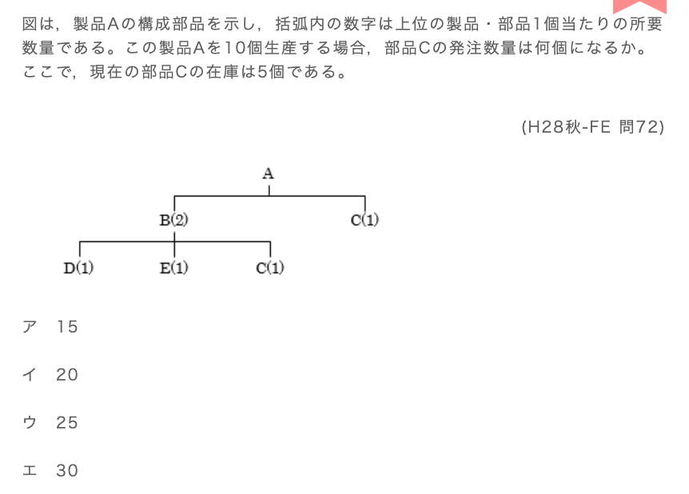

## 一、核心概念：BOM（部品表）とMRP
### 1. BOM（Bill Of Materials / 部品表）
- **日文原文**：部品表（ぶひんひょう）
- **英文原词**：Bill Of Materials（BOM）
- **中文翻译**：物料清单/零件清单
- **核心作用**：定义「1个上位制品，需要多少个下位部品」的层级关系，是生产计划的基础。
  比如题目里的：
  - 1个A需要：2个B + 1个C
  - 1个B需要：1个D + 1个E + 1个C

### 2. MRP（Material Requirements Planning / 資材所要量計画）
- **日文原文**：資材所要量計画（しざいしょようりょうけいかく）
- **英文原词**：Material Requirements Planning（MRP）
- **中文翻译**：物料需求计划
- **核心逻辑**：
  1.  根据「最终制品的生产数量」，计算**直接需要的部品数量**
  2.  再计算「中间部品生产时，间接需要的下级零件数量」
  3.  把直接+间接的需求量加总，再减去现有库存，得到最终需要订购的数量

---

## 二、这类题的「通用解题步骤」（照着做就不会错）
以这道题为例，我们把步骤标准化：

1.  **算出最终制品的「直接需求量」**
    制品A要生产10个，所以：
    - 直接用在A上的C：10个 × 1个/个A = 10个

2.  **算出中间制品带来的「间接需求量」**
    1个A需要2个B，所以10个A需要：10 × 2 = 20个B
    而1个B需要1个C，所以：
    - 间接用在B上的C：20个B × 1个/个B = 20个

3.  **计算C的「总需求量」**
    直接需求 + 间接需求 = 10 + 20 = 30个

4.  **减去现有库存，得到「最终订购数」**
    总需求量 - 现有库存 = 30 - 5 = 25个（对应选项ウ）

---

## 三、这类题最容易踩的坑
- ❌ **只算直接需求，忘了间接需求**：比如这道题里，只算了A直接用的10个C，忘了B生产时也需要C，就会算错。
- ❌ **搞反了层级关系**：比如把“1个A需要2个B”当成“1个B需要2个A”，导致后续计算全部出错。
- ❌ **忘了减去库存**：算出总需求30个就直接选了，没减去现有的5个库存。

---

## 四、相关术语对照表（方便记忆）
| 日文原文 | 读音 | 英文原词 | 中文翻译 |
| :--- | :--- | :--- | :--- |
| 部品表 | ぶひんひょう | Bill Of Materials (BOM) | 物料清单 |
| 資材所要量計画 | しざいしょようりょうけいかく | Material Requirements Planning (MRP) | 物料需求计划 |
| 所要数量 | しょようすうりょう | Required Quantity | 所需数量 |
| 在庫数 | ざいこすう | Inventory Quantity | 库存数量 |
| 発注数 | はっちゅうすう | Order Quantity | 订购数量 |

## 一、知识点总结：開発・生産関連のエンジニアリング手法
---
### 1. コンカレントエンジニアリング（Concurrent Engineering）
- **日文原文**：コンカレントエンジニアリング
- **读音**：konkarento enjiniaringu
- **英文原词**：Concurrent Engineering（并行工程/同步工程）
- **核心定义**：製品開発において、設計・生産計画・品質管理などの工程を**同時並行的**に進める生産手法。
- **目的**：開発期間の短縮、手戻り（返工）削減、コスト低減、品質向上を図る。
- **特徴**：複数部門が早期から連携し、後工程の視点を前工程に反映させる。

---
### 2. バリューエンジニアリング（Value Engineering, VE）
- **日文原文**：バリューエンジニアリング
- **读音**：baryū enjiniaringu
- **英文原词**：Value Engineering（价值工程）
- **核心定义**：機能とコストの最適な組み合わせを追求し、製品の価値（機能/コスト）を最大化する手法。
- **目的**：必要な機能を維持しつつ、不要なコストを削減する。

---
### 3. シーケンスエンジニアリング（Sequential Engineering）
- **日文原文**：シーケンスエンジニアリング
- **读音**：shī-kensu enjiniaringu
- **英文原词**：Sequential Engineering（顺序工程/逐次開発）
- **核心定义**：設計→製造→販売などの工程を**順番に**進める伝統的な開発手法。
- **特徴**：前工程が完了してから次工程に進むため、手戻りが発生しやすく開発期間が長くなりがち。コンカレントエンジニアリングの対義語。

---
### 4. リバースエンジニアリング（Reverse Engineering）
- **日文原文**：リバースエンジニアリング
- **读音**：ribāsu enjiniaringu
- **英文原词**：Reverse Engineering（逆向工程）
- **核心定义**：既存の製品（プロダクト）を解析し、その設計・仕様・構造を明らかにする手法。
- **用途**：競合製品の分析、レガシー製品の仕様復元、互換部品開発など。

---
## 二、题目解析（原文+翻译+选项说明）
### 题目原文（日文）
**コンカレントエンジニアリングの説明として、適切なものはどれか。**
（H26秋-FE 問72）

### 题目翻译（中文）
以下哪一项是对**并行工程（Concurrent Engineering）**的正确说明？

---
### 选项解析（日文原文+中文翻译+对应概念）
1.  **ア**
    - 日文原文：機能とコストとの最適な組合せを把握し、システム化された手順によって価値の向上を図る手法
    - 中文翻译：通过把握功能与成本的最优组合，以系统化流程提升产品价值的手法
    - 对应概念：**バリューエンジニアリング（Value Engineering）** → 不適切

2.  **イ（正解）**
    - 日文原文：製品開発において、設計、生産計画などの工程を同時並行的に行う手法
    - 中文翻译：在产品开发中，将设计、生产计划等流程**同时并行推进**的手法
    - 对应概念：**コンカレントエンジニアリング（Concurrent Engineering）** → 適切

3.  **ウ**
    - 日文原文：設計、製造、販売などのプロセスを順に行っていく製品開発の手法
    - 中文翻译：按顺序依次推进设计、制造、销售等流程的产品开发手法
    - 对应概念：**シーケンスエンジニアリング（Sequential Engineering）** → 不適切

4.  **エ**
    - 日文原文：対象のシステムを解析し、その仕様を明らかにする手法
    - 中文翻译：解析目标系统、明确其规格的手法
    - 对应概念：**リバースエンジニアリング（Reverse Engineering）** → 不適切

## 一、题目原文+翻译
### 日文原文
ディジタルディバイドを説明したものはどれか。
(R1秋-FE 問69)

ア：PCなどの情報通信機器の利用方法が分からなかったり，情報通信機器を所有していなかったりして，情報の入手が困難な人々のことである。

イ：高齢者や障害者の情報通信の利用面での困難が，社会的又は経済的な格差につながらないように，誰もが情報通信を利活用できるように整備された環境のことである。

ウ：情報通信機器やソフトウェア，情報サービスなどを，高齢者・障害者を含む全ての人が利用可能であるか，利用しやすくなっているかの度合いのことである。

エ：情報リテラシの有無やITの利用環境の相違などによって生じる，社会的又は経済的な格差のことである。

### 中文翻译
以下哪一项是对**数字鸿沟（ディジタルディバイド / digital divide）**的说明？
（平成31年秋季 FE 试题69）

A（ア）：指那些因不懂PC等信息通信设备的使用方法、或未拥有相关设备，而难以获取信息的人群。

B（イ）：指为避免高龄者、残障者在使用信息通信时面临的困难演变为社会或经济差距，而打造的“任何人都能使用信息通信”的环境。

C（ウ）：指信息通信设备、软件、信息服务等，对包括高龄者、残障者在内的所有人而言，是否可使用、或是否易用的程度。

D（エ）：指因信息素养（情報リテラシ）的有无、IT使用环境的差异等因素，产生的社会或经济层面的差距。

---

## 二、解析原文+翻译
### 日文原文
ディジタルディバイド（digital divide）は，米国の商務省の報告書（1999年）に記載された造語で，「ディジタル格差」もしくは「情報格差」などと訳される。ITを使いこなせる若年層や高所得層がITの恩恵を受けてますます経済力を強める一方で，ITの恩恵を受けない老年層や貧困層は置き去りにされて，社会的又は経済的格差が拡大するということを示す。国家や地域間の格差を示すこともある。したがって，（エ）が正解である。なお，情報リテラシは，今のIT社会でコンピュータを利用して情報を使いこなす知識や能力を意味する用語である。

ア：情報の入手が困難な人々のことを単純にディジタルディバイドとはいわない。なお，ディジタルディバイドは，社会的又は経済的理由による場合に使われる用語である。

イ：情報通信利用面の格差をなくす環境のことを示しており，格差の記述ではない。なお，高齢者や障害者が情報通信機器を利用する上で支障（バリア）がない状況のことを情報バリアフリーという。

ウ：利用の可能性や使いやすさの尺度（アクセシビリティ，ユーザビリティ）のことを示しており，情報格差の記述ではない。

正答: エ

### 中文翻译
数字鸿沟（digital divide）是美国商务部1999年报告中提出的术语，也译作“数字差距”或“信息差距”。它描述的是：能熟练使用IT的年轻群体、高收入群体，会借助IT红利不断增强经济实力；而无法享受IT红利的老年群体、贫困群体则被时代抛下，最终导致社会或经济层面的差距不断扩大。这个词也可用于描述国家、地区之间的这类差距。因此，**选项D（エ）是正确答案**。
补充说明：“信息素养（情報リテラシ）”指的是在当前IT社会中，使用计算机处理、运用信息的知识与能力。

- ア：数字鸿沟并不是单纯指“难以获取信息的人群”，这个词的核心是**由社会、经济因素导致的差距本身**，而非特定人群。
- イ：这个选项描述的是“消除信息通信使用差距的环境”，是解决差距的手段，而非差距本身。这类“让高龄者、残障者无障碍使用信息通信设备的环境”，被称为**信息无障碍（情報バリアフリー）**。
- ウ：这个选项描述的是“设备/服务的可使用性、易用性的衡量标准”，也就是**可访问性（アクセシビリティ）、可用性（ユーザビリティ）**，并非信息差距的定义。

---

## 三、错误原因逐一分析
1.  **你选的选项B（イ）为什么错？**
    选项B描述的是“为消除差距而打造的公平环境”，是**解决数字鸿沟的对策**，而不是“数字鸿沟”本身的定义。数字鸿沟的核心是「差距」，而这个选项讲的是「消除差距的环境」，概念完全相反，所以错误。

2.  **选项A（ア）为什么错？**
    它把数字鸿沟定义为“难以获取信息的人群”，但数字鸿沟不是指“某一类人”，而是指**因社会/经济因素，导致不同群体在信息获取、使用上产生的差距现象**，所以这个定义不完整，且偏离了核心概念。

3.  **选项C（ウ）为什么错？**
    它描述的是“信息通信设备/服务的易用性、可访问性的程度”，这是**可访问性（アクセシビリティ）**的定义，和“数字鸿沟（信息差距）”完全无关，属于混淆概念。

4.  **选项D（エ）为什么正确？**
    它精准抓住了数字鸿沟的核心：由信息素养、IT使用环境等因素，导致的**社会/经济层面的差距**，和题目解析的定义完全一致。

---

💡 帮你提炼一个核心记忆点：
- ディジタルディバイド（数字鸿沟）= 「差距」本身
- イ（信息无障碍）= 消除差距的「环境/对策」
- ウ（可访问性）= 衡量设备/服务易用性的「标准」

## 一、核心知识点总结（日文原文+中文翻译）
### アクセシビリティ（Accessibility，可访问性/无障碍性）
#### 日文原文
アクセシビリティ（accessibility）とは，高齢者や障害者などを含む全ての人が，様々な製品やサービスを支障なく利用できるかどうか，あるいはその度合いを指すキーワードである。
したがって，（エ）が正解である。
高齢者や障害者を含む誰もが，こういった情報システムを十分に利用できるようにするための画面の配色やフォントサイズなどのデザイン，音声スピーチ機能の装備，画像や音声の文字による解説文の添付など，「情報システムにおけるユニバーサルデザインの実現度」であるともいえる。
また，いわゆるバリアフリー的なデザインや機能によって統一されたものだけではなく，ユーザの身体特性に合わせて個別にこれらの機能を設定・調整できるような機器・ソフトウェアなども含まれる。

#### 中文翻译
**アクセシビリティ（Accessibility，可访问性/无障碍性）**，指的是包括高龄者、残障者在内的所有人，能否无障碍地使用各类产品与服务，或表示这种“无障碍程度”的关键词。因此，（エ）是正确答案。
它也可以理解为「信息系统中通用设计的实现程度」：比如为了让所有人都能顺畅使用信息系统，在画面配色、字体大小等设计上做优化，搭载语音朗读功能，为图片、音频添加文字说明等。
此外，它不仅包含无障碍设计的通用功能，也包括能根据用户的身体特征，单独设置、调整这些功能的设备与软件。

---

### 其他选项对应的知识点
- **ア：住民基本台帳ネットワークシステム（住基ネット）**
  是将行政机关、全国中心与地方公共团体联网，实现带有住民票编号的个人信息共享与利用的系统，目的是
  
  提升居民服务、合理化行政事务处理。
- **イ：インターオペラビリティ（Interoperability，相互运用性/互操作性）**
  指不同规格的计算机之间，通过网络等方式互相使用对方管理的软件、数据的能力。
- **ウ：トレーサビリティ（Traceability，追溯可能性）**
  指产品、食品等从生产阶段，到最终消费/废弃阶段的全过程，都可以追踪记录的特性。

---

## 二、题目讲解
### 题目
アクセシビリティを説明したものはどれか。
（以下哪个是对可访问性的说明？）

### 选项逐一分析
1.  **ア**：住民基本台帳的信息网络化管理，和“可访问性”无关，排除。
2.  **イ**：描述的是不同系统间的互操作性（インターオペラビリティ），不是可访问性，排除。
3.  **ウ**：描述的是产品全流程的可追溯性（トレーサビリティ），不是可访问性，排除。
4.  **エ**：精准命中定义——“软件、信息服务、网站等，包括高龄者、残障者在内的所有人都能使用”，是可访问性的核心描述，**正确**。

✅ 结论：这道题的正确答案是 **エ**。

---

💡 补充一个易混点：
- アクセシビリティ（可访问性）：关注**「能不能用」**，比如视障用户能不能用读屏软件访问网站。
- ユーザビリティ（Usability，易用性）：关注**「好不好用」**，比如普通用户用起来是否高效、方便。

## 一、核心知识点：ディジタルツイン（Digital Twin，数字孪生）
### 日文原文
ディジタルツインとは，現実世界の事象を仮想世界に再現する技術や仕組みのことである。IoT機器のセンサ情報で収集したデータを仮想世界でリアルタイム表示するシステムが開発されており，物理的なモノを作らずとも仮想世界上でモノのシミュレーションを簡単に実施できることなどから設計・製造の分野での活用が期待されている。

### 中文翻译
**数字孪生（Digital Twin）**，是指将现实世界的现象在虚拟世界中复现的技术与机制。
它会通过IoT设备的传感器收集数据，并在虚拟世界中实时呈现这些数据；即使不制作实体产品，也能在虚拟空间里轻松完成产品模拟，因此在设计、制造领域的应用前景广阔。

### 关键特征
- 核心：**现实世界的“数字分身”**，虚拟模型与物理实体实时联动
- 用途：模拟仿真、故障预测、优化设计、生产管理
- 实现基础：IoT传感器数据的实时采集与传输

## 二、各选项对应的概念解析
### ア
- 日文原文：インターネットを介して遠隔地に設置した3Dプリンタへ設計データを送り，短時間に複製物を製作すること
- 中文翻译：通过互联网向远程的3D打印机发送设计数据，快速制作复制品
- 对应概念：**远程3D打印**（不属于数字孪生，因为现实和虚拟之间没有实时联动的模型，只是数据传输制作实体）

### イ
- 日文原文：システムを正副の二重に用意し，災害や故障時にシステムの稼働の継続を保証すること
- 中文翻译：准备主备两套系统，在灾害或故障时保证系统持续运行
- 对应概念：**系统冗余/BCP业务连续性计划**（和数字孪生无关，是系统容灾备份的概念）

### ウ
- 日文原文：自宅の家電機器とインターネットでつながり，稼働監視や操作を遠隔で行うことができるウェアラブルデバイスのこと
- 中文翻译：通过互联网连接家中家电，可远程监控运行状态、进行操作的可穿戴设备
- 对应概念：**智能家居远程控制/可穿戴设备**（只是现实设备的远程监控，没有虚拟空间的复现模型，不属于数字孪生）

### エ（正解）
- 日文原文：ディジタル空間に現実世界と同等な世界を，様々なセンサで収集したデータを用いて構築し，現実世界では実施できないようなシミュレーションを行うこと
- 中文翻译：利用各类传感器收集的数据，在数字空间构建与现实世界等同的虚拟世界，并开展现实中无法实施的模拟
- 对应概念：**数字孪生的核心定义**（精准描述了“虚拟复现+数据联动+模拟仿真”的关键特征）

---

## 三、FE考试易混概念对比
| 术语 | 核心区别 |
| :--- | :--- |
| ディジタルツイン | 虚拟空间构建与现实联动的数字模型，用于模拟、预测 |
| リモート3Dプリント | 远程传输数据制作实体，无实时联动的虚拟模型 |
| システム二重化（BCP） | 主备系统冗余备份，保证系统不中断 |
| IoT家電リモート操作 | 远程监控/控制现实设备，无虚拟复现模型 |

---

💡 一句话记住数字孪生：
**“现实有个实体，虚拟有个分身，数据实时同步，用来模拟优化”**

# コモディティ化  商品化/同质化  Commoditization

这道题问的是**コモディティ化（Commoditization，商品化/同质化）**的说明，正确答案是 **ウ**。

---

### 选项解析
- **ア**：基于革新性发明，开发市场从未有过的产品并投入市场。
  → 这是**新产品开发/创新**的定义，和商品化无关。

- **イ**：技术革新导致后发产品让先发产品的市场衰退。
  → 这是**技术替代/颠覆式创新**的定义，不是商品化。

- **ウ**：由于技术成熟，难以在价格以外的方面和其他公司的产品形成差异化。
  → 这正是**コモディティ化**的核心特征：产品技术成熟后，所有厂商的产品功能、性能都趋同，只能靠价格竞争。✅ 正确。

- **エ**：为了避免价格竞争，开发并销售和其他公司产品功能不同的产品。
  → 这是**差异化战略**的定义，是商品化的“反面”。

---

💡 补充知识点：
コモディティ化（商品化）的本质，就是产品失去独特性，变成“大路货”，竞争只剩下价格战。典型例子就是U盘、普通手机充电器这类产品，各家的功能、性能都差不多，消费者只看价格。

✅ 结论：这道题选 **C（ウ）**。

