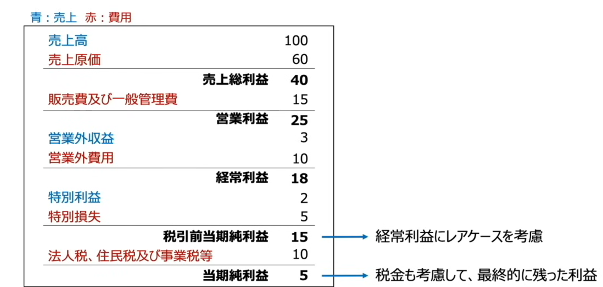
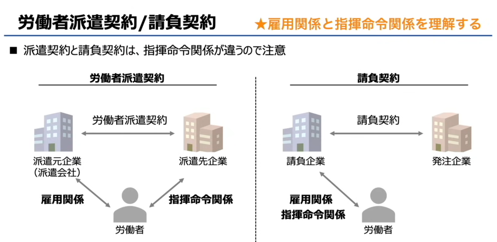
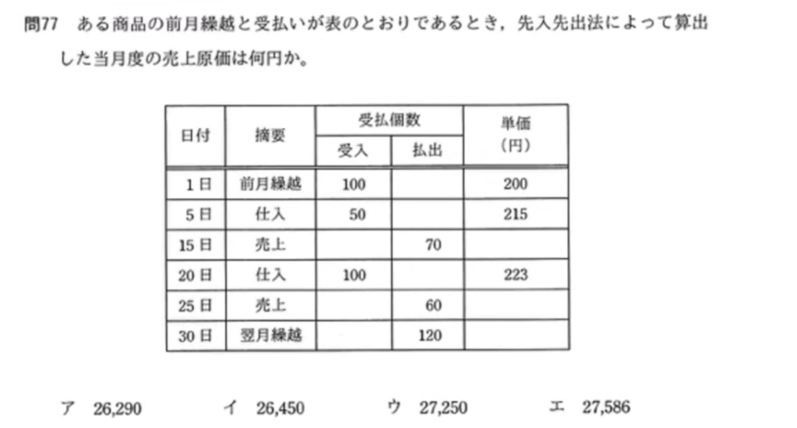
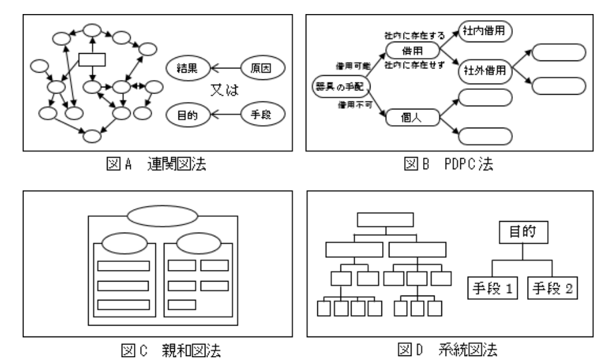

# 知识点总结

## 一、利益と費用（利润与费用）
### 核心概念
- **売上（销售额）**：商品/服务卖出后获得的收入总额
- **費用（成本/费用）**：生产、销售商品过程中产生的所有支出
- **利益（利润）**：销售额减去费用后的剩余金额

### 公式
\[
\text{利益} = \text{売上} - \text{費用}
\]

例：売上300万円 - 費用250万円 = 利益50万円

---

## 二、費用の分類（费用的分类）
费用按和销售额的关系，分为两类：
### 1. 変動費（变动成本）
- 日文原文：売上に比例して発生
- 中文翻译：随销售额变化而按比例增减的成本
- 例子：材料费、运费、生产用的零部件成本（如汽车的轮胎、方向盘）
- 计算：
\[
\text{変動費} = \text{売上} \times \text{変動比率}
\]
例：売上300万円 × 変動比率30% = 変動費90万円

### 2. 固定費（固定成本）
- 日文原文：売上に関係なく発生
- 中文翻译：不随销售额变化，固定发生的成本
- 例子：人工费、房租、工厂设备折旧

---

## 三、損益分岐点（盈亏平衡点）
### 核心概念
- 日文原文：売上と費用が一致する売上高（＝利益が0円）
- 中文翻译：销售额与费用完全相等、利润为0时的销售额，是企业“不赚不亏”的临界点。
- 例子：売上250万円 = 費用250万円 → 利益0円，这250万円就是盈亏平衡点销售额。

### 公式推导
1.  基本关系：
\[
\text{損益分岐点売上} = (\text{損益分岐点売上} \times \text{変動比率}) + \text{固定費}
\]
2.  整理公式：
\[
\text{損益分岐点売上} \times (1 - \text{変動比率}) = \text{固定費}
\]
3.  最终公式：
\[
\text{損益分岐点売上} = \frac{\text{固定費}}{1 - \text{変動比率}}
\]

---

💡 帮你提炼3个考试必背要点：
1.  利润的本质：**销售额 - 总费用**
2.  费用的关键分类：**变动成本（随销售额变）+ 固定成本（不随销售额变）**
3.  盈亏平衡点的核心公式：**固定費 ÷ (1 - 変動比率)**

# 財務諸表（①貸借対照表, B/S）知识点总结
我帮你按「日文原文+中文翻译」整理好核心内容👇

---

## 一、基础定义
### 日文原文
貸借対照表は、資産、負債、純資産を記載し、ある時点の財務状況を表す

### 中文翻译
**资产负债表（B/S）**，是记录企业的「资产、负债、净资产」，反映企业**某一特定时点财务状况**的报表。

---

## 二、三大核心要素拆解
| 日文术语 | 读音（罗马字） | 通俗说明（图中） | 中文翻译 | 核心含义 |
| :--- | :--- | :--- | :--- | :--- |
| 資産 | しさん（shisan） | 使い道（用途） | 资产 | 企业拥有的全部资源，比如现金、设备、存货等，是企业把钱花在了哪里。 |
| 負債 | ふさい（fusai） | 人から借りたお金（从别人借来的钱） | 负债 | 企业欠别人的钱，比如银行贷款、应付账款，是企业从外部筹集的资金。 |
| 純資産 | じゅんしさん（junshisan） | 自分で用意したお金（自己准备的钱） | 净资产（所有者权益） | 企业股东自己投入的钱，加上经营赚来的留存收益，是企业真正属于股东的部分。 |

---

## 三、核心公式
\[
\text{資産} = \text{負債} + \text{純資産}
\]
可以理解为：
企业「把钱花在哪里（资产）」，等于「从别人借来的钱（负债）」加上「自己的钱（净资产）」。

---

💡 一句话记忆：
貸借対照表（B/S）就是企业的「财务快照」，左边看“钱花在哪”，右边看“钱从哪来”，两边永远相等。

要不要我帮你出一道带数字的例题，带你用这个公式算一遍？

---

## 一、核心概念
**損益分岐点（盈亏平衡点）**
- 日文定义：売上と費用が一致する売上高（＝利益が0円）
- 中文翻译：销售额和总成本相等、利润为0时的销售额，也就是企业“不赚不亏”的临界销售额。

---

## 二、关键公式与推导
### 1. 核心公式
\[
\text{損益分岐点売上} = \frac{\text{固定費}}{1 - \text{変動比率}}
\]

### 2. 公式里的关键指标
- **固定費**：不随销售额变化的成本（如房租、固定人工费）
- **変動比率**：变动成本占销售额的比例，公式：
\[
\text{変動比率} = \frac{\text{変動費}}{\text{売上高}}
\]

売上高” 读作： うりあげだか（uriagedaka）
意思是：销售额 / 营业额 / Revenue（营收），指企业通过销售商品或服务获得的总收入（通常还没扣成本和费用）。

## 三、例题完整拆解
题目：売上高160万円のとき、変動費が40万円、固定費が60万円の場合の損益分岐点売上を求める。

### 步骤1：先算変動比率
\[
\text{変動比率} = \frac{\text{変動費}}{\text{売上高}} = \frac{40万円}{160万円} = 0.25
\]

### 步骤2：代入盈亏平衡点公式
\[
\text{損益分岐点売上} = \frac{\text{固定費}}{1 - \text{変動比率}} = \frac{60万円}{1 - 0.25} = \frac{60万円}{0.75} = 80万円
\]

### 步骤3：验证结果
- 当销售额为80万円时，变动费用 = 80万 × 0.25 = 20万円
- 总费用 = 变动费用20万 + 固定费用60万 = 80万円
- 销售额 = 总费用 → 利润为0，确实是盈亏平衡点。

---

💡 一句话记忆：
**盈亏平衡点销售额 = 固定成本 ÷（1 - 变动成本率）**

# 財務諸表（财务报表）知识点科普  ざいむしょひょう 

## 一、財務諸表（财务报表）整体说明
### 日文原文
企業の財政状況や経営成績をステークホルダーに報告するために作成される
特に「貸借対照表」「損益計算書」「キャッシュフロー計算書」の3つを「財務三表」という

### 中文翻译
为了向利益相关方（股东、投资者、债权人等）报告企业的**财务状况**和**经营成果**而编制的文件。
其中，「资产负债表」「利润表」「现金流量表」这三份核心报表，被称为**财务三表**。

---

## 二、財務三表 核心知识点
### 1. 貸借対照表（B/S：Balance Sheet，资产负债表）
- **日文原文**：ある時点でのお財布状況
- **中文翻译**：反映企业在**某一特定时间点**的财务状况（资产、负债、所有者权益）的报表，相当于企业的“快照”。
- **核心公式**：資産（资产） = 負債（负债） + 自己資本（所有者权益/净资产）
- **用途**：看企业有多少资产、欠了多少债、股东实际拥有多少净资产，判断企业的财务健康度。

---

### 2. 損益計算書（P/L：Profit and Loss Statement，利润表）
- **日文原文**：1年間の儲け
- **中文翻译**：反映企业在**一段期间内（通常是一年）**的经营成果，记录收入、费用和利润的报表，相当于企业的“成绩单”。
- **核心公式**：利益（利润） = 売上高（收入） - 費用（成本/费用）
- **用途**：看企业赚了多少钱、花了多少钱，判断企业的盈利能力。

---

### 3. キャッシュフロー計算書（C/F：Cash Flow Statement，现金流量表）
- **日文原文**：1年間の現金の流れ
- **中文翻译**：反映企业在**一段期间内（通常是一年）**的现金流入、流出情况的报表，相当于企业的“流水账”。
- **核心分类**：
  - 営業活動によるキャッシュフロー（经营活动现金流：主营业务的现金收支）
  - 投資活動によるキャッシュフロー（投资活动现金流：买卖资产的现金收支）
  - 財務活動によるキャッシュフロー（筹资活动现金流：借款、分红的现金收支）
- **用途**：看企业现金从哪来、花到哪去，判断企业的现金周转能力（很多企业盈利但现金流断裂会破产）。

---

💡 一句话帮你记住财务三表的区别：
- B/S：看**某一时刻**企业“有什么、欠什么”
- P/L：看**一段时间**企业“赚了多少、花了多少”
- C/F：看**一段时间**企业“现金从哪来、花到哪去”

| 日文术语 | 读音（罗马字） | 英文 | 中文翻译 |
| :--- | :--- | :--- | :--- |
| 財務諸表 | ざいむしょひょう (zaimu shohyou) | Financial Statements | 财务报表 |
| 財務三表 | ざいむさんひょう (zaimu sanhyou) | Three Core Financial Statements | 财务三表 |
| 貸借対照表 | たいしゃくたいしょうひょう (taishaku taishouhyou) | Balance Sheet (B/S) | 资产负债表 |
| 損益計算書 | そんえきけいさんしょ (son'eki keisansho) | Profit and Loss Statement (P/L) | 利润表（损益表） |
| キャッシュフロー計算書 | キャッシュフローけいさんしょ (kyasshu furou keisansho) | Cash Flow Statement (C/F) | 现金流量表 |
| 資産 | しさん (shisan) | Assets | 资产 |
| 負債 | ふさい (fusai) | Liabilities | 负债 |
| 自己資本 | じこしほん (jiko shihon) | Equity / Net Assets | 所有者权益（净资产） |
| 売上高 | うりあげだか (uriage daka) | Sales / Revenue | 销售额（营业收入） |
| 費用 | ひよう (hiyou) | Expenses / Costs | 费用（成本） |
| 利益 | りえき (rieki) | Profit / Income | 利润 |
| ステークホルダー | すてーくほるだー (sutēku horudā) | Stakeholder | 利益相关方 |
| 営業活動 | えいぎょうかつどう (eigyou katsudou) | Operating Activities | 经营活动 |
| 投資活動 | とうしかつどう (toushi katsudou) | Investing Activities | 投资活动 |
| 財務活動 | ざいむかつどう (zaimu katsudou) | Financing Activities | 筹资活动 |

---
💡 补充两个易读错的词：
- **貸借対照表**：「貸借」读作たいしゃく（taishaku），不要读成かしかり（kashikari）
- **損益計算書**：「損益」读作そんえき（son'eki），不要读成そんいき（son'iki）

## 一、財務諸表（财务报表）基础定义
### 日文原文
企業の財政状況や経営成績をステークホルダーに報告するために作成される
特に「貸借対照表」「損益計算書」「キャッシュフロー計算書」の3つを「財務三表」という

### 中文翻译
为了向利益相关方（股东、投资者、债权人等）报告企业的**财务状况**和**经营成果**而编制的文件。
其中，「资产负债表」「利润表」「现金流量表」这三份核心报表，被称为**财务三表**。

---

## 二、财务三表的时间维度与对应关系
这张图用一个会计年度（2023/4/1 - 2024/3/31），清晰展示了三张报表的不同视角：

| 报表 | 日文标注 | 英文缩写 | 中文翻译 | 时间维度 | 核心含义 |
| :--- | :--- | :--- | :--- | :--- | :--- |
| 損益計算書 | 1年間の儲け | P/L | 利润表（损益表） | **一段期间**（整个会计年度） | 记录这一年里企业的收入、费用和利润，反映经营赚了多少钱 |
| キャッシュフロー計算書 | 1年間の現金の流れ | C/F（图中标注为C/S是笔误，应为C/F） | 现金流量表 | **一段期间**（整个会计年度） | 记录这一年里企业现金的流入、流出情况，反映钱从哪来、花到哪去 |
| 貸借対照表 | 期末の財務状況 | B/S | 资产负债表 | **特定时点**（会计年度末2024/3/31） | 反映年末这一刻企业的资产、负债和所有者权益，是企业财务状况的“快照” |

---

## 三、关键逻辑关系
- **期间报表（P/L、C/F）的结果，最终会反映在期末的时点报表（B/S）里**：
  1.  利润表（P/L）算出的年度净利润，会加到资产负债表（B/S）的「留存收益/自己資本」里，让企业净资产增加。
  2.  现金流量表（C/F）算出的年末现金余额，会直接出现在资产负债表（B/S）的「現金預金」项目里。

💡 一句话帮你记住：
- B/S（资产负债表）：看**某一刻**企业的财务快照
- P/L（利润表）：看**一整年**企业的经营成果
- C/F（现金流量表）：看**一整年**企业的现金流水
三张表环环相扣，完整反映了企业的经营全貌。

# 財務諸表（①貸借対照表, B/S）知识点总结

## 一、基础定义
### 日文原文
貸借対照表は、資産、負債、純資産を記載し、ある時点の財務状況を表す

### 中文翻译
**资产负债表（B/S）**，是记录企业的「资产、负债、净资产」，反映企业**某一特定时点财务状况**的报表。

---

## 二、三大核心要素拆解
| 日文术语 | 读音（罗马字） | 通俗说明（图中） | 中文翻译 | 核心含义 |
| :--- | :--- | :--- | :--- | :--- |
| 資産 | しさん（shisan） | 使い道（用途） | 资产 | 企业拥有的全部资源，比如现金、设备、存货等，是企业把钱花在了哪里。 |
| 負債 | ふさい（fusai） | 人から借りたお金（从别人借来的钱） | 负债 | 企业欠别人的钱，比如银行贷款、应付账款，是企业从外部筹集的资金。 |
| 純資産 | じゅんしさん（junshisan） | 自分で用意したお金（自己准备的钱） | 净资产（所有者权益） | 企业股东自己投入的钱，加上经营赚来的留存收益，是企业真正属于股东的部分。 |

---

## 三、核心公式
\[
\text{資産} = \text{負債} + \text{純資産}
\]
可以理解为：
企业「把钱花在哪里（资产）」，等于「从别人借来的钱（负债）」加上「自己的钱（净资产）」。

---

💡 一句话记忆：
貸借対照表（B/S）就是企业的「财务快照」，左边看“钱花在哪”，右边看“钱从哪来”，两边永远相等。

# 損益計算書（P/L，利润表）知识点总结
我帮你按「日文原文+中文翻译+读音标注」整理核心内容，同时拆解关键利润指标的计算逻辑👇

## 一、基础定义
### 日文原文
損益計算書は、ある一定期間における収益と費用を明らかにして企業の経営成績を表す

### 中文翻译
**利润表（P/L）**，是记录企业在一定期间内的收入与费用，反映企业经营成果的报表。
（补充：图中用蓝色标注收入、红色标注费用，直观体现“收入-费用=利润”的核心逻辑）

---

## 二、利润表核心术语（含读音+中文翻译）
| 日文术语 | 读音（罗马字） | 中文翻译 | 通俗说明（图中例子） |
| :--- | :--- | :--- | :--- |
| 売上高 | うりあげだか（uriage daka） | 销售额（营业收入） | 主营业务的收入，例：汽车销售的总金额100 |
| 売上原価 | うりあげげんか（uriage genka） | 销售成本 | 生产商品的直接成本，例：汽车零部件成本60 |
| 売上総利益 | うりあげそうりえき（uriage sourieki） | 毛利润 | 销售额减去销售成本后的利润 |
| 販売費及び一般管理費 | はんばいひおよびいっぱんかんりひ（hanbaihi oyobi ippan kanrihi） | 销售费用及一般管理费用 | 销售、管理环节的间接费用，例：人工费、广告费15 |
| 営業利益 | えいぎょうりえき（eigyou rieki） | 营业利润 | 主营业务的核心利润 |
| 営業外収益 | えいぎょうがいしゅうえき（eigyou gai shūeki） | 营业外收入 | 非主营业务的常规收入，例：股票分红3 |
| 営業外費用 | えいぎょうがいひよう（eigyou gai hiyou） | 营业外支出 | 非主营业务的常规支出，例：员工事故赔偿10 |
| 経常利益 | けいじょうりえき（keijou rieki） | 经常利润 | 企业日常经营的总利润 |
| 特別利益 | とくべつりえき（tokubetsu rieki） | 特别收益 | 非经常性的偶发收入，例：股票买卖收益2 |
| 特別損失 | とくべつそんしつ（tokubetsu sonshitsu） | 特别损失 | 非经常性的偶发支出，例：自然灾害损失5 |
| 税引前当期純利益 | ぜいびきまえとうきじゅんりえき（zeibikimae touki junrieki） | 税前当期净利润 | 扣除税金前的年度总利润 |
| 法人税、住民税及び事業税等 | ほうじんぜい、じゅうみんぜいおよびじぎょうぜいとう（houjinzei, juuminzei oyobi jigyousei tou） | 法人税、居民税及事业税等 | 企业需缴纳的各项税金，例：10 |
| 当期純利益 | とうきじゅんりえき（touki junrieki） | 当期净利润 | 企业年度最终利润，例：5 |

---

## 三、利润指标计算逻辑（含例题）
以图中数据为例，完整拆解利润计算过程：
1.  **売上総利益**
    公式：`売上高 - 売上原価`
    例：`100 - 60 = 40`
2.  **営業利益**
    公式：`売上総利益 - 販売費及び一般管理費`
    例：`40 - 15 = 25`
3.  **経常利益**
    公式：`営業利益 + 営業外収益 - 営業外費用`
    例：`25 + 3 - 10 = 18`
4.  **税引前当期純利益**
    公式：`経常利益 + 特別利益 - 特別損失`
    例：`18 + 2 - 5 = 15`
5.  **当期純利益**
    公式：`税引前当期純利益 - 法人税等`
    例：`15 - 10 = 5`

---

## 四、利润的三层含义（图中分类）
1.  **本業で発生する収支（主营业务收支）**：计算营业利润，反映企业核心业务的盈利能力
2.  **本業では無いが頻繁に発生する収支（非主营业务的常规收支）**：计算经常利润，反映企业日常经营的整体盈利能力
3.  **その他のレアケース収支&税金を考慮した収支（偶发收支+税金）**：计算当期净利润，反映企业年度最终盈利结果

---

💡 一句话记忆：
利润表的利润从“毛利润”到“净利润”，是一步步扣除成本、费用、税金的过程，越往下越接近企业实际拿到手的利润。

## 一、キャッシュフロー計算書（现金流量表）基础定义
### 日文原文
キャッシュフロー計算書は、ある一定期間における資金の増減を営業活動・投資活動・財務活動ごとに区分して表す

### 中文翻译
**现金流量表（C/F）**，是将企业在一定期间内的资金增减变动，按「经营活动、投资活动、筹资活动」三类分别列示的报表，反映企业现金的来龙去脉。

---

## 二、三类现金流量详解（含读音+翻译+例子）
| 日文术语 | 读音（罗马字） | 中文翻译 | 核心含义（图中说明） | 例子 |
| :--- | :--- | :--- | :--- | :--- |
| 営業活動によるキャッシュフロー | えいぎょうかつどうによるキャッシュフロー (eigyou katsudou ni yoru kyasshu furou) | 经营活动现金流量 | 反映企业**主营业务**创造现金的能力，是企业的“造血能力” | 汽车销售业务带来的现金流入 |
| 投資活動によるキャッシュフロー | とうしかつどうによるキャッシュフロー (toushi katsudou ni yoru kyasshu furou) | 投资活动现金流量 | 反映企业**设备/项目投资**的现金增减，是企业的“扩张/收缩信号” | 投资建设汽车工厂的现金流出 |
| 財務活動によるキャッシュフロー | ざいむかつどうによるキャッシュフロー (zaimu katsudou ni yoru kyasshu furou) | 筹资活动现金流量 | 反映企业**资金筹集/偿还**的现金增减，是企业的“输血能力” | 从银行贷款获得的现金流入 |

---

## 三、关键逻辑补充
- 三类现金流的关系：
  1.  **经营活动现金流为正**：说明企业主营业务能稳定赚钱，是健康的基础。
  2.  **投资活动现金流为负**：通常表示企业正在扩张投资（如建厂房、买设备），是成长型企业的常见状态。
  3.  **筹资活动现金流为正**：说明企业正在外部借钱/融资；为负则表示在偿还债务、分红给股东。

💡 一句话记忆：
- 営業活動：主业赚来的钱
- 投資活動：投出去/收回来的钱
- 財務活動：借来/还回去的钱

# 減価償却資産と減価償却（折旧资产与折旧）知识点总结

げんかしょうきゃく

## 一、核心概念
### 日文原文
設備や機械など時間の経過とともに価値が減っていく資産を「減価償却資産」という
減価償却資産は、時間の経過と共に目には見えない費用が発生する

### 中文翻译
**折旧资产（減価償却資産）**：指设备、机械等会随着时间推移而价值下降的资产。
这类资产会随着时间流逝，产生**看不见的费用（折旧费用）**，也就是**折旧（減価償却）**。

## 二、通俗理解（结合图中例子）
以电脑为例：
- 购入时：价值20万日元
- 10年后：价值变为0日元
- 理论上：价值每年下降2万日元（20万 ÷ 10年）
- 本质：这每年下降的2万日元，就是**折旧费用**——虽然没有现金支出，但在会计上是企业的成本。

## 三、关键要点
- **为什么要折旧？**
  因为设备的价值不是在购买时一次性消失，而是在使用过程中慢慢消耗的。折旧就是把这种消耗分摊到每一年，让利润表更真实。
- **特点**：折旧是**非现金费用**，只影响利润，不影响企业的现金流。

💡 一句话记忆：
折旧就是把设备的“损耗”，按使用年限摊成每年的费用。

## 一、減価償却（折旧）核心定义

げんかしょうきゃく（genka shōkyaku）
意思是会计里的 “折旧 / depreciation”，比如公司买机器、设备后，把成本按年分摊。
拆开：
減価（げんか） = 价值减少
償却（しょうきゃく） = 分期摊销、冲销

### 日文原文
減少する価値を減価償却費として費用計上することを減価償却  げんかしょうきゃく と呼ぶ

### 中文翻译
把资产逐年减少的价值，作为**折旧费用**计入成本的会计处理方式，就叫**折旧（減価償却）**。

---

## 二、核心公式（定額法/直线法）
定額法是最基础、最常用的折旧方法，公式如下：
\[
\text{1年間の減価償却費} = \frac{\text{取得価額} - \text{残存価額}}{\text{耐用年数}}
\]
- **取得価額**：资产的购入成本
- **残存価額**：资产报废时的剩余价值（例题中假设为0）
- **耐用年数**：资产的预计使用年限

---

## 三、例题完整拆解
题目：200万日元的服务器，用定額法在5年内折旧。

1.  代入公式：
    \[
    \text{年折旧费用} = \frac{200万円 - 0}{5年} = 40万円
    \]
2.  含义：这台服务器每年在会计上会产生40万日元的折旧费用，连续5年，正好把200万日元的成本摊完。

---

💡 一句话记忆：
折旧就是把设备的购买成本，平均分摊到每一年，作为看不见的费用扣减利润。

## 一、先入先出法（在庫評価）核心定义

### 日文原文
先に仕入れた商品から先に販売したと仮定して、在庫を計算する方法

### 中文翻译
**先进先出法（FIFO）**，是一种存货计价方法：
**假设先购入的商品会先被卖出**，以此来计算发出商品的成本和期末库存价值。

---

## 二、核心规则
1.  **成本流动逻辑**：按「购入的先后顺序」来结转成本。
    - 卖出的商品，优先用最早一批的进货成本计算；
    - 期末剩下的库存，按最晚一批的进货成本计算。
2.  **适用场景**：物价上涨时，会让当期利润偏高；物价下跌时，会让当期利润偏低。

---

## 三、例题完整拆解（图中例子）
### 1. 进货记录
- 1/1 进货：10个，单价100日元，总成本1000日元
- 1/3 进货：8个，单价160日元，总成本1280日元
- 总库存：18个

### 2. 销售情况
- 1/5 卖出12个商品

### 3. 先进先出法计算
- 第一步：优先用最早的进货（1/1的10个）：
  `10个 × 100円 = 1000円`
- 第二步：不够的部分，用下一批进货（1/3的商品）补足：
  `(12 - 10) = 2个 × 160円 = 320円`
- 第三步：合计发出成本：
  `1000円 + 320円 = 1320円`
- 单个平均成本：`1320円 ÷ 12个 = 110円/个`

### 4. 期末库存（剩余18-12=6个）
全部来自最晚的1/3进货：
`6个 × 160円 = 960円`

💡 一句话记住：
**先买的先卖，成本跟着进货顺序走。**

# 法規と標準化

### 知识产权（知的財産権 / ちてきざいさんけん / chiteki zaisanken）
- **定义**：知识产权是对人类创作活动产生的成果所赋予的权利总称，主要分为「著作权」和「工业产权」两大类。

### 1. 著作权（著作権 / ちょさくけん / chosakuken）
- **定义**：保护小说、音乐、绘画、程序等**文化创作物**的权利。
- 著作权又细分为两类：
  - **著作人格权（著作者人格権 / ちょさくしゃじんかくけん / chosakusha jinkakuken）**：保护作者名誉与人格的权利，包括发表权、署名权、同一性保持权等。
  - **著作财产权（著作財産権 / ちょさくざいさんけん / chosaku zaisanken）**：通过复制、公开、转让作品获取经济利益的权利，包括复制权、上演权、上映权、发行权等。

### 2. 工业产权（産業財産権 / さんぎょうざいさんけん / sangyou zaisanken）
- **定义**：保护发明、实用新型、设计、商标等**产业活动相关成果**的权利。
- 主要类型：
  - **专利权（特許権 / とっきょけん / tokkyoken）**：保护新的「发明」，赋予权利人一定期限内的独占实施权。
  - **实用新型权（実用新案権 / じつようしんあんけん / jitsuyou shinanken）**：保护物品形状、结构等「实用新型」的权利，申请流程比专利权更简便。
  - **外观设计权（意匠権 / いしょうけん / ishouken）**：保护物品外观设计、形状、图案等「外观」的权利。
  - **商标权（商標権 / しょうひょうけん / shouhyouken）**：保护商品/服务的品牌名、标志等「商标」，赋予权利人独占使用权。

💡 一句话帮你区分：
著作权保护**文化创作**，工业产权保护**商业发明、设计和品牌**。

### 著作権（ちょさくけん / chosakuken）
- **日文定义**：文芸、学術、美術、音楽などの著作物について、作品がどう使われるかを決めることができる権利。
- **中文翻译**：著作权，是针对文艺、学术、美术、音乐等创作物，决定作品如何被使用的权利。
- **核心分类**：分为「著作者人格権」和「著作財産権」两大类。

### 一、著作者人格権（ちょさくしゃじんかくけん / chosakusha jinkakuken）
- **日文定义**：著作者の思いや名誉を守る権利。
- **中文翻译**：著作人格权，保护作者的思想与名誉的权利。
- 包含的具体权利：
  1.  **同一性保持権（どういつせいほじけん / douitsusei hojiken）**
      - 日文说明：他人に作品を無断で修正されないように要求する権利。
      - 中文翻译：保护作品不被他人擅自修改、篡改的权利，确保作品与作者的原意保持一致。
  2.  **公表権（こうひょうけん / kouhyouken）**
      - 日文说明：未公表の著作物を公表するかなどを決定する権利。
      - 中文翻译：决定是否将未发表的作品公之于众的权利。
  3.  **氏名表示権（しめいひょうじけん / shimei hyoujiken）**
      - 日文说明：著作名を表示するか、ペンネーム表示するかなどを決定する権利。
      - 中文翻译：决定是否在作品上署本名、笔名，或不署名的权利。

### 二、著作財産権（ちょさくざいさんけん / chosaku zaisanken）
- **日文定义**：著作物の利用を許可して利益を得る権利。
- **中文翻译**：著作财产权，通过许可他人使用作品来获取经济利益的权利。
- 包含的核心权利：
  - **複製権（ふくせいけん / fukuseiken）**：复制作品的权利，是最基础的财产权之一。
  - 此外还有上演権、上映権、頒布権、公衆送信権等（图中省略号表示），涵盖了作品公开、传播、改编等多种使用方式。

💡 一句话帮你区分两类权利：
- 著作者人格権：保护作者的「名誉和身份」，和钱无关，永久有效。
- 著作財産権：保护作者的「经济利益」，有保护期限（作者有生之年+死后50年）。

### 1. プログラムやWebページも著作権の対象
- **日文原文**：プログラムやWebページも著作権の対象となります。
- **读音**：ぷろぐらむやうぇぶぺーじもちょさくけんのたいしょうとなります。
- **中文翻译**：程序和网页也属于著作权的保护对象。
- **说明**：在日本，计算机程序、网站的设计与内容，都被视为「著作物」，受著作权法保护。

### 2. 試験のポイント：著作権対象と権利帰属
- **日文原文**：試験では著作権対象有無や権利の帰属先が問われます。
- **读音**：しけんではちょさくけんたいしょううむやけんりのきぞくさきがとわれます。
- **中文翻译**：考试中常考的重点是「是否属于著作权保护对象」以及「著作权的归属方」。

### 3. コンピュータに関する著作物の例外
#### ① プログラムは保護対象
- **日文原文**：プログラムは、著作権の保護対象です。
- **读音**：ぷろぐらむは、ちょさくけんのほごたいしょうです。
- **中文翻译**：程序代码本身，受著作权保护。

#### ② 保護対象外のもの
- **日文原文**：プログラム言語、プログラム規約、アルゴリズムは、著作権の保護対象外です。
- **读音**：ぷろぐらむげんご、ぷろぐらむきやく、あるごりずむは、ちょさくけんのほごたいしょうがいです。
- **中文翻译**：编程语言、程序规约（语法规则）、算法逻辑本身，**不属于**著作权保护对象。
- **通俗解释**：保护的是「写出来的代码成品」，而不是通用的语言、规则或算法思想。

### 4. 開発委託時の著作権帰属
- **日文原文**：A社がB社にプログラム開発を委託した場合、著作権は委託者（A社）ではなく制作者（B社）にあります。
- **读音**：えーしゃがびーしゃにぷろぐらむかいはつをいたくしたばあい、ちょさくけんはいたくしゃ（えーしゃ）ではなくせいさくしゃ（びーしゃ）にあります。
- **中文翻译**：A公司委托B公司开发程序时，著作权默认归属于**制作者（B公司）**，而不是委托方（A公司）。
- **说明**：如果A公司想获得著作权，需要在合同中明确约定「著作权归委托方所有」，否则默认归开发方。

💡 一句话帮你记住核心考点：
程序成品受保护，但语言、算法、规则不受保护；委托开发的著作权，默认归开发方，不归出钱的委托方。

# 産業財産権（工业产权） さんぎょうざいさんけん

### 産業財産権（さんぎょうざいさんけん / sangyou zaisanken）
- **日文定义**：産業の発展を保護する権利で、知的財産権の一種です。
- **中文翻译**：工业产权，是保护产业发展的权利，属于知识产权的一种，主要包含四类权利。

### 1. 特許権（とっきょけん / tokkyoken）
- **日文说明**：創作性の高い新しい発明を保護する権利。
- **中文翻译**：专利权，保护具有高创造性的新发明。
- **通俗解释**：比如手机的电池技术、核心算法等技术发明，就靠专利权保护。

### 2. 実用新案権（じつようしんあんけん / jitsuyou shinanken）
- **日文说明**：物品の構造・形状の考案を保護する権利。
- **中文翻译**：实用新型权，保护物品的结构、形状等实用方案。
- **通俗解释**：比如手机按键的布局、机身结构设计这类实用改良，就靠实用新型权保护。

### 3. 意匠権（いしょうけん / ishouken）
- **日文说明**：デザインを保護する権利。
- **中文翻译**：外观设计权，保护物品的外观设计。
- **通俗解释**：比如手机的整体外观、界面UI设计，就靠外观设计权保护。

### 4. 商標権（しょうひょうけん / shouhyouken）
- **日文说明**：商品のマークやロゴを保護する権利。
- **中文翻译**：商标权，保护商品的标志、品牌名和logo。
- **通俗解释**：比如手机的品牌名称、logo标识，就靠商标权保护，防止他人仿冒。

---

💡 一句话帮你区分四类权利：
- 特許権：保护**技术发明**
- 実用新案権：保护**实用结构改良**
- 意匠権：保护**外观设计**
- 商標権：保护**品牌标识**

#  セキュリティ関連法規（安全相关法规）
- **日文原文**：情報セキュリティに関する主な法律は以下の通り
- **中文翻译**：日本信息安全领域的三部核心法律如下。

### 1. 不正アクセス禁止法（ふせいあくせすきんしほう / fusei akusesu kinshihou）
- **日文定义**：不正アクセス行為とそれを助長する行為を禁止する法律
- **中文翻译**：禁止非法访问行为及助长该行为的法律。
- **通俗解释**：保护系统不被非法登录的法律。
- **典型禁止行为**：
  - 无授权使用他人的ID/密码登录系统
  - 未经本人许可，将他人的ID/密码透露给第三方

### 2. サイバーセキュリティ基本法（さいばーせきゅりてぃきほう / saibā sekyuriti kihou）
- **日文定义**：サイバーセキュリティに関する施策の基本理念や戦略を定めた法律
- **中文翻译**：规定网络安全相关措施的基本理念与国家战略的法律。
- **通俗解释**：日本网络安全的“根本大法”，确立了国家、企业和个人在网络安全方面的责任与方向。

### 3. 個人情報保護法（こじんじょうほうほごほう / kojin jouhou hogohou）
- **日文定义**：氏名や生年月日、住所などの個人情報を保護する法律
- **中文翻译**：保护姓名、出生日期、住址等个人信息的法律。
- **通俗解释**：规范企业如何收集、使用、保管个人信息，防止信息泄露和滥用的法律。

💡 一句话帮你区分三部法律：
- 不正アクセス禁止法：管「登录行为」，防黑客
- サイバーセキュリティ基本法：管「国家战略」，定大方向
- 個人情報保護法：管「个人信息」，防泄露

#  労働関連法規（劳动相关法规）
- **日文原文**：労働に関する主な法律は以下の通り
- **中文翻译**：日本劳动及相关领域的三类核心法规/契约。

### 1. 労働者派遣契約 / 請負契約
- **读音**：ろうどうしゃはけんけいやく / うけおいけいやく（roudousha haken keiyaku / ukeoi keiyaku）
- **中文翻译**：劳务派遣契约 / 承包契约（承揽契约）
- **内容解释**：
  - **労働者派遣契約（劳务派遣）**：派遣公司（派遣元企业）雇佣的劳动者，在接受派遣的企业（派遣先企业）的指挥命令下工作的契约关系。派遣员工受用工单位直接管理，但劳动关系属于派遣公司。
  - **請負契約（承包/承揽）**：承包企业（受注方）承诺完成某项工作，委托企业（发注方）针对工作成果支付报酬的契约关系。承包方的员工不受委托企业的直接指挥。

### 2. 労働基準法（ろうどうきじゅんほう / roudou kijunhou）
- **日文定义**：賃金や労働時間など、労働者に適用される労働条件の最低基準を定めた法律
- **中文翻译**：劳动基准法，是规定适用于劳动者的工资、劳动时间等劳动条件最低标准的法律。
- **通俗解释**：日本保障劳动者基本权益的核心法律，规定了最低工资、最长劳动时间、加班费、休假等底线标准。

### 3. シュリンクラップ契約
- **读音**：シュリンクラップけいやく（shurinku rappu keiyaku）
- **中文翻译**：拆封许可合同（Shrink-wrap contract）
- **日文定义**：購入者がソフトウェアのパッケージを開封することで、使用許諾に同意したとみなす契約
- **中文翻译**：一种软件许可契约，默认用户只要打开软件包装（拆封），就视为同意了软件的使用许可条款。
- **通俗解释**：比如盒装软件，你拆开包装的那一刻，就自动接受了里面的许可协议，不用单独签字确认。

💡 一句话帮你区分三类契约/法规：
- 労働者派遣 vs 請負：区别在于「谁管员工」和「按人付费还是按成果付费」
- 労働基準法：是给所有劳动者定的「最低保障底线」
- シュリンクラップ契約：是软件行业常见的「拆封即同意」许可形式

我帮你把「労働者派遣契約」和「請負契約」的核心区别，按图里的关系整理清楚👇

---

### 核心提示
- **日文原文**：派遣契約と請負契約は、指揮命令関係が違うので注意
- **中文翻译**：劳务派遣契约和承包契约的关键区别，在于**谁对劳动者有指挥命令权**。

---

## 1. 労働者派遣契約（劳务派遣）
- **读音**：ろうどうしゃはけんけいやく / roudousha haken keiyaku
- **关系拆解**：
  1.  **雇用関係**：劳动者和「派遣元企業（派遣公司）」签劳动合同，劳动关系属于派遣公司。
  2.  **指揮命令関係**：劳动者在「派遣先企業（用工单位）」的指挥下工作，受用工单位的直接管理。
- **通俗理解**：「用人的单位不雇人，雇人的单位不用人」，员工归派遣公司管，但工作时听用工单位的指挥。

---

## 2. 請負契約（承包/承揽）
- **读音**：うけおいけいやく / ukeoi keiyaku
- **关系拆解**：
  1.  **雇用関係 + 指揮命令関係**：劳动者的雇佣关系和指挥命令权，都属于「請負企業（承包方）」。
  2.  **発注企業（发包方）**：只和承包企业签合同，按工作成果付钱，不直接管理劳动者。
- **通俗理解**：发包方把项目整体打包给承包方，承包方自己招人、自己管理，发包方只看最终成果，不管过程。

---

## 3. 关键区别对比（一句话记住）
- **劳务派遣**：**雇你的是A，管你干活的是B**
- **承包契约**：**雇你的是A，管你干活的也是A，B只看结果**

💡 补充：考试里常考的陷阱，就是看「谁有指挥权」，只要用工单位直接管理员工，就属于劳务派遣，而不是承包。

#  標準化（ひょうじゅんか / hyoujyunka）
- **日文定义**：仕様や構造などを同じものに統一すること
- **中文翻译**：标准化，是指将产品/服务的规格、结构等统一成共同标准的过程。
- **作用**：方便不同厂商的产品互通、提升兼容性和质量。

---

### 1. ISO（国際標準化機構）
- **英文全称**：International Organization for Standardization
- **读音**：あいえすおー / ai-esu-ō
- **日文说明**：サービスや品質に関する国際的な基準を制定する国際機関
- **中文翻译**：国际标准化组织，制定服务、质量相关国际标准的机构。
- **例子**：ISO 9001（质量管理）、ISO 27001（信息安全管理）。

---

### 2. JIS（日本産業規格）
- **读音**：じす / jisu
- **日文说明**：日本産業標準調査会が制定する、日本の産業製品に関する国家規格
- **中文翻译**：日本工业标准，由日本产业标准调查会制定的国家级产品规格。
- **特点**：日本国内的产品、服务的统一标准，相当于日本的国家标准。

---

### 3. IEEE（米国電気電子学会）
- **英文全称**：Institute of Electrical and Electronics Engineers
- **读音**：あいとりぷるいー / ai-toripuru ī
- **日文说明**：米国の電気・電子工学に関する学会が制定する、LANなどの標準規格
- **中文翻译**：电气和电子工程师协会，美国的电子工程学会，制定了局域网（如以太网、Wi-Fi）等通信技术标准。

---

### 4. IETF（インターネット技術特別調査委員会）
- **英文全称**：The Internet Engineering Task Force
- **读音**：あいいーてぃーえふ / ai-ī-tī-efu
- **日文说明**：インターネットで利用される技術の標準化を図り、技術仕様をRFCとして公開する組織
- **中文翻译**：互联网工程任务组，负责互联网技术标准化的组织，通过发布RFC文档来定义网络协议（如TCP/IP、HTTP）。

1. 核心概念
RFC：Request for Comments，是互联网技术规范的公开文档系列，HTTP、TCP/IP 等协议的标准都以 RFC 形式发布。
IETF（Internet Engineering Task Force，互联网工程任务组）：正是负责制定、发布 RFC 的组织，目标就是推动互联网技术的标准化。

一句话记忆：RFC 的 “亲爹” 是 IETF。

IETF（Internet Engineering Task Force，互联网工程任务组）：正是负责制定、发布 RFC 的组织，目标就是推动互联网技术的标准化。

---

💡 一句话帮你区分四个机构：
- ISO：通用国际标准（质量、安全）
- JIS：日本国家标准
- IEEE：通信/网络硬件标准（以太网、Wi-Fi）
- IETF：互联网协议标准（TCP/IP、HTTP）

### 一、ISO 标准知识点补充
ISO（国際標準化機構）是制定服务和质量相关国际标准的机构，图中列出的四个核心系列标准如下：

| 标准系列 | 日文原文 | 中文翻译 | 核心含义 |
| :--- | :--- | :--- | :--- |
| **ISO 9000** | 品質マネジメントシステム | 质量管理体系 | 确保产品/服务质量稳定，满足客户要求。 |
| **ISO 14000** | 環境マネジメントシステム | 环境管理体系 | 规范企业的环保行为，减少环境影响。 |
| **ISO/IEC 20000** | ITサービスマネジメントシステム | IT服务管理体系 | 规范IT服务的交付流程，提升服务质量。 |
| **ISO/IEC 27000** | 情報セキュリティマネジメントシステム | 信息安全管理体系 | 保护企业信息资产，防范安全风险。 |

---

### 二、超好用的记忆口诀
我帮你编了一句数字谐音+业务场景的口诀，保证你过目不忘：

> **「9品、14环，20服务，27安」**

#### 拆解一下，你就懂了：
1.  **「9品」**：**9**000系列 = **品**质管理（质量）
    - 联想：数字9，长得像一个打勾的“√”，代表“质量合格”。
2.  **「14环」**：**14**000系列 = **环**境管理（环保）
    - 联想：数字4，谐音“事”，14=“一事”，可以联想成“一件关于环保的事”。
3.  **「20服务」**：**20**000系列 = **IT服务**管理
    - 联想：IT服务是“24小时×7天”的，开头是20，代表着全天候服务的感觉。
4.  **「27安」**：**27**000系列 = 信息**安**全管理
    - 联想：数字7，谐音“气”，27=“二气”，可以联想成“生气（气）”，信息安全出问题了，老板会生气！

---

💡 **一句话总结**：
ISO的四个标准，就是企业的四大核心管理体系：**质量、环保、IT服务、信息安全**，用「9品、14环，20服务，27安」这句口诀，就能轻松对应起来。

### 一、OCR原文（日文）
**問80** コンピュータウイルスを用いて、企業で使用されているコンピュータの記憶内容を消去する行為を処罰の対象とする法律はどれか。

ア 刑法
イ 製造物責任法
ウ 不正アクセス禁止法
エ プロバイダ責任制限法

### 二、题目翻译与解析
#### 1. 题目翻译
**问80：下列哪部法律，将「利用计算机病毒删除企业电脑存储内容的行为」列为处罚对象？**

#### 2. 选项解析
- **ア 刑法（けいほう）✅**
  - 这是**正确答案**。
  - 日本《刑法》中设有「電子計算機損壊等業務妨害罪」，专门规制这类行为：利用病毒删除、篡改企业数据，或瘫痪系统，导致企业业务无法正常开展的，属于刑事犯罪，会被处以刑罚。
  - 这类行为的核心是「破坏他人业务」，属于恶性犯罪，由刑法直接管辖。

- **イ 製造物責任法（せいぞうぶつせきにんほう）❌**
  - 中文：《产品责任法》
  - 规制对象：**因产品缺陷造成损害时，厂商的赔偿责任**。例如：有安全隐患的家电导致用户受伤，厂商需承担赔偿责任。
  - 和“病毒攻击、数据删除”无关。

- **ウ 不正アクセス禁止法（ふせいあくせすきんしほう）❌**
  - 中文：《禁止非法访问法》
  - 规制对象：**无授权登录他人系统的行为**，比如偷用他人ID/密码登录服务器。
  - 本题的行为核心是「破坏数据」，而非单纯的“非法登录”，因此不归该法管辖。

- **エ プロバイダ責任制限法（ぷろばいだせきにんせいげんほう）❌**
  - 中文：《网络服务提供商责任限制法》
  - 规制对象：网络服务商（ISP）对用户上传违法内容的责任，比如平台用户发布侵权、诽谤内容时，服务商的责任边界。
  - 和病毒攻击、数据删除无关。

#### 3. 核心考点速记
| 法律 | 核心规制对象 | 典型行为 |
| :--- | :--- | :--- |
| 刑法 | 破坏业务的恶性犯罪 | 用病毒删数据、瘫痪系统 |
| 不正アクセス禁止法 | 非法登录行为 | 盗用他人账号登录系统 |
| 製造物責任法 | 缺陷产品的赔偿责任 | 问题家电导致用户受伤 |
| プロバイダ責任制限法 | 网络服务商的责任边界 | 用户发布侵权内容时平台的责任 |

一句话总结：**用病毒删数据属于刑法管辖的犯罪，偷登账号才属于《禁止非法访问法》的规制对象。**

# 做题笔记

挿入型のICカード（チップカード，スマートカード）の説明である。ICタグは，読取り装置への挿入を必要とする，というものではない。

# RFID
这道题问的是 **ICタグ（RFID，射频识别标签）** 的特征，正确答案是 **エ**。

---

### 逐个选项分析
- **ア：GPSを利用し、現在地の位置情報や属性情報を表示する。**
  这描述的是**GPS定位设备**的功能，RFID本身不依赖GPS获取位置，所以错误。

- **イ：専用の磁気読取り装置に挿入して使用する。**
  这描述的是**磁条卡/接触式IC卡**的使用方式，而RFID标签是**非接触式**的，不需要插入读取设备，所以错误。

- **ウ：大量の情報を扱うので、情報の記憶には外部記憶装置を使用する。**
  RFID标签的存储容量很小，信息直接存储在标签内置的芯片里，不需要外接存储设备，所以错误。

- **エ：汚れに強く、記録された情報を梱包の外から読むことができる。**
  这正是RFID的核心特征：
  1.  标签本身耐污损、抗环境干扰；
  2.  非接触读取，隔着包装、外壳也能被识别。
  完全符合RFID的特性，**正确**。

✅ 结论：选 **エ**。

---

💡 补充知识点：
RFID标签的优势就是**非接触识别**，可以隔着包装、脏污的表面读取数据，同时能批量识别多个标签，所以广泛用于物流、仓储、门禁等场景。

## 一、核心知识点总结（日文原文+中文翻译）
### ディジタルサイネージ（Digital Signage，数字标牌/电子看板）
#### 日文原文
ディジタルサイネージ（digital signage）とは，大型のディスプレイやプロジェクタなどを利用して表示する広告媒体，いわゆる電子看板のことである。
したがって，（ウ）が適切である。
広告以外でも商業施設内の行先案内や公共施設の予約状況の表示など，様々な用途で用いられる。

#### 中文翻译
**数字标牌（Digital Signage）**，指的是利用大型显示屏、投影仪等设备播放内容的广告媒体，也就是我们常说的「电子看板」。因此，选项ウ是正确的。
除了广告用途，它也被广泛用于商业设施内的路线指引、公共设施的预约状态显示等场景。

---

### 其他选项对应的易混术语
1.  **ア：ディジタルディバイド（Digital Divide，数字鸿沟）**
    - 日文原文：米国の商務省の報告書（1999年）に記載された造語で，「ディジタル格差」もしくは「情報格差」などと訳されている。
    - 中文翻译：是美国商务部1999年报告中提出的术语，译作“数字差距”或“信息差距”，指因信息技术使用机会/能力差异产生的经济、社会差距。

2.  **イ：ディジタル署名（Digital Signature，数字签名）**
    - 日文原文：電子的な署名の代表例である公開鍵暗号方式を利用して本人認証とメッセージ認証を同時に行う。
    - 中文翻译：电子签名的代表形式，利用公钥加密技术，同时完成身份认证和信息完整性认证，用于保证信息的真实性与合法性。

3.  **エ：電子透かし（Digital Watermark，数字水印）**
    - 日文原文：不正利用を防止するための技術で、応用例として映画や音楽のDRM（ディジタル著作権管理）がある。
    - 中文翻译：为防止非法盗用，在数据中嵌入识别信息的技术，常见应用是电影、音乐的数字版权管理（DRM）。

---

## 二、题目讲解
### 题目
ディジタルサイネージの説明として，適切なものはどれか。
（以下哪一项是对「数字标牌」的正确说明？）

### 选项逐一分析
1.  **ア**：描述的是「数字鸿沟」，和电子看板无关，排除。
2.  **イ**：描述的是「数字签名」，用于信息认证，不是显示设备，排除。
3.  **ウ**：精准命中定义——「在显示屏上播放影像、文字等信息的电子看板」，完全符合数字标牌的核心特征，**正确**。
4.  **エ**：描述的是「数字水印」，用于版权保护，不是显示设备，排除。

✅ 结论：这道题的正确答案是 **C（ウ）**。

---

💡 帮你梳理一下这类题的解题小技巧：
这类题的关键是抓住每个术语的**核心场景**：
- ディジタルサイネージ → 「显示、播放内容的电子看板」
- ディジタルディバイド → 「差距、不平等」
- ディジタル署名 → 「认证、保证信息真实」
- 電子透かし → 「版权保护、防止盗用」

## 一、知识点总结（日文原文 + 中文翻译）
### 1. コンバージョン率（Conversion Rate / CVR，转化率）
#### 日文原文
「サイトアクセス者の総人数に対して、最終成果である商品やサービスの購入に至る人数の割合」は、商品やサービスを購入した「コンバージョン」をサイトアクセス者の総人数である「セッション数」で除して求めることができる。このようにして求める率のことを「コンバージョン率（CVR；Conversion Rate）」という。「ショッピングサイトの画面デザインを見直す・・・効果を測る」ためには、見直し前後で「コンバージョン率」を比較すべきこととなる。

#### 中文翻译
「网站总访问人数中，最终完成商品/服务购买的人数比例」，可以用“完成购买的转化数”除以“网站总访问人数（会话数）”计算得出。这个比例就叫**转化率（CVR）**。要衡量“购物网站页面改版”的效果，就需要对比改版前后的「转化率」。

---

### 2. ROAS（Return On Advertising Spend，广告投入回报率）
#### 日文原文
「ROAS（Return On Advertising Spend）」とは、売上を広告費用で除した数値のことで、広告の費用対効果を表す。そのため、このROASは「サイトアクセス者の総人数に対して、最終成果である商品やサービスの購入に至る人数の割合を高める目的」を果たしたかどうかの効果を測ることはできない。

#### 中文翻译
**ROAS（广告投入回报率）**，是“销售额 ÷ 广告费用”得出的数值，用来表示广告的投入产出比。因此，它无法直接衡量“提升网站访问者购买比例”这个目标的效果。

---

### 3. バナー広告のクリック率（CTR / Click Through Rate，横幅广告点击率）
#### 日文原文
「バナー広告のクリック率（CTR；Click Through Rate）」とは、クリックされた回数をバナー広告が表示された数（インプレッション数）で除した数値のことである。このクリック率は「サイトアクセス者の総人数に対して、最終成果である商品やサービスの購入に至る人数の割合を高める目的」を果たしたかどうかの効果を測ることはできない。

#### 中文翻译
**横幅广告点击率（CTR）**，是“广告被点击的次数 ÷ 广告被展示的次数（曝光数）”得出的数值。它无法直接衡量“提升网站访问者购买比例”这个目标的效果。

---

### 4. ページビュー（PV / Page View，页面浏览量）
#### 日文原文
「ページビュー（PV；Page View）」とは、ウェブサイト内の特定のページが開かれた回数を表し、ウェブサイトがどのくらい閲覧されているかを測るための指標である。このページビューは「サイトアクセス者の総人数に対して、最終成果である商品やサービスの購入に至る人数の割合を高める目的」を果たしたかどうかの効果を測ることはできない。

#### 中文翻译
**页面浏览量（PV）**，表示网站内特定页面被打开的次数，是衡量网站被浏览程度的指标。它无法直接衡量“提升网站访问者购买比例”这个目标的效果。

---

## 二、题目解析
### 题目原文
サイトアクセス者の総人数に対して、最終成果である商品やサービスの購入に至る人数の割合を高める目的でショッピングサイトの画面デザインを見直すことにした。効果を測るために、見直し前後で比較すべき、効果を直接示す値はどれか。

### 题目翻译
为了提升「网站总访问人数中，最终完成商品/服务购买的人数比例」，决定对购物网站的页面设计进行改版。为了衡量效果，以下哪一项是改版前后需要对比的、能直接体现效果的指标？

---

### 选项逐一分析
- **ア（ROAS）**：衡量的是广告费用与销售额的比例，和“页面改版对购买比例的影响”无关，排除。
- **イ（コンバージョン率）**：直接对应题目目标——“访问者中完成购买的比例”，改版前后对比这个指标，能最直接地看出效果，**正确**。
- **ウ（バナー広告のクリック率）**：只衡量广告被点击的情况，和用户最终是否购买无关，排除。
- **エ（ページビュー）**：只衡量页面被浏览的次数，无法反映用户的购买行为，排除。

✅ 结论：正确答案是 **B（イ）**。

---

💡 一句话总结这道题：
题目目标是“提升购买比例”，能直接反映这个目标的指标，只有**转化率（コンバージョン率）**。

这道题考的是**定額法（直线法）的折旧计算**，我帮你一步步拆解清楚👇

---

## 1. 先把题目条件整理出来
- 取得価額（建筑原价）：10,000 千円 = 1,000万円
- 前期までの減価償却累計額：3,000 千円（这道题里是干扰项，用不上）
- 償却方法：定額法
- 会計期間：1年間
- 耐用年数：20年
- 残存価額：0円

---

## 2. 核心公式（定額法）
定額法下，**每年的折旧费用是固定的**，公式：
\[
\text{1年間の減価償却費} = \frac{\text{取得価額} - \text{残存価額}}{\text{耐用年数}}
\]

---

## 3. 代入数字计算
\[
\begin{align*}
\text{当期減価償却費} &= \frac{10,000\ \text{千円} - 0}{20\ \text{年}} \\
&= \frac{10,000}{20} \\
&= 500\ \text{千円}
\end{align*}
\]

---

## 4. 补充说明
题目里的「前期までの減価償却累計額 3,000千円」，在这里是干扰信息。
因为定額法的特点是**每年折旧额固定不变**，不管之前已经折旧了多少，当期的折旧费用只和「原价、残值、耐用年数」有关，所以这3000千円用不上。

✅ 所以正确答案就是选项**ウ：500**，和你圈出来的一致。

# 売上原価 うりあげげんか

我帮你把这道题的概念和计算拆解开，先讲清楚「売上原価」，再带你一步步算出答案👇

## 一、先搞懂核心概念：売上原価是什么？
### 日文：売上原価（うりあげげんか / uriage genka）
### 中文：销售成本 / 主营业务成本
简单说，就是**卖出的这些商品，当初进货花了多少钱**。

公式：
\[
\text{売上原価} = \text{卖出的商品数量} \times \text{对应的进货单价}
\]
这道题里，我们要按「先入先出法」来确定每一笔卖出对应的进货成本。

---

## 二、先整理题目里的库存流动（先入先出法）
先把题目里的库存记录列出来，按「先进先出」的规则一步步走：

1.  **1日 前期结转**：100个，单价200円
2.  **5日 进货**：+50个，单价215円 → 现在库存：100(200円) + 50(215円)
3.  **15日 销售**：卖出70个
    - 按先入先出，优先用最早的库存：100个里拿出70个
    - 成本：`70 × 200 = 14,000円`
    - 剩余库存：`100-70=30个(200円) + 50个(215円)`
4.  **20日 进货**：+100个，单价223円 → 现在库存：30(200) + 50(215) + 100(223)
5.  **25日 销售**：卖出60个
    - 先消耗剩余的30个(200円)，再消耗30个(215円)
    - 成本：`(30 × 200) + (30 × 215) = 6,000 + 6,450 = 12,450円`

---

## 三、计算当月总売上原価
把两次销售的成本加起来：
\[
\text{売上原価} = 14,000 + 12,450 = 26,450円
\]

✅ 所以答案是选项 **イ：26,450**。

---

💡 一句话总结：
「売上原価」就是卖出商品对应的进货成本，先进先出法就是按进货的顺序，先卖最早买的货，成本也跟着最早的单价算。

# 著作权 

我们来一步步拆解这道关于日本著作权法保护范围的题目，帮你彻底搞懂考点。

---

### 题目大意
**问79**：关于著作权法对软件的保护范围，下列哪项叙述是正确的？

---

### 逐个分析选项
#### ア选项
> 应用程序受著作权法保护，但OS等基础程序因为权利对价已包含在硬件费用中，所以不受保护。

❌ **错误**。
无论是应用程序还是OS，只要是人类创作的程序代码，都属于著作物，受著作权法保护。是否收费、是否和硬件捆绑销售，都不影响其著作权。

#### イ选项
> 算法和编程语言受著作权法保护。

❌ **错误**。
著作权保护的是「表达形式」，不保护思想本身。
- 算法（アルゴリズム）是解决问题的思路，属于思想，不受保护。
- 编程语言（プログラム言語）是通用的工具、规则，也不受保护。

#### ウ选项
> 记载算法的文书受著作权法保护，但用该算法制作的程序不受保护。

❌ **错误**。
- 记载算法的文书（如论文、说明书）作为文字作品，受著作权法保护。
- 但用该算法编写的程序，本身也是独立的著作物，同样受保护。

#### エ选项
> 源代码（ソースプログラム）和目标代码（オブジェクトプログラム）都受著作权法保护。

✅ **正确**。
程序的源代码和编译后的目标代码，都属于程序的表达形式，是同一作品的不同形态，均受著作权法保护。

---

### 核心考点总结
1.  **受保护的对象**：程序的代码本身（无论是源码还是目标码）、包含算法的文档。
2.  **不受保护的对象**：算法思想、编程语言、语法规则、通用逻辑。
3.  **关键原则**：著作权只保护「表达形式」，不保护「思想本身」。

---

💡 一句话帮你记住：
**保护代码成品，不保护通用语言和算法思路；源码和目标码都算保护对象。**

这道题的正确答案是**エ**。

我按题解的思路，帮你把整道题的日文原文、中文解析完整梳理一遍，每一步都和标准答案保持一致👇

---

### 一、题目原文（日文）
本社から工場まで車で行くのに、一般道路では80分掛かる。高速道路を利用すると、混雑していなければ50分、混雑していれば100分掛かる。高速道路の交通情報が“順調”ならば高速道路を利用し、“渋滞”ならば一般道路を利用するとき、期待できる平均所要時間は約何分か。ここで、高速道路の混雑具合の確率は、混雑している状態が0.4、混雑していない状態が0.6とし、高速道路の真の状態に対する交通情報の発表の確率は表のとおりとする。

（选项略，正确答案为「イ 66」）

---

### 二、题目翻译
从公司开车到工厂，走普通道路需要80分钟。如果走高速公路，不堵车时需要50分钟，堵车时需要100分钟。规则是：
- 交通情报预报「顺畅（順調）」→ 走高速
- 交通情报预报「拥堵（渋滞）」→ 走普通道路

已知：
1.  高速真实状态概率：堵车0.4，不堵车0.6
2.  交通情报准确率如下表：

| 交通情报 \ 真实状态 | 高速堵车 | 高速不堵车 |
| :--- | :---: | :---: |
| 预报「渋滞」 | 0.9 | 0.2 |
| 预报「順調」 | 0.1 | 0.8 |

求：按这个规则出行，平均所需时间的期望值是多少？

---

### 三、题解思路解析（和标准答案完全一致）
#### 1. 核心概念
期待値（期望时间）=「事件发生概率 × 对应所需时间」的总和。

#### 2. 第一步：计算各种情况的概率
##### （1）预报「順調」（走高速）的概率
预报「順調」有两种可能：
- 真实不堵车，预报也对：`0.6 × 0.8 = 0.48`
- 真实堵车，预报错了：`0.4 × 0.1 = 0.04`
合计：`0.48 + 0.04 = 0.52`

##### （2）预报「渋滞」（走普通道路）的概率
`1 - 预报「順調」的概率 = 1 - 0.52 = 0.48`

#### 3. 第二步：按「概率 × 时间」计算总期望
我们把所有情况拆开算：
- 情况1：真实不堵车、预报正确（走高速，50分）：`0.48 × 50`
- 情况2：真实堵车、预报错误（走高速，100分）：`0.04 × 100`
- 情况3：预报「渋滞」（走普通道路，80分）：`0.48 × 80`

总期望：
\[
0.48×50 + 0.04×100 + 0.48×80 = 24 + 4 + 38.4 = 66.4\ \text{分}
\]

#### 4. 结论
平均所需时间约为**66分**，对应选项「イ」。

---

💡 一句话总结这道题的关键：
先把「预报順調/渋滞」的概率拆清楚，再把每种情况的「概率×时间」加起来，就是总期望。

# 题目

### 一、知识点总结：社内カンパニー制（内部公司制）
「社内カンパニー制」是日本企业的一种分权化管理制度，核心是**在公司内部按业务/事业领域划分“虚拟企业（カンパニー）”**，每个单元被视为独立的“小公司”运营，特点如下：
1.  **权限下放**：将经营决策权、资源调配权下放到カンパニー层级，实现决策迅速化。
2.  **独立核算**：各カンパニー独立制作资产负债表、损益表，明确责任归属，提升财务透明度。
3.  **效率与创新**：通过资源分配优化，激发各单元的自主性与创造性，提升整体经营效率。

### 二、题目介绍与解析
#### 1. 题目原文（日文）
社内カンパニー制を説明したものはどれか。
（问：以下哪一项是对「内部公司制」的正确说明？）

#### 2. 选项解析
- **ア**：将一个部门剥离为独立公司，开展灵活的多元化战略。
  描述的是「分社化/子公司化」，是将部门彻底独立为外部公司，并非“内部”的虚拟企业，与社内カンパニー制不符。

- **イ**：通过合并、收购，从对方企业获取自身缺乏的经营资源，推进快速战略。
  描述的是「M&A（并购）」，是企业间的外部扩张行为，和内部管理制度无关。

- **ウ**：投入时间进行研发，将成果作为经营战略的基础。
  描述的是「R&D/技术经营（MOT）」，是以研发驱动战略的模式，并非组织形态。

- **エ**：按事业领域设立虚拟企业，促进经营资源分配效率化、决策迅速化、创造性发挥。
  ✅ 完全对应社内カンパニー制的核心定义：内部划分虚拟企业，实现分权、效率与创新。

#### 3. 结论
正确答案为 **エ**。

💡 一句话区分易混概念：
- 社内カンパニー制：**内部虚拟小公司**，不脱离母公司，仅分权运营。
- 分社化：**外部独立公司**，彻底剥离母公司。
- M&A：企业间的外部并购，与内部管理无关。

### 一、知识点原文+翻译
**日文原文**：
「社内カンパニー制」とは、社内を事業部等の単位に分割し、それぞれを1つの会社とみなして分権化を進める制度のことである。カンパニー単位に権限が委譲され、カンパニー単位で意思決定を行うことから、意思決定が迅速化され、責任の所在が明確になるといった効果がある。また、貸借対照表や損益計算書もカンパニー単位で作成されることから、財務面でも透明性が増す効果がある。

「事業分野ごとの仮想企業を作り、経営資源配分の効率化、意思決定の迅速化、創造性の発揮を促進する」というのは、社内を事業部等の単位に分割し、それぞれを1つの会社とみなして分権化を進める制度であるので、社内カンパニー制を説明したものである。したがって、（エ）が正解である。

**中文翻译**：
「内部公司制（社内カンパニー制）」，是指将公司内部分割为事业部等单元，将每个单元视为一家独立公司推进分权化的制度。权限被下放到各公司单元，由各单元自行决策，因此具有决策速度加快、责任归属明确的效果。同时，资产负债表和损益表也按各单元独立编制，在财务层面也能提升透明度。

「按事业领域设立虚拟企业，促进经营资源分配效率化、决策迅速化、创造性发挥」这一描述，正是“将公司内部分割为事业部单元，将每个单元视为独立公司推进分权化”的制度，因此是对内部公司制的说明。所以（エ）是正确答案。

---

### 二、选项解析原文+翻译
**ア：**
「1部門を切り離して別会社として独立させ、機動力のある多角化戦略を展開する」というのは、「分社化」のことである。
→ 「将一个部门剥离为独立公司，开展灵活的多元化战略」描述的是「分社化」。

**イ：**
「合併、買収によって、自社にない経営資源を相手企業から得て、スピーディな戦略展開を図る」というのは、M&A（Mergers and Acquisitions）による成長戦略のことである。
→ 「通过合并、收购，从对方企业获取自身缺乏的经营资源，推进快速战略」描述的是基于M&A（企业并购）的成长战略。

**ウ：**
「時間を掛けて研究・開発を行い、その成果を経営戦略の基盤とする」というのは、「R&Dマネジメント、あるいはMOT（Management Of Technology）」のことである。
→ 「投入时间进行研发，将成果作为经营战略的基础」描述的是「研发管理（R&D Management）」或「技术经营（MOT）」。

---

### 三、题目原文+翻译
**日文原文**：
社内カンパニー制を説明したものはどれか。
ア 1部門を切り離して別会社として独立させ、機動力のある多角化戦略を展開する。
イ 合併、買収によって、自社にない経営資源を相手企業から得て、スピーディな戦略展開を図る。
ウ 時間を掛けて研究・開発を行い、その成果を経営戦略の基盤とする。
エ 事業分野ごとの仮想企業を作り、経営資源配分の効率化、意思決定の迅速化、創造性の発揮を促進する。

**中文翻译**：
以下哪一项是对「内部公司制」的说明？
A 将一个部门剥离为独立公司，开展灵活的多元化战略。
B 通过合并、收购，从对方企业获取自身缺乏的经营资源，推进快速战略。
C 投入时间进行研发，将成果作为经营战略的基础。
D 按事业领域设立虚拟企业，促进经营资源分配效率化、决策迅速化、创造性发挥。

✅ 正解：エ（选项D）

# 新QC七つ道具
我帮你把「新QC七つ道具」的知识点和这道题完整梳理一遍，按「日文原文+中文翻译+关键词标注」的格式整理好。

## 一、知识点总结：新QC七つ道具（New QC 7 Tools）
「新QC七つ道具」是一套用于解决复杂、模糊问题的质量管理工具，特点是**多用语言/图表而非纯数值分析**，帮助团队理清思路、找到问题根源。

| 工具名称（日文） | 英文名称 | 核心用途 |
| :--- | :--- | :--- |
| 連関図法 | Relations Diagram | 梳理复杂因素间的**因果关系**，找到根本原因 |
| 親和図法（KJ法） | Affinity Diagram | 把零散信息按关联性分组，明确课题 |
| 系統図法 | Tree Diagram | 从目的出发，层层分解实现手段 |
| PDPC法 | Process Decision Program Chart | 预演事态发展，提前制定对策 |
| マトリックス図法 | Matrix Diagram | 用矩阵形式展示两组要素的关系 |
| マトリックスデータ解析法 | Matrix Data Analysis | 对矩阵数据进行定量分析 |
| アローダイアグラム法 | Arrow Diagram | 项目进度管理，优化关键路径 |

其中，**連関図法**的核心是「因果关系梳理」，题目正是围绕这一点出题。

---

## 二、题目解析（日文原文+中文翻译+关键说明）
### 1. 题目原文（日文）
連関図法を説明したものはどれか。

ア 事態の進展とともに様々な事象が想定される問題について，対応策を検討して望ましい結果に至るプロセスを定める方法である。

イ 収集した情報を相互の関連によってグループ化し，解決すべき問題点を明確にする方法である。

ウ 複雑な要因の絡み合う事象について，その事象間の**因果関係**を明らかにする方法である。

エ 目的・目標を達成するための手段・方策を順次展開し，最適な手段・方策を追求していく方法である。

---

### 2. 题目翻译
以下哪一项是对「关联图法（連関図法 / Relations Diagram）」的说明？

A. 针对事态发展中可能出现的各种情况，探讨对策以达成理想结果的方法。
B. 将收集到的信息按关联性分组，明确需要解决的问题点的方法。
C. 针对复杂因素交织的现象，明确各现象间的**因果关系（Causal Relationship）**的方法。 ✅
D. 为达成目的/目标，依次展开手段和方案，追求最优方法的方法。

---

### 3. 选项解析（对应知识点）
- **ア（A选项）**：描述的是 **PDPC法（Process Decision Program Chart）**，核心是“预演事态发展、制定对策”，和关联图无关。
- **イ（B选项）**：描述的是 **親和図法（Affinity Diagram，又称KJ法）**，核心是“信息分组、整理课题”，不是关联图。
- **ウ（C选项）**：描述的正是 **連関図法（Relations Diagram）**。它用箭头连接复杂问题中的各个因素，理清谁是因、谁是果，找到问题的根本原因。
- **エ（D选项）**：描述的是 **系統図法（Tree Diagram）**，核心是“从目的到手段的层层分解”，不是关联图。

---

### 4. 正确答案与核心记忆点
✅ **正确答案：ウ**

一句话记忆：**連関図法 = 因果関係を明らかにする（理清因果关系）**。

---

## 三、补充图示说明（对应你提供的图）
- **図A 連関図法**：用箭头连接「原因→結果」或「手段→目的」，体现复杂因素间的关联。
- **図B PDPC法**：像流程图一样，预演事态的不同分支和应对措施。
- **図C 親和図法**：把零散信息按主题分组，形成亲和图。
- **図D 系統図法**：像树状图一样，从目的分解出多层实现手段。

## 一、知识点总结：ファシリテータ（Facilitator，会议协调/引导者）
### 日文原文
ファシリテータとは、会議の目的を達成できるように、あくまで中立公平な立場から、会議の参加者に発言を促し支援を行う役割のことである。議事進行やセッティング、運営などを担当するが、自分の意見を述べることや、意思決定はしない。

### 中文翻译
**Facilitator（会议引导/协调者）**，是为了帮助会议达成目标，始终保持**中立公平（neutral and impartial）**的立场，鼓励参会者发言并提供支持的角色。负责推进议程、安排会议流程、维持会议秩序，但不发表个人意见，也不参与决策。

## 二、题目解析
### 1. 题目原文（日文）
会議におけるファシリテータの役割として、適切なものはどれか。

ア 技術面や法律面など、自らが専門とする特定の領域の議論に対してだけ、助言を行う。
イ 議長となり、経営層の意向に合致した結論を導き出すように議論をコントロールする。
ウ 中立公平な立場から、会議の参加者に発言を促したり、議論の流れを整理したりする。
エ 日程調整・資料準備・議事録作成など、会議運営の事務的作業に特化した支援を行う。

### 2. 题目翻译
问：以下哪一项是对**Facilitator（会议引导/协调者）**在会议中职责的正确描述？
A. 仅对自己擅长的技术、法律等特定领域的议题提供建议。
B. 担任议长，控制讨论方向，引导出符合管理层意向的结论。
C. 从中立公平的立场出发，鼓励参会者发言、整理讨论流程。 ✅
D. 专门负责日程调整、资料准备、会议记录等事务性工作。

### 3. 选项解析
- **ア**：这是「専門家（Expert）」的角色，只在特定领域提供专业意见，不是Facilitator。
- **イ**：这是「議長（Chairperson）」的角色，会控制讨论方向、引导结论，而Facilitator必须保持中立，不偏向任何一方。
- **ウ**：完全符合Facilitator的核心职责——**中立（neutral）**、**促进讨论（facilitate discussion）**、**整理流程（organize discussion flow）**，不发表意见也不参与决策。
- **エ**：这是「事務局/書記（Secretary）」的角色，负责事务性工作，不是Facilitator。

✅ **正确答案：ウ**

💡 一句话记忆：**Facilitator 是中立的“会议推进器”，不站队、不发言、不决策，只负责让讨论顺畅、公平地进行。**

## 一、知识点总结：Web与著作权法
### 日文原文
Webページについては、通常の著作物に該当する内容がある場合や、創作性のあるデータベースとして考えられる内容がある場合に、その内容に関して著作権法に基づく保護の対象として著作権が発生すると考えてよい。

URL（Uniform Resource Locator）は、インターネット上の情報資源を識別するためのアドレスである。特定の分野ごとにホームページ（Webページ）のURLを収集して簡単なコメントを付けていれば、全体としてある程度の創作性をもつものと考えられる。このリンク集は特定の分野に関する情報のデータベースと考えられ、著作権法（第12条の2）の保護の対象となる。

ア：ホームページ（Webページ）は、インターネット上で公表されるものであるから、他人の著作物を無断掲載することは、たとえ個人的な趣味であっても違法である。

イ：フリーウェアは、配布、複製は自由であるが、著作権は著作者にあり、著作権法による保護の対象となる。

ウ：シェアウェアは、試用や配布は自由であるが、一定期間試用した後に継続して使用したい場合には代金を支払うべきソフトウェアである。ソフトウェアそのものの著作権は著作者にあり、シェアウェア自体を試用期間経過後も使用するのは違法であるが、シェアウェアを使用して作成したデータについてはその権利がデータ作成者にあるので問題は生じない。

### 中文翻译
关于网页（Webページ），当内容属于普通著作物，或被视为具有独创性的数据库时，其内容受著作权法保护，产生著作权。

URL（统一资源定位符）是识别互联网信息资源的地址。按特定领域收集网页URL并附上简单说明的链接集，如果整体具有一定独创性，可被视为该领域的信息数据库，受《著作权法（第12条之2）》保护。

- **ア**：网页是在互联网上公开发布的内容，因此未经许可转载他人作品，即使是个人兴趣用途，也属于违法行为。
- **イ**：免费软件（フリーウェア）允许自由分发、复制，但著作权仍归作者所有，受著作权法保护。
- **ウ**：共享软件（シェアウェア）允许免费试用和分发，但试用期后继续使用需付费。软件本身的著作权归作者所有，试用期后继续使用软件是违法的；但用户用软件制作的数据，著作权归数据创作者所有，不会因此产生侵权问题。

---

## 二、题目解析
### 1. 题目原文（日文）
Webページの著作権に関する記述のうち、適切なものはどれか。

ア 営利目的ではなく趣味として、個人が開設しているWebページに他人の著作物を無断掲載しても、私的使用であるから著作権の侵害とはならない。
イ 作成したプログラムをインターネット上でフリーウェアとして公開した場合、配布されたプログラムは、著作権法による保護の対象とはならない。
ウ 試用期間中のシェアウェアを使用して作成したデータを、試用期間終了後もWebページに掲載することは、著作権の侵害に当たる。
エ 特定の分野ごとにWebページのURLを収集し、簡単なコメントをつけたリンク集は、著作権法で保護される。

### 2. 题目翻译
以下关于网页著作权的描述，哪一项是正确的？

A. 非盈利的个人兴趣网站，即使未经许可转载他人作品，也属于“私的使用”，不构成侵权。
B. 把自己写的程序作为免费软件发布后，该程序就不再受著作权法保护。
C. 用共享软件试用期间制作的数据，试用期结束后继续放在网页上，属于侵犯著作权。
D. 按领域收集网页URL，并附上简单说明的链接集，受著作权法保护。 ✅

### 3. 选项解析
- **ア**：错误。个人公开网站不属于日本著作权法中的“私的使用”（仅限个人/家庭内非公开使用），未经许可转载他人作品属于侵权。
- **イ**：错误。免费软件不代表作者放弃著作权，软件依然受著作权法保护，他人不得随意修改、二次分发。
- **ウ**：错误。共享软件的著作权归软件开发者所有，但用户用软件制作的数据，著作权归用户自己，试用期结束后数据仍可正常使用，不构成侵权。
- **エ**：正确。按领域收集URL并附说明的链接集，若整体编排具有独创性，就构成「編集著作物」（编辑作品），受著作权法保护。

✅ **正确答案：D（エ）**

---

💡 一句话核心记忆：**有独创性的链接集属于受保护的编辑作品；个人公开网站≠私的使用；免费/共享软件本身的著作权依然存在。**

