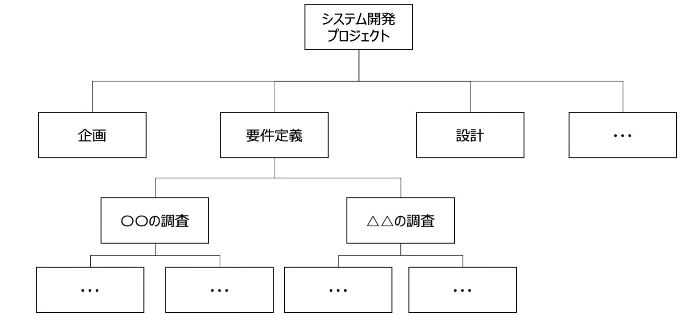
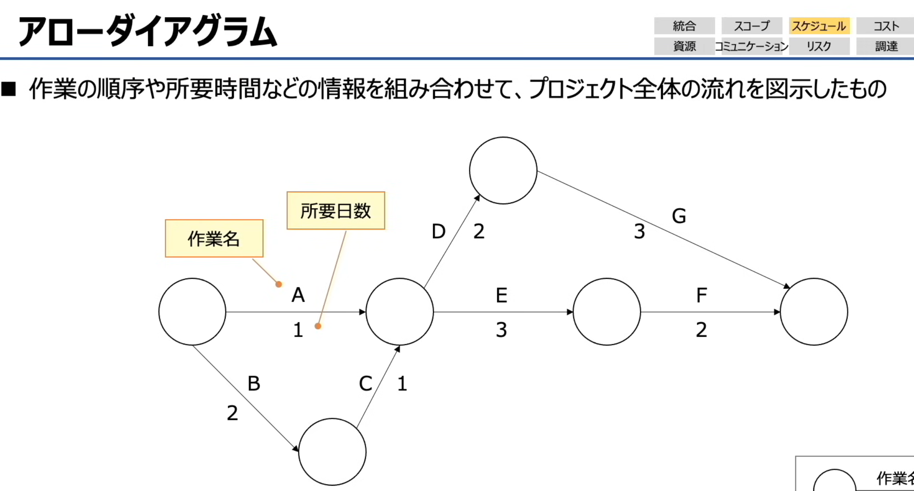
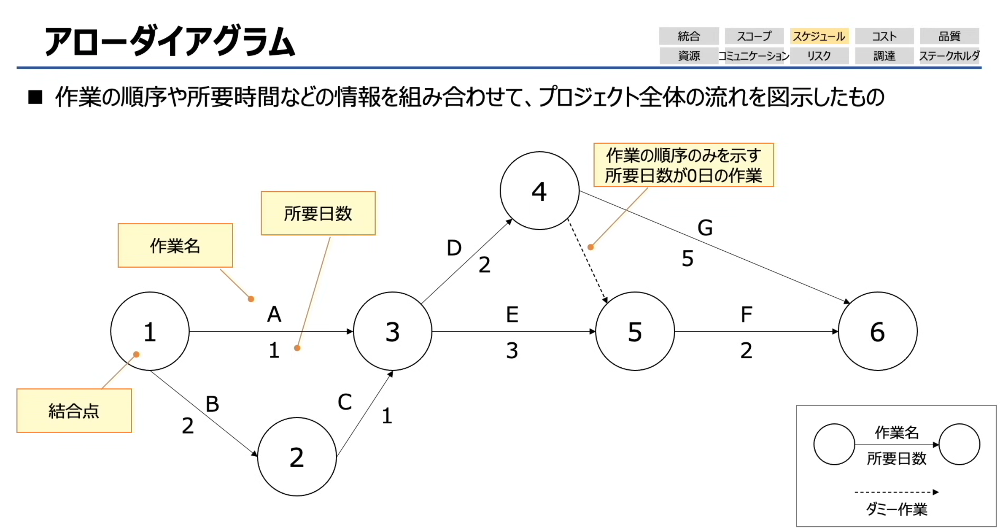
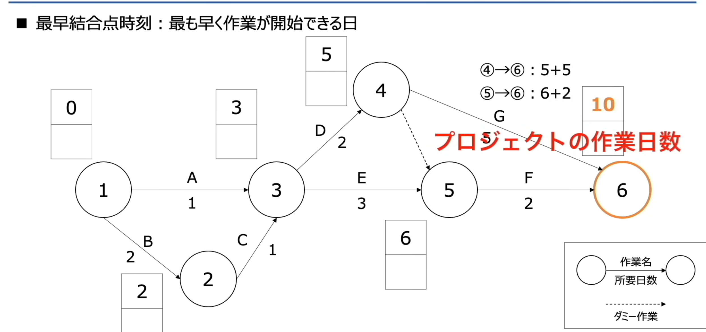
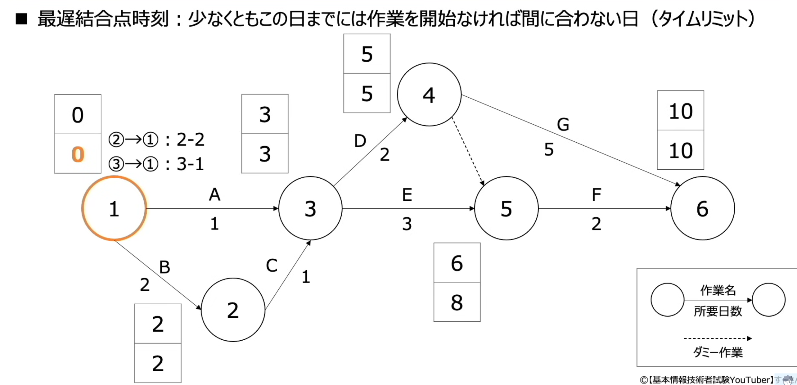
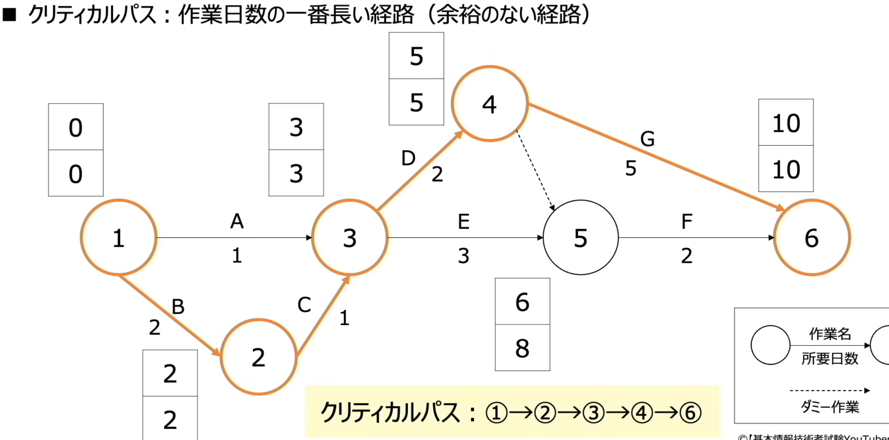

# マネジメント分野

# プロジェクトマネジメントとは

---

### 核心概念：フィージビリティスタディ（Feasibility Study）
**中文释义：可行性研究**

它的核心定义是：针对新项目等计划，为评估其实施可能性而开展的调查与验证工作。

---

### 流程拆解
1.  **フィージビリティスタディ（可行性研究阶段）**
    这是项目启动前的关键环节，主要调查验证的内容包括：
    - 市场调查（マーケット調査）
    - 业界动向（業界動向）
    - 投资效果（投資対効果）
    - 进度确认（スケジュールの確認）
    目的是提前评估项目的**实现可能性**和**预期收益**，判断项目是否值得推进。

2.  **プロジェクト計画（项目计划阶段）**
    完成可行性研究、确认项目可行后，进入正式的项目规划阶段，团队基于前期调查结果，制定具体的执行方案。

---

### 一句话总结
这张图展示了**项目启动前的核心流程：先通过「可行性研究」全面调查市场、收益、进度等要素，评估项目的可行性与潜在收益；确认可行后，再进入正式的「项目计划」阶段制定执行方案。**

#  🔤 PMBOK 是什么？
**全称**：Project Management Body Of Knowledge
**中文释义**：项目管理知识体系
它是一套**项目管理领域的国际标准**，把项目管理相关的知识做了系统化、结构化的整理。

---

### 📌 两大核心框架
#### 1. 5个项目管理流程（プロセス）
这是项目从启动到收尾的完整生命周期流程，同时融入了PDCA循环的管理逻辑：
- **立ち上げ（启动）**：项目的启动阶段，确认项目目标与可行性
- **計画（Plan/规划）**：制定详细的项目计划
- **実行（Do/执行）**：按计划推进项目执行
- **監視・コントロール（Check·Action/监控与控制）**：全程跟踪进度、对比计划、修正偏差（和计划、执行阶段形成PDCA循环）
- **終結（收尾）**：项目成果验收、复盘总结，正式结束项目

#### 2. 10个知识领域（知識エリア）
PMBOK把项目管理的专业知识分成了10个模块，覆盖了项目管理的所有关键维度：
- 統合管理（整合管理）
- スコープ管理（范围管理）
- スケジュール管理（进度/时间管理）
- コスト管理（成本管理）
- 品質管理（质量管理）
- 資源管理（资源管理）
- コミュニケーション管理（沟通管理）
- リスク管理（风险管理）
- 調達管理（采购管理）
- ステークホルダ管理（相关方/干系人管理）

---

### ✅ 一句话总结
这张图展示了PMBOK（项目管理知识体系）的核心框架：它作为项目管理的国际标准，定义了**从启动到收尾的5个项目流程**，并把项目管理的专业知识划分为**10个知识领域**，同时将PDCA循环融入其中，形成一套完整的项目管理方法论。

1.  **統合管理（とうごうかんり / Integration Management）**
    中文：整合管理
    他の 9 つの知識エリアを取りまとめて、全体をマネジメントする
    释义：统筹协调其他9个知识领域，对项目整体进行统一管理，确保各环节方向一致、目标统一。

2.  **スコープ管理（すこーぷかんり / Scope Management）**
    中文：范围管理
    プロジェクトの作業範囲を決め、成果物とタスクを定義する
    释义：确定项目的作业范围，明确交付成果与具体任务（图中也标注了“作业範囲＝スコープ”）。

### 🔤 WBS 是什么？
- **英文全称**：Work Breakdown Structure
- **日文名称**：作業分解構造図（さぎょうぶんかいこうずず）
- **中文释义**：工作分解结构

它的核心定义是：**将项目中需要执行的工作，按层级进行细化拆解的结构化工具**。

### 📌 图示解析（以系统开发项目为例）
图中展示了一个典型的WBS层级结构：
1.  **最顶层（Level 1）**：整个项目目标
    `システム開発プロジェクト`（系统开发项目）
2.  **第二层（Level 2）**：按项目阶段拆解
    `企画`（企划）、`要件定義`（需求定义）、`設計`（设计）等
3.  **第三层（Level 3）**：按具体任务进一步细化
    以`要件定義`为例，拆解为`○○の調査`（XX调查）、`△△の調査`（△△调查）
4.  **最底层（Level n）**：可直接执行的最小工作单元
    继续拆解到无法再细分的任务，确保每个工作项都清晰可落地

---

### ✅ 一句话总结
WBS（工作分解结构）是一种**将项目整体目标，层层拆解为可管理、可执行的细分任务的工具**，能帮团队清晰定义项目范围，避免遗漏工作、也能防止范围蔓延，是项目范围管理的核心方法之一。

3.  **スケジュール管理（すけじゅーるかんり / Schedule Management）**
    中文：进度/时间管理
    納期を守るために、作業スケジュールや日程を細かく管理する
    释义：为了保证按期交付，对作业进度、日程进行精细化管理。

    ### ガントチャート（Gantt Chart / 甘特图）
    - **日文原文**：ガントチャート
    - **中文翻译**：甘特图
    - **核心释义**：
    它是一种用于管理项目进度的日程表工具，能让你**一眼看清每个任务的进展状态，以及项目的整体计划**，是项目进度管理中最常用的可视化工具之一。

#  アローダイアグラム（Arrow Diagram）
- **日文原文**：アローダイアグラム
- **中文翻译**：箭线图（也叫网络图、ADM/关键路径法用图）
- **核心定义**：
  结合作业顺序、所需时间等信息，用图示方式展现整个项目流程的进度管理工具。

---

### 图示解析
图里的关键元素：
- **矢印（箭头）**：代表一项具体作业，标注了「作業名（作业名，如A、B、C…）」和「所要日数（所需天数，如1、2、3…）」
- **円（圆圈）**：代表作业的节点（里程碑），表示前序作业完成、后续作业可以开始的状态
- **作用**：通过这种结构，能清晰看出作业之间的前后依赖关系，还能用来计算项目的**关键路径**（决定项目最短工期的核心作业链）

---

### ✅ 一句话总结
箭线图是项目进度管理的核心工具之一，它用箭头和节点直观展现了项目中所有作业的先后顺序、依赖关系和所需时间，帮助团队识别关键路径、优化工期。

4.  **コスト管理（こすとかんり / Cost Management）**
    中文：成本管理
    プロジェクトにかかる費用を見積り、予算内におさめるよう管理する
    释义：对项目产生的相关费用进行管理，确保成本控制在预算内。

5.  **品質管理（ひんしつかんり / Quality Management）**
    中文：质量管理
    	プロジェクトの成果物の品質を管理する
    释义：对项目交付成果的质量进行管理，确保成果符合要求。

6.  **資源管理（しげんかんり / Resource Management）**
    中文：资源管理
    プロジェクトに必要な人材、物的資源を管理する
    释义：管理项目所需的人员、物资等各类资源，保障资源充足且合理分配。

7.  **コミュニケーション管理（こみゅにけーしょんかんり / Communications Management）**
    中文：沟通管理
    チームメンバー、ステークホルダーとの情報交換を管理する
    释义：管理与团队成员、项目干系人之间的信息交换流程，确保信息传递高效准确。

8.  **リスク管理（りすくかんり / Risk Management）**
    中文：风险管理
    プロジェクトで発生する可能性があるリスクを管理する
    释义：管理项目中可能发生的各类风险，提前识别、评估并制定应对方案。

9.  **調達管理（ちょうたつかんり / Procurement Management）**
    中文：采购管理
    プロジェクトに必要なサービスや製品の調達や契約を管理する
    释义：管理项目所需服务、产品的采购流程及相关合同事务。

10. **ステークホルダー管理（すてーくほるだーかんり / Stakeholder Management）**
    中文：干系人/相关方管理
    ステークホルダーとの関係を管理する
    释义：管理与项目干系人之间的关系，协调各方需求与期望。

    ステークホルダー Stakeholder 
    利益相关者（最常用）Stakeholder
意思是：和某件事情、某个项目、某家公司“有利害关系的人或组织”。

比如：
公司里的 员工（员工的利益会受公司影响）
客户（买产品的人）
股东（投资公司的人）
供应商
政府
合作伙伴

都可能是“stakeholder（利益相关者）”。

# コスト管理（Cost Management）

- **コスト管理（Cost Management）**
  中文：成本管理
  核心：项目成本管理，核心任务是通过合理的估算方法，控制项目预算。

- **ファンクションポイント法（Function Point 法）**
  中文：功能点法
  释义：以系统的画面数、单据数、文件数等为基准，定义功能的难易度，以此估算项目成本的方法。

- **類推見積法（类比估算法）**
  中文：类比估算法
  释义：参考过去类似项目的实际业绩数据，来估算当前项目成本的方法。

- **プログラムステップ法（Program Step 法 / LOC 法）**
  中文：代码行估算法（也叫LOC法，Lines of Code）
  释义：以程序的代码行数（步骤数）为基础，来估算项目成本的方法。

- **COCOMO法（COnstructive COst MOdel）**
  中文：构造性成本模型
  释义：以LOC法为基础，同时考虑开发人员技能、项目难易度等因素，进行成本估算的精细化方法。

#  ファンクションポイント法（功能点法）
**日文原文定义**：機能の数と各機能の難易度を基に開発コストを見積もる
**中文释义**：以系统的功能数量，以及每个功能的难易度为基础，估算开发成本的方法。

---

### 核心逻辑：用「功能点值」替代直接算钱
这张图展示了功能点法的标准流程：它不是直接算日元，而是先算出**总功能点值**，再用“点 × 单价”换算成成本。

1.  **给难易度分配点数**
    功能点法会先给不同难度的功能设定固定点数：
    - 簡単（简单）：10点
    - 普通（中等）：30点
    - 難しい（困难）：50点

2.  **计算每类功能的总点数**
    用「功能数量 × 对应难度的点数」算出每类功能的贡献点：
    - 機能1：1个 × 简单（10点）= 10点
    - 機能2：3个 × 简单（10点）= 30点
    - 機能3：2个 × 普通（30点）= 60点
    - 機能4：1个 × 困难（50点）= 50点

3.  **算出系统总功能点值**
    把所有功能的点数加起来：
    `10 + 30 + 60 + 50 = 150点`

4.  **换算成实际成本**
    最后再用「总点数 × 每点的成本单价」，就能得到项目的开发总成本。
    比如：如果1点=1万日元，那这个系统的估算成本就是150万日元。

---

### ✅ 一句话总结
功能点法的本质，是用**“功能数量 × 难易度点数”算出总功能点值**，再通过统一的“点单价”换算成成本。这样既考虑了功能数量，也体现了不同功能的开发难度，比单纯按功能数平均算钱更科学。

- **アローダイアグラム（Arrow Diagram）**
  中文：箭线图（也叫网络图、关键路径法用图）
  说明：一种进度管理工具，用来图示项目整体流程。

- **作業の順序や所要時間などの情報を組み合わせて、プロジェクト全体の流れを図示したもの**
  中文：结合作业顺序、所需时间等信息，将项目整体流程图示化的工具。

- **結合点**
  中文：节点/结合点
  说明：箭线图中的圆圈，表示作业的起点、终点或里程碑节点。

- **作業名**
  中文：作业名/任务名
  说明：箭线上标注的A、B、C等，代表具体的作业/任务。

- **所要日数**
  中文：所需天数/工期
  说明：箭线上标注的数字，代表完成该作业需要的时间。

- **作業の順序のみを示す所要日数が0日の作業**
  中文：仅表示作业顺序、所需天数为0天的作业
  说明：指的是「ダミー作業」，用来表达依赖关系但不消耗时间的虚拟作业。

- **ダミー作業（Dummy Activity）**
  中文：虚作业/虚拟作业
  说明：图中的虚线箭头，就是ダミー作業，只表达作业间的先后依赖关系，不占用任何时间。

  我帮你把这四个出题方向，结合之前的箭线图（アローダイアグラム），按「日文原文 + 中文翻译 + 结合图示的计算/说明」拆解清楚👇

### ① プロジェクト全体の作業日数（项目总工期）
- **中文翻译**：项目整体的作业天数（总工期）
- **结合图示计算**：
  我们需要找出所有从起点（节点1）到终点（节点6）的路径，计算各路径的总天数，最大值就是项目总工期。
  - 路径1：A → D → G：`1 + 2 + 5 = 8日`
  - 路径2：A → E → F：`1 + 3 + 2 = 6日`
  - 路径3：B → C → E → F：`2 + 1 + 3 + 2 = 8日`
  - 路径4：B → C → D → G：`2 + 1 + 2 + 5 = 10日`
  - 含虚作业的路径：`A→D→虚作业→F` 无效，虚作业不消耗时间，实际等价于其他路径。
  总工期为 **10日**（路径4）。

---

### ② クリティカルパス（Critical Path / 关键路径）
- **中文翻译**：关键路径
- **核心说明**：决定项目总工期的最长路径，路径上的任何作业延迟，都会直接导致项目整体延期。
- **结合图示**：
  上面算出的最长路径 `B → C → D → G`（总10日）就是关键路径。
  这条路径上的作业（B、C、D、G）都是关键作业，没有富余时间。

---

### ③ 最早結合点時刻（最早节点时刻）
- **中文翻译**：最早节点时间（ET）
- **核心说明**：指从项目开始到该节点，**最早可能完成的时间**，按“顺推法”计算。
- **结合图示计算**：
  - 节点1：0日（起点）
  - 节点2：`0 + B(2) = 2日`
  - 节点3：`max(0+A(1), 2+C(1)) = max(1,3) = 3日`
  - 节点4：`3 + D(2) = 5日`
  - 节点5：`max(3+E(3), 5+虚作业(0)) = max(6,5) = 6日`
  - 节点6：`max(5+G(5), 6+F(2)) = max(10,8) = 10日`

---

### ④ 最遅結合点時刻（最迟节点时刻）
- **中文翻译**：最迟节点时间（LT）
- **核心说明**：指在不影响项目总工期的前提下，该节点**最晚必须完成的时间**，按“逆推法”计算。
- **结合图示计算**：
  - 节点6：10日（终点，等于总工期）
  - 节点5：`10 - F(2) = 8日`
  - 节点4：`10 - G(5) = 5日`
  - 节点3：`min(5-D(2), 8-E(3)) = min(3,5) = 3日`
  - 节点2：`3 - C(1) = 2日`
  - 节点1：`min(3-A(1), 2-B(2)) = min(2,0) = 0日`

---

### ✅ 一句话总结
这四个考点是箭线图的核心计算逻辑：
1.  **总工期** = 关键路径的总时长
2.  **关键路径** = 决定工期的最长路径
3.  **最早节点时刻** = 顺推计算的最早完成时间 取 max
4.  **最迟节点时刻** = 逆推计算的最晚完成时间，和最早时刻的差就是作业的富余时间（浮时）  取min

### クリティカルパス（Critical Path / 关键路径）
- **日文定义原文**：作業日数の一番長い経路（余裕のない経路）
- **中文翻译**：作业天数最长的路径（没有富余时间的路径）
- **图示补充说明**：
  最早结合点时刻和最迟结合点时刻相等的作业所连成的路径，就是关键路径。关键路径上的任何作业延迟，都会直接导致整个项目延期。

---

### 图示解读（结合箭线图）
1.  **节点上的方框数字**
    上方数字 = 最早结合点时刻（最早完成时间）
    下方数字 = 最迟结合点时刻（最晚完成时间）
    两者相等的节点，就在关键路径上。

2.  **关键路径的判断**
    节点1（0/0）→ 节点2（2/2）→ 节点3（3/3）→ 节点4（5/5）→ 节点6（10/10）
    对应作业：B → C → D → G，总工期 `2+1+2+5=10日`
    这条路径上的所有节点，最早和最迟时刻都相等，没有任何富余时间，因此是关键路径。

3.  **关键路径的意义**
    关键路径决定了项目的最短总工期，路径上的作业没有任何浮动时间（余裕时间），一旦延误，整个项目就会延期。

---

### ✅ 一句话总结
关键路径是箭线图中**最长、且无任何富余时间的路径**，它决定了项目的总工期，路径上的节点「最早结合点时刻 = 最迟结合点时刻」，作业一旦延误就会直接影响整体进度。

# ITサービスマネジメント

### ITサービスマネジメント（IT服务管理，ITSM）

#### 1. 核心定义
- **日文原文**：利用者が必要とする「ITサービス」を継続的に提供またはサポートできるように管理すること
- **中文翻译**：为了能持续提供或支持用户所需的「IT服务」而进行的管理活动
- **本质**：以用户为中心，保障IT服务的稳定、可用，满足业务需求的一套管理方法。

#### 2. 图中角色与流程拆解
- **ITサービス利用者（IT服务使用者）**
  中文：IT服务用户/使用者
  说明：提出需求、使用IT服务的一方（比如企业员工、客户），核心诉求是服务稳定、好用、符合业务需求。

- **ITサービス（IT服务）**
  中文：IT服务本身
  说明：用户实际使用的服务载体，比如系统、应用、邮件、办公工具、网络服务等，是连接用户与提供者的核心。

- **ITサービス提供者（IT服务提供者）**
  中文：IT服务提供方/运维方
  说明：负责IT服务管理的团队/人员，通过IT服务管理（ITサービスマネジメント）活动，保障服务持续可用、响应需求、解决问题。

#### 3. 一句话总结
IT服务管理（ITSM）就是**服务提供方通过标准化流程，持续保障用户所需的IT服务稳定运行、满足业务需求的管理体系**，核心是让用户能安心、顺畅地使用IT服务。

### ITIL 知识点总结
---
#### 1. 基本定义
- **英文全称**：`Information Technology Infrastructure Library`
- **日文原文**：ITサービスマネジメントに関するベストプラクティス（成功事例 Best Practice）を体系的にまとめたもの（ITサービスマネジメントの世界標準）
- **中文翻译**：系统总结了IT服务管理领域最佳实践（成功案例）的框架，是IT服务管理的国际标准。
- **核心定位**：它不是强制的技术规范，而是一套被全球广泛认可的**IT服务管理方法论**，目的是让IT服务更稳定、高效，更好地支撑业务需求。

---
#### 2. 循环模型解读（图中5个阶段）
ITIL 以**持续服务改善（継続的サービス改善）**为核心，形成一个闭环管理流程：
1.  **サービスストラテジ（Service Strategy，服务战略）**
    中文：服务战略
    说明：确定IT服务的整体方向和目标，明确“要提供什么服务、为谁提供、如何创造价值”，是整个ITIL的顶层设计。

2.  **サービスデザイン（Service Design，服务设计）**
    中文：服务设计
    说明：根据战略目标，设计具体的IT服务方案，包括服务流程、技术架构、资源配置等，确保服务能满足需求且可落地。

3.  **サービストランジション（Service Transition，服务转换）**
    中文：服务转换/服务移交
    说明：将设计好的服务从开发环境平稳过渡到实际运行环境，包括测试、部署、变更管理等，降低上线风险。

4.  **サービスオペレーション（Service Operation，服务运营）**
    中文：服务运营
    说明：服务正式上线后的日常管理阶段，包括服务台、事件管理、问题管理、配置管理等，保障服务持续稳定运行。

5.  **継続的サービス改善（Continual Service Improvement，持续服务改进）**
    中文：持续服务改进
    说明：基于运营数据和用户反馈，持续优化服务流程、性能和质量，形成闭环迭代，让IT服务不断适配业务发展。

---
#### 3. 一句话总结
ITIL 是IT服务管理（ITSM）的国际标准框架，它通过**战略-设计-转换-运营-持续改进**的闭环流程，为企业提供了一套管理IT服务的最佳实践，核心目标是让IT服务稳定、高效地支撑业务价值实现。

##  ITサービス運用方法（IT服务运营方式）总结

## 核心定义
- **日文原文**：ITサービスマネジメントは、「日々のサービス運用」と「中長期的なサービス運用」がある
- **中文翻译**：IT服务管理分为「日常服务运营」和「中长期服务运营」两大维度

### 1. 日々のサービス運用（日常服务运营）
- **核心内容**：日常の問い合わせ対応（日常咨询/故障对应）
- **中文翻译**：日常服务运营
- **核心说明**：
  面向用户的一线运营工作，聚焦于**即时响应与问题解决**，比如：
  - 用户的咨询、故障报修（ヘルプデスク/服务台）
  - 突发系统故障的处理、恢复服务
  - 账号、权限、密码等日常业务支持
  目标是保障服务的“可用性”，让用户的日常使用不受影响。

### 2. 中長期的なサービス運用（中长期服务运营）
- **核心内容**：サービス全体の改善活動（整体服务改进活动）
- **中文翻译**：中长期服务运营
- **核心说明**：
  面向服务本身的优化工作，聚焦于**持续改进与价值提升**，比如：
  - 分析运营数据，优化系统性能、稳定性
  - 梳理服务流程，降低故障发生率
  - 制定中长期的IT服务优化计划，匹配业务发展需求
  目标是提升服务的“质量与效率”，让IT服务更好地支撑业务长期发展。

## 一句话总结
IT服务运营分为两部分：
- 日常运营负责**“当下”的服务稳定（响应问题、保障可用）**
- 中长期运营负责**“未来”的服务优化（持续改进、提升价值）**

### サービスデスク（Service Desk，服务台）知识点总结
---

#### 1. 核心定义
- **日文原文**：
  - ITサービス利用者とITサービス提供者の間の単一窓口
  - トラブル時の対処方法、使用方法、苦情など、さまざまな問い合わせを受付
- **中文翻译**：
  - IT服务使用者与IT服务提供者之间的**单一联系窗口**
  - 负责接收故障处理咨询、使用方法咨询、投诉等各类用户问询，是用户与IT团队沟通的唯一入口。
- **定位**：属于**日常服务运营（日々のサービス運用）**的核心流程，是用户遇到问题时的“第一响应点”。

---

#### 2. 3种服务台类型详解
##### ① 中央サービスデスク（Centralized Service Desk，集中式服务台）
- **日文说明**：サービスデスクを一か所に集中
- **中文翻译**：将服务台团队集中在一个地点运营
- **特点**：
  - 所有用户的问询都统一由中心团队处理
  - 优点：资源集中、效率高、易标准化管理、成本可控
  - 缺点：对跨地域用户的响应速度、本地化支持较弱

##### ② ローカルサービスデスク（Local Service Desk，本地化服务台）
- **日文说明**：利用者の近くにサービスデスクを配置
- **中文翻译**：在用户所在地附近配置服务台
- **特点**：
  - 贴近用户，可提供本地化、面对面的支持
  - 优点：响应速度快、沟通成本低、更了解当地用户需求
  - 缺点：团队分散、管理成本高、资源利用率低

##### ③ バーチャルサービスデスク（Virtual Service Desk，虚拟服务台）
- **日文说明**：各地にスタッフが分散していてもITツールで仮想的に一か所に集中
- **中文翻译**：员工分散在各地，但通过IT工具虚拟整合为一个服务台
- **特点**：
  - 借助远程协作系统（工单系统、电话系统），将分散的团队虚拟整合
  - 优点：兼顾集中管理与本地化支持，可跨时区/地域提供服务，资源调配灵活
  - 缺点：对IT工具依赖度高，团队沟通成本需额外管理

---

### 一句话总结
服务台是用户与IT团队的“单一窗口”，有集中式、本地化、虚拟式三种运营模式，核心目标是高效响应用户的问询与故障需求，保障日常IT服务的稳定可用。

### サービス運用プロセス（服务运营流程）知识点总结
这张图是ITIL框架下，**日常服务运营（日々のサービス運用）**的核心流程，我们按用户视角和流程顺序拆解：

---

#### 一、整体流程逻辑
用户的需求/故障，都会先通过**サービスデスク（服务台）**这个单一窗口进入，再根据类型分流处理：
1.  故障/异常类 → 走「インシデント管理」主线
2.  新功能/变更需求类 → 走「要求管理」支线

---

#### 二、故障处理主线（インシデント→問題→変更→リリース）
1.  **インシデント管理（Incident Management，事件管理）**
    - 接收用户报告的故障、异常、咨询（インシデント問合せ）
    - 目标：快速恢复服务，减少对用户的影响
    - 支持工具：`既知のエラーDB`（已知错误数据库），快速匹配已有解决方案

2. 問題管理（Problem Management，问题管理）
- **日文原文**：インシデントの根本原因を特定し、再発を防止する
- **中文翻译**：查明事件的根本原因，防止其再次发生
- **核心说明**：它的目标是“治本”，和只负责“快速恢复服务”的事件管理（治标）不同，问题管理会深挖故障的根源，从根本上解决问题，避免同类事件反复出现。

3. 変更管理（Change Management，变更管理）
- **日文原文**：ITサービスの変更が必要と判断された場合、変更に伴う影響を検証・評価し、承認または却下を行う
- **中文翻译**：当判断需要对IT服务进行变更时，验证、评估变更带来的影响，并决定批准或驳回该变更
- **核心说明**：它是变更的“守门人”，所有系统变更都必须走这个流程，目的是避免变更引发新故障。它会和「構成管理」联动，基于配置信息评估风险，确保变更安全可控。

4. 構成管理（Configuration Management，配置管理）
- **日文原文**：構成管理DBを使用し、ITサービスの提供に必要な情報を正しく把握し、効果的な情報を提供する
- **中文翻译**：使用配置管理数据库（構成管理DB），准确掌握提供IT服务所需的信息，并提供有效的数据支持
- **核心说明**：它会维护一份IT资产的“配置清单”，记录所有设备、系统、软件的状态信息，为变更、发布管理提供准确的数据，降低变更风险。

5. リリース管理（Release Management，发布管理）
- **日文原文**：変更管理で承認された変更内容を、適切な時期に本番環境に適用（リリース）する
- **中文翻译**：将变更管理中批准的变更内容，在合适的时机应用（发布）到生产环境
- **核心说明**：它负责变更的“落地执行”，把经过批准的变更方案打包、测试后，平稳部署到实际运行环境中，确保服务不中断、不出现意外。

### 补充：这几个流程的完整逻辑链
インシデント管理（治标）→ 問題管理（治本，找根源）→ 変更管理（评估变更风险）→ リリース管理（安全上线）
而**構成管理**会贯穿始终，为变更和发布提供数据支持，形成一个完整的闭环。

#### 三、需求处理支线（要求管理）
- **要求管理（Request Fulfillment，服务请求管理）**
  处理用户的非故障类请求，比如：
  - 账号开通/权限变更
  - 软件安装申请
  - 信息查询等常规服务需求
  目标：高效、标准化地响应用户的日常服务请求

---

### 一句话总结
日常服务运营的核心流程，就是以**服务台为入口**，通过「事件管理快速恢复服务、问题管理根除故障根源、变更/发布管理规范系统变更、配置管理提供数据支撑、需求管理处理常规请求」，形成一套闭环的IT服务保障体系。

### インシデント管理（Incident Management，事件管理）知识点总结
---

#### 1. 核心目标
- **日文原文**：
  可能な限り迅速に、正常なITサービスを復旧させることを優先
  利用者への悪影響を最小限に抑える
- **中文翻译**：
  优先目标是**尽可能快速恢复正常的IT服务**，将对用户的负面影响降到最低。
- **关键定位**：它属于**日常服务运营**的核心流程，核心是“快速恢复服务”，而非根除问题（根除问题是后续「問題管理」的职责）。

---

#### 2. 完整流程拆解
1.  **インシデント発生（事件发生）**
    用户报告系统故障、服务异常、报错等问题，事件流程启动。

2.  **記録（记录）**
    完整记录事件的时间、现象、用户信息、影响范围等关键信息，作为后续处理的基础。

3.  **優先度の割り当て・分類（优先级分配与分类）**
    根据事件的影响范围、严重程度，划分优先级（如紧急/高/中/低），并按类型分类，确保高影响事件优先处理。

4.  **調査と診断（调查与诊断）**
    排查事件原因，过程中会查询`既知のエラーDB`（已知错误数据库），匹配历史问题的解决方案，快速定位问题。

5.  **解決判断（解决？）**
    - **解决できた場合（解决成功）**：直接恢复服务，进入「インシデントクローズ（事件关闭）」，并记录解决方法、耗时等信息，更新知识库。
    - **解決できない場合（无法解决）**：启动「段階的取扱い（エスカレーション/升级处理）」，转交给更专业的团队处理，事件同时移交至「問題管理」流程，深挖根本原因。

---

#### 3. 关键补充说明
- 「インシデント管理」的核心是**“治标”**：优先恢复服务，减少用户影响；
- 后续的「問題管理」才是**“治本”**：深挖事件的根本原因，防止问题再次发生；
- 已知错误数据库（既知のエラーDB）是事件管理的重要工具，能大幅提升常见问题的处理效率。

### 中長期的なITサービス運用プロセス（中长期IT服务运营流程）总结
这张图展示了IT服务管理中，**中长期视角下的计划与改善流程**，包含三个核心管理领域：

---

#### 1. サービスレベル管理（Service Level Management，服务水平管理）
- **日文原文**：利用者の求めるサービスレベルを満たしているか評価・管理
- **中文翻译**：评估并管理IT服务是否满足用户要求的服务水平
- **核心机制**：采用**PDCA循环（計画Plan → 実行Do → 評価Check → 改善Action）**持续优化
- **目标**：确保服务质量符合约定的SLA（服务水平协议），并根据用户需求持续改进。

---

#### 2. 可用性管理（可用性管理）
- **日文原文**：サービスを利用したい時に確実に利用できるように、個々の機能を維持管理
- **中文翻译**：为了让用户在需要时能可靠使用服务，对各项功能进行维护和管理
- **核心目标**：保障服务的“可用性”，减少停机时间，确保用户随时能正常访问系统（如“使える？→使えるよ！”的场景）。

---

#### 3. キャパシティ管理（Capacity Management，容量/能力管理）
- **日文原文**：ITサービスの供給に必要なネットワークやシステムなどの容量・能力を管理
- **中文翻译**：管理提供IT服务所需的网络、系统等资源的容量与能力
- **核心工作**：监控系统的剩余容量（空き容量）、设备规格（スペック）等资源状态，预测未来需求，提前扩容或优化，避免资源不足导致服务性能下降。

---

### 一句话总结
这三个流程是IT服务的“中长期保障体系”：
- 服务水平管理确保服务质量达标并持续改进
- 可用性管理保障服务随时可用
- 容量管理确保系统资源能支撑业务发展需求

# SLA（Service Level Agreement，服务水平协议） 
---

#### 1. 基本定义
- **英文全称**：Service Level Agreement
- **日文原文**：サービス品質保証/合意書。ITサービスの提供者と利用者の間で、どの程度のサービス品質を保証するか決めたもの
- **中文翻译**：服务水平协议，是IT服务提供者与使用者之间，就服务质量标准达成的书面约定。

#### 2. 核心内容与示例
SLA会明确约定服务的各项关键指标，图中示例包含：
- サービス時間帯：服务可用时间（如午前9時-午後5時）
- 問い合わせ受付時間：用户咨询/故障报修的响应时间
- システム障害時の復旧時間：故障发生后的系统恢复时间
- 追加料金が発生する場合：额外服务或超出约定范围时的费用条款

#### 3. 定位与作用
- 它属于**中長期的なサービス運用（中长期服务运营）**的基础文件，是服务水平管理（サービスレベル管理）的核心依据。
- 作用：明确双方权责，让服务质量可量化、可评估，避免“服务好不好靠感觉”的问题，同时也是后续评估服务水平、制定改进计划的基准。

# システム監査

##  システム監査（系统审计）知识点总结

#### 1. 基本定义与主体
- **日文原文**：監査対象からは独立した立場（第三者の立場）となる、システム監査人が行う
- **中文翻译**：由**独立于被审计对象的第三方立场的系统审计人员**实施
- 核心特征：独立性是审计的灵魂，审计人员必须保持中立，不受被审计部门的影响。

---

#### 2. 核心目的与工作内容
- **日文原文**：情報システムを信頼性、安全性、効率性などの観点で評価し、問題点を指摘したり改善策を助言する
- **中文翻译**：从可靠性、安全性、效率性等角度评估信息系统，指出问题点并提出改进建议
- 一句话概括：以第三方视角，评估系统是否合规、安全、有效，并推动持续优化。

#### 3. 三大核心评价维度（附解释）
| 维度 | 日文原文说明 | 中文翻译 | 核心关注点 |
| :--- | :--- | :--- | :--- |
| **信頼性（可靠性）** | システムの品質は十分であるか、システム障害に対する予防策がとられているか | 系统质量是否充足、是否有针对故障的预防措施 | 系统的稳定性、容错能力、故障预防与恢复机制 |
| **安全性** | 災害や不正アクセスなどのシステムに悪影響を与える脅威から、保護されているか | 是否受到保护，免受灾害、非法访问等威胁的负面影响 | 数据安全、访问控制、防攻击、灾难恢复能力 |
| **効率性（效率性）** | 投資対効果の向上が図られているか | 是否实现了投资回报率的提升 | 系统资源利用率、成本效益、业务流程效率 |

#### 4. 一句话总结
系统审计是由独立第三方开展的评估活动，它从**可靠性、安全性、效率性**三个维度检查信息系统，发现问题并提出改进建议，保障系统合规、稳定、高效运行。

# 系统审计中「独立性」

### 核心主题：系统审计中「独立性」的重要性
独立性是系统审计的灵魂，分为「外観上の独立性（形式上的独立）」和「精神上の独立性（实质上的独立）」两部分：

#### 1. 外観上の独立性（形式上的独立）
- **日文原文**：監査対象と利害関係にないように、独立した部署・組織でなくてはならない
- **中文翻译**：审计主体必须与被审计对象不存在利害关系，在组织上是独立的部门或机构
- **具体做法/例子**：
  - 设立独立的内部审计部门，不隶属于被审计的业务或IT部门
  - 委托审计法人等第三方机构进行审计，从外部保证形式上的中立

#### 2. 精神上の独立性（实质上的独立）
- **日文原文**：監査の実施にあたり、客観的な視点から公正な判断を行わなければならない
- **中文翻译**：审计人员在执行审计时，必须保持客观中立的视角，不受外界影响，做出公正的判断
- **核心要求**：即使形式上独立，审计人员也不能因个人关系、利益压力等因素，影响审计结论的客观性

### 一句话总结
系统审计的独立性，既要求审计主体在**组织形式上与被审计对象分离**（形式独立），也要求审计人员在**判断过程中保持客观公正**（实质独立），两者缺一不可。

### システム監査の流れ（系统审计流程）
システム監査は、「監査計画の作成」「監査実施」「監査報告」「フォローアップ」の順に実施する。
**中文翻译**：系统审计按「制定审计计划」「实施审计」「审计报告」「后续跟进」的顺序执行。

#### ① 監査計画の作成（制定审计计划）
- **日文原文**：依頼人の意向や経営課題を調査して目的・対象を明らかにしたうえで計画を立案する
- **中文翻译**：调查委托人的意向与经营课题，明确审计目的与对象后，制定审计计划。
- **要点**：审计人根据经营者（監査依頼人）的委托，确定审计范围、目标和实施步骤，是整个审计的起点。

#### ② 監査実施（实施审计）
- **日文原文**：監査計画を基に予備調査・本調査を行い、入手した監査証拠に基づいて評価する
- **中文翻译**：以审计计划为基础，开展预备调查与正式调查，基于获取的审计证据进行评估。
- **要点**：审计人到被审计部门（監査対象部門）现场，收集证据、核实问题，是审计的核心执行环节。

#### ③ 監査報告（审计报告）
- **日文原文**：監査報告書をもとに、遅延なく監査依頼者に結果を報告する
- **中文翻译**：以审计报告书为依据，及时向审计委托人报告审计结果。
- **要点**：审计人向经营者提交正式报告，说明发现的问题、风险和初步建议。

#### ④ フォローアップ（后续跟进）
- **日文原文**：監査対象部門による改善の実施状況をモニタリングし、システム監査人の立場で改善の実現を支援する
- **中文翻译**：监控被审计部门的改善实施情况，以系统审计人的立场支持改善落地。
- **要点**：跟踪被审计部门的整改进度，确认问题是否解决，形成审计闭环。

### 補足：役割の違い（补充：角色分工）
- **改善活動をする主体は監査対象部門であり、改善指示・命令を行うのは監査依頼人**
  中文翻译：实施改善活动的主体是被审计部门，下达改善指示/命令的是审计委托人（经营者）。
- **システム監査人は、あくまで指導・助言のみ**
  中文翻译：系统审计人仅提供指导与建议，不直接下达命令或参与整改执行。

### 一句话总结
系统审计的完整流程是「定计划→现场查→写报告→跟整改」，其中**审计人只负责客观评估和提建议，整改命令由经营者下达，被审计部门负责具体执行**。

### コーポレートガバナンス と 内部統制
（公司治理与内部控制）

「コーポレートガバナンス」对应的英文是 Corporate Governance ✨
读音：kooporeeto gabanansu
中文常用翻译：公司治理 / 企业统治
含义：指企业的股东、董事会、管理层等相关方之间的权力制衡与监督机制，目的是防止经营者舞弊、保障股东利益，实现企业的健全经营。

#### 一、核心背景定义
- **日文原文**：企業が不祥事や法令違反などを起こさず、健全な経営を行うために作られたルール・仕組み
- **中文翻译**：为了让企业不发生丑闻、违法行为，实现健全经营而建立的规则与机制
- **补充**：上場会社においては、内部統制の整備・運用が義務付けられている
  中文：对于上市公司，法律强制要求建立并运行内部控制制度。

#### 二、コーポレートガバナンス（企业统治/公司治理）
- **日文原文**：経営者が不正を行わないように、株主や監査役が企業経営そのものを監督・監視する仕組み
- **中文翻译**：为了防止经营者舞弊，由股东、董事会/监事会对企业经营本身进行监督的机制
- **监督关系**：株主・取締役会など →（監視）→ 経営者
- **本质**：解决“所有者（股东）”和“经营者（管理层）”之间的委托代理问题，防止管理层损害股东利益。

#### 三、内部統制（内部控制）
- **日文原文**：従業員が不正を行わないように、経営者が企業内を管理する仕組み
- **中文翻译**：为了防止员工舞弊，由经营者在企业内部实施管理的机制
- **监督关系**：経営者 →（監視）→ 従業員
- **本质**：通过制度、流程、权限管理，规范员工行为，保障企业资产安全、财务真实、业务合规。

#### 一句话总结
- **コーポレートガバナンス**：股东/董事会**监督经营者**，防止管理层舞弊，是企业外部（顶层）的治理机制。
- **内部統制**：经营者**监督员工**，防止执行层舞弊，是企业内部（运营层）的管理机制。
两者共同构成了企业防止丑闻、实现健全经营的双重防线。

# 题目 

## 一、核心知识点：ミッションクリティカルシステム（Mission Critical System）
### 1. 术语基础
- **日文原文**：ミッションクリティカルシステム
- **读音**：misshon kuritikaru shisutemu
- **英文**：Mission Critical System
- **中文释义**：关键任务系统 / 使命关键系统

### 2. 核心定义
它指的是：**组织为实现企业战略，不可或缺的信息系统。一旦发生故障、停机，会对企业业务乃至社会运行造成重大、甚至致命影响的系统**。

### 3. 典型特征与常见例子
- **核心要求**：
  - 不允许停机（システムがダウンすることが許されない）
  - 高可用性（ハイアベイラビリティ）、高耐障害性
  - 很多需要24小时365天连续运行
- **常见例子**：
  - 银行/证券的核心交易系统
  - 电力、交通等社会基础设施系统
  - 大规模电商平台、在线服务系统
  - 航空管制、医疗监护系统

---
## 二、题目解析（H28春-FE 問55）
### 1. 题目原文与翻译
> 問題：ミッションクリティカルシステムの意味として、適切なものはどれか。
> 翻译：以下哪一项，是对“关键任务系统”的正确描述？

### 2. 选项逐一拆解（结合官方解析）
| 选项 | 日文原文 | 翻译 | 正误 & 解析 |
| :--- | :--- | :--- | :--- |
| ア | OSなどのように、業務システムを稼働させる上で必要不可欠なシステム | 像OS这类，运行业务系统时不可或缺的系统 | ❌ 错误。解析里明确说明：`ミッションクリティカル` 不是仅指OS，而是涵盖硬件、软件的整个信息系统的特征，且核心不是“支撑业务运行”，而是“故障会造成重大影响”。 |
| イ | システム運用条件が、性能の限界に近い状態の下で稼働するシステム | 在接近性能极限的条件下运行的系统 | ❌ 错误。解析指出：高可用性/耐障害性的系统，**应当避免**在性能极限附近运行，这不是关键任务系统的定义，反而是需要规避的风险状态。 |
| ウ | 障害が起きると、企業活動や社会に重大な影響を及ぼすシステム | 一旦发生故障，会对企业活动或社会造成重大影响的系统 | ✅ 正确。完全匹配关键任务系统的核心定义，官方解析也明确标注「（ウ）が適切である」。 |
| エ | 先行して試験導入され、成功すると本格的に導入されるシステム | 先试点试用，成功后再正式引入的系统 | ❌ 错误。解析说明：这类系统被称为「パイロットシステム（试点系统）」，和关键任务系统无关。 |

### 3. 最终结论
这道题的正确答案是 **C（ウ）**，考点就是对「关键任务系统」核心定义的理解，只要抓住“故障会造成重大影响”这个核心特征，就能快速排除干扰项。

---
💡 补充记忆技巧：
你可以把「ミッションクリティカル」拆开来记：
- `ミッション（mission）` = 使命/核心业务
- `クリティカル（critical）` = 关键的/致命的
合起来就是「对核心业务/使命至关重要，一旦出问题就会致命的系统」，和选项ウ的描述完全对应。

# 做题

### 题目大意（翻译+核心条件）
某新系统的功能规模估算为 **500FP（功能点）**。构建该项目除开发工时外，还需要系统导入和开发者教育的工时，合计为 **10人月**。此外，项目管理工时为「开发+导入/教育总工时」的 **10%**。
已知开发生产率为 **1人月 = 10FP**，求该项目所需的**全部工时（人月）**。

选项：ア 51、イ 60、ウ 65、エ 66

---

### 解题步骤拆解
1.  **① 开发工时计算**
    开发生产率：1人月 = 10FP
    开发工时 = 总功能点 ÷ 每人月生产率
    `500FP ÷ 10FP/人月 = 50人月`

2.  **② 导入与教育工时**
    题目直接给出：合计 **10人月**

3.  **③ 项目管理工时**
    题目要求：为「开发+导入/教育总工时」的10%
    总工时基数 = 50 + 10 = 60人月
    管理工时 = `60 × 10% = 6人月`

4.  **④ 项目全工时**
    全工时 = ① + ② + ③ = `50 + 10 + 6 = 66人月`

---

### ✅ 最终答案
**エ 66人月**

---

### 💡 关键考点总结
- 功能点（FP）→ 工时的换算：核心是用「总FP ÷ 每人月FP」算出开发工时
- 项目管理工时的计算：必须以「开发+导入/教育的合计工时」为基数，再乘以10%
- 不要漏加任何部分的工时，尤其是管理工时这类附加项

### 一、知识点总结：RACIチャート（RACI矩阵）
#### 1. 基本定义
- **RACIチャート（RACI Chart）**
  中文：RACI矩阵/责任分配矩阵
  作用：将项目任务的责任分担，分为以下4种责任类型，用于明确角色分工：
  - **R = Responsible（実行責任者）**：执行责任者，实际完成任务的人，每个任务**必须有1人以上**
  - **A = Accountable（説明責任者）**：说明责任者/最终负责人，对结果负最终责任，每个任务**只能有1人**
  - **C = Consulted（協業先）**：协作者/咨询对象，提供专业意见的相关方
  - **I = Informed（報告先）**：报告对象，仅需被告知结果的相关方

---

### 二、题目解析（R3春-AP 問52）
#### 1. 题目条件
1.  各アクティビティにおいて、実行責任者（R）は1人以上とする。
    中文：每个活动（任务）必须有1名以上的执行责任者（R）。
2.  各アクティビティにおいて、説明責任者（A）は1人とする。
    中文：每个活动（任务）只能有1名说明责任者（A）。

#### 2. 原表格问题点
先看原表格的每个任务：
| アクティビティ | 菊池 | 佐藤 | 鈴木 | 田中 | 山下 | 问题点 |
| --- | --- | --- | --- | --- | --- | --- |
| ① | R | C | A | C | C | ✅ R:1人, A:1人 |
| ② | R | R | I | A | C | ✅ R:2人, A:1人 |
| ③ | R | I | A | I | I | ✅ R:1人, A:1人 |
| ④ | R | A | C | A | I | ❌ **A:2人（佐藤+田中），违反“1人”条件** |

---

#### 3. 各选项分析
- **ア：アクティビティ①の菊池の責任をIに変更**
  中文：将活动①中菊池的责任改为I
  变更后，活动①的R变为0人，违反「R必须1人以上」的条件 → ❌错误

- **イ：アクティビティ②の佐藤の責任をAに変更**
  中文：将活动②中佐藤的责任改为A
  变更后，活动②的A变为2人（佐藤+田中），违反「A只能1人」的条件 → ❌错误

- **ウ：アクティビティ③の鈴木の責任をCに変更**
  中文：将活动③中铃木的责任改为C
  变更后，活动③的A变为0人，违反「A必须1人」的条件 → ❌错误

- **エ：アクティビティ④の田中の責任をRに変更**
  中文：将活动④中田中的责任改为R
  变更后：
  - A：仅佐藤1人（符合条件）
  - R：菊池+田中2人（≥1人，符合条件）
  → ✅正确，满足所有条件

---

### 三、最终结论
- 知识点：RACI矩阵的核心规则是「R≥1人、A=1人」，C和I无强制数量限制。
- 题目正确选项：**エ**（将活动④中田中的责任改为R）。

# PDM

### プレシデンスダイアグラム法（Precedence Diagramming Method, PDM）
- **中文翻译**：前导图法/紧前关系绘图法
- **核心定义**：项目进度管理中，用来图示作业间依赖关系的网络图方法，将作业的先后逻辑定义为4种基本关系。

#### 1. 開始-開始関係（Start-to-Start, SS）
- **中文翻译**：开始-开始关系
- **逻辑说明**：先行作业（前序任务）**开始**后，后续作业（后序任务）才能开始。
- **例子**：受付の開始から30分経過したら、試験を開始する（签到开始30分钟后，考试开始）。

#### 2. 終了-開始関係（Finish-to-Start, FS）
- **中文翻译**：结束-开始关系
- **逻辑说明**：先行作业**结束**后，后续作业才能开始。这是最常见的依赖关系。
- **例子**：受付の終了から10分経過したら、試験を開始する（签到结束10分钟后，考试开始）。

#### 3. 終了-終了関係（Finish-to-Finish, FF）
- **中文翻译**：结束-结束关系
- **逻辑说明**：先行作业**结束**后，后续作业才能结束。
- **例子**：受付の終了から45分経過したら、試験を終了する（签到结束45分钟后，考试结束）。

#### 4. 開始-終了関係（Start-to-Finish, SF）
- **中文翻译**：开始-结束关系
- **逻辑说明**：先行作业**开始**后，后续作业才能结束。
- **例子**：試験の開始から20分経過したら、受付を終了する（考试开始20分钟后，签到结束）。

「受付（うけつけ /uketsuke）」就是 “签到、受理、入场登记” 

### 一、知识点：品質管理における4つの分析図（质量管理中的4种分析图）
#### 1. パレート図（Pareto Chart，帕累托图）
- **日文原文**：数値の大きい要因を大きい順に並べた棒グラフと、累積を示す折れ線グラフを重ねた図
- **中文翻译**：将影响因素按数值从大到小排列的柱状图，与表示累积占比的折线图叠加而成的图表
- **核心作用**：基于「80/20法则」，找出导致问题的**少数关键原因**（通常前20%的原因，导致了80%以上的问题），帮助优先解决重点问题。

#### 2. 管理図（Control Chart，控制图）
- **日文原文**：時系列データのばらつきを折れ線グラフで表し、管理限界線で異常を判断する図
- **中文翻译**：用折线图表示时间序列数据的波动，通过上下管理界限线判断过程是否存在异常的图表
- **核心作用**：监控生产/业务过程的稳定性，判断数据是否在正常范围内波动（包括“7点法则”判断异常趋势）。

#### 3. 散布図（Scatter Diagram，散点图）
- **日文原文**：2つ以上の変数の相関関係を示す図
- **中文翻译**：表示两个或多个变量之间相关关系的图表
- **核心作用**：分析变量间是否存在线性相关（如温度与不良率的关系）。

#### 4. 特性要因図（Cause and Effect Diagram / Fishbone Diagram，鱼骨图）
- **日文原文**：原因と結果の関連を魚の骨のような形態でまとめた図（フィッシュボーン図）
- **中文翻译**：将原因与结果的关系整理成鱼骨形状的图表（也叫鱼骨图）
- **核心作用**：梳理问题的潜在原因，从人、机、料、法、环等维度分类，用于全面分析问题根源。

---

### 二、题目解析（H23春-FE 問54）
#### 题目原文
品質問題を解決するために図を作成して原因の傾向を分析したところ、全体の80%以上が少数の原因で占められていることが判明した。作成した図はどれか。

#### 题目翻译
为解决质量问题，制作图表分析原因倾向后发现，**80%以上的问题由少数原因导致**。请问制作的图表是哪一个？

#### 选项分析
- **ア：管理図（Control Chart）**
  管理图用于监控过程稳定性，无法直接体现“少数原因占80%问题”的分布，排除。

- **イ：散布図（Scatter Diagram）**
  散布图用于分析变量相关性，和问题原因的占比分析无关，排除。

- **ウ：特性要因図（Fishbone Diagram）**
  特性要因图用于梳理问题的潜在原因，但不直接量化各原因的占比，无法体现“80%问题由少数原因导致”，排除。

- **エ：パレート図（Pareto Chart）**
  帕累托图的核心就是分析各原因的影响占比，通过累积折线图直观呈现“少数关键原因导致大部分问题”，与题目描述完全一致，正确。

---

✅ **结论**：这道题的正确答案是 **エ（D）パレート図**。

#  プロジェクト管理手法（项目管理手法）

#### 1. WBS（Work Breakdown Structure）
- **日文原文**：プロジェクトマネジメントを行う際、必要となる作業を洗い出すために、トップダウン的なアプローチで、大枠から詳細なレベルまでの具体的な作業に分解しながら整理する手法
- **中文翻译**：项目管理中，为梳理所需作业，采用自上而下的方式，从整体框架逐层分解为具体任务的整理手法
- **核心说明**：
  作成する構成図をWBSという。WBSによって、必要な作業項目を網羅的に把握することが可能となり、工数・工期、作業範囲の明確化やプロジェクトの特性が把握しやすくなる。
  （中文：生成的结构图即WBS。通过WBS可全面掌握所有必要作业项目，便于明确工时/工期、作业范围，也更容易把握项目特性。）

#### 2. CPM（Critical Path Method）
- **日文原文**：作業の順序、依存関係を線でつないで表す手法。クリティカルパスを見つけた後は、そのクリティカルパス上の作業が最適化されるように計画する
- **中文翻译**：用线连接表示作业顺序、依赖关系的手法。找到关键路径后，围绕关键路径上的作业进行优化规划
- **核心说明**：用于确定项目的最短工期，识别关键路径上无富余时间的作业。

#### 3. EVM（Earned Value Management）
- **日文原文**：コストとスケジュールに関する管理だけでなく、品質などのパフォーマンスも組み入れて管理する手法
- **中文翻译**：不仅管理成本与进度，还纳入质量等绩效指标进行综合管理的手法
- **核心说明**：通过计算“挣值”，同时监控项目成本偏差与进度偏差，是项目绩效的综合评估方法。

#### 4. PERT（Program Evaluation and Review Technique）
- **日文原文**：作業の日程計画で用いられる手法。プロジェクトをなるべく早く完了させるためには、どの作業をいつ開始し、いつまでに完了させなければならないか、作業日数に余裕がないところ（クリティカルパスという）はどこかなどを把握することができる
- **中文翻译**：用于作业日程计划的手法。为尽早完成项目，可明确各作业的开始/结束时间，识别无富余时间的关键路径
- **核心说明**：通常结合概率估算工期，常用于不确定性较高的项目，核心目标与CPM类似，都聚焦于关键路径与工期优化。

日文：とどまる
汉字：止まる
中文意思：停留在、仅限于、止步于

# 题目

プロジェクトマネジメントのプロセスのうち，計画プロセスグループ内で実施するプロセスはどれか。

(H28秋-FE 問51)

ア　スコープの定義

イ　ステークホルダの特定

ウ　品質保証の実施

エ　プロジェクト憲章の作成

这道题选 **ア（A）** ✅

---

### 知识点：プロジェクト管理のプロセスグループ
项目管理分为5个过程组：
1.  **立ち上げ（Initiating）**：项目启动阶段
2.  **計画（Planning）**：计划制定阶段
3.  **実行（Executing）**：项目执行阶段
4.  **監視・制御（Monitoring & Controlling）**：监控与控制阶段
5.  **終結（Closing）**：项目收尾阶段

---

### 选项分析
- **ア：スコープの定義（定义范围）**
  这是典型的**计划过程组**的活动。项目范围的细化与定义，是在规划阶段完成的核心工作。✅正确

- **イ：ステークホルダの特定（识别相关方）**
  属于**立ち上げ（启动过程组）**的活动，项目早期就需要识别相关方。❌排除

- **ウ：品質保証の実施（实施质量保证）**
  属于**実行（执行过程组）**的活动，是项目执行阶段为确保质量而开展的工作。❌排除

- **エ：プロジェクト憲章の作成（制定项目章程）**
  属于**立ち上げ（启动过程组）**的活动，是项目正式启动时的关键文件。❌排除

---

✅ 结论：正确选项是 **ア（A）**。

这道题选 **ア** ✅，我们来拆解一下。

---

### 知识点背景：ウォーターフォール型（瀑布式开发）的错误修复成本
瀑布开发的特点是阶段线性推进，错误发现得越晚，修复成本越高，而且错误影响的范围越广，成本也越高。
- 需求/设计阶段的错误，如果到后期才发现，不仅要改代码，还要改设计文档、用户手册、测试用例，甚至重新规划流程，成本会呈指数级上升。
- 编码阶段的错误，通常只需要修改代码和相关单元测试，成本相对可控。

---

### 选项逐一分析
1.  **ア：外部設計の誤りは、プログラムだけでなく、マニュアルなどにも影響を与えるので、コーディングの誤りに比べて修復コストは高い。**
    中文：外部设计的错误，不仅会影响程序，还会影响用户手册等文档，因此修复成本比编码错误更高。
    ✅ 正确。外部设计阶段的错误，到运维测试阶段才发现，需要修改代码、设计文档、用户手册、测试用例等，影响范围广，修复成本远高于编码阶段的错误。

2.  **イ：コーディングの誤りは、修復のための作業範囲がその後の全工程に及ぶので、要求定義の誤りに比べて修復コストは高い。**
    中文：编码错误的修复工作会影响后续所有阶段，因此修复成本比需求定义错误更高。
    ❌ 错误。需求定义是最早期的阶段，需求错误的影响范围是**所有后续阶段**，修复成本远高于编码错误。

3.  **ウ：テストケースの誤りは、テストケースの修正とテストのやり直しだけでは済まないので、外部設計の誤りに比べて修復コストは高い。**
    中文：测试用例的错误，不只是修改用例和重测就能解决，因此修复成本比外部设计错误更高。
    ❌ 错误。测试用例错误通常只需要修改用例和重新测试，影响范围远小于外部设计错误，修复成本更低。

4.  **エ：内部設計の誤りは、設計レビューによってほとんど除去できるので、もし発見されても、コーディングの誤りに比べて修復コストは安い。**
    中文：内部设计错误几乎可以通过设计评审消除，即使发现了，修复成本也比编码错误低。
    ❌ 错误。如果内部设计错误到运维阶段才发现，需要修改设计、代码、测试等，修复成本远高于编码阶段的错误。

---

✅ 结论：这道题的正确选项是 **ア**。

# 题目

### 一、先翻译题目
**問58 システム運用業務のオペレーション管理に関する監査で判明した状況のうち、指摘事項として監査報告書に記載すべきものはどれか。**

**中文翻译**：
在针对系统运维业务的「操作管理」审计中发现的以下情况里，**哪一项是必须作为问题点写进审计报告的？**

---

### 二、考点背景
这道题的核心是**系统运维操作管理的内部控制原则**：
关键要求是「**权限分离/职责分离**」——也就是：
- 「计划/批准」和「执行」不能由同一个人包办。
- 操作的审批、执行、记录、复核，必须由不同角色分工完成，防止舞弊和错误。

---

### 三、选项逐一解析

#### ア
**原文**：運用責任者が、オペレータの作成したオペレーション記録を確認している。
**翻译**：运维负责人在确认操作员制作的操作记录。
**解析**：这是正确的流程。负责人复核操作员的记录，是内控中「事后监督」的重要环节，不属于问题点。✅ 不选。

#### イ
**原文**：運用責任者が、期間を定めてオペレーション記録を保管している。
**翻译**：运维负责人按规定期限保管操作记录。
**解析**：操作记录的定期保管是运维管理的基本要求，是合规行为，不属于问题点。✅ 不选。

#### ウ
**原文**：オペレータが、オペレーション中に起きた例外処理を記録している。
**翻译**：操作员记录了操作中发生的异常处理。
**解析**：操作中发生的异常（如报错、中断、特殊处理）必须记录，是运维管理的基本要求，不属于问题点。✅ 不选。

#### エ（正确选项）
**原文**：オペレータが、日次の運用計画を決定し、自ら承認している。
**翻译**：操作员自己决定了每日的运维计划，并且自己批准了这个计划。
**解析**：这是典型的**职责分离违反**：
- 「决定计划」和「批准计划」本应由不同角色（如：运维负责人批准，操作员执行）完成。
- 现在操作员既制定又批准，等于“自己给自己开绿灯”，存在很大的舞弊和操作风险，必须作为问题点写入审计报告。❌ 选这个。

---

### 结论
正确答案是 **エ**。
考点就是「**计划/批准与执行的职责必须分离**」，操作员不能同时兼任计划的制定者和批准者。

我来帮你先把知识点讲透，再一步步分析这道题，你就完全懂了👇

---

## 一、核心知识点：IT服务管理中的「問題管理」

### 1. 問題管理（Problem Management）的定义
**日文原文**：ITインフラストラクチャにおけるエラーによって引き起こされるインシデントの根本原因を特定することで、業務への悪影響を最小限に抑えるとともに、潜在的な問題を取り除くことでインシデントの再発を防止すること。
**中文翻译**：问题管理，是指查明IT基础设施错误引发事件的根本原因，将对业务的负面影响降到最低；同时消除潜在问题，防止事件再次发生的流程。

它和「インシデント管理（事件管理）」的核心区别：
- インシデント管理：**治标**，目标是快速恢复服务，减少用户影响。
- 問題管理：**治本**，目标是找到故障根源，从根本上防止问题复发。

---

### 2. 問題管理的两大类型
题目里的“事前予防的活動”，关键就在于区分这两类：

| 类型 | 日文 | 中文 | 核心特征 |
| :--- | :--- | :--- | :--- |
| リアクティブな問題管理 | Reactive Problem Management | 被动式问题管理 | 对**已经发生的事件**进行事后处理，比如分类、评估、监控复发。 |
| プロアクティブな問題管理 | Proactive Problem Management | 主动式/事前预防性问题管理 | 对**未来可能发生的事件**进行事前预防，比如分析趋势、提前制定对策。 |

---

## 二、题目分析

### 题目翻译
**ITサービスマネジメントにおける問題管理で実施する活動のうち、事前予防的な活動はどれか。**
中文：在IT服务管理的问题管理活动中，**属于事前预防性活动**的是哪一项？

核心考点：区分「プロアクティブ（事前预防）」和「リアクティブ（事后处理）」的问题管理。

---

### 选项逐一分析

#### ア（A，正确答案）
**原文**：インシデントの発生傾向を分析して、将来のインシデントを予防する方策を提案する。
**翻译**：分析事件的发生趋势，提出预防未来事件发生的对策。
**解析**：
这是典型的**プロアクティブな問題管理（主动式/事前预防）**。
它不是处理已经发生的问题，而是通过分析历史数据，预判未来可能出现的故障，并提前制定对策，完全符合题目“事前予防的活動”的要求。✅

#### イ（B）
**原文**：検出して記録した問題を分類して、対応の優先度を設定する。
**翻译**：对发现并记录的问题进行分类，设定处理优先级。
**解析**：
这是对**已经发生的问题**进行处理的环节，属于**リアクティブな問題管理（被动式）**，不是事前预防。❌

#### ウ（C）
**原文**：重大な問題に対する解決策の有効性を評価する。
**翻译**：评估重大问题解决方案的有效性。
**解析**：
这是问题解决后的验证环节，目的是确认对策是否有效，属于**リアクティブな問題管理（被动式）**，不是事前预防。❌

#### エ（D）
**原文**：問題解決後の一定期間、インシデントの再発の有無を監視する。
**翻译**：问题解决后的一定期间内，监控事件是否再次发生。
**解析**：
这是问题解决后的跟进监控，属于**リアクティブな問題管理（被动式）**，不是事前预防。❌

---

## 三、结论
这道题的正确答案是 **A（ア）**。
记住一个简单的判断标准：
- 只要活动的目的是**针对未来，防止故障发生**，就是「プロアクティブ（事前预防）」。
- 只要是**针对已经发生的问题进行处理、评估、监控**，就是「リアクティブ（事后处理）」。

# 题目

## 一、核心知识点：システム監査の4つの評価観点
这道题的考点，就是系统审计中常见的四个评价维度，我们按「日文原文+中文翻译+核心含义」整理：

1.  **可用性（可用性 / Availability）**
    - 日文原文：システムを使用したいときに使用できる尺度を表す指標である。障害への対策を行い、稼働率が高いシステムは可用性が高いといえる。
    - 中文翻译：指“想要使用系统时，就能正常使用”的指标。采取故障应对措施、运行率高的系统，就可以说可用性高。
    - 核心：**随时能访问、不中断**。

2.  **効率性（效率性 / Efficiency）**
    - 日文原文：データを複数件まとめて検索・加工する機能など、システムが処理を効率よく行えるかどうかの尺度。
    - 中文翻译：指系统能否高效处理数据的指标，比如批量检索、加工功能。
    - 核心：**处理速度快、资源利用率高**。

3.  **機密性（机密性 / Confidentiality）**
    - 日文原文：特権アカウントがある者だけにメンテナンスが許されるなど、データが許可された者以外に漏れないように保護されているかの尺度。
    - 中文翻译：指数据仅对授权人员开放、不被泄露的指标，比如特权账户的维护权限控制。
    - 核心：**数据不泄露、访问权限严格**。

4.  **完全性（完整性 / Integrity）**
    - 日文原文：データ入力チェック機能が盛り込まれているなど、データが正確かつ未改ざんのまま保持されているかの尺度。
    - 中文翻译：指数据保持准确、未被篡改的指标，比如数据输入校验功能。
    - 核心：**数据准确、不被篡改**。

## 二、题目分析
### 题目翻译
**マスタファイル管理に関するシステム監査項目のうち、可用性に該当するものはどれか。**
→ 中文：在主文件管理相关的系统审计项目中，属于「可用性」范畴的是哪一项？

---

### 选项逐一解析
#### ア（A，正确答案）
- 原文：マスタファイルが置かれているサーバを二重化し、耐障害性の向上を図っていること
- 翻译：存放主文件的服务器采用冗余配置（二重化），以提高故障容错能力。
- 解析：✅ 这正是为了提升**可用性**的措施。服务器冗余配置，就是为了防止单点故障导致主文件无法访问，确保随时可用。

#### イ（B）
- 原文：マスタファイルのデータを複数件まとめて検索・加工するための機能が、システムに盛り込まれていること
- 翻译：系统内置了批量检索、加工主文件数据的功能。
- 解析：❌ 这属于**効率性**的范畴，和可用性无关。

#### ウ（C）
- 原文：マスタファイルのメンテナンスは、特権アカウントを付与された者だけに許されていること
- 翻译：主文件的维护仅允许被授予特权账户的人员操作。
- 解析：❌ 这属于**機密性**的范畴，和可用性无关。

#### エ（D）
- 原文：マスタファイルへのデータ入力チェック機能が、システムに盛り込まれていること
- 翻译：系统内置了主文件的数据输入校验功能。
- 解析：❌ 这属于**完全性**的范畴，和可用性无关。

---

## 三、结论
这道题的正确答案是 **A（ア）**。

判断这类题的关键，就是把每个选项和四个维度的核心特征对应起来：
- 服务器冗余、故障容错 → 可用性
- 批量处理、高效操作 → 效率性
- 权限控制、数据不泄露 → 机密性
- 输入校验、数据准确 → 完整性

##  システム開発の外部委託  外包系统开发的审计管理
### 1. 核心概念
在日本IT系统审计（システム監査）中，**系统开发外部委托（システム開発の外部委託）** 的管理分为多个关键维度，每个维度对应不同的审计证据：

| 管理维度 | 核心目标 | 审计时需提交的典型资料 |
| :--- | :--- | :--- |
| **進捗管理（进度管理）** | 确认外包项目按计划推进，无重大延误 | 外包方定期业务报告 + 委托方的验证/确认记录 |
| 成果物検収管理（成果验收管理） | 确认交付成果物符合合同与质量要求 | 明确验收标准、流程的资料 |
| 情報資産管理（信息资产管理） | 确认代码、数据等资产的保管与安全 | 软件/数据第三方托管（預託）证明资料 |
| セキュリティ管理（安全管理） | 确认数据、资料的回收与销毁流程合规 | 数据回收与废弃方法的明确资料 |

这道题的考点，就是区分「进度管理」和其他外包管理维度的审计证据。

---
## 二、题目解析（含日文原文+中文翻译）
### 1. 题目原文与翻译
**日文原文**：
> システム開発を外部委託している部門が、委託先に対する進捗管理についてシステム監査を受ける場合、提出すべき資料はどれか。
> (H24春-FE 問59)

**中文翻译**：
> 将系统开发外包给外部供应商的部门，在接受针对「外包方进度管理」的系统审计时，应提交哪份资料？

---
### 2. 选项逐一解析（日文+中文+正误判断）
#### ア
- **日文原文**：委託先から定期的に受領している業務報告及びその検証結果を示している資料
- **中文翻译**：显示从外包方定期接收的业务报告，以及对报告进行验证结果的资料
- **解析**：✅ 正确。
  进度管理的核心，是委托方持续跟踪、验证外包方的项目进展。定期业务报告是外包方的进度记录，验证结果则证明委托方对进度进行了有效的监督管理，这是进度管理审计的直接证据。

#### イ
- **日文原文**：成果物の検収方法を明確にしている資料
- **中文翻译**：明确成果物验收方法的资料
- **解析**：❌ 错误。
  这是**成果物验收管理**的审计资料，用于证明交付成果的质量与验收流程合规，和「进度管理」无关。

#### ウ
- **日文原文**：ソフトウェアの第三者への預託を行っていることを示している資料
- **中文翻译**：证明软件已委托第三方保管的资料
- **解析**：❌ 错误。
  这是**信息资产管理**的审计资料，用于证明软件资产的安全托管，和「进度管理」无关。

#### エ
- **日文原文**：データや資料などの回収と廃棄の方法を明確にしている資料
- **中文翻译**：明确数据、资料回收与废弃方法的资料
- **解析**：❌ 错误。
  这是**安全管理/数据生命周期管理**的审计资料，用于证明数据处理流程合规，和「进度管理」无关。

---
### 3. 官方解析补充（日文+中文）
**日文原文**：
> システム開発を外部委託している部門が、委託先に対する進捗管理についてシステム監査を受けるということは、委託元が、委託先の進捗を正しく把握しているかどうかを、第三者が確認するということである。作業を委託する場合、委託元には委託先に対する監督義務が発生する。よって、委託元は進捗を管理するために、委託先に定期的な業務報告をさせているはずである。そして、この報告に対し、報告を受けたままにせず、内容が妥当であるかどうかを検証しているはずである。これらを確認するのに必要な資料は、委託先から定期的に受領している業務報告及びその検証結果を示している資料である。したがって、（ア）が正解である。

**中文翻译**：
> 将系统开发外包的部门，接受针对外包方进度管理的系统审计，本质是第三方确认「委托方是否正确掌握了外包方的项目进度」。委托业务时，委托方对被委托方负有监督义务。因此，委托方为了管理进度，应当要求外包方定期提交业务报告；并且，不应仅接收报告，还需验证报告内容的合理性。用于确认以上事项的必要资料，就是「从外包方定期接收的业务报告，以及对报告的验证结果资料」。因此，（ア）为正确答案。

---
## 三、结论
这道题的正确答案是 **A（ア）**，核心考点是区分外包项目不同管理维度对应的审计证据，只要抓住题目中的关键词「進捗管理（进度管理）」，就能快速定位正确选项。

---
💡 小技巧：FE考试中遇到这类审计题目，先圈出题目里的核心关键词（比如「進捗管理」「セキュリティ」「検収」），再找选项中直接对应的资料，就能快速排除干扰项。

# TCO Total Cost of Ownership  総所有コスト  总拥有成本
総所有コスト そうしょゆうコスト

## 一、先搞懂核心概念：TCO
**TCO（Total Cost of Ownership）**，日语里叫「総所有コスト」，中文是**总拥有成本**。
它指的是：从系统的**开发、导入、使用到维护的整个生命周期里，所有相关费用的总和**，不是只算一次性的建设费，还要算后续每年的运营成本。

---
## 二、题目翻译
> 新システムの開発を計画している。このシステムのTCOは何千円か。ここで、このシステムは開発された後、3年間使用されるものとする。
> (H25春-AP 問57)

翻译：我们正在计划开发一个新系统。这个系统的TCO（总拥有成本）是多少千日元？已知系统开发完成后，将使用3年。

---
## 三、费用项目拆解（单位：千円）
| 日文项目 | 中文翻译 | 费用 | 性质 |
| :--- | :--- | :--- | :--- |
| ハードウェア導入費用 | 硬件导入费用 | 40,000 | 一次性费用 |
| システム開発費用 | 系统开发费用 | 50,000 | 一次性费用 |
| 導入教育費用 | 导入教育费用 | 5,000 | 一次性费用 |
| ネットワーク通信費用／年 | 网络通信费用/年 | 1,500 | 每年费用 |
| システム保守費用／年 | 系统维护费用/年 | 7,000 | 每年费用 |
| システム運営費用／年 | 系统运营费用/年 | 5,000 | 每年费用 |

---
## 四、计算步骤
### 1. 一次性费用总和
一次性费用 = 硬件导入 + 系统开发 + 导入教育
= 40,000 + 50,000 + 5,000
= 95,000 千円

### 2. 3年的年度费用总和
每年的年度费用 = 网络通信 + 系统维护 + 系统运营
= 1,500 + 7,000 + 5,000
= 13,500 千円/年

3年的年度费用 = 13,500 × 3 = 40,500 千円

### 3. TCO 总费用
TCO = 一次性费用 + 3年年度费用
= 95,000 + 40,500
= **135,500 千円**

---
## 五、选项判断
- ア 40,500：只算了3年的年度费用，漏掉了一次性费用
- イ 90,000：计算错误
- ウ 95,000：只算了一次性费用，漏掉了3年的年度费用
- エ 135,500：✅ 正确，和我们计算的结果一致

---
💡 小技巧：TCO的计算关键就是分清「一次性成本」和「 recurring cost（ recurring cost，日语叫「ランニングコスト」，运行成本）」，然后把运行成本按使用年限算清楚，再和一次性成本相加就可以了。

# 题目

## 一、先翻译题目
**日文原文**：
> システム監査人が行う改善提案のフォローアップとして、適切なものはどれか。
> (R3春-AP 問60)

**中文翻译**：
> 作为系统审计人员，对自己提出的「改善提案」进行后续跟踪（フォローアップ）时，以下哪一项是恰当的做法？

**核心考点**：系统审计师的角色边界——审计师的职责是**独立监督与评估**，不能直接参与被审计部门的管理、执行或决策工作。

---
## 二、选项逐一解析（日文+中文+正误判断）
### ア
- **日文原文**：改善提案に対する改善の実施を監査対象部門の長に指示する。
- **中文翻译**：向被审计部门的负责人下达“必须实施改善提案”的指令。
- **分析**：❌ 错误。
  审计师没有权限对被审计部门下达业务指令，这属于越权干预管理。审计师的职责是“指出问题”，而不是“命令对方怎么做”。

### イ
- **日文原文**：改善提案に対する監査対象部門の改善実施プロジェクトの管理を行う。
- **中文翻译**：直接管理被审计部门的改善实施项目。
- **分析**：❌ 错误。
  审计师不能直接参与项目管理，否则会丧失审计的独立性。改善项目的管理责任属于被审计部门自身。

### ウ
- **日文原文**：改善提案に対する監査対象部門の改善状況をモニタリングする。
- **中文翻译**：对被审计部门针对改善提案的改进状况进行监控（モニタリング）。
- **分析**：✅ 正确。
  这是审计师「フォローアップ（后续跟踪）」的核心职责：确认被审计部门是否按照提案推进改善，验证改善效果是否到位，全程不直接参与执行。

### エ
- **日文原文**：改善提案の内容を監査対象部門に示した上で改善実施計画を策定する。
- **中文翻译**：向被审计部门说明改善提案内容后，直接制定改善实施计划。
- **分析**：❌ 错误。
  改善实施计划的制定是被审计部门的责任，审计师越俎代庖制定计划，会影响审计的客观性与独立性。

---
## 三、结论与核心原则
这道题的正确答案是 **ウ**。
它考察的是系统审计的核心原则——**独立性**：
- 审计师只能做「评估、指出问题、跟踪改善情况」这类监督性工作
- 不能做「下达指令、管理项目、制定执行计划」这类管理/执行性工作

---
💡 补充小知识：
日语里的「フォローアップ（follow-up）」在审计场景中，特指审计结束后，对被审计方的改善措施进行后续跟踪、验证效果的过程，和中文里的“跟进”是一个意思。

我们先拆解题目，再逐一分析选项，最后给出结论。

---
## 一、题目翻译与核心问题
**日文原文**：
> 外部保管のために専門業者に機密情報を含むバックアップ媒体を引き渡す際の安全性について、情報セキュリティ監査を実施した。その結果として判明した状況のうち、監査人が指摘事項として監査報告書に記載すべきものはどれか。
> (H30秋-FE 問59)

**中文翻译**：
> 针对「向专业外包服务商交付包含机密信息的备份介质（用于外部保管）」的安全性，实施了信息安全审计。在审计发现的以下情况中，哪一项是审计人员应当作为**问题点（指摘事項）**写进审计报告的？

核心考点：判断哪种做法存在安全隐患，属于需要被指出的问题。

---
## 二、选项逐一解析（日文+中文+正误判断）
### ア
- **日文原文**：委託元責任者が、一定期間ごとに、専門業者における媒体保管状況を確認する契約を結んだ上で引き渡している。
- **中文翻译**：委托方负责人，在签订了「定期确认服务商的介质保管状况」的合同后，再交付介质。
- **分析**：✅ 合规做法，不是问题点。定期确认保管状况是外包保管的必要管控措施，能降低风险，审计不会指摘这种做法。

### イ
- **日文原文**：委託元責任者が、専門業者との間で、機密保持条項を盛り込んだ業務委託契約を結んだ上で引き渡している。
- **中文翻译**：委托方负责人，在和服务商签订了包含保密条款的业务委托合同后，再交付介质。
- **分析**：✅ 合规做法，不是问题点。包含保密条款的合同是法律层面保护机密信息的基础，审计不会指摘这种做法。

### ウ
- **日文原文**：委託元担当者が、専用の記録簿に、引渡しの都度、日付と内容を記入し、専門業者から受領印をもらっている。
- **中文翻译**：委托方经办人，每次交付都在专用台账上记录日期和内容，并让服务商加盖收件章。
- **分析**：✅ 合规做法，不是问题点。交付时的台账记录和收件章是交付流程的关键证据，可追溯责任，审计不会指摘这种做法。

### エ
- **日文原文**：委託元担当者が、バックアップ媒体を段ボール箱に入れ、それを専門業者に引き渡している。
- **中文翻译**：委托方经办人，直接把备份介质放进纸箱，就交付给了服务商。
- **分析**：❌ 存在安全隐患，是审计需要指摘的问题点。
  包含机密信息的备份介质，直接用普通纸箱交付，缺乏防篡改、防泄露的管控（比如专用密封袋、防拆封条、加密包装等），在运输和交接过程中容易被窃取、调换或泄露，不符合安全管理要求。

---
## 三、结论
这道题的正确答案是 **D（エ）**，也就是选项里标注的「A. ア」是错误的，正确选项应该是**エ**。

审计报告里的「指摘事項」，指的就是存在风险、不合规的做法。这道题里只有「エ」的做法存在安全隐患，其他选项都是正确的管控措施。

---
💡 补充知识点：外包保管机密介质时，必须满足的安全管控要点包括：
1.  签订含保密条款的合同
2.  明确双方责任，定期确认保管状况
3.  交付/接收时做台账记录并盖章确认
4.  介质采用防拆、防泄露的安全包装

我们先结合这道题和解析，把核心知识点整理清楚，再做双语对照。

---
## 一、核心知识点：机密介质配送的信息安全管理
### 1. 依据的标准
**日文原文**：
情報やソフトウェアを格納した媒体の配送に関する情報セキュリティの監査については、JIS Q 27001（情報セキュリティマネジメントシステム－要求事項）の付属書にある管理策が参考になる。

**中文翻译**：
关于包含信息或软件的介质配送的信息安全审计，可参考JIS Q 27001（信息安全管理体系——要求事项）附录中的控制措施。

---
### 2. 核心安全原则
**日文原文**：
「情報を格納した媒体は、組織の物理的境界を越えた配送の途中における、認可されていないアクセス、不正使用、又は破損から保護しなければならない」と規定されている。

**中文翻译**：
标准中规定：「包含信息的介质，在跨越组织物理边界的配送过程中，必须受到保护，防止未授权访问、不当使用或损坏」。

---
### 3. 合规保护措施（对应ア・イ・ウ选项）
这些都是**正确的管控措施，不是审计问题点**：

| 选项 | 日文原文 | 中文翻译 | 说明 |
| :--- | :--- | :--- | :--- |
| ア | 媒体保管状況は定期的に確認するべきである。 | 应定期确认介质的保管状况。 | 定期检查外包服务商的保管状态，确保机密信息未泄露。 |
| イ | 外部への委託契約には必要に応じて機密保持条項を盛り込むことが望ましい。 | 对外包委托合同，应根据需要包含保密条款。 | 从法律层面约束服务商，防止信息泄露。 |
| ウ | 媒体引渡し時には記録簿に日付や内容を記録して相手先からの確認印を押印してもらうべきである。 | 交付介质时，应在台账上记录日期和内容，并请对方加盖确认印章。 | 保留交付证据，明确责任归属，便于追溯。 |

---
### 4. 不合规风险点（对应エ选项，本题的「指摘事項」）
**日文原文**：
バックアップ媒体を単にダンボール箱に入れた状態で業者に引き渡すのは、強度及び不正使用の両面から問題である。

**中文翻译**：
仅将备份介质放入纸箱就交付给服务商，在**强度（防破损）**和**不当使用（防篡改/泄露）**两方面都存在问题。

解析中明确说明，这种做法不符合安全保护要求，因此是审计报告中需要记录的「指摘事項」（问题点）。

---
## 二、结论
**日文原文**：
このような保護のためには、梱包を十分な強度に保つとともに、鍵のかかる容器（コンテナ）の使用を考慮すべきである。
したがって、指摘事項となる状況は（エ）である。

**中文翻译**：
为实现上述保护，应确保包装具备足够强度，并考虑使用带锁的容器。因此，应作为问题点指出的状况是（エ）。

---
## 三、总结：外包介质配送的安全要点
1.  **法律约束**：签订含保密条款的委托合同（イ）
2.  **过程管控**：交付时做台账记录并盖章确认（ウ）
3.  **状态确认**：定期检查服务商的保管状况（ア）
4.  **物理保护**：使用高强度、防篡改的包装/容器，避免普通纸箱交付（エ是反面案例）

# BCP 事業継続計画 Business Continuity Planning
# 災害復旧（DR：Disaster Recovery，灾难恢复）
## 一、核心知识点总结：BCP/DR 关键术语
这道题考察的是**事業継続計画（BCP：Business Continuity Planning，业务连续性计划）**与**災害復旧（DR：Disaster Recovery，灾难恢复）**中，四个高频指标的定义区分：

| 术语 | 英文全称 | 日文名称 | 中文释义 | 核心含义 |
| :--- | :--- | :--- | :--- | :--- |
| **RTO** | Recovery Time Objective | 目標復旧時間 | 恢复时间目标 | 事件发生后，到**业务/服务/资源恢复到可用状态**的最长可接受时间 |
| **RPO** | Recovery Point Objective | 目標復旧時点 | 恢复点目标 | 事件发生后，可接受的**最大数据丢失量**（以“时间点”表示，如“恢复到1小时前的数据”） |
| **MTBF** | Mean Time Between Failures | 平均故障間隔 | 平均故障间隔 | 两次故障之间，系统正常运行的平均时间（衡量可靠性） |
| **MTTR** | Mean Time To Repair | 平均修理時間 | 平均修复时间 | 故障发生后，系统技术层面修复完成的平均时间（仅指维修，不含业务恢复流程） |

---
## 二、题目解析（日文原文 + 中文翻译）
### 1. 题目原文与翻译
**日文原文**：
> 事業継続計画で用いられる用語であり、インシデントの発生後、次のいずれかの事項までに要する時間を表すものはどれか。
> (1) 製品又はサービスが再開される。
> (2) 事業活動が再開される。
> (3) 資源が復旧される。
> (R1秋-FE 問57)

**中文翻译**：
> 以下哪一项，是业务连续性计划（BCP）中使用的术语，用于表示「事件发生后，到以下任一事项完成所需的时间」？
> (1) 产品或服务恢复运行
> (2) 业务活动恢复开展
> (3) 资源恢复正常

---
### 2. 选项逐一解析（含官方说明）
#### ア MTBF
- **日文原文**：MTBF（Mean Time Between Failures）……平均故障間隔のことで、信頼性を表す指標である。
- **中文翻译**：MTBF（平均故障间隔）……是表示系统可靠性的指标，指两次故障之间的平均正常运行时间。
- **分析**：❌ 错误。描述的是故障发生前的稳定运行周期，和“故障后恢复时间”无关。

#### イ MTTR
- **日文原文**：MTTR（Mean Time To Repair）……平均修理時間のことで、継続的に稼働できるかといった可用性を表す指標である。
- **中文翻译**：MTTR（平均修复时间）……是表示系统可用性的指标，指故障发生后，技术层面修复完成的平均时间。
- **分析**：❌ 错误。仅指技术维修时间，不包含业务重启、服务验证等整体恢复流程，范围比题目描述窄。

#### ウ RPO
- **日文原文**：RPO（Recovery Point Objective）……目標復旧時点のことで、災害発生の何時間前の状態に戻せるかを示すものである。
- **中文翻译**：RPO（恢复点目标）……表示灾难发生后，数据可恢复到哪个时间点的指标（如“恢复到1小时前的数据”）。
- **分析**：❌ 错误。描述的是“数据恢复的时间点”，和“恢复所需的时间长度”无关。

#### エ RTO
- **日文原文**：「RTO」（Recovery Time Objective；目標復旧時間）である。したがって、（エ）が正解である。
- **中文翻译**：「RTO」（恢复时间目标）。因此，（エ）为正确答案。
- **分析**：✅ 正确。RTO的定义正是“事件发生后，到业务/服务/资源恢复到可用状态的最长可接受时间”，完全匹配题目中“製品・サービス・事業活動・資源の再開/復旧”的描述。

---
## 三、关键区分与记忆技巧
- **RTO vs RPO**：
  - RTO 看「*Time*」→ 重点是“恢复需要多久”，解决“业务停摆多久能接受”的问题。
  - RPO 看「*Point*」→ 重点是“数据丢到哪个点”，解决“能接受丢多少数据”的问题。
- **RTO vs MTTR**：
  - RTO 是**业务视角**的整体恢复时间（含业务重启、验证等流程）。
  - MTTR 是**技术视角**的维修时间（仅含硬件/软件修复）。

---
💡 补充：这道题的官方解析明确说明，RTO覆盖了题目中“产品/服务重启、业务恢复、资源复原”的全部场景，是BCP中衡量恢复速度的核心指标。

# SLA 相关题目
## 一、题目翻译
**日文原文**：SLAを説明したものはどれか。
**中文翻译**：以下哪一项是对SLA的说明？

SLA 是 **Service Level Agreement（サービスレベル契約 / 服务水平协议）** 的缩写，核心是「服务提供者和客户之间，关于服务内容与目标值的约定」。

---
## 二、选项逐一解析
| 选项 | 日文原文 | 中文翻译 | 正误判断 | 解析 |
| :--- | :--- | :--- | :--- | :--- |
| ア | ITサービスマネジメントのベストプラクティスを集めたフレームワーク | 汇集了IT服务管理最佳实践的框架 | ❌ | 这是 **ITIL** 的定义，不是SLA。 |
| イ | 開発から保守までのソフトウェアライフサイクルプロセス | 从开发到维护的软件生命周期流程 | ❌ | 这是软件开发的生命周期模型，和SLA无关。 |
| ウ | サービス及びサービス目標値に関するサービス提供者と顧客間の合意 | 服务提供者与客户之间，关于服务内容及服务目标值的约定 | ✅ | 这正是 **SLA（服务水平协议）** 的定义。 |
| エ | 品質マネジメントシステムに関する国際規格 | 关于质量管理体系的国际标准 | ❌ | 这是 **ISO 9001** 这类标准的定义，不是SLA。 |

---
## 三、结论
正确答案是 **C（ウ）**，因为它精准描述了SLA的核心：服务供需双方，对服务内容、指标（如 uptime、响应时间等）达成的书面约定。

---
💡 补充小知识：
SLA里通常会约定这些指标：
- 稼働率（uptime）：比如99.9%以上
- 応答時間（响应时间）：比如平均200ms以内
- 障害復旧時間（故障恢复时间）：比如4小时内修复
- ペナルティ（违约条款）：不达标时的补偿措施

