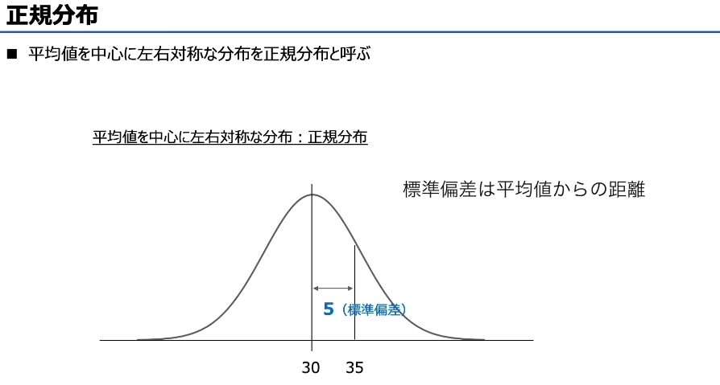

何乗（なんじょう）
= “几次方 / 几次幂”


如何把二进制小数变成计算机里存的浮点数格式

https://www.bilibili.com/video/BV1U8411X7du/?spm_id_from=333.337.search-card.all.click&vd_source=4fd29620ab97a080af7ee392e19b0fcb


仮数（かすう） 在中文里一般叫 尾数

我的理解是 有效位数

双方向：そうほうこう

木構造（もくこうぞう / mokukōzō）
树结构

枝
エッジ（edge）
中文：边

枝（えだ / eda）
分支 / 树枝

サーチアルゴリズム（Search Algorithm）
搜索算法 ：在数据中找到某个值的方法

線形探索法（せんけいたんさくほう）
线性查找 / 顺序查找  从头到尾一个一个找 最简单，但效率低

2分探索法（にぶんたんさくほう）
二分查找（Binary Search）
比中间值
小了往左，大了往右 

ソートアルゴリズム（Sort Algorithm）排序算法

交換法（こうかんほう）＝ バブルソート
交换法 / 冒泡排序
两两比较，不对就交换
大的“冒”到后面

選択法（せんたくほう）选择排序  每次选最小的，放到前面

挿入法（そうにゅうほう） 中文：插入排序  像打扑克牌一样插入

シェルソート（Shell Sort） 希尔排序 先“间隔排序”，再逐渐变细 优点：比插入排序快很多

マージソート（Merge Sort）归并排序 分治法（Divide & Conquer） 拆分 排序 合并

クイックソート（Quick Sort） 快速排序
选一个“基准（pivot）”
小的放左，大的放右

ヒープソート（Heap Sort）堆排序
利用“堆（Heap）”结构

# BNF Backus-Naur Form，巴科斯范式

是用来定义编程语言语法的标准方式，
核心就是用 ::= 表示 “定义为”，
用 | 表示 “或者”，
用 <> 表示语法成分。它的本质就是一套语法规则，告诉你什么样的字符串是合法的


二分查找的本质：每次都把查找范围砍掉一半，所以它的时间复杂度是 对数级 的，和 log₂n 成正比。
为什么不是 n？：n 是线性查找的时间复杂度，每次只能排除 1 个数据，效率远低于二分查找。
为什么解析里说 “大约” 是 log₂n？：因为 k（实际次数）是满足 k ≤ log₂n < k+1 的整数，比如 n=8 时，log₂8=3，k=3；n=9 时，log₂9≈3.17，k=4。所以说它的阶数是 log₂n，用这个公式来估算


パリティ：parity 奇偶


---

## 一、先翻译题目（第一张图）
> 最上位をパリティビットとする8ビット符号において、パリティビット以外の下位7ビットを得るためのビット演算はどれか。

**翻译：**
在以最高位作为奇偶校验位的8位数据中，要获取「除了奇偶校验位之外的低7位」，应该使用哪种位运算？

---

## 二、先搞懂题目的核心需求
我们先拆解一下8位数据的结构：
| 位位置（从高到低） | b7（最高位） | b6 | b5 | b4 | b3 | b2 | b1 | b0（最低位） |
| :--- | :---: | :---: | :---: | :---: | :---: | :---: | :---: | :---: |
| 含义 | 奇偶校验位 | 数据位 | 数据位 | 数据位 | 数据位 | 数据位 | 数据位 | 数据位 |

题目要求：**把最高位的b7清成0，同时保持低7位b6~b0不变**。

要实现这个需求，我们用位运算里的「按位与（AND）」就可以了，核心原理是：
- AND上`0` → 这一位一定变成`0`
- AND上`1` → 这一位保持原来的值不变

所以我们需要一个掩码（mask）：
- 最高位是`0`，剩下7位都是`1` → 二进制是 `01111111`
- 转成十六进制就是 `0x7F`（因为`01111111` = 64+32+16+8+4+2+1 = 127，十六进制就是`7F`）

---

## 三、逐个分析选项（带翻译+对错判断）

### ア：16進数0FとのANDをとる
- 翻译：和十六进制`0F`做AND运算
- `0F`的二进制是 `00001111`
- 结果：**高4位（b7~b4）都会被清0**，低4位保留，不符合题目要求。❌

### イ：16進数0FとのORをとる
- 翻译：和十六进制`0F`做OR运算
- `0F`的二进制是 `00001111`
- 结果：**低4位（b3~b0）会被强制设为1**，高4位保留，不符合要求。❌

### ウ：16進数7FとのANDをとる
- 翻译：和十六进制`7F`做AND运算
- `7F`的二进制是 `01111111`
- 结果：最高位b7被清0，低7位保持不变，**完全符合题目要求**。✅（正确答案）

### エ：16進数FFとのXOR（排他的論理和）をとる
- 翻译：和十六进制`FF`做XOR运算
- `FF`的二进制是 `11111111`
- 结果：所有位都会被反转（0变1，1变0），不符合要求。❌

---

## 四、翻译并理解解析内容（第二、三张图）
### 1. 核心逻辑翻译
> パリティビットは誤り検出のための冗長ビットで、そのビットも含めて符号全体の“1”のビット数が、奇数又は偶数になるように付加される。いま、最上位のビット位置がパリティビットで、パリティビット以外の下位7ビットを得るためのビット演算を考える。つまり、元が何であったとしても、最上位のビットを0にし、下位7ビットはそのままの状態に保つビット演算である。
>
> 翻译：
> 奇偶校验位是用于错误检测的冗余位，它会被设置为让整个数据（包含校验位）中`1`的个数为奇数或偶数。现在，最高位是奇偶校验位，我们要找的是获取除校验位外低7位的位运算。也就是说，无论原来的最高位是0还是1，都要把它清成0，同时低7位保持不变。

> 16進数の7Fは、2進数にすると01111111になるため、この値と元の値のANDをとることで、最上位ビットだけを0に変換し、他のビットは元の値のままにできる。したがって、（ウ）が正解である。
>
> 翻译：
> 十六进制`7F`转成二进制是`01111111`，用它和原数据做AND运算，就能只把最高位变成0，其他位保持不变。因此选项（ウ）是正确答案。

### 2. 第三张图的「位运算技巧」翻译
这是位运算的通用规则，非常重要，我帮你整理成表格：

| 目标 | 运算方式 | 原理 |
| :--- | :--- | :--- |
| 把某一位设为`0` | 和`0`做AND | `x AND 0 = 0` |
| 把某一位反转（0↔1） | 和`1`做XOR | `x XOR 1 = 1-x` |
| 把某一位设为`1` | 和`1`做OR | `x OR 1 = 1` |
| 保持某一位不变 | 和`1`做AND / 和`0`做OR | `x AND 1 = x` / `x OR 0 = x` |

---

## 五、给你举个例子，直观感受一下
假设8位数据是 `11010101`（最高位`1`是奇偶校验位，低7位是`1010101`）：
- 用它和`7F`（`01111111`）做AND运算：
  ```
    11010101
  AND 01111111
  -----------
    01010101
  ```
- 结果的最高位变成了`0`，低7位`1010101`完全保留，正好就是我们要的“除了校验位的低7位”。

---

## 六、这类题的通用解题步骤
1.  **明确目标**：哪些位要清0？哪些位要保留？
2.  **构造掩码**：要清0的位写`0`，要保留的位写`1`
3.  **选择运算**： 清0 + 保留 用AND，置1用OR，反转用XOR
4.  **验证选项**：看哪个选项的运算和掩码符合你的需求


# 情報落ち

在浮点数运算中，如果两个绝对值相差极大的数相加 / 相减，绝对值小的那个数会被 “忽略掉”，这种误差就叫「情報落ち」（信息丢失）
举个例子：比如用浮点数计算 1000000 + 0.1
浮点数的有效位数是有限的（比如只有 6 位有效数字）
1000000 会被表示为 1.00000 × 10^6
0.1 是 1.0 × 10^-1，和 10^6 差了 7 个数量级
相加时，0.1 会被四舍五入掉，结果还是 1000000，相当于小数被 “吃” 掉了，这就是信息丢失。

为什么「从小到大算」能抑制「情報落ち」？
假设我们要算：1000000 + 0.1 + 0.1 + 0.1
从大到小算：1000000 + 0.1 直接变成 1000000，再加后面的 0.1 也不会变，结果还是 1000000，误差很大。
从小到大算：0.1 + 0.1 + 0.1 = 0.3，再和 1000000 相加，结果是 1000000.3，误差就小多了。
先把小数加起来，再和大数相加，就能避免小数被直接忽略掉，所以题目里的方法是为了抑制「情報落ち」。


アンダフロー  underflow：表現できる範囲よりも演算結果の絶対値が小さい値になる現象
下溢：运算结果的绝对值，小到超出了浮点数能表示的最小范围
举个例子：在浮点数系统中：
假设最小可表示正数是：
1.0 × 10^-38
如果你计算：
1.0 × 10^-40
这个数太小了，计算机存不下

结果可能变成：
0
或者被舍入成非常小的近似值  这就是 underflow（アンダフロー）


打切り誤差 うちきりごさ
截断误差：比如求级数时，为了方便计算，只算了前几项，没算完所有项导致的误差、
例子：0.45的二进制表示：一直计算下去没有尽头
一个理论上需要「无限次运算」才能得到的精确结果，我们为了实际计算，只取了有限步、有限项就停止了，由此产生的误差，就叫截断误差。


けた落ち 桁落ち
当你做两个非常接近的数相减时：

高位（有效数字）被抵消，只剩下低位噪声
👉 导致精度严重下降
举个非常经典的例子

假设计算机只能保留 6 位有效数字：

A = 1.23456
B = 1.23450

计算：
A - B = 0.00006
⚠️ 问题来了

原本：
A 和 B 都是“高精度数”

但相减后：
前面几位全部抵消（1.2345xx 全没了）
只剩下很小的数

👉 这就是 けた落ち（桁落ち）


はみ出す
超出、溢出、挤出去
计算机语境：指移位操作时，最高位 / 最低位的比特被移出了寄存器的位数范围

論理シフトでは 1 がはみ出したときにオーバーフローと判断する
在逻辑移位中，当 1 被移出寄存器范围时，就会被判断为溢出（overflow）

算術シフト さんじゅつシフト
左シフト
算术移位 _ 左移

（算术移位是）考虑符号位的移位操作（左移：相当于乘法运算）

负数的话 符号位不动 但是其他的位数需要 左移之后 取反 +1


## 一、表格内容总结（逻辑移位 vs 算术移位）

| 移位类型 | 处理方式 | 核心区别 | 溢出判断 |
| :--- | :--- | :--- | :--- |
| **論理シフト（逻辑移位）** | 不考虑符号位，把数据当成无符号纯二进制处理 | 左右移位时，空位一律补 `0` | 左移时，只要有 `1` 被移出最高位，就判定为溢出 |
| **算術シフト（算术移位）** | 考虑符号位，专门处理有符号数 | 左移：空位补 `0`；右移：空位**补符号位**（正数补0，负数补1） | 左移时，移出的位和符号位不同，就判定为溢出 |

### 分方向拆解
- **左シフト（左移，=×2ⁿ）**
  两种移位的行为几乎一样：空位都补0，区别只在溢出判断规则。
- **右シフト（右移，=÷2ⁿ，向下取整）**
  核心区别就在这里：
  - 逻辑右移：空位一律补0，不区分正负。
  - 算术右移：空位补**符号位**，保证负数移位后依然是负数。

---

## 二、算术右移（算術右シフト）完整例子 さんじゅつシフト

我们用一个**负数**来演示（正数的话，算术和逻辑右移结果是一样的）：

### 1. 原数据（8位有符号补码）
`11101000` = `-24`（和你之前的例子是同一个数）
- 最高位是 `1`，代表负数，符号位是 `1`。

### 2. 操作：算术右移2位（÷2² = ÷4）
- 移位规则：所有位整体右移2位，移出的位丢弃，左边空出来的位置**补符号位（也就是1）**。

```
原数：  1 1 1 0 1 0 0 0  （-24）
右移2位：
       1 1 1 1 1 0 1 0  （空位补1）
```

### 3. 结果验证
- 移位后：`11111010`
- 转十进制：按位取反+1 → `00000101` + 1 = `00000110` = 6 → 所以结果是 `-6`。
- 计算验证：`-24 ÷ 4 = -6`，完全正确 ✅

### 4. 对比逻辑右移（方便理解区别）
如果对 `11101000` 做逻辑右移2位，空位会补0：
- 结果：`00111010` = 58，这就完全不是我们想要的 `-6` 了，也失去了“除以4”的意义。

---

## 三、一句话记住关键区别
- **算术右移：补符号位，专门处理有符号数的除法**
- **逻辑右移：一律补0，处理无符号数**

# 几种类型的误差总结

## ① 桁あふれ誤差（けたあふれごさ / 溢出误差）
コンピューターが扱える最大値 / 最小値を超えること→ 指超出了计算机能处理的最大值 / 最小值范围的情况。

オーバーフロー（Overflow / 上溢）
例：10 進数 300 を 8 ビット 2 進数で表現する
→ 用 8 位二进制表示十进制数 300
（8 位无符号数最大只能表示到 255，300 超出范围，属于上溢）
アンダーフロー（Underflow / 下溢）
例：10 進数 
3.5×10的 −1000000次方
 を 8 ビット 2 進数で表現する
→ 用 8 位二进制表示十进制数 
3.5×10 
−1000000
（这个数的绝对值太小，超出了浮点数能表示的最小范围，属于下溢）


## ② 情報落ち（じょうほうおち / 信息丢失）
定義：絶対値の大きい値と小さい値で足し算 / 引き算で、絶対値の小さい値の計算が反映されないこと→ 翻译：当绝对值相差很大的两个数做加法 / 减法时，绝对值较小的数的计算结果无法被反映出来的现象。

假设我们要算：1000000 + 0.1 + 0.1 + 0.1
从大到小算：1000000 + 0.1 直接变成 1000000，再加后面的 0.1 也不会变，结果还是 1000000，误差很大。
从小到大算：0.1 + 0.1 + 0.1 = 0.3，再和 1000000 相加，结果是 1000000.3，误差就小多了。


ずれる（偏移、错开）

## ③ 打切り誤差（うちきりごさ / 截断误差）
定義：計算処理を途中で打ち切ることで生じる誤差→ 翻译：在计算过程中途截断，从而产生的误差。
例：
10÷3=3.333333333333…
右边标注：本来の数とのズレ
→ 翻译：与原本数值的偏差（即误差）

## ④ けた落ち（けたおち / 有效位丢失 / 抵消误差）
定義：絶対値が近い数値で差を求めたときに有効桁数が減ること→ 翻译：当两个绝对值相近的数值做减法时，**有效数字**位数减少的现象。
x=1.234567,y=1.234566
两个都是 7 位有效数字。
做减法：
x−y=1.234567−1.234566=0.000001
关键变化
原来：各自 7 位有效数字
相减后：只剩 1 位有效数字

けた【桁】读音：けた（keta） 核心本意 ：位数、数位 这里估计代指 有效位
数学 / 计算机里就是数字的位数、位
1 桁：1 位数
2 桁：2 位数
有効桁（ゆうこうけた）：有效位数


## ⑤ 丸め誤差（まるめごさ / 舍入误差） ## 丸め誤差  まるめごさ 舍入误差 / 四舍五入误差
定義：切り上げ / 切り捨て / 四捨五入により生じる誤差→ 翻译：由向上取整、向下取整或四舍五入操作产生的误差。
例：
137.6→138
右侧标注：元々の数とズレる
→ 翻译：与原本的数值产生偏差（即产生了误差）


# 论理演算
べん図: 韦恩图


# 德摩根定律

# ド・モルガンの法則（ほうそく）（德摩根定律）翻译+详解
---
## 一、原文翻译
### 标题：**ド・モルガンの法則**
→ 德摩根定律（De Morgan's Laws）

---
### 1. 第一条公式 & 说明
- 公式：$\overline{A+B} = \overline{A} \cdot \overline{B}$
- 日文原文：AとBの論理和の否定は、Aの否定とBの否定の論理積
- 中文翻译：**A与B的逻辑或（OR）的否定，等价于A的否定与B的否定的逻辑与（AND）**

---
### 2. 第二条公式 & 说明
- 公式：$\overline{A \cdot B} = \overline{A} + \overline{B}$
- 日文原文（图中仅写了前半句，后半句同理）：AとBの論理積の否定は、Aの否定とBの否定の論理和
- 中文翻译：**A与B的逻辑与（AND）的否定，等价于A的否定与B的否定的逻辑或（OR）**

---
## 二、核心概念讲解（超通俗版）
德摩根定律是**布尔代数/逻辑运算**里最基础也最重要的规则，简单说就是「取反时，或和与要互换」，可以用一句口诀记：
> **“去括号，反号分配，或变与，与变或”**

### 1. 符号说明（先搞懂每个符号是什么）
| 符号 | 日语名称 | 中文含义 | 逻辑运算 | 对应英文 |
|------|----------|----------|----------|----------|
| $A, B$ | 論理変数 | 逻辑变量（命题） | 真/假（1/0） | Variable |
| $+$ | 論理和 | 逻辑或 | OR（只要有一个为真，结果为真） | OR |
| $\cdot$ | 論理積 | 逻辑与 | AND（必须两个都为真，结果才为真） | AND |
| $\overline{\phantom{A}}$ | 否定 | 逻辑非/取反 | NOT（真变假，假变真） | NOT |

---
### 2. 第一条公式详解：$\overline{A+B} = \overline{A} \cdot \overline{B}$
- 人话翻译：**“A 或者 B”这件事的否定，等于“不是A 并且 不是B”**
- 举个生活化的例子：
  设 A=“今天下雨”，B=“今天下雪”
  - $A+B$：今天下雨 **或者** 下雪（只要满足一个就成立）
  - $\overline{A+B}$：“今天下雨或者下雪”这件事不成立
  - 等价于：今天**既不下雨，也不下雪** → 也就是 $\overline{A} \cdot \overline{B}$（不下雨 AND 不下雪）
- 逻辑真值表验证：
| A | B | A+B | $\overline{A+B}$ | $\overline{A}$ | $\overline{B}$ | $\overline{A} \cdot \overline{B}$ |
|---|---|-----|----------------|---------------|---------------|-------------------------------|
| 0 | 0 | 0   | 1              | 1             | 1             | 1                             |
| 0 | 1 | 1   | 0              | 1             | 0             | 0                             |
| 1 | 0 | 1   | 0              | 0             | 1             | 0                             |
| 1 | 1 | 1   | 0              | 0             | 0             | 0                             |
可以看到，$\overline{A+B}$ 和 $\overline{A} \cdot \overline{B}$ 的结果完全一致。

---
### 3. 第二条公式详解：$\overline{A \cdot B} = \overline{A} + \overline{B}$
- 人话翻译：**“A 并且 B”这件事的否定，等于“不是A 或者 不是B”**
- 举个生活化的例子：
  设 A=“你写了作业”，B=“你交了作业”
  - $A \cdot B$：你写了作业 **并且** 交了作业（两个都满足才成立）
  - $\overline{A \cdot B}$：“你写了作业并且交了作业”这件事不成立
  - 等价于：你**没写作业，或者没交作业**（只要有一个没满足，整体就不成立）→ 也就是 $\overline{A} + \overline{B}$（没写 OR 没交）
- 逻辑真值表验证：
| A | B | A·B | $\overline{A \cdot B}$ | $\overline{A}$ | $\overline{B}$ | $\overline{A} + \overline{B}$ |
|---|---|-----|----------------------|---------------|---------------|-------------------------------|
| 0 | 0 | 0   | 1                    | 1             | 1             | 1                             |
| 0 | 1 | 0   | 1                    | 1             | 0             | 1                             |
| 1 | 0 | 0   | 1                    | 0             | 1             | 1                             |
| 1 | 1 | 1   | 0                    | 0             | 0             | 0                             |
同样，$\overline{A \cdot B}$ 和 $\overline{A} + \overline{B}$ 的结果完全一致。

---
## 三、实际应用场景（为什么要学这个？）
德摩根定律在**IT/编程/数字电路**里超级常用：
1.  **逻辑化简**：把复杂的逻辑表达式变简单，比如在写条件判断时，简化`if`语句的条件
    例：原本要写`if(!(a || b))`，用定律可以简化成`if(!a && !b)`，逻辑更清晰
2.  **数字电路设计**：把 OR 门和 NOT 门的组合，换成 AND 门和 NOT 门，或者反过来，优化电路成本
3.  **集合运算**：和逻辑运算一一对应，比如集合的“并集的补集=补集的交集”，就是德摩根定律的集合形式


---
## 四、记忆小技巧
- 口诀：**取反要“拆括号”，或变与、与变或，变量都取反**
  - 括号里是`+`（或），取反后变成`·`（与），里面的A、B都取反
  - 括号里是`·`（与），取反后变成`+`（或），里面的A、B都取反
- 举个例子：
  - $\overline{A + B + C} = \overline{A} \cdot \overline{B} \cdot \overline{C}$（多个变量也适用）
  - $\overline{A \cdot B \cdot C} = \overline{A} + \overline{B} + \overline{C}$


左辺 さへん 右边 右辺：うへん 右边、右式

其他法则

公式	名称	含义解释
A⋅A=A	幂等律（AND 运算）	同一个变量做 “与运算”，结果还是它本身。比如：1 AND 1 = 1，0 AND 0 = 0
A+A=A	幂等律（OR 运算）	同一个变量做 “或运算”，结果还是它本身。比如：1 OR 1 = 1，0 OR 0 = 0
A=非非A	双重否定律（还原律）	对变量两次取反，结果还原成原来的变量。比如：非 (非 1)=1，非 (非 0)=0


A⋅非A=0	互补律（与运算）	变量和它的反变量做 “与运算”，结果恒为 0（逻辑假）。逻辑上理解：“一个命题和它的否定，不可能同时成立”。	A=1时：1⋅0=0A=0时：0⋅1=0
A+非A=1	互补律（或运算）	变量和它的反变量做 “或运算”，结果恒为 1（逻辑真）。逻辑上理解：“一个命题和它的否定，必然有一个成立”。	A=1时：1+0=1A=0时：0+1=1

色塗り （いろぬり）
涂色、上色、刷颜色

A⋅1=A	与运算 - 单位元律	变量和 1 做 “与运算”，结果等于变量本身。	1 在与运算里是 “透明” 的，不影响结果
A+1=1	或运算 - 支配律	变量和 1 做 “或运算”，结果恒为 1。	只要有 1 参与或运算，结果一定是 1
A⋅0=0	与运算 - 支配律	变量和 0 做 “与运算”，结果恒为 0。	只要有 0 参与与运算，结果一定是 0
A+0=A	或运算 - 单位元律	变量和 0 做 “或运算”，结果等于变量本身。	0 在或运算里是 “透明” 的，不影响结果

# 最后两个 分配律

这是布尔代数里的**分配法则（分配律）**，我帮你把这两个公式讲清楚，顺便区分一下和普通数学的异同👇

---

### 1. 第一条：与对或的分配律
公式：$A \cdot (B + C) = (A \cdot B) + (A \cdot C)$

- **含义**：与运算（$\cdot$）对或运算（$+$）具有分配性。
- **和普通数学的关系**：这一条和我们熟悉的“乘法对加法的分配律”完全一样。
  比如：$a \times (b + c) = a \times b + a \times c$
- **用途**：把括号外的与运算，分配到括号里的每一项，方便展开逻辑表达式。

---

### 2. 第二条：或对与的分配律
公式：$A + (B \cdot C) = (A + B) \cdot (A + C)$

- **含义**：或运算（$+$）对与运算（$\cdot$）也具有分配性。
- **和普通数学的区别**：这一条是布尔代数特有的！普通数学里加法对乘法没有这样的分配性。
  比如：$a + (b \times c) \neq (a + b) \times (a + c)$，但在布尔代数里成立。
- **用途**：把括号外的或运算，分配到括号里的每一项，用来把“和之积”形式变成“积之和”，或者反过来。

---

### 一句话核心总结
布尔代数的分配律是双向的：
1.  **与（AND）对或（OR）可以分配**（和普通乘法分配律一样）；
2.  **或（OR）对与（AND）也可以分配**（布尔代数独有的规则）。

这两个法则是化简逻辑电路、转换逻辑表达式形式的核心工具。


落とし込む  おとしこむ（otoshikomu）

灌输、熟记、把知识记牢

套入、代入


# 正規分布 せいきぶんぷ

正态分布（也叫：高斯分布）

正态分布，是指像考试成绩那样，在平均分附近的人数最多，随着分数接近 0 分或 100 分，人数逐渐减少的分布类型。正态分布的图像如下图所示，以平均值为中心，呈现出左右对称的、在平均值处达到峰值的钟形曲线。因此，选项（ウ）是正确的。

「釣鐘型（つりがねがた）」是日语里对正态分布曲线的标准叫法，就是我们常说的 “钟形曲线”。
次図	じず（jizu）

昇順 しょうじゅん（shōjun）
升序（从小到大排序）

整列 せいれつ（seiretsu）
排列、排序、对齐

入替え いれかえ（irekae）
替换


リエントラント	Reentrant	再入可能（可重入）	程序被多个进程 / 线程同时调用时，不会因为共享数据而互相干扰、可以安全并行执行的特性。这正是题目描述的特性。	✅ 正确
リカーシブ	Recursive	递归	函数自己调用自己的特性，和多进程并行无关。	❌ 不对应
リユーザブル	Reusable	可复用（可再使用）	程序可以被多次调用、反复使用，但不一定支持同时调用（可能存在共享数据冲突）。	❌ 不对应
リロケータブル	Relocatable	可重定位	程序可以被加载到内存的任意地址执行，和并行执行无关。	❌ 不对应


# 统计分析手法相关

| 方法    | 用途           |
| ----- | ------------ |
| 单回归   | 一个因素 → 预测结果  |
| 多回归   | 多个因素 → 更准确预测 |
| 逻辑回归  | 预测“会不会发生”    | 逻辑上判断是否
| 相关分析  | 看有没有关系       |
| 主成分分析 | 降维、简化数据      |


① 単回帰分析（たんかいきぶんせき /tan kaiki bunseki，一元回归分析）
1 つの独立変数と 1 つの従属変数の関係性をモデル化して分析すること
独立変数：どくりつへんすう (dokuritsu hensuu)
従属変数：じゅうぞくへんすう (juuzoku hensuu)
翻译：将 1 个自变量和 1 个因变量的关系建模并分析

活用例：「気温」の情報から「コーヒーの売上金額」を予測する
翻译：根据 “气温” 信息预测 “咖啡销售额”

② 重回帰分析（じゅうかいきぶんせき /juu kaiki bunseki，多元回归分析）
定義：複数の独立変数と 1 つの従属変数の関係性をモデル化して分析すること
従属変数：じゅうぞくへんすう (juuzoku hensuu)
翻译：将多个自变量和 1 个因变量的关系建模并分析
活用例：「気温」「天気」「曜日」(ようび (youbi))の情報から「コーヒーの売上金額」を予測する
翻译：根据 “气温、天气、星期” 信息预测 “咖啡销售额”

③ ロジスティック回帰分析（ろじすてぃっくかいきぶんせき /rojisutikku kaiki bunseki，逻辑回归分析）
定義：1 つ以上の独立変数とカテゴリカルな従属変数の確率をモデル化して分析すること
类别型（カテゴリカル） 分类型 / 类别型 性别：男 / 女
従属変数：じゅうぞくへんすう (juuzoku hensuu)
活用例：「気温」「天気」「曜日」の情報から「人がコーヒーを買うか買わない」を予測する
翻译：根据 “气温、天气、星期” 信息预测 “人是否会买咖啡”

3. 相関分析（そうかんぶんせき /soukan bunseki，相关分析）
定義：二つの変数間の関係性を評価すること  翻译：评估两个变量之间的关联性
活用例：「体重」と「心臓病」の相関係数を求めて、関係性を評価する 
翻译：计算 “体重” 和 “心脏病” 的相关系数，评估两者的关联性
相関係数：そうかんけいすう (soukan keisuu)

4. 主成分分析（しゅせいぶんぶんせき /shuseibun bunseki，主成分分析）
定義：データの次元を削減し、主成分を特定すること
翻译：降低数据的维度，提取并确定主成分
次元：じげん (jigen)
主成分：しゅせいぶん (shuseibun)
活用例：「数学 B, 数学 Ⅱ, 化学，物理，古文，漢文，現代文，日本史，世界史，英語」の 10 科目を「理系科目・文系科目」の 2 科目に削減する。
漢文：かんぶん (kanbun)

翻译：将 “数学 B、数学 Ⅱ、化学、物理、古文、汉文、现代文、日本史、世界史、英语” 共 10 个科目，降维为 “理科科目・文科科目”2 个科目。

# 線形代数 
せんけいだいすう

- 線形代数は行列やベクトルといった数学的なツールを用いて、複雑な数や変数の関係を計算する学問
行列	ぎょうれつ (gyouretsu)
ベクトル	bekutoru	向量（Vector）
学問	がくもん (gakumon)	学问、学科
线性代数是一门使用矩阵、向量等数学工具，来计算复杂数字与变量之间关系的学科。

- 複雑な数式モデルが使われている身近なツールで計算する際に役立つ

身近	みぢか (mijika)	身边的、日常的
在使用那些运用了复杂数学公式模型的日常工具进行计算时，（线性代数）能发挥重要作用。

行列
读音：ぎょうれつ (gyouretsu)
翻译：矩阵

行列は線形代数で使用されるツールの 1 つであり、数字を縦と横に並べたもの
矩阵是线性代数中使用的工具之一，是将数字按横向和纵向排列而成的形式。


横方向に並ぶ数字のグループを” 行”、縦方向に並ぶ数字のグループを” 列” と呼び、行と列の大きさで表現する
| 大きさ | おおきさ (ookisa) | 大小、规模 |

横向排列的数字组称为 “行”，纵向排列的数字组称为 “列”，矩阵的大小用 “行数 × 列数” 来表示。

行列の四則演算
ぎょうれつ の しそくえんざん (gyouretsu no shisoku enzan)
矩阵的四则运算

スカラー | sukaraa | 标量（Scalar）
行列に対し、普段私たちが使用する単一の数値をスカラーと呼ぶ
在矩阵相关的语境中，我们平时使用的单个数值被称为标量（Scalar）。

「行列と行列」及び「行列とスカラー」の四則演算は計算出来るものと出来ないものがある
「矩阵与矩阵」以及「矩阵与标量」的四则运算，存在可以计算的情况，也存在无法计算的情况。

単位行列（单位矩阵）たんいぎょうれつ
対角成分（たいかくせいぶん）がすべて 1 で、それ以外の成分がすべて 0 である正方行列（せいほうぎょうれつ）（行と列の数が同じ行列）。（翻译：对角线上的元素全为 1，其余元素全为 0 的方阵）

# ビット演算
位运算
元のビット列 100101110
原始比特序列（原始位串）
マスクパターン 111111111
掩码模式（Mask Pattern）

# 逆波兰表示法 Reverse Polish Notation, RPN

中置记法（正常写法）
A + B

而逆波兰表示法是：
后置记法
A B +
运算符放在最后

为什么要用这种奇怪的写法？
计算机很喜欢这种写法！
原因有两个：
1. 不需要括号

普通写法：
(3 + 4) × 5
要用括号，不然会算错

但逆波兰表达式
3 4 + 5 ×
完全不需要括号！

桁合わせする操作 对齐数位的操作
けたあわせするそうさ (keta awase suru sousa)


# 程序的分类与特征


> ア：再配置可能（リロケータブル）プログラムの特徴である。 可重定位（Relocatable）
- **ア**：主記憶上のどこのアドレスに配置しても、実行することができる。
  → 无论被加载到主存的哪个地址，都能正常执行。（这是**可重定位程序**的特征）

> イ：再帰的（リカーシブ）プログラムの特徴である。递归（Recursive）
- **イ**：手続の内部から自分自身を呼び出すことができる。
  → 过程内部可以调用自身。（这是**递归程序**的特征）

> ウ：オーバレイ方式のプログラムに関する記述である。 覆盖（Overlay）
- **ウ**：必要な部分を補助記憶装置から読み込みながら動作する。主記憶領域の大きさに制限があるときに、有効な手法である。
  → 一边从辅助存储（硬盘）读取必要部分一边运行，在主存空间有限时是有效的方法。（这是**覆盖/Overlay技术**的特征）

> 再入可能（リエントラント）プログラム
- **エ**：複数のタスクからの呼出しに対して、並行して実行されても、それぞれのタスクに正しい結果を返す。
  → 面对多个任务的调用，即使被并行执行，也能为每个任务返回正确的结果。（这是**可重入程序**的特征）

---
## 二、解析翻译
> 再入可能（リエントラント）プログラムは、複数のタスクから同時に利用可能なプログラムである。複数のタスクが同時に利用するため、手続部分は共通で使用するが、データ部分はタスクごとに保持するため、並行して実行されても、それぞれのタスクに正しい結果を返すことができる。したがって、（エ）が正解である。

**翻译：**
可重入（Reentrant）程序是一种可以被多个任务同时使用的程序。多个任务同时使用时，程序代码部分被共享，但数据部分由每个任务独立保存，因此即使被并行执行，也能为每个任务返回正确的结果。因此，（エ）是正确答案。

> ア：再配置可能（リロケータブル）プログラムの特徴である。
> イ：再帰的（リカーシブ）プログラムの特徴である。
> ウ：オーバレイ方式のプログラムに関する記述である。
> 正答：エ

**翻译：**
- ア：是可重定位（Relocatable）程序的特征。
- イ：是递归（Recursive）程序的特征。
- ウ：是关于覆盖（Overlay）方式程序的描述。
- 正确答案：エ

---
## 三、对应的基本情报知识点
这道题属于**操作系统/程序设计**模块，考点是「程序的分类与特征」，核心概念如下：

| 程序类型 | 日文名称 | 核心特征 |
| :--- | :--- | :--- |
| 可重入程序 | 再入可能（リエントラント）プログラム | 代码无共享状态，可被多个任务并行调用，不会互相干扰 |
| 可重定位程序 | 再配置可能（リロケータブル）プログラム | 加载到内存任意地址都能正常运行（和地址无关） |
| 递归程序 | 再帰的（リカーシブ）プログラム | 过程内部可以调用自身 |
| 覆盖程序 | オーバレイ方式のプログラム | 内存不足时，分块加载代码运行 |

💡 补充：可重入程序是多任务/多线程编程的基础，它的关键是**不使用全局变量、不修改自身代码、所有状态保存在调用者的栈中**，这样多个任务同时调用时才不会互相影响。


# 统计学基础概念

这一页是**统计学基础概念**的入门总结，用50米跑成绩的例子，帮你快速分清几个核心统计指标~

---
## 一、核心主题：统计的性质
统计数据中，具有代表性的特征值都有专门的名称和定义，这页就是在讲最基础的几个特征值。

---
## 二、例子背景：50米跑成绩（已按从快到慢排序）
数据：`5.9, 6.2, 6.4, 6.8, 6.8, 6.8, 7.1, 7.1, 7.2, 7.2, 7.3, 7.6, 7.6, 7.7, 7.8, 8.1, 8.2`（共17个数据）

---
## 三、5个核心统计指标详解
| 日文术语 | 中文名称 | 定义 | 本例中的值 |
| :--- | :--- | :--- | :--- |
| 中央値（メジアン） | 中位数 | 数据按顺序排列后，位于**最中间位置**的数值 | 7.2秒 |
| 最頻値（モード） | 众数 | 数据中**出现次数最多**的数值 | 6.8秒 |
| 平均値 | 平均值 | 所有数据的总和 ÷ 数据的个数 | 7.16秒 |
| 分散 | 方差 | 数据与平均值之间**偏差的平方的平均值**，反映数据的离散程度 | - |
| 標準偏差 | 标准差 | 方差的**平方根**，把方差还原成和原始数据相同的单位，直观反映数据的波动大小 | - |

---
## 四、关键补充说明
1.  **中位数的计算**：17个数据，中间位置是第9个，所以第9个数据`7.2`就是中位数。
2.  **众数的计算**：`6.8`出现了3次，是所有数据里出现次数最多的，所以是众数。
3.  **方差与标准差的关系**：方差是为了消除正负偏差，把每个偏差平方后再求平均；但平方后单位也变了，所以标准差再开平方，把单位还原，方便理解数据的波动。

# 正态分布

这页讲的是统计学里最基础、最核心的**正态分布（正規分布）**，我帮你用中文总结一下：

---
### 核心定义
**正态分布**，是一种以**平均值为中心，左右完全对称**的概率分布，也叫“高斯分布”。
它的形状像一个倒扣的钟，因此也常被称为“钟形曲线”。

---
### 关键特征
1.  **对称性**：以平均值为对称轴，左右两边的分布完全一样。
2.  **均值=中位数**：因为分布对称，所以**平均值和中位数是同一个数值**，也就是曲线的最高点对应的位置。
3.  **单峰**：曲线只有一个最高点（众数），并且这个最高点也和平均值、中位数重合。

标准偏差 ：是指 距离中心值（平均值）的距离


正态分布的「95% 法则」：
在正态分布中，距离平均值 ± 2 个标准差的范围内，包含了全部数据的 95%。

核心知识点
结合前面的例子：平均值 = 30，标准差 = 5。
平均值 - 2× 标准差 = 30 - 2×5 = 20
平均值 + 2× 标准差 = 30 + 2×5 = 40
所以，在 20~40 这个区间内，包含了 95% 的数据。
直观理解：在这个分布里，绝大多数数据（95%）都集中在 20 到 40 之间，只有 5% 的数据会落在这个区间之外


# XML DTD

这道题是日本基本情報技術者試験（FE）里关于 **XML DTD** 的经典题目，我们先解这道题，再把知识点讲透。

---
## 1. 题目解析
**问题**：XML文書のDTDに記述するものはどれか。（以下哪项是写在XML文档的DTD里的内容？）

- ア：使用する文字コード（使用的字符编码）
- イ：データ（数据本身）
- ウ：バージョン情報（版本信息）
- エ：文書型の定義（文档类型的定义）

**正确答案：D（エ）**

### 为什么？
- **DTD（Document Type Definition）**，即「文書型定義」，它的核心作用就是定义XML文档的**结构、元素、属性和规则**，所以“文档类型的定义”本身就是DTD的核心内容。
- 其他选项：
  - ア（文字编码）、ウ（版本信息）：这些都是写在XML声明（`<?xml ...?>`）里的，不是DTD的内容。
  - イ（数据本身）：数据内容是写在XML的元素里的，DTD不包含实际数据。

---
## 2. 核心知识点：XML 与 DTD 详解
### （1）什么是 XML？
XML（Extensible Markup Language，可扩展标记语言）是一种用来**结构化存储和传输数据**的标记语言。
- 它和HTML不同：HTML是用来“显示数据”的，而XML是用来“描述数据”的。
- XML本身没有预定义的标签，所有标签都需要你自己定义，所以需要一个规则来约束文档结构，这就是DTD的作用。

### （2）什么是 DTD？
DTD（Document Type Definition，文書型定義）是用来定义XML文档结构的一套规则，它规定了：
- 文档中可以出现哪些元素（标签）
- 这些元素之间的嵌套关系（比如`<book>`里必须包含`<title>`和`<author>`）
- 元素可以包含哪些属性（比如`<book genre="novel">`里的`genre`属性）
- 元素的出现次数（比如`<author>`可以出现1次，`<chapter>`可以出现1次以上）

DTD可以写在XML文档内部，也可以作为外部文件引用。

#### 一个简单的例子
```xml
<!-- XML声明（字符编码、版本在这里） -->
<?xml version="1.0" encoding="UTF-8"?>

<!-- 引用内部DTD（定义文档结构） -->
<!DOCTYPE library [
  <!ELEMENT library (book+)>
  <!ELEMENT book (title, author)>
  <!ELEMENT title (#PCDATA)>
  <!ELEMENT author (#PCDATA)>
  <!ATTLIST book genre CDATA #REQUIRED>
]>

<!-- 实际数据（写在XML元素里） -->
<library>
  <book genre="novel">
    <title>豆包入门</title>
    <author>あなた</author>
  </book>
</library>
```
- `<?xml ...?>`：XML声明，包含版本（`version`）和字符编码（`encoding`）。
- `<!DOCTYPE ...>`：DTD部分，定义了`library`、`book`等元素的结构。
- `<library>...</library>`：实际的数据内容。

### （3）DTD 和 XML Schema 的区别（拓展知识）
除了DTD，现在更常用的还有XML Schema（XSD），两者都是用来定义XML结构的：

| 对比项 | DTD | XML Schema（XSD） |
|--------|-----|------------------|
| 语法 | 非XML语法，用自己的特殊符号 | 本身就是XML文档，语法统一 |
| 数据类型 | 只支持字符串，没有数值、日期等类型 | 支持丰富的数据类型（int、date、boolean等） |
| 扩展性 | 较弱 | 支持命名空间，扩展性强 |
| 适用场景 | 简单的XML文档 | 复杂的企业级XML数据交换 |

---
## 3. 这道题的易错点
很多人容易把“XML声明”和“DTD”搞混：
- **XML声明（`<?xml ...?>`）**：只写在XML文档的开头，包含`version`（版本）、`encoding`（字符编码）、`standalone`等信息，和DTD无关。
- **DTD（`<!DOCTYPE ...>`）**：用来定义文档结构和规则，不包含实际数据、版本号或字符编码。


### xml相关知识点补充
#### 正解（エ）の知识点
XML は、SGML に準拠した文書・データ記述規格で、HTML とは異なり**利用者が独自のタグを定義し、文書の論理構造や属性情報を自由に記述できる**のが最大の特徴である。

#### 誤答の知识点
- ア：XML は HTML を拡張したものではなく、HTML と同じ SGML を親とする別の規格である。
- イ：XML はプレーンテキスト形式なので、専用エディタは必須ではなく、通常のテキストエディタで編集可能である。
- ウ：XML は文書の論理構造だけを定義し、表示スタイルは CSS や XSL など別の言語で指定するため、構造と表示が分離されている。

---

### 【中文版】
#### 正确选项（エ）知识点
XML 是遵循 SGML 标准的文档/数据描述规范，与 HTML 不同，它的核心特点是**用户可以自定义标签，自由定义文档的逻辑结构和属性信息**。

#### 错误选项知识点
- ア：XML 不是 HTML 的扩展，而是和 HTML 同源于 SGML 的独立标准。
- イ：XML 是纯文本格式，无需专用编辑器，普通文本编辑器即可编辑。
- ウ：XML 仅定义文档的逻辑结构，显示样式需通过 CSS/XSL 等外部语言指定，结构与显示是分离的。

---
要不要我再帮你把这几个XML相关的FE考点，整理成一份对比表格，方便你快速区分XML/HTML/SGML的区别？

# 領域割付け関数
内存分配函数
領域割付け関数はプログラム実行時に動的に記憶域を確保する関数であり、割付けができなかった場合は処理が中断するため、割付けができなかったときのエラー処理は決めておく必要がある。したがって、（エ）が適切である。
内存分配函数是程序运行时动态申请内存空间的函数。如果内存分配失败，程序会直接中断，因此必须预先定义好分配失败时的错误处理逻辑。因此，选项（エ）是恰当的。


関数の再帰呼出し 是指的递归

関数の再帰呼出しとは、関数の中からさらに自分自身の関数を呼び出す処理である。再帰処理の場合は、呼び出されるたびに新たに呼び出された関数用にメモリ領域が動的に確保され、戻るときには解放を繰り返すため、メモリの使用や実行の効率が悪くなる。同様の計算を何度も繰り返すときは関数の再帰呼出しではなく繰り返し処理を使用する。

繰り返し 才是 循环

「再帰呼出し」的读音和用法如下：
读音（罗马字标注）
平假名：さいき よびだし
罗马字：saiki yobidashi
补充说明
汉字拆解
再帰（さいき /saiki）：递归（计算机术语，对应英文 recursion）
呼出し（よびだし /yobidashi）：调用（动词「呼び出す」的连用形名词，对应英文 call）
合起来「再帰呼出し」= 递归调用（recursive call


# ディープラーニング（深層学習）深度学习

## 日文原文
AIにおけるディープラーニング（深層学習）は、人間が自然に行っている意思決定や行動などについて、コンピュータ自身が膨大な情報から将来使えそうな知識を見つけ、学習していく機械学習手法の一つである。ディープラーニングでは、人間の脳の神経細胞（ニューロン）の回路網を模倣した多層に配置された素子とそれらを結ぶ信号線（ニューラルネットワーク）を用い、信号線に付随するパラメタを調整することによって入力に対する適切な解を出力する。したがって、（イ）が正解である。

AI中的深度学习（Deep Learning），是一种让计算机模仿人类自然的决策、行为方式，从海量信息中自主挖掘可用知识并进行学习的机器学习方法。深度学习使用模仿人类大脑神经元回路网的、多层排列的节点及连接它们的信号线路（神经网络），通过调整信号线路附带的参数，对输入输出恰当的结果。因此，（イ）是正确答案。

ニューラルネットワークを利用したAIは以前にも注目されたことがあるが、コンピュータ性能の制約によって1，2層のものが限界であり、パラメタ調整も人間による試行錯誤によって行っていたため、解の精度が高くならず、期待される成果を上げることはなかった。これに対してディープラーニングでは、多層（4層以上）のものを用い、ビッグデータなどの膨大な情報からコンピュータ自身がパラメタ調整を行う手法を取り入れることで、解の精度が格段に向上した。実際に、ロボット、自動運転、自然言語で会話や仕事の依頼ができるAIアシスタント（スピーカー）などで活用されている。

使用神经网络的AI过去也曾受到关注，但受限于当时的计算机性能，只能构建1-2层的浅层网络，且参数调整需要人工反复试错，因此结果精度不高，无法达到预期效果。而深度学习采用多层（4层以上）结构，引入了让计算机自身基于大数据等海量信息自动调整参数的方法，使结果精度大幅提升。目前，深度学习已被实际应用于机器人、自动驾驶、支持自然语言对话与任务指令的AI助手（智能音箱）等场景。


