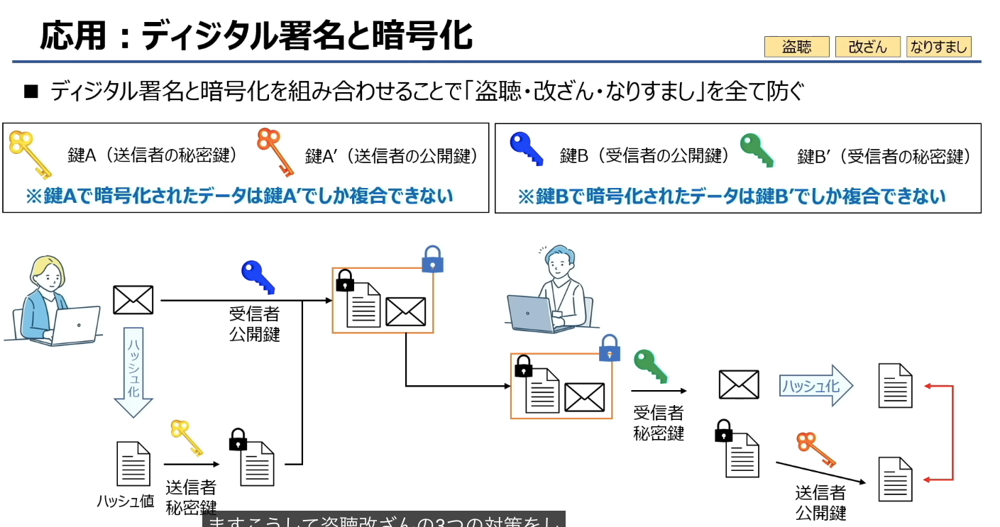

# 信息安全（情報セキュリティ） 脆弱性  脅威（威胁

### 一、脆弱性（ぜいじゃくせい）
- 原文定义：**情報セキュリティ上の重大な欠陥**
- 翻译：信息安全层面的重大缺陷/漏洞
- 通俗理解：就是系统本身存在的“弱点”，比如软件漏洞、弱密码、配置错误等。
- 关键点：**脆弱性是系统自身的问题，是被动存在的，只有被利用了才会造成危害**。

### 二、脅威（きょうい / 威胁）
威胁是指可能利用脆弱性造成危害的外部因素，图里把它分成了三类：

1.  **物理的脅威（物理威胁）**
    - 指对硬件、物理环境的威胁，比如火灾、水灾、盗窃、设备故障、断电等。
    - 例子：服务器机房被水淹、硬盘被盗走。

2.  **人的脅威（人为威胁）**
    - 指人直接或间接造成的威胁，分为恶意和非恶意两种：
      - 恶意：黑客攻击、内部人员泄露数据、病毒传播。
      - 非恶意：员工误删数据、误操作导致系统故障。

3.  **技術的脅威（技术威胁）**
    - 指利用技术手段发起的威胁，比如病毒、木马、网络攻击（DDoS、SQL注入）、系统漏洞利用等。
    - 这类威胁专门利用系统的脆弱性，是信息安全中最常见的威胁类型。

### 三、一句话总结两者的关系
- **脆弱性**是系统的“弱点”，**脅威**是“攻击这个弱点的外部力量”。
- 两者结合，就可能导致安全事件：威胁利用脆弱性，造成数据泄露、系统瘫痪等危害。

#  ソーシャルエンジニアリング（社会工程学）
- 原文定义：**人の心理のすきをついて機密情報を入手する行為**
- 翻译：利用人的心理弱点来获取机密信息的行为
- 通俗理解：它不攻击系统漏洞，而是**攻击人本身**，通过伪装、诱导、欺骗等方式，让受害者主动泄露密码、数据或权限。
  - 例子：冒充IT人员骗你说要“远程协助”、钓鱼邮件伪装成领导让你点链接、翻垃圾桶找打印过的敏感文件。

---

# 不正のトライアングル（舞弊三角） triangle 
这是解释“人为什么会做出不正当行为（比如泄露数据、舞弊）”的经典模型，由三个要素构成：

1.  **機会（机会）**
    - 定义：**自分以外のパソコンにログインできてしまう**（可以登录别人的电脑）
    - 通俗理解：存在实施不正当行为的条件/环境，比如权限过大、缺乏审计、无人监督。

2.  **動機（动机）**
    - 定义：**営業ノルマのプレッシャー**（销售指标的压力）
    - 通俗理解：实施不正当行为的诱因，比如业绩压力、经济困难、报复心理。

3.  **正当化（合理化）**
    - 定义：**不正を働いても仕方がない、会社のためでもある**（即使做了不正当行为也是没办法的，也是为了公司）
    - 通俗理解：为自己的行为找借口、进行自我辩解，比如“我只是帮公司解决问题”“大家都这么做”，以此减轻心理负罪感。

---

### 三、一句话总结
- **社会工程学**：是针对“人”的攻击手段，利用心理弱点获取信息。
- **舞弊三角**：是解释“人为什么会犯错误/舞弊”的模型，由「机会+动机+合理化」三个要素共同作用导致。

# ISMS（信息安全管理体系）

### 一、核心概念：ISMS是什么？
- **全称**：Information Security Management System（情報セキュリティマネジメントシステム）
- **定义**：企业为了系统性管理信息安全风险、保护信息资产而建立的一套完整管理体系。
- **标准依据**：由 **JIS Q 27000系列**（对应国际标准ISO/IEC 27000）定义了统一的评价基准和规范。

### 二、ISMS適合評価制度（ISMS符合性评价制度）
这张图完整展示了ISMS认证的流程：
1.  **评价基准**：基于JIS Q 27000系列的标准，制定信息安全相关的评价事项（比如制度、流程、技术措施等）。
2.  **符合性评价**：企业对照这些基准进行自评或第三方审核，确认自身的信息安全管理体系是否符合标准要求。
3.  **ISMS认证**：评价通过后，企业可以获得ISMS认证，这是信息安全管理水平的官方认可。
4.  **最终效果**：通过认证的企业，代表其「情報セキュリティ意識が高い」（信息安全意识和管理水平高），能有效保护自身和客户的信息资产。

### 三、一句话总结
ISMS是基于JIS Q 27000/ISO 27000标准的信息安全管理体系，企业通过符合性评价并获得ISMS认证，就代表其信息安全管理达到了国际公认的规范水平。

### 一、JIS Q 27000系列 是什么？
它是**信息安全管理体系（ISMS）**的日本国家标准，定义了企业建立、实施、维护和持续改进信息安全管理体系的统一规范。

### 二、图中三个核心标准的分工
1.  **JIS Q 27000：用語の定義**
    - 作用：定义整个系列中使用的基本术语和概念，比如“信息安全”“风险评估”“控制措施”等。
    - 地位：是整个系列的基础“字典”，统一了所有相关标准的用语。

2.  **JIS Q 27001：ISMS認証評価事項**
    - 作用：规定了ISMS认证的评价基准和要求，是企业获得ISMS认证的核心依据。
    - 地位：是认证审核的核心标准，企业的管理体系必须满足它的所有要求才能通过认证。

3.  **JIS Q 27004：情報セキュリティガバナンス**
    - 作用：规定了信息安全治理的相关要求，比如高层的责任、管理框架、绩效评价等。
    - 地位：是从治理层面保障信息安全管理体系有效运行的标准。

### 三、关键提示
图中也标注了「※細かく覚える必要なし」，意思是：**考试中不需要死记硬背每个标准的细节，只要记住它们的大致分工即可**：
- `27000`：术语定义
- `27001`：认证评价（核心）
- `27004`：治理相关

### 一句话总结
JIS Q 27000系列是信息安全管理的日本国家标准，其中 `27000` 定术语、`27001` 定认证要求、`27004` 定治理框架，共同构成了ISMS的完整标准体系。

# 情報セキュリティの3大要素 信息安全三大要素

### 🔐 情報セキュリティの3大要素（CIA 三原则）
这是信息安全的核心概念，所有安全措施都是围绕这三个目标设计的。

| 日文名称 | 中文译名 | 英文对应 | 核心定义 | 通俗理解 |
|---|---|---|---|---|
| **機密性** | 保密性 | Confidentiality | 許可された人だけが情報にアクセスできるようにすること | 只有被授权的人才能看到/接触信息，防止泄露 |
| **完全性** | 完整性 | Integrity | 情報が正確・完全であること | 信息在传输、存储过程中不被篡改、不丢失，保持原样 |
| **可用性** | 可用性 | Availability | 利用者が必要な時にいつでも情報にアクセスできること | 授权用户在需要的时候，随时都能正常访问和使用信息 |

### 💡 一句话总结
- **機密性**：信息不能被不该看的人看到
- **完全性**：信息不能被偷偷改了
- **可用性**：信息不能想用的时候用不了

三者共同构成了信息安全的基础目标，任何安全事件都是这三者中的某一项被破坏了。

# CIA 三要素之外的补充安全目标

### 1. 真正性（しんせいせい / Authenticity）
- 定义：**偽造やなりすましがなく情報が本物であること**
- 翻译：信息没有被伪造、不存在身份冒充，确认信息/发送方是真实的。
- 通俗理解：**确认“信息是谁发的，是不是本人发的”**，比如数字签名、身份认证就是为了保障真正性。

---

### 2. 信頼性（しんらいせい / Reliability）
- 定义：**意図した通りの結果が返ってくること**
- 翻译：系统/服务能按照预期稳定运行，返回正确的结果。
- 通俗理解：**系统靠谱，不会出故障、不会乱返回错误结果**，比如服务器的稳定性、软件的可靠性都属于这一类。

---

### 3. 責任追跡性（せきにんついせきせい / Accountability）
- 定义：**誰が関与したか追跡できるようにすること**
- 翻译：能够追踪到谁对信息/系统进行了操作。
- 通俗理解：**谁做了什么事都有记录，事后能查到责任人**，比如日志审计、操作留痕就是为了保障责任追踪性。

---

### 4. 否認防止性（ひにんぼうしせい / Non-repudiation）
- 定义：**あとで「自分ではない」と否定されないようにすること**
- 翻译：防止当事人事后否认自己发送过信息、执行过操作。
- 通俗理解：**做了就不能赖账**，比如数字签名、交易凭证就是为了防止否认。

---

### 一句话总结
- **真正性**：确认“是不是本人发的、是不是真的”
- **信頼性**：确认“系统/服务靠不靠谱，能不能正常工作”
- **責任追跡性**：确认“谁做的事，事后能查到”
- **否認防止性**：确认“做了就不能赖账，无法否认”

# コンピューターウィルスとサイバー攻撃

### 一、マルウェア（**Malware**）
定义：コンピュータに悪影響を与えるソフトウェアの総称（コンピュータウイルスはマルウェアの1種）
（恶意软件的总称，计算机病毒是其中一种）

### 二、常见类型（日文 + 英文对照）
1.  **コンピュータウイルス（**Computer Virus**）**
    他のプログラムに寄生しながらコンピューターに悪影響を与えるウイルス
    （寄生在其他程序中，随宿主运行而激活的病毒）

2.  **マクロウイルス（**Macro Virus**）**
    ExcelやWordなどのマクロ機能を悪用して感染するウイルス
    （利用Office宏功能感染的病毒）

3.  **ワーム（**Worm**）**
    自己増殖機能を持ち、自ら感染を広めていくウイルス
    （具备自我复制能力，可自动传播的蠕虫）

4.  **トロイの木馬（**Trojan Horse**）**
    有益なソフトウェアと見せかけてユーザーに実行を促し、その裏で不正操作をするウイルス
    （伪装成正常软件诱导用户执行，后台恶意操作的木马）

5.  **スパイウェア（Spyware，间谍软件）**
    他ソフトに紛れてコンピューターにインストールされ、利用者の情報を抜き取るウイルス
    （伪装成其他软件安装，暗中窃取用户信息的恶意软件）

6.  **ランサムウェア（Ransomware，勒索软件）**
    利用者PCのファイル勝手に暗号化し、暗号化の解除と引き換えに金銭を要求すること
    （擅自加密用户电脑文件，以解密为条件勒索钱财的恶意软件）

7.  **キーロガー（Keylogger，键盘记录器）**
    キーボード操作を不正に記録して利用者の個人情報を抜き取ること
    （非法记录键盘操作，窃取用户账号、密码等个人信息的恶意软件）

8.  **ルートキット（Rootkit， Rootkit）**
    バックドア生成ツールやログ改ざんツールなど、コンピューターへの不正アクセスに有用なツールがパッケージとしてまとめられたもの
    （后门生成、日志篡改等工具的集合包，用于隐藏攻击者的非法访问，难以被检测）

9.  **ボット（Bot，僵尸程序）**
    ウィルス感染した情報機器を外部から不正に操作するプログラム
    （感染设备后，被外部攻击者远程操控，组成僵尸网络执行攻击的程序）

### 三、补充说明：バックドア（Backdoor，后门）
バックドアは攻撃者がこっそりと作るWebサイトへの侵入経路（バックドアからのアクセスは検知できない）
（后门是攻击者偷偷创建的、难以被检测的网站/系统非法访问路径）

#  ボットネット（僵尸网络）
它是由被恶意软件感染的大量设备组成的网络，攻击者可以通过远程控制这些设备，统一发起大规模攻击（比如DDoS攻击）。

### 二、图中各角色与术语
1.  **攻撃者（攻击者）**
    发起攻击的幕后黑手，通过指挥控制服务器下达指令。

2.  **C&Cサーバー（Command & Control Server，指挥控制服务器）**
    - 原文定义：遠隔操作をするために命令を出すサーバー
    - 翻译：用于远程操控、发送指令的服务器
    - 作用：攻击者通过这台服务器，向所有被感染的设备发送攻击指令。

3.  **ゾンビ（Zombie，僵尸机）**
    - 原文定义：ウイルスに感染して不正に操作されるコンピューター
    - 翻译：被病毒感染、被非法操控的计算机
    - 作用：这些设备被感染后，会自动连接C&C服务器，等待指令执行攻击任务（比如向目标发送大量请求）。

4.  **攻撃対象（攻击目标）**
    僵尸网络的攻击对象，通常是网站、服务器或网络服务，会被大量僵尸机的流量淹没，导致服务瘫痪（DDoS攻击）。

5.  **ボットネット（Botnet）**
    由C&C服务器和所有僵尸机组成的整体网络，也叫Bnet。

### 三、攻击流程
1.  攻击者通过恶意软件感染大量用户设备，使其变成“僵尸机”。
2.  所有僵尸机自动连接到C&C服务器，等待指令。
3.  攻击者通过C&C服务器向所有僵尸机发送攻击指令。
4.  僵尸机同时向攻击目标发起大量请求，造成目标服务瘫痪。

### 一句话核心总结
- **ボットネット** = 被感染的僵尸机 + 指挥控制服务器 + 攻击者
- 它的核心危害是可以低成本发起大规模DDoS攻击，让目标网站或服务无法正常运行。

#  ウイルス対策ソフト（Antivirus Software，防病毒软件）
它的核心作用是：**マルウェアを検知してブロックする**，也就是检测并阻止恶意软件的运行和感染。

### 二、两种病毒检测方法（日文+英文对照）
1.  **ビヘイビア法（Behavior-based Detection，行为检测法/启发式检测）**
    原文定义：仮想環境で検査対象のプログラムを実際に動かし、その挙動からマルウェアを検知する。未知ウイルスの検知も可能。
    通俗理解：
    - 在虚拟环境中运行可疑程序，通过观察它的行为（比如修改系统文件、偷偷联网、窃取数据等）来判断是否为恶意软件。
    - 优点：**可以检测未知病毒**，不需要提前知道病毒的特征。

2.  **パターンマッチング法（Pattern Matching，特征码匹配法/病毒库扫描）**
    原文定义：既存ウイルスのパターン（シグネチャコード）と検査対象プログラムを比較してマルウェアを検知する。未知ウイルスの検知は不可能。
    通俗理解：
    - 把可疑程序和病毒库中已知病毒的特征码（シグネチャコード）进行比对，如果匹配就判定为病毒。
    - 优点：对已知病毒的检测速度快、准确率高。
    - 缺点：**无法检测未知病毒**，需要定期更新病毒库才能识别新出现的威胁。

### 一句话核心总结
- 防病毒软件的两种检测方式：
  - ビヘイビア法（行为检测）：靠看“行为”识别病毒，能检测未知威胁。
  - パターンマッチング法（特征码匹配）：靠比对“特征码”识别病毒，只能检测已知威胁。

# 服务器攻击的种类

## 1. パスワードクラック（Password Cracking / 密码破解类攻击）
这类攻击的目标是破解用户密码，非法获取账户权限。

- **ブルートフォース攻撃（Brute Force Attack / 暴力破解）**
  尝试所有可能的字符组合，一个一个试，直到猜中密码。比如对4位数字密码，就从0000试到9999。特点是简单粗暴，但耗时很长，对弱密码很有效。

- **リバースブルートフォース攻撃（Reverse Brute Force Attack / 反向暴力破解）**
  与常规暴力破解相反，它是用同一个密码，去尝试大量不同的用户名/账号，而不是反过来。

- **パスワードリスト攻撃（Password List Attack / 字典攻击）**
  利用包含常见密码的“字典文件”（比如`123456`、`password`、生日等高频密码）来尝试破解，比纯暴力破解效率高很多，是最常见的弱密码破解方式之一。

## 2. 脆弱性を狙う攻撃（Vulnerability Attacks / 针对漏洞的攻击）
这类攻击利用系统或程序本身的安全缺陷（漏洞）来入侵。

- **クロスサイトスクリプティング（Cross-Site Scripting, XSS / 跨站脚本攻击）**
  攻击者在网页中注入恶意脚本（比如JavaScript），当其他用户访问该页面时，脚本会在用户的浏览器中执行，从而窃取用户的Cookie、会话信息或冒充用户操作。

- **SQLインジェクション（SQL Injection / SQL注入攻击）**
  攻击者通过在网页输入框中输入特殊构造的SQL语句，欺骗后台数据库执行非授权的查询、修改甚至删除操作，窃取或篡改网站数据。

## 3. なりすまし攻撃（Spoofing/Impersonation Attacks / 冒充/欺骗类攻击）
这类攻击通过伪装身份来骗取用户信任或非法访问。

- **DNSキャッシュポイズニング（DNS Cache Poisoning / DNS缓存投毒）**
  污染DNS服务器的缓存，将用户对正常网站的解析请求，错误地引导到攻击者控制的恶意网站上，让用户访问钓鱼网站或下载恶意软件。

## 4. パソコンへの攻撃（Attacks on PCs/Servers / 针对主机的攻击）
这类攻击直接对电脑或服务器进行破坏或瘫痪。

- **バッファオーバーフロー（Buffer Overflow / 缓冲区溢出）**
  向程序的缓冲区写入超出其容量的数据，导致程序崩溃或执行恶意代码，是一种经典的系统漏洞利用方式。

- **DoS攻撃（Denial of Service / 拒绝服务攻击）**
  通过发送大量虚假请求，耗尽目标服务器的资源（带宽、CPU、内存），让正常用户无法访问该服务，造成服务瘫痪。

- **DDoS攻撃（Distributed Denial of Service / 分布式拒绝服务攻击）**
  DoS攻击的升级版，利用大量被控制的僵尸主机（Botnet）同时向目标发起攻击，流量规模更大，更难防御。

# パスワードクラック（Password Cracking / 密码破解类攻击）

## パスワードクラック攻撃（Password Cracking / 密码破解攻击）
定义：パスワードを見破る攻撃であり、不正ログインによる機密情報漏洩のリスクがある
（破解密码的攻击方式，存在非法登录导致机密信息泄露的风险）

### 1. 辞書攻撃（Dictionary Attack / 字典攻击）
- 原文：パスワードに何かしらの単語を使用する人が多いことを悪用し、辞書に載っている単語でパスワードを推測する手法
- 解释：利用多数用户习惯用常见单词做密码的弱点，用词典里的单词逐一尝试破解
- 特点：比纯暴力破解效率高，对弱密码效果明显

### 2. ★ブルートフォース攻撃（Brute Force Attack / 暴力破解攻击）
- 原文：IDを1つ定め、パスワードとして使用可能な文字を総当たりで試す手法
- 解释：固定一个用户ID，对密码进行所有可能字符组合的逐一尝试
- 特点：简单粗暴但耗时很长，理论上可以破解任何密码，只是时间问题

### 3. ★リバースブルートフォース攻撃（Reverse Brute Force Attack / 反向暴力破解攻击）
- 原文：パスワードを1つ定め、IDとして使用可能な文字を総当たりで試す手法
- 解释：固定一个密码，对用户ID进行逐一尝试，和常规暴力破解方向相反
- 特点：针对大量用户使用同一弱密码的场景

### 4. ★パスワードリスト攻撃（Password List Attack / 密码列表攻击）
- 原文：他サイト等で不正に入手したパスワードとIDを用いてログインを試みる手法。IDとパスワードを複数サイトで使い回す人を狙った攻撃
- 解释：利用其他网站泄露的账号密码组合，尝试登录目标网站，专门针对重复使用账号密码的用户
- 特点：成功率高，是现在非常常见的攻击方式

### 5. レインボー攻撃（Rainbow Table Attack / 彩虹表攻击）
- 原文：不正に入手したパスワードのハッシュ値から元のパスワードを推測する手法
- 解释：利用预先生成的彩虹表，快速比对密码哈希值，还原出原始密码
- 特点：针对存储哈希值的数据库，破解效率远高于暴力破解

💡 一句话核心区分
- 辞書攻撃：用常见单词猜密码
- ブルートフォース攻撃：固定ID，穷举密码
- リバースブルートフォース攻撃：固定密码，穷举ID
- パスワードリスト攻撃：用泄露的账号密码撞库
- レインボー攻撃：用彩虹表破解哈希值

# 脆弱性を狙う攻撃（Vulnerability Attacks / 针对漏洞的攻击）

## 脆弱性を狙った攻撃（Vulnerability Attacks / 针对漏洞的攻击）
定义：OSやWebサイトの脆弱性を狙って実施される攻撃
（针对操作系统或网站的安全漏洞发起的攻击）

### 1. ★クロスサイトスクリプティング（Cross-Site Scripting, XSS / 跨站脚本攻击）
- 原文：
  - 正規のWebサイト上に偽のWebページを表示させる手法
  - 問い合わせフォーム等の偽サイトを表示して利用者に個人情報を入力させることで情報を抜き取る
- 解释：
  攻击者在正规网站中注入恶意脚本，当用户访问页面时，脚本会在用户浏览器中执行，进而窃取用户的会话信息、Cookie，或诱导用户输入个人信息，实现信息窃取。

---

### 2. ★SQLインジェクション（SQL Injection / SQL注入攻击）
- 原文：
  - SQLの中に不正な命令を紛れ込ませ、データベースを不当に操作する手法
  - データの漏洩やデータベースの破壊等の被害が想定される
- 解释：
  攻击者通过在网页输入框中构造特殊的SQL语句，欺骗后台数据库执行非授权操作，实现数据泄露、篡改甚至删除数据库内容的目的。

---

### 3. OSコマンドインジェクション（OS Command Injection / 操作系统命令注入攻击）
- 原文：
  - ユーザーがWebサイトに入力したデータにOSへの命令文（コマンド）を紛れ込ませる手法
  - OS操作コマンド（ファイルの削除や書き換え等）を不正操作され、情報漏洩等につながる
- 解释：
  攻击者在网页输入中注入操作系统命令，让服务器执行非授权的系统操作，比如删除文件、修改配置、获取服务器权限，最终导致信息泄露或系统被控制。

---

### 4. ディレクトリリスティング（Directory Listing / 目录遍历/目录列表漏洞）
- 原文：
  - Webサイトを構成するディレクトリやファイルの一覧を全て表示させる攻撃（ユーザーに公開していないファイルも表示されてしまう）
- 解释：
  利用网站配置不当，直接列出服务器上的目录和文件列表，导致未公开的敏感文件（如配置文件、备份文件）被攻击者看到，进一步引发信息泄露或后续攻击。

---

### 5. ディレクトリトラバーサル（Directory Traversal / 路径遍历/目录穿越攻击）
- 原文：
  - Webサイトの非公開ファイルに不正にアクセスし、ファイルの閲覧や削除などを実施する攻撃
- 解释：
  攻击者通过构造特殊路径（如`../`），绕过网站的访问限制，非法访问服务器上的非公开文件，实现读取、修改甚至删除敏感文件的目的。

💡 一句话核心区分
- クロスサイトスクリプティング（XSS）：攻击用户浏览器，偷取用户信息
- SQLインジェクション：攻击数据库，窃取/篡改数据
- OSコマンドインジェクション：攻击服务器系统，执行系统命令
- ディレクトリリスティング：看目录文件列表，泄露敏感文件位置
- ディレクトリトラバーサル：越权访问非公开文件，直接读取/修改内容

## なりすまし攻撃（Impersonation/Spoofing Attacks / 冒充/欺骗类攻击）
定义：攻撃者が正規利用者になりすまし情報等を騙し取る攻撃
（攻击者伪装成正规用户或服务，骗取信息或非法访问的攻击方式）

---

### 1. ★DNSキャッシュポイズニング（DNS Cache Poisoning / DNS缓存投毒）
- 原文：
  ドメインとIPアドレスを結びつけるDNSサーバーに偽サイトのドメインを紛れ込ませ、利用者を偽サイトに誘導する手法
- 解释：
  污染DNS服务器的缓存，将正常网站的域名解析错误地指向攻击者控制的恶意IP，把用户引导到钓鱼网站，从而窃取信息。

---

### 2. フィッシング（Phishing / 网络钓鱼攻击）
- 原文：
  金融機関などを装った電子メールを送信して偽サイトに誘導し、利用者から個人情報を抜き取る手法
- 解释：
  伪装成银行、企业等正规机构发送邮件，诱导用户点击链接进入钓鱼网站，输入账号密码等个人信息，实现信息窃取。

---

### 3. セッションハイジャック（Session Hijacking / 会话劫持）
- 原文：
  利用者がWebサイトにログインした際に発行されるセッションIDを剥奪し、そのIDを用いて利用者になりすます手法
- 解释：
  窃取用户登录网站后生成的会话ID，利用这个ID冒充用户身份，直接登录用户的账户进行操作。

---

### 4. SEOポイズニング（SEO Poisoning / SEO投毒）

SEO 是 Search Engine Optimization（サーチ・エンジン・オプティマイゼーション） 的缩写，中文叫「搜索引擎优化」。
就是通过优化网站的内容和结构，让它在谷歌、百度这类搜索引擎里，排在更靠前的位置，被更多人看到。
- 原文：
  SEO（Webサイトの掲載順位を決定するアルゴリズム）を悪用し、悪意のあるWebサイトが検索上位に表示されるようにすること
- 解释：
  恶意利用搜索引擎优化算法，让钓鱼网站或恶意网站在搜索结果中排在前面，诱导用户点击访问。

---

### 5. IPスプーフィング（IP Spoofing / IP欺骗）
- 原文：
  攻撃者のIPアドレスを正規のアドレスに詐称してサイトに不正アクセスする手法
- 解释：
  伪造自己的IP地址，伪装成受信任的正规IP，绕过访问控制，非法访问目标系统。

---

💡 一句话核心区分
- DNSキャッシュポイズニング：污染DNS解析，把用户引向恶意网站
- フィッシング：伪装正规机构，骗用户输入信息
- セッションハイジャック：偷会话ID，冒充用户登录
- SEOポイズニング：恶意网站排到搜索前面，诱导用户点击
- IPスプーフィング：伪造IP地址，绕过访问控制

## パソコンへの攻撃（Attacks on PCs/Servers / 针对主机的攻击）
定义：パソコンやサーバーに対して負荷やマルウェアを送り込む攻撃
（向电脑或服务器发送负载或恶意软件的攻击方式）

---

### 1. バッファオーバーフロー（Buffer Overflow / 缓冲区溢出攻击）
- 原文：
  サーバーの処理能力を超える大容量データ等を送り付け、サービスを停止させる攻撃
- 解释：
  向程序的缓冲区写入超出其容量的数据，导致程序崩溃、执行恶意代码，甚至被攻击者控制，是一种经典的系统漏洞利用方式。

---

### 2. ★ドライブバイダウンロード（Drive-by Download / 驱动式下载攻击）
- 原文：
  Webサイトを閲覧しただけでマルウェアを閲覧者のPCのダウンロードさせる手法
- 解释：
  用户只需访问被篡改的恶意网站，无需点击任何链接或下载文件，浏览器就会自动下载并安装恶意软件，是一种隐蔽性极强的攻击方式。

---

### 3. DoS攻撃（Denial of Service / 拒绝服务攻击）
- 原文：
  特定のWebサイトに対して大量のアクセスを行い、サーバー機能を停止させること。（攻撃者のPCが1台）
- 解释：
  攻击者用一台设备向目标服务器发送大量虚假请求，耗尽服务器的带宽、CPU等资源，让正常用户无法访问服务，造成服务瘫痪。

---

### 4. DDoS攻撃（Distributed Denial of Service / 分布式拒绝服务攻击）
- 原文：
  特定のWebサイトに対して大量のアクセスを行い、サーバー機能を停止させること。（攻撃者のPCが複数台）
- 解释：
  DoS攻击的升级版，攻击者利用大量被控制的僵尸主机（Botnet）同时向目标发起攻击，流量规模更大，更难防御，是目前最常见的大规模瘫痪攻击方式。

---

💡 一句话核心区分
- バッファオーバーフロー：利用程序漏洞，让程序崩溃或执行恶意代码
- ドライブバイダウンロード：访问网站就自动下载恶意软件
- DoS攻撃：单台设备发送大量请求，让服务器瘫痪
- DDoS攻撃：多台僵尸主机同时攻击，流量更大、更难防御

#  ネットワーク通信における3つの危険
**网络通信中的三大风险**

这张图介绍了数据在网络传输过程中面临的三类核心安全威胁，日语里常简称为「**盗聴・改ざん・なりすまし**」，对应信息安全的三大基本问题：机密性、完整性、身份认证。

### 1. 盗聴（とうちょう / Tōchō）
- **日文定义**：データのやり取りを盗み読まれること
- **中文翻译**：数据传输被窃听/被偷看
- **说明**：攻击者在不干扰通信的情况下，偷偷截获并读取传输中的数据内容。
  例：比如两人邮件往来的报价信息（“200万円で見積を出すのか”）被第三方悄悄看到了。
- **核心影响**：破坏了数据的**机密性（Confidentiality）**

---

### 2. 改ざん（かいざん / Kaizan）
- **日文定义**：データをやり取り中に改ざんされること
- **中文翻译**：数据在传输过程中被篡改
- **说明**：攻击者在数据传输途中拦截数据，修改内容后再发给接收方，让对方收到错误的信息。
  例：原本的邮件内容被偷偷修改（“メール内容を変えちゃおう”），接收方收到的是被篡改后的信息。
- **核心影响**：破坏了数据的**完整性（Integrity）**

---

### 3. なりすまし（Narisumashi）
- **日文定义**：第三者が正当な人物になりすましてデータをやり取りすること
- **中文翻译**：身份冒充/仿冒
- **说明**：攻击者伪装成合法用户或服务器，和对方通信，骗取信任、发送虚假信息或接收敏感数据。
  例：攻击者冒充“AA商事的○○”发送邮件，接收方误以为是可信方发来的信息，真正的通信被阻断。
- **核心影响**：破坏了通信双方的**身份认证（Authentication）**

---

💡 补充记忆：这三类风险，正好对应了信息安全的“CIA三要素”：
- 盗聴 → 机密性（Confidentiality）
- 改ざん → 完整性（Integrity）
- なりすまし → 可用性/认证（Authentication，对应身份信任）

# 暗号化
我们先完整总结这张图，再单独解释「鍵をかける」这个词。

---
## 一、这张图的整体总结（暗号化：防止盗聴的方法）
### 日文原文主题
**暗号化（盗聴を防ぐ手法）**
- 中文：加密（防止窃听的方法）

### 核心内容
这张图讲的是：**用「暗号化（加密）」来对抗网络通信中的「盗聴（窃听）」风险**。
1.  **流程说明**
    - 发送方：用「鍵（密钥）」对数据做「暗号化（加密）」，把明文变成别人看不懂的密文。
    - 传输中：就算被攻击者窃听，拿到的也是加密后的乱码，无法解读内容。
    - 接收方：用对应的「鍵（密钥）」对密文做「復号（解密）」，还原成原始明文。
2.  **效果**
    `暗号化されているから盗み読むことが出来ない`
    （因为数据被加密了，所以攻击者无法偷看/解读）

---
## 二、「鍵をかける」的详细解释
### 1. 字面与专业含义
- **日文原文**：鍵をかける
- **读音**：かぎをかける（kagi o kakeru）
- **字面意思**：上锁、锁上（日常用语，比如给门上锁）
- **在密码学中的专业含义**：
  指**使用密钥（鍵），通过数学算法对数据进行加密处理**，也就是我们常说的“给数据加锁/加密”。

### 2. 图中的补充说明
图里给了两个定义，帮你理解：
- `鍵：数学的アルゴリズムで作成された数字の羅列`
  （密钥：用数学算法生成的一串数字序列）
- `鍵をかける：数字を使ってデータを変形させること`
  （“上锁/加密”：使用数字（密钥）来改变数据形态的操作）

### 3. 通俗理解
你可以把它类比成给文件上密码锁：
- 数据 = 你要发送的信件
- 鍵 = 锁和钥匙
- 鍵をかける = 用钥匙把信件锁进保险箱（加密），就算被别人拿到保险箱，没有钥匙也打不开。

---
💡 补充：和它对应的词是「鍵を開ける（かぎをあける）」，也就是“开锁/解密”，对应图里的「復合（復号，解密）」操作。

## 暗号化の方法（加密的方法）
这张图介绍了网络安全里最核心的两种加密方式：**共通鍵暗号方式（对称加密）** 和 **公開鍵暗号方式（非对称加密）**。

---
### 1. 共通鍵暗号方式（きょうつうけんあんごうほうしき / Symmetric-key cryptography） 对称加密

加密和解密用同一把钥匙 所以是对称

- **日文说明原文**：暗号化と複合で**同じ鍵を使用**し、鍵を秘密にしておく
- **中文翻译**：加密和解密使用**同一把密钥**，并且必须把密钥保密
- **通俗理解**：
  就像一把“共用钥匙”，发信方和收信方都用同一把钥匙来“上锁（加密）”和“开锁（解密）”。
  比如：你和朋友用同一个密码锁箱子，你锁上，朋友用同一把钥匙打开。
- **特点**：
  ✅ 优点：处理速度快、效率高，适合加密大量数据
  ❌ 缺点：密钥的安全分发是个大问题——如果把密钥传给对方的过程中被截获，整个加密就失效了

---
### 2. 公開鍵暗号方式（こうかいけんあんごうほうしき / Asymmetric-key cryptography）
- **日文说明原文**：暗号化と複合で**別々の鍵を使用**し、暗号化用の鍵を**公開**する
- **中文翻译**：加密和解密使用**不同的密钥**，其中用于加密的密钥可以公开给所有人
- **通俗理解**：
  这是一对“钥匙和锁”：
  - 公開鍵（公钥）：可以公开给任何人，相当于一把“公开的锁”，所有人都能用它把数据锁起来
  - 秘密鍵（私钥）：只有接收方自己持有，相当于唯一能打开这把锁的钥匙
  别人用你的公钥加密数据后，只有你自己的私钥能解密，就算公钥被公开也不怕。
- **特点**：
  ✅ 优点：解决了密钥分发的安全问题，不需要把私钥传给任何人
  ❌ 缺点：处理速度慢，不适合加密大量数据，通常用来加密对称加密的密钥

---
## 两者对比速记表
| 对比项 | 共通鍵暗号方式（对称加密） | 公開鍵暗号方式（非对称加密） |
| :--- | :--- | :--- |
| **使用的密钥** | 加密/解密用同一把密钥 | 加密（公钥）和解密（私钥）用不同密钥 |
| **密钥是否公开** | 密钥必须严格保密，不能泄露 | 公钥可以公开，私钥必须保密 |
| **速度/效率** | 快，适合大量数据 | 慢，适合少量数据（如加密密钥） |
| **典型例子** | AES、DES | RSA、椭圆曲线密码（ECC） |
| **常见用途** | 加密文件、传输大体积数据 | 数字签名、HTTPS密钥交换 |

---
💡 小知识：我们日常用的HTTPS，其实是把两种方式结合起来用的：
先用非对称加密（公钥）安全地交换一个对称加密的临时密钥，再用对称加密来传输网页数据，既保证了安全，又保证了速度。

# 共通鍵暗号方式（对称加密）

---
## 1. 核心定义（日文原文）
**共通鍵暗号方式**
> 暗号化と複合で同じ鍵を使用し、その鍵を秘密にしておく

- 中文翻译：加密和解密使用**同一把密钥**，并且这把密钥必须严格保密。
- 通俗理解：就像你和朋友共用一把钥匙锁信箱，你用它上锁（加密），朋友用同一把钥匙开锁（解密），别人没有钥匙就打不开。

---
## 2. 图中的流程说明
- 发送方：用自己的「共通鍵（密钥）」对邮件（数据）进行**暗号化（加密）**，把明文变成密文。
- 传输过程：密文在网络中传输，就算被窃听，攻击者也看不懂内容。
- 接收方：用**同一把密钥**对密文进行**復合（解密）**，还原成原始明文。

---
## 3. 图中标注的「共通鍵暗号方式の課題（问题点）」
图里明确指出了对称加密的两个核心问题，也是它最大的短板：
1.  **秘密鍵の数が多くなる**
    （密钥数量会变得非常多）
    - 说明：每一对通信的人，都需要一把专属的共享密钥。如果有N个人互相通信，密钥数量会变成 `N×(N-1)/2`，人数越多，密钥数量爆炸式增长，完全记不过来。
2.  **秘密鍵を共有することが難しい**
    （密钥的安全分发/共享非常困难）
    - 说明：你需要把密钥安全地传给对方，但传输过程中一旦被截获，整个加密就失效了。而且你没法公开密钥，只能私下偷偷传递，非常麻烦。

→ 这两个问题合起来，就是图里红色大字写的：**秘密鍵の管理が困難**（密钥的管理非常困难）。

---
## 4. 总结一下
| 项目 | 共通鍵暗号方式（对称加密） |
| :--- | :--- |
| **核心特点** | 加密/解密用同一把密钥 |
| **优点** | 速度快、效率高，适合加密大量数据 |
| **缺点** | 密钥数量多，分发和管理非常困难 |
| **典型例子** | AES、DES |

💡 补充：为了解决这些问题，才诞生了后面的「公開鍵暗号方式（非对称加密）」，它用一对公钥和私钥，完美解决了密钥分发的难题。

# 公開鍵暗号方式（非对称加密）

---
## 一、核心定义（日文原文）
**公開鍵暗号方式**
> 暗号化と復合で別々の鍵を使用し、暗号化用の鍵を公開する

- 中文翻译：加密和解密使用**不同的两把密钥**，其中「加密用的密钥（公钥）」可以公开给任何人。
- 通俗理解：这是一对配套的「锁和钥匙」：
  - 公開鍵（公钥）：相当于一把公开的“锁”，可以发给所有人，谁都能用它把数据锁起来。
  - 秘密鍵（私钥）：相当于唯一能打开这把锁的“钥匙”，只有接收方自己持有，绝不外传。

---
## 二、图里的关键说明
1.  **鍵A（受信者の公開鍵）**：接收方公开的密钥，所有人都可以拿到，用来给发给接收方的数据加密。
2.  **鍵A’（受信者の秘密鍵）**：接收方自己持有的私钥，只有这把钥匙能解开「鍵A」锁上的数据。
3.  核心规则：`※鍵Aで暗号化されたデータは鍵A’でしか復合できない`
    （用公钥A加密的数据，只能用对应的私钥A’解密）

---
## 三、完整流程拆解
1.  **发送方操作**
    - 拿到接收方公开的「鍵A（公開鍵）」
    - 用这把公钥对邮件（数据）进行**暗号化（加密）**，把数据锁起来
2.  **传输过程**
    - 加密后的密文在网络中传输，就算被窃听，没有私钥也完全打不开
3.  **接收方操作**
    - 用自己持有的「鍵A’（秘密鍵）」对密文进行**復合（解密）**，还原出原始数据

---
## 四、和之前的「共通鍵暗号方式」对比
| 对比项 | 公開鍵暗号方式（非对称加密） | 共通鍵暗号方式（对称加密） |
| :--- | :--- | :--- |
| **使用的密钥** | 加密（公钥）、解密（私钥）用不同的两把密钥 | 加密和解密用同一把密钥 |
| **密钥分发** | 公钥可以公开分发，私钥不用传输，解决了密钥共享的难题 | 必须把共享密钥安全传给对方，分发困难 |
| **密钥管理** | 每个人只需要保管好自己的私钥，不会出现密钥数量爆炸的问题 | 通信双方都要保管同一把密钥，人数一多密钥数量爆炸 |
| **速度效率** | 计算量大，速度慢，不适合加密大量数据 | 计算简单，速度快，适合加密大量数据 |

---
💡 补充小知识：我们平时用的HTTPS、数字签名，都是非对称加密的典型应用。它和对称加密通常会搭配使用：用非对称加密安全地交换一个对称加密的临时密钥，再用对称加密来传输数据，既安全又高效。

---

## 共通鍵暗号方式（对称加密）
- **仕組み（原理）**：加密和解密使用同一把密钥，并且必须把这把密钥严格保密。
- **代表的な暗号アルゴリズム（典型算法）**：AES 等  对称的对 拼音a 对应a开头
- **メリット（优点）**：处理速度快，效率高
- **デメリット（缺点）**：密钥的分发和管理很麻烦（人数一多，密钥数量会爆炸式增长）

---

## 公開鍵暗号方式（非对称加密）
- **仕組み（原理）**：加密和解密使用不同的两把密钥（公钥和私钥），其中用于加密的公钥可以公开给所有人。
- **代表的な暗号アルゴリズム（典型算法）**：RSA、椭圆曲线密码 等
- **メリット（优点）**：密钥的管理相对容易，解决了密钥分发的难题
- **デメリット（缺点）**：处理速度慢，计算量大，不适合加密大量数据

---

💡 一句话速记：
**对称加密快但密钥难管，非对称加密密钥好管但速度慢，实际应用里两者通常会搭配使用。**

---
## ハッシュ関数（哈希函数）とは？
- **核心用途**：防止数据被篡改（改ざん防止）
- **基本流程**：输入任意长度的数据 → 用哈希函数（比如SHA-256）处理 → 生成固定长度的「ハッシュ値（哈希值）」
- **通俗理解**：相当于给数据算一个“指纹”，数据内容哪怕变一个字，指纹都会完全不一样。

---
## ハッシュ関数の特徴（哈希函数的核心特性）
1.  **唯一性**：同一份输入数据，用同一个哈希函数计算，一定会生成**唯一的输出哈希值**
2.  **一致性**：只要用同一个哈希函数，同一数据每次计算出的哈希值都完全相同
3.  **不可逆性**：无法从输出的哈希值，反向推导出原始的输入数据

---
## 防篡改的原理
发送方和接收方都可以用同一个哈希函数计算数据的哈希值：
- 发送方：发送数据时，附上数据的哈希值
- 接收方：收到数据后，自己重新计算哈希值
- 如果两个哈希值一致，说明数据在传输中没有被篡改；如果不一致，说明数据被改动过了

---
💡 补充小知识：
常用的哈希函数包括SHA-256、MD5（现在已被破解，不推荐使用）等。因为它的不可逆性，哈希函数也常被用来存储密码（不存明文，只存密码的哈希值）。

## ハッシュ関数を用いた改ざん防止の仕組み
（使用哈希函数防止数据篡改的机制）

### 1. 核心目标
防止数据在传输过程中被第三方篡改，验证数据的**完整性**。

### 2. 完整流程（分两步）
- **发送方操作**
  1.  对原始数据（邮件/文件）用哈希函数计算出「ハッシュ値（哈希值）」
  2.  把**原始数据 + 对应的哈希值**一起发给接收方

- **接收方操作**
  1.  对收到的数据，用**同一个哈希函数**重新计算哈希值
  2.  把自己算出的新哈希值，和发送方发来的原始哈希值做对比

### 3. 判断逻辑
- 两个哈希值**一致** → 证明数据在传输中没有被篡改
- 两个哈希值**不一致** → 说明数据已经被改动过了

💡 一句话速记：
**发件人算“指纹”一起发，收件人重算“指纹”做对比，指纹一样就说明数据没被改。**

#   ディジタル署名
**原文**：ディジタル署名（改ざんとなりすましを防ぐ手法）
**译文**：数字签名（防止篡改与身份冒充的方法）

**原文**：ハッシュ化及び公開鍵暗号方式の逆手順でディジタル署名を実施することで改ざんとなりすましを防ぐ
**译文**：通过「哈希处理」和「公开密钥加密的逆操作」来实现数字签名，以此防止数据篡改与身份冒充

**原文**：鍵A（送信者の秘密鍵）
**译文**：密钥A（发送方的私钥）

**原文**：鍵A'（送信者の公開鍵）
**译文**：密钥A'（发送方的公钥）

**原文**：※鍵Aで暗号化されたデータは鍵A'でしか復合できない
**译文**：※用密钥A加密的数据，只能用密钥A'解密

**原文**：ディジタル署名の仕組み
**译文**：数字签名的原理

**原文**：入力データ → ハッシュ化 → ハッシュ値 → 送信者秘密鍵で暗号化 → 署名付きデータ
**译文**：输入数据 → 哈希处理 → 哈希值 → 用发送方私钥加密 → 带签名的数据

**原文**：公開鍵暗号方式では受信者の公開鍵で暗号化
**译文**：公开密钥加密：用接收方的公钥加密数据

**原文**：デジタル署名では送信者の秘密鍵で暗号化
**译文**：数字签名：用发送方的私钥加密数据

---

### 图2 接收方操作部分
**原文**：受信者がデータを受信 → 署名付きデータを受信
**译文**：接收方接收数据 → 接收带签名的数据

**原文**：受信者側：データをハッシュ化して新しいハッシュ値を計算
**译文**：接收方：对收到的数据做哈希处理，计算出新的哈希值

**原文**：受信者側：署名を送信者公開鍵で復合し、元のハッシュ値を取り出す
**译文**：接收方：用发送方的公钥解密签名，取出原始哈希值

**原文**：送信者の公開鍵A'で復合出来た = 送信者の秘密鍵Aで暗号化された = 本人が送った（なりすまし無し）
**译文**：能用发送方公钥A'解密 → 说明是用发送方私钥A加密的 → 证明数据确实由发送方本人发送，没有身份冒充

**原文**：ハッシュ値は元データに戻せないので公開してOK
**译文**：哈希值无法还原成原始数据，因此可以公开

---

### 图3 底部说明
**原文**：公開鍵暗号方式：データを安全に送るため受信者の公開鍵で暗号化
**译文**：公开密钥加密：为了安全传输数据，用接收方的公钥加密

**原文**：デジタル署名：送信者の本人確認をするため送信者の秘密鍵で暗号化
**译文**：数字签名：为了验证发送方身份，用发送方的私钥加密

---

💡 补充说明：
- 数字签名的核心逻辑是「**私钥签名，公钥验签**」，既防篡改，也防冒充。
- 公开密钥加密和数字签名的区别：
  - 公开密钥加密：用接收方公钥加密，接收方私钥解密，目的是**保护数据机密性**
  - 数字签名：用发送方私钥加密（签名），接收方用发送方公钥解密（验签），目的是**验证发送方身份和数据完整性**

# ディジタル署名（数字签名） まとめ

## 1. 核心原理（一句话）
利用**ハッシュ化** + **公開鍵暗号方式の逆手順**，实现两个目的：
- 验证数据有没有被「改ざん」（防篡改）
- 确认发送者的真实身份，防止「なりすまし」（防冒充）

---

## 2. 关键术语（保留日文+中文解释）
- **ハッシュ値**：数据的“指纹”，同一份数据用同一个哈希函数算出来的结果永远一样，数据哪怕改一个字，指纹也会完全变掉。
- **送信者の秘密鍵**：发送方自己持有的私钥，只有他自己知道，用来生成签名。
- **送信者の公開鍵**：发送方公开给所有人的公钥，别人用它来验证签名。
- 重要规则：`※鍵A（送信者の秘密鍵）で暗号化されたデータは、対応する鍵A'（送信者の公開鍵）でしか復号できない`
  中文解释：用发送方私钥加密的内容，只有用他的公钥才能解开，反过来就能证明“这个内容只能是持有对应私钥的人发的”。

## 3. 完整流程（分两步）
### 送信側（发送方）操作
1.  对原始数据做**ハッシュ化**，算出「ハッシュ値」（指纹）
2.  用**送信者の秘密鍵**对这个哈希值加密，生成「ディジタル署名」
3.  把「原始数据 + 数字签名」一起发给接收方

### 受信側（接收方）操作
1.  用发送方的**公開鍵**解密收到的数字签名，还原出原始的「ハッシュ値」
2.  自己对收到的原始数据重新做一次**ハッシュ化**，算出新的哈希值
3.  对比两个哈希值：
    - 一致：说明数据没被篡改，而且确实是持有对应私钥的发送方发的（なりすまし無し）
    - 不一致：说明数据被篡改过，或者发送方身份是伪造的

## 4. 补充区分（公開鍵暗号方式 vs デジタル署名）
| 方式 | 加密用的密钥 | 解密用的密钥 | 核心目的 |
| :--- | :--- | :--- | :--- |
| **公開鍵暗号方式** | 受信者の公開鍵 | 受信者の秘密鍵 | 保护数据的机密性（防止盗聴） |
| **デジタル署名** | 送信者の秘密鍵 | 送信者の公開鍵 | 验证数据完整性+发送方身份（防改ざん・なりすまし） |

---

💡 一句话速记：
**私钥签名，公钥验；指纹一样，数据没改、人也没冒充。**

# 認証局とPKI（公開鍵基盤） まとめ

## 1. 核心概念
- **認証局（CA：Certification Authority）**
  日文原文：公開鍵が本人のものであることを証明する認証機関を認証局と呼ぶ
  中文解释：**认证机构（CA）**，作用是证明「某个公钥确实属于对应的用户/组织本人」，防止公钥被伪造、冒用。

- **PKI（公開鍵基盤：Public Key Infrastructure）**
  日文原文：認証機関や公開鍵暗号化技術を用いて安全に通信を行う仕組み
  中文解释：**公钥基础设施（PKI）**，是一套利用认证机构和公钥加密技术，实现安全通信的整体系统。

## 2. 工作流程（图示）
1.  **用户向认证局申请**
    用户提交「公開鍵 + 身份证明書（公钥 + 身份证明）」给认证局。
2.  **认证局颁发数字证书**
    认证局验证用户身份后，颁发「ディジタル証明書（数字证书）」给用户。
    这份证书就像公钥的“身份证”，证明这个公钥确实属于用户本人。

## 3. 一句话理解
- 認証局（CA）：给公钥做“实名认证”的机构
- PKI：用认证局和公钥技术，实现安全通信的整套体系

💡 补充小知识：我们日常用的HTTPS网站，背后就是PKI体系——网站的SSL证书，就是由认证局颁发的数字证书，用来证明网站的公钥是真实有效的。

## 一、图片内容介绍：ディジタル署名 + 暗号化の応用
这张图讲的是**数字签名和加密结合的完整安全通信流程**，是信息安全里最标准的“防三害”方案。

### 1. 准备的两对密钥
| 密钥 | 角色 | 用途 |
| :--- | :--- | :--- |
| 鍵A（送信者の秘密鍵） | 发送方私钥 | 生成数字签名 |
| 鍵A'（送信者の公開鍵） | 发送方公钥 | 验证数字签名 |
| 鍵B（受信者の公開鍵） | 接收方公钥 | 加密原始数据 |
| 鍵B'（受信者の秘密鍵） | 接收方私钥 | 解密原始数据 |

- 规则1：`※鍵Aで暗号化されたデータは鍵A'でしか復合できない`
- 规则2：`※鍵Bで暗号化されたデータは鍵B'でしか復合できない`

---

### 2. 完整流程（分发送方、接收方两步）
#### 送信側（发送方）操作
1.  对原始邮件数据做**ハッシュ化**，生成「ハッシュ値」（数据指纹）
2.  用**鍵A（送信者の秘密鍵）**加密哈希值，生成「ディジタル署名」
3.  用**鍵B（受信者の公開鍵）**对原始邮件数据做加密
4.  把「加密后的原始数据 + 数字签名」一起发给接收方

#### 受信側（接收方）操作
1.  用**鍵B'（受信者の秘密鍵）**解密，还原出原始邮件数据
2.  对还原后的邮件数据，重新做一次**ハッシュ化**，算出新的哈希值
3.  用**鍵A'（送信者の公開鍵）**解密收到的数字签名，还原出原始哈希值
4.  对比两个哈希值是否一致，完成验证

---

## 二、为什么能同时满足右上角的三个条件？
右上角的「盗聴・改ざん・なりすまし」，正好对应信息安全的三大核心威胁，而这套流程分别针对性地解决了它们：

### 1. 防「盗聴」（数据机密性）
- 实现方式：**用受信者の公開鍵（鍵B）加密原始数据**
- 原理：
  数据传输时全程都是密文状态，只有持有对应「受信者の秘密鍵（鍵B'）」的接收方才能解密。
  就算攻击者中途截获了数据，没有接收方私钥，也无法还原出明文内容，自然无法窃听。

### 2. 防「改ざん」（数据完整性）
- 实现方式：**ハッシュ値 + ディジタル署名**
- 原理：
  发送方用原始数据生成了唯一的哈希值，并用自己的私钥加密成签名。
  接收方收到数据后，会重新计算哈希值，并和签名里还原出的原始哈希值做对比。
  只要数据在传输中被篡改哪怕一个字，新的哈希值就会和原始哈希值不一致，篡改行为会被立刻发现。

### 3. 防「なりすまし」（身份冒充）
- 实现方式：**送信者の秘密鍵で生成したディジタル署名**
- 原理：
  数字签名是用发送方的私钥生成的，而只有发送方本人持有这个私钥。
  接收方用发送方的公钥能成功解密签名，就证明这个签名只能是持有对应私钥的发送方生成的，攻击者无法伪造发送方的私钥，也就无法冒充发送方的身份发送数据。

---

💡 一句话总结：
**加密（公钥）防窃听，哈希+签名防篡改，私钥签名防冒充，三者结合，实现了机密性、完整性、身份认证的全保障。**

# ファイアウォール（防火墙）まとめ

## 1. 定義（定义）
- **原文**：内部ネットワークと外部ネットワークの間で機能する、外部からの不正アクセスを防ぐ仕組み
- **中文**：部署在内部网络与外部网络之间，用于防范外部非法访问的安全机制

---

## 2. 役割（核心作用）
- **原文**：不正アクセスを遮断し、正規アクセスを通過
- **中文**：阻断非法访问、放行合法访问，相当于网络的“安检门”

---

## 3. 構成図の解説（图示说明）
- **外部ネットワーク（インターネット）**：互联网等外部网络，是威胁的来源
- **ファイアウォール**：防火墙，作为内外网之间的“防护墙”，过滤进出流量
- **内部ネットワーク（社内LAN等）**：企业内网等受保护的网络区域，存放内部数据和设备

---

## 4. 一言で理解すると
ファイアウォールは、「外から来る悪いアクセスをブロックし、必要な通信だけを通す」ネットワークの「壁」です。
（防火墙就是一道网络“墙”：挡住外部的恶意访问，只放行必要的合法通信。）

# ネットワークセキュリティ 网络安全

# パケットフィルタリング（包过滤）まとめ
（保留日文术语+中文解释，帮你快速理解）

## 1. 基本定義
- **原文**：ファイアウォールの仕組みの1つであり、パケットのヘッダ情報で通信可否を制御する方法
- **中文**：防火墙的核心机制之一，通过检查数据包的「头部信息」，来决定是否允许该通信通过。

---

## 2. 仕組みの流れ（工作流程）
1.  **パケットの構造**：数据被拆分成一个个「パケット（数据包）」，每个数据包分为两部分：
    - **ヘッダ（头部）**：包含控制信息，比如IP地址、端口号等
    - **データ（数据）**：实际要传输的内容
2.  **フィルタリングの判断基準**：防火墙会读取数据包头部的这些信息，对照「フィルタリングテーブル（过滤规则表）」进行判断：
    - 送信元IPアドレス（源IP地址）
    - 宛先IPアドレス（目标IP地址）
    - 送信元ポート番号（源端口号）
    - 宛先ポート番号（目标端口号）
3.  **実行結果**：
    - 符合「許可」规则的数据包，允许通过
    - 符合「禁止」规则的数据包，直接阻断

## 3. 補足用語
- **ホワイトリスト**：通过许可IP地址列表，只允许列表内的IP访问
- **ブラックリスト**：通过禁止IP地址列表，阻断列表内的IP访问
- **フィルタリングテーブル**：记录了「允许/禁止哪些IP、端口」的规则表，是包过滤的判断依据

## 4. 一言で理解すると
パケットフィルタリングは、「パケットの住所（IP）とポートを確認し、ルールに合ったものだけ通す」ファイアウォールの基本機能です。
（包过滤，就是检查数据包的IP和端口，只放行符合规则的流量，是防火墙最基础的防护方式。）

💡 补充说明：它的优点是速度快、对系统性能影响小；缺点是只能基于头部信息过滤，无法识别数据包内容里的恶意行为。

# プロキシサーバー  / リバースプロキシサーバー
英文：Proxy Server / Reverse Proxy Server
正向代理 / 反向代理

## 1. 定義（Definition）
**日文原文**：内部から外部へのアクセスを代理実施するサーバーをプロキシサーバーと呼ぶ
**中文翻译**：代理内部网络对外部网络的访问请求的服务器，称为代理服务器（正向代理）

## 2. 仕組み（工作原理）
- **内部ネットワーク（内部网络）**：企业内网中的员工电脑（社員PC）
- **プロキシサーバー（代理服务器）**：作为“中介”的服务器
- **外部ネットワーク（インターネット/外部网络）**：互联网上的网站（Webサイト等）

流程：
1.  员工PC的访问请求，先发送到代理服务器
2.  代理服务器代替员工PC，向外部网站发送请求
3.  网站的响应先返回给代理服务器，再由代理服务器转发给员工PC

---

## 3. 主な特徴・効果（核心作用）
- **内部ネットワークの隠蔽（隐藏内部网络）**
  外部网络只能看到代理服务器的IP，无法直接获取内部PC的真实IP地址，从而隐藏内网结构。
- **アクセスの制御・ログ管理（访问控制与日志管理）**
  所有访问都经过代理服务器，可以统一过滤不良网站、记录访问日志，方便企业管控。
- **キャッシュ機能（缓存功能）**
  代理服务器可以缓存常用网站内容，提升内网用户的访问速度。

---

## 補足：リバースプロキシサーバー（反向代理）
正向代理（プロキシサーバー）是**代理内部访问外部**；
反向代理（リバースプロキシサーバー）则是**代理外部访问内部服务器**，部署在网站前端，用于负载均衡、隐藏后端服务器、提供SSL终止等功能。

---

💡 一句话速记：
**プロキシサーバー**：替内网用户访问外网，隐藏用户身份；
**リバースプロキシサーバー**：替后端服务器接收外网请求，隐藏服务器身份。

# DMZ（DeMilitarized Zone）まとめ
英文：DMZ（DeMilitarized Zone，非军事区/隔离区）

## 1. 定義（Definition）
**日文原文**：内部・外部から切り離されたネットワークをDMZ（DeMilitarized Zone、非武装地帯）と呼び、自社サイトのWebサーバーなど外部に公開するサーバーを設置
**中文翻译**：与内部网络、外部网络都相互隔离的网络区域，称为DMZ（非军事区），企业会在此部署对外公开的服务器（如网站服务器、邮件服务器）。

---

## 2. 仕組み（工作原理）
1.  **ネットワーク構成（网络结构）**
    - 外部ネットワーク（インターネット）：互联网，是外部访问者和潜在攻击的来源
    - ファイアウォール：防火墙，作为第一道防线，控制外网对DMZ的访问
    - **DMZ**：部署Web服务器、邮件服务器等对外公开服务的区域，与内外网都隔离
    - 内部ネットワーク（社内LAN）：企业内网，存放员工PC、数据库等敏感资源，与DMZ通过第二道防火墙隔离

2.  **主な特徴（核心特点）**
    - **外部からも内部からも切り離されたネットワーク**：DMZ既不直接暴露给外网，也不与内网打通，是独立的隔离区域
    - 外网用户只能访问DMZ里的公开服务器，无法直接进入内网
    - 即使DMZ里的服务器被攻陷，攻击者也无法直接访问内网的敏感数据

## 3. 目的・役割（作用与目的）
- **公開サーバーの安全な公開**：在不暴露内网的前提下，安全地对外提供Web、邮件等服务
- **内部ネットワークの保護**：将公开服务与内网隔离开，即使DMZ被攻破，内网数据也不会直接暴露
- **攻撃の緩衝地帯**：DMZ作为“缓冲区”，可以吸收大部分针对公开服务的攻击，避免内网受到波及

💡 一句话速记：
DMZ就是企业网络里的“公开服务区”，既让外网用户能访问公开服务，又能保护内网数据不被直接攻击。

# WAF（Web Application Firewall）まとめ
英文：**WAF (Web Application Firewall，Web应用防火墙)**

## 1. 定義（Definition）
**日文原文**：Webアプリケーションへの攻撃を防ぐ仕組みをWAF（Web Application Firewall）と呼ぶ
**中文翻译**：专门防护针对Web应用程序攻击的安全机制，称为WAF（Web应用防火墙）。

## 2. ファイアウォールとの違い（与普通防火墙的区别）
| 種別 | 対象 | 主な防御レベル |
| :--- | :--- | :--- |
| **ファイアウォール** | ネットワーク全体 | ネットワーク層（IP/ポートレベル） |
| **WAF** | Webアプリケーション | アプリケーション層（HTTP/HTTPSレベル） |

- **ファイアウォール**：只看数据包的IP、端口等头部信息，阻止非法网络连接
- **WAF**：深入检查HTTP/HTTPS请求的**内容本身**，识别并阻断针对Web应用的攻击（比如SQL注入、XSS跨站脚本攻击等）

## 3. 仕組み（工作原理）
1.  **位置**：部署在Web应用服务器前端，接收所有访问Web应用的请求
2.  **判断基準**：不仅看数据包头部，还会解析请求内容（URL、表单、Cookie等），对照攻击规则库进行检查
3.  **結果**：
    - 正常请求：允许通过，转发给Web应用服务器
    - 包含攻击特征的请求：直接阻断，不传给后端服务器

## 4. 一言で理解すると
普通のファイアウォールが「住所（IP/ポート）でブロックする壁」なら、WAFは「Webアプリの言葉（HTTPリクエストの中身）を読んで、攻撃文だけをブロックする壁」です。
**（如果说普通防火墙是“按地址拦访问的墙”，那WAF就是“能读懂Web请求内容，专门拦攻击代码的墙”）**

# 利用者認証技術（用户认证技术） まとめ
英文：User Authentication Technologies

## 1. 定義
**日文原文**：利用者が正規の人物であることを認証する方法として、以下のような手法がある
**中文翻译**：用于验证用户为合法本人的认证方法，主要包括以下几种。

---

## 2. 各認証技術の解説

### ① バイオメトリクス認証（生体認証）
英文：**Biometric Authentication**（生物特征认证）
- **日文原文**：指紋認証、顔認証、音声認証など身体的特徴を用いて本人確認をする方法
- **中文解释**：利用指纹、面部、声音等**人体生理特征**来验证用户身份的方法。
- **特点**：唯一性强，不易伪造，但存在误识率（FRR/FAR）和隐私保护问题。

### ② ワンタイムパスワード
英文：**One-Time Password (OTP)**（一次性密码）
- **日文原文**：一定時間ごとに発行され、一度きりしか使用出来ないパスワード（一回しか使用しないため、仮にパスワードを盗まれても問題ない）
- **中文解释**：按固定时间间隔生成、且**仅能使用一次**的临时密码。
- **特点**：即使密码被截获，也无法再次使用，大幅降低了密码泄露带来的风险。

### ③ CAPTCHA / reCAPTCHA
英文：**CAPTCHA / reCAPTCHA**（全自动区分计算机和人类的图灵测试）
- **日文原文**：コンピューターでは識別不可能な文字や画像をユーザーに回答させ、ユーザーがコンピューターbotではないことを証明する方法
- **中文解释**：通过让用户识别并回答机器难以识别的扭曲文字、图片或行为验证，来证明操作者是真人而非自动化程序（bot）的方法。
- **特点**：用于防机器人注册、防暴力破解，是区分“人”和“程序”的有效手段。

---

💡 一言でまとめると：
これらはすべて「相手が本当に正規の利用者かどうか」を確かめるための技術で、それぞれ「体の特徴」「使い捨てのパスワード」「人間特有の認識力」を利用しています。
（这些都是为了确认“对方是否为合法用户”的技术，分别利用了“身体特征”“一次性密码”和“人类特有的识别能力”。）

# その他のセキュリティ対策 まとめ
英文：Other Security Measures

---

## 1. VPN（Virtual Private Network）
- **日文原文**：ネット回線上に特定の人だけがアクセスできる**仮想的な専用線**を引き、通信の安全性を高める方法
- **中文解释**：在公共网络上建立一条仅特定用户可访问的“虚拟专用通道”，对通信数据进行加密，提升传输安全性。
- 用途：远程办公时安全连接企业内网、在公共Wi-Fi中保护上网数据。

---

## 2. SSL（Secure Sockets Layer）/ TLS
- **日文原文**：インターネット上の通信を暗号化する仕組みであり、クレジットカード等の機密情報を送る際に使用される。※SSLの次世代規格をTLSと呼び、あまり区別されない
- **中文解释**：对互联网上的通信数据进行加密的协议，常用于传输信用卡等敏感信息。SSL的后续标准是TLS（Transport Layer Security），日常中常将两者混用。
- 用途：网页HTTPS就是基于TLS的加密通信。

---

## 3. ペネトレーションテスト（Penetration Test，渗透测试）
- **日文原文**：システムの脆弱性を検知するため、システムに対して実際に攻撃を仕掛け、セキュリティレベルをチェックすること（攻撃する人をホワイトハッカーと呼ぶ）
- **中文解释**：为了发现系统漏洞，由“白帽黑客”模拟真实攻击手段，主动对系统进行安全测试，评估防护水平。
- 用途：提前找出系统弱点，修复后再上线，防止被真实攻击者利用。

---

## 4. ファジング（Fuzzing，模糊测试）
- **日文原文**：ソフトウェアの脆弱性を検知するため、プログラムに対して異常を引き起こす可能性がある多様なデータを自動で入力してチェックすること
- **中文解释**：一种自动化测试方法，向程序输入大量随机、畸形、异常的数据，观察程序是否崩溃或出现异常，以此发现软件漏洞。
- 用途：常用于测试软件的输入验证、边界处理逻辑，找出潜在的安全缺陷。

我帮你把这张表的内容整理成「保留日文术语+中文解释」的对比总结，方便你理解和记忆：

---

# ペネトレーションテスト vs ファジング まとめ

## 1. ペネトレーションテスト（Penetration Test / 渗透测试）
- **チェックする場所（检查对象）**：サーバーやネットワーク（服务器和整个网络环境）
- **検査手法（检查方法）**：実際に攻撃を仕掛ける（模拟真实攻击）
- **効果（作用）**：システムの脆弱性や設計不備を検知する（发现系统漏洞和设计缺陷）
- 中文解释：由专业人员（白帽黑客）模拟真实攻击者的行为，对服务器和网络进行全方位安全测试，找出潜在的安全弱点。

---

## 2. ファジング（Fuzzing / 模糊测试）
- **チェックする場所（检查对象）**：ソフトウェア（软件/程序）
- **検査手法（检查方法）**：多様なデータを送る（向程序输入大量随机/畸形数据）
- **効果（作用）**：ソフトウェアの脆弱性を検知する（发现软件中的漏洞）
- 中文解释：一种自动化测试方法，通过向程序输入大量随机、异常的输入数据，观察程序是否崩溃或出现异常，以此找出软件代码层面的漏洞。

---

💡 一句话区分：
- **ペネトレーションテスト**：面向「整个系统和网络」，用真实攻击手段找漏洞。
- **ファジング**：面向「软件本身」，用大量异常输入找代码漏洞。

---

💡 一句话区分：
- **VPN/SSL**：保护「通信过程」的安全
- **ペネトレーションテスト/ファジング**：主动「找漏洞」，提升系统本身的安全水平

# 情報セキュリティに関するプロトコル まとめ

## セキュリティ対策無し（无安全措施的协议）
### 1. HTTP
- **日文原文**：Webサーバーとブラウザ間で情報を通信する際に使用されるプロトコル
- **中文解释**：浏览器与Web服务器之间传输网页数据的基础协议。
- **特点**：通信内容以明文传输，没有加密，数据容易被窃听或篡改。

### 2. IP
- **日文原文**：TCP/IPモデル第2層で使用され、データを正しいアドレスに送るためのプロトコル
- **中文解释**：TCP/IP模型中负责寻址和路由的核心协议。
- **特点**：仅处理数据的寻址和转发，本身不提供加密或安全验证。

### 3. TELNET
- **日文原文**：現在のコンピューターから別のコンピューターを遠隔操作するプロトコル
- **中文解释**：用于远程登录和控制其他计算机的协议。
- **特点**：登录密码和操作指令均以明文传输，安全性极低，现在已基本被淘汰。

---

## セキュリティ対策有り（带安全措施的协议）
### 1. HTTPS
- **日文原文**：HTTP over SSL/TLS の略で、SSL/TLSを用いてHTTP通信を暗号化したプロトコル
- **中文解释**：基于SSL/TLS加密的HTTP协议，全称Hypertext Transfer Protocol Secure。
- **特点**：对HTTP通信内容进行加密，防止数据被窃听、篡改，现在主流网站均使用HTTPS。

### 2. IPsec
- **日文原文**：IPプロトコルを拡張し暗号化を実現するプロトコル
- **中文解释**：IP Security，是IP层的安全扩展协议。
- **特点**：对IP层的数据包进行加密和验证，常用于VPN通信，保障网络层传输安全。

### 3. SSH
- **日文原文**：現在のコンピューターから別のコンピューターを暗号化通信で安全に遠隔操作するプロトコル
- **中文解释**：Secure Shell，用于安全远程登录和控制其他计算机的协议。
- **特点**：全程加密传输登录密码和操作指令，是TELNET的安全替代方案。

---

💡 一句话速记：
- **无安全措施**：HTTP/IP/TELNET，明文传输，容易被窃听篡改
- **有安全措施**：HTTPS/IPsec/SSH，通过加密保障通信安全

# ポート番号（端口号）まとめ

## 1. ポート番号の役割（端口号的作用）
- **IPアドレス**：ネットワーク上の「住所」，用来识别网络中的设备。
- **ポート番号**：ネットワーク上の「部屋番号」，用来识别设备上运行的具体应用程序。
- 因为IP地址只能定位到设备，无法区分设备上的多个应用，所以需要端口号来区分不同的网络服务。

---

## 2. ポート番号の種類（端口号的分类）
### ① 0～1023番：WELL KNOWN PORT NUMBERS（知名端口号）
- **用途**：预先为常用服务分配的端口号，被系统和服务“约定俗成”地占用。
- **例**：
  - HTTP：80番
  - SMTP：25番
  - HTTPS：443番
  - SSH：22番
- **特点**：需要管理员权限才能绑定，确保服务的唯一性。

### ② 1024番以降：ランダムポート（动态/私有端口号）
- **用途**：客户端PC发起网络连接时，自动分配的临时端口号。
- **特点**：不固定分配，用完即释放，用于客户端侧的临时通信。

---

💡 一言で理解すると：
IP地址找到“哪台电脑”，端口号找到“电脑上的哪个服务/应用”。知名端口号是服务的“固定门牌号”，动态端口号是客户端临时使用的“临时门牌号”。

# 做题笔记

# 题目

## 一、先搞懂四个核心概念的标准定义
这道题的考点是JIS Q 27000标准里对四个信息安全特性的官方定义，我帮你把每个概念和它的定义一一对应起来：

1.  **真正性**
    标准定义是：**エンティティは、それが主張するとおりのものであるという特性**。
    简单说，就是确认“这个实体（用户、信息、系统）是不是它声称的那个”，防止伪造和冒充。

2.  **信頼性**
    标准定义是：**意図する行動と結果とが一貫しているという特性**。
    简单说，就是系统/服务的运行结果和预期一致，不会出故障、不会返回错误结果。

3.  **可用性**
    标准定义是：**認可されたエンティティが要求したときに、アクセス及び使用が可能であるという特性**。
    简单说，就是授权用户在需要的时候，随时都能正常访问和使用信息/系统。

4.  **機密性**
    标准定义是：**認可されていない個人，エンティティ又はプロセスに対して，情報を使用させず，また，開示しないという特性**。
    简单说，就是信息不被未授权的人看到或泄露。

---

## 二、回到题目本身
题目问的是“真正性和信頼性的定义组合，哪个是正确的？”
根据上面的对应关系：
- 真正性对应的是定义 **b**
- 信頼性对应的是定义 **a**

所以正确的组合就是「真正性=b、信頼性=a」，也就是选项 **イ**。

---

## 三、一句话核心总结
- 真正性的关键词是“确认身份/真伪”，对应定义b。
- 信頼性的关键词是“结果与预期一致”，对应定义a。
- 这道题就是考这两个概念和标准定义的对应关系，记住关键词就能快速选对。

# 题目

### 题目翻译
问41：在服务器中创建后门、隐藏入侵痕迹等功能的非法程序/工具包，是哪一个？
选项：
- ア：RFID
- イ：rootkit
- ウ：TKIP
- エ：web beacon

---

### 核心知识点：rootkit（ルートキット）
- **定义**：Rootkit 是一种恶意软件工具包，它的核心作用就是：
  1.  在被入侵的系统中安装「バックドア（后门）」，让攻击者可以随时再次非法访问。
  2.  修改系统日志、隐藏进程和文件，把入侵痕迹全部抹掉，让管理员难以发现。
- **特点**：它不直接破坏系统，而是为攻击者长期控制系统提供隐蔽通道，因此检测和清除都非常困难。
- **和题目描述的匹配度**：题目中“创建后门、隐藏入侵痕迹”，正是 rootkit 的典型特征。

---

### 其他选项解析（帮你区分易混概念）
- **ア RFID（Radio Frequency Identification）**：无线射频识别技术，比如门禁卡、交通卡用的技术，和恶意攻击无关。
- **ウ TKIP（Temporal Key Integrity Protocol）**：是一种早期的无线局域网加密协议（属于WEP/WPA的加密方式），和恶意软件无关。
- **エ web beacon（ウェブビーコン）**：是网站或邮件中嵌入的小图片/代码，用来统计访问量、跟踪用户行为，本身不是恶意软件，也不具备创建后门的功能。

---

### 结论
这道题的正确答案是 **イ rootkit**。

# FQDN 簡単知識まとめ
**FQDN = Fully Qualified Domain Name**
日文：**完全修飾ドメイン名**

## 1. 意味
**コンピュータ・サーバーのフル正式な住所**
ドメイン名を**全部書ききった完全な名前**

## 2. 構造
ホスト名.ドメイン.上位ドメイン
例：www.yahoo.co.jp
- www：ホスト名
- yahoo：組織ドメイン
- co：企業区分
- jp：国ドメイン

## 3. 特徴
- 世界で**唯一無二**の名前
- 最後に**ドット .** が付く場合もある
- IPアドレスを文字でわかりやすく表したもの

## 4. 簡単区別
- 普通のドメイン：yahoo.co.jp
- **FQDN（完全）**：www.yahoo.co.jp

## 5. 用途
サーバー設定、SSL証明書、メールサーバー、ネットワーク接続などで使う

“細工” 在这里读作 さいく（saiku）。
含义解析
原意：工艺、加工、精巧的手艺。
本题语境：引申为 “恶意操作、篡改、作弊”，指攻击者通过恶意手段篡改搜索引擎算法，让恶意网站排在搜索结果前列。 

好的，我会保留所有日文原文，并附上精准的中文翻译和解析：

---

## 問題文
**問41 SQLインジェクション攻撃による被害を防ぐ方法はどれか。**
中文翻译：**问41 以下哪项是防止SQL注入攻击造成危害的方法？**

---

## 各选项解析（原文+翻译+说明）

### ア（正解）
原文：
入力された文字が、データベースへの問合せや操作において、特別な意味をもつ文字として解釈されないようにする。
中文翻译：
让输入的文字，在对数据库的查询和操作中，不被解释为具有特殊含义的字符。

解析：
这正是SQL注入防护的核心方法——**エスケープ処理（转义处理）**。通过对输入进行转义，消除`'`、`;`等字符的SQL控制含义，让它们只被当作普通文本处理，从而防止恶意SQL语句被执行。

---

### イ
原文：
入力にHTMLタグが含まれていたら、HTMLタグとして解釈されない他の文字列に置き換える。
中文翻译：
如果输入中包含HTML标签，就将其替换为不会被解析为HTML标签的其他字符串。

解析：
这是防护**クロスサイトスクリプティング（XSS / 跨站脚本攻击）**的方法，和SQL注入无关。

---

### ウ
原文：
入力に上位ディレクトリを指定する文字列（../）が含まれているときは受け付けない。
中文翻译：
当输入中包含指定上级目录的字符串（`../`）时，不接受该输入。

解析：
这是防护**ディレクトリトラバーサル（目录遍历/路径穿越攻击）**的方法，和SQL注入无关。

---

### エ
原文：
入力の全体の長さが制限を超えているときは受け付けない。
中文翻译：
当输入的总长度超过限制时，不接受该输入。

解析：
限制输入长度不是SQL注入的根本防护方法，攻击者依然可以用短语句进行攻击，同时还会影响正常的用户输入。

---

## 结论
这道题的正确答案是 **ア**，它描述的是防止SQL注入最核心、最标准的转义处理方法。

# 题目

没问题！我们先从基础概念讲起，再回到这道题，全程保留日文原文，帮你彻底搞懂~

---
## 一、DMZ（デミリタライズドゾーン）是什么？
### 1. 日文原文与读音
**DMZ**
- 日文全称：**デミリタライズドゾーン**（demilitarized zone）
- 读音：de-mi-ri-ta-ra-i-zu-do zōn
- 中文：非军事区 / 隔离区

### 2. 通俗解释
你可以把一个企业网络想象成一个家：
- **外部セグメント（外网/公网）** = 大街上（谁都能来，充满陌生人，不安全）
- **DMZ** = 家门口的玄关（专门用来接待客人的过渡空间）
- **内部セグメント（内网）** = 卧室（存放贵重物品的私人空间，不让外人进）

DMZ的核心作用，就是给「需要对外公开的服务」找一个“安全的过渡区”：
- 外网用户只能访问DMZ里的服务器（比如网页、邮件），不能直接进内网
- 内网的核心数据（比如数据库）可以和DMZ的服务器有限制地通信，但不直接暴露在公网
- 就算DMZ的服务器被攻破，攻击者也很难再突破防火墙进入内网偷数据

---
## 二、题目原文完整翻译（保留日文）
> 1台のファイアウォールによって、外部セグメント、DMZ、内部セグメントの三つのセグメントに分割されたネットワークがあり、このネットワークにおいて、Webサーバと、重要なデータをもつデータベースサーバから成るシステムを使って、利用者向けのWebサービスをインターネットに公開する。インターネットからの不正アクセスから重要なデータを保護するためのサーバの設置方法のうち、最も適切なものはどれか。ここで、Webサーバでは、データベースサーバのフロントエンド処理を行い、ファイアウォールでは、外部セグメントとDMZとの間、及びDMZと内部セグメントとの間の通信は特定のプロトコルだけを許可し、外部セグメントと内部セグメントとの間の直接の通信は許可しないものとする。

### 逐句拆解翻译
- `1台のファイアウォールによって、外部セグメント、DMZ、内部セグメントの三つのセグメントに分割されたネットワークがあり`
  有一个被单台防火墙分割为**外网段、DMZ、内网段**三个区域的网络。
- `このネットワークにおいて、Webサーバと、重要なデータをもつデータベースサーバから成るシステムを使って、利用者向けのWebサービスをインターネットに公開する`
  在这个网络中，我们要搭建一个由**Web服务器**和**存储重要数据的数据库服务器**组成的系统，向互联网用户提供Web服务。
- `インターネットからの不正アクセスから重要なデータを保護するためのサーバの設置方法のうち、最も適切なものはどれか`
  为了保护重要数据免受互联网非法访问，以下哪种服务器部署方式是最恰当的？
- `ここで、Webサーバでは、データベースサーバのフロントエンド処理を行い`
  补充条件：Web服务器负责数据库服务器的**前端处理**（即用户的请求先到Web服务器，再由Web服务器去数据库取数据）。
- `ファイアウォールでは、外部セグメントとDMZとの間、及びDMZと内部セグメントとの間の通信は特定のプロトコルだけを許可し`
  防火墙规则：「外网 ↔ DMZ」、「DMZ ↔ 内网」之间，仅允许特定协议的通信。
- `外部セグメントと内部セグメントとの間の直接の通信は許可しないものとする`
  防火墙规则补充：**外网和内网之间不允许直接通信**。

---
## 三、逐个分析选项（保留日文原文）
先记住两个核心原则：
1.  Web服务器需要被外网用户访问 → 必须放在**DMZ**（外网能到的地方）
2.  数据库服务器不能被外网直接访问 → 必须放在**内部セグメント**（内网）

### ア 「WebサーバとデータベースサーバをDMZに設置する」
把Web服务器和数据库服务器都放在DMZ。
- 问题：数据库服务器直接暴露在DMZ，外网攻击者如果攻破了Web服务器，就能直接接触到数据库，重要数据完全没有保护。❌ 不恰当

### イ 「Webサーバとデータベースサーバを内部セグメントに設置する」
把Web服务器和数据库服务器都放在内网。
- 问题：外网和内网之间不能直接通信，用户根本访问不到Web服务，业务无法开展。❌ 不恰当

### ウ 「WebサーバをDMZに、データベースサーバを内部セグメントに設置する」
把Web服务器放在DMZ，数据库服务器放在内网。
- 优点：
  1.  Web服务器在DMZ：外网用户可以正常访问，业务正常运行
  2.  数据库服务器在内网：外网无法直接访问，只有DMZ的Web服务器能通过防火墙的规则有限制地访问数据库
  3.  就算Web服务器被攻破，攻击者也无法直接进入内网偷数据，数据安全有保障
- ✅ 最恰当的配置

### エ 「Webサーバを外部セグメントに、データベースサーバをDMZに設置する」
把Web服务器放在外网，数据库服务器放在DMZ。
- 问题：Web服务器完全暴露在公网，没有任何保护，极易被攻击；且Web服务器在外网，和DMZ/内网的通信也会被防火墙限制，无法正常调用数据库。❌ 不恰当

---
## 四、最终结论
正确选项是 **ウ（C）**，也就是「WebサーバをDMZに、データベースサーバを内部セグメントに設置する」。

---
💡 给初学者的小口诀：
**对外服务放DMZ，核心数据躲内网，中间防火墙当保镖，内外不通最安全。**

# 题目 DMZ 和 VDI

我们来一步步拆解这道题，先搞懂原理，再判断选项~

---
## 题目背景先理清
- 内部PC要访问外网网站，但用的是**DMZ里的VDI服务器上的浏览器**
- 目的：防止未知恶意软件（マルウェア）下载到内部PC上
- 核心：VDI（虚拟桌面）的安全机制是什么？

VDI的本质是：
用户不在自己的PC上直接运行浏览器，而是在服务器上运行一个虚拟桌面，**PC上只接收服务器发回来的“屏幕画面”**，不会直接接收网站的原始数据或文件。
这样一来，就算网站里有恶意软件，也只会感染DMZ里的虚拟桌面环境，不会传到内部PC上。

---
## 逐个分析选项
### ア
Webサイトからの受信データを受信処理した後、IPsecでカプセル化し、PCに送信する。
- 翻译：收到网站数据后，用IPsec封装再发给PC
- 问题：IPsec只是加密传输，数据还是完整发给了PC，恶意软件照样能传进去，无法防范。❌

### イ（你说的“选2”这个选项）
Webサイトからの受信データを受信処理した後、実行ファイルを削除し、その他のデータをPCに送信する。
- 翻译：收到网站数据后，删除可执行文件，再把其他数据发给PC
- 问题：
  1.  这种“删文件”的方式，没法防范未知的恶意软件（比如伪装成其他格式的病毒）
  2.  而且VDI的核心不是“删文件”，而是**不把原始数据发给PC**，PC收到的不是原始文件，只是画面
  3.  就算删了文件，其他数据里也可能藏着恶意代码，所以这个方法不安全，也不符合VDI的机制。❌

### ウ
Webサイトからの受信データを受信処理した後、生成したデスクトップ画面の画像データだけをPCに送信する。
- 翻译：收到网站数据后，只把生成的桌面画面图像数据发给PC
- 解释：这正是VDI的核心机制！
  服务器上运行浏览器，把网页渲染成画面图像，PC只接收画面。这样PC永远不会接触网站的原始数据、文件，恶意软件根本没法传到PC上。✅

### エ
Webサイトからの受信データを受信処理した後、不正なコード列が検知されない場合だけPCに送信する。
- 翻译：收到网站数据后，只有没检测到恶意代码时才发给PC
- 问题：这种方式依赖杀毒软件/恶意代码检测，只能防范已知威胁，对题目里的“未知のマルウェア”无效，而且也不是VDI的核心特征。❌

---
## 结论
正确选项是 **ウ（选项3）**，不是イ（选项2）。

VDI的安全关键，就是**只传画面，不传原始数据**，从根源上切断了恶意软件进入内部PC的通道。

##  一、核心知识点：メールの第三者中継（邮件开放中继）
### 1. 什么是「第三者中継」？
**定义**：你的邮件服务器，被外部网络的第三方用来转发邮件，也就是“别人的邮件，用你的服务器来中转”。

### 2. 为什么这是个问题？
开放中继是邮件服务器的重大安全漏洞，会被垃圾邮件发送者利用：
- 垃圾邮件发送者不需要自己维护服务器，就能用你的服务器发垃圾邮件
- 你的服务器IP会被反垃圾邮件系统拉黑，导致正常邮件也发不出去
- 还可能被用来发送钓鱼邮件，让你的域名信誉受损

### 3. 判断「第三者中継」的核心条件
题目里给了明确的判断标准：
> 接続元IPアドレス（又は、送信者のドメイン名）が**社外**で、かつ受信者のドメイン名も**社外**であるメール

翻译成人话：
1.  邮件是从**外部网络**连进来的（连接源IP不是你公司的IP）
2.  发件人的域名是**外部域名**
3.  收件人的域名也是**外部域名**
同时满足这三点，就是典型的“第三方中继”行为：外部来的邮件，要发给另一个外部域名，用你的服务器当中转站。

---
## 二、回到题目，一步步分析
### 题目给的前提条件先整理清楚
- 自社IP：AAA.168.1.5 / AAA.168.1.10
- 社外IP：BBB.45.67.89 / BBB.45.67.90
- 自社域名：a.b.c
- 他社域名：a.b.d / a.b.e
- 额外条件：IP和域名都没有被伪造（可以直接按给出的信息判断）

---
### 逐个分析选项
#### ア
- 接続元IP：AAA.168.1.5（自社IP）
- 送信者ドメイン：a.b.c（自社域名）
- 受信者ドメイン：a.b.d（他社域名）
→ 这是**自社用户给外部用户发邮件**，属于正常外发邮件，不是第三方中继。❌

#### イ
- 接続元IP：AAA.168.1.10（自社IP）
- 送信者ドメイン：a.b.c（自社域名）
- 受信者ドメイン：a.b.c（自社域名）
→ 这是**自社用户给自社用户发邮件**，属于内部邮件，不是第三方中继。❌

#### ウ
- 接続元IP：BBB.45.67.89（社外IP）
- 送信者ドメイン：a.b.d（他社域名）
- 受信者ドメイン：a.b.e（他社域名）
→ 完全符合第三方中继的判断条件：外部IP进来的、外部域名发给另一个外部域名的邮件，用你的服务器当中转站。✅

#### エ
- 接続元IP：BBB.45.67.90（社外IP）
- 送信者ドメイン：a.b.d（他社域名）
- 受信者ドメイン：a.b.c（自社域名）
→ 这是**外部用户给自社用户发邮件**，属于正常的收件行为，不是第三方中继。❌

---
## 三、结论
正确选项是 **ウ（选项C）**。

你之前选了D（エ），是因为没分清“收件方是自社”和“收件方也是外部”的区别：
- エ的收件人是自社域名，这是正常收邮件，不是中继
- ウ的收件人也是外部域名，才是典型的“第三方中继”

---
💡 一句话速记口诀：
**外IP、外发件、外收件 → 就是第三方中继**

#  BYOD

### 1. BYOD 是什么
**BYOD** 是 **Bring Your Own Device** 的缩写，日语里常直接用片假名「ビーワイオーディー」表示。
中文意思是：**员工自带设备办公**，也就是员工把自己私人的手机、平板、笔记本电脑等设备，带到公司里用来处理工作业务。

### 2. BYOD 的核心安全风险
因为设备是员工自己的，企业很难完全管控，所以会带来很多信息安全风险：
- 员工的私人设备可能没有安装企业级杀毒软件、安全补丁不全，容易感染病毒/恶意软件
- 员工可能用设备访问不安全的网站、连接公共Wi-Fi，导致设备被入侵
- 设备丢失、被盗，或者员工离职时不删除工作数据，造成企业机密泄露
- 设备上的个人应用和工作应用混用，容易发生数据交叉泄露

---

## 二、题目翻译与分析
### 题目原文
> BYODの説明、及びその情報セキュリティリスクに関する記述のうち、適切なものはどれか。

### 翻译
> 关于BYOD的说明，以及相关的信息安全风险的描述中，正确的是哪一项？

---

### 选项翻译与分析
#### ア
> 従業員が企業から貸与された情報端末を、客先などへの移動中に業務に利用することであり、ショルダハッキングなどの情報セキュリティリスクが増大する。
- 翻译：指员工使用**企业配发的信息终端**，在去客户公司等移动过程中处理业务，肩窥（肩窥）等信息安全风险会增大。
- 分析：
  BYOD的定义是“自带私人设备”，而这里说的是“企业贷与された端末（公司配发的设备）”，属于COPE（公司所有、员工使用）模式，不是BYOD。❌

#### イ
> 従業員が企業から貸与された情報端末を、自宅に持ち帰って私的に利用することであり、機密情報の漏えいなどの情報セキュリティリスクが増大する。
- 翻译：指员工把**企业配发的信息终端**带回家私用，机密信息泄露等信息安全风险会增大。
- 分析：
  同样，这里说的是公司配发的设备私用，不是BYOD（自带设备）的定义。❌

#### ウ
> 従業員が私的に所有する情報端末を、職場での休憩時間などに私的に利用することであり、セキュリティ意識の低下などに起因する情報セキュリティリスクが増大する。
- 翻译：指员工在工作场所的休息时间等，**用自己的私人设备做私事**，安全意识不足等原因会导致信息安全风险增大。
- 分析：
  BYOD的核心是“用私人设备做业务”，而这里说的是“用私人设备做私事”，和BYOD的定义不符。❌

#### エ
> 従業員が私的に保有する情報端末を業務に使用することであり、セキュリティ設定の不備に起因するウイルス感染などの情報セキュリティリスクが増大する。
- 翻译：指员工**将自己持有的私人信息终端用于业务工作**，因安全设置不完善导致的病毒感染等信息安全风险会增大。
- 分析：
  完全符合BYOD的定义（自带私人设备办公），也正确描述了它的典型安全风险（私人设备安全设置不足，容易感染病毒）。✅

---

## 结论
正确选项是 **エ**。

我们先把知识点讲透，再逐句翻译题目和选项，帮你彻底搞懂~

---
## 一、核心知识点
### 1. 常用TCP端口号与用途
| 端口号 | 协议/用途 | 说明 |
| :--- | :--- | :--- |
| **80** | HTTP（网页浏览） | 明文网页通信，绝大多数防火墙都会默认允许出站访问，是网络中最“常见”的流量 |
| **443** | HTTPS（加密网页浏览） | 加密网页通信，现在主流网站都用这个 |
| **53** | DNS（域名解析） | 域名解析用，UDP为主，TCP用于区域传输 |

### 2. 恶意软件使用端口80通信的原因
恶意软件（マルウェア）成功入侵PC后，会连接外部的指令服务器（C2服务器）接收命令。
它选择**端口80**的核心目的，是**伪装成正常的网页浏览流量，绕过防火墙**：
- 企业/家用防火墙通常会放行端口80的HTTP流量，不然用户没法正常上网
- 用端口80通信，恶意软件的流量会被当成正常的网页访问，不会被防火墙拦截
- 相比之下，其他端口（比如21 FTP、22 SSH、443 HTTPS）的限制或检测会更严格，更容易被发现

---
## 二、题目翻译与分析
### 题目原文
> PCへの侵入に成功したマルウェアがインターネット上の指令サーバと通信を行う場合に、宛先ポートとしてTCPポート番号80が多く使用される理由はどれか。

### 翻译
> 成功入侵PC的恶意软件在与互联网上的指令服务器通信时，大多使用TCP端口号80作为目标端口的原因是什么？

---
### 选项翻译与逐一分析
#### ア
> DNSのゾーン転送に使用されることから、通信がファイアウォールで許可されている可能性が高い。
- 翻译：因为它用于DNS区域传输，所以通信被防火墙允许的可能性很高。
- 错误：DNS区域传输使用的是**TCP 53端口**，不是80端口。❌

#### イ
> WebサイトのHTTPS通信での閲覧に使用されることから、侵入検知システムで検知される可能性が低い。
- 翻译：因为它用于网站的HTTPS通信浏览，所以被入侵检测系统检测到的可能性很低。
- 错误：HTTPS通信使用的是**TCP 443端口**，不是80端口。❌

#### ウ
> Webサイトの閲覧に使用されることから、通信がファイアウォールで許可されている可能性が高い。
- 翻译：因为它用于网站的浏览（HTTP通信），所以通信被防火墙允许的可能性很高。
- 正确：端口80是HTTP的标准端口，是正常网页浏览的流量，绝大多数防火墙都会默认放行，恶意软件用这个端口就能轻松绕过防火墙和外界通信。✅

#### エ
> ドメイン名の名前解決に使用されることから、侵入検知システムで検知される可能性が低い。
- 翻译：因为它用于域名解析，所以被入侵检测系统检测到的可能性很低。
- 错误：域名解析使用的是**UDP/TCP 53端口**，不是80端口。❌

---
## 结论
正确选项是 **ウ**。

---
💡 补充小知识：
这种“用常见端口伪装恶意流量”的手法叫「端口复用」，除了80端口，443（HTTPS）、53（DNS）也是恶意软件常用的“隐身通道”，因为这些端口的流量在网络中非常普遍，很难被区分出来。

#  RSAデジタル署名（RSA数字签名）
数字签名的本质，是用**发送方的私钥加密摘要、公钥解密摘要**，来证明“数据是发送方发的，且中途没被篡改”。

### 完整流程（结合RSA）
1.  **发送方（署名者）操作**
    - 对消息计算哈希值（メッセージダイジェスト）
    - 用**自己的秘密鍵（私钥）**加密这个哈希值，生成「デジタル署名（数字签名）」
    - 把“原始消息 + 数字签名”一起发给接收方
2.  **接收方操作**
    - 用**发送方的公開鍵（公钥）**解密数字签名，还原出原始哈希值
    - 自己对收到的原始消息重新计算哈希值
    - 对比两个哈希值，如果一致，就说明：
      1.  消息确实是持有对应私钥的发送方发的（身份认证）
      2.  消息在传输过程中没有被篡改（完整性验证）

### 关键区分
- 「署名を作る（生成签名）」→ 用**发送方的私钥**
- 「署名を検証する（验证签名）」→ 用**发送方的公钥**

---
## 二、题目翻译与分析
### 题目原文
> メッセージにRSA方式のディジタル署名を付与して2者間で送受信する。そのときのディジタル署名の検証鍵と使用方法はどれか。

### 翻译
> 在消息中附加RSA方式的数字签名，在双方之间收发。此时，数字签名的**验证密钥**及其使用方法是什么？

---
### 选项翻译与逐一分析
#### ア
> 受信者の公開鍵であり、送信者がメッセージダイジェストからディジタル署名を作成する際に使用する。
- 翻译：接收方的公钥，发送方从消息摘要生成数字签名时使用。
- 错误：生成签名用的是发送方自己的私钥，和接收方的公钥无关。❌

#### イ
> 受信者の秘密鍵であり、受信者がディジタル署名からメッセージダイジェストを算出する際に使用する。
- 翻译：接收方的私钥，接收方从数字签名计算消息摘要时使用。
- 错误：验证签名时用的是**发送方的公钥**，不是接收方的私钥。❌

#### ウ
> 送信者の公開鍵であり、受信者がディジタル署名からメッセージダイジェストを算出する際に使用する。
- 翻译：发送方的公钥，接收方从数字签名计算消息摘要时使用。
- 正确：验证数字签名的密钥就是**发送方的公钥**，接收方用它解密签名，还原出原始的消息摘要。✅

#### エ
> 送信者の秘密鍵であり、送信者がメッセージダイジェストからディジタル署名を作成する際に使用する。
- 翻译：发送方的私钥，发送方从消息摘要生成数字签名时使用。
- 错误：发送方的私钥确实是用来生成签名的，但题目问的是「検証鍵（验证密钥）」，不是「署名鍵（签名密钥）」。❌

---
## 三、结论
正确选项是 **ウ（选项C）**。

你之前选了イ，是混淆了“验证签名用谁的密钥”：
验证签名永远用**发送方的公钥**，接收方自己的密钥在这个场景里是用不上的。

---
💡 一句话速记口诀：
**私钥签名，公钥验；谁发的消息，就用谁的公钥来验证。**

我们先把核心知识点讲透，再逐句分析题目和选项~

---
## 一、知识点：ソーシャルエンジニアリングと標的型攻撃メール
### 1. ソーシャルエンジニアリング（社会工程学）
指利用人的心理弱点（比如信任、恐惧、好奇、怕麻烦），而不是技术漏洞，来骗取信息或诱导操作的攻击手法。
核心特点：**伪装成可信的身份/场景，降低受害者的警惕心**。

### 2. 標的型攻撃メール（定向攻击邮件，也叫鱼叉式钓鱼邮件）
社会工程学的典型应用之一，和普通钓鱼邮件的区别是：
- 普通钓鱼邮件：**无差别发送**，伪装成银行、运营商等通用机构，发给大量人
- 定向攻击邮件：**针对特定个人/企业**，伪装成和收件人业务相关的场景（比如客户邮件、公司通知、项目文件），让收件人觉得这封邮件“和自己有关”，从而放松警惕、点开恶意附件或链接。

---
## 二、题目翻译与分析
### 题目原文
> ソーシャルエンジニアリング手法を利用した標的型攻撃メールの特徴はどれか。
> （利用社会工程学手法的**定向攻击邮件**的特征是什么？）

---
### 选项逐一拆解
#### ア
> 件名に“未承諾広告※”と記述されている。
- 翻译：标题里写着“未许可广告※”
- 分析：这是典型的**垃圾邮件**特征，不是定向攻击邮件。❌

#### イ
> 件名や本文に、受信者の業務に関係がありそうな内容が記述されている。
- 翻译：标题或正文中，写着看起来和收件人业务相关的内容
- 分析：这正是定向攻击邮件的核心特征！攻击者会提前收集收件人的信息，伪装成业务往来、项目文件、公司通知等和收件人工作相关的内容，利用社会工程学降低警惕心，诱导收件人操作。✅ 符合题意。

#### ウ
> 支払う必要がない料金を振り込ませるために、債権回収会社などを装い無差別に送信される。
- 翻译：为了让受害者支付不必要的费用，伪装成讨债公司等，无差别发送
- 分析：这是**无差别钓鱼邮件**（比如诈骗汇款邮件），不是针对特定目标的定向攻击邮件。❌

#### エ
> 偽のホームページにアクセスさせるために、金融機関などを装い無差別に送信される。
- 翻译：为了诱导访问假网站，伪装成金融机构等，无差别发送
- 分析：这是**普通的无差别钓鱼邮件**（比如银行钓鱼邮件），不是定向攻击邮件。❌

---
## 三、结论
你选的D（エ）是错误的，正确选项是 **B（イ）**。

### 关键区分：定向攻击 vs 无差别钓鱼
| 特征 | 標的型攻撃メール（定向攻击） | 無差別フィッシングメール（普通钓鱼） |
| :--- | :--- | :--- |
| 发送对象 | 特定的个人/企业 | 不特定的大量用户 |
| 内容伪装 | 伪装成和收件人业务相关的场景 | 伪装成通用机构（银行、运营商等） |
| 社会工程学 | 针对性极强，利用收件人的工作场景降低警惕 | 通用性伪装，靠“广撒网”骗到用户 |

---
💡 一句话速记：
定向攻击邮件的核心，就是“让你觉得这封邮件**专门发给你的、和你业务有关**”，而普通钓鱼邮件是“发给所有人的通用诈骗模板”。

# 题目

---
### 一、先回答你问的单词：ディジタルフォレンジックス
- **英文原文**：**Digital Forensics**
- **中文翻译**：数字取证
- 说明：指对电子设备、网络中的数据进行调查、分析，以提取和验证作为证据的技术，核心是保证数据的完整性、真实性和不可篡改性。

---
### 二、题目解析
#### 题目原文
ディジタルフォレンジックスでハッシュ値を利用する目的として、適切なものはどれか。
（数字取证中，使用哈希值的目的，正确的是哪一项？）

#### 选项分析
- **ア**：一方向性関数によってパスワードを復元できないように変換して保存する。
  （用单向函数将密码转换为无法还原的形式保存）
  → 这是密码存储的用法，不是数字取证中用哈希的目的，❌。

- **イ**：改変されたデータを、証拠となり得るように復元する。
  （将被篡改的数据恢复成可作为证据的形式）
  → 哈希值无法还原原始数据，也不能“恢复”篡改的数据，❌。

- **ウ**：証拠となり得るデータについて、原本と複製の同一性を証明する。
  （对可作为证据的数据，证明原件与副本的一致性）
  → 数字取证中，对证据数据的原件和副本分别计算哈希值，如果两者一致，就能证明副本和原件完全相同、没有被篡改，✅。

- **エ**：パスワードの盗聴の有無を検証する。
  （验证密码是否被窃听）
  → 哈希值无法检测窃听行为，❌。

---
### 结论
正确选项是 **C. ウ**。

我们先讲知识点，再拆解这道题，帮你把「セキュアブート（Secure Boot）」彻底搞懂~

---

## 一、知识点：セキュアブート（Secure Boot）とは？
**Secure Boot（安全启动）**，是UEFI/BIOS里的一项安全功能，核心目的是防止恶意软件（比如 rootkit、 bootkit）在操作系统启动前加载并运行。

### 它的工作原理：
1.  **验证签名**：PC启动时，会对要加载的OS内核、驱动程序进行数字签名验证。
2.  **拒绝未授权程序**：只有经过厂商数字签名、被系统信任的程序，才能被加载执行；没有合法签名的恶意软件会被直接阻止。
3.  **核心作用**：防止恶意软件在操作系统启动前就接管系统，从根源上防范启动型恶意软件。

---

## 二、题目解析
### 题目原文
> セキュアブートの説明はどれか。
> （以下关于安全启动的说明，正确的是哪一项？）

---

### 选项逐一分析
#### ア
> BIOSにパスワードを設定し、PC起動時にBIOSのパスワード入力を要求することによって、OSの不正な起動を防ぐ技術
- 翻译：在BIOS中设置密码，PC启动时要求输入BIOS密码，以此防止OS被非法启动的技术
- 说明：这是**BIOS密码保护**，和Secure Boot的签名验证机制完全不同，❌。

#### イ
> HDDにパスワードを設定し、PC起動時にHDDのパスワード入力を要求することによって、OSの不正な起動を防ぐ技術
- 翻译：在HDD中设置密码，PC启动时要求输入HDD密码，以此防止OS被非法启动的技术
- 说明：这是**硬盘密码保护**，也和Secure Boot无关，❌。

#### ウ
> PCの起動時にOSやドライバのディジタル署名を検証し、許可されていないものを実行しないようにすることによって、OS起動前のマルウェアの実行を防ぐ技術
- 翻译：PC启动时验证OS和驱动的数字签名，不执行未被授权的程序，以此防止OS启动前恶意软件运行的技术
- 说明：完全符合Secure Boot的定义！通过数字签名验证，阻止未签名的恶意软件在启动阶段加载，✅。

#### エ
> マルウェア対策ソフトをスタートアッププログラムに登録し、OS起動時に自動的にマルウェアスキャンを行うことによって、マルウェアの被害を防ぐ技術
- 翻译：将杀毒软件添加到启动项，OS启动时自动扫描恶意软件，以此防范恶意软件危害的技术
- 说明：这是**杀毒软件的开机扫描**，是操作系统启动后的防护，和Secure Boot的启动前验证机制不同，❌。

---

## 三、结论
正确选项是 **C. ウ**。

---

💡 补充区分：
| 技术 | 核心机制 | 作用阶段 |
| :--- | :--- | :--- |
| **セキュアブート（Secure Boot）** | 数字签名验证 | OS启动前 |
| BIOS/HDD密码 | 密码验证 | 阻止非法用户启动PC |
| 杀毒软件开机扫描 | 病毒库特征匹配 | OS启动后 |

先把核心知识点讲清楚，再逐个分析选项，我会保留日文术语，帮你理解记忆。

---

## 一、知识点：公衆無線LAN（公共无线LAN）の主なセキュリティ対策
公衆無線LANとは、カフェや空港などで不特定多数が利用する無線LANのことです。オープンな環境なので、次のような対策がよく使われます。

- **MACアドレスフィルタリング**：登録したMACアドレスの端末だけ接続を許可する機能
- **SSIDの暗号化/ステルス化**：SSIDを非公開にして、外部から見えなくする設定
- **WPA2/WPA3による暗号化**：無線通信全体を暗号化し、盗聴を防ぐ
- **アクセスポイント（AP）の不正設置対策**：正規APと同名の悪意あるAP（Evil Twin）を防ぐ
- **端末間通信遮断（AP Isolation）**：同じAPに接続している端末同士の通信を遮断する機能

一、知识点：公衆無線 LAN（公共无线 LAN）の主なセキュリティ対策
公衆無線 LAN = 公共无线局域网，指咖啡馆、机场等场所供不特定人群使用的无线网络。因为环境开放，常见安全措施包括：
MAC アドレスフィルタリング：MAC 地址过滤，仅允许已注册 MAC 地址的设备连接
SSID のステルス化：SSID 隐藏，不对外广播网络名称
WPA2/WPA3 暗号化：无线通信加密，防止数据被窃听
悪意のある AP 対策：防范伪造的恶意接入点（Evil Twin）
端末間通信遮断（AP Isolation）：接入点隔离，禁止同一网络下的设备互相访问

## 二、問題文の翻訳
> 公衆無線LANのアクセスポイントを設置するときのセキュリティ対策と効果の組みのうち、適切なものはどれか。
> （设置公共无线LAN接入点时，安全措施与效果的组合中，正确的是哪一项？）

我保留了所有日文术语，搭配中文翻译和解释，帮你清晰理解这道题：

---

## 一、知识点：公衆無線LAN（公共无线LAN）の主なセキュリティ対策
公衆無線LAN = 公共无线局域网，指咖啡馆、机场等场所供不特定人群使用的无线网络。因为环境开放，常见安全措施包括：
- **MACアドレスフィルタリング**：MAC地址过滤，仅允许已注册MAC地址的设备连接
- **SSIDのステルス化**：SSID隐藏，不对外广播网络名称
- **WPA2/WPA3暗号化**：无线通信加密，防止数据被窃听
- **悪意のあるAP対策**：防范伪造的恶意接入点（Evil Twin）
- **端末間通信遮断（AP Isolation）**：接入点隔离，禁止同一网络下的设备互相访问

---

## 二、题目翻译
> 公衆無線LANのアクセスポイントを設置するときのセキュリティ対策と効果の組みのうち、適切なものはどれか。
> 翻译：设置公共无线LAN接入点时，安全措施与效果的组合中，正确的是哪一项？

## 三、选项详解（保留日文+中文翻译）

### ア
- **対策**：MACアドレスフィルタリングを設定する。
  翻译：设置MAC地址过滤。
- **効果**：正規の端末のMACアドレスに偽装した攻撃者の端末からの接続を遮断し、利用者のなりすましを防止する。
  翻译：阻断伪装成正规设备MAC地址的攻击者设备的连接，防止用户身份被冒充。
- **解析**：MAC地址很容易被伪造，这个方法无法阻止攻击者冒充正规MAC连接，因此效果不成立。❌

### イ
- **対策**：SSIDを暗号化する。
  翻译：对SSID进行加密。
- **効果**：SSIDを秘匿して、SSIDの盗聴を防止する。
  翻译：隐藏SSID，防止SSID被窃听。
- **解析**：正确的做法是「SSIDステルス化（隐藏广播）」，而不是“加密”；且即使隐藏，通过抓包仍能获取SSID，无法完全防窃听。❌

### ウ
- **対策**：自社がレジストラに登録したドメインを、アクセスポイントのSSIDに設定する。
  翻译：将企业在域名注册商处注册的域名，设置为接入点的SSID。
- **効果**：正規のアクセスポイントと同一のSSIDを設定した、悪意のあるアクセスポイントの設置を防止する。
  翻译：防止设置了和正规接入点相同SSID的恶意接入点。
- **解析**：攻击者完全可以伪造相同的SSID，用域名当SSID无法阻止恶意接入点（Evil Twin）的部署。❌

### エ
- **対策**：同一のアクセスポイントに無線で接続している端末同士の通信を、アクセスポイントで遮断する。
  翻译：通过接入点阻断连接到同一接入点的设备之间的通信。
- **効果**：同一のアクセスポイントに無線で接続している他の端末に、公衆無線LANの利用者がアクセスポイントを経由して無断でアクセスすることを防止する。
  翻译：防止公共无线LAN的用户通过接入点，未经授权访问同一网络下的其他设备。
- **解析**：这就是**AP Isolation（接入点隔离/客户端隔离）**功能，专门用于公共网络，防止恶意设备攻击其他用户设备，措施和效果完全对应。✅

## 四、结论
正确选项是 **D. エ**。

💡 一句话速记：
公共无线LAN里，**AP隔离（端末間通信遮断）** 才是防止用户设备互相攻击的有效手段。

#   生体認証（生物识别认证）と2つのエラー率
### 1. 什么是生物识别认证？
生体認証，是指利用指纹、静脉、声纹、虹膜等人体生物特征进行身份验证的技术。
这类认证无法做到100%完美识别，所以会用两个关键指标来衡量精度：

- **本人拒否率（FRR: False Rejection Rate）**：
  指“把**真正的本人**错误判定为非本人、拒绝通过”的概率。
  比如指纹识别时，用户明明是本人，但因为指纹磨损、识别角度问题被拒绝。

- **他人受入率（FAR: False Acceptance Rate）**：
  指“把**不是本人的其他人**错误判定为本人、允许通过”的概率。
  比如指纹识别时，攻击者的指纹被误判为用户的指纹，成功通过验证。

### 2. 两个率的关系（トレードオフ）

「トレードオフ」是英语 “trade-off” 的日语外来语。
意思是：
为了得到某个东西，必须牺牲另一个东西
有得必有失、此消彼长
中文里常翻译成：权衡  取舍  利弊交换

这两个率是**此消彼长的关系**：
- 把认证阈值调得很严：他人受入率（FAR）会降低，但本人拒否率（FRR）会升高（更安全，但用户体验差）
- 把认证阈值调得很松：本人拒否率（FRR）会降低，但他人受入率（FAR）会升高（用户体验好，但安全性下降）

所以部署生物识别系统时，必须根据使用场景，**综合权衡这两个率，调整设备参数**，找到安全与易用性的平衡点。

---

## 二、题目解析
### 题目原文
> 生体認証システムを導入するときに考慮すべき点として、最も適切なものはどれか。
> （导入生物识别系统时，应考虑的要点中，最恰当的是哪一项？）

---

### 选项逐一分析
#### ア
> システムを誤作動させるデータを無害化する機能をもつライブラリを使用する。
- 翻译：使用具备将导致系统误操作的数据无害化功能的库。
- 分析：这是**防病毒/防恶意软件库**的说明，和生物识别系统的导入要点无关。❌

#### イ
> パターンファイルの頻繁な更新だけでなく、ヒューリスティックスなど別の手段と組み合わせる。
- 翻译：不仅要频繁更新特征文件，还要和启发式检测等其他手段结合使用。
- 分析：这是**杀毒软件的防护方式**，和生物识别无关。❌

#### ウ
> 本人のディジタル証明書を信頼できる第三者機関に発行してもらう。
- 翻译：由可信赖的第三方机构颁发本人的数字证书。
- 分析：这是**PKI公钥基础设施**的流程，和生物识别无关。❌

#### エ
> 本人を誤って拒否する確率と他人を誤って許可する確率の双方を勘案して装置を調整する。
- 翻译：综合考量“错误拒绝本人的概率（FRR）”和“错误允许他人的概率（FAR）”，调整设备参数。
- 分析：这正是导入生物识别系统时的核心要点！因为FRR和FAR是此消彼长的关系，必须根据场景权衡调整，才能平衡安全性和用户体验。✅

---

## 三、结论
你选的 **D. エ 是正确的**。

---

💡 一句话速记：
生物识别的核心，就是在「不让好人进」和「让坏人进」之间找到平衡点，这就是FRR和FAR的权衡。

# ペネトレーションテスト vs ファジング まとめ

## 1. ペネトレーションテスト（Penetration Test / 渗透测试）
- **チェックする場所（检查对象）**：サーバーやネットワーク（服务器和整个网络环境）
- **検査手法（检查方法）**：実際に攻撃を仕掛ける（模拟真实攻击）
- **効果（作用）**：システムの脆弱性や設計不備を検知する（发现系统漏洞和设计缺陷）
- 中文解释：由专业人员（白帽黑客）模拟真实攻击者的行为，对服务器和网络进行全方位安全测试，找出潜在的安全弱点。

---

## 2. ファジング（Fuzzing / 模糊测试）
- **チェックする場所（检查对象）**：ソフトウェア（软件/程序）
- **検査手法（检查方法）**：多様なデータを送る（向程序输入大量随机/畸形数据）
- **効果（作用）**：ソフトウェアの脆弱性を検知する（发现软件中的漏洞）
- 中文解释：一种自动化测试方法，通过向程序输入大量随机、异常的输入数据，观察程序是否崩溃或出现异常，以此找出软件代码层面的漏洞。

---

💡 一句话区分：
- **ペネトレーションテスト**：面向「整个系统和网络」，用真实攻击手段找漏洞。
- **ファジング**：面向「软件本身」，用大量异常输入找代码漏洞。

# 题目

## 一、关键概念：ゼロデイ攻撃（Zero-Day Attack / 零日攻击）
**定义**：指利用**尚未公开、也未发布安全补丁的漏洞**发起的攻击。
- 漏洞本身是系统或软件的未知缺陷
- 厂商还没发现、也没提供修复补丁
- 攻击者先发现并利用它发起攻击，所以叫「零日」（对厂商来说，发现漏洞当天就是“第0天”，没有防御准备时间）

---

## 二、题目翻译
> ゼロデイ攻撃の特徴はどれか。
> （以下哪一项是零日攻击的特征？）

---

## 三、选项解析

### ア
「セキュリティパッチが提供される前にパッチが対象とする脆弱性を攻撃する。」
- 翻译：在安全补丁发布前，攻击补丁将要修复的那个漏洞。
- 分析：这正是零日攻击的定义。漏洞尚未公开、厂商还没发布补丁，攻击者就已经利用它攻击了。✅ 正确

### イ
「特定のWebサイトに対し、日時を決めて、複数台のPCから同時に攻撃する。」
- 翻译：在指定时间，从多台PC同时攻击特定网站。
- 分析：这是**DDoS（分布式拒绝服务攻击）**的特征，不是零日攻击。❌

### ウ
「特定のターゲットに対し、フィッシングメールを送信して不正サイトへ誘導する。」
- 翻译：向特定目标发送钓鱼邮件，诱导访问恶意网站。
- 分析：这是**フィッシング（钓鱼攻击）**的特征，和零日漏洞无关。❌

### エ
「不正中継が可能なメールサーバを見つけた後、それを踏み台にチェーンメールを大量に送信する。」
- 翻译：找到可被开放中继滥用的邮件服务器，以此为跳板大量发送链式邮件。
- 分析：这是**スパムメール（垃圾邮件）**的发送方式，和零日攻击无关。❌

---

## 四、结论
正确选项是 **A. ア**。

---

💡 一句话记牢：
零日攻击的核心，就是打**还没补丁、还没公开的漏洞**，补丁出来了就不再是“零日”了。

### 📌 核心知识点总结：暗号アルゴリズムの危殆化（加密算法的危殆化）

1.  **定義（定义）**
    IPA 将「暗号アルゴリズムの危殆化」定义为：**原本安全的加密算法，因技术进步（如计算能力提升），导致可以用比当初预想更低的成本（时间/算力）破坏其安全特性的状态**。

2.  **本質（本质）**
    算法本身没有变，而是**外部环境（如算力）的变化，让原本安全的算法变得不再安全**。最典型的场景就是“随着计算机性能提升，暴力破解密钥的成本大幅下降，密钥被推算出来成为可能”。

3.  **区分（和其他危殆化的区别）**
    - 暗号アルゴリズムの危殆化：**算法本身的安全性下降**（比如DES、SHA-1因算力提升被攻破）。
    - 暗号システムの危殆化：因密钥管理不当、政策限制等**使用/管理层面的问题**，导致整个加密系统不再安全（不是算法本身的问题）。

---
要不要我再帮你整理一份**常见加密算法的危殆化案例**，方便你快速理解？

你这次选的答案不对哦，正确选项应该是 **C（ウ）**，我帮你详细拆解一下：

---

### 题目翻译
题目问的是：哪一项说明了**密码算法的“危殆化（也就是安全性下降/变弱）”**？

---

### 各选项分析
- **ア**：“因外国出口管制，无法使用搭载高强度加密算法的产品”
  ❌ 这是**政策/法律限制**，不是算法本身安全性下降的问题，和“危殆化”无关。

- **イ**：“因密钥管理不当，密钥泄露的风险增加”
  ❌ 这是**密钥管理的问题**，不是算法本身的安全性变弱。算法本身没问题，只是使用方式出了问题，不属于“算法的危殆化”。

- **ウ**：“随着计算能力提升，密钥被暴力破解/推测成为可能，导致加密安全性下降”
  ✅ 这正是**算法危殆化**的定义：原本安全的算法，因为技术进步（比如算力提升），导致其暴力破解难度下降，安全性不再可靠。比如早期的DES算法，就是因为算力提升被暴力破解攻破，从而被认为是危殆化了。

- **エ**：“用高性能计算机花大量时间和成本来提升加密强度”
  ❌ 这是**强化加密**的行为，和“危殆化（安全性下降）”正好相反。

---

### 结论
你选的B（イ）是密钥管理的问题，而题目问的是**算法本身的危殆化**，所以正确答案是 **C（ウ）**。

### 3Dセキュア（3D Secure）
**中文翻译**：3D安全认证（线上信用卡防盗刷认证机制）

---

### 1. 基本定義（基本定义）
- **原文**：ネットショッピングサイトなどのECサイトにおけるオンライン決済において、クレジットカードの不正使用を防止するために本人認証を行う仕組みである。
- **中文**：是面向网购网站等电商平台的线上支付场景，为防止信用卡被盗刷而实施的用户身份验证机制。

---

### 2. 「3D」の意味（“3D”的含义）
- **原文**：クレジットカード発行会社（イシュア）に関わるイシュアドメイン、加盟店契約会社（アクワイアラ）に関わるアクワイアラドメイン、及び3Dセキュア認証をサポートする様々なプロバイダに関わる相互運用ドメインの三つのドメインを意味している。
- **中文**：指三个参与方的管理域：
  1.  发卡行（Issuer）管理域
  2.  收单机构（Acquirer，商户签约机构）管理域
  3.  支持3D安全认证的各类服务商之间的互操作管理域

---

### 3. 基本的な流れ（基本流程）
- **原文**：利用者は、クレジットカード発行会社にあらかじめメッセージとパスワードを登録しておき、ECサイトでのクレジット決済時にパスワードを入力して、クレジットカード発行会社に本人認証を行う。
- **中文**：用户需提前在发卡行注册专属信息与密码；在电商平台支付时，输入密码，由发卡行完成身份验证。

---

### 4. フィッシング対策（钓鱼攻击防护）
- **原文**：認証画面に表示されるあらかじめ登録したメッセージを、利用者が確認することによってフィッシング攻撃のリスクを低減する。
- **中文**：用户可通过核对认证页面上显示的、自己预先注册的专属信息，识别钓鱼网站，降低钓鱼攻击风险。

---

### 5. バージョン2の特徴（Version 2 版本特点）
- **原文**：3Dセキュアのバージョン2では、モバイル決済における利便性や安全性を向上させるために、固定のパスワード認証に代わって、リスクベース認証や生体認証、ワンタイムパスワード認証などを利用できるようになっている。
- **中文**：3D Secure 2.0为提升移动支付的便利性与安全性，替代了固定密码验证，新增了风险评估认证、生物识别认证、一次性密码（OTP）认证等方式。

選択肢	日本語原文	英語	中国語訳
ア	シンクライアントエージェント	Thin Client Agent	瘦客户端代理
イ	ストリクトルーティング	Strict Routing	严格路由（IP 源路由的一种）
ウ	ディジタルフォレンジックス	Digital Forensics	数字取证（计算机取证）
エ	バックドア	Backdoor	后门程序 / 后门

好的，我把这道题四个选项的日文、英文、中文释义都整理好了：

| 選択肢 | 日本語原文 | 英語 | 中国語訳 |
| :--- | :--- | :--- | :--- |
| ア | シンクライアントエージェント | Thin Client Agent | 瘦客户端代理 |
| イ | ストリクトルーティング | Strict Routing | 严格路由（IP源路由的一种） |
| ウ | ディジタルフォレンジックス | Digital Forensics | 数字取证（计算机取证） |
| エ | バックドア | Backdoor | 后门程序 / 后门 |

---

补充说明：
- **ア シンクライアントエージェント**：是企业IT环境中，安装在终端设备上，用于连接和管理瘦客户端环境的合法程序，不属于攻击工具。
- **イ ストリクトルーティング**：是一种网络路由选项，允许数据包发送者指定完整的传输路径，属于网络配置概念，不是攻击手段。
- **ウ ディジタルフォレンジックス**：是对电子设备中的数据进行提取、分析，以调查攻击或违法行为的技术，是**防御方/调查方**使用的技术，而非攻击者植入的工具。
- **エ バックドア**：是攻击者在入侵系统后植入的恶意程序，目的是绕过正常验证、长期隐蔽地控制目标主机，完全符合题目描述。

