#  一、核心概念：数据库的三层模式架构
为了提高**数据独立性**，数据库设计采用了「三层模式结构」。简单来说，就是把用户看到的、系统逻辑上的、物理存储的这三层分开，互不干扰。

---

### 二、三层模式分别是什么？
1.  **外部模式（用户视图）**
    这是从用户或应用程序的视角看到的数据库样子。它是面向使用者的局部数据视图，每个用户看到的都可能是不同的、自己需要的那部分数据。

2.  **概念模式（逻辑结构）**
    这是从开发者视角看到的数据库整体逻辑结构。它是整个数据库的全局数据描述，定义了数据的整体组织方式、关系和规则，是所有用户视图的统一基础。

3.  **内部模式（物理存储）**
    这是数据库在存储介质上物理记录时的结构。它描述了数据在硬盘等硬件上是如何存储、如何组织的底层细节，和硬件直接相关。

---

### 三、这个架构的关键好处
它的核心作用就是实现了**数据独立性**：
- **逻辑独立性**：修改全局的逻辑结构（概念模式）时，用户看到的视图（外部模式）不受影响。
- **物理独立性**：修改底层的物理存储方式（内部模式）时，上层的逻辑结构（概念模式）不受影响。

# データベースの正規化   seikika
（罗马字：dētabēsu no seikika）

**定义**：■ 正規化：データを整理・削除し、矛盾や重複の無い優れたデータベースを作成すること  
（罗马字：■ seikika: dēta o seiri・sakujo shi, mujun ya chōfuku no nai sugureta dētabēsu o sakusei suru koto）

### 中文翻译
**标题**：数据库的规范化

**定义**：■ 规范化：指通过整理、删除数据，构建不存在矛盾与冗余的优质数据库的过程。

### 核心概念解析
数据库规范化（Normalization），是关系型数据库设计的核心方法论，核心目的是解决数据冗余、更新异常、插入异常、删除异常等问题，通过将大表拆分为多个结构合理的小表，并建立关联，来实现数据的高效管理与维护。

優れた（すぐれた /sugureta）
动词「優れる」的过去式连体形，作形容词用，意思是「优秀的、出色的、优质的」。

好的，我按你的要求，去掉表格，用纯文本整理，保留日文原文、中文翻译和核心说明：

### 第1正規化（第一范式 / 1NF）
- 日文原文：
  - 列方向のデータ重複を行方向に移動
  - 不要な列を削除する
- 中文翻译：
  - 将列方向的数据重复项移至行方向
  - 删除不必要的列
- 核心说明：确保每一列的数据都是“原子性”的，不存储多个值；消除重复的列，把重复的数据改为用多行来存储。

### 第2正規化（第二范式 / 2NF）
- 日文原文：
  - 主キーや複合キーを基に表を分割する
- 中文翻译：
  - 基于主键或复合主键拆分表
- 核心说明：在满足第一范式的基础上，消除非主属性对主键的“部分依赖”，也就是把只依赖主键部分字段的数据拆分到独立的表中。

### 第3正規化（第三范式 / 3NF）
- 日文原文：
  - 第2正規化で分割できなかった部分を更に分割する
- 中文翻译：
  - 将第二范式中未能拆分的部分进一步拆分
- 核心说明：在满足第二范式的基础上，消除非主属性对主键的“传递依赖”，也就是把间接依赖主键的数据，进一步拆分到独立的表中。

## 举例说明：

（第一范式 / 1NF）
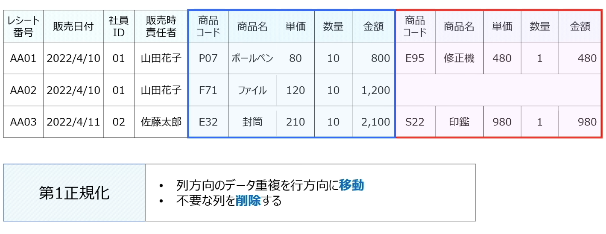

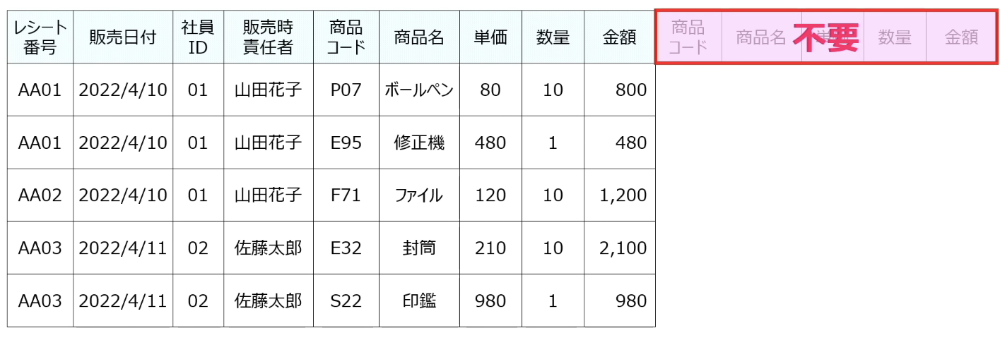

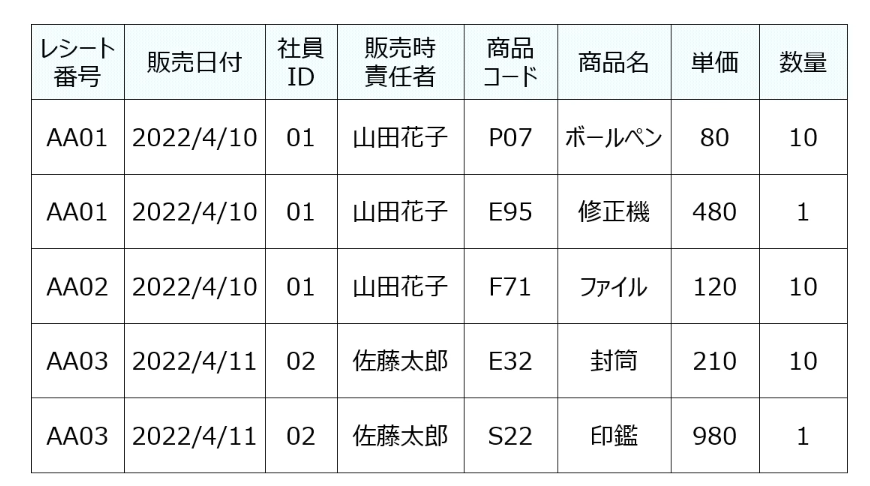

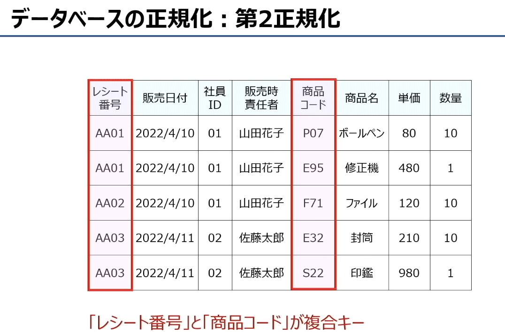

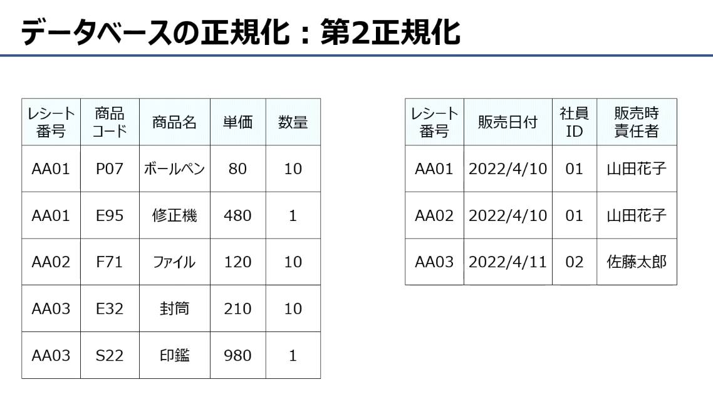

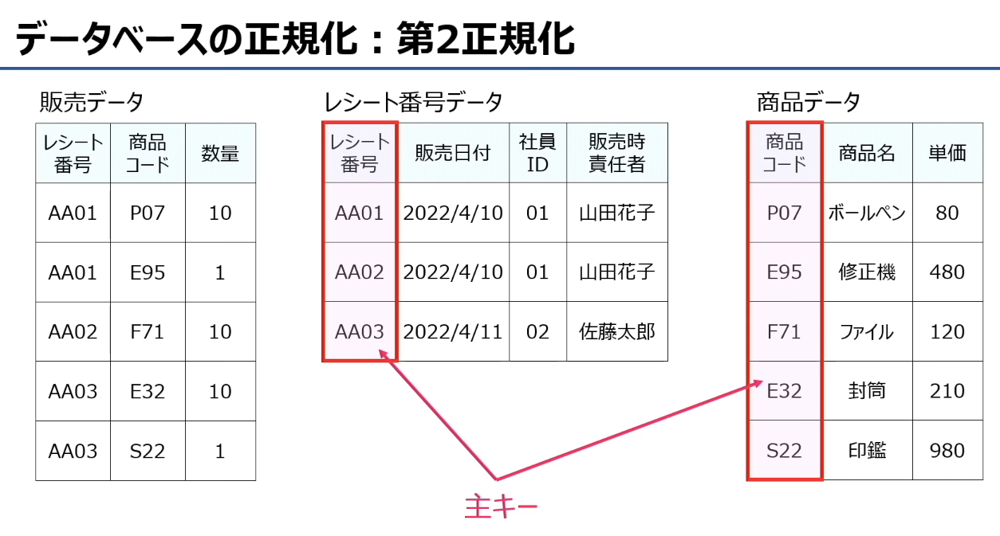

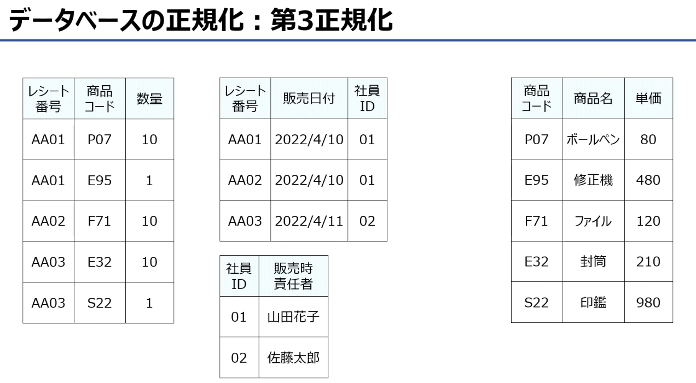


## 1. 関数従属性（函数依赖 / Full Functional Dependency）
### 定义
**主キーの項目だけで列の値が一意に決まる関係**
→ 中文：只靠主键这一个字段，就能唯一确定其他列的值，这种关系叫**函数依赖**。

### 用你的第二张表举例
| 社員ID（主键） | 販売時責任者 |
|----------------|--------------|
| 01             | 山田花子     |
| 02             | 佐藤太郎     |

- 只要知道`社員ID`是`01`，就一定能确定对应的负责人是`山田花子`，不会出现同一个ID对应多个名字的情况。
- 反过来，只要`社員ID`固定，`販売時責任者`就被唯一决定了。
- 这就是典型的**函数依赖**：`社員ID → 販売時責任者`。

---

## 2. 部分関数従属性（部分函数依赖 / Partial Functional Dependency）
### 定义
**複合キーの一部の項目だけで列の値が一意に決まる関係**
→ 中文：只靠复合主键里的一部分字段，就能唯一确定其他列的值，这种关系叫**部分函数依赖**。

### 用你的第一张表举例
这张表的复合主键是 `レシート番号 + 商品コード`
| レシート番号 | 販売日付 | 社員ID | 販売時責任者 | 商品コード | 商品名 | 単価 | 数量 |
|--------------|----------|--------|--------------|------------|--------|------|------|
| AA01         | 2022/4/10| 01     | 山田花子     | P07        | ボールペン | 80 | 10 |
| AA01         | 2022/4/10| 01     | 山田花子     | E95        | 修正機   | 480 | 1 |
| AA02         | 2022/4/10| 01     | 山田花子     | F71        | ファイル | 120 | 10 |

- 只靠复合主键里的`レシート番号`，就能唯一确定`販売日付`、`社員ID`、`販売時責任者`，根本不需要`商品コード`。
- 同样，只靠`商品コード`，就能唯一确定`商品名`和`単価`，也不需要`レシート番号`。
- 只有`数量`这一列，必须同时靠`レシート番号 + 商品コード`才能唯一确定。

所以这里存在的部分函数依赖关系是：
- `レシート番号 → 販売日付、社員ID、販売時責任者`
- `商品コード → 商品名、単価`

---

### 两者的核心区别（一句话总结）
- **関数従属性**：非主键字段，完全依赖**整个主键**（主键是单一字段时的依赖关系）。
- **部分関数従属性**：非主键字段，只依赖**复合主键里的一部分字段**（这是不符合第二范式的根源）。

---

💡 补充：为什么要消除部分函数依赖？
像第一张表这样存在部分函数依赖的表，会出现严重的数据冗余：
- 同一个`レシート番号`对应的`販売日付`、`社員ID`、`販売時責任者`会在每一行重复出现。
- 后续修改负责人信息时，需要修改该订单下的所有商品记录，非常容易出错。
- 第二范式（2NF）的核心目标，就是**消除这种部分函数依赖**，把表拆分成多个独立的表来解决问题。


“一意誓约” 的日语读音是 “いちいつせいやく”（ichiitsu seiyaku），
对应的英文是 “UNIQUE constraint”，中文通常翻译为 “唯一性约束”。

# 复合主键（複合キー）

它是一种主键类型，特点是由多个列（字段）共同组合而成，而不是像普通主键那样只用单一列来唯一标识一条记录。
作用与用途

当单靠一个字段无法唯一区分表中的数据时，就需要用复合主键。
举个例子：订单明细表中，“订单 ID” 和 “商品 ID” 两个字段组合起来，才能唯一确定一行记录（同一个订单里的不同商品）。

# トランザクション処理

### 一、日文汉字读音（罗马音）
- 原子性：げんしせい（genshisei）
- 一貫性：いっかんせい（ikkansēi）
- 隔離性：かくりせい（kakurisei）
- 耐久性：たいきゅうせい（taikyūsei）
- トランザクション：transaction（toranzakushon）
- ACID特性：ACIDとくせい（ACID tokusei）

### 二、ACID 四大特性总结（中日对照+大白话解释）
#### 1. Atomicity（原子性 / げんしせい）
- 日文原文：トランザクションは「全て実行完了」「全く処理されていない」のいずれかであること（中途半端に一部分だけ処理を実施しない）
- 中文翻译：事务必须是“全部执行完成”或“完全未执行”两种状态之一，不允许出现只执行一半的中间状态。
- 大白话：要么全部成功，要么全部失败，不存在“做了一半”的情况。比如转账时，扣款和入账必须同时成功，或者同时失败，不能只扣钱不入账。

#### 2. Consistency（一貫性 / いっかんせい）
- 日文原文：データベースの内容に矛盾が無いこと
- 中文翻译：事务执行前后，数据库的状态必须保持一致，不存在数据矛盾。
- 大白话：事务执行前后，数据都必须符合数据库的约束规则（比如账户余额不能为负）。比如转账前后，两个账户的总金额必须保持不变。

#### 3. Isolation（隔離性 / かくりせい）
- 日文原文：複数のトランザクションを同時に実行しても順番に実行しても結果が等しくなること（トランザクションが相互に影響を及ぼさない）
- 中文翻译：多个事务同时执行，和按顺序单独执行的结果必须完全相同，事务之间不会互相干扰。
- 大白话：并发执行的事务，彼此是隔离的，看不到对方未提交的中间状态，不会被对方的操作影响结果。比如两个同时转账的操作，不会读到对方还没提交的余额数据。

#### 4. Durability（耐久性 / たいきゅうせい）
- 日文原文：障害が発生してもデータベースからデータが消失しないこと
- 中文翻译：事务一旦提交成功，即使后续发生故障（如服务器断电、崩溃），数据也不会丢失。
- 大白话：提交成功的数据，会被永久保存到磁盘中，不会因为系统故障而消失。

---

### 三、一句话总览
ACID 是数据库事务的四大核心保障：
- **原子性**：要么全成，要么全败
- **一致性**：前后数据状态合法不变
- **隔离性**：并发操作互不干扰
- **持久性**：提交成功后数据永久保存

# 排他制御  共有ロック 共享锁  専有ロック 排他锁
- 排他制御（はいたせいぎょ / haita seigy）：排他控制
- 共有ロック（きょうゆうろっく / kyōyū rokku）：共享锁（S锁/读锁）
- 専有ロック（せんゆうろっく / sen'yū rokku）：排他锁（X锁/写锁）

---

### 二、两种锁的定义与对比
#### 1. 共有ロック（共享锁 / 读锁）
- 日文原文：他のユーザーはデータを**見ることは出来るが、更新は出来ない**（データの共有は可能なので共有ロック）
- 中文翻译：其他用户**可以读取数据，但无法修改数据**（因为允许多个用户共享读取，所以叫共享锁）
- 大白话解释：当你给数据加了共享锁，大家都能一起读这条数据，但谁都不能改。适合并发读的场景，避免脏写。

#### 2. 専有ロック（排他锁 / 写锁）
- 日文原文：他のユーザーはデータを**見ることも更新することも出来ない**（データを専有するので専有ロック）
- 中文翻译：其他用户**既不能读取数据，也不能修改数据**（因为数据被当前用户独占，所以叫排他锁）
- 大白话解释：当你给数据加了排他锁，这条数据就被你“占住了”，别人既看不了也改不了，直到你释放锁。适合修改数据的场景，避免并发冲突。

---

### 三、核心区别与记忆方法
| 锁类型 | 其他用户能否读 | 其他用户能否写 | 适用场景 |
| :--- | :--- | :--- | :--- |
| 共有ロック（共享锁） | ✅ 可以 | ❌ 不可以 | 并发读取数据 |
| 専有ロック（排他锁） | ❌ 不可以 | ❌ 不可以 | 修改/写入数据 |

一句话记：
- 共享锁：**大家都能看，谁都不能改**
- 排他锁：**只有我能动，别人看都看不了**

---

### 四、补充小知识（结合ACID里的隔离性）
这两种锁，是数据库实现**隔离性（Isolation）** 的核心手段：
- 多个事务可以同时加共享锁，保证读数据不冲突。
- 只要有一个事务加了排他锁，其他事务都不能再加任何锁，保证写数据不冲突。


四、用这道题帮你再巩固一次范式的解题逻辑
先找传递依赖：把 X → Y → Z 拆成 {X,Y} 和 {Y,Z}，解决 3NF 问题。
再看拆分后的表有没有部分依赖：如果复合主键的表里，有字段只依赖主键的一部分，就继续拆，直到所有字段都完全依赖整个主键。
最终每张表都满足：没有部分依赖、没有传递依赖，只存在直接依赖。

# 锁的粒度 りゅうど

## 一、核心术语读音&翻译
- ロックの粒度（ろっくのりゅうど / rokku no ryūdo）：锁粒度（加锁的范围大小）
- 表単位（ひょうたんい / hyō tan'i）：表级
- 行単位（ぎょうたんい / gyō tan'i）：行级
- ロックの管理（ろっくのかんり / rokku no kanri）：锁管理
- ロックの競合（ろっくのきょうごう / rokku no kyōgō）：锁冲突
- 処理効率（しょりこうりつ / shori kōritsu）：处理效率
- 待ち時間（まちじかん / machi jikan）：等待时间

## 二、两种锁粒度对比总结（中日对照）

## 1. 粒度が大きい（大粒度，例：表级锁）
- 日文：ロックをかける範囲が大きい（表全体にロック）
  中文：加锁的范围大（对整张表加锁）
- 优点（○）：
  日文：ロックの管理が簡単
  中文：锁的管理简单（一次加锁即可，无需管理多个锁）
- 缺点（×）：
  日文：ロックの競合により待ち時間が増え、処理効率低下
  中文：锁冲突导致等待时间增加，处理效率下降（其他事务即使只访问表中不同行，也必须等待锁释放）

## 2. 粒度が小さい（小粒度，例：行级锁）
- 日文：ロックをかける範囲が小さい（行単位にロック）
  中文：加锁的范围小（只对需要修改的行加锁）
- 优点（○）：
  日文：ロックの競合が少なくなり、処理効率向上
  中文：锁冲突减少，处理效率提升（不同事务访问不同行时不会互相阻塞，并发性能好）
- 缺点（×）：
  日文：ロックの管理が困難
  中文：锁的管理复杂（需要为每一行单独加锁/释放锁，开销更大）

## 三、一句话核心记忆
- **大粒度（表级锁）**：管理简单，但并发差、易阻塞，适合批量操作场景。
- **小粒度（行级锁）**：并发好、效率高，但管理复杂，适合高频并发修改场景。

# ストアドプロシージャ
- **ストアドプロシージャ（Stored Procedure）**
  读音：すとあどぷろしーじゃ（sutado puro shīja）
  中文：存储过程，是一组预编译并存储在数据库服务器（DBMS）中的SQL语句集合。

---

### 二、原文翻译与核心说明
日文原文：
> 利用頻度の高いSQL命令群を予めDBMS上に用意しておき、ネットワーク負荷の低減や処理速度向上を実現する（ストアドプロシージャ）

中文翻译：
> 将使用频率高的SQL命令组预先在DBMS（数据库管理系统）中准备好，以此实现降低网络负载、提升处理速度的效果（存储过程）。

---

### 三、存储过程的核心特点与优势
1.  **预编译存储**
    SQL语句提前编译并保存在数据库服务器中，每次调用无需重新解析编译，直接执行，大幅提升处理速度。
2.  **减少网络传输**
    客户端只需发送一次存储过程的调用指令，而不是反复发送多条SQL语句，显著降低网络流量与负载。
3.  **可封装复杂逻辑**
    可以包含条件判断、循环等流程控制，把复杂业务逻辑封装在数据库内部，简化客户端代码。
4.  **便于维护与安全控制**
    集中管理业务逻辑，修改时只需更新存储过程，无需改动客户端；还可以通过权限控制，限制用户直接访问数据表，提升数据安全性。

💡 一句话总结：
存储过程就是**“把常用的SQL脚本提前存在数据库里，客户端只需要‘喊一声’就能执行”**，既省流量又跑得快，还方便维护。


#  ジャーナルファイル 日志文件  バックアップファイル 备份文件
journal file                 backup file

## 一、术语读音&翻译
- ジャーナルファイル：journal file → 日志文件（也叫ログファイル / log file）
- バックアップファイル：backup file → 备份文件
- データベース：database → 数据库
- 更新履歴（こうしんりれき）：更新历史/变更记录
- 定期的（ていきてき）に：定期地

## 二、核心概念解析

## 1. バックアップファイル（备份文件）
- 日文原文：定期的にデータベースの内容をコピーして別ファイルに保管
- 中文：定期将数据库的完整内容复制并保存到独立文件中
- **大白话**：相当于给数据库做“定时快照”，把某一时刻的整个数据库原样复制一份存起来。
- 特点：
  - 是数据库的完整副本，恢复时直接用这个快照还原
  - 适合应对大规模故障（如硬盘损坏、数据库崩溃）
  - 缺点：只能恢复到备份时的状态，备份后的数据会丢失

## 2. ジャーナルファイル（日志文件 / ログファイル）
- 日文原文：更新履歴を記録したファイル
- 中文：记录了所有数据更新历史的文件
- **大白话**：相当于数据库的“操作流水账”，每一次增删改、事务提交/回滚，都会被详细记录下来。
- 特点：
  - 记录了备份之后所有的数据变更操作
  - 可以配合备份文件，把数据恢复到故障发生前的任意状态
  - 也是数据库实现ACID特性中「原子性」和「持久性」的关键

日志文件的核心作用是：记录数据更新前后的值，用于故障恢复（重做 / 回滚操作）。

## 三、两者的分工与组合用法
这张图展示了它们配合工作的完整流程：
1.  **定期备份**：每隔一段时间，生成数据库的完整备份文件
2.  **持续写日志**：备份之后，所有的数据库操作都会被记录到日志文件里
3.  **故障恢复**：
    - 先用备份文件把数据库恢复到最近一次备份的状态
    - 再用日志文件，把备份之后的所有操作“重放”一遍，就能恢复到故障前的最新状态

💡 一句话总结分工：
- **备份文件**：给你一个“基础快照”
- **日志文件**：帮你把备份后的数据变更“补回来”

## 四、补充小知识
- 这种「备份+日志」的恢复方式，就是数据库的**PITR（Point-in-Time Recovery，时间点恢复）**，能把数据恢复到故障前的任意时刻。
- 日志文件还能用来做**事务回滚**：如果事务执行失败，就根据日志里的记录，把已经做过的操作全部撤销，保证数据一致性。

# 更新前ジャーナル 更新前日志 更新後ジャーナル 更新后日志s

### 一、术语读音&翻译
- 更新前ジャーナル（こうしんまえジャーナル / kōshin mae jānaru）：更新前日志（Before Image，BI）
- 更新後ジャーナル（こうしんごジャーナル / kōshin go jānaru）：更新后日志（After Image，AI）
- トランザクション：事务
- ジャーナルファイル：日志文件（Journal/Log File）

---

### 二、核心概念解析
#### 1. 更新前ジャーナル（更新前日志）
- 日文定义：処理を更新する前の状態を記録するジャーナル
- 中文：记录数据被修改**之前**的原始状态
- 作用：用于**事务回滚（Undo）**。如果事务执行失败，就可以根据这份日志，把数据恢复到修改前的状态，保证原子性。
- 大白话：相当于修改数据前，先拍一张“旧照片”，万一改坏了，就能用这张照片还原回去。

#### 2. 更新後ジャーナル（更新后日志）
- 日文定义：処理を更新した後の状態を記録するジャーナル
- 中文：记录数据被修改**之后**的最新状态
- 作用：用于**故障恢复（Redo）**。如果事务提交成功后数据库崩溃，就可以根据这份日志，把修改后的状态重新写入数据库，保证持久性。
- 大白话：修改数据后，再拍一张“新照片”，万一数据库崩了，就能用这张照片把最新状态恢复出来。

---

### 三、两者配合的完整流程（结合事务）
1.  事务开始修改数据前，先记录**更新前日志**（旧数据）
2.  执行数据修改操作
3.  事务提交后，记录**更新后日志**（新数据）

- 若事务中途失败：用更新前日志把数据恢复到修改前 → 事务回滚
- 若事务提交后数据库崩溃：用更新后日志把修改重新应用 → 数据恢复

---

💡 一句话总结分工：
- **更新前日志（Undo）**：负责“反悔”，保证数据可以回滚到修改前
- **更新后日志（Redo）**：负责“兑现”，保证修改后的状态能被永久保存


# コミット（Commit）

### 一、术语读音&翻译
- コミット：commit → 提交
- ロールバック：rollback → 回滚
- トランザクション：transaction → 事务
- 原子性（げんしせい / genshisei）：Atomicity（ACID特性之一）
- 更新前ジャーナル：更新前日志（Undo Log）
- 更新後ジャーナル：更新后日志（Redo Log）

### 二、核心概念解析
#### 1. コミット（Commit / 提交）
- 日文定义：トランザクション内の一連の処理が全て更新できたことを確認して初めてデータベースに更新内容を反映（処理が全て反映される）
- 中文翻译：确认事务内的所有处理都成功执行后，才将更新内容永久写入数据库（所有处理全部生效）。
- 大白话：事务执行成功的“确认按钮”。只有执行了 `COMMIT`，事务中的所有修改才会真正生效，别人才能看到。
- 关键作用：
  - 保证事务的**原子性**：事务要么全部成功提交，要么全部不提交。
  - 保证数据的**持久性**：提交后的数据会被永久保存，即使系统崩溃也不会丢失。
  - 触发更新后日志（Redo Log）的写入，记录最终状态。

#### 2. ロールバック（Rollback / 回滚）
処理の途中で障害が発生した場合は更新前ジャーナルを使用して、トランザクション処理開始直前の状態に戻す（処理が一切反映されない）
- 隐含定义（配合原子性理解）：如果事务中途失败，就取消所有已执行的修改，将数据恢复到事务开始前的状态。
- 大白话：事务执行失败的“撤销按钮”。执行了 `ROLLBACK`，事务里做过的所有修改都会被作废，就像什么都没发生过一样。
- 关键作用：
  - 保证事务的**原子性**：事务失败时，不会留下“做了一半”的脏数据。
  - 依赖更新前日志（Undo Log）：根据日志里记录的修改前状态，把数据恢复回去。

### 三、两者与原子性的关系（核心逻辑）
这张图的核心就是体现事务的**原子性**：
> 数据库对事务内的更新，要么全部反映（Commit），要么完全不反映（Rollback），不存在中间状态。

完整的事务执行流程是：
1.  事务开始，修改数据前：写入**更新前日志（Undo Log）**，记录原始状态。
2.  执行事务内的所有修改操作。
3.  若所有操作都成功：执行 `COMMIT`，写入**更新后日志（Redo Log）**，修改永久生效。
4.  若中途失败：执行 `ROLLBACK`，根据更新前日志恢复数据，所有修改作废。

---

### 四、一句话总结
- **コミット（Commit）**：事务成功的“确认键”，让所有修改永久生效。
- **ロールバック（Rollback）**：事务失败的“撤销键”，把所有修改全部作废。
- 它们共同保证了事务的**原子性**，让数据库永远处于“要么全成、要么全败”的一致状态。

---

💡 举个转账的例子帮你理解：
- 事务：A账户扣100元，B账户加100元。
- 如果两步都成功：执行 `COMMIT`，双方余额更新，转账完成。
- 如果A扣了钱，但B加钱时失败了：执行 `ROLLBACK`，把A的余额恢复回去，就像这次转账从没发生过。


# ロールフォワード（前滚恢复）

### 一、术语读音&翻译
- データベースの復元（データベースのふくげん）：数据库恢复
- ロールフォワード：Roll-forward → 前滚恢复
- バックアップファイル：备份文件
- 更新後ジャーナル：更新后日志（Redo Log）
- システム障害：系统故障
- データ破損：数据损坏

---

### 二、核心概念解析：ロールフォワード（前滚恢复）
#### 1. 日文原文
> システム障害発生時等によりデータが破損した際は、バックアップファイルと更新後ジャーナルを使用してデータベースを復元する（ロールフォワード）

#### 2. 中文翻译
当发生系统故障导致数据损坏时，使用**备份文件**和**更新后日志（Redo Log）**来恢复数据库，这种恢复方式称为**前滚恢复（Roll-forward）**。

---

### 三、前滚恢复的完整流程（结合图示）
这张图清晰展示了恢复的三个关键步骤：
1.  **第一步：用备份文件恢复基础数据**
    - 日文：バックアップファイル（定期的にコピーした予備データ）
    - 中文：使用定期备份的文件，将数据库恢复到**最近一次备份完成时的状态**。
    - 大白话：先把数据库“重置”到上一次备份的快照状态。

2.  **第二步：用更新后日志“重放”后续操作**
    - 日文：更新後ジャーナル（バックアップ取得後に更新されたトランザクション処理のデータ）
    - 中文：根据备份完成后记录的更新后日志，将所有已提交的事务操作重新执行一遍。
    - 大白话：把备份之后发生的所有数据修改，再按顺序重做一次。

3.  **最终结果：恢复到故障前的最新状态**
    经过以上两步，数据库就能恢复到故障发生前的最新一致状态，不会丢失备份后提交的数据。

---

### 四、核心特点与作用
- **核心作用**：解决系统崩溃、数据损坏等大规模故障，实现数据的完整恢复。
- **关键依赖**：必须同时有「备份文件」和「更新后日志」才能完成前滚恢复。
- **与回滚（Rollback）的区别**：
  - **Rollback（回滚）**：事务中途失败时，用更新前日志撤销操作，让数据回到事务开始前的状态。
  - **Roll-forward（前滚）**：系统崩溃时，用备份文件+更新后日志重做操作，让数据前进到故障前的最新状态。

---

💡 一句话总结：
前滚恢复就是**“先把数据库恢复到备份快照，再用更新后日志把备份后的操作重做一遍”**，以此实现从备份时间点到故障时间点的完整数据恢复。


#  分散データベース 分布式数据库  2相コミット 两阶段提交协议

## 一、术语读音&翻译
- 分散データベース（ぶんさんデータベース / bunsan dētabēsu）：分布式数据库
- 2相コミット（にそうコミット / nisō komitto）：两阶段提交协议（2PC）
- トランザクション：事务
- コミット：提交
- ロールバック：回滚

---

## 二、第一张图：分散データベース（分布式数据库）
### 核心定义
> 複数のデータベースを見かけ上1つのデータベースとして扱うことが可能（分散データベース）

翻译：可以把多个独立的数据库，对外**伪装成一个统一的数据库**来使用，用户完全感觉不到背后是分散的多个节点。

### 大白话解释
就像你用手机银行转账时，钱可能存在北京的服务器，余额存在上海的服务器，但你操作时只看到一个“银行账户”，不用管数据具体存在哪。
- 客户端只需要和中间的协调节点交互，由它来和各个分散的数据库节点通信。
- 好处：可以分担负载、提高系统可用性，避免单点故障。
- 难点：如何保证跨多个节点的事务，要么全部成功，要么全部失败（原子性），这就需要**两阶段提交协议**来解决。

---

## 三、第二张图：2相コミット（两阶段提交协议）
### 原文翻译
> この際、全データベースにコミット可能か確認して、コミットorロールバックを実施（2相コミット）

翻译：分布式事务执行时，会先向所有数据库确认“是否可以提交”，再统一执行提交或回滚操作，这就是两阶段提交协议（2PC）。

### 两阶段提交的完整流程
它分为两个核心阶段，完美解决分布式事务的原子性问题：

#### 第1阶段：準備フェーズ（准备阶段 / 投票阶段）
- 协调者（中间节点）向所有数据库节点发送「准备提交」请求。
- 每个节点执行事务的修改，但不真正提交，只写入日志。
- 节点向协调者回复「OK，可以提交」或「NO，无法提交」。

#### 第2阶段：コミットフェーズ（提交阶段 / 执行阶段）
- **情况1：所有节点都回复OK**
  协调者向所有节点发送「提交」指令，所有节点正式提交事务，释放资源。
- **情况2：只要有一个节点回复NO**
  协调者向所有节点发送「回滚」指令，所有节点撤销之前的修改，恢复到事务开始前的状态。

## 四、两者的关系与一句话总结
- **分散データベース**：是把数据分散存放在多个节点的系统架构，对外表现为一个整体。
- **2相コミット**：是保证分布式事务原子性的核心协议，确保跨节点的事务“要么全成，要么全败”。

一句话总结：
**分布式数据库让数据分散存储，而两阶段提交协议让分散的事务保持原子性，不会出现“部分节点提交、部分节点失败”的不一致状态。**

💡 举个转账的例子帮你理解：
用户要从A银行（北京节点）转100元到B银行（上海节点）：
1.  准备阶段：两个节点都检查自己余额足够，回复“可以提交”。
2.  提交阶段：协调者收到两个OK，同时通知两边扣钱、加钱，事务成功。
3.  如果上海节点加钱失败，协调者就会通知北京节点把扣的钱加回去，整个转账完全回滚，不会出现“钱扣了但对方没收到”的情况。

# 選択 射影 結合
## 一、术语读音&翻译
- 関係演算（かんけいえんざん / kankei enzan）：关系代数
- 選択（せんたく / sentaku）：选择（Selection）
- 射影（しゃえい / shaei）：投影（Projection）
- 結合（けつごう / ketsugō）：连接（Join）

## 二、三个核心操作解析
### 1. 選択（选择）
- **日文定义**：特定の行を取り出す
- **中文翻译**：根据条件筛选表中的特定行
- **大白话**：按“行”过滤数据，只留下你想要的记录。
- **例子**：原表有4条销售记录，筛选条件是「販売日 = 22/4/2」，最终只留下了PO012和PO013这两行记录。
- **对应SQL**：`SELECT * FROM 表名 WHERE 条件;`

### 2. 射影（投影）
- **日文定义**：特定の列を取り出す
- **中文翻译**：提取表中的特定列
- **大白话**：按“列”过滤数据，只保留你需要的字段。
- **例子**：原表有「販売ID、販売日、商品名」三列，投影操作只保留了「販売ID、販売日」两列，去掉了「商品名」列。
- **对应SQL**：`SELECT 列1, 列2 FROM 表名;`

### 3. 結合（连接，图中是等值连接）
- **日文定义**：表を結合する
- **中文翻译**：将两张表根据共同字段合并成一张新表
- **大白话**：把两张表“拼”在一起，比如用共同的「商品名」字段，把销售表和商品单价表合并，得到一张同时包含销售信息和单价的完整表。
- **例子**：左边的销售表和右边的单价表，通过「商品名」匹配，合并成一张包含「販売ID、販売日、商品名、単価」的新表。
- **对应SQL**：`SELECT * FROM 表1 JOIN 表2 ON 表1.共通列 = 表2.共通列;`

## 三、一句话总记法
- **選択**：按行挑记录（横向过滤）
- **射影**：按列挑字段（纵向过滤）
- **結合**：按共同字段拼表（表与表合并）

💡 举个生活中的例子帮你理解：
你手里有一张「学生信息表」（学号、姓名、班级、成绩）
- **選択**：筛选出“班级=3班”的学生（挑行）
- **射影**：只保留“学号、姓名、成绩”三列（挑列）
- **結合**：把学生表和「班级表」按“班级号”合并，得到带班主任信息的完整表（拼表）


# ビュー表（ビューひょう /view 表）：视图（View）

### 一、术语读音&翻译
- 関係演算（かんけいえんざん）：关系代数
- ビュー表（ビューひょう / view表）：视图（View）
- 仮想的（かそうてき）：虚拟的
- 一時的（いちじてき）：临时的

### 二、原文翻译
> 関係演算を用いて好きな列や行で仮想的に一時的なテーブル（＝ビュー表）を作成することが出来る
→ 使用关系代数（选择、投影、连接等操作），可以根据需要的列和行，创建一个**虚拟的临时表（=视图）**。

### 三、核心概念解析：ビュー（视图）
#### 1. 什么是视图？
- 视图不是真正存在于数据库中的物理表，而是**基于一个或多个基表，通过关系运算定义的“虚拟表”**。
- 它本身不存储数据，每次查询视图时，都会执行定义它的SQL语句，从基表中动态生成结果。

#### 2. 结合关系代数理解
视图本质上就是对基表执行「选择（选行）、投影（选列）、连接（拼表）」等关系运算的结果，被保存下来供重复使用。
- 比如：用投影选列、用选择过滤行，再连接两张表，把这个操作的结果保存为视图，下次直接查询视图就能得到同样的结果，不用每次都写复杂的SQL。

#### 3. 视图的主要特点与作用
- **虚拟性**：数据不实际存储，只保存定义，基表数据变化时，视图结果也会同步更新。
- **简化查询**：把复杂的多表连接、筛选逻辑封装成视图，用户直接查询视图即可，不用重复写SQL。
- **数据安全**：可以通过视图限制用户只能看到指定的列/行，隐藏敏感数据（比如只给用户看姓名和部门，隐藏手机号和薪资）。

### 四、一句话总结
视图就是用关系代数操作定义的**虚拟表**，它不存数据，只存查询逻辑，能帮你简化查询、隐藏数据细节。


# SELECT文
**原文：**
`SELECT文：レコードやカラムを選択するコード`
**中文翻译：**
`SELECT语句：用于选择记录（行）和列（字段）的代码`

### 补充说明
- **SELECT文（セレクトぶん）**：SQL中的查询语句，是关系数据库中最核心的命令之一。
- **レコード（record）**：数据库表中的“行”，也叫记录。
- **カラム（column）**：数据库表中的“列”，也叫字段。

结合之前讲过的关系代数：
- `SELECT` 语句同时实现了**射影（选列）**和**選択（选行）**两种操作。
  - `SELECT 列名 FROM 表名` → 射影（只选需要的列）
  - `SELECT * FROM 表名 WHERE 条件` → 选择（按条件选行）


アスタリスク  星号（*） 


# 做题笔记

我们先把题目里的「属性」讲清楚，再帮你分析这道题。

---

## 一、关系模型里的「属性」到底是什么？
在数据库的**关系模型（リレーショナルモデル）**中，「属性」（Attribute）可以直接理解为**数据表的“列”**。

举个最常见的例子：
我们有一张「员工」表，结构是这样的：

| 员工ID | 姓名 | 部门 | 入职日期 |
|--------|------|------|----------|
| 001    | 山田 | 开发部 | 2020/04/01 |
| 002    | 佐藤 | 财务部 | 2021/07/01 |

这里的**员工ID、姓名、部门、入职日期**，每一个都是一个「属性」。
- 每个属性都有自己的**名称**（比如“姓名”）
- 也有自己的**定义域（データ型/ドメイン）**（比如“姓名”只能是文本，“入职日期”只能是日期类型）

## 二、结合题目选项，帮你理解属性的基本规则
我们把每个选项都翻译并解释一下，你就能更清楚属性的特性了：

### ア 関係内の属性の定義域は重複してはならない
→ 翻译：关系中属性的定义域不能重复。
→ 解释：错误。定义域是可以重复的，比如“员工ID”和“部门ID”都可以定义为整数类型，这完全没问题。

### イ 関係内の属性の並び順に意味はなく、順番を入れ替えても同じ関係である
→ 翻译：关系中属性的排列顺序没有意义，调换顺序后仍是同一个关系。
→ 解释：正确。这正是关系模型的基本特性之一——**属性的顺序无关性**。
比如把「姓名」和「部门」两列调换位置，这张表还是原来的员工表，数据的含义和关系都没有改变。

### ウ 関係内の二つ以上の属性に、同じ名前を付けることができる
→ 翻译：关系中可以给两个以上的属性起相同的名字。
→ 解释：错误。在同一个关系（同一张表）里，**属性名必须唯一**，否则无法区分。比如不能同时有两个都叫“姓名”的列。

### エ 名前をもたない属性を定義することができる
→ 翻译：可以定义没有名字的属性。
→ 解释：错误。关系模型中，每个属性都必须有唯一的名称，没有名字就无法引用和操作。

## 三、再帮你提炼一下关系模型中「属性」的核心特点
1.  每个属性都有**唯一的名称**，同一表中不能重名，也不能无名。
2.  每个属性都有固定的**定义域（数据类型）**，但不同属性的定义域可以相同。
3.  属性在表中的**排列顺序不影响关系本身**，顺序是无关紧要的。


我们来把这道题的知识点和选项都拆解清楚，顺便帮你彻底理解「三层模式架构」的核心作用。

---

### 一、题目翻译与核心问题
**题目原文**：DBMS が、3層スキーマアーキテクチャを採用する目的として、適切なものはどれか。
**翻译**：DBMS（数据库管理系统）采用三层模式架构的目的，正确的是哪一个？

旁边的提示也写得很明白：
> 【見た目・データ構造・物理的構造】に分けてデータベースを設計し、独立性向上
> 把数据库分为「用户视图/数据逻辑结构/物理存储结构」三层来设计，目的是**提高数据独立性**。

---

### 二、三层模式架构的核心：数据独立性
三层模式架构的根本目的，就是实现**数据独立性**，分为两个关键部分：
1.  **物理数据独立性**：修改数据的物理存储方式（比如换硬盘、改文件格式），不会影响上层的逻辑结构和应用程序。
2.  **逻辑数据独立性**：修改全局的逻辑结构（比如新增字段、调整表关系），不会影响用户看到的视图和应用程序。

---

### 三、选项逐一解析
#### ア：関係演算によって元の表から新たな表を導出し、それが実在しているように見せる。
翻译：通过关系运算从原表导出新表，让它看起来像是真实存在的。
- 这描述的是**视图（View）**的功能，和三层模式架构的目的无关。错误。

#### イ：対話的に使われるSQL文を、アプリケーションプログラムからも使えるようにする。
翻译：让交互使用的SQL语句，也能被应用程序调用。
- 这是**嵌入式SQL/预编译**的功能，不是三层架构的目的。错误。

#### ウ：データの物理的な格納構造を変更しても、アプリケーションプログラムに影響が及ばないようにする。
翻译：即使修改了数据的物理存储结构，也不会影响应用程序。
- 这正是**物理数据独立性**的核心效果，也是三层架构的关键目的之一。正确✅

#### エ：プログラム言語を限定して、アプリケーションプログラムとDBMSを緊密に結合する。
翻译：限定编程语言，让应用程序和DBMS紧密结合。
- 三层架构的目的是**解耦**（降低依赖），而不是“紧密结合”。错误。

---

### 四、一句话总结
三层模式架构的核心目的，就是**通过分层隔离，让物理存储和逻辑结构的变化，都不会影响上层的应用程序**，也就是实现数据独立性。


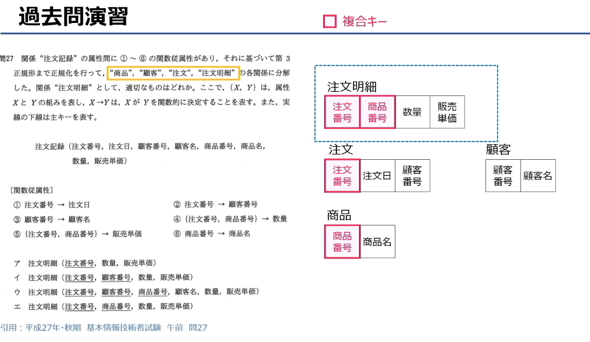

## 1. 先读懂题目
题目大意：
关系“注文記録（订单记录）”存在6个函数依赖，根据这些依赖，把它按第3范式分解成了“商品”“顧客”“注文”“注文明細（订单明细）”四张表。问：**“注文明細”表的正确结构是哪个？**

已知：
- `X→Y`：X 函数决定 Y（知道X就能唯一确定Y）
- 实体下画的线代表主键
- 选项：ア、イ、ウ、エ 四个结构

---

## 2. 分析函数依赖，理清依赖关系
先把题目给的6个依赖关系列出来：
1.  `注文番号 → 注文日`
2.  `注文番号 → 顧客番号`
3.  `顧客番号 → 顧客名`
4.  `{注文番号, 商品番号} → 数量`
5.  `{注文番号, 商品番号} → 販売単価`
6.  `商品番号 → 商品名`

---

## 3. 按第三范式拆分表的逻辑
第三范式的核心是：**消除传递依赖和部分依赖**，让每个表只存和主键直接相关的数据。

我们一步步拆分：
- **顧客表**：`顧客番号 → 顧客名`
  主键是顧客番号，只存顾客相关信息，所以这张表是：`顧客(顧客番号, 顧客名)`

- **商品表**：`商品番号 → 商品名`
  主键是商品番号，只存商品相关信息，所以这张表是：`商品(商品番号, 商品名)`

- **注文表**：`注文番号 → 注文日`、`注文番号 → 顧客番号`
  主键是注文番号，只存订单相关信息，所以这张表是：`注文(注文番号, 注文日, 顧客番号)`

- **注文明細表**：
  剩下的依赖是：`{注文番号, 商品番号} → 数量`、`{注文番号, 商品番号} → 販売単価`
  这两个属性，都必须**同时依赖注文番号和商品番号**，也就是复合主键。
  所以“注文明細”的结构，主键是 `{注文番号, 商品番号}`，只存和这个复合主键直接相关的字段：`数量` 和 `販売単価`。

---

## 4. 对照选项，选出答案
我们来看四个选项：
- ア：`注文明細(注文番号, 数量, 販売単価)`
  主键只有注文番号，无法唯一确定不同商品的数量/单价，错误。
- イ：`注文明細(注文番号, 顧客番号, 数量, 販売単価)`
  顧客番号已经在“注文”表里了，属于冗余数据，而且它不依赖复合主键，错误。
- ウ：`注文明細(注文番号, 顧客番号, 商品番号, 顧客名, 数量, 販売単価)`
  顧客番号、顧客名都是顾客表的字段，冗余且存在传递依赖，错误。
- エ：`注文明細(注文番号, 商品番号, 数量, 販売単価)`
  主键是复合主键`{注文番号, 商品番号}`，且只包含依赖这个主键的字段，完全符合第三范式，**正确**✅

## 5. 解题总结（通用思路）
遇到这类规范化题目，可以按这个步骤来：
1.  把所有函数依赖列出来，分清谁决定谁。
2.  把单一主键决定的属性，分到各自的主表里（比如顾客、商品、订单）。
3.  剩下的、必须由复合主键才能决定的属性，才属于明细表。
4.  明细表不能包含其他主表的冗余字段，否则就不符合第三范式。


### 一、术语读音&释义
- ロック：锁（rokku）
- 粒度（りゅうど / ryūdo）：粒度，指锁的覆盖范围（从大到小：表级→页级→行级）
- トランザクション：事务（toranzakushon / transaction）
- スループット：吞吐量（surūputto / throughput），指系统单位时间内能处理的事务数量
- 待ち（まち / machi）：等待（指事务因锁冲突而阻塞等待）
- 同時実行（どうじじっこう / dōji jikkō）：并发执行
- 参照（さんしょう / sanshō）：读取、引用数据

### 二、选项原文+翻译
**题目**：关于锁粒度的说明中，正确的是哪一项？

- **ア**
  原文：データを更新するときに、粒度を大きくすると、他のトランザクションの待ちが多くなり、全体のスループットが低下する。
  翻译：更新数据时，如果增大锁的粒度（比如从行锁改成表锁），其他事务的等待会增多，整体吞吐量会下降。

- **イ**
  原文：同一のデータを更新するトランザクション数が多いときに、粒度を大きくすると、同時実行できるトランザクション数が増える。
  翻译：当更新同一数据的事务很多时，如果增大锁粒度，能并发执行的事务数量会增加。

- **ウ**
  原文：表の全データを参照するときに、粒度を大きくすると、他のトランザクションのデータ参照を妨げないようにできる。
  翻译：当读取整张表的数据时，如果增大锁粒度，就可以不影响其他事务的数据读取。

- **エ**
  原文：粒度を大きくすると、含まれるデータ数が多くなるので、一つのトランザクションでかけるロックの個数が多くなる。
  翻译：增大锁粒度后，锁覆盖的数据变多，因此单个事务需要加的锁的数量也会变多。

---

### 三、核心解析&答案
正确选项是 **ア（A）**，原因：
- 锁粒度越大，一次锁定的数据范围越广（比如表锁），并发的事务就越容易被阻塞等待，系统整体吞吐量会下降，所以A的描述是正确的。
- イ错误：粒度变大，会导致并发执行的事务数减少，而不是增加。
- ウ错误：表级的大粒度锁会阻塞其他事务的读取操作，无法做到不影响。
- エ错误：粒度越大，单个事务需要加的锁的数量反而越少（比如一个表锁，只需要加1个锁，而不是给每一行加锁）。

---

💡 一句话记住锁粒度的影响：
**粒度越大，并发越差，吞吐量越低；粒度越小，并发越好，但锁管理的开销越高。**


### 一、核心术语对照（日文→中文）
- DBMS（DataBase Management System）：データベース管理システム → 数据库管理系统
- ロック：锁
- トランザクション：事务
- アクセス：访问
- 不整合：不一致（数据冲突）
- 排他制御：排他控制（并发控制）
- 専有ロック：排他锁（写锁）
- 共有ロック：共享锁（读锁）
- ロックの粒度：锁粒度（锁的覆盖范围）
- 行（レコード）単位：行（记录）级
- 表（ブロック）単位：表（块）级
- データベース単位：数据库级
- 競合する：发生冲突
- 待ち時間：等待时间
- スループット：吞吐量

### 二、知识点总结（中日对照）

1.  **ロック的基本定义与目的**
    日文：ロックはDBMSが同一データに複数のトランザクションがアクセスし不整合が起こらないようにする排他制御で用いられる。
    中文：锁是数据库管理系统（DBMS）中，为防止多个事务同时访问同一数据而导致数据不一致，所采用的排他控制机制。

2.  **ロック的工作机制**
    日文：アクセスするデータにロックをかけると、他のトランザクションからのアクセスを制限することができる。アクセスが終了するとロックを解放し他のトランザクションからのアクセスが可能になる。
    中文：对要访问的数据加锁后，可以限制其他事务的访问；访问结束后释放锁，其他事务才能访问该数据。

3.  **两种ロック的适用场景与规则**
    日文：データを更新する場合は、他のトランザクションからの参照も更新も許可しない専有ロックをかけ、参照だけの場合は他のトランザクションからの更新は許可しないが参照だけは許可する共有ロックをかける。共有ロックの場合は他のトランザクションからの共有ロックも可能である。
    中文：
    - 更新数据时：使用**排他锁（写锁）**，不允许其他事务读取或修改该数据。
    - 仅读取数据时：使用**共享锁（读锁）**，不允许其他事务修改，但允许其他事务同时加共享锁读取。

4.  **ロックの粒度的定义**
    日文：ロックをかける範囲には、行（レコード）単位、表（ブロック）単位、データベース単位、などがありこれをロックの粒度と呼ぶ。
    中文：加锁的范围包括行（记录）级、表（块）级、数据库级等，这个范围的大小被称为**锁粒度**。

5.  **粒度が小さい場合（如行级锁）的特点**
    日文：更新処理の場合、行単位のようにロックの粒度が小さければ別のデータを利用する他のトランザクションと競合する可能性は少なくなり待ち時間は短くなる。
    中文：在更新操作中，如果锁粒度小（如行级锁），其他访问不同数据的事务发生冲突的概率会降低，等待时间也会缩短。

6.  **粒度が大きい場合（如表级锁）的特点**
    日文：表全体のように粒度を大きくするとアクセスする対象のデータ以外に多くのデータを専有ロックするため他のトランザクションがロック解除されるまでの待ちが長くなり、全体のスループットが低下する。
    中文：如果锁粒度变大（如整个表级锁），会对访问对象以外的大量数据也加上排他锁，导致其他事务需要长时间等待锁释放，整体系统的吞吐量会下降。

7.  **粒度与ロック数的关系**
    日文：一つのトランザクションが一つの表の三つのデータを処理する場合を考えると、粒度の小さい行単位でロックをかけると3個のロックをかけることになり、粒度の大きい表全体にロックをかけた場合は1個のロックで済む。したがって、粒度を大きくすると一つのトランザクションでかけるロックの個数は少なくなる。
    中文：假设一个事务要处理一张表中的3条数据：
    - 粒度小（行级锁）：需要加3个锁。
    - 粒度大（表级锁）：只需要加1个锁。
    因此，锁粒度越大，单个事务需要加的锁的数量就越少。

---

💡 一句话总结锁粒度的核心权衡：
粒度越小 → 并发性能越好、等待时间越短，但锁管理开销越大；
粒度越大 → 锁管理开销越小，但并发性能越差、吞吐量越低。

## 题目

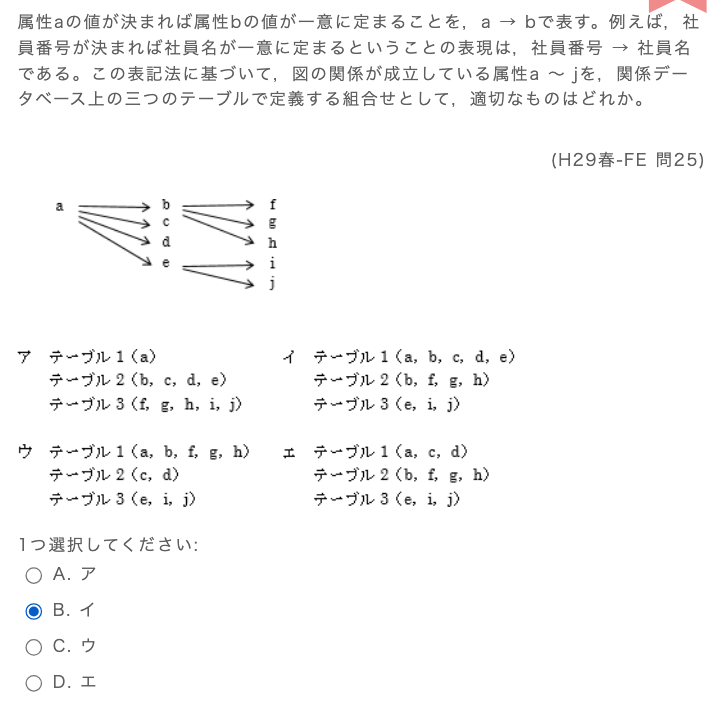

你的判断是**正确的**，选项B（イ）就是这道题的正确答案。我帮你一步步拆解一下，顺便帮你巩固这类范式拆分题的解题逻辑。

## 1. 先理清所有函数依赖关系
题目里的箭头表示 `X→Y`（X函数决定Y），所以我们先把所有依赖列出来：
- `a → b`、`a → c`、`a → d`、`a → e`
- `b → f`、`b → g`、`b → h`
- `e → i`、`e → j`

## 2. 按3NF的要求拆分表
第三范式的核心是：**消除传递依赖，让每个表的非主属性都直接依赖主键**。我们按依赖层级拆分：

1.  **第一层：主表（主键a）**
    `a` 直接决定 `b、c、d、e`，所以这几个属性必须在同一张表里：
    `テーブル1 (a, b, c, d, e)`

2.  **第二层：依赖b的表（主键b）**
    `f、g、h` 由 `b` 直接决定，而 `b` 由 `a` 间接决定，为了消除传递依赖 `a→b→{f,g,h}`，需要把它们拆分到独立的表：
    `テーブル2 (b, f, g, h)`

3.  **第三层：依赖e的表（主键e）**
    `i、j` 由 `e` 直接决定，而 `e` 由 `a` 间接决定，为了消除传递依赖 `a→e→{i,j}`，也需要拆分到独立的表：
    `テーブル3 (e, i, j)`

## 3. 对照选项验证
拆分后的三张表正好对应选项**イ（B）**：
- テーブル1 (a, b, c, d, e)
- テーブル2 (b, f, g, h)
- テーブル3 (e, i, j)

其他选项的错误原因：
- ア：拆分逻辑混乱，`a` 单独成表，依赖关系被破坏。
- ウ：把 `b` 和 `f,g,h` 直接跟 `a` 放一起，存在传递依赖，不满足3NF。
- エ：把 `a` 和 `c,d` 放一起，`b` 和 `f,g,h` 放一起，但 `a` 和 `b` 被拆分，无法维护 `a→b` 的依赖关系。

💡 这类题的通用解题技巧：
1.  **先找根节点（候选键）**：这道题里 `a` 是唯一的根节点，所有属性最终都由它决定。
2.  **按传递依赖分层拆分**：`X→Y→Z` 就拆成 `{X,Y}` 和 `{Y,Z}`，每层一个表。
3.  **检查所有依赖是否都被正确维护**：不能出现依赖关系被拆分破坏的情况。


## 题目

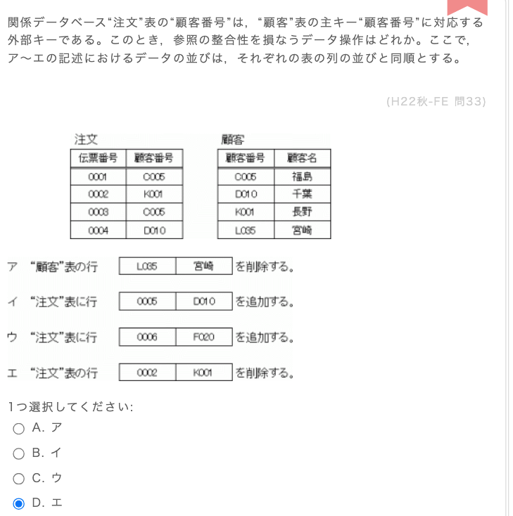

不对哦，你选的D是错误的，正确答案是**C（ウ）**。我帮你把这道题的逻辑和参照完整性的概念讲清楚：

---

## 1. 先理解题目核心
题目说：
- 「注文」表的「顧客番号」，是「顧客」表主键「顧客番号」的**外部键（外键）**。
- 问：哪个操作会破坏**参照整合性（参照完整性）**？

参照完整性的核心规则是：
> 外键的值，必须在对应的主表主键中存在，或者为 NULL（本题无 NULL 场景）。
换句话说：**订单里的客户编号，必须是客户表里已经存在的客户编号。**

---

## 2. 分析每个选项
先看两张表的数据：
- 顧客表存在的顧客番号：`C005`、`D010`、`K001`、`L035`
- 注文表存在的顧客番号：`C005`、`K001`、`D010`

### ア（A）：删除顧客表的 `L035`
- 注文表里没有任何订单用到 `L035`，删除它不会影响参照完整性，操作合法。

### イ（B）：向注文表追加 `(0005, D010)`
- `D010` 是顧客表里存在的编号，追加合法，不会破坏参照完整性。

### ウ（C）：向注文表追加 `(0006, F020)`
- `F020` 这个顧客番号，**在顧客表里根本不存在**。
- 外键引用了不存在的主键值，**直接违反了参照完整性**，这就是题目要找的违规操作。

### エ（D）：删除注文表的 `(0002, K001)`
- 只是删除一条订单记录，不影响外键引用的合法性，也不会破坏参照完整性，操作合法。

---

## 3. 为什么你会误选D？
你可能混淆了「删除订单」和「删除客户」的影响：
- 删除**订单表的记录**：不会影响参照完整性（只是少了一条引用）。
- 删除**客户表的记录**：如果有订单引用了这个客户，才会破坏参照完整性（需要级联删除或限制删除）。

这道题里D是删除订单，完全没问题；而C是新增了一个不存在的客户编号，直接破坏了规则。

---

💡 记住参照完整性的两条铁律：
1.  **新增/修改外键值时**：必须在主表中存在对应主键值。
2.  **删除主表主键时**：不能有外键引用它，否则必须做级联删除或禁止删除。


# 题目

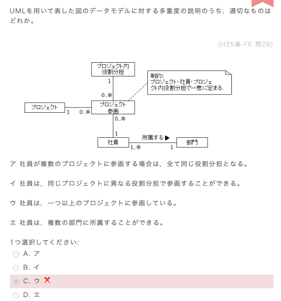
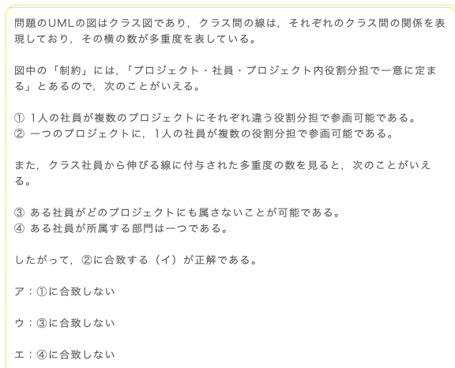

「参画」さんかく / sankaku
参与、加入（某个项目/计划/事业），并且通常带有“积极参与、作为成员贡献”的意思。
比普通的「参加（さんか）」更正式，常用于工作、公司、项目场景。


一意に定まる
读音：いちい に さだまる（ichii ni sadamaru）
意思：
唯一确定 / 被唯一决定 / 唯一地定下来

我们先把这道题涉及的**UML类图多重度**知识点讲透，再一步步分析题目，帮你搞懂为什么正确答案是B（イ）。

---

## 一、核心知识点：UML类图的多重度（Multiplicity）
多重度表示**两个类之间可以建立多少个关联实例**，写在关联线的两端，靠近被关联的类。

### 常见多重度符号含义
| 符号 | 含义（A→B的关联） | 例子 |
| :--- | :--- | :--- |
| `1` | 必须有且仅有1个实例 | 每个员工必须属于1个部门 |
| `0..1` | 0个或1个（可选） | 员工可以有或没有车 |
| `0..*` | 0个或多个（可选） | 一个项目可以有0个或多个员工参与 |
| `1..*` | 1个或多个（至少1个） | 一个部门必须有至少1个员工 |

---

### 关键规则：多重度的“读法”
多重度的读法是：**“从A到B的关联，每个A可以对应多少个B”**。
- 比如：`社員 --1..*--> 部門` 表示：每个员工**必须属于1个部门**（因为箭头指向部門，多重度写在靠近部門的一侧）。
- 反过来：`社員 --0..*--> プロジェクト` 表示：每个员工可以参与0个或多个项目。

---

## 二、题目分析
我们先把图中的关联关系和多重度拆解清楚，再逐个分析选项。

### 1. 图中核心关联与约束
#### （1）プロジェクト <--1-- プロジェクト参加 -->0..*--> 社員
- 每个「プロジェクト（项目）」可以有 **0个或多个** 员工参加。
- 每个「社員（员工）」可以参加 **0个或多个** 项目。

#### （2）プロジェクト参加 --1--> プロジェクト内役割分担
- 每个项目参与关系，必须对应**1个项目内角色**。
- 附加约束：`プロジェクト・社員・プロジェクト内役割分担で一意に定まる`
  翻译：（项目+员工+角色）三者组合是唯一的。
  → 也就是说：**同一个员工，在同一个项目里，可以有多个不同的角色**（只要角色不同，就不算重复）。

#### （3）社員 --1..*--> 部門
- 每个「部門（部门）」必须有 **1个或多个** 员工。
- 每个「社員（员工）」必须属于 **1个部门**。

---

### 2. 逐个分析选项
#### ア：社員が複数のプロジェクトに参画する場合は、全て同じ役割分担となる。
→ 员工参加多个项目时，角色必须完全相同。
- 错误。约束只说「项目+员工+角色」唯一，并没有限制不同项目的角色必须相同，所以员工可以在不同项目中担任不同角色。

#### イ：社員は、同じプロジェクトに異なる役割分担で参画することができる。
→ 员工可以以不同角色参加同一个项目。
- 正确。因为约束只禁止「同一项目+同一员工+同一角色」重复，但允许「同一项目+同一员工+不同角色」的多个参与记录。

#### ウ：社員は、一つ以上のプロジェクトに参画している。
→ 员工必须参加1个或多个项目。
- 错误。「プロジェクト参加」的多重度是 `0..*`，表示员工可以不参加任何项目。

#### エ：社員は、複数の部門に所属することができる。
→ 员工可以属于多个部门。
- 错误。「社員→部門」的多重度是 `1`，表示员工必须属于且仅属于1个部门。

---

## 三、结论
这道题的正确答案是 **B（イ）**，和解析的结论一致。

---

💡 这类题的解题步骤总结：
1.  先把所有关联的多重度，按“每个A对应多少个B”的方式翻译出来。
2.  重点关注附加约束（如本题的「三者组合唯一」），它是破解选项的关键。
3.  用多重度和约束，逐一验证每个选项的说法是否矛盾。


# 题目 嵌入式sql 游标是什么

这道题的正确答案是 **A（ア：カーソル / 游标）**，你选的C（ウ：テーブル/表）是错误的，我们来详细拆解一下。

---

## 一、核心知识点：埋め込みSQL（嵌入式SQL）的「カーソル（游标）」
在嵌入式SQL中，当查询结果是多行数据时，程序需要用**游标（Cursor）**来逐行处理这些数据。
游标是一个指向查询结果集的指针，它的完整生命周期是：
1.  `DECLARE`：声明游标（定义它关联的查询）
2.  `OPEN`：打开游标，执行查询并获取结果集
3.  `FETCH`：从游标中读取当前行数据，移动指针
4.  `UPDATE/DELETE ... WHERE CURRENT OF`：更新/删除游标当前指向的行
5.  `CLOSE`：关闭游标，释放资源

---

## 二、题目代码解析
我们来看这段代码：
```sql
EXEC SQL OPEN X;                -- 打开X
    EXEC SQL FETCH X INTO :NAME, :DEPT, :SALARY; -- 从X中读取数据
    EXEC SQL UPDATE 従業員
        SET 給与 = 給与 * 1.1
        WHERE CURRENT OF X;     -- 更新X当前指向的行
EXEC SQL CLOSE X;               -- 关闭X
```
这里的 `X` 就是一个**游标**，它完整地走完了 `OPEN → FETCH → WHERE CURRENT OF → CLOSE` 的游标处理流程。

---

## 三、选项逐一分析
- **ア：カーソル（游标）** ✅
  完全匹配。代码中的 `OPEN`、`FETCH`、`CLOSE` 和 `WHERE CURRENT OF` 都是游标操作的典型命令。

- **イ：スキーマ（Schema）** ❌
  指数据库的结构定义（如表、列、约束等），和这段逐行处理数据的代码无关。

- **ウ：テーブル（表）** ❌
  表是数据的存储对象，不能直接用 `OPEN`/`CLOSE` 来操作，也不存在 `WHERE CURRENT OF 表名` 的语法。

- **エ：ビュー（视图）** ❌
  视图是虚拟表，同样不能作为 `OPEN`/`CLOSE` 的对象，也不支持 `WHERE CURRENT OF` 语法。

---

💡 解题关键：看到嵌入式SQL中出现 `OPEN / FETCH / CLOSE / WHERE CURRENT OF`，直接锁定这是**游标（カーソル）**的操作。

## **游标（カーソル）**和嵌入式SQL

## 一、先搞懂：什么是嵌入式SQL？
我们平时写的SQL（比如`SELECT * FROM 従業員`），都是直接发给数据库执行的。

而**嵌入式SQL**，是把SQL语句“嵌入”到C、Java、Python这类编程语言里，让程序可以一边跑业务逻辑，一边操作数据库。

举个例子：
- 你用C语言写了一个员工管理程序
- 程序里要执行SQL，从`従業員`表查所有员工的信息，再逐个处理
- 这时候就需要用嵌入式SQL，把SQL语句写在C代码里

---

## 二、核心问题：为什么需要游标？
SQL的查询结果，通常是**多行数据**（比如100个员工的记录）。
但C/Java这类编程语言，一次只能处理**一行数据**。

怎么办？这时候就需要**游标（Cursor）**，它的作用就像一个“指针”：
1.  把查询结果集想象成一张表格
2.  游标就是一个指向表格中某一行的箭头
3.  程序可以通过游标，把箭头移到下一行，读取数据、修改数据，再继续处理

---

## 三、游标是怎么工作的？（5步完整流程）
我们用你题目里的代码，一步步拆解游标的生命周期：

### 1. 声明游标（DECLARE）
先定义游标要执行什么查询：
```sql
EXEC SQL DECLARE X CURSOR FOR 
    SELECT NAME, DEPT, SALARY FROM 従業員;
```
意思是：声明一个叫`X`的游标，它负责查询`従業員`表的`NAME`、`DEPT`、`SALARY`列。

### 2. 打开游标（OPEN）
```sql
EXEC SQL OPEN X;
```
执行游标关联的`SELECT`查询，把结果集加载出来，游标指针指向第一行之前。

### 3. 读取一行（FETCH）
```sql
EXEC SQL FETCH X INTO :NAME, :DEPT, :SALARY;
```
把游标当前指向的那一行数据，读入程序变量`NAME`、`DEPT`、`SALARY`中，然后游标指针自动移到下一行。

### 4. 处理数据（UPDATE/DELETE）
这一步就是你题目里的代码：
```sql
EXEC SQL UPDATE 従業員
    SET 給与 = 給与 * 1.1
    WHERE CURRENT OF X;
```
`WHERE CURRENT OF X` 是游标特有的语法，表示“更新游标当前指向的这一行数据”。
这里的意思是：给当前这行的员工涨薪10%。

### 5. 关闭游标（CLOSE）
```sql
EXEC SQL CLOSE X;
```
用完游标后关闭它，释放资源。

---

## 四、游标就像什么？一个生活类比
想象你手里拿着一张员工名单（查询结果集），游标就是你的手指：
1.  `OPEN`：把名单摊开，手指放在第一行前面
2.  `FETCH`：手指移到第一行，把名字读出来
3.  `UPDATE`：用笔把这行的工资改成1.1倍
4.  `FETCH`：手指移到下一行，重复上面的操作
5.  `CLOSE`：名单看完了，合上收起来

---

## 五、回到题目：为什么X一定是游标？
你题目里的代码，出现了这几个关键操作：
- `OPEN X`：打开X
- `FETCH X`：从X读取数据
- `WHERE CURRENT OF X`：更新X当前指向的行
- `CLOSE X`：关闭X

这四个操作，**只有游标能完全对应**。
- 表、视图、Schema都不能用`OPEN`/`CLOSE`操作，也不支持`WHERE CURRENT OF`语法。

---

## 六、游标有什么用？什么时候会用到？
1.  **逐行处理数据**：比如批量更新、批量导入数据，一次处理一条
2.  **复杂业务逻辑**：比如查询结果后，根据不同的行数据执行不同的操作
3.  **定位修改/删除**：像题目里这样，直接修改游标当前指向的行，非常方便

---

💡 一句话总结：游标就是嵌入式SQL里，用来**遍历多行查询结果、逐行读取/修改数据的指针**。


# 题目

### 問題文（原文）
SQL文において`FOREIGN KEY`と`REFERENCES`を用いて指定する制約はどれか。

---

### 答え
**ウ：参照制約** が正解です。

---

### 各選択肢の解説（日文 → 中文）
- **ア：キー制約**
  （日文）`PRIMARY KEY`（主キー）や`UNIQUE`で指定する制約で、列の一意性と非空性を保証します。`FOREIGN KEY`とは関係ありません。
  （中文）由`PRIMARY KEY`（主键）或`UNIQUE`指定的约束，用于保证列的唯一性与非空性，和`FOREIGN KEY`无关。

- **イ：検査制約**
  （日文）`CHECK`句で指定する制約で、列の値が特定の条件を満たすことを保証します。`FOREIGN KEY`とは関係ありません。
  （中文）由`CHECK`子句指定的约束，用于保证列的值满足特定条件，和`FOREIGN KEY`无关。

- **ウ：参照制約** ✅
  （日文）`FOREIGN KEY`と`REFERENCES`で指定する制約で、外部キーが参照先の主キーに存在する値であることを保証します。
  （中文）由`FOREIGN KEY`与`REFERENCES`指定的约束，用于保证外键的值必须存在于被参照的主键中。

- **エ：表明**
  （日文）SQLの制約とは無関係な用語です。
  （中文）与SQL约束无关的干扰项。

---

### 覚え方（日文 → 中文）
（日文）`FOREIGN KEY`と`REFERENCES`は、**他のテーブルのキーを「参照」**するための構文なので、対応する制約は「**参照制約**」です。
（中文）`FOREIGN KEY`与`REFERENCES`是用于“参照其他表主键”的语法，因此对应的约束就是「参照制約（参照完整性约束）」。

## 一、题目翻译
SQL语句中，使用 `FOREIGN KEY` 和 `REFERENCES` 指定的约束是什么？


## 二、核心知识点：SQL的四大约束

### 1. 参照制約（参照完整性约束）
- **关键字**：`FOREIGN KEY`、`REFERENCES`
- **作用**：定义表之间的关联关系，保证外键的值必须在主表中存在。
- **例子**：订单表的「客户编号」列，必须是客户表中存在的客户编号。
- **和题目关系**：题目问的正是这个，所以答案是 **ウ**。

### 2. キー制約（键约束）
- **关键字**：`PRIMARY KEY`、`UNIQUE`
- **作用**：保证列的值唯一且非空（主键），或仅保证唯一（唯一键）。
- **和题目关系**：和 `FOREIGN KEY` 无关，所以排除选项ア。

### 3. 検査制約（检查约束）
- **关键字**：`CHECK`
- **作用**：限制列的值必须满足指定条件。
- **例子**：员工的年龄必须在18-60岁之间。
- **和题目关系**：和 `FOREIGN KEY` 无关，所以排除选项イ。

## 三、解题技巧
- 看到 `FOREIGN KEY` + `REFERENCES` → 直接对应 **参照制約**。
- 看到 `PRIMARY KEY` / `UNIQUE` → 对应 **キー制約**。
- 看到 `CHECK` → 对应 **検査制約**。

---

💡 一句话记：
`FOREIGN KEY` 是用来**引用其他表的主键**，所以它定义的是**参照制約**。

## 题目

## 一、核心知识点讲解（日文 → 中文）

### 1. データウェアハウス (Data Warehouse, DWH)
- **日文定義**: 企業内の複数の業務システムからデータを抽出・変換・統合し、時系列で蓄積した、意思決定支援のためのデータベース。
- **中文翻译**: 从企业内多个业务系统中提取、转换、整合数据，并按时间序列存储起来，用于决策支持的数据库。
- **特徴**: 主に分析処理に特化しており、大量データの蓄積・統合が特徴です。

### 2. データアドミニストレーション (Data Administration)
- **日文定義**: データの品質管理、データ標準化、データ定義の一元管理など、企業のデータ資産を効率的に管理する活動全体のこと。
- **中文翻译**: 数据质量管理、数据标准化、数据定义的统一管理等，高效管理企业数据资产的整体活动。
- **補足**: これは「仕組み」や「ツール」ではなく、「活動」や「業務」を指します。

### 3. データディクショナリ (Data Dictionary)
- **日文定義**: データベースのテーブル名、列名、データ型、制約、関係など、データに関する定義情報を一元的に管理するメタデータの集合体。
- **中文翻译**: 集中管理数据库的表名、列名、数据类型、约束、关系等数据定义信息的元数据集合。
- **補足**: データの「辞書」のようなもので、データ自体を蓄積するものではありません。

### 4. データマッピング (Data Mapping)
- **日文定義**: データ統合や移行の際に、変換元のデータ項目と変換先のデータ項目の対応関係を定義する作業のこと。
- **中文翻译**: 在数据整合或迁移时，定义源数据项与目标数据项之间对应关系的工作。
- **補足**: これも「作業手順」の一種で、データを蓄積する「場」ではありません。

---

## 二、题目解析

### 問題文
企業の様々な活動を介して得られた大量のデータを整理・統合して蓄積しておき、意思決定支援などに利用するものはどれか。

### 中文翻译
将通过企业各项活动获得的大量数据进行整理、整合并存储起来，用于决策支持等用途的是什么？

### 各選択肢の検討
- **ア：データアドミニストレーション**：これは「活動」であり、データを蓄積する「もの」ではないため、不適切。
- **イ：データウェアハウス**：企業の複数のデータを統合・蓄積し、意思決定支援に利用する、という条件に完全に一致します。✅
- **ウ：データディクショナリ**：これはデータの定義情報（メタデータ）を管理するもので、データ自体を大量に蓄積するものではないため、不適切。
- **エ：データマッピング**：これはデータ統合時の「作業」の一種で、データを蓄積する「もの」ではないため、不適切。

### 答え
**B（イ：データウェアハウス）** が正解です。


我帮你把这段解析里的知识点，按核心概念整理成清晰的要点，同时保留日文原文+中文翻译，方便你对照复习：

---

## 一、核心概念：データウェアハウス（Data Warehouse / 数据仓库）
- **日文原文**：企業の様々な活動を介して得られた大量のデータを整理・統合して蓄積しておき、意思決定支援などに利用するもの。蓄積されるデータは「生データ」であり、特定の分析処理用に加工されたものではない。
- **中文翻译**：将企业各项活动产生的大量数据整理、整合并存储，用于决策支持的系统。存储的数据是「原始数据」，并非为特定分析处理预先加工过的数据。
- **关键特征**：
  - 多源整合：汇总企业不同业务系统的数据
  - 面向分析：为决策支持、报表分析服务
  - 存储原始数据，不做预先的分析加工

---

## 二、相关衍生概念
### 1. データマート（Data Mart / 数据集市）
- **日文原文**：データウェアハウスから、利用者や部門の使用目的に応じたデータだけを取り出して整理したもの。
- **中文翻译**：从数据仓库中，提取出符合特定用户或部门使用目的的数据，单独整理而成的子集。
- 简单说：数据仓库的“部门/业务专用小版本”，更轻量化、针对性更强。

### 2. データマイニング（Data Mining / 数据挖掘）
- **日文原文**：データウェアハウスのデータに対し、統計やAI（人工知能）などの手法を用いて分析を行うこと。
- **中文翻译**：针对数据仓库中的数据，使用统计学、人工智能等方法进行分析，挖掘隐藏的模式和规律。
- 目的：从海量数据中发现价值信息（比如用户行为模式、销售趋势）。

---

## 三、其他易混概念辨析
### 1. データアドミニストレーション（Data Administration / 数据管理）
- **日文原文**：「データの管理」を表す用語。この作業の担当者を「データアドミニストレータ」と呼ぶ。「データベース管理」とは別の概念。
- **中文翻译**：表示「数据管理」的术语，负责这项工作的人叫「数据管理员」，和「数据库管理」是不同的概念。
- 区别：
  - データアドミニストレーション：企业整体的数据资产规划、标准制定、质量管理
  - データベース管理：单个数据库的运维、备份、性能优化

### 2. データディクショナリ（Data Dictionary / 数据字典）
- **日文原文**：データベースに含まれる表の名前や構成などの管理情報（メタデータ）。分散DBでは、各表の格納場所を管理し、位置透過性（利用者に場所を意識させない）を実現する。
- **中文翻译**：数据库中包含的表名、结构等管理信息（元数据）。在分布式数据库中，用于管理各表的存储位置，实现位置透明性（让用户无需感知数据的物理位置）。
- 核心：存储的是「数据的定义信息」，不是业务数据本身。

### 3. データマッピング（Data Mapping / 数据映射）
- **日文原文**：異なるデータの関連付け、またはデータ変換の作業。特に、変換元のメタデータを抽出し、データ変換を効率的に行うことを含む。O/Rマッピング（オブジェクト指向→リレーショナルDBの変換）も一種。
- **中文翻译**：不同数据之间的关联、或数据转换的工作。尤其指提取源数据的元数据，高效完成数据转换。例如O/R映射（面向对象数据到关系数据库的转换）也是一种数据映射。
- 核心：是「数据转换/关联的过程」，不是存储数据的场所。

---

## 四、高频考点总结
1.  **データウェアハウス**：企业多源数据整合+存储+决策支持，存储原始数据。
2.  **データマート**：数据仓库的部门/业务专用子集。
3.  **データマイニング**：对数据仓库数据做统计/AI分析，挖掘价值。
4.  **データアドミニストレーション**：企业整体数据资产的管理活动，不是存储系统。
5.  **データディクショナリ**：存储数据库元数据（表结构等），实现位置透明性。
6.  **データマッピング**：数据转换/关联的过程，不是存储系统。


# **AI・機械学習・ディープラーニング**
- 翻译：**AI（人工智能）、機械学習（机器学习）、ディープラーニング（深度学习）**

### 要点翻译与解读
1.  **機械学習とはAIを実現するための仕組み**
    - 翻译：**机器学习，是实现人工智能的一种技术/机制**
    - 解读：机器学习是AI的一个子集，是让AI从数据中学习、自主优化的核心方法。

2.  **ディープラーニングは数ある機械学習の手法の中の1つ**
    - 翻译：**深度学习，是众多机器学习方法中的一种**
    - 解读：深度学习是机器学习的一个分支，通过多层神经网络（“深度”网络）来自动提取特征、处理复杂数据。

### 一句话总结三者关系
**AI（人工智能）是目标/大概念；机器学习是实现AI的一种核心技术；深度学习是机器学习里的一种特定方法（基于深度神经网络）。**

三者是层层包含的关系：
`AI ⊃ 機械学習 ⊃ ディープラーニング`


#  机器学习 监督学习、无监督学习、强化学习

## 第一张图：机器学习的基本概念与流程
### 标题：機械学習（机器学习）
1.  **核心定义**
    机器学习是支撑AI的核心技术之一，指**计算机从大量数据中学习，找出数据中隐藏的模式**，并将这些模式应用到商业和生活场景中。

2.  **三大流程（图示）**
    | 日文原文 | 翻译 | 含义说明 |
    |---|---|---|
    | データの収集 | 数据收集 | 采集用于学习的原始数据 |
    | データを学習してパターンを見つけ出す | 学习数据、找出模式 | 用算法/模型分析数据，自动识别规律 |
    | ビジネスや生活に活用 | 应用于商业和生活 | 将学到的模式用于实际场景（如智能音箱、数据分析） |

---

## 第二张图：机器学习的三种学习方法
### 标题：機械学習における3つの学習方法（机器学习的3种学习方法）
机器学习主要分为**监督学习、无监督学习、强化学习**三类：

1.  **教師あり学習（监督学习）**
    - 定义：给计算机同时提供**问题和对应的正确答案**，让模型学习两者之间的特征关联。
    - 例子：用“房屋面积/房间数”预测“房价”，或用“图片”识别“物品名称”。

2.  **教師なし学習（无监督学习）**
    - 定义：不给计算机提供正确答案，仅基于数据的统计特征，自动完成**数据的分组、归类或压缩**。
    - 例子：电商平台根据用户行为自动划分客户群体，或对用户浏览记录做聚类分析。

3.  **強化学習（强化学习）**
    - 定义：模型通过一次次“试错”，根据每个行动获得的**奖励分数**，学习能让总分最大化的行动策略。
    - 例子：自动驾驶汽车学习最优行驶路线，或AI玩游戏时学习得分最高的操作。

---

### 一句话总结
机器学习是AI的核心技术，流程分为“数据收集→模式学习→实际应用”；而实现机器学习的方法，主要分为监督学习（有答案）、无监督学习（无答案，找规律）、强化学习（靠奖励试错）三类。


# 题目 解析 学习 

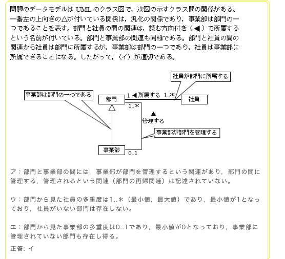


我来帮你把这段解析**原模原样**翻译成中文，同时保留原文的结构和逻辑：

---

### 原文解析翻译
> 问题中的数据模型为UML类图，类之间的关系如下图所示。
>
> 最左侧带向上△（空心三角箭头）的关系是泛化关系，表示“事业部是部门的一种”。
> 部门与社员之间的关系，带有阅读方向箭头（◀），并标注了“所属する（所属）”的名称。部门与事业部之间的关系也是同理。
>
> 从部门与社员的关系可以看出，社员是“属于部门”的；而事业部是部门的一种，因此社员也可以“属于事业部”。
> 因此，选项（イ）是恰当的。

---

### 各选项说明翻译
- **ア**：部门与事业部之间，存在“事业部管理部门”的关联关系；而部门之间“管理/被管理”的关联（部门的自递归关系）并未被描述。
- **ウ**：从部门视角看社员的多重度为`1..*`（最小值、最大值），最小值为1，因此不存在没有社员的部门。
- **エ**：从部门视角看事业部的多重度为`0..1`，最小值为0，因此也存在未被事业部管理的部门。

**正确答案：イ**

---

要不要我再帮你把这段解析里的UML术语（泛化、多重度、递归关系）做个中日对照的小词典，方便你复习？


