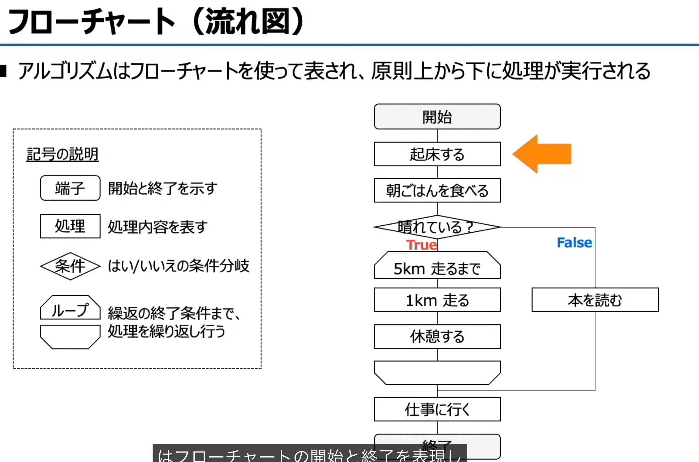
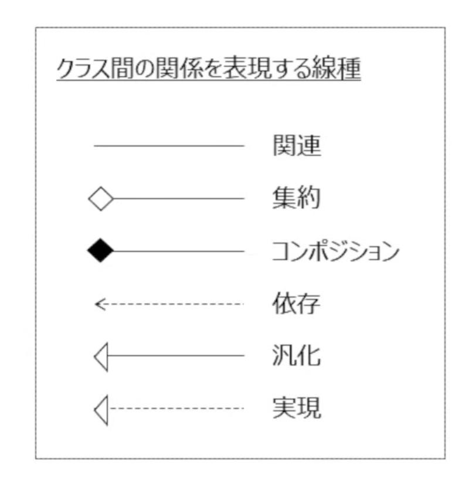

# アルゴリズム

## 知识点：構造化プログラミング（结构化编程）
结构化编程的核心是用**三种基础控制结构**来构建程序逻辑，保证代码清晰、无混乱跳转（无GOTO语句）：

1.  **順次（顺序结构）**
    程序按代码书写的顺序，从上到下依次执行，一步接一步处理。
    例：先输入数据 → 再计算 → 最后输出结果。

2.  **選択（选择/分支结构）**
    根据条件判断结果，选择不同的分支执行。
    例：`if`/`if-else`/`switch-case` 语句。

3.  **繰返し（循环/重复结构）**
    满足条件时，反复执行同一段代码，直到条件不成立为止。
    例：`for`/`while`/`do-while` 语句。

# 程序（プログラム）的4个核心属性 

---

## 1. リロケータブル（再配置可能 / Relocatable）
- **日文原文**：プログラムを主記憶上のどこに配置しても実行可能
- **中文释义**：**可重定位**
- 含义：程序被加载到主存的任意位置，都能正常运行。
- 图示：程序从辅助存储读入主存，位置「どこでもOK」（哪里都行）。

---

## 2. リユーザブル（再使用可能 / Reusable）
- **日文原文**：主記憶上に読み込まれたプログラムは、それ以降は再ロードしなくても繰り返し利用可能
- **中文释义**：**可重用**
- 含义：程序被读入主存后，不用反复从磁盘重新加载，就能被多次调用、反复执行。
- 图示：程序读入主存后，标注「ずーと使える」（可以一直用）。

---

## 3. リエントラント（再入可能 / Reentrant）
- **日文原文**：複数のタスクからの呼び出しに対して並行して実行可能
- **中文释义**：**可重入**
- 含义：程序可以同时被多个任务/进程调用，并行执行而不冲突（核心是“线程安全”）。
- 图示：タスク1 和 タスク2 同时调用同一个程序，标注「同時に実行可能」。

---

## 4. リカーシブ（再帰的 / Recursive）
- **日文原文**：プログラム実行中に自分自身を呼び出すことができる
- **中文释义**：**递归性**
- 含义：程序在运行过程中，能够调用自身（即支持递归调用）。
- 图示：程序自己指向自己，标注「自分自身を呼び出し」。

---

### 💡 一句话总览
这四个属性，都是操作系统和程序设计中，让程序更灵活、高效、可复用的关键特性：
- 可重定位：放哪都能跑
- 可重用：加载一次，多次使用
- 可重入：多个任务同时调用不翻车
- 递归性：自己能调用自己

# 基本アルゴリズム一覧 总结（日文+英文+中文）
大标题：**基本アルゴリズム一覧（Basic Algorithms Overview / 基础算法一览）**
说明：从「数据存储方式、数据查找方法、数据排序方法」三个类别，理解各类算法的运行逻辑。

## 1. データの持ち方（Data Structures / 数据存储方式）
- 配列（Array / 数组）
- リスト（List / 链表）
- キュー/スタック（Queue / Stack / 队列/栈）
- 木構造（完全2分木/2分探索木/ヒープ木）（Tree Structure (Complete Binary Tree / Binary Search Tree / Heap Tree) / 树结构（完全二叉树/二叉搜索树/堆树））

木構造　きこうぞ

## 2. データ探索方法（Search Algorithms / 数据查找方法）
- 線形探索法（Linear Search / 线性查找）
- 2分探索法（Binary Search / 二分查找）
- ハッシュ法（Hash Search / Hashing / 哈希查找）

## 3. データ整列方法（Sorting Algorithms / 数据排序方法）
- 基本交換法（Basic Exchange Sort / 基础交换排序，即冒泡排序）
- 基本選択法（Basic Selection Sort / 基础选择排序）
- 基本挿入法（Basic Insertion Sort / 基础插入排序）
- シェルソート（Shell Sort / 希尔排序）
- クイックソート（Quick Sort / 快速排序）
- ヒープソート（Heap Sort / 堆排序）
- マージソート（Merge Sort / 归并排序）

# 木構造（2分木）总结
这张图介绍了**三种常见的二叉树结构**，我帮你把日文原文、英文对应、中文翻译和核心特点都整理清楚了：

## 1. 完全2分木（かんぜんにぶんぎ / Kanzen nibungi）
- **英文**：Complete Binary Tree
- **中文**：完全二叉树
- **定义原文**：根/節が全て2つの子を持ち、かつ根から葉までの深さが等しい2分木
- **中文解释**：
  - 每个节点最多有2个子节点
  - 除了最后一层，其他所有层的节点都完全填满
  - 最后一层的节点都靠左对齐
- **特点**：结构规整，适合用数组来存储，常作为堆的底层实现结构。

---

## 2. 2分探索木（にぶんたんさくぎ / Nibun tansaku gi）
- **英文**：Binary Search Tree (BST)
- **中文**：二叉搜索树 / 二叉查找树
- **定义原文**：各節にて【左の子 < 親 < 右の子】が常に成立する2分木
- **中文解释**：
  - 每个节点都满足：左子节点的值 < 父节点的值 < 右子节点的值
  - 对任意节点，其左子树的所有节点值都小于它，右子树的所有节点值都大于它
- **特点**：利用这个有序性，可以高效地进行查找、插入、删除操作。

---

## 3. ヒープ木（Hiipu ki）
- **英文**：Heap Tree
- **中文**：堆树（通常分为大顶堆/小顶堆）
- **定义原文**：【親 > 子】もしくは【子 > 親】が常に成立する2分木
- **中文解释**：
  - 分为两种类型：
    - **大顶堆（最大堆）**：父节点的值始终大于等于子节点的值
    - **小顶堆（最小堆）**：父节点的值始终小于等于子节点的值
  - 堆一定是完全二叉树
- **特点**：能快速获取最大值/最小值，常用于堆排序、优先队列的实现。

---

💡 一句话区分：
- **完全二叉树**：只看“形状”是否规整
- **二叉搜索树**：看“大小关系”（左<根<右），为了高效查找
- **堆树**：看“父子大小关系”（父≥子 或 父≤子），为了快速取最值

# 線形探索法（Linear Search / 线性查找）总结
---

## 核心定义
日文原文：**線形探索法ではデータを前から順番に探索していく**
中文释义：**线性查找是从数据的开头开始，按顺序逐个检查，直到找到目标值的查找方法**。

---

## 例子解析（图中示例）
目标：在数组 `[12, 3, 17, 5, 8, 14, 21, 6, 9, 1, 19]` 中查找数字 `14`。
1.  从第一个元素 `12` 开始，依次与目标值 `14` 比较。
2.  `12`、`3`、`17`、`5`、`8` 均不匹配（图中用红色叉号标记）。
3.  当检查到第6个元素时，值为 `14`，与目标值匹配，查找结束（图中用蓝色圆圈标记）。

---

## 关键特点
- **优点**：
  - 实现简单，逻辑清晰。
  - 不要求数据是有序的，无需提前排序。
- **缺点**：
  - 效率较低，最坏情况下（目标值在最后或不存在），需要检查全部 `n` 个元素。
  - 时间复杂度为 **O(n)**。

---

💡 一句话概括：线性查找就是“从头到尾挨个找”，是最简单但效率最低的查找算法。

# 2分探索法（Binary Search / 二分查找）总结

## 核心定义
日文原文：
> データが昇順、もしくは降順に並んでいる際に、データを2つに分けながら目的のデータを探索する方法

中文释义：
**当数据按升序或降序排列时，通过不断将数据区间对半分割，来查找目标数据的高效算法。**

## 核心特点
1.  **前提条件**：数据必须是**有序**的（升序/降序），否则无法使用。
2.  **查找逻辑**：
    - 每次取当前区间的**中间值**与目标值比较。
    - 如果目标值比中间值小，就只在**左半区间**继续查找；
    - 如果目标值比中间值大，就只在**右半区间**继续查找；
    - 重复这个“对半分割”的过程，直到找到目标值或确定其不存在。
3.  **效率极高**：每次都能排除掉一半的数据，最坏情况下也只需 `log₂n` 次比较，时间复杂度为 **O(log n)**，远快于线性查找的 O(n)。

💡 一句话概括：
二分查找就是“在有序数组里，每次砍一半，用排除法快速定位目标”。

# ハッシュ探索法（Hash Search / 哈希查找）总结

## 核心定义
日文原文：
> 決められた計算式（ハッシュ関数）によってデータを計算し、その計算結果の場所を探索する

中文释义：
**哈希查找是通过一个固定的计算规则（哈希函数），直接算出数据应该存储的位置，再到这个位置去查找目标数据的方法。**

## 图中示例解析
### 1. 哈希函数规则
图中定义的哈希函数是：
> データを5で割った余りに1の位の数を足し算する
（将数据除以5取余数，再加上该数据的个位数）

- 以 `247` 为例：
  - `247 ÷ 5` 的余数是 `2`，个位数是 `7`
  - 位置 = `2 + 7 = 9`，所以 `247` 存在位置 `9`
- 以 `25` 为例：
  - `25 ÷ 5` 的余数是 `0`，个位数是 `5`
  - 位置 = `0 + 5 = 5`，所以 `25` 存在位置 `5`
- 以 `17` 为例：
  - `17 ÷ 5` 的余数是 `2`，个位数是 `7`
  - 位置 = `2 + 7 = 9`，所以 `17` 也算出位置 `9`

### 2. 哈希冲突（シノニム）
- 日文：**シノニム（格納場所が衝突）**
- 中文：**哈希冲突（同义词冲突）**
- 含义：不同的数据，经过哈希函数计算后，得到了相同的存储位置。
- 例子中的 `247` 和 `17` 都算出了位置 `9`，这就是典型的冲突。

---

## 关键特点
- **效率极高**：理想情况下，计算位置和查找的时间复杂度都是 **O(1)**，比线性查找和二分查找都快得多。
- **不需要数据有序**：不像二分查找那样必须提前排序。
- **存在哈希冲突问题**：不同数据可能算出同一个位置，需要额外的方法解决（如链地址法、开放寻址法）。

---

💡 一句话概括：
哈希查找就是“用公式直接算出数据的地址，一步到位找到它”，但如果公式算出的地址撞车了，就需要额外处理。

# 四种排序算法总结（保留日文）
---

## 1. 基本交換法（バブルソート / Bubble Sort）
- **日文定义**：隣り合うデータの大きさを比較し、必要に応じて入れ替えることで並び替える方法
- **中文释义**：相邻数据两两比较，按需求交换位置，像气泡一样把大/小的元素逐步“浮”到一端
- **核心特点**：
  - 每次只和**相邻元素**交换
  - 流程简单直观，效率较低，时间复杂度为O(n²)

---

## 2. 基本選択法（選択ソート / Selection Sort）
- **日文定义**：対象データの中から最大値もしくは最小値を選択して、先頭データと交換することで並び替える
- **中文释义**：从未排序的数据中选出最大/最小值，与当前未排序部分的起始位置交换
- **核心特点**：
  - 每次只进行**一次交换**，交换次数比冒泡排序少
  - 时间复杂度同样为O(n²)，但实际性能略优于冒泡排序

---

## 3. 基本挿入法（挿入ソート / Insertion Sort）
- **日文定义**：整列済配列を用意して、未整列配列から整列済配列の適切な位置にデータを挿入して並べる
- **中文释义**：将数据分为“已排序”和“未排序”两部分，每次从未排序部分取一个元素，插入到已排序部分的正确位置
- **核心特点**：
  - 像打扑克牌时整理手牌的逻辑
  - 对**几乎有序**的数据效率很高，时间复杂度最好为O(n)，最坏为O(n²)

---

## 4. シェルソート（Shell Sort）
- **日文定义**：データを一定間隔ごとに取り出し、そのデータ内で並び替えて元に戻す。次に、間隔を狭めて再度データを取り出し、並べ替える。これを間隔が1になるまで繰り返す。
- **中文释义**：希尔排序，是插入排序的改进版。先按较大的间隔分组，对每组数据做插入排序；再逐步缩小间隔，重复分组排序，直到间隔为1时完成整体插入排序
- **核心特点**：
  - 解决了插入排序只能移动相邻元素的低效问题
  - 效率比基础插入排序高，时间复杂度约为O(n^1.3)，比O(n²)快很多

---

💡 一句话区分：
- 基本交換法：**相邻两两交换**，像冒泡一样排序
- 基本選択法：**每次选最值交换**，减少交换次数
- 基本挿入法：**按顺序插入到已排序部分**，像整理扑克牌
- シェルソート：**分组插入+逐步缩小间隔**，是插入排序的“提速版”

# クイックソート・ヒープソート 总结

## 1. クイックソート（Quick Sort / 快速排序）
- **日文定义**：データ内の基準値を決めて、基準値より大きいデータ/小さいデータにグループ分けしながら整列
- **中文释义**：
  先在数据中选一个基准值（枢轴），把数据分成「比基准小」和「比基准大」两部分；再对这两部分递归重复同样的操作，直到全部有序。
- **核心特点**：
  - 分治思想的典型算法，平均时间复杂度为 **O(n log n)**，效率极高
  - 基准值的选择会影响性能，最坏情况可能退化为O(n²)

---

## 2. ヒープソート（Heap Sort / 堆排序）
- **日文定义**：データを木構造で保持させて、それをヒープ木となるように並べ替える。ヒープ木となったら根を配列に戻し、同様の処理を繰り返して整列させる
- **中文释义**：
  先把数据构建成**堆结构**（最大堆/最小堆），堆顶就是最大/最小值；再把堆顶元素移到数组末尾，然后调整堆结构，重复操作直到全部有序。
- **核心特点**：
  - 时间复杂度稳定为 **O(n log n)**，最坏情况也不会退化
  - 不依赖额外空间，属于原地排序算法

---

💡 一句话区分：
- クイックソート：**选基准分两边，递归排序**，效率高但最坏情况不稳定
- ヒープソート：**用堆结构找最值，逐步取出排序**，时间复杂度稳定

# マージソート（Merge Sort / 归并排序）总结

---

## 日文定义原文
> データが1つになるまで与えられたデータを分割し、そのデータを整列させながら元に戻す

## 核心含义
归并排序是一种典型的**分治算法**，逻辑分为两步：
1.  **分割（Divide）**：不断把数据对半拆分，直到每个子序列只剩1个元素（天然有序）。
2.  **合并（Merge）**：再把有序的子序列两两合并，合并时按顺序排列，最终还原成一个完整的有序数组。

---

## 关键特点
- **时间复杂度稳定为 O(n log n)**，无论数据情况如何，效率都很高。
- 是**稳定排序**，相同值的元素在排序后不会改变原本的相对位置。
- 缺点是需要额外的辅助空间来存放合并过程中的数据，属于“非原地排序”。

---

💡 一句话概括：
**先拆分到最小单元，再边合并边排序**，像把多份有序的扑克牌，按顺序合并成一份。

# オーダー記法（Order Notation / 大O記法）介绍

## 核心定义
**オーダー記法（也叫ビッグオー記法 / Big O Notation）**，是用来表示**算法的计算量（处理时间/内存使用量）随数据量增长的变化趋势**的数学记法。
- 它不关心具体的处理次数，只关注**数据量增大时，处理时间的增长级别**。
- 核心是「省略常数和低次项，只保留影响最大的部分」，比如 `3n² + 5n + 2` 会被简化为 `O(n²)`。

## 常见的计算量级别（从快到慢）
1.  **O(1) 定数時間**
    - 无论数据量多大，处理时间都固定不变（比如哈希查找的理想情况）。
2.  **O(log n) 対数時間**
    - 数据量翻倍，处理次数只增加1次（比如二分查找）。
3.  **O(n) 線形時間**
    - 处理时间和数据量成正比（比如线性查找）。
4.  **O(n log n) 準線形時間**
    - 比线性稍慢，效率很高（比如快速排序、归并排序、堆排序）。
5.  **O(n²) 二乗時間**
    - 数据量翻倍，处理时间变成4倍（比如冒泡排序、选择排序、插入排序）。

## 关键特点
- 它表示的是**最坏情况下的时间复杂度**，也就是算法处理速度的上限。
- 作用是快速对比不同算法的效率，帮你判断哪种算法更适合大规模数据。

💡 一句话理解：
オーダー記法就是算法的「效率等级」，比如 `O(n²)` 就是“平方级”，`O(n log n)` 就是“准线性级”，一眼就能看出哪个算法更快。

# オーダー記法（大O表示法）总结

## 一、核心定义
- **日文原文**：データ量に対するアルゴリズムの概算計算量をオーダー記法 O(n) で表現する
- **中文释义**：大O表示法，是用来描述**算法的计算量（时间复杂度）随数据量增长的变化趋势**的记号，只关注量级，忽略常数项。

---

## 二、按算法分类整理

### 1. データの探索アルゴリズム（查找算法）
| 算法 | オーダー記法 | 说明 |
|---|---|---|
| 線形探索法（线性查找） | O(n) | 处理时间和数据量成正比 |
| 2分探索法（二分查找） | O(log₂n) | 对数级，数据翻倍，次数仅+1 |
| ハッシュ法（哈希查找） | O(1) | 理想情况下是常数级，一步到位 |

### 2. データの整列アルゴリズム（排序算法）
| 算法 | オーダー記法 | 说明 |
|---|---|---|
| 基本交換法（冒泡排序） 基本選択法（选择排序） 基本挿入法（插入排序） | O(n²) | 平方级，数据翻倍，时间变成4倍 |
| シェルソート（希尔排序） | O(n^1.3) | 插入排序的优化版（标注※暗記不要，不用死记） |
| クイックソート（快速排序） ヒープソート（堆排序） マージソート（归并排序） | O(nlog₂n) | 准线性级，效率很高（标注※暗記不要，了解即可） |

---

## 三、注意点（重要！）
- オーダー記法只是表现「计算量随数据量增长的关系」，**即使大O相同，实际计算量和处理时间也不一定完全一样**。
  比如冒泡排序和选择排序都是O(n²)，但选择排序的交换次数更少，实际运行会更快。

---

💡 一句话速记：
- **查找算法效率从高到低**：哈希(O(1)) > 二分(O(log₂n)) > 线性(O(n))
- **排序算法效率从高到低**：O(nlog₂n)（快排/堆排/归并）> O(n^1.3)（希尔）> O(n²)（冒泡/选择/插入）

# プログラミング言語とマークアップ言語（编程语言与标记语言）总结

## 1. プログラミング言語（编程语言）
- **日文定义**：コンピューターに処理を命令する際に使用する言語
- **中文释义**：用来向计算机下达处理指令、实现逻辑与计算的语言。
- **特点**：
  - 包含变量、循环、条件判断、函数等逻辑控制语句，能让计算机执行复杂运算和任务。
  - 示例：图中的Python代码，通过导入库、生成数据、绘图命令，实现了数据可视化功能。
  - 作用：直接“指挥”计算机执行具体操作。

---

## 2. マークアップ言語（标记语言）
- **日文定义**：文章の構造を記述する言語
- **中文释义**：用来描述文本/内容的结构、格式和含义的语言。
- **特点**：
  - 不包含程序逻辑，而是通过**标签（タグ）** 为内容赋予结构和语义。
  - 示例：图中的HTML代码，通过`<h1>`、`
`、`<ul>`、`<li>`等标签，定义了标题、段落、列表的结构，浏览器会根据标签渲染出对应的排版。
  - 作用：定义内容的“外观和结构”，而非执行逻辑运算。

---

## 核心区别一句话速记
- **编程语言**：用来给计算机**下命令、做计算**，能实现复杂逻辑。
- **标记语言**：用来给内容**标结构、定格式**，只描述内容不执行逻辑。

---

💡 举个更直观的例子：
- 编程语言像一份**菜谱**，包含“开火→倒油→翻炒→调味”的步骤指令，让厨师（计算机）一步步执行做出菜。
- 标记语言像一份**排版说明**，告诉排版工人“这行是标题、这段是正文、这些是列表”，但不规定怎么写、写什么内容。

# プログラミング言語の例（编程语言示例）总结
这张图把编程语言按「**低水準言語（低级语言）**」和「**高水準言語（高级语言）**」做了分类，我帮你拆解清楚👇

---

## 核心前提
プログラミング言語の例
> プログラミング言語は人間でも分かりやすい言語で書かれたのが高水準言語
> （编程语言中，用人类易懂的方式编写的，就是高级语言）

---

## 1. 低水準言語（低级语言）
- **定义**：コンピュータが理解しやすい形式で記述した言語
  （用计算机容易理解的形式编写的语言）
- **特点**：
  - 贴近硬件指令，执行效率极高
  - 对人类不友好，难写、难读、难维护

### 包含两种：
- **機械語（机器语言）**：
  コンピュータが理解できる言語で、0と1で表される
  （计算机能直接理解的语言，由0和1组成）
- **アセンブラ言語（汇编语言）**：
  機械語と1対1で対応する記号で置換した言語
  （用符号一对一替换机器语言的语言，比机器语言稍微好读一点）

---

## 2. 高水準言語（高级语言）
- **定义**：人間が理解できる形式で記述した言語
  （用人类能理解的形式编写的语言）
- **特点**：
  - 贴近自然语言，有变量、循环、函数等抽象语法
  - 易读、易写、易维护，但需要编译器/解释器翻译成机器语言才能执行

### 图中列举的例子：
- **C言語**：システム記述に適しており、OSなどに使用されている言語
  （适合系统级开发，常用于操作系统、嵌入式系统）
- **Java**：オブジェクト指向言語であり、コンピュータの機種やOSに依存せず、どんな環境でも動作する
  （面向对象语言，跨平台性强，一次编写到处运行）
- **Python**：Webアプリやスマホアプリ、人工知能などの開発に適した言語
  （适合Web应用、手机应用、人工智能等开发，语法简洁易用）
- **JavaScript**：スライドショーやポップアップ表示など動きがあるWebページを作成するのに適した言語
  （适合制作带交互效果的网页，如轮播、弹窗等）

---

💡 一句话区分：
- **低水準言語**：**计算机看得懂，人类看不懂**，贴近硬件，效率高但难用
- **高水準言語**：**人类看得懂，计算机看不懂**，贴近自然语言，好用但需要翻译

# マークアップ言語の例（标记语言示例）总结
---

## 核心前提
- **マークアップ言語としてHTML,XMLがテストに出題される**
  （考试中，HTML和XML是典型的标记语言考点）
- 补充：CSS不属于标记语言，是**スタイルシート言語（样式表语言）**，但常和HTML搭配使用。

---

## 1. HTML
- **日文定义**：
  - Webページを作成するための言語
  - タグの定義が決まっている
- **中文释义**：
  - 用于制作网页的标记语言
  - 标签的含义是固定的（如`<h1>`表示标题、`
`表示段落）

---

## 2. CSS
- **日文定义**：
  - HTMLで作成された文書に文字のフォント、大きさ、色など視覚表現をつける
  - ※マークアップ言語ではなくスタイルシート言語
- **中文释义**：
  - 为HTML文档添加字体、大小、颜色等视觉样式的语言
  - 不属于标记语言，是样式表语言

---

## 3. XML
- **日文定义**：
  - アプリケーション間におけるデータ管理等を簡単にするための言語
  - 利用者独自でタグを定め出来る
- **中文释义**：
  - 用于简化应用程序之间数据交换与管理的标记语言
  - 用户可以根据需求自定义标签，不局限于固定的标签集合

---

💡 一句话速记：
- **HTML**：固定标签，用来写网页结构
- **CSS**：样式表语言，用来给网页“化妆”
- **XML**：自定义标签，用来跨程序传输数据

# インタプリタとコンパイラ（解释器与编译器）总结
---

## 核心定义
- **インタプリタ（Interpreter / 解释器）**：高水準言語で書かれた原始プログラムを、**1行ずつ機械語に翻訳**するプログラム
- **コンパイラ（Compiler / 编译器）**：高水準言語で書かれた原始プログラムを、**全てまとめて機械語に翻訳**するプログラム

---

## 1. インタプリタ（解释器）
- **翻译方式**：边读边译，**逐行解释执行**（就像“同时通訳”）
- **特点**：
  - 每次运行都要逐行翻译，整体执行速度较慢
  - 写好代码后可以直接运行，修改后能立即看到结果，调试方便
- **示例语言**：Python、JavaScript

---

## 2. コンパイラ（编译器）
- **翻译方式**：一次性把整个程序翻译成机器语言（就像“一括翻訳”），生成可执行文件后再运行
- **特点**：
  - 只需要翻译一次，后续直接运行机器语言，执行速度快
  - 必须完整翻译后才能运行，修改代码后需要重新编译，调试相对麻烦
- **示例语言**：C言語、Java

---

💡 一句话对比：
- **インタプリタ**：像同声传译，边说边翻，即时执行但速度慢
- **コンパイラ**：像把整本书一次性翻译成另一种语言，翻译后直接读译本，速度快但修改后要重译

# プログラムの実行手順（程序执行流程）总结
这张图展示了**编译器方式（コンパイラ方式）**下，程序从源代码到运行的完整步骤，我帮你拆解清楚👇

---

## 整体流程
**高水準言語（原始プログラム）**
→ コンパイル（编译）
→ 機械語（目的プログラム）
→ リンク（链接）
→ ロードモジュール（可执行模块）
→ ロード（加载）
→ 実行（运行）

---

## 每一步详解
1.  **コンパイル（编译 / Compile）**
    - 用「コンパイラ」将**高级语言源代码**，一次性翻译成机器语言（目标程序）。
    - 结果：生成`機械語（目的プログラム）`文件。

2.  **リンク（链接 / Link）**
    - 用「リンカ」把翻译好的目标程序，和需要用到的**ライブラリモジュール（库文件）**整合在一起。
    - 结果：生成一个完整的`ロードモジュール（可执行模块）`，解决了外部依赖问题。

3.  **ロード（加载 / Load）**
    - 用「ローダ」把可执行模块读入计算机的主内存中。

4.  **実行（运行 / Execute）**
    - CPU从内存中读取指令，执行程序。

---

💡 一句话概括：
**先编译成机器码，再和库文件链接成完整程序，加载到内存后运行。**

这张图把**编译型程序从源代码到运行的全过程**，拆解成了3个关键步骤，我帮你逐一讲清楚👇

---

### ① コンパイル（编译 / Compile）
- **日文原文**：プログラミング言語を機械語に翻訳
- **解释**：
  把你写的高级语言代码（比如图里的Python/其他代码），一次性翻译成计算机能直接理解的**机器语言（0和1组成的指令）**。
- **图示说明**：左边的代码文件，经过「翻訳」，变成了右边的二进制文件。

---

### ② リンク（链接 / Link）
- **日文原文**：色々なプログラムをくっつける
- **解释**：
  把编译生成的目标文件，和程序用到的各种库文件（比如系统库、第三方库）「结合」起来，整合成一个完整的、可独立运行的程序文件。
- **图示说明**：多个零散的目标文件，经过「結合」，变成了一个统一的可执行文件。

---

### ③ ロード（加载 / Load）
- **日文原文**：主記憶装置に読み込ませる
- **解释**：
  操作系统把链接好的可执行文件，读入计算机的**主内存（RAM）**中，让CPU可以直接读取和执行指令。
- **图示说明**：可执行文件经过「読込」，被加载到了内存条中。

---

💡 一句话串起来：
**先把代码翻译成机器码（编译），再和库文件拼成完整程序（链接），最后加载到内存里运行（加载）。**

## 一、コンパイル（编译）：编译器的5个内部步骤
编译器（コンパイラ）的核心任务，是把高级语言翻译成机器语言，过程分为5步：

1.  **字句解析（词法分析）**
    - 日文说明：プログラムの文字の並びを意味のある単語に分ける
    - 中文释义：把源代码的字符序列，拆分成一个个有意义的“单词”（比如关键字、变量名、运算符）。
    - 示例：`X = Y + 1` 会被拆成 `X`、`=`、`Y`、`+`、`1`。

2.  **構文解析（语法分析）**
    - 日文说明：単語間の関係、構文を考える
    - 中文释义：分析这些“单词”的组合是否符合编程语言的语法规则，并构建出语法树。
    - 示例：把 `X = Y + 1` 解析成“赋值运算”的结构，明确运算的优先级和结合性。

3.  **意味解析（语义分析）**
    - 日文说明：構文の意味を考える
    - 中文释义：检查语法树的语义是否合法（比如变量是否定义、类型是否匹配），确保程序逻辑没有错误。

4.  **最適化（优化）** コンパイラ
    - 日文说明：コンピュータが早く実行できるように整える
    - 中文释义：对代码进行优化，消除冗余计算，提升执行效率。
    - 示例：代码里写了两次 `X ← 3`，优化时会删掉重复的那一行。

プログラムの実行時間を短縮する。（缩短程序的**运行时间**）

5.  **コード生成（代码生成）**
    - 日文说明：プログラムを書き出す
    - 中文释义：把优化后的语法树，转换成计算机能直接执行的机器语言指令。

---

## 二、编译后的完整执行流程
编译完成后，程序还要经过3个步骤才能运行：
1.  **コンパイル**：把高级语言（如C语言）翻译成机器语言（目的プログラム）。
2.  **リンク（链接）**：把生成的机器语言文件，和程序用到的库文件（ライブラリモジュール）结合起来，生成完整的可执行文件（ロードモジュール）。
3.  **ロード（加载）**：操作系统把可执行文件读入主内存（主記憶装置）。
4.  **実行（运行）**：CPU执行内存中的指令，程序开始运行。

---

💡 一句话串起来：
**先通过词法、语法、语义分析理解代码，再优化、生成机器码，接着链接库文件、加载到内存，最后运行。**

我们先把这道题和知识点讲清楚，再帮你区分「コンパイル」和「最適化」。

---

## 1. 题目解析
### 问题
**コンパイラによる最適化の主な目的はどれか。**
（编译器优化的主要目的是什么？）

### 选项
- ア：プログラムの実行時間を短縮する。（缩短程序的**运行时间**） ✅
- イ：プログラムのデバッグを容易にする。（方便程序调试）
- ウ：プログラムの保守性を改善する。（提高程序的可维护性）
- エ：目的プログラムを生成する時間を短縮する。（缩短生成目标程序的时间）

### 正确答案：ア
编译器优化（最適化）的核心目的，是**让最终生成的机器码执行效率更高、运行时间更短**。
它会通过消除冗余计算、合并重复操作、调整指令顺序等方式，减少CPU的执行步骤，从而缩短程序运行时间。

---

## 2. 知识点总结：コンパイラの「最適化」とは？
- **位置**：它是**コンパイル（编译）过程中的一个步骤**。
- **时机**：在词法分析→语法分析→语义分析之后，代码生成之前。
- **目的**：对中间代码进行优化，生成更高效的机器语言指令。
- **常见优化方式**：
  - 删除重复代码（比如连续两次给同一个变量赋值，删掉多余的一次）
  - 合并常量计算（比如把 `x = 2 * 3` 直接变成 `x = 6`）
  - 调整指令顺序，减少CPU的等待时间
  - 优化循环，减少不必要的循环次数

---

## 3. 「最適化」と「コンパイル」の違い
很多人容易把这两个概念搞混，这里帮你用一句话区分：

| 概念 | 本质 | 包含关系 | 目的 |
| :--- | :--- | :--- | :--- |
| **コンパイル（编译）** | 高级语言→机器语言的**完整翻译过程** | 包含「字句解析→構文解析→意味解析→最適化→コード生成」所有步骤 | 把人类能懂的代码，翻译成计算机能懂的机器语言 |
| **最適化（优化）** | 编译过程中的**一个中间步骤** | 只是编译流程里的一环 | 让生成的机器码执行更快、效率更高 |

---

💡 举个例子：
- **コンパイル**就像把一本英文小说，从头到尾翻译成日文小说的全过程。
- **最適化**就像在翻译的过程中，帮你把句子改得更通顺、去掉冗余的表达，让日文版读起来更流畅、更高效。

---

需要我把「编译的5个步骤（词法/语法/语义/优化/代码生成）」做成一张简单的速记清单吗？这样考试时一眼就能分清。

# オブジェクト指向プログラミングとUML

# オブジェクト指向（面向对象）总结

## 核心定义
**オブジェクト指向**是一种能让开发**高效且易于理解**的编程方法。

它的核心思路，是把程序里的事物都看作一个个「モノ（对象/事物）」，再通过定义这些“事物”之间的关系，来让计算机执行操作。

## 关键概念拆解
1.  **オブジェクト（对象）**
    每个对象都由两部分组成：
    -   **データ（数据/属性）**：这个对象有什么特征（比如一个“人”对象，数据就是姓名、年龄）
    -   **処理（处理/方法）**：这个对象能做什么操作（比如“人”对象的处理就是走路、说话）

2.  **核心逻辑**
    用「モノ・对象」的概念，定义每个对象**保存了什么数据**、**能执行什么动作**。
    然后通过这些对象之间的交互，构建出整个程序。

---

💡 一句话理解：
面向对象编程，就是把程序里的东西都当成一个个“完整的小零件”，每个零件都自带数据和功能，再通过这些零件的配合，搭出整个系统。

你应该是打错字啦～这张图讲的是面向对象的**「継承（继承）」**，不是胰腺癌 😂 我帮你把知识点讲清楚：

---

# オブジェクト指向の特徴（継承 / 继承）

## 核心定义
**継承（继承）**：基となるクラスで定義しているプロパティやメソッドを、新しく作成したクラスに引き継ぐこと。
翻译：继承就是让新的类，直接“继承”父类里已经定义好的属性和方法，不用重复写代码。

## 关键概念
1.  **スーパークラス（親クラス / 父类）**
    - 例子：`キャラクタークラス（角色类）`
    - 定义了所有角色共有的属性（プロパティ）和方法（メソッド）：
      - 属性：名前（名字）、HP、攻撃力（攻击力）
      - 方法：Xボタンで攻撃する（X键攻击）、Yボタンで防御する（Y键防御）

2.  **サブクラス（子クラス / 子类）**
    - 例子：`主人公キャラクラス（主角角色类）`、`敵キャラクラス（敌人角色类）`
    - 它们**继承了父类的所有属性和方法**，不用重复写一遍名字、HP、攻击防御这些通用逻辑。

## 继承的好处
- **代码复用**：通用的属性和方法只需要在父类写一次，子类直接用，减少重复代码。
- **便于扩展**：如果以后要加新角色，只要新建一个子类继承父类，再添加/修改自己特有的属性或方法就行。

💡 一句话理解：
继承就像“孩子继承父母的基因”，子类直接继承父类的通用特征，再加上自己的独特特征，既省事又好维护。

# オブジェクト指向の特徴（カプセル化 / 封装）总结

---

## 核心定义
**カプセル化（封装）**：
> オブジェクト内にあるプロパティ（属性）やメソッド（処理）の情報を、外部から直接書き換えられないように隠蔽すること

简单说，就是把对象的内部数据“藏起来”，不让外部代码直接修改，只能通过对象提供的特定方法来间接操作。

---

## 图示案例解析
以游戏角色的HP为例：

### 封装前（无カプセル化）
- 外部可以直接修改角色的 `現在のHP`
- 问题：
  - 直接加50，HP变成170，超过了最大HP 150
  - 直接减200，HP变成-80，出现了不合理的异常值
- 后果：数据被破坏，程序逻辑出现问题

### 封装后（カプセル化）
- `現在のHP` 被隐藏，外部**不能直接变更**
- 只能通过对象提供的 `HPの増減` 方法来间接修改
- 好处：
  - 异常值会在方法内部被处理（比如HP不能超过最大值，也不能小于0）
  - 数据被保护起来，避免了非法修改导致的bug

---

## 封装的核心目的
- **データを保護し、不具合を防ぐ**（保护数据，防止程序出现故障）
- 隐藏对象的内部实现细节，只对外暴露安全的接口
- 提升代码的安全性和可维护性

---

💡 一句话理解：
封装就像给对象的数据加上了一层“安全壳”，不让外部随便乱改，只能通过指定的“安全通道”操作，避免数据被破坏。

# オブジェクト指向の特徴（ポリモーフィズム / 多态）总结
---

## 核心定义
**ポリモーフィズム（多态）**：
> オーバーライドすることで、同じ命令をしても各クラスで異なる処理を行うこと

简单说，就是**同一个命令（比如“按下X键”），不同的对象会执行不同的动作**。

---

## 图示案例解析
以游戏角色为例：

1.  **スーパークラス（親クラス / 父类）**：`キャラクタークラス`
    - 定义了通用方法：`Xボタンで攻撃する`、`Yボタンで防御する`

2.  **サブクラス（子クラス / 子类）**：
    - `主人公キャラクラス`：继承父类方法，同时新增了`○ボタンで道具を使う`
    - `敵キャラクラス`：继承父类方法，同时新增了`Zボタンで避ける`

### 多态的体现
当执行`Xボタンで攻撃する`这个命令时：
- 对「主人公」来说，会执行玩家角色的攻击动作
- 对「敌人」来说，会执行敌人的攻击动作
- 同一个命令，不同对象的处理逻辑不同，这就是多态。

---

## 多态的实现方式：オーバーライド（重写）
子类通过**重写（オーバーライド）**父类的方法，来实现自己的处理逻辑。
- 父类只定义“做什么”（比如“按下X键攻击”）
- 子类定义“怎么做”（比如“主角挥剑攻击”或“敌人释放火球攻击”）

---

## 多态的好处
- **统一接口，灵活扩展**：外部代码只需要调用同一个方法，就能让不同对象执行各自的逻辑，不用为每个对象写不同的调用代码。
- **提升代码可维护性**：新增对象时，只需要新建子类并重写方法，不用修改原有代码。

💡 一句话理解：
多态就像同一个指令，不同角色有不同的“回应方式”，让程序更灵活、更易扩展。

我先把图里的日文汉字词，按你要的方式标注罗马音，再顺带解释一下它们的意思：

---

### 1. クラスの階層（类的层次）
- 階層：**かいそう（kaisou）**

### 2. 汎化-特化（泛化-特化）
- 汎化：**はんか（hanka）**
- 特化：**とっか（tokka）**
- 自動車：**じどうしゃ（jidousha）**
- バス：**basu**
- トラック：**torakku**
- 普通車：**ふつうしゃ（futsuusha）**
- 下位クラス：**かいくらす（kaikurasu）**
- 上位クラス：**じょういくらす（jouikurasu）**
- スーパークラス：**suupaa kurasu**
- サブクラス：**sabu kurasu**

### 3. 集約-分解（聚合-分解）
- 集約：**しゅうやく（shuuyaku）**
- 分解：**ぶんかい（bunkai）**
- アクセル：**akuseru** 油门
- ブレーキ：**bureeki** 刹车
- ハンドル：**handoru** （汽车）方向盘

💡 补充一下关键概念：
- **汎化（泛化）**：从多个子类中抽取共同特征，定义出父类的过程（如从巴士、卡车、普通车中抽象出“自动车”）
- **特化（特化）**：汎化的逆过程，从父类派生出具体子类
- **集約（聚合）**：表示“整体-部分”的关系（如自动车包含油门、刹车、方向盘）
- **分解**：集約的逆过程，把整体拆分成各个组成部分

# UML 总结

## 1. 核心定义
**UML** 是 **Unified Modeling Language（统一建模语言）** 的缩写，是面向对象系统开发中使用的建模手法，可贯穿分析、设计到实现的全过程。

## 2. 核心用途与价值
- **解决系统设计的复杂性**：
  系统设计需要同时考虑多种复杂问题，比如：
  - 用户通过系统能执行哪些操作（ユーザーがシステムを通じてどんな行動ができるのか）
  - 类的结构如何设计（クラスの構造を表現する）
  - 处理流程如何规划（処理フローはどうするか）
- **工程师的共同语言**：
  作为标准化的图形化建模语言，UML 为开发团队提供了统一的沟通方式，让不同角色的工程师（分析师、设计师、程序员）能基于同一种语言理解系统设计，避免沟通歧义。

## 一句话理解
UML 就是一套标准化的「系统设计图纸」，帮开发团队把复杂的软件系统拆成清晰、易懂的模型，让所有人都能看懂设计意图。

# UML クラス図（类图）总结
这张图用「会社と社員」的例子，清晰展示了UML类图的核心用法，我帮你拆解成几个关键部分👇

---

## 一、クラス図的定义
クラス図：クラスの定義やクラス同士の関係を表現した図
（类图是用来表示**类的定义**和**类与类之间关系**的UML图）

---

## 二、クラス的构成
每个类（クラス）用一个矩形框表示，分为三层：
1.  **クラス名**：类的名称（如「社員」「会社」）
2.  **属性（プロパティ）**：类的特征数据
    - 「社員」类：社員番号、名前、住所
    - 「会社」类：名前、住所
3.  **メソッド（方法）**：类能执行的操作
    - 「会社」类：入社手続き、退社手続き

---

## 三、クラス间的关系：多重度（関連の多重度）
这是类图的核心，用来表示两个类之间的数量关系。

### 1. 例子：会社と社員の関係
- **社員から見た会社の多重度：1**
  表示「一个员工，只属于1个公司」。
- **会社から見た社員の多重度：0..***
  表示「一个公司，可以有0个到多个员工」（0人以上）。

### 2. 常见多重度说明
| 标记 | 含义 | 例子 |
| :--- | :--- | :--- |
| `1` | 必须且只能有1个 | 每个员工必须属于1个公司 |
| `1..*` | 至少1个，最多无限 | 每个公司至少有1名员工 |
| `0..*` | 0个或多个 | 新成立的公司可能暂时没有员工 |

---

💡 一句话理解：
UML类图就像给软件里的“事物”画的关系图，既展示每个事物的特征和行为，也说清了事物之间“有几个”的数量关系。

# UML クラス図（类图）总结
这张图用「会社と社員」的例子，清晰展示了UML类图的核心用法，我帮你拆解成几个关键部分👇

---

## 一、クラス図的定义
クラス図：クラスの定義やクラス同士の関係を表現した図
（类图是用来表示**类的定义**和**类与类之间关系**的UML图）

---

## 二、クラス的构成
每个类（クラス）用一个矩形框表示，分为三层：
1.  **クラス名**：类的名称（如「社員」「会社」）
2.  **属性（プロパティ）**：类的特征数据
    - 「社員」类：社員番号、名前、住所
    - 「会社」类：名前、住所
3.  **メソッド（方法）**：类能执行的操作
    - 「会社」类：入社手続き、退社手続き

---

## 三、クラス间的关系：多重度（関連の多重度）
这是类图的核心，用来表示两个类之间的数量关系。

### 1. 例子：会社と社員の関係
- **社員から見た会社の多重度：1**
  表示「一个员工，只属于1个公司」。
- **会社から見た社員の多重度：0..***
  表示「一个公司，可以有0个到多个员工」（0人以上）。

### 2. 常见多重度说明
| 标记 | 含义 | 例子 |
| :--- | :--- | :--- |
| `1` | 必须且只能有1个 | 每个员工必须属于1个公司 |
| `1..*` | 至少1个，最多无限 | 每个公司至少有1名员工 |
| `0..*` | 0个或多个 | 新成立的公司可能暂时没有员工 |

---

💡 一句话理解：
UML类图就像给软件里的“事物”画的关系图，既展示每个事物的特征和行为，也说清了事物之间“有几个”的数量关系。

# UML_シーケンス図（Sequence Diagram）总结

## 标题对应英文
- **UML_シーケンス図** → **UML Sequence Diagram**（时序图）

## 核心定义
**シーケンス図（时序图）**：オブジェクト間のメッセージのやり取りを**時系列で表現した図**
翻译：时序图是用来按**时间顺序**，展示对象之间消息交互过程的UML图。

## 图示案例解析：网购添加购物车流程
1.  **参与对象**：購入者（用户）、商品購入画面（商品页面）、カート（购物车）
2.  **按时间顺序的交互步骤**：
    1.  購入者 → 商品購入画面：发送「カートに入れる（加入购物车）」请求
    2.  商品購入画面 → カート：发送「商品IDをカートに追加（添加商品ID到购物车）」请求
    3.  カート → 商品購入画面：返回「OK」响应
    4.  商品購入画面 → カート：发送「カート情報を更新（更新购物车信息）」请求
    5.  カート → 購入者：返回「最新カート情報（最新购物车信息）」

## 时序图的核心要素
- **時系列（时间轴）**：图中从上到下的箭头，代表时间的流逝，交互按从上到下的顺序发生。
- **ライフライン（生命线）**：每个对象下方的垂直虚线，代表对象的生命周期。
- **メッセージ（消息）**：对象之间的水平箭头，代表对象间的请求/响应交互。

💡 一句话理解：
时序图就是对象之间的“对话剧本”，按时间顺序写清了谁先说话、说了什么、对方怎么回应。

# UML_アクティビティ図（Activity Diagram）总结

## 标题对应英文
**UML_アクティビティ図** → **UML Activity Diagram**（活动图）

## 核心定义
**アクティビティ図（活动图）**：
> 処理の流れや条件分岐を表した図
翻译：用来表示**处理流程**和**条件分支**的UML图，聚焦于“一连串的处理步骤”。

## 图示案例解析：网购添加购物车流程
这张图以「ネットショッピングで商品をカートに追加する」（网购添加商品到购物车）为例，展示了活动图的典型结构：

1.  **開始（开始节点）**：流程的起点（实心圆）
2.  **カートに商品を入れる（把商品加入购物车）**：第一步处理动作
3.  **在庫確認（库存确认）**：第二步处理动作
4.  **条件分岐（菱形节点）**：根据库存是否存在，分成两条路径
    - 路径1：有库存 → `カートに商品が加わる`（商品加入购物车） → `終了`（流程结束）
    - 路径2：无库存 → `「在庫がありません」と、エラーを返す`（返回“无库存”错误） → `終了`（流程结束）

## 与シーケンス図（时序图）的核心区别
| 図の種類 | 注目点 | 主な用途 |
| :--- | :--- | :--- |
| **シーケンス図（时序图）** | オブジェクト間のやり取りに注視 | 表现对象之间的消息交互顺序 |
| **アクティビティ図（活动图）** | 一連の処理フローに注視 | 表现业务流程、处理步骤和条件分支 |

💡 一句话理解：
活动图就像软件的“业务流程图”，清晰地展示了处理步骤、分支条件和流程走向，适合梳理复杂的业务逻辑。

# UML_ユースケース図（Use Case Diagram）总结

## 标题对应英文
**UML_ユースケース図** → **UML Use Case Diagram**（用例图）

## 核心定义
**ユースケース図（用例图）**：
> ユーザー視点で「このシステムではこんなことができる」という要件を表した図
翻译：从用户视角出发，用来表现“系统能提供哪些功能”的需求图。

## 图示案例解析：人事システム（人事系统）
1.  **アクター（参与者）**：`登録担当者`（登记负责人）
    - 代表使用系统的角色/用户，用人形图标表示。
2.  **システム境界（系统边界）**：`人事システム` 外的方框
    - 圈出了系统的范围，框内是系统提供的功能。
3.  **ユースケース（用例/功能）**：椭圆内的功能描述
    - `社員情報を登録する`（登记员工信息）
    - `社員情報を更新する`（更新员工信息）
    - `社員情報を削除する`（删除员工信息）
4.  **関連（关联）**：参与者与用例之间的连线
    - 表示“登録担当者”可以执行这三项操作。

## 用例图的核心作用
- 清晰定义系统的**功能范围**和**用户需求**
- 明确不同角色（アクター）能使用哪些功能（ユースケース）
- 作为开发团队与用户沟通的共同语言，避免需求理解偏差

💡 一句话理解：
用例图就是从用户视角画的“系统功能清单”，一目了然地告诉大家：谁能用这个系统做什么事。

# 做题笔记

# 面向对象类相关知识点总结
这张图围绕面向对象中的「クラス（类）」核心概念，拆解了定义、相关术语和继承机制，以下是纯知识点梳理：

---

## 一、クラス（类）的核心定义
类是面向对象语言中，对**对象共通性质的定义模板**，包含两部分核心内容：
1.  **データ型（属性/状态）**：对象的特征数据，比如用户的姓名、年龄。
2.  **メソッド（方法/操作）**：对象能执行的动作，比如用户的登录、修改信息。

基于类的定义，可以生成一个个具体的对象（インスタンス/实例），因此类也被称为“生成实例的模板/机制”。

---

## 二、クラスライブラリ（类库）  Class Library
由多个可复用的类集合而成，是预定义好的、通用的类的集合，开发者可以直接调用这些类来实现常见功能，无需从零编写。

---

## 三、インスタンス変数（实例变量）
- 定义：类生成的实例内部的变量，每个实例都有独立的副本。
- 特性：**不被类全体共享**，不同实例的实例变量值相互独立，修改一个实例的变量不会影响其他实例。

---

## 四、メソッド（方法）
方法不是“共有数据”，而是对象的**操作/行为逻辑**，用来定义对象可以执行的处理流程。

---

## 五、クラスの継承（类的继承）
1.  **スーパークラス（父类/上位类）**：被继承的一方，定义了子类共通的属性和方法。
2.  **サブクラス（子类/下位类）**：继承父类的一方，只需要定义与父类的差异部分，其余属性和方法会从父类继承而来。
3.  核心机制：继承（インヘリタンス），通过这种方式实现代码复用和类的扩展。

# 知识点总结 + 答案解析
---

## 知识点：構造化プログラミング（结构化编程）
结构化编程的核心是用**三种基础控制结构**来构建程序逻辑，保证代码清晰、无混乱跳转（无GOTO语句）：

1.  **順次（顺序结构）**
    程序按代码书写的顺序，从上到下依次执行，一步接一步处理。
    例：先输入数据 → 再计算 → 最后输出结果。

2.  **選択（选择/分支结构）**
    根据条件判断结果，选择不同的分支执行。
    例：`if`/`if-else`/`switch-case` 语句。

3.  **繰返し（循环/重复结构）**
    满足条件时，反复执行同一段代码，直到条件不成立为止。
    例：`for`/`while`/`do-while` 语句。

> 注意：「再帰（递归）」不是结构化编程的三大基础控制结构，它是一种函数调用自身的编程技巧，不属于控制结构的基础分类。

---

## 答案
这道题问的是「结构化编程中创建程序时使用的三个控制结构」，因此正确答案是 **C（ウ：繰返し、順次、選択）** ✅

---

💡 一句话速记：结构化编程三要素 = **顺序 + 分支 + 循环**。

我们先把这道题的核心知识点梳理清楚，再解释每个选项：

---

## 题目核心
问的是：**面向对象编程中，实现「多相性（多态）」的「オーバーライド（重写/Override）」的定义**。

---

## 关键知识点：オーバーライド（重写）
- 定义：**子类（サブクラス）重新定义父类（スーパークラス）中已有的同名方法**。
- 目的：实现多态（ポリモーフィズム），让不同子类的对象，在调用同一个方法时执行不同的逻辑。
- 特征：
  - 方法名、参数列表必须和父类完全一致
  - 方法的具体实现可以被改写
  - 是实现运行时多态的核心机制

---

## 选项解析
- **ア**：对象内部的详细规格和结构对外部隐藏。
  → 这是**カプセル化（封装）**的定义，和重写无关。❌

- **イ**：スーパークラスで定義されたメソッドをサブクラスで再定義すること。
  → 父类定义的方法，在子类中重新定义。✅ 这就是**オーバーライド（重写）**的标准定义，也是实现多态的核心方式。

- **ウ**：同一クラス内に、メソッド名が同一で、引数の型・個数・順が異なる複数のメソッドを定義すること。
  → 同一类中，方法名相同、参数列表不同。这是**オーバーロード（重载/Overload）**，不是重写。❌

- **エ**：多个类的共通性质汇总，制作抽象化的类。
  → 这是**汎化（泛化）/抽象类**的定义，和重写无关。❌

---

## 补充：オーバーライド vs オーバーロード
| 概念 | 发生范围 | 方法名 | 参数列表 | 用途 |
| :--- | :--- | :--- | :--- | :--- |
| **オーバーライド（重写）** | 父子类之间 | 必须相同 | 必须相同 | 实现运行时多态 |
| **オーバーロード（重载）** | 同一类内部 | 必须相同 | 必须不同 | 提供同一方法的多种调用方式 |

---

💡 结论：这道题的正确答案是 **イ**，它就是「重写」的定义，也是实现多态的核心方式

オーバーライド (Override)
ライド (Ride)：就是 “骑、乘坐” 的意思，引申为「在… 之上行驶」。
想象一下：子类继承了父类的方法，就像在父类的轨道上，开着自己的车跑。
👉 口诀：父类的路，子类接着 “骑”（Ride）。 所以方法名、参数列表都必须和父类一模一样，不能换路。

Overload：动词，“重载、超载”。
既然是 “超载”，就是让同一个方法名，承载（Load）多种不同的参数组合，所以参数列表必须不同。
