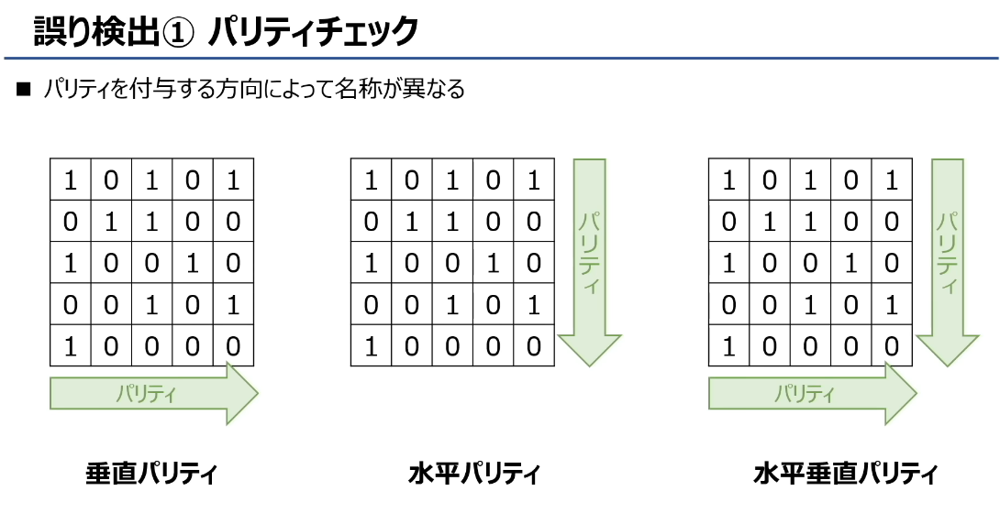
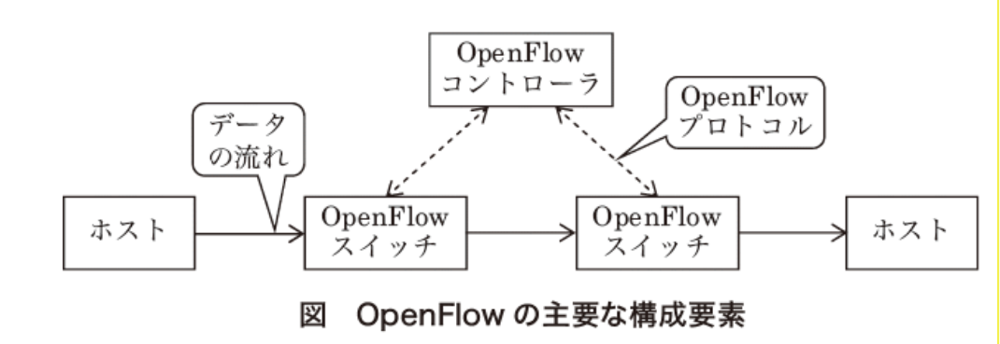

# 「回線」（かいせん / kaisen）
主要意思是：
线路、通信线路、网络连接

#  伝送時間（传输时间）的核心要素
传输时间，就是数据从发送端到接收端的耗时，主要受3个因素影响：

1.  **① データ容量（数据量）**
    要发送的数据的总大小，单位通常是 bit（比特）。数据量越大，传输时间越长。

2.  **② 回線速度（线路速度/带宽）**
    单位是 **bps（bit per second，比特/秒）**，表示**每秒最多能传输的比特数**。
    线路速度越快，传输时间越短。

3.  **③ 伝送効率（传输效率）・回線利用率（线路利用率）**
    实际传输中，因为协议开销、错误重传等原因，线路无法100%利用，实际传输的数据量会减少。
    传输效率（利用率）越低，实际每秒能传的数据越少，传输时间就越长。

---

## 二、关键公式与计算示例
### 1. 核心公式
- 理论传输时间：
  \[
  \text{伝送時間（秒）} = \frac{\text{データ容量（bit）}}{\text{回線速度（bps）}}
  \]
- 考虑传输效率的实际传输时间：
  \[
  \text{実効速度（bps）} = \text{回線速度} \times \text{伝送効率}
  \]
  \[
  \text{実際の伝送時間（秒）} = \frac{\text{データ容量（bit）}}{\text{実効速度（bps）}}
  \]

### 2. 示例解析
题目例子：回線速度 3 Mbps、伝送効率 50%
- 回線速度：3 Mbps = 3,000,000 bit/秒
- 実効速度：3 Mbps × 50% = 1.5 Mbps = 1,500,000 bit/秒
- 含义：每秒实际只能传输 1.5 Mbit 的数据，传输效率会直接降低实际传输速度。

---

## 三、一句话总结
传输时间由「数据量 ÷（线路速度 × 传输效率）」决定，数据量越大、线路越慢、效率越低，传输时间就越长。

# LAN WAN 

## 1. LAN（Local Area Network，局域网）
- **日语原文**：家庭内や事業所など狭い範囲のネットワーク
- **中文翻译**：家庭、办公室等**小范围**的网络
- **通俗解释**：
  就是你家里/公司里的网络，比如你手机连的Wi-Fi、电脑插的网线，都属于LAN。
  特点：范围小、速度快、延迟低，通常是你自己或公司管理的。
- **例子**：家里的Wi-Fi网络、公司内部的办公网络、学校机房的网络。

## 2. WAN（Wide Area Network，广域网）
- **日语原文**：LANよりも広い範囲のネットワーク
- **中文翻译**：比LAN覆盖范围更广的网络
- **通俗解释**：
  连接不同LAN的“大网”，比如互联网本身就是最大的WAN。
  你家的LAN通过运营商的线路，连到全国/全世界的网络，就属于WAN的范畴。
- **例子**：运营商的骨干网、跨城市的企业专线、互联网本身。

## 3. LAN vs WAN 关键区别
| 对比项 | LAN（局域网） | WAN（广域网） |
| :--- | :--- | :--- |
| **覆盖范围** | 小（几米到几公里） | 大（跨城市/国家） |
| **速度** | 通常很快（百兆/千兆/万兆） | 相对较慢（受运营商线路限制） |
| **延迟** | 低 | 较高 |
| **管理者** | 个人/公司/学校 | 运营商/互联网服务提供商 |
| **典型场景** | 家庭Wi-Fi、公司内网 | 互联网、跨城企业专线 |

## 4. 一句话总结
- **LAN**：你“身边的小网络”，比如家里、办公室的网络。
- **WAN**：连接这些小网络的“大网络”，比如互联网，让你能访问全世界的服务器。

## 一、有線LAN（有线局域网）
图中介绍了它的核心技术：
- **イーサネット（Ethernet，以太网）**：是有线LAN最主流的标准。
- **CSMA/CD方式（载波监听多路访问/冲突检测）**：
Carrier Sense Multiple Access with Collision Detection
英文缩写	英文全称	中文含义	作用说明
CS	Carrier Sense	载波监听	设备发送数据前，先监听信道是否空闲，避免一开始就冲突
MA	Multiple Access	多路访问	多个设备共享同一信道，都可以接入并发送数据
CD	Collision Detection	冲突检测	发送过程中持续监听，一旦发现数据冲突，立即停止发送并执行退避重传

  1.  先监听网络状态，在空闲时发送数据。
  2.  如果多台设备同时发送、数据发生冲突（コリジョン），会等待后重新发送。
  3.  目的是避免数据碰撞，保证传输稳定。

## 二、無線LAN（无线局域网，Wi-Fi）
图中提到了它的两个核心特点：
- **利便性が高い（便利性高）**：不需要网线，设备可以自由移动，安装和使用都很方便。
- **セキュ（セキュリティ，安全性）**：（图中被遮挡）这是无线LAN的重点，因为信号是广播传播的，比有线更容易被窃听，所以需要通过加密（如WPA2/WPA3）来保障安全。

## 一句话总结
- 有线LAN（以太网）靠CSMA/CD避免数据冲突，传输稳定可靠；
- 无线LAN（Wi-Fi）主打方便灵活，但安全性是需要重点关注的问题。

# プロトコル（Protocol，网络协议）

### 1. 什么是网络协议？
**プロトコル（Protocol）**，就是网络设备之间通信时，必须共同遵守的一套**“规则/约定”**。
就像寄信时，寄件人和收件人必须对“地址怎么写、信封怎么贴、多久寄到”达成一致，否则信就送不到。

### 2. 图里的比喻解析
- 上方两台电脑通过「ネットワーク回線（网络线路）」传输「データ（数据）」，就像两个人寄信。
- 左边的人说：「**翌日に郵便局へ**」（第二天送到邮局）
- 右边的人说：「**3日後に自宅へ**」（三天后送到家里）
- 中间的信封被打了叉：表示**双方规则不一致，通信失败**。

这个例子说明：
如果两台设备没有统一的协议（比如数据格式、传输时机、错误处理方式），就像两个人用不同的寄信规则，数据根本无法正常传输。

### 3. 一句话总结
网络协议（プロトコル）就是设备之间的“通信约定”，只有双方遵守相同的规则，数据才能顺利发送和接收。常见的例子比如 TCP/IP、HTTP、Wi-Fi 协议，都是这类“约定”。

# OSI基本参照モデル

### 第1層：物理層（ぶつりそう / Physical Layer）
- **英文**：Physical Layer
- **中文**：物理层
- **说明**：负责最底层的物理传输，定义线缆、电压、信号、连接器等硬件层面的标准，比如 RS-232、UTP（网线）等。它只负责传输“0和1的比特流”，不关心数据的具体含义。

### 第2層：データリンク層（データリンクそう / Data Link Layer）
- **英文**：Data Link Layer
- **中文**：数据链路层
- **说明**：把物理层的比特流打包成“帧（Frame）”，负责相邻设备间的可靠传输、差错检测和MAC地址寻址。常见协议有PPP、Ethernet（以太网）。

### 第3層：ネットワーク層（ネットワークそう / Network Layer）。中继与路径控制（路由选择）
- **英文**：Network Layer
- **中文**：网络层
- **说明**：负责跨网络的路由和寻址，通过IP地址找到目标设备，同时处理路由选择、拥塞控制。常见协议有IP、ARP、ICMP。

### 第4層：トランスポート層（トランスポートそう / Transport Layer）
- **英文**：Transport Layer
- **中文**：传输层
- **说明**：负责端到端的数据传输，提供可靠（TCP）或不可靠（UDP）的传输服务，处理流量控制、错误重传和端口寻址。常见协议有TCP、UDP。

### 第5層：セッション層（セッションそう / Session Layer）
- **英文**：Session Layer
- **中文**：会话层
- **说明**：负责建立、管理和终止两台设备之间的通信会话，控制连接的建立、维持和断开。常见协议有NetBIOS、DSI。

### 第6層：プレゼンテーション層（プレゼンテーションそう / Presentation Layer）
- **英文**：Presentation Layer
- **中文**：表示层
- **说明**：负责数据的格式转换、加密解密和压缩解压缩，让不同系统能互相理解数据。常见协议/标准有TLS、SSL、JPEG、MPEG。

### 第7層：アプリケーション層（アプリケーションそう / Application Layer）
- **英文**：Application Layer
- **中文**：应用层
- **说明**：直接面向用户的应用程序，提供网络服务的接口，比如网页浏览、邮件、文件传输等。常见协议有HTTP、DHCP、DNS、SMTP、POP。

### 一句话总结
OSI七层模型从下到上，是从「物理硬件传输」到「用户应用交互」的分层设计，每层只负责自己的特定任务，通过层间协作完成完整的网络通信。

### 1. NIC（ニック / Network Interface Card）
- **中文**：网络接口卡（网卡）
- **原文说明**：データを電気信号に変換してケーブルに流す装置
- **通俗解释**：电脑/设备上的“网络接口”，负责把数据转换成电信号，通过网线发送出去；同时也把收到的电信号还原成数据。是设备接入网络的物理入口。

### 2. リピータ（Repeater）
- **中文**：中继器
- **原文说明**：電気信号を増幅させ、通信距離を延ばす装置
- **通俗解释**：网线传输时信号会衰减、变弱，中继器的作用就是把变弱的电信号放大、整形，让它能传得更远。它只处理物理层的电信号，不理解数据内容。

### 3. リピータハブ（Repeater Hub）
- **中文**：中继集线器（Hub）
- **原文说明**：リピーターが複数連なったもの
- **通俗解释**：相当于“多端口的中继器”，可以同时连接多台设备，把收到的信号向所有端口广播转发，起到信号放大和扩展连接的作用。同样只工作在物理层，不做任何数据过滤或寻址。

一句话总结：这三个都是**工作在OSI第1层（物理层）的设备**，核心都是处理“物理电信号”，不理解数据内容：
- NIC：设备接入网络的接口
- Repeater：放大信号、延长传输距离
- Hub：多端口的中继器，广播转发信号

### 核心概念
这张图讲的是**数据链路层（第2层）的网络设备：网桥（ブリッジ）和交换机（スイッチングハブ/レイヤ2スイッチ）**，它们的核心作用是基于MAC地址转发数据。

### 1. ブリッジ（Bridge / 网桥）
- **作用**：连接多个网络段（セグメント），根据**MAC地址**判断数据帧的目标位置，只把数据转发到目标设备所在的网段，而不是像集线器那样全网广播。
- **效果**：可以隔离网段内的冲突域，减少网络拥堵，提升传输效率。

### 2. スイッチングハブ（Switching Hub / 交换机）
- **本质**：图里写得很清楚，就是「ブリッジが複数連なったもの」——**多端口的网桥**，也叫レイヤ2スイッチ（二层交换机）。
- **作用**：和网桥原理一样，也是基于MAC地址转发数据，但端口更多，能直接连接多台设备，每个端口都是一个独立的冲突域，效率比集线器高得多。

### 一句话总结
网桥和二层交换机都是工作在数据链路层的设备，它们靠MAC地址智能转发数据，实现了网段间的高效通信和冲突域隔离，交换机本质上就是多端口的网桥。

セグメント　　segment　　网段 / 网络段（也可译为 “分段”）

#  ルーター（Router / 路由器）
- **日文说明**：IPアドレスを元にネットワーク間を中継
- **中文翻译**：基于IP地址，在不同网络之间转发数据的设备
- **通俗解释**：
  它是工作在 **OSI第3层（网络层）** 的核心设备，作用是**连接不同的网络**，帮数据找到跨网络传输的最佳路径。
  比如图里的两个大圈，就是两个独立的局域网，路由器负责把它们连起来，让两边的设备能互相通信。

### 核心特点
1.  **基于IP地址转发**：和交换机（二层设备）用MAC地址转发不同，路由器靠IP地址判断数据的目标网络，能跨网段转发数据。
2.  **隔离广播域**：每个路由器接口都是一个独立的广播域，能阻止广播风暴扩散，提升网络效率和稳定性。
3.  **路由选择**：会学习和维护路由表，选择最优路径转发数据，是互联网能正常工作的关键设备。

### 举个生活例子
你家里的Wi-Fi路由器，就是典型的路由器：
- 一边连接运营商的互联网（WAN口）
- 一边连接家里的电脑、手机等设备（LAN口）
它帮你把“家庭局域网”和“互联网”这两个不同的网络连起来，实现上网。

### ゲートウェイ（Gateway / 网关）

#### 1. 基础信息
- **日文原文**：ゲートウェイ
- **英文**：Gateway
- **中文**：网关

#### 2. 图中定义解析
> 第4層以上が異なるネットワーク間でプロトコル変換を行う装置

翻译：**在第4层（传输层）以上协议不同的网络之间，执行协议转换的设备**。

通俗来说，网关就是不同“语言体系”的网络之间的**翻译官**：
- 路由器只负责基于IP地址转发数据（工作在第3层），但网关能处理更高层的协议差异。
- 它能让使用不同通信协议、不同数据格式的网络，互相理解并传输数据。

#### 3. 核心特点
- **工作层级**：工作在OSI模型的第4层（传输层）及以上，甚至到应用层，比路由器（第3层）的处理层级更高。
- **核心功能**：协议转换。比如把一种网络的通信协议转换成另一种网络能识别的格式，让原本无法直接通信的网络实现互联。
- **典型场景**：
  - 不同架构的企业网络之间互联
  - 传统网络与新型网络（如IoT网络）之间的协议转换
  - 也常被用来指代家庭网络中连接局域网与互联网的设备（如路由器），这是更广义的说法。

#### 一句话总结
网关是**跨协议网络的“翻译器”**，负责在不同协议的网络之间转换数据格式，实现它们的通信互联，是比路由器功能更复杂的网络互联设备。

ルーティング（路由选择）
英文原文：Routing
含义：指路由器等网络设备，根据目标 IP 地址，为数据包选择从源网络到目标网络的最优传输路径的过程。

エンドシステム
英文原文：End System（也常被称为 Host）
中文释义：端系统 / 终端系统 / 主机
含义：指网络中数据通信的起点和终点设备，也就是我们日常使用的电脑、手机、服务器等。
它们不负责路由转发，只负责发起或接收数据，是网络通信的 “端点”。

### 1. IP（Internet Protocol，网际协议）
- **所属层级**：OSI第3层（ネットワーク層 / 网络层）
- **核心作用**：定义了不同网络之间的连接方式，给设备分配IP地址，基于IP地址用数据包传输数据。
- **通俗解释**：它就像网络世界的「地址系统」，给每台设备分配唯一IP，让数据能跨网络找到目标设备，是整个互联网的寻址基础。
- **关键词**：IP地址、路由寻址、跨网络传输

### 2. TCP（Transmission Control Protocol，传输控制协议）
- **所属层级**：OSI第4层（トランスポート層 / 传输层）
- **核心作用**：必须先和通信对方确认连接（三次握手），再进行通信，能提供高可靠性的数据传输。
- **通俗解释**：它是「靠谱的快递服务」，发送前先确认对方是否能接收，传输中会检查数据是否完整、有没有丢失，丢了会重传，确保数据100%送达。
- **关键词**：面向连接、可靠传输、三次握手、数据校验与重传

### 3. UDP（User Datagram Protocol，用户数据报协议）
- **所属层级**：OSI第4层（トランスポート層 / 传输层）
- **核心作用**：不需要和对方确认连接，直接发送数据，可靠性较低但速度快，常用于直播等需要实时性的场景。
- **通俗解释**：它是「只管发送的广播」，不确认对方是否在线、是否收到数据，也不处理丢包，追求极致的速度和低延迟，适合对实时性要求高、能容忍少量数据丢失的场景。
- **关键词**：无连接、不可靠传输、低延迟、实时性优先

### 一句话总结
- **IP**：管「地址和路径」，让数据知道要去哪、走哪条路；
- **TCP**：管「可靠传输」，确保数据不丢、不乱、不重复；
- **UDP**：管「快速传输」，优先保证速度和实时性，牺牲部分可靠性。

#  グローバルIPアドレス と プライベートIPアドレス
翻译：**公网IP地址（全球IP）与私网IP地址（私有IP）**

### 核心目的
图中提到：「IPアドレスをグローバルIPアドレスとプライベートIPアドレスに分けることで、IPアドレスの数を節約している」
→ **把IP地址分为公网和私网，是为了节省公网IP的数量**，解决IPv4地址不足的问题。

### 1. プライベートIPアドレス（私网IP / 私有IP）
- **定义**：仅在企业/家庭的局域网（LAN）内部使用的IP地址，不同局域网之间可以重复使用。
- **特点**：
  - 只要在**同一个局域网内不重复**就行，比如图里A社和B社的电脑都用了`192.168.0.1`，完全没问题。
  - 常见网段：`192.168.x.x`、`10.x.x.x`、`172.16.x.x ~ 172.31.x.x`
- **作用**：给局域网内的设备分配地址，让它们能互相通信，不用占用稀缺的公网IP。

### 2. グローバルIPアドレス（公网IP / 全球IP）
- **定义**：在整个互联网中唯一的IP地址，不能重复，由运营商分配。
- **特点**：
  - 全球唯一，每个公网IP只能分配给一个连接互联网的设备（通常是路由器）。
  - 图里的服务器、数据库使用的就是公网IP，能被互联网上的所有设备访问。
- **作用**：让局域网内的设备能访问互联网，也能让互联网上的其他设备找到你的网络。

### 一句话总结
- **私网IP**：局域网内用，可重复，不占公网资源；
- **公网IP**：互联网用，全球唯一，数量有限；
- 路由器通过NAT（网络地址转换），把多个私网IP映射到同一个公网IP上，实现“多设备共享一个公网IP上网”，这就是节省IP地址的核心方法。

# **NAT / NAPT / IPマスカレード** 

## 一、核心背景：为什么需要它们？
- 互联网的公网IP（グローバルIP）数量有限，而企业/家庭局域网内的设备越来越多，无法为每台设备分配一个公网IP。
- 因此引入了**私网IP（プライベートIP）**：局域网内的设备可以重复使用同一套私网IP（比如192.168.0.1），但私网IP无法直接在互联网上路由。
- **NAT/NAPT就是用来解决这个问题的技术**：把多个私网IP“转换”成少数公网IP，让局域网设备能共享公网IP访问互联网。

## 二、NAT（Network Address Translation）
- **定义**：将私网IP地址转换为公网IP地址的基础机制。
- **特点**：早期的NAT是**一对一转换**，一个私网IP对应一个公网IP，虽然能实现转换，但无法节省公网IP数量，现在基本被NAPT取代。
- 你之前的图里也特意标注了正确的英文拼写是 **Translation**，不是 Transition。

## 三、NAPT（Network Address Port Translation）/ IPマスカレード
- **定义**：
  图里的原文说明：**複数のプライベートIPアドレスをグローバルIPアドレスに変換する仕組み**
  → 翻译：将多个私网IP地址转换为同一个公网IP地址的机制。
- **核心原理**：
  1.  **多对一映射**：多个局域网设备共享同一个公网IP。
  2.  **端口区分**：路由器通过不同的「端口号」来区分不同设备的连接，比如：
      - 电脑A：`192.168.0.2:1234` → 公网IP: `203.0.113.5:50001`
      - 手机B：`192.168.0.3:5678` → 公网IP: `203.0.113.5:50002`
- **IPマスカレード（IP Masquerade）**：
  是Linux系统中NAPT的实现方式，也常被用来指代这种“多设备共享一个公网IP”的技术，也就是我们家用路由器里的NAT功能。
- **关键优势**：
  - 大幅节省公网IP地址，解决了IPv4地址不足的问题。
  - 隐藏了局域网内设备的真实IP，提升了网络安全性。

## 四、一句话总结
- **NAT**：是“私网IP转公网IP”的基础技术，早期是一对一转换；
- **NAPT/IPマスカレード**：是NAT的进阶版，通过「公网IP+端口号」的方式，让多个私网设备共享一个公网IP上网，是现在家用/企业网络的主流方案。

NAT 是 一对一
NAPT/IPマスカレード 多对一

#  DHCP
- **全称**：Dynamic Host Configuration Protocol（动态主机配置协议）
- **核心定义**：
  图中原文：`IPアドレスの割り当てなどネットワークの設定を自動化できる仕組み`
  → 翻译：**能自动分配IP地址等网络设置的机制**。

### 二、它解决了什么问题？
在局域网（LAN）中，每台设备都需要一个不重复的IP地址才能通信。
如果手动给每台电脑/手机设置IP，既麻烦又容易重复出错，DHCP就是用来解决这个问题的。

### 三、工作方式
1.  **自动分配IP**：局域网内的设备开机后，会自动向DHCP服务器（通常集成在路由器里）请求IP地址。
2.  **避免冲突**：DHCP服务器会从预设的地址池中，分配一个唯一的IP给设备，确保LAN内没有重复IP。
3.  **顺带配置其他参数**：除了IP地址，还能自动分配子网掩码、网关、DNS服务器等信息，设备拿到后就能直接上网，无需手动设置。

### 四、一句话总结
DHCP就是局域网里的「IP地址管家」，它自动给设备分配不重复的IP和网络参数，省去了手动配置的麻烦，是我们日常上网的基础技术之一。

# **ドメイン（域名）**   **DNSサーバー（DNS服务器）**

### 1. ドメイン（Domain / 域名）
- **通俗解释**：就是我们平时上网输入的网址，比如图里的 `www.facebook.com`。
- **作用**：IP地址是一串难记的数字（比如`31.13.82.1`），域名就是它的“别名”，让我们能通过好记的名字访问网站，不用背数字IP。

### 2. DNSサーバー（DNS服务器）
- **全称**：DNS（Domain Name System，域名系统）服务器
- **核心作用**：图里写得很清楚：**IPアドレスとドメインを結びつける**，也就是「把域名翻译成IP地址」的“网络翻译官”。
- **工作流程（图里的例子）**：
  1.  你的电脑向DNS服务器提问：`https://www.facebook.com/` 的IP地址是什么？
  2.  DNS服务器回复：它的IP是 `31.13.82.1`。
  3.  电脑拿到IP后，再去访问这个地址，就能打开Facebook的网页了。

### 一句话总结
- **域名**：IP地址的“好记别名”，方便人类使用；
- **DNS服务器**：负责把域名翻译成IP地址，让电脑能找到目标服务器，是我们上网的“导航系统”。

# **IP地址的「类（クラス）」划分，以A类（クラスA）为例**

### 一、核心概念：IP地址的结构
IPv4地址由32位二进制组成，被分为两部分：
- **ネットワーク部（网络号）**：标识设备所在的网段，同一网段的设备共享相同的网络号。
- **ホスト部（主机号）**：标识网段内的某一台具体设备，同一网段内的主机号必须唯一。

而「クラス（类）」就是用来定义这两部分如何划分的标准，A/B/C类的区别，就是网络号和主机号的长度不同。

### 二、クラスA（A类IP地址）详解
1.  **网络号与主机号划分**
    - 先头**8位（1字节）是网络号**，剩余**24位（3字节）是主机号**。
    - 二进制格式：`0xxxxxxx.xxxxxxxx.xxxxxxxx.xxxxxxxx`（第一位固定为0）

2.  **主机数量计算**
    主机号占24位，理论上可容纳的设备数为：
    \[
    2^{24} = 16,777,216
    \]
    也就是图里写的 **1677万7216台设备**。

3.  **特殊地址说明**
    主机号全0和全1的地址不能分配给设备使用：
    - **ネットワークアドレス（网络地址）**：主机号全0，用来标识整个网段，比如`10.0.0.0`。
    - **ブロードキャストアドレス（广播地址）**：主机号全1，用来向网段内所有设备发送广播数据，比如`10.255.255.255`。
         Broadcast Address
    
    因此实际可用的主机数是：$2^{24} - 2 = 16,777,214$ 台。
    
### 三、一句话总结
A类IP地址用**8位做网络号、24位做主机号**，适合超大型网络，每个网段最多可容纳约1677万台设备，但主机号全0/全1的地址需保留为网络地址和广播地址，无法分配给普通设备使用。

### クラス B（B 类地址）
原文：先頭 16 ビットがネットワーク部、残り 16 ビットがホスト部
翻译：开头 16 位为网络号，剩余 16 位为主机号
特点：二进制前两位固定为10
可用主机数：
2的16次方 − 2 = 65,534 （减去了网络地址和广播地址）

### クラス C（C 类 IP 地址）总结
1. 基本结构
日文原文：先頭 24 ビットがネットワーク部、残り 8 ビットがホスト部
翻译：开头 24 位为网络号，剩余 8 位为主机号
二进制特征：前 3 位固定为110，因此地址范围为：
十进制：192.0.0.0 ~ 223.255.255.255
2. 主机数量计算
主机号占 8 位，理论上可表示的数量为：
2的8次方 = 256
但需要减去两个特殊地址：
主机号全0：网络地址
主机号全1：广播地址
因此实际可用主机数为：
2的8次方−2 = 254 台

这张表把**A/B/C三类私网IP地址**的范围和记忆方法都列出来了，我帮你一次性整理清楚👇

---

### 核心说明
私网IP（プライベートIPアドレス）是专门给局域网内部使用的IP地址，不能直接在互联网上路由。
它们按A/B/C类划分，每类都有固定的地址范围，不同局域网之间可以重复使用这些地址，以此节省公网IP资源。

##  三类私网IP地址详解

### 1. クラスA（A类私网IP）
- **地址范围**：`10.0.0.0 ～ 10.255.255.255`
- **记忆方法**：
  - 「最初：10.0」「最後：10.255」
  - 简单说就是：`10.x.x.x` 整个网段都属于A类私网IP
- **特点**：范围最大，可容纳约1677万台设备，适合超大型企业/机构内部网络。

### 2. クラスB（B类私网IP）
- **地址范围**：`172.16.0.0 ～ 172.31.255.255`
- **记忆方法**：
  - 日语谐音：「いなにいちろく（172.16）～ いなにさんいち（172.31）」
  - 简单说就是：`172.16.x.x` 到 `172.31.x.x` 的16个网段
- **特点**：中等规模，每个网段可容纳约65534台设备，适合中大型企业网络。

### 3. クラスC（C类私网IP）
- **地址范围**：`192.168.0.0 ～ 192.168.255.255`
- **记忆方法**：
  - 日语谐音：「いちくにいちろっぱ（192.168）」，首尾都是 `192.168.x.x`
- **特点**：范围最小，每个网段最多容纳254台设备，是我们家用路由器最常用的私网IP段。

### 一句话总结
私网IP的三个核心网段：
- **A类**：`10.0.0.0/8`（`10.x.x.x`）
- **B类**：`172.16.0.0/12`（`172.16.x.x` ~ `172.31.x.x`）
- **C类**：`192.168.0.0/16`（`192.168.x.x`）

这些地址只能在局域网内使用，不同网络之间重复使用也不会冲突，是IPv4地址不足的重要解决方案之一。

#  IPアドレス と サブネットマスク  sub net mask
**翻译：IP地址 与 子网掩码**

### 顶部说明
- 原文：サブネットマスクを用意することでIPアドレスのネットワーク部を自由に設定可能
- 翻译：**通过使用子网掩码，可以自由设定IP地址的网络号部分**

### 示例参数
- IPアドレス：`192.168.0.1` → IP地址：192.168.0.1
- サブネットマスク：`255.255.255.192` → 子网掩码：255.255.255.192

### 二进制解析部分
1.  **IPアドレス（IP地址）二进制**
    `11000000 10101000 00000000 00000001`（对应192.168.0.1）
2.  **サブネットマスク（子网掩码）二进制**
    `11111111 11111111 11111111 11000000`（对应255.255.255.192）
3.  **ネットワーク部（网络号部分）**：先頭26ビット（开头26位）
    - 子网掩码中为`1`的部分，就是网络号，这里是前26位
4.  **ホスト部（主机号部分）**：後半6ビット（后6位）
    - 子网掩码中为`0`的部分，就是主机号，这里是后6位

### 底部说明
- 原文：★サブネットマスクを使用することで柔軟にネットワークを設定することが可能
- 翻译：★**使用子网掩码，可以灵活地进行网络设置**

### 术语对照表
| 日文 | 英文 | 中文 |
|------|------|------|
| IPアドレス | IP Address | IP地址 |
| サブネットマスク | Subnet Mask | 子网掩码 |
| ネットワーク部 | Network Part | 网络号部分 |
| ホスト部 | Host Part | 主机号部分 |

### 一句话总结
这张图解释了**子网掩码的作用**：它通过二进制的`1`和`0`，来划分IP地址中的网络号和主机号，让我们可以打破A/B/C类地址的固定划分，灵活地把大网段划分为多个小网段，实现更精细的网络管理。

#  サブネットマスクの記載方法

- 标题：`サブネットマスクの記載方法` → **子网掩码的表示方法**
- 核心说明：`サブネットマスクはIPアドレスの後ろに記載される`
  → 翻译：**子网掩码通常写在IP地址的后面**，用来明确划分网络号和主机号。

## 二、两种表示方法详解
#### 1. 記載方法①：点分十进制表示法
例子：`192.168.0.1 / 255.255.255.192`
- 直接写出完整的子网掩码（`255.255.255.192`），是最直观的表示方式。
- 对应二进制：`11111111 11111111 11111111 11000000`

#### 2. 記載方法②：CIDR（斜线）表示法
例子：`192.168.0.1 / 26`
- 用`/数字`的形式表示，数字就是**子网掩码中连续的`1`的个数**（也就是网络号的位数）。
- 这里的`/26`，就是指子网掩码里有26个连续的`1`，和`255.255.255.192`是完全等价的。

### 三、原理说明（结合图中的二进制）
- 图里的子网掩码二进制是：`11111111 11111111 11111111 11000000`
- 其中`1`的个数：前3个字节全是`1`（24个），第4个字节前两位是`1`（2个），总共`24+2=26`个。
- 所以`/26`就是对这个子网掩码的简化写法，和`255.255.255.192`完全等效。

### 一句话总结
子网掩码有两种表示方式：
1.  **点分十进制**：`255.255.255.192`（完整写法）
2.  **CIDR斜线表示**：`/26`（简化写法，数字代表网络号位数，也就是掩码中`1`的个数）
两种写法完全等价，都是用来划分IP地址中网络号和主机号的部分。

# **OSI第7层（アプリケーション層/应用层）的常见协议**

### 标题：アプリケーション層のプロトコル
翻译：**应用层协议**

### 表格内容逐条解析
| プロトコル（协议） | 役割（作用/功能） | ポート番号（端口号） | 中文说明 |
| :--- | :--- | :--- | :--- |
| **HTTP** | Web情報を通信する際のルール | 80 | 超文本传输协议，用于网页数据传输 |
| **FTP** | ファイルを転送する際のルール | 20, 21 | 文件传输协议，用于文件上传/下载 （20为数据端口，21为控制端口） |
| **NTP** | 時刻を調整する際のルール | 123 | 网络时间协议，用于同步设备时间 |
| **SMTP** | メールを送信する際のルール | 25 | 简单邮件传输协议，用于发送邮件 |
| **POP3** | メールを受信する際のルール （メールサーバーからコンピューターにメールを落とす） | 110 | 邮局协议版本3，用于从服务器接收邮件并下载到本地 |
| **IMAP** | メールを受信する際のルール （メールサーバー上でメールを確認する） | 143 | 互联网消息访问协议，用于在服务器上直接管理邮件 |

### 一句话总结
这张表是应用层核心协议的「功能+端口号」对照表：
- **网页**：HTTP（80）
- **文件传输**：FTP（20/21）
- **时间同步**：NTP（123） network time protocol
- **邮件发送**：SMTP（25）
- **邮件接收（下载到本地）**：POP3（110）
- **邮件接收（服务器管理）**：IMAP（143）

### 📧 MIME 是什么？
**MIME** 全称是 **Multipurpose Internet Mail Extensions**，中文叫「多用途互联网邮件扩展」，是一个扩展邮件功能的标准规范。

### 🔍 核心背景与作用
1.  **原始邮件的限制**
    早期的邮件协议（比如SMTP），**只能处理半角英数字和简单符号**，不支持日语、中文等非ASCII字符，也无法发送图片、音频等二进制附件。

2.  **MIME的解决思路**
    它对邮件格式进行了扩展，让邮件可以支持：
    - 非ASCII字符（比如日语、中文等多语言文本）
    - 图片、音频、视频、文件等二进制附件
    - 混合内容（比如正文+附件、HTML格式邮件）

### 💡 一句话通俗理解
MIME就像给邮件协议加了一个「翻译器」：
- 把日语、图片、音频等复杂内容，转换成邮件协议能看懂的格式发送；
- 对方收到后再还原成原本的内容，这样邮件就能支持多语言和附件了。

### 🌐 不只是邮件在用
现在MIME已经超出了邮件的范畴，成为了互联网的通用标准：
- 浏览器和服务器之间传输文件时，会用MIME类型（比如`text/html`、`image/jpeg`）告诉对方“这是什么格式的数据”；
- 很多API接口也会用MIME类型（如`application/json`）定义数据格式。

### 🔑 关键要点总结
| 项目 | 说明 |
|------|------|
| 全称 | Multipurpose Internet Mail Extensions |
| 核心目的 | 扩展邮件协议，支持多语言文本和二进制附件 |
| 解决的问题 | 早期邮件仅支持半角英数字，无法处理日语、图片、音频等 |
| 应用场景 | 邮件、网页传输、API数据格式定义等 |

# 奇偶校验（パリティチェック / Parity Check）

### 一、核心定义
- **日文原文**：ビット列にパリティビットを付与することで誤りを検出する方法
- **翻译**：一种通过在比特序列中添加「奇偶校验位（パリティビット）」来检测数据传输错误的方法。

### 二、工作原理（以图中的「奇数奇偶校验」为例）
1.  **发送方处理**
    先统计原始数据比特中`1`的个数，然后添加校验位，让整个数据（含校验位）中`1`的总数为**奇数**。
    - 比如图中上方数据：`11010000`，原始`1`的个数是3（奇数），所以校验位为`1`，保持总数为奇数。
    - 下方数据：`01011000`，原始`1`的个数是3（奇数），校验位为`0`。

2.  **接收方校验**
    统计收到的整个数据中`1`的个数：
    - 如果是**奇数** → 认为数据正确（或未检测出错误）
    - 如果是**偶数** → 判定传输过程中发生了错误

### 三、关键局限性（图中重点标注）
- 只能检测出**奇数个比特错误**（比如1位、3位比特翻转）。
- 如果发生了**偶数个比特错误**（比如同时有2位比特翻转），`1`的个数奇偶性不会改变，校验会认为数据是正确的，**无法检测出错误**。
  图里的例子就展示了这种情况：两个比特同时翻转，`1`的个数依然是奇数，错误被“隐藏”了。

### 四、一句话总结
奇偶校验是通过添加校验位，让数据中`1`的个数保持固定奇偶性来检测错误的方法，简单但有明显缺陷：只能发现奇数个比特错误，无法检测偶数个错误，也不能纠正错误。

# 奇偶校验的三种方式

### 一、垂直奇偶校验（垂直パリティ）
#### 原理
- 把数据按列分组，**为每一列添加一个校验位**，让每一列中`1`的个数保持固定奇偶性（奇校验/偶校验）。
- 图中箭头向右，表示校验位是按列计算，添加在每一行的末尾。

#### 特点
- 可以检测出某一列中的奇数个比特错误。
- 无法检测跨列的偶数个错误（比如两列各翻转1位），也无法纠正错误。

---

### 二、水平奇偶校验（水平パリティ）
#### 原理
- 把数据按行分组，**为每一行添加一个校验位**，让每一行中`1`的个数保持固定奇偶性。
- 图中箭头向下，表示校验位是按行计算，添加在每一列的末尾。

#### 特点
- 可以检测出某一行中的奇数个比特错误。
- 同样无法检测跨行的偶数个错误，也无法纠正错误。

---

### 三、水平垂直奇偶校验（水平垂直パリティ）
#### 原理
- 同时使用水平和垂直两种校验方式：
  1.  先给每一行添加水平校验位。
  2.  再给每一列（包括之前添加的水平校验位）添加垂直校验位。
- 图中同时有向右和向下的箭头，就是这两种校验的组合。

#### 特点
- **错误检测能力大幅提升**：不仅能检测出奇数个错误，还能检测出大多数偶数个错误。
- **具备错误纠正能力**：如果只有1个比特发生错误，水平和垂直校验都会失败，交叉定位就能知道是哪一行哪一列出错了，直接取反纠正。
- 局限性：如果发生2个比特错误，可能依然无法定位和纠正。

---

### 一句话总结
- **垂直校验**：按列校验，只能检测列内的奇数个错误。
- **水平校验**：按行校验，只能检测行内的奇数个错误。
- **水平垂直校验**：两者结合，既能检测又能纠正单个比特错误，可靠性最高。

# CRC

 **CRC（循环冗余校验，Cyclic Redundancy Check）**，一种比奇偶校验更可靠的通信错误检测技术。
### 一、原文翻译
> ビット列を生成多項式と呼ばれる特定の式で割り算を行い、その余りをチェック用データとして付加する。
>
> 翻译：将比特序列用一种叫做「生成多项式」的特定公式做除法运算，然后把得到的余数作为校验数据附加到原始数据上。

### 二、核心原理（通俗拆解）
1.  **发送方处理**
    - 把要发送的原始数据，用一个约定好的「生成多项式」（本质是一个二进制数，比如CRC-32用的多项式）做模2除法。
    - 计算得到一个固定长度的余数（比如16位、32位），这个余数就是**CRC校验码**。
    - 把原始数据和CRC校验码一起发送给接收方。

2.  **接收方校验**
    - 对收到的「原始数据+CRC校验码」整体，用同一个生成多项式再做一次模2除法。
    - 如果计算结果的余数为`0`，说明数据传输中没有发生错误；如果余数不为`0`，则判定数据出错。

### 三、关键特点
- **可靠性高**：和奇偶校验相比，CRC能检测出绝大多数错误，包括：
  - 所有奇数位错误
  - 大部分偶数位错误
  - 突发错误（连续多位比特错误）
- **效率高**：通过多项式除法计算，速度快，适合硬件实现，因此广泛用于以太网、硬盘、U盘等数据传输场景。
- **只能检错，不能纠错**：它能发现数据出错，但无法定位错误位置，也不能自动修正。

### 四、一句话总结
CRC是一种基于多项式除法的错误检测技术，它通过计算并附加一个校验余数，让接收方可以快速验证数据是否完整，是现代通信中最常用的校验方式之一。

# **SDN（软件定义网络）** 以及它的核心协议 **OpenFlow**

### 一、SDN（Software Defined Networking）
**原文**：ネットワーク設定をソフトウェアによって実現する
**翻译**：**用软件来实现网络配置与管理的网络架构**

#### 通俗理解
传统网络中，交换机、路由器的转发规则（比如路由、ACL）都是写死在硬件里的，要修改配置必须一台台登录设备操作，非常麻烦。
SDN把这两部分分开了：
- **数据平面**：只负责转发数据（由交换机/路由器等硬件完成）
- **控制平面**：负责决定数据怎么转发（由集中式的SDN控制器软件完成）
这样一来，我们可以直接在软件上统一下发规则，不用再逐个配置硬件，实现网络的自动化、灵活管理。

---

### 二、OpenFlow
它是SDN架构中，**控制器和交换机之间通信的标准协议**，用来传递控制指令。

图里把交换机的功能分成了两部分：
1.  **データ転送機能（数据转发功能）**
    由**ネットワーク機器（网络设备/交换机）**负责，只执行控制器下发的转发规则，不做任何决策。
2.  **経路制御機能（路径控制功能）**
    由**ソフトウェア（SDN控制器软件）**负责，决定数据该怎么走，再通过OpenFlow协议把规则发给交换机。

---

### 三、一句话总结
SDN的核心是「控制与转发分离」，让网络管理从硬件配置转向软件定义；而OpenFlow就是控制器和交换机之间传递转发规则的“翻译官”，让SDN架构能正常工作。

### 🔐 IPsec 科普
IPsec（IP Security）是一套工作在**网络层（OSI第3层）**的安全协议标准，用来给IP网络通信提供加密和认证保护。

### 图中要点解析
1.  **ネットワーク層のプロトコル（网络层协议）**
    IPsec直接在IP协议层面工作，所以它的保护是透明的：上层的TCP/UDP、应用层协议都感知不到，无需修改就能享受安全保护。

2.  **暗号化の機能（加密功能）**
    它能给IP数据包提供多种安全服务：
    - **加密（暗号化）**：把数据内容变成密文，防止传输过程中被窃听。
    - **认证**：验证数据发送方的身份，防止伪造和篡改。
    - **完整性校验**：确保数据在传输中没有被修改。

3.  **複数のプロトコルで構成（由多个协议组成）**
    IPsec不是单一协议，而是一套协议组合，核心包括：
    - **AH（Authentication Header）**：负责认证和完整性校验，不加密数据。
    - **ESP（Encapsulating Security Payload）**：既可以加密数据，也支持认证，是最常用的部分。
    - **IKE（Internet Key Exchange）**：负责安全协商和密钥交换，让双方能安全地建立加密通道。

### 💡 通俗理解
IPsec就像是给IP数据包穿了一件“防弹+防窃听”的隐身衣：
- 别人看不到里面的真实数据（加密）；
- 也没法冒充身份发假数据（认证）；
- 更没法中途篡改数据（完整性校验）。

### 🌐 典型用途
- **VPN（虚拟专用网）**：企业远程办公中，员工通过IPsec VPN安全连接到公司内网。
- **站点间加密**：企业不同分部之间的专线/互联网连接，用IPsec加密传输数据。
- **端到端安全**：直接给两台设备之间的通信加密，防止网络窃听。

### 一句话总结
IPsec是网络层的安全协议套件，通过加密、认证和完整性校验，让IP网络通信变得安全可靠，是企业VPN和跨站点加密的主流技术之一。

#  CGI 
**CGI** 全称是 **Common Gateway Interface（通用网关接口）**，是早期让静态网页“动起来”的技术标准，也是服务器端动态处理的基础。

---

### 图中要点拆解
1.  **原文：アンケートフォーム等動きのあるサイトが作成**
    翻译：用来制作问卷调查表单等**具有交互功能的动态网站**。
    - 早期的HTML网页只能展示静态内容（文字、图片），无法处理用户输入（比如表单提交、搜索请求）。
    - CGI就是用来解决这个问题的：它定义了浏览器和服务器之间传递数据的方式，让服务器可以运行程序来处理用户请求。

2.  **工作流程（图中示意）**
    - 浏览器（客户端）向服务器发送请求（比如提交表单、点击按钮）。
    - 服务器接收到请求后，调用对应的CGI程序（可以用Perl、Python、C等语言编写）来处理数据。
    - CGI程序处理完成后，把结果生成HTML页面，再返回给浏览器显示。
    - 图中的箭头就表示了这个“客户端请求 → 服务器程序处理 → 动态响应”的过程。

3.  **原文：サーバー側でプログラム稼働**
    翻译：**程序在服务器端运行**。
    - CGI程序是在服务器上执行的，用户看不到程序代码，只能看到返回的结果。
    - 比如你提交的问卷调查数据，就是通过CGI程序在服务器上处理、保存的。

---

### 💡 通俗理解
CGI就像是浏览器和服务器程序之间的“翻译官”：
- 浏览器说“我提交了一个表单”，CGI把这个请求传给服务器上的处理程序；
- 程序处理完数据后，CGI再把结果翻译成浏览器能看懂的HTML页面发回去。

---

### 📌 关键特点与现状
- **历史地位**：它是第一个让网页实现交互的技术，是ASP、PHP、JSP等后续动态网页技术的基础。
- **局限性**：每次请求都要启动一个新的进程来运行CGI程序，性能开销大，现在已经很少直接使用了。
- **现代替代方案**：现在更多使用FastCGI、PHP-FPM、Servlet等更高效的技术，但核心思想依然是“服务器端处理请求并动态生成响应”。

---

### 一句话总结
CGI是一个服务器端接口标准，让早期的静态网页可以通过调用服务器程序，实现表单提交、用户交互等动态功能，是现代Web交互技术的起点。

# 做题笔记

我们先把题目和术语拆解清楚，再解释每个词的含义：

---

### 题目翻译
> 问33 路由器决定数据包传输路径时，最主要使用的信息是哪一项？

---

### 关键术语解析

1.  **ルータ（Router / 路由器）**
    - 工作在OSI第3层（网络层）的设备，负责在不同网络之间转发数据包，决定传输路径。

2.  **パケット（Packet / 数据包）**
    - 网络层传输的数据单元，包含源IP、目标IP等信息，是路由转发的基本单位。

3.  **経路決定（けいろけってい / 路由选择）**
    - 路由器根据目标地址，在路由表中查找并选择最优转发路径的过程。

4.  **宛先IPアドレス（あてさきIPアドレス / 目标IP地址）**
    - 数据包要发送到的主机的IP地址，是路由器进行路由选择的核心依据。

5.  **宛先MACアドレス（あてさきMACアドレス / 目标MAC地址）**
    - 数据链路层的硬件地址，仅用于同一网段内的转发，路由器在跨网络转发时不会用它来决定路径。

6.  **発信元IPアドレス（はっしんもとIPアドレス / 源IP地址）**
    - 发送方的IP地址，路由器只会记录它，但不会用它来决定数据包的转发路径。

7.  **発信元MACアドレス（はっしんもとMACアドレス / 源MAC地址）**
    - 发送方的硬件地址，仅用于同一网段内的链路层通信，和路由选择无关。

---

### 补充：这道题的正确答案
路由器决定数据包路径，依靠的是**目标IP地址（宛先IPアドレス）**，所以正确选项是 **ア**。

---

### 一句话总结
- **IP地址**：跨网络路由用（路由器的核心依据）
- **MAC地址**：同一网段内转发用（交换机/二层设备的依据）

# 题目

## 一、核心知识点：SSID / BSSID / ESSID

### 1. SSID 是什么？
**SSID（Service Set Identifier）** 就是我们常说的「Wi-Fi名称」，比如你手机上看到的 `MyHomeWiFi` 就是一个SSID。
- **本质**：无线局域网的**网络标识符（ネットワーク識別子）**，用来区分不同的Wi-Fi网络。
- **格式**：最长32字节（オクテット）的字符串，由字母、数字等组成。
- **作用**：终端（手机/电脑）要连接Wi-Fi时，必须知道并设置和接入点（AP）相同的SSID，才能加入这个网络。
- **别名**：也被称为 **ESSID（Extended Service Set Identifier）**。

### 2. 容易混淆的 BSSID
**BSSID（Basic Service Set Identifier）** 是每个接入点（AP）的物理标识符，它和SSID完全不同：
- **本质**：就是接入点无线网卡的 **MAC地址**（48位二进制数）。
- **作用**：在底层通信中，用来标识具体的接入点设备。
- **关键区别**：
  - SSID是“网络的名字”，可以多个AP共用同一个SSID（比如公司里的多个AP）。
  - BSSID是“设备的物理地址”，每个AP都有唯一的BSSID。

---

## 二、题目解析

### 题目原文
> 無線LANで用いられるSSIDの説明として、適切なものはどれか。
> （关于无线局域网中使用的SSID的说明，正确的是哪一项？）

### 选项分析
- **ア**：48ビットのネットワーク識別子であり、アクセスポイントのMACアドレスと一致する。
  - 错误。48位、MAC地址，这描述的是**BSSID**，不是SSID。
- **イ**：48ビットのホスト識別子であり、有線LANのMACアドレスと同様の働きをする。
  - 错误。SSID不是主机标识符（ホスト識別子），也不是MAC地址。
- **ウ**：最長32オクテットのネットワーク識別子であり、接続するアクセスポイントの選択に用いられる。
  - 正确。和我们的知识点完全吻合：最长32字节的网络标识符，用于选择要连接的接入点。
- **エ**：最長32オクテットのホスト識別子であり、ネットワーク上で一意である。
  - 错误。SSID不是主机标识符，而且多个AP可以共用同一个SSID，不是“网络上唯一”的。

✅ **正解：ウ（选项C）**

---

## 三、总结
| 项目 | SSID | BSSID |
| :--- | :--- | :--- |
| 全称 | Service Set Identifier | Basic Service Set Identifier |
| 俗称 | Wi-Fi名称 | AP的MAC地址 |
| 长度 | 最长32字节字符串 | 48位二进制数 |
| 作用 | 标识网络，用户选择接入 | 标识具体设备，底层通信使用 |
| 是否唯一 | 可重复（多AP共用） | 设备唯一 |

SSID（Service Set Identifier）とは，最長32オクテットの英数字などを用いて表示される，無線LANにおけるネットワーク識別子（ID）のことであり，接続するアクセスポイントの選択に用いられる。したがって，（ウ）が正しい。このSSIDは，アクセスポイントと無線LAN端末の双方に設定し，無線LAN端末は，同じSSIDの値をもつアクセスポイントに接続できる。なお，SSIDは，ESSID（Extended Service Set Identifier）とも呼ばれる。

# ARP协议

ARP 确实很容易和 RARP 记反，我给你整理了几个**零混淆的巧记方法**，帮你把它们焊在脑子里👇

---

## 一、核心记忆口诀（最推荐，一秒区分）
1.  **ARP：IP → MAC（正向地址解析）**
    - 巧记：**A**ddress **R**esolution **P**rotocol → **A**=**Ahead**（向前/正向）
    - 口诀：**“A” 是正的，从 IP 往前找 MAC**
    - 补充：`ARP` 开头是 `A`，而我们平时上网，是“从上层（IP）往下层（MAC）找”，是一个正向流程。

2.  **RARP：MAC → IP（反向地址解析）**
    - 巧记：**R**everse ARP → **R**=**Reverse**（反向）
    - 口诀：**“R” 是反的，从 MAC 反查 IP**
    - 补充：`RARP` 多了个 `R`，就是 Reverse（反向），自然和 ARP 反过来。

---

## 二、场景联想记忆（结合实际用途，永不混淆）
- **ARP（IP→MAC）：日常上网必用**
  你要给 `192.168.1.1` 发数据，得先知道它的 MAC 地址，才能封装成以太网帧。
  → 这就是 **ARP 干的活**，所以它是我们“正向通信”的必备步骤，记成“IP 找 MAC，ARP 用得上”。

- **RARP（MAC→IP）：冷门场景才用**
  只有无盘工作站、老旧设备启动时，才会用 MAC 地址反向请求 IP。
  → 这是一个**反向的、不常用的流程**，记成“MAC 找 IP，RARP 才用”。

---

## 三、“单词拆分”记忆法（适合爱抠细节的你）
- **ARP：Address Resolution Protocol**
  - 拆解：**Resolution** = “解析、解决”
  - 逻辑：IP 是“逻辑地址”，MAC 是“物理地址”，ARP 就是**把逻辑地址解析成物理地址**的协议。

- **RARP：Reverse Address Resolution Protocol**
  - 拆解：**Reverse** = “反向、倒过来”
  - 逻辑：名字里直接写了 Reverse，所以就是把 ARP 的流程倒过来，**把物理地址解析成逻辑地址**。

---

## 四、避坑对比表（一眼看清区别）
| 协议 | 方向 | 巧记关键词 | 典型场景 |
| :--- | :--- | :--- | :--- |
| **ARP** | **IP → MAC** | **A**head（正向） | 日常网络通信、ARP缓存 |
| **RARP** | **MAC → IP** | **R**everse（反向） | 无盘工作站启动 |

---

💡 终极一句话：**ARP 是“IP 找 MAC”，RARP 就是把它反过来，多了个 R 就是反向**。

# 题目 

## 一、核心知识点：TCP连接的“四元组”
TCP连接在传输层识别的核心是**四元组（4-tuple）**，它是用来唯一标识一条TCP连接的4个信息：
1.  **送信元IP地址（源IP）**
2.  **宛先IP地址（目标IP）**
3.  **送信元TCPポート番号（源端口号）**
4.  **宛先TCPポート番号（目标端口号）**

### 为什么这四个必须同时存在？
- 源IP+目标IP：确定通信的两台设备。
- 源端口+目标端口：确定设备上的哪个应用进程在通信。
- 只有这四个组合起来，才能唯一区分同一台设备上的多个TCP连接（比如你同时开的浏览器、聊天软件）。

### 为什么MAC地址不需要？
MAC地址是数据链路层的地址，只在局域网内有效。TCP是传输层协议，它的连接标识是跨网络的，**MAC地址不会被用来识别TCP连接**。

## 二、题目解析
### 题目问题
> TCP/IPネットワークにおいて、TCPのコネクションを識別するために必要な情報の組合せはどれか。
> （在TCP/IP网络中，用来识别TCP连接所需的信息组合是哪一个？）

### 选项判断
- **ア**：只有目标IP和目标端口，缺少源IP和源端口，无法区分多个源设备的连接。
- **イ**：只有源IP和目标IP，缺少端口号，无法区分同一设备上的多个应用连接。
- **ウ**：源IP、目标IP、源端口、目标端口都齐全，也就是完整的**四元组**，可以唯一标识一条TCP连接。✅
- **エ**：包含了源MAC和目标MAC，这两个信息和TCP连接识别无关，错误。

---

## 三、一句话总结
识别TCP连接的核心是**“源IP+目标IP+源端口+目标端口”**组成的四元组，MAC地址不参与连接标识，所以这道题选**ウ（选项C）**。

# openflow

我们先把核心知识点讲清楚，再回头分析这道题。

---

## 一、核心知识点：SDN 与 OpenFlow
### 1. SDN（Software-Defined Networking，软件定义网络）
SDN 是一种**网络架构**，它的核心思想是把传统网络设备的两个关键功能**逻辑分离**：
- **データ転送機能（数据平面）**：只负责转发数据包，由交换机、路由器等硬件设备执行。
- **ネットワーク制御機能（控制平面）**：负责决定数据包的转发路径（路由规则），由集中式的软件控制器执行。

这种分离带来了巨大的灵活性：管理员不用再登录每一台设备配置规则，只需要在控制器上统一编程，就能管理整个网络的流量路径。

### 2. OpenFlow 协议
OpenFlow 是实现 SDN 的主流协议，它的作用是：
- 定义了**SDN控制器（コントローラ）**和**交换机（スイッチ）**之间的通信标准。
- 控制器通过 OpenFlow 协议，向交换机下发流表（转发规则），并接收交换机的状态反馈。
- 交换机根据流表执行数据转发，完全由控制器集中控制。

### 3. 其他相关概念辨析
- **SNMP**：用于网络监控和管理的协议，和 SDN 无关。
- **动态路由协议（RIP/OSPF）**：传统网络中，路由器之间互相交换路由信息、自行决定路径的方式，属于分布式控制，和 SDN 的集中式控制相反。
- **NFV（网络功能虚拟化）**：把防火墙、负载均衡等网络功能用软件实现，和 SDN 是互补技术，但不是同一概念。

---

## 二、题目解析
### 题目原文
> ONF（Open Networking Foundation）が標準化を進めているOpenFlowプロトコルを用いたSDN（Software-Defined Networking）の説明として、適切なものはどれか。
>
> （关于使用由ONF标准化的OpenFlow协议的SDN的说明，正确的是哪一项？）

### 选项分析
- **ア**：描述的是 SNMP/RMON，用于定期获取设备MIB信息进行监控，和SDN无关。❌
- **イ**：描述的是动态路由协议（如RIP/OSPF），设备之间交换路由信息决定路径，这是传统分布式路由，不是SDN。❌
- **ウ**：描述的是 NFV（网络功能虚拟化），把网络功能用软件实现，不是SDN的核心定义。❌
- **エ**：明确指出SDN的核心——将控制和转发功能逻辑分离，由控制器软件集中控制数据转发设备。✅ 这正是SDN的标准定义。

### 正解：**エ（选项D）**

---

## 三、一句话总结
SDN 的核心是**“控制与转发分离，由集中式控制器管理网络”**，OpenFlow 是控制器和交换机之间的通信协议。其他选项描述的都是传统网络或其他网络技术，和SDN无关。

