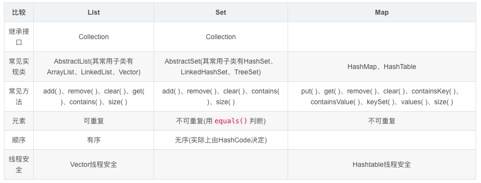

## 自我介绍

**幼い（おさない**

僕は大阪生まれです。小学校上がる前に中国に帰国しました。それで日本語を忘れてしまいました。

大学に入ってから日本語を勉強し始めています。日常的な会話は大体わかりますが、技術的な専門用語を今も勉強しています。

日本語が話せます

早ければ、、四月(しがつ)げじゅん(下旬)いけます、そんなに急(いそ)がなくてもいいのであれば、gooldenweekを過ぎてがらいけます


幼い頃は日本語を話せましたが、長年中国にいるので、日本語を忘れてしまいました。

その後、大学でも一度日本語を勉強し、日本語能力試験に合格しました。


面试都是半小时  先用日文沟通 看下口语情况 之后可以转中文  

尽量能用口语介绍自己和项目

自我介绍 稍微背一下 

先寒暄：「本日はお時間をいただきありがとうございます。」

画面は映(うつ)っておりますでしょうか？

声は聞こえておりますでしょうか？

はじめまして、徐耀晨と申します。杭州電子科技大学のソフトウェアエンジニアリング学科を卒業いたしました。

大学ではソフトウェアエンジニアリングを専攻し、特に Java の基礎知識と開発スキルを学びました。また、C 言語の基礎も学びました。菜鳥ネットワークテクノロジー有限公司で Java 開発のインターンを務めました。物流料金計上（けいじょう）関連の開発業務を担当し、Git を活用した複数人協働（きょうどう）の開発フローを熟知（じゅくち）し、基本的な操作を習得しました。

今後は御社でソフトウェア開発に携わりながら、自分の強みである協調性と Git のスキルを生かして、チームの成果(せいか)に貢献できる人材へ成長していきたいと考えております。どうぞよろしくお願いいたします。


## 用户中心项目

###  日文整体项目介绍

校内のユーザーセンタープロジェクトでは、ひとつ目は Spring Boot を使って統合(とうごう)ユーザー管理システムを作り、ユーザー登録・ログイン・検索の機能を実装しました。次に MyBatis と MyBatis-Plus を活用してデータアクセス層を開発し、CRUD 処理を共通化して開発効率を上げました。最後に統一エラーコードを定義してグローバルな例外処理を実装するほか、環境別の設定ファイルを作成し、開発と本番環境の切り替えに対応させました。


### 第一条：MyBatis + MyBatis-Plus


- 选用 MyBatis + MyBatis-Plus 进行数据访问层开发，继承了MyBatis Plus 提供的接口，从而复用对数据库的基本增删改查操作代码，不用手动编写重复的操作，大幅提高了开发效率。

MyBatis + MyBatis-Plus を選択してデータアクセス層（そう）の開発を行い、MyBatis Plus が提供するインターフェースを継承（けいしょう）することで、データベースに対する基本的な追加（ついか）・削除（さくじょ）・更新（こうしん）・参照（さんしょう）操作のコードを再利用し、重複（ちょうふく）する操作を手動（しゅどう）で記述（きじゅつ）する必要がなくなり、開発効率を大幅（おおはば）に向上（こうじょう）させます。

選択（せんたく）
層	そう	sō
汎用的	はんようてき	hanyōteki。通用的
継承	けいしょう	keishō
独自	どくじ	dokuji
向上	こうじょう	kōjō
参照	さんしょう（sanshou）	查询（对应 “查”）

「复用」核心是**直接用框架封装好的通用方法/代码**，不用重复写增删改查的基础逻辑，本质就是调用现成方法执行SQL

这里可能出现的问题：

### MyBatis-Plus とは何ですか？


どのような役割がありますか？MyBatis との違いは何ですか？ （什么是MyBatis-Plus?它有什么作用?它和MyBatis有哪些区别?）


MyBatis Plus を使用する前は、自身で SQL Mapper マッピングファイルと xml 文を作成する必要がありますが、MyBatis Plus を使用した後は、インターフェースを定義して BaseMapper インターフェースを継承し、その中に提供されている既存のメソッドを呼び出すだけで済みます。 
（使用MyBatis Plus前，需要自己编写SQL Mapper映射文件和xml语句,使用MyBatis Plus后，定义接口继承BaseMapper 接口并调用其中提供的现成方法即可）

MyBatis 内部では JDBC がカプセル化されており、これを使用すると、開発者は SQL 文そのものに注目するだけで、ドライバーのロード、コネクションの作成、statement の作成といった煩雑（はんざつ）なプロセスを処理する必要がなく、開発効率が向上(こうじょう)します
（MyBatis内部封装了JDBC，使用它后，开发者只需要关注SQL语句本身，不需要处理加载驱动、创建连接、创建statement等繁杂的过程，提高开发效率。）

MyBatis-Plus は MyBatis に対して二次カプセル化を行ったものです。一連の API メソッドとコード生成器を提供することで、繰り返しの CRUD（作成、読み取り、更新、削除）操作をより簡便にし、手動で SQL 文を作成する必要がなくなり、それによって開発効率を大幅に向上させます。
（MyBatis-Plus是对MyBatis 进行了二次封装。通过提供一系列的API方法和代码生成器，使重复的CRUD（创建、读取、更新、删除）操作更加简单，无需手动编写SQL语句，从而大幅提高开发效率。）

二次	にじ	niji	“二次”
カプセル化	かぷせるか	kapuseruka	“封装”，
向上	こうじょう	kōjō	“提升、提高”，
効率：こうりつ (kōritsū)
生成器	せいせいき	seiseiki
簡便	かんべん	kanben
手動	しゅどう

### 第二点-1 明确接口的返回，自定义统一错误码：

インターフェースの返り値を明確にし、統一的なエラーコードをカスタマイズします。

返り値  かえりち  (ka e ri chi)

カスタマイズ（かすたまいず） Customize 自定义
返り値  かえりち (ka e ri chi)
统一的 とういつてき (tō itsu teki)


我是通过一个枚举类(ErrorCode)来集中定义错误码 这个枚举类提供两个属性，code ，message
私は列挙型クラス（ErrorCode）を通じてエラーコードを集中的に定義しています。この列挙型クラスには二つのプロパティ（code、message）が備わっています。

code表示http的状态码 message 是返回给前端 给人看的简短说明文字 避免将后端真实的报错输出给前端 导致用户感知不好
code は HTTP ステータスコードを表し、message はフロントエンドに返却される、人が読むための簡潔な説明文です。これにより、バックエンドの実際のエラー内容がフロントエンドに出力され、ユーザーの体感が悪くなることを回避します。

列挙型クラス	れっきょがたくらす 枚举类
プロパティ	ぷろぱてぃ	propertiy	“属性”，外来语转假名
備わっています	そなわっています	sonawatte imasu	“具备、拥有”
ステータスコード すてーたす こーど status code 状态码

表す	あらわす	arawasu	“表示、代表”

返却	へんきゃく	henkyaku	返回、
簡潔	かんけつ
出力 しゅつりょく
回避	かいひ	kaihi	避免、规避

### 第二点-2 封装全局异常处理器

- 封装全局异常处理器，规范异常返回、屏蔽项目冗余报错。
  グローバル例外ハンドラーをカプセル化し、例外の返却を規格化し、プロジェクトの冗長なエラー出力を遮断する。

例外（れいがい） 例外（れいがい）= 日语 IT 里标准的 「异常」
規格化（きかくか）
返却（へんきゃく）
冗長（じょうちょう）
遮断（しゃだん）
出力 しゅつりょく 输出

为什么后端需要全局异常处理器？
なぜバックエンドにはグローバル例外ハンドラーが必要なのか

有可能在开发的时候 contoller有出现异常 service层也有出现异常 能否定义一个东西来捕获整个业务的异常
開発時にコントローラーで例外が発生したり、サービス層でも例外が発生したりすることがありますが、業務全体の例外をキャッチする何かを定義することはできますか

全局异常处理器能够捕获应用程序中抛出的异常, 并对这些异常进行统一的处理, 从而避免因未处理的异常导致系统崩溃或无法正常工作, 能够提高系统的稳定性。
グローバル例外ハンドラーは、アプリケーション内でスローされた例外をキャッチし、それらの例外に対して統一的な処理を行うことができます。
これにより、未処理の例外が原因でシステムがクラッシュしたり正常に動作しなくなったりすることを防ぎ、システムの安定性を高めることができます

統一的（とういつてき）
未処理  みしょり  未处理、没有处理过的
クラッシュ  crash 崩溃、闪退、宕机

你是如何实现全局异常处理器的？
グローバル例外ハンドラーはどのように実現するのですか？


定义一个全局异常处理类, 并且使用 @RestControllerAdvice (或者@ControllerAdvice) 注解该类, 表示这是一个全局异常处理器类。
グローバル例外処理クラスを定義し、@RestControllerAdvice（または @ControllerAdvice）アノテーションを付与することです。

アノテーション  annotation  注解
付与（ふよ） 付与する = 添加

然后针对每种异常类定义一个处理异常的方法, 并且使用@ExceptionHandler (异常类, class) 注解标注这些方法, 可以在这些方法中进行日志记录等具体的异常处理操作, 并返回一个响应对象, 便于前端识别并给用户友好的错误提示。

その後、各種例外クラスに対して例外処理用のメソッドを定義し、@ExceptionHandler (例外クラス.class) アノテーションでこれらのメソッドを修飾します。これらのメソッド内でログ出力など具体的な例外処理を実装し、レスポンスオブジェクトを返却することで、フロントエンドが識別しやすく、ユーザーに対して親切なエラーメッセージを表示できるようになります。

各種（かくしゅ）
修飾（しゅうしょく）
出力 しゅつりょく 输出
レスポンスオブジェクト  Response Object 响应对象
返却（へんきゃく）
識別（しきべつ）

### 第三点

- 通过Spring Boot的多套 application-{env}.yml 配置文件实现多环境，并通过指定—spring.profiles.active= Prod 实现生产环境部署

Spring Boot の複数の application-{env}.yml 設定ファイルを通じて複数環境を実現し、--spring.profiles.active=Prodを指定することで本番環境へのデプロイを実現します

デプロイ  部署 

主要修改的是 数据库的地址

主に修正したのはデータベースのアドレスです


### 登录如何实现


<span style="color:red">（这里到时候需要翻译成日文）</span>
登录逻辑

1. 校验用户账户和密码是否合法
2. 非空
3. 账户长度不小于4位
4. 密码就不小于8位
5. 账户不包含特殊字符
6. 校验密码是否输入正确, 要和数据库中的密文密码去对比
7. 用户信息脱敏, 隐藏敏感信息, 防止数据库中的字段泄露
8. 返回脱敏后的用户信息

## 电信相关经历

**中国電信株式会社杭州蕭山区支社**
ちゅうごくでんしん かぶしきがいしゃ こうしゅうしょうざんくししゃ

**罗马音：**
Chūgoku Denshin Kabushiki Gaisha Kōshū Shōzanku Shisha

**拆分读音：**
- 中国電信：ちゅうごくでんしん
- 株式会社：かぶしきがいしゃ
- 杭州：こうしゅう
- 蕭山区：しょうざんく
- 支社：ししゃ

**応募する**（おうぼする）


| 中文含义 | 日系职场**最常用**            | 通用 / 正式版                   | 补充说明                                             |
| -------- | :---------------------------- | :------------------------------ | ---------------------------------------------------- |
| 入职     | 入社（にゅうしゃ）            | 入職（にゅうしょく）            | 面试谈「进贵公司」优先用「入社」，更贴合日系企业表达 |
| 离职     | 退社（たいしゃ）(日常 / 口语) | 退職（たいしょく）(书面 / 正式) | 写辞职信、填表格用「退職」，和同事口头说用「退社」   |


この度退職(たいしょく)した理由は、応募の時はIT専門に関連(かんれん)するソリューションマネージャーとしての募集（ぼしゅう）で、採用条件もコンピューター専門（せんもん）に関連（かんれん）する内容でしたが、実際の業務（ぎょうむ）は電話カードの販売やインターネットサービスの営業（えいぎょう）が中心であったためです。


軸に
读音：じくに 罗马音：jiku ni
意思：以… 为中心、以… 为轴心、围绕…

展開
读音：てんかい  罗马音：tenkai
意思：展开、开展、推进、拓展。

### 従業員数
読み：**じゅうぎょういんかず**
ローマ字：jūgyōin kazu
意味：员工人数

### 資本金
読み：**しほんきん**
ローマ字：shihonkin
意味：资本金、注册资本

### 事業内容
読み：**じぎょうないよう**
ローマ字：jigyō naiyō
意味：事业内容、业务范围

1. **政企（せいき）**   读音：se i ki   意思：政府与企业
2. **推進（すいしん）**   读音：su i shin   意思：推进、推动  
3. **職務（しょくむ）**   读音：sho ku mu   意思：职务、职责 
4. **ブロードバンドサービス**   读音：bu roo do ban do saa bi su   
意思：宽带服务（broadband service） 
5. **折衝（せっしょう）**   读音：se sshou   意思：交涉、谈判、协商 
6. **締結（ていけつ）**   读音：te i ke tsu   意思：缔结、签订（合同/协议） 
7. **一連のフロー（いちれんのふろー）**   读音：i chi ren no fu roo   
意思：一系列流程、一整套流程 


**適した通信環境を構築支援**
读音（振假名）：**てきした つうしんかんきょう を こうちく しえん**
罗马音：tekishita tsūshin kankyō o kōchiku shien

意思：支援构建合适的通信环境。

1. 各種政企顧客を対象に、電話カード・ブロードバンドサービスの提案・営業活動を実施し、顧客の業務運用に適した通信環境を構築支援。
2. 顧客との折衝を通じてニーズを把握し、サービス契約の締結までの一連のフローを対応。

1. **政企（せいき）**
   读音：se i ki
   意思：政府与企业

2. **推進（すいしん）**
   读音：su i shin
   意思：推进、推动

3. **職務（しょくむ）**
   读音：sho ku mu
   意思：职务、职责

4. **ブロードバンドサービス**
   读音：bu roo do ban do saa bi su
   意思：宽带服务（broadband service）
   broadband
   读音：/ˈbrɔːdbænd/
   中文：宽带


5. **折衝（せっしょう）**
   读音：se sshou
   意思：交涉、谈判、协商

6. **締結（ていけつ）**
   读音：te i ke tsu
   意思：缔结、签订（合同/协议）

7. **一連のフロー（いちれんのふろー）**
   读音：i chi ren no fu roo
   意思：一系列流程、一整套流程


1. **制御（せいぎょ）**
   读音：se i gyo
   意思：**控制、调控**

2. **輻輳制御（ふくそうせいぎょ）**
   读音：fu ku sou se i gyo
   意思：**拥塞控制**（网络通信核心术语）

3. **メカニズム**
   读音：me ka ni zu mu
   意思：**机制、原理**

4. **プロトコル**
   读音：pu ro to ko ru
   意思：**协议**（通信协议、网络协议）

5. **精通（せいつう）**
   读音：se i tsuu
   意思：**精通、熟练掌握**

这些都是**网络・システム・Java后端**高频词，需要我帮你连成一句简历能用的日语吗？

## 实习经历 

### 用日文简单介绍一下 项目的实习经历

2024 年 5 月から 8 月まで、浙江菜鳥サプライチェーン管理有限公司の製品技術部で Java 開発エンジニアとしてインターンをしました。主に物流システムの料金計算関連の Java 開発業務を担当しました。Sunfire 監視プラットフォームにトラフィック監視ルールを設定し、異常なトラフィックをリアルタイムで通知する機能を実現し、金銭損失のリスクを減らしました。また、韓国向け配送料金計算を最適化するため、データ解析を行い、日曜日かどうかを判定する機能を作りました。仕事の中で、料金計算や決済のチームと協力して開発を進める流れを身につけ、Git の日常的な操作も習得しました

計算 読み方：けいさん（keisan）

監視 読み方：かんし（kanshi）

通知   読み方：つうち（tsuuchi）

決済 読み方：けっさい（kessai）

配送 読み方：はいそう（haisou）


浙江菜鸟サプライチェーン管理有限公司（製品技術部 - 開発エンジニア JAVA）
2024 年 05 月～2024 年 09 月
実務背景 
负责物流中钱和账相关内容，追踪和处理物流链中各环节产生的费用数据，简化物流计费结算流程
物流における金銭・会計関連業務を担当し、物流チェーン各段階で発生する費用データの追跡と処理を行い、物流の課金・決済プロセスの簡素化に従事。
负责物流中钱和账相关内容，追踪和处理物流链中各环节产生的费用数据，简化物流计费结算流程

浙江（せっこう）菜鸟（さいにょ）
背景（はいけい）
課金（かきん）／ kakkin
決済（けっさい）／ kessai
簡素化（かんそか）

主な業務内容

### 日志监控

プレビュー環境における異常トラフィックの監視が行われていない課題に対し、既存の監視ログのキー項目を基に、Sunfire 監視プラットフォームにてトラフィック監視ルールを設定。異常トラフィックのリアルタイムアラートを実現し、資産損失リスクの低減に貢献。
针对预发环境异常流量无监控的问题，基于现有监控日志关键字段配置，在Sunfire监控平台配置流量监控规则，实现异常流量实时告警，降低资损风险

既存（きぞん）
項目（こうもく）
低減（ていげん）
プレビュー  preview  预览、预发、测试环境
トラフィック  traffic  流量（网络流量、访问量）

### 韩国

韓国向け配送の課金ロジックを最適化するため、プロジェクト内でメタデータ加工処理を実装。localOpTimeStr時間項目の解析を行い、書式を検証するとともに、韓国現地時間が日曜日かどうかを判定し、該当フラグ（Y/N）を返却する機能を開発。
为优化韩国配送计费逻辑，在项目中开发元数据加工方法，解析localOpTimeStr时间字段，校验格式并判断韩国当地时间是否为周日，返回对应标识（Y/N）

配送（はいそう）
課金（かきん）／ kakkin 意思：课以费用 → 收取费用、计费
書式（しょしき）
検証（けんしょう）
該当フラグ  該当（がいとう）gaitō  フラグ：flag  对应标识、对应标志位

返却
読み：へんきゃく
発音：henkyaku
意味：返回、返还、返回（值）

課金・決済チームにおける複数人での協調開発の流れを熟知し、Git を用いた日常的な開発運用を習得

熟知（じゅくち）
用いた（もちいた）mochiita  使用了、利用了

### git 团队开发

チームでの協調開発プロセスに従事し、要件定義に基づきブランチ開発、単体テスト、コードレビューを実施。コードカバレッジ基準の遵守、ログ出力規範の順守、コンフリクト回避、コードの堅牢性向上など、品質管理を徹底した。
参与团队协作开发流程，根据需求文档进行分支开发、单元测试、代码评审；严格遵守代码覆盖率标准、日志规范，避免代码冲突，注重代码健壮性与系统品质。

关键词
要件定義 → ブランチ開発 → 単体テスト → コードレビュー → 品質管理


従事じゅうじ /juuji从事、参与

遵守じゅんしゅ /junshu

ログ出力規範ろぐ しゅつりょく きはんrogu shutsuryoku kihan日志输出规范

順守じゅんしゅ /junshu遵守、恪守（和遵守几乎同义）

堅牢性けんろうせい /kenrousei健壮性、鲁棒性（IT 常用）

向上こうじょう /koujou提升、提高

## 简历相关

### 封装 继承 多态

#### 封装（カプセル化）

- **核心思想**：把对象的属性和行为（数据 + 方法）封装成一个独立的整体，对外隐藏内部实现细节，只通过暴露的公共方法（get/set、业务方法）交互。
- **目的**：① 提高代码安全性（防止属性被随意修改）；② 降低耦合（外部只关注功能，不关注实现）；③ 便于维护（修改内部实现不影响外部调用）。

继承（継承）
核心思想：子类（派生类）继承父类（基类）的属性和方法，实现代码复用，同时子类可以扩展自己的独有功能。
关键规则（Java 特有）：
✅ 单继承（一个子类只能继承一个父类），但可以实现多个接口；
✅ 子类不能继承父类的private属性 / 方法、构造器；
✅ super关键字：调用父类的属性 / 方法 / 构造器；this关键字：调用当前类的属性 / 方法。

多态（ポリモーフィズム）
核心思想：同一个行为（方法），作用在不同对象上会产生不同的执行结果。
实现条件：① 有继承 / 实现关系；② 方法重写（Override）；③ 父类引用指向子类对象（如Animal cat = new Cat();）。
分类：
✅ 编译时多态（重载 / Overload）：方法名相同，参数列表（个数 / 类型 / 顺序）不同，编译期确定调用哪个；
✅ 运行时多态（重写 / Override）：子类重写父类方法，运行期根据实际对象类型确定调用哪个。

###  Spring IOC & AOP


IOC(In version of Control):控制反转(控制权由应用程序代码转移到Spring框架中),容器负责创建和管理对象
IOC实现方式是通过依赖注入DI(Dependency Injection)来实现,依赖注入是指在对象创建的过程中，自动注入该对象所依赖的其他对象,从而构建对象之间的依赖关系。

AOP:面向切面编程:横切关注点,是指系统中分散在各个模块中,与主业务逻辑无关的代码,如日志记录,事务管理,权限控制等


### TCP 三次握手

SYN       SYN+ACK      ACK
最开始双方的TCP连接都处于close状态， 服务端首先会监听一个端口， 处于Listen状态。
在第一次握手的时候， 客户端会随机生成初始化序号， 放到TCP报文头部的序号字段中， 同时把SYN标志设置为1，这样就表示SYN报文。接着把这个SYN报文发送给服务端， 之后客户端处于SYN_SENT状态。
服务端收到SYN报文后， 首先服务端也会随机生成初始化序号， 放到TCP报文头部的序号字段中， 然后对客户端的初始化序号+1作为确认号， 放到TCP报文头部的确认应答字段中， 并将SYN和ACK标志设置为1， 这样就表示SYN-ACK报文， 后把该报文发给客户端， 之后服务端处于SYN_RCVD状态。
客户端收到服务端SYN-ACK报文后， 客户端会回一个ACK确认报文， 该报文的确认号是服务端的初始化序号+1， 并且ACK标志会设置为1。之后客户端处于ESTABLISHED状态。
服务端收到ACK确认报文后， 服务端也进入处于ESTABLISHED状态。


### TCP 四次挥手
FIN   ACK     FIN   ACK
客户端打算关闭连接， 此时会发送一个FIN报文， 之后客户端进入FIN_WAIT_1状态。
服务端收到FIN报文后， 就向客户端发送ACK应答报文， 接着服务端进入CLOSE WAIT状态。
客户端收到服务端的ACK应答报文后， 之后进入FIN_WAIT_2状态。等待服务端处理完数据后， 也向客户端发送FIN报文， 之后服务端进入LA STACK状态。
客户端收到服务端的FIN报文后， 回一个ACK应答报文， 之后进入TIME WAIT状态服务端收到了ACK应答报文后， 就进入了CLOSE状态， 至此服务端已经完成连接的关闭。客户端在TIME WAIT状态经过2MSL一段时间后， 自动进入CLOSE状态， 至此客户端也完成连接的关闭。


### 为什么要建立索引

​       核心 ：减少了mysql数据的扫描量

​       如果没有建立索引, 我们查询数据的话, 搜索时间复杂度是O (n) , 这样的查询效率还是比较低的, 为了提高查询效率, 我们可以建立索引。
​       建立了索引后数据都会按照顺序存储, 这时候我们可以利用类似二分查找的方式快速查找数据, B+树索引是多叉树, 搜索时间复杂度是 0 (1ogdN) , 这样就提高了查询速度, 除此之外还可以避免外部排序和使用临时表等问题。


### 存储引擎基本概念

简单来说，存储引擎就是数据库的“文件管理员”。

如果把数据库比作一家大型图书馆，存储引擎就是负责书架设计、书籍摆放和借阅登记的具体方案。

核心功能

它的主要任务是接收上层传来的指令，负责数据的真实存取。不同的“管理员”擅长不同的工作：有的擅长快速查找，有的擅长保证书籍不丢失，有的则擅长节省空间。

常见的两位“管理员”（以MySQL为例）

  1. InnoDB（全能管家）：它是目前的默认引擎。特点是稳重，支持事务（出错能回滚）和行级锁（多个人同时改不同行互不干扰），适合绝大多数商业场景。

  2. MyISAM（快速检索员）：特点是轻快，它不支持事务，但读取速度非常快，适合只读或读多写少的简单场景。

为什么要分这么多引擎？

因为没有一种方案能同时满足所有需求。比如你需要极高性能且数据丢了也没事，可以选择Memory（内存引擎）；如果你需要存海量日志，可以选择压缩率极高的Archive。

存储引擎是基于表的。这意味着你可以在同一个数据库里，给“账本表”用稳重的InnoDB，给“临时记录表”用快速的Memory。

### 执行一条查询语句的全过程


MySQL 执行一条查询SQL 语句的时候, 会经过连接器、查询缓存、解析器、优化器、执行器、存储引擎这些模块。
• 首先 MySQL 的**连接器**会负责建立连接、校验用户身份、接收客户端的 SQL语句；
•第二步 MySQL 会在**查询缓存**中查找数据, 如果命中直接返回数据给客户端, 否则就需要继续往下查询, 不过查询缓存功能MySQL8.0版本被删除了, 原因是只要对这张表进行了写操作, 这张表的查询缓存就会失效, 所以在实际场景中, 查询缓存的命中率其实不高；
• 第三步 MySQL的**解析器**会对 SQL语句进行词法分析和语法分析, 然后构建语法树, 方便后续模块读取表名、字段、语句类型；
•第四步 MySQL的**优化器**会基于查询成本的考虑, 会判断每个索引的执行成本, 从中选择查询成本最小的执行计划；
•第五步 MySQL的**执行器**会根据执行计划来执行查询语句, 从存储引擎读取记录, 返回给客户端；


### mysql的存储引擎有哪些？

MySQL 整体上分为 Server 层和存储引擎层, Server 层负责的部分是连接器、查询缓存、解析器、优化器、执行器, 存储引擎层数据的读取和存储。存储引擎就像是一个插件, MySQL 可以根据业务场景使用不同的存储引擎, 目前 MySQL 支持 InnoDB、MyISAM、Memory、Archive、CSV、NDB Cluster等多个存储引擎。

面试时只需要说出 InnoDB、MyISAM、Memory 这三种就可以。
回答
MySQL 常见的存储引擎有 InnoDB、MyISAM、Memory。
• 我比较熟悉的是 InnoDB引擎, 它是 MySQL 默认的存储引擎, 支持事务和行级锁, 具有事务提交、回滚和崩溃恢复功能。

• MyISAM引擎我没有用过, 但是我在学习的时候有了解过, 它是不支持事务和行级锁的, 而且由于只支持表锁, 锁的粒度比较大, 更新性能比较差, 我认为它比较适合读多写少的场景。


### MySQL为什么InnoDB是默认引擎？
InnoDB引擎在事务支持、并发性能、崩溃恢复等方面具有优势, 因此被MySQL选择为默认的存储引擎。
• 事务支持：InnoDB引擎提供了对事务的支持, 可以进行ACID (原子性、一致性、隔离性、持久性) 属性的操作。Myisam存储引擎是不支持事务的。
•并发性能：InnoDB引擎采用了行级锁定的机制, 可以提供更好的并发性能, Myisam存储引擎只支持表锁, 锁的粒度比较大。
•崩溃恢复：InnoDB引引擎通过 redolog 日志实现了崩溃恢复, 可以在数据库发生异常情况 (如断电) 时, 通过日志文件进行恢复, 保证数据的持久性和一致性。Myisam是不支持崩溃恢复的。


### 说一下mysql的innodb与MyISAM的区别？
• 事务：InnoDB 支持事务, MyISAM 不支持事务, 这是 MySQL 将默认存储引擎从 MyISAM 变成InnoDB的重要原因之一。
•索引结构：InnoDB 是聚簇索引, MyISAM 是非聚簇索引。聚簇索引的文件存放在主键索引的叶子节点上, 因此InnoDB必须要有主键, 通过主键索引效率很高。但是辅助索引需要两次查询, 先查询到主键, 然后再通过主键查询到数据。因此, 主键不应该过大, 因为主键太大, 其他索引也都会很大。而MyISAM 是非聚簇索引, 数据文件是分离的, 索引保存的是数据文件的指针。主键索引和辅助索引是独立的。
•锁粒度：InnoDB 最小的锁粒度是行锁, MyISAM 最小的锁粒度是表锁。一个更新语句会锁住整张表, 导致其他查询和更新都会被阻塞, 因此并发访问受限。
• count 的效率：InnoDB 不保存表的具体行数, 执行 select count (*) from table 时需要全表扫描。而MyISAM用一个变量保存了整个表的行数, 执行上述语句时只需要读出该变量即可, 速度很快。


### mysql里面有哪些锁？


•全局锁：通过flush tables with read lock 语句会将**整个数据库**就处于只读状态了, 这时其他线程执行以下操作, 增删改或者表结构修改都会阻塞。全局锁主要应用于做全库逻辑备份, 这样在备份数据库期间, 不会因为数据或表结构的更新, 而出现备份文件的数据与预期的不一样。

• 表级锁：MySQL 里面表级别的锁有这几种：

。表锁：通过locktables 语句可以对表加表锁, 表锁除了会限制别的线程的读写外, 也会限制本线程接下来的读写操作。

。元数据锁：比较简单粗暴的理解： 主要是针对**表结构**的锁

当我们对数据库表进行操作时, 会自动给这个表加上MDL（Metadata Lock） 对一张表进行 CRUD 操作时, 加的是MDL 读锁；对一张表做结构变更操作的时候, 加的是 MDL写锁；MDL 是为了保证当用户对表执行 CRUD 操作时, 防止其他线程对这个表结构做了变更。
。意向锁：当执行插入、更新、删除操作, 需要先对表加上「意向独占锁」, 然后对该记录加独占锁。**意向锁的目的是为了快速判断表里是否有记录被加锁**。

•行级锁：InnoDB 引擎是支持行级锁的, 而 MyISAM 引擎并不支持行级锁。

- 记录锁, 锁住的是一条记录。而且记录锁是有S锁和X锁之分的, 满足读写互斥, 写写互斥
- 间隙锁, 只存在于可重复读隔离级别, 目的是为了解决可重复读隔离级别下幻读的现象。
- Next-Key Lock 称为临键锁, 是 Record Lock + Gap Lock 的组合, 锁定一个范围, 并且锁定记录本身


根据锁粒度的不同, MySQL的锁可以分为全局锁、表级锁、行级锁。
我比较熟悉的是表级锁和行级锁, 比如我们对一张表结构进行修改的时候, MySQL 就会对这张表加一个元数据锁, 元数据锁是属于表级锁的。

行级锁目前只有 Innodb 存储引擎实现了, MyISAM 存储引擎是不支持行级锁的, 只有表锁。Innodb 存储引擎实现的行级锁主要有记录锁、间隙锁、临键锁、插入意向锁这些, 当我们对表记录进行 select for update, 或者增删改的时候, 都会对记录加行级锁。


### 悲观锁和乐观锁

首先我们需要清楚的一点就是无论是悲观锁还是乐观锁，都是人们定义出来的概念，可以认为是一种思想。


悲观锁：悲观并发控制实际上是“**先取锁再访问**”的保守策略，为数据处理的安全提供了保证，

**悲观锁中的共享资源每次只给一个线程使用，其它线程阻塞，用完后再把资源转让给其它线程**

在效率方面，处理加锁的机制会产生额外的开销，还有增加产生死锁的机会。另外还会降低并行性。


乐观锁：

乐观锁假定在大多数情况下, 数据在操作期间不会被其他事务修改, 所以在操作数据时不会对数据加锁。只有在更新数据时, 才会去检查数据在自己操作期间是否被其他事务修改过, 如果没有被修改, 就执行更新操作；如果被修改了, 则根据不同的实现方式进行相应处理, 比如重试或者抛出异常。

实现乐观锁的方式：

- 版本号机制：在表中增加一个版本号字段, 每次更新数据时, 版本号加1。在更新数据前, 先读取数据的版本号, 在更新时将版本号作为条件进行判断, 如果版本号与之前读取的一致, 就更新数据并将版本号加1；如果不一致, 说明数据已被其他事务修改, 更新失败。
- 时间戳机制：与版本号机制类似, 只是使用时间戳来记录数据的修改时间。

乐观锁适合的场景：

- 读多写少：在这种场景下, 数据被其他事务修改的概率较低, 使用乐观锁可以减少加锁和解锁的开销, 提高系统的并发性能。例如, 商品信息的展示页面, 大部分操作是读取商品信息, 只有很少的操作是修改商品信息, 就可以使用乐观锁。
- 冲突较少：当多个事务同时修改同一数据的情况很少发生时, 乐观锁可以避免悲观锁带来的性能问题。比如, 用户个人信息的修改, 不同用户修改自己信息的冲突概率较低, 适合使用乐观锁。


# 日文 网络相关八股

### TCP（Transmission Control Protocol）

**読み**：ティーシーピー

**解説**：通信先との確認を行いながらデータを確実に送信する**コネクション型プロトコル**。データの順序保証や誤り訂正を行うため、ファイル転送・Web アクセスなど、安定した通信が必要な場面で使用される。


### 順序保証

**読み方**：じゅんじょほしょう（junjo hoshou）

### UDP（User Datagram Protocol）

**読み**：ユーディーピー

**解説**：通信先との接続確認を行わず、データを高速に送信する**非コネクション型プロトコル**。速度重視で、少しのデータ損失が許容される動画配信・オンラインゲームなどに適している。

### ネットワークプロトコル（ねっとわーくぷろとこる）

**解説**：ネットワーク上で機器同士がデータを通信する際に従う**共通のルール・約束事**。TCP/UDP のほか、IP・HTTP などが代表的。

### TCP 三次ハンドシェイク（さんじはんどしぇいく）

**解説**：TCP による通信を開始する前に、送信側と受信側が**相互に通信準備ができているか確認する 3 回の信号交換処理**。通信の信頼性を確保する基礎的な処理。

### 四次ウェーブ（よんじうぇーぶ）＝四次ハンドシェイク（よんじはんどしぇいく）

**解説**：TCP の通信を終了する際に、両者が**データの送受信完了を確認し、接続を正常に切断する 4 回の信号交換処理**。

### フロー制御（ふろーせいぎょ）

**解説**：TCP 通信において、**送信側のデータ送信速度を、受信側の処理能力に合わせて調整する機能**。受信側が処理しきれないデータが溜まるのを防ぐ。

### 輻輳制御（ふくそうせいぎょ）

**解説**：ネットワーク回線にデータが集中して混雑（輻輳）するのを防ぐため、**送信側がデータ送信量を調整する機能**。回線の混雑によるデータ損失や通信遅延を抑制する。

### メカニズム（めかにずむ）

**解説**：事物が動作・機能する**仕組み・原理**。ここでは上記の各処理がどのように動作するかのルールや手順を指す。

### 補足用語

#### 精通（せいつう）

**解説**：知識や技術を**十分に理解し、熟练に使いこなせる状態**。

#### 把握（はあく）

**解説**：内容や状況を**しっかり理解・認識すること**。


# 技术面问题准备

# internについで基本的にどのような業務を担当するのか紹介していただけないでしょうか？

Java 開発のインターンでは、ひとつ目は、コーディングです、韓国向けの配送料金計算の最適化を独立(どくりつ)で担当し、日曜日かどうかを判定する機能を作りました。次にチームでの開発で Git の日常的な操作を習得し、料金計算チーム開発の全体的な流れを習得しました。最後に監視プラットフォームの設定を行い、こちらは主に設定作業のみを担当し、異常なトラフィックをリアルタイムでアラートする機能を実現しました。
（这里用日文 补充提一嘴 韩国はいそう是 どくりつ开发，監視プラットフォームの設定  設定作業のみを担当し ）

通知（つうち）tuu chi
配送  はいそう（haisou）

# 我在这个 intern里面做了什么？

对, 就是你在描述的时候, 你要告诉对方说这个是我做的地方, 然后我独立负责某某一些模块、某一个系统这样子, 要不然对方就只会听完说哦。你是在给我
讲述整个实习的内容是什么？我是要听到你在这个里面做的。


# 韓国の配送向けの料金計算ロジックについて、少し背景とか処理内容、あと実装する上で工夫した内容を説明していただけないでしょうか？
背景 ： 我们公司有面向韩国的物流配送业务，韩国的配送员如果在周日加班配送，需要额外支付加班费，这笔费用要纳入内部的配送计费系统统一核算。我负责开发的，就是这个内部计费系统里，专门判断是否为周日的功能模块。

社内は韓国向けの配達業務があるので、韓国現地の宅配便の配達員が日曜日に 例えば　残業配達する場合があれば、追加の残業手当を支払う必要があります。この費用は社内の料金計算システムで精算するので、私はシステムの日曜日判定の機能を担当しました。

配達 はいたつ（haitatsu）
現地 げんち（genchi）
宅配便 たくはいびん
精算　せいさん /seisan
判定 はんてい（hantei）

问题挑战：数据异常导致的计费错误和程序故障 
一开始如果直接判断时间字符串是不是周日，很容易出现程序 bug，比如前端传过来的时间数据为空、格式错误（像日期格式乱码、少传参数这类情况），会导致系统判断出错、计费不准，甚至程序崩溃。所以核心要解决数据异常导致的计费错误和程序故障，提前做好数据校验，规避这类 bug，保证系统稳定和计费精准，属于基础的程序安全和防错对策。

一番重要な課題はデータチェックです。 フロントから渡された時間データが空(から)だったり、形式が間違っていたりすると、システムエラーが起きます。

故障 こしょう
形式 けいしき

日時の文字列（にちじ の もじれつ）

处理内容：判断字符串是否是周日
我没有直接做周日判断，而是先做三层数据校验：第一步检查前端传入的时间参数是否为空，为空就立刻向前端返回 “参数为空” 的提示；第二步校验时间字符串的格式是否正确，过滤格式错误的无效数据；第三步在数据合法的前提下，再判断是否为周日，是就返回 “Y”，不是就返回 “N”，一步步规避异常问题。

具体的にどう対応するかというと、直接日曜日かどうか判定することじゃなくて、まずはフロントエンドから渡された時間データが空かどうか確認し、もし空の場合は「データが空です」とフロントに伝えます。次に時間データのフォーマットが正しいかどうかをチェックして、正しくない場合は「フォーマットが正しくありません」とフロントに伝えます。最後に日曜日かどうか判定し、日曜日なら「Y」、そうでなければ「N」を返すように実装しました。

返す かえす（kaesu） 返回
通知 つうち

成果总结
这套逻辑落地后，彻底避免了因为数据为空、格式错误导致的计费 bug 和程序报错，确保韩国配送员周日加班费的核算精准无误，保障了内部计费系统稳定运行，也减少了后续数据核对和修复的工作量

その結果、韓国配送員の日曜手当の計算に問題がなくなり、社内の料金システムが安定して動くようになりました。

最大的难点：把这个需求扩展一下 要求我判断全球的节假日 应该如何实现


你尽量做到，比如说我现在讲述一个故事的时候，把它的背景，然后它里面的是另外也有，然后它就这个实装 ，整个我做的这个东西，你先给对方一个概括，就是我们这个东西的逻辑是什么？然后它的背景是什么？处理内容是什么？我们在现实上的考虑是什么？然后在这个里面，我，嗯问的我遇到的最大的难点是什么？


# bug对策 その、このケースの中で、不具合が最も発生しやすいパターンって、うん。事前に整理されたら、そっちをまず教えていただきたいですね。


回答：
例えば、韓国配達の開発のケースについて、不具合が最も発生しやすいパターンは、時間データの空とか、時間データの形式エラーがあるとき、システムエラーが発生する可能性がありました。
具体的の対策は　データチェックです 
まず時間データが空かどうかを必ず確認し、空の場合は「時間データが空です」という文字列(もじれつ)を返すようにします
時間データの形式が間違っている場合、try-catch で例外のerrroをキャッチし、エラーログを出力(记录)するとともに、「時間データ形式エラー」という文字列を返すようにします。
最後に、正しい時間データの場合は、日曜日かどうかを判定してYかNを返すようにしました


出力 しゅつりょく（syutsuryoku）


就是这个地方你应该准备一下，因为他可能技术面会问到，尤其是日本这边，他很在乎这个这种主管，还就主管的这个判断。你可以考虑一下，比如说你们先就是，比如说跟刚才连着，就是你这个日期的这个边界，然后有一些误判，然后我为了让它，比如说这个传入值是user，我怎么样让它变成一个符合预期的一个 number day？其实都算一个提前的数据外溢。哪怕你没有做，你也要告诉对方说我们考虑到这些东西，然后谁对应的什么，就你不能说完全我没有考虑。

但是我们当时做了一个什么异常数据或者是正常流程，一个分开处理，然后做了一个输入校验这个东西。


# 障害発生時の対応フローを教えてください。 あれば、チームとしてbugを発生するアクションとかはありますか？

まずはログ（アプリケーションログ、ミドルウェアログ）を確認して原因を切り分け(きりわけ)、緊急度に応じて一時的な対策を実施します、
例えば　ロールバックや設定変更などを実施します 。
根本的な解決のためには、まず不具合を再現する手順をはっきりさせます。
そのあと、チームで同じ問題が起きないようにする方法を話し合います。


障害発生 しょうがいはっせい 故障发生
対応フロー  たいおうフロー  应对流程
根本解決  こんぽんかいけつ  根本解决
アプリケーションログ  あぷりけーしょんろぐ  应用程序日志
ミドルウェアログ  みどるうぇあろぐ  中间件日志
原因を切り分け  げんいんをきりわけ  排查原因、定位问题
緊急度  きんきゅうど  紧急程度

再現手順  さいげんてじゅん  复现步骤
再発防止策  さいはつぼうしさく  防止复发的对策

不具合を再現する：复现故障 / 重现问题
手順をはっきりさせます：明确步骤 / 理清步骤


# 难点  项目の難しい点

特に難しかったのは、グローバルな祝日(しゅくじつ)判定です。
現在の機能は韓国の日曜日だけを判定していますが、もし世界中の祝日に対応するとなると、対応が複雑になります。
私はこう解決しようと考えました
1. まずは時間フォーマットのチェックと例外処理
世界中の時間フォーマットが違うので、強いバリデーション(validation)と例外処理が必要になります。
(比方说 中国的话 “yyyy-mm-dd”的方式表示时间，其他国家的话可能不是这样...)
2. も一つの問題はタイムゾーンですね
国や地域によって時間が違うので、タイムゾーンを考慮しないと、判定が間違えます。
3. 実装方針（Java）
Java ではJollydayというライブラリを使えば、世界の祝日を簡単に判定できます。
必要なパラメータは 3 つになります。
時間データ
国コード（KR など）
タイムゾーン（Asia/Seoul など）
この 3 つを使って、Jollyday の isHoliday メソッドで祝日かどうか判定する方針になります。


项目 こうもく 

祝日 しゅくじつ shukujitsu

虽然没有要求被实现 但是当时和同事交流的时候 想到了一个问题，

最大的难点：把这个需求扩展一下 要求我判断全球的节假日 应该如何实现

虽然没有被要求实现 但是大致的思路 我觉得是这样的：

1 时间格式强校验与异常处理

2 时区陷阱

java开发中 Jollyday 全球节假日库

原来是时间data 一个参数 现在需要三个参数 时间data 国家code timezone （国家和地区的不同会导致判断的时间也不同）
"localOpTimeStr": "2025-03-22 18:00:00",
  "countryCode": "KR",     // 国家二字码（ISO标准）
  "timeZone": "Asia/Seoul" // 时区（必须标准）

  使用Jollyday框架中的 isHoliday方法 来判断全球的节假日


# sunfire监控的具体规则

背景：我们有一个计费平台系统 这个系统有正式的生产环境和预发环境，正常情况下，仅测试单据会进入预发（沙箱）环境，流量极低（每分钟个位数请求） 

社内は料金計算のプラットフォームがあるので、本番環境とプレリリース環境の2つの環境があります。
普通の場合は、プレリリース環境はテスト用のデータしか入らないので、アクセス数も非常に少ない状況でした。

问题挑战：（正常的业务员在操作快递单据的时候会进入正式的环境里面）因业务人员操作不当，真实线上生产单据被误传入预发环境，短时间会产生大量异常流量；
由于缺乏实时监控，无法及时发现异常，存在资损风险。
问题点是：预发环境的流量监控告警

しかし、担当者の操作ミスによって、本来本番環境で処理されるべき実際のデータが、誤って(あやまって)プレリリース環境に流れてしまうことがありました。

そうなると、短時間で大量のアクセスが発生したら、トラフィックが異常になる。もしリアルタイムの監視がない場合、すぐに異常に気づけ(kizuke)なくて、資産(しさん)が損失する可能性があります。
一番重要な問題点は、プレリリース環境のトラフィック監視とアラートです


主要行动：
项目代码里已经编写了日志记录代码，当有实际业务请求进入预发环境时，系统会自动做日志的记录 比方说 日志里会设置一个 “PRE_TEST_ORDER”的字符串，用来识别这部分流量
主な対応：
プロジェクトの中にすでにログ出力のコードを実装していたので、実際の業務のリクエスト(data)がプレリリース環境に入った場合、システムが自動的にログを出力(しゅつりょく)します。
例えば、ログに「PRE_TEST_ORDER」という文字列を設定し、このトラフィックを識別(しきべつ)できるようにしています。

識別（しきべつ）：名词/サ变动词，意为识别、鉴别。

我的工作是：
在公司的Sunfire 日志监控平台上，完成告警规则配置：
将指定日志关键字（PRE_TEST_ORDER）录入监控平台；
设置告警阈值：最近 3 分钟请求量＞20 时自动触发告警。

自分が担当している部分は、社内のSunfireプラットフォームでアラート設定を行うことです。
監視用のキーワード「PRE_TEST_ORDER」を登録し、直近(ちょっきん)3分間のリクエスト数が
もし20を超えたら、自動でアラートが出るように設定しました。

告警触发后，同步通知对应业务同学，及时处理异常流量。
もしアラートが出たら、業務側の担当者にすぐ連絡して、異常なトラフィックを速やか(すみやか)に対応します

成果总结
通过 Sunfire 告警配置，有效避免真实业务单据 进入预发环境导致的资产损失，保障了资金安全。

その結果(結果的に)、実際の業務リクエスト(データ)がプレリリース環境に流入(りゅうにゅうする)することを防止(ぼうし)しました。資金安全を確保(かくほ)することができました。


预发环境 プレリリース環境 pre-release environment


## 中文版的完整解释：

Sunfire告警配置需求（简洁版实习描述）

一、背景与问题挑战
1. **业务背景**
我所在团队负责物流资金与账务相关业务，整体系统链路包含履行、计费平台（cf-biz-platform）等多个上游系统；正常情况下，**仅测试单据**会进入预发（沙箱）环境，流量极低（每分钟个位数请求）。

2. **问题与风险**
因业务人员操作不当，**真实线上生产单据被误传入预发环境**，短时间会产生大量异常流量；由于缺乏实时监控，无法及时发现异常，**存在资损风险**。

3. **核心挑战**
需要快速建立预发环境异常流量监控能力，及时发现真实单据误流入问题，避免资产损失。

二、主要工作与行动
1. **技术依托**
项目已在代码中完成**日志埋点**：当流量进入沙箱环境时，会打印固定标识日志（`PRE_TEST_ORDER_ADD_SANDBOX_TAG`），用于标记测试/沙箱流量。

2. **我的工作**
基于公司统一的**Sunfire日志监控平台**，完成告警规则配置：
- 将指定日志关键字（`PRE_TEST_ORDER_ADD_SANDBOX_TAG`）录入监控平台；
- 设置告警阈值：**最近3分钟请求量＞20** 时自动触发告警。

3. **协作流程**
告警触发后，同步通知对应业务同学，及时处理异常流量。

三、代码层面说明（你只做配置，不用改代码）
- **埋点由现有代码实现**：业务代码中已写入监控日志语句，请求进入沙箱环境时自动打印关键字日志；
- **告警由平台实现**：我无需开发代码，仅在Sunfire平台界面配置**关键字监控+阈值规则**，平台自动扫描日志、统计流量并触发告警。

四、成果总结
通过Sunfire告警配置，实现了预发环境异常流量的实时监控与主动预警，**有效避免真实业务单据误流入导致的资产损失**，保障了资金账务安全。


超精简一句话版本（用于简历/自我介绍）
针对上游系统误将真实单据传入预发环境导致的资损风险，基于Sunfire日志监控平台配置关键字告警规则，实现异常流量实时预警，保障账务资金安全。


# ユーザー管理システムの全体構成について、簡単に説明してください 
做这个用户管理系统的整体的结构,做一个简单的介绍

后端用的是 MVC 的架构
controller层的话 用的是 spring 框架的注解
Model部分的话 比方说java代码中的user对象和数据库中的user表通过 spring框架中注解的形式去做对应
View的部分 下载了现成的前端代码 做前端界面的展示

このシステムは MVC アーキテクチャを使っています。
mvcというのはController、Model、Viewです
Controller層 Spring フレームワークのアノテーションを使用し、ユーザーからのリクエストを受け取り、全体の処理を制御しています。
Model層は　例えば　JavaのUserオブジェクトと、データベースのUserテーブルをmatchして、自動的な操作ができるじゃないですか？

View層　githubで既存のフロントエンドのprojectを利用して、ユーザーに見せる画面の表示する。

制御 せいぎょ 控制、调度

# 中文八股复盘

# 例えばその中にはね、そのルートの方は、計算し方の方がある程度アルゴリズムを使ったりとか、あの特殊の要件とか、お客様の要望に合わせて実装しないとならないですかね　
比如说，里面涉及到路线相关的处理，计算方式需要用到一定程度的算法，还要根据客户的特殊要求、需求来进行实现，对吧？


関数 かんすう  kansu 函数

# 字符串abc 希望用一个 java的方法 变成cba 应该用什么方法？

在 Java 里，把字符串 abc → cba 反转最简单、最常用的方法是用 StringBuilder 的 reverse()。
```java
public class Test {
    public static void main(String[] args) {
        String str = "abc";
        
        // 反转方法
        String result = new StringBuilder(str).reverse().toString();
        
        System.out.println(result); // 输出：cba
    }
}
```
# 字符串abc  变成cba  如果用for 循环应该怎么操作
取最后一个字符的下表 从后往前取 拼接到新字符串里面
```java
public class Test {
    public static void main(String[] args) {
        String str = "abc";
        
        // 用来存反转后的字符串
        String result = "";

        // for 循环从最后一位开始往前取
        for (int i = str.length() - 1; i >= 0; i--) {
            result = result + str.charAt(i);
        }

        System.out.println(result); // 输出 cba
    }
}
```
1 str.length() - 1 → 取最后一个字符的下标（abc 最后一位是 2 号）
2 i-- → 从后往前循环
3 charAt(i) → 取出第 i 个字符
4 拼接到新字符串里

# JVM vs JDK vS JRE
Java Runtime Environment JRE 相当于是运行时环境

JDK 是 Java Development Kit 缩写，它是功能齐全的 Java SDK。它拥有 JRE 所拥有的一切，还有编译器（javac）和工具（如 javadoc 和 jdb）。它能够创建和编译程序。

JRE 是 Java 运行时环境。它是运行已编译 Java 程序所需的所有内容的集合，包括 Java 虚拟机（JVM），Java 类库，java 命令和其他的一些基础构件。但是，它不能用于创建新程序。
如果你只是为了运行一下 Java 程序的话，那么你只需要安装 JRE 就可以了。如果你需要进行一些 Java 编程方面的工作，那么你就需要安装 JDK 了。但是，这不是绝对的。有时，即使您不打算在计算机上进行任何 Java 开发，仍然需要安装 JDK。例如，如果要使用 JSP 部署 Web 应用程序，那么从技术上讲，您只是在应用程序服务器中运行 Java 程序。那你为什么需要 JDK 呢？因为应用程序服务器会将 JSP 转换为 Java servlet，并且需要使用 JDK 来编译 servlet。
最后，总结一下 JDK/JRE/JVM，他们三者的关系

JRE = JVM + Java 核心类库
JDK = JRE + Java 工具 + 编译器 + 调试器

# list set map之间的区别是什么？
List：有序、可重复、有下标
Set：无序、不可重复
Map：键值对（key-value）、key 不可重复



List順番が保持(ほじ)され、重複(ちょうふく)したデータを保存できます。インデックス(添字(そえじ))で要素にアクセスします。
Set順番がなく、重複したデータを保存できません。
Mapキーと値（Key-Value）でデータを管理します。キーは重複できません。

# 讲一下 java中List的几种实现 ？
ArrayList
是应用更加广泛的动态数组实现，它本身不是线程安全的，所以性能要好很多。与 Vector 近似，ArrayList 也是可以根据需要调整容量，不过两者的调整逻辑有所区别，Vector 在扩容时会提高 1 倍，而 ArrayList 则是增加 50%。

LinkedList
顾名思义是 Java 提供的双向链表，所以它不需要像上面两种那样调整容量，它也不是线程安全的。

Vector
Vector 和 ArrayList 类似，也实现了 List 接口。但是，Vector 中的主要方法都是 synchronized 方法，即通过互斥同步方式保证操作的线程安全。在多线程环境下，如果需要对集合进行写操作，可以考虑使用 Vector 来保证线程安全。

Stack
也是一个同步容器，它的方法也用 synchronized 进行了同步，它实际上是继承于 Vector 类。Stack 堆栈在数据结构中有特定的应用场景，后进先出（LIFO）。

# ArrayList 与 LinkedList 区别？

是否保证线程安全：ArrayList 和 LinkedList 都是不同步的，也就是不保证线程安全；

底层数据结构：ArrayList 底层使用的是 Object 数组；LinkedList 底层使用的是双向链表数据结构（JDK1.6 之前为循环链表，JDK1.7 取消了循环。注意双向链表和双向循环链表的区别，下面有介绍到！）

插入和删除是否受元素位置的影响：

ArrayList 采用数组存储，所以插入和删除元素的时间复杂度受元素位置的影响。比如：执行 add(E e) 方法的时候，ArrayList 会默认在将指定的元素追加到此列表的末尾，这种情况时间复杂度就是 O (1)。但是如果要在指定位置 i 插入和删除元素的话（add(int index, E element)），时间复杂度就为 O (n)。因为在进行上述操作的时候集合中第 i 和第 i 个元素之后的 (n-i) 个元素都要执行向后位 / 向前移一位的操作。

LinkedList 采用链表存储，所以在头尾插入或者删除元素不受元素位置的影响（add(E e)、addFirst(E e)、addLast(E e)、removeFirst()、removeLast()），时间复杂度为 O (1)，如果是要在指定位置 i 插入和删除元素的话（add(int index, E element)，remove(Object o), remove(int index)），时间复杂度为 O (n)，因为需要先移动到指定位置再插入和删除。

是否支持快速随机访问：LinkedList 不支持高效的随机元素访问，而 ArrayList（实现了 RandomAccess 接口）支持。快速随机访问就是通过元素的序号快速获取元素对象（对应于 get(int index) 方法）

内存空间占用：ArrayList 的空间浪费主要体现在 list 列表的结尾会预留一定的容量空间，而 LinkedList 的空间花费则体现在它的每一个元素都需要消耗比 ArrayList 更多的空间（因为要存放直接后继和直接前驱以及数据）

# 讲一下 HashMap 的工作原理？

HashMap 的工作原理基于哈希表，这是一种使用哈希函数将键映射到存储位置的数据结构。哈希表通过计算键的哈希值，并将其转化为数组索引，从而快速定位键值对的存储位置。在理想情况下，哈希函数能将键均匀分布到哈希表中，以最小化哈希冲突。然而，当多个键哈希到同一位置时，就需要解决哈希冲突。

在 Java 1.7 中，HashMap 主要使用链表来解决哈希冲突，将具有相同哈希值的键值对链接在一起。
但在 Java 1.8 中，为了进一步提高性能，当链表长度和数组长度超过一定阈值时，链表会转换为红黑树。红黑树作为一种自平衡的二叉搜索树，能够在哈希冲突较多时提供更快的查找、插入和删除操作。因此，HashMap 结合哈希表、链表和红黑树的原理，实现了高效的键值对存储和查找功能。


# 实际使用hashmap的场景

硬要说的话 用户中心项目里面在设置 session的时候 有用到 hashmap setAttribute方法里面

​        // 4. 记录用户的登录态
​        //点击 getSession方法之后 attributes的底层实现是ConcurrentHashMap 并发场景下的 map
​        request.getSession().setAttribute(USER_LOGIN_STATE, safetyUser);
​        //这里鱼皮偷懒了直接把脱敏后的user对象塞进去了
​        return safetyUser;

# 左连接和右连接和 union 这几个关键字的区别你知道吗？
左连接、右连接、UNION 核心区别
一、先记结论
JOIN（左 / 右连接）：横向拼接 → 把两张表的列拼在一起
UNION：纵向拼接 → 把两张表的行拼在一起

二、左连接 LEFT JOIN
以左边的表为基准，右边表匹配不到就填 NULL
语法：A LEFT JOIN B ON 条件
结果：A 的数据全部保留，B 只显示匹配上的
关键词：左表全有，右表匹配

三、右连接 RIGHT JOIN
以右边的表为基准，左边表匹配不到就填 NULL
语法：A RIGHT JOIN B ON 条件
结果：B 的数据全部保留，A 只显示匹配上的
关键词：右表全有，左表匹配

四、UNION / UNION ALL
把两个查询结果上下摞在一起
要求：
两个查询的列数必须一样
对应列的类型要兼容
区别：
UNION：自动去重
UNION ALL：不去重，更快

# 数字排序，比如说日期排序，然后那个它默认的是哪个？
默认就是 升序（ASC）
不管是数字、日期、字符串，只要你写 ORDER BY 不指定顺序，默认都是升序。

1. 默认规则
升序：ASC（ascend）→ 从小到大
降序：DESC（descend）→ 从大到小

# 性能调优  怎么看一条语句是否走了索引？
可以通过 explain 查看 SQL的执行计划, 关注type 字段, 这个字段表明 SQL扫描的方式, 如果type字段不是 all或者 index 就代表是索引扫描的方式, 这种情况就代表SQL走了索引, 并且我们还可以通过key 字段, 看这条查询用了哪个索引字段来走索引, 如果 key 为 null, 也代表没有走索引。

执行计划，参数有：
possible_keys 字段表示可能用到的索引；
key 字段表示实际用的索引，如果这一项为 NULL，说明没有使用索引；
key_len 表示索引的长度；
rows 表示扫描的数据行数。
type 表示数据扫描类型，我们需要重点看这个。


type 字段就是描述了找到所需数据时使用的扫描方式是什么，常见扫描类型的执行效率从低到高的顺序为：
All（全表扫描）：在这些情况里，all 是最坏的情况，因为采用了全表扫描的方式。
index（全索引扫描）：index 和 all 差不多，只不过 index 对索引表进行全扫描，这样做的好处是不再需要对数据进行排序，但是开销依然很大。所以，要尽量避免全表扫描和全索引扫描。
range（索引范围扫描）：range 表示采用了索引范围扫描，一般在 where 子句中使用 <、>、in、between 等关键词，只检索给定范围的行，属于范围查找。从这一级别开始，索引的作用会越来越明显，因此我们需要尽量让 SQL 查询可以使用到 range 这一级别及以上的 type 访问方式。
ref（非唯一索引扫描）：ref 类型表示采用了非唯一索引，或者是唯一索引的非唯一性前缀，返回数据返回可能是多条。因为虽然使用了索引，但该索引列的值并不唯一，有重复。这样即使使用索引快速查找到了第一条数据，仍然不能停止，要进行目标值附近的小范围扫描。但它的好处是它并不需要扫全表，因为索引是有序的，即便有重复值，也是在一个非常小的范围内扫描。
eq_ref（唯一索引扫描）：eq_ref 类型是使用主键或唯一索引时产生的访问方式，通常使用在多表联查中。比如，对两张表进行联查，关联条件是两张表的 user_id 相等，且 user_id 是唯一索引，那么使用 EXPLAIN 进行执行计划查看的时候，type 就会显示 eq_ref。
const（结果只有一条的主键或唯一索引扫描）：const 类型表示使用了主键或者唯一索引与常量值进行比较，比如 select name from product where id=1。需要说明的是 const 类型和 eq_ref 都使用了主键或唯一索引，不过这两个类型有所区别，const 是与常量进行比较，查询效率会更快，而 eq_ref 通常用于多表联查中。

extra 显示的结果，这里说几个重要的参考指标：
Using filesort：当查询语句中包含 order by 操作，而且无法利用索引完成排序操作的时候，这时不得不选择相应的排序算法进行，甚至可能会通过文件排序，效率是很低的，所以要避免这种问题的出现。
Using temporary：使用了临时表保存中间结果，MySQL 在对查询结果排序时使用临时表，常见于排序 order by 和分组查询 group by。效率低，要避免这种问题的出现。
Using index：所需数据只需在索引即可全部获得，不须要再到表中取数据，也就是使用了覆盖索引，避免了回表操作，效率不错。

# Java 读取 CSV 并导入数据库 有接触过吗？

用 Java 读取 CSV 文件 → 逐行解析数据 → 通过 JDBC 批量插入数据库

1. 原生 Java IO 读取（基础）
用 BufferedReader 打开 CSV 文件
逐行读取，用 split(",") 分割每一列
跳过表头（第一行）
把每一行转成对象 / 字段，存入数据库
2. 成熟工具类（实际开发用）
opencsv
commons-csv（Apache 官方，最常用）
不用自己处理逗号、引号、换行等坑，稳定又简单。

三、步骤（背这个就够）
加载文件：File + BufferedReader 读取 CSV
解析行：按逗号分隔列，得到每一列数据
封装数据：转成实体类或直接组装 SQL
数据库连接：JDBC / MyBatis
批量插入：addBatch () + executeBatch () 提高效率
关闭流：文件流 + 数据库连接关闭

```java

// 1. 读取CSV
BufferedReader br = new BufferedReader(new FileReader("data.csv"));

// 2. 跳过表头
br.readLine();

String line;
while ((line = br.readLine()) != null) {
    // 3. 分割列
    String[] arr = line.split(",");
    String name = arr[0];
    int age = Integer.parseInt(arr[1]);
    
    // 4. 插入数据库
    String sql = "insert into user(name,age) values(?,?)";
    pstmt.setString(1, name);
    pstmt.setInt(2, age);
    pstmt.addBatch(); // 批量
}
pstmt.executeBatch();
```
用 BufferedReader 高效读取大文件
用 split(",") 或工具类解析 CSV
用 JDBC 批量插入提升性能
必须处理：表头、空值、异常、流关闭
大文件必须用 分批插入，避免内存溢出

总结
在 Java 里处理 CSV 文件，就是用 IO 流读取文件，逐行解析列数据，再通过 JDBC 批量插入数据库。实际开发一般用 Apache Commons CSV 或 OpenCSV 来避免解析异常，大文件要做分批处理，防止内存溢出。


# 因为它不是为了文件，就是那个入力，而入力它肯定是要做数据加工，对吧？因为它的目的就是传送数据嘛。那他这个怎么加工一个文件流？你就像一个那个什么一样的，就像一串子数据一样的，你怎么进行加工呢？
就像有 100 个学生，但是他们的这个数据，对吧？他们的成绩单可能就是一串50、80、20，你怎么样子去？就是去识别它是a，它是 50 分， b 是 100 分

文件流就是一长串文字 → 按行切开 → 按列切开 → 给每一列起名字（对应字段）→ 加工 → 存库
你说的学生成绩：张三,50,语文李四,100,数学
就是一行 = 一个学生一列 = 一个属性（姓名、分数、科目）

1 按行切割（拆成一行一行）
把一长串文字，按换行符切成一行一行：
第1行：姓名,分数,科目
第2行：张三,50,语文
第3行：李四,100,数学

2 按逗号切割（拆成一列一列）
每一行再用 , 切开，变成字段数组：
张三,50,语文  →  [ "张三", "50", "语文" ]
李四,100,数学 →  [ "李四", "100", "数学" ]

3 给每一列 “命名”（识别谁是谁）
你规定好：
第 0 列 = 姓名
第 1 列 = 分数
第 2 列 = 科目
这样程序就知道 50 是分数，张三是名字。

4 数据加工（清洗、转换、判断）
你可以在这里做任何处理：
转类型："50" → 数字 50
判等级：60 以下不及格，80 以上优秀
过滤：不要缺考的
补数据：没有分数的填 0

终极总结 
文件流加工，就是：
按行拆：把一长串文字切成一行一行
按列拆：每行按逗号切成一个个字段
按位置识别：第 0 列是谁、第 1 列是谁
数据加工：转类型、过滤、判断、计算
存入数据库

一句话：文件流是字符串，切割后变成字段，再按业务规则加工，最后入库。


# spring中的ioc是什么？
IOC 就是控制反转，是 Spring 框架里很核心的思想。
传统开发的时候，我们创建对象、管理对象之间的依赖，都是自己写代码控制的，比如需要哪个对象就 new 一个，或者手动设置依赖关系。
但 IOC 不一样，它把这种控制权交给了容器，由容器来负责对象的创建、装配，还有对象之间依赖关系的管理。我们不用再手动 new 对象了，需要的时候直接从容器里拿就行。
这样做最大的好处就是降低了代码之间的耦合度，比如要换个依赖的对象，不用改业务代码，改一下配置或者注解就行，开发起来更灵活，维护也方便。Spring 里的 IOC 容器像 ApplicationContext，就是干这个事的，帮我们管理 Bean 的生命周期和依赖。

# 谈谈你对ioc的理解
IOC 就是控制反转，简单说就是把对象的创建和依赖管理的控制权力交出去。传统开发里，我们要自己 new 对象，还要手动处理对象之间的依赖关系，比如 A 依赖 B，就得在 A 里自己创建 B 的实例。但 IOC 模式下，这些工作都交给容器来做了，像 Spring 里的 IOC 容器，它会帮我们创建对象、管理对象生命周期，还会自动把依赖的对象注入进来。

具体实现主要靠依赖注入，就是容器在创建对象的时候，把它需要的其他对象通过构造器或者 setter 方法传进去，我们不用再手动写代码去创建依赖。这样做最大的好处是降低了代码之间的耦合度，对象之间不用硬编码依赖关系，后续修改或者替换对象时，改配置就行，不用动业务代码，维护起来方便，测试也简单。

# 什么是AOP 
AOP 就是面向切面编程，主要解决代码复用和业务逻辑与横切关注点分离的问题。横切关注点就是那些很多业务方法都会用到的功能，比如日志记录、事务管理、权限校验这些，传统写法里这些代码会重复出现在各个业务方法里，既冗余又难维护。
AOP 的思路是把这些横切逻辑抽出来，单独写成 “切面”，然后在需要的业务方法执行时，通过特定的方式把切面代码 “切入” 进去，比如在方法执行前、执行后或者抛出异常时执行。这样业务代码里就不用再写这些重复逻辑了，只需要关注核心业务，代码会更干净，以后要改日志或者权限逻辑，直接改切面就行，不用一个个改业务方法。
简单说，AOP 就是把通用功能集中管理，动态植入到业务流程里，减少重复代码，提高代码复用性和可维护性，让业务逻辑更纯粹。

# 谈谈你对AOP的理解
我理解 AOP 就是面向切面编程，它是对 OOP 的一种补充。主要用来解决那些在多个业务逻辑里重复出现的代码问题，像日志记录、事务管理、权限校验这些，我们叫它们横切关注点。传统做法是在每个业务方法里都写这些代码，会很冗余还不好维护。
AOP 能把这些重复逻辑抽出来单独写，然后通过切面切入点这些机制，在指定的业务方法执行前后自动插入这些逻辑，这样业务代码里就只需要关注核心功能了。好处是代码复用性提高，维护起来也方便，比如要改日志格式，直接改抽出来的那个切面就行，不用一个个改业务方法。实际开发里常用在记录接口调用日志、控制事务提交回滚、检查用户登录权限这些场景。
